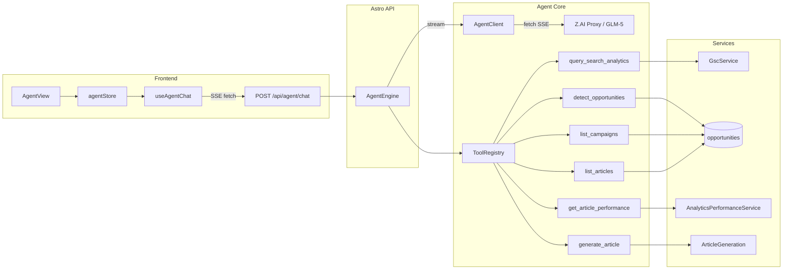

# PRD: AI Agent Orchestration System

**Complexity: 9 → HIGH mode** (10+ files, new system from scratch, external API integration, DB schema changes, complex state logic)

## Context

**Problem:** AutopilotRank has rich backend services (GSC, opportunity detection, article generation, performance analytics) but no intelligent orchestration layer to tie them together. Users must manually navigate between views to analyze data and take action. We need an AI agent that can query these services conversationally, find opportunities, and recommend actions — similar to the demand-sniffer project's architecture.

**Approach:** Port the demand-sniffer's agent pattern (streaming LLM + tool-use loop) to AutopilotRank, wrapping existing services as agent tools. Use raw `fetch()` against the Z.AI proxy (Anthropic-compatible API) instead of `@anthropic-ai/sdk` for Cloudflare Workers edge runtime compatibility.

## Architecture



**Key decisions:**
- **Raw fetch, no SDK** — `@anthropic-ai/sdk` uses Node.js patterns (streams, etc.) that don't work on Cloudflare Workers. Raw `fetch()` with manual SSE parsing is edge-compatible and simpler.
- **JSONB messages in session** — Single `agent_sessions` table with `messages JSONB` avoids a separate messages table. Simpler, fewer queries.
- **Tools wrap existing services** — No new business logic. Each tool delegates to existing services/queries with ownership enforcement.
- **Analysis-first, opt-in actions** — Agent freely queries/analyzes data but confirms before credit-consuming actions (article generation).

## Integration Points

| New Code | Connects To | How |
|----------|------------|-----|
| `AgentClient` | Z.AI proxy | Raw fetch with SSE parsing |
| `query_search_analytics` tool | `GscService` | `gscService.getSearchAnalytics()` |
| `detect_opportunities` tool | `opportunities` table | Direct Supabase query with ownership filter |
| `get_article_performance` tool | `AnalyticsPerformanceService` | `analyticsPerformanceService.getPerformanceData()` |
| `list_*` tools | Supabase tables | Direct queries with `user_id` filter |
| `POST /api/agent/chat` | Astro middleware | Auth via `getUserIdFromLocals` |
| `AgentView` | `DashboardRouter` | Registered in `dashboardRoutes.ts` |
| `useAgentChat` | `agentStore` + `/api/agent/chat` | Zustand + SSE fetch |

**User flow:**
1. User navigates to `/dashboard/agent` (new sidebar item)
2. Selects a project (or uses active project)
3. Types a question ("What are my best content opportunities?")
4. Agent streams response, calling tools as needed (GSC data, opportunities, performance)
5. Conversation persisted to `agent_sessions` table
6. User can continue conversation, start new sessions, or delete old ones

---

## Phase 1: Core Infrastructure (Agent Engine + Env Config)

**Outcome:** Agent core can send messages to Z.AI proxy and receive streamed responses. No tools yet — just chat.

**Files (5):**
- `shared/config/env.ts` — Add `AGENT_API_KEY`, `AGENT_BASE_URL`, `AGENT_MODEL` to serverEnvSchema
- `server/services/agent/agent.types.ts` — Core type definitions (messages, SSE events, context, sessions, workflow steps)
- `server/services/agent/agent-client.ts` — Low-level LLM client using raw `fetch()` + SSE parsing against Z.AI proxy
- `server/services/agent/prompt-registry.ts` — State-aware system prompt generator (5 workflow steps)
- `server/services/agent/agent-engine.ts` — Main agent loop: stream LLM → detect tool calls → execute → feed results → loop

**Key patterns:**
- `AgentClient.streamMessages()` — AsyncGenerator yielding parsed SSE events from Z.AI proxy
- `AgentEngine.chat()` — AsyncGenerator yielding `AgentSSEEvent` (text_delta, tool_start, tool_result, done, error)
- `MAX_TOOL_LOOPS = 10` safety limit to prevent infinite tool loops
- Prompt registry injects project context (name, domain, industry) and workflow step instructions

**Tests:**
| Test File | Test | Assertion |
|-----------|------|-----------|
| `server/services/agent/__tests__/agent-client.test.ts` | `should parse SSE stream correctly` | Yields correct event types from mocked fetch |
| `server/services/agent/__tests__/agent-client.test.ts` | `should handle API errors` | Throws on non-200 response |
| `server/services/agent/__tests__/agent-engine.test.ts` | `should yield text_delta events` | AsyncGenerator yields text events |
| `server/services/agent/__tests__/agent-engine.test.ts` | `should stop after MAX_TOOL_LOOPS` | Loop terminates at limit |
| `server/services/agent/__tests__/prompt-registry.test.ts` | `should include project context` | System prompt contains project name/domain |

---

## Phase 2: Tool Definitions and Execution

**Outcome:** 7 tools wrapping existing services, all enforcing ownership.

**Files (5):**
- `server/services/agent/tools/tool-registry.ts` — `IToolHandler` interface, `ToolRegistry` class (register, getDefinitions, executeTool)
- `server/services/agent/tools/search-analytics.tool.ts` — `query_search_analytics`: wraps `GscService.getSearchAnalytics()`
- `server/services/agent/tools/opportunities.tool.ts` — `detect_opportunities`: queries `opportunities` table with filters
- `server/services/agent/tools/data-tools.ts` — `list_projects`, `list_campaigns`, `list_articles`, `get_article_performance`
- `server/services/agent/tools/index.ts` — `createToolRegistry()` assembles all tools

**Key pattern — every tool:**
1. Receives `(input, context: IAgentContext)` where context has `userId` + `projectId`
2. Validates ownership via `.eq('user_id', context.userId)` on all queries
3. Returns data or `{ error: 'message' }` (never throws — errors are fed back to LLM)

**Tests:**
| Test File | Test | Assertion |
|-----------|------|-----------|
| `server/services/agent/tools/__tests__/tool-registry.test.ts` | `should register and execute tools` | Tool executes with correct input |
| `server/services/agent/tools/__tests__/tool-registry.test.ts` | `should throw for unknown tool` | Error on unregistered tool name |
| `server/services/agent/tools/__tests__/search-analytics.tool.test.ts` | `should return error when no GSC connection` | Returns error object, not throw |
| `server/services/agent/tools/__tests__/data-tools.test.ts` | `should enforce user_id ownership` | Queries include userId filter |

---

## Phase 3: Database (Migration + Session Service)

**Outcome:** `agent_sessions` table with RLS and CRUD service.

**Files (2):**
- `supabase/migrations/20260227200000_create_agent_sessions.sql` — Table, indexes, RLS policies, updated_at trigger
- `server/services/agent/session.service.ts` — `AgentSessionService` (list, getById, create, updateMessages, delete)

**Schema:**
```sql
agent_sessions (
  id UUID PK DEFAULT gen_random_uuid(),
  user_id UUID NOT NULL REFERENCES profiles(id) ON DELETE CASCADE,
  project_id UUID NOT NULL REFERENCES projects(id) ON DELETE CASCADE,
  title TEXT NOT NULL DEFAULT 'New Chat',
  messages JSONB NOT NULL DEFAULT '[]',
  workflow_step TEXT NOT NULL DEFAULT 'understanding',
  created_at TIMESTAMPTZ NOT NULL DEFAULT NOW(),
  updated_at TIMESTAMPTZ NOT NULL DEFAULT NOW()
)
INDEX: (user_id, project_id, updated_at DESC)
RLS: user can only CRUD own rows + service_role full access
```

**Tests:**
| Test File | Test | Assertion |
|-----------|------|-----------|
| `server/services/agent/__tests__/session.service.test.ts` | `should create and retrieve session` | Round-trips correctly |
| `server/services/agent/__tests__/session.service.test.ts` | `should update messages as JSONB` | Messages persist and parse |
| `server/services/agent/__tests__/session.service.test.ts` | `should auto-title from first message` | Title updates on first chat |

---

## Phase 4: API Routes (SSE Streaming + Session CRUD)

**Outcome:** Working SSE chat endpoint and session management APIs.

**Files (3):**
- `src/pages/api/agent/chat.ts` — `POST /api/agent/chat` SSE streaming (auth, validation, project ownership, session load/create, engine.chat → ReadableStream)
- `src/pages/api/agent/sessions/index.ts` — `GET` (list by project) + `POST` (create session)
- `src/pages/api/agent/sessions/[sessionId].ts` — `GET` (with messages) + `DELETE`

**SSE endpoint pattern:**
```typescript
// Returns raw Response with ReadableStream (not jsonResponse wrapper)
const stream = new ReadableStream({
  async start(controller) {
    const encoder = new TextEncoder();
    // First event: session ID
    controller.enqueue(encoder.encode(`data: ${JSON.stringify({ type: 'session', id })}\n\n`));
    // Stream agent events
    for await (const event of engine.chat(messages, context)) {
      controller.enqueue(encoder.encode(`data: ${JSON.stringify(event)}\n\n`));
    }
    // Persist conversation after completion
    await agentSessionService.updateMessages(sessionId, userId, updatedMessages);
    controller.close();
  }
});
return new Response(stream, {
  headers: { 'Content-Type': 'text/event-stream', 'Cache-Control': 'no-cache' }
});
```

**Tests:**
| Test File | Test | Assertion |
|-----------|------|-----------|
| `server/services/agent/__tests__/chat-route.test.ts` | `should return 401 without auth` | Status 401 |
| `server/services/agent/__tests__/chat-route.test.ts` | `should return 404 for invalid project` | Status 404 |
| `server/services/agent/__tests__/chat-route.test.ts` | `should stream SSE events` | Response has text/event-stream content type |

---

## Phase 5: Frontend (Chat UI + Zustand Store + Dashboard Integration)

**Outcome:** Chat interface accessible from dashboard sidebar with streaming message display.

**Files (5):**
- `client/store/agentStore.ts` — Zustand store: messages, streaming state, sessions, actions (addMessage, appendStreamingText, finalizeAssistantMessage, updateToolStatus)
- `client/hooks/useAgentChat.ts` — Hook: sends message via fetch, parses SSE stream, updates store
- `client/components/dashboard/views/AgentView.tsx` — Main chat view: message list, streaming bubble, input form, empty state
- `client/components/pages/AgentPageClient.tsx` — Page wrapper (follows existing pattern)
- `client/config/dashboardRoutes.ts` — Add `/dashboard/agent` route with `Bot` icon in primary group

**SSE consumption pattern (in useAgentChat):**
```typescript
const reader = response.body.getReader();
const decoder = new TextDecoder();
let buffer = '';
while (true) {
  const { done, value } = await reader.read();
  if (done) break;
  buffer += decoder.decode(value, { stream: true });
  const lines = buffer.split('\n\n');
  buffer = lines.pop() ?? '';
  for (const line of lines) {
    if (!line.startsWith('data: ')) continue;
    const event = JSON.parse(line.slice(6));
    // Route event to store actions...
  }
}
```

**Tests:**
| Test File | Test | Assertion |
|-----------|------|-----------|
| `client/store/__tests__/agentStore.test.ts` | `should add and finalize messages` | Messages array updates correctly |
| `client/store/__tests__/agentStore.test.ts` | `should accumulate streaming text` | streamingText concatenates deltas |

---

## Environment Variables

Add to `.env.api`:
```
AGENT_API_KEY=<z.ai api key>
AGENT_BASE_URL=https://api.z.ai/api/anthropic
AGENT_MODEL=glm-5
```

## Cloudflare Workers Compatibility

The 10ms CPU limit is respected because:
- LLM calls = I/O (HTTP fetch to Z.AI) — zero CPU
- Supabase queries = I/O (HTTP fetch) — zero CPU
- GSC API calls = I/O (HTTP fetch) — zero CPU
- SSE encoding = `JSON.stringify` + `TextEncoder` — microseconds
- Streaming extends wall-clock time; each CPU burst between I/O is well under 10ms

## Files Summary

| # | File | Action |
|---|------|--------|
| 1 | `shared/config/env.ts` | MODIFY (add 3 env vars) |
| 2 | `server/services/agent/agent.types.ts` | CREATE |
| 3 | `server/services/agent/agent-client.ts` | CREATE |
| 4 | `server/services/agent/prompt-registry.ts` | CREATE |
| 5 | `server/services/agent/agent-engine.ts` | CREATE |
| 6 | `server/services/agent/tools/tool-registry.ts` | CREATE |
| 7 | `server/services/agent/tools/search-analytics.tool.ts` | CREATE |
| 8 | `server/services/agent/tools/opportunities.tool.ts` | CREATE |
| 9 | `server/services/agent/tools/data-tools.ts` | CREATE |
| 10 | `server/services/agent/tools/index.ts` | CREATE |
| 11 | `supabase/migrations/20260227200000_create_agent_sessions.sql` | CREATE |
| 12 | `server/services/agent/session.service.ts` | CREATE |
| 13 | `src/pages/api/agent/chat.ts` | CREATE |
| 14 | `src/pages/api/agent/sessions/index.ts` | CREATE |
| 15 | `src/pages/api/agent/sessions/[sessionId].ts` | CREATE |
| 16 | `client/store/agentStore.ts` | CREATE |
| 17 | `client/hooks/useAgentChat.ts` | CREATE |
| 18 | `client/components/dashboard/views/AgentView.tsx` | CREATE |
| 19 | `client/components/pages/AgentPageClient.tsx` | CREATE |
| 20 | `client/config/dashboardRoutes.ts` | MODIFY (add route) |

## Acceptance Criteria

- [ ] All 5 phases complete with passing tests
- [ ] `yarn verify` passes
- [ ] Agent can query GSC data and display results in streaming chat
- [ ] Agent can detect and explain SEO opportunities
- [ ] Agent can show article/campaign performance
- [ ] Chat sessions persist across page reloads
- [ ] Agent route visible in dashboard sidebar
- [ ] All DB queries enforce user ownership (RLS + code-level)
- [ ] Works on Cloudflare Workers (no Node.js-specific APIs)
