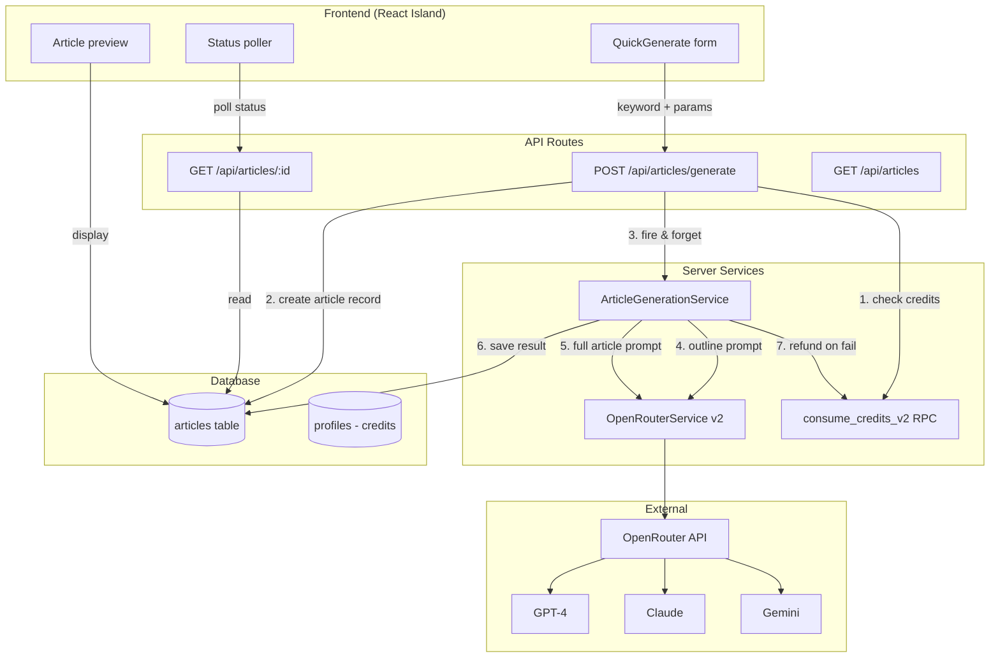
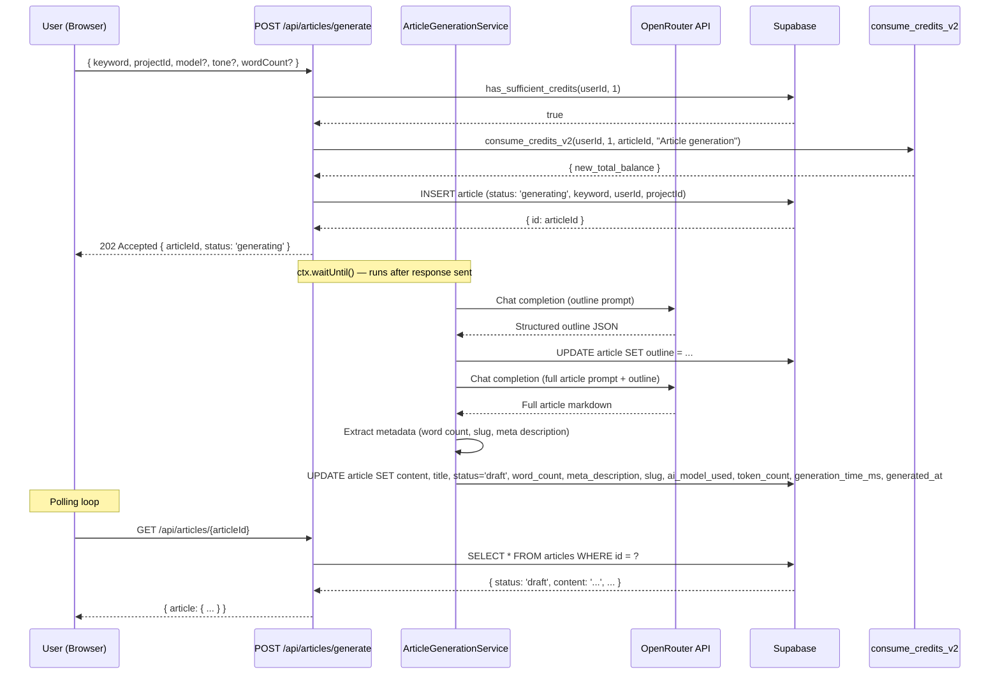
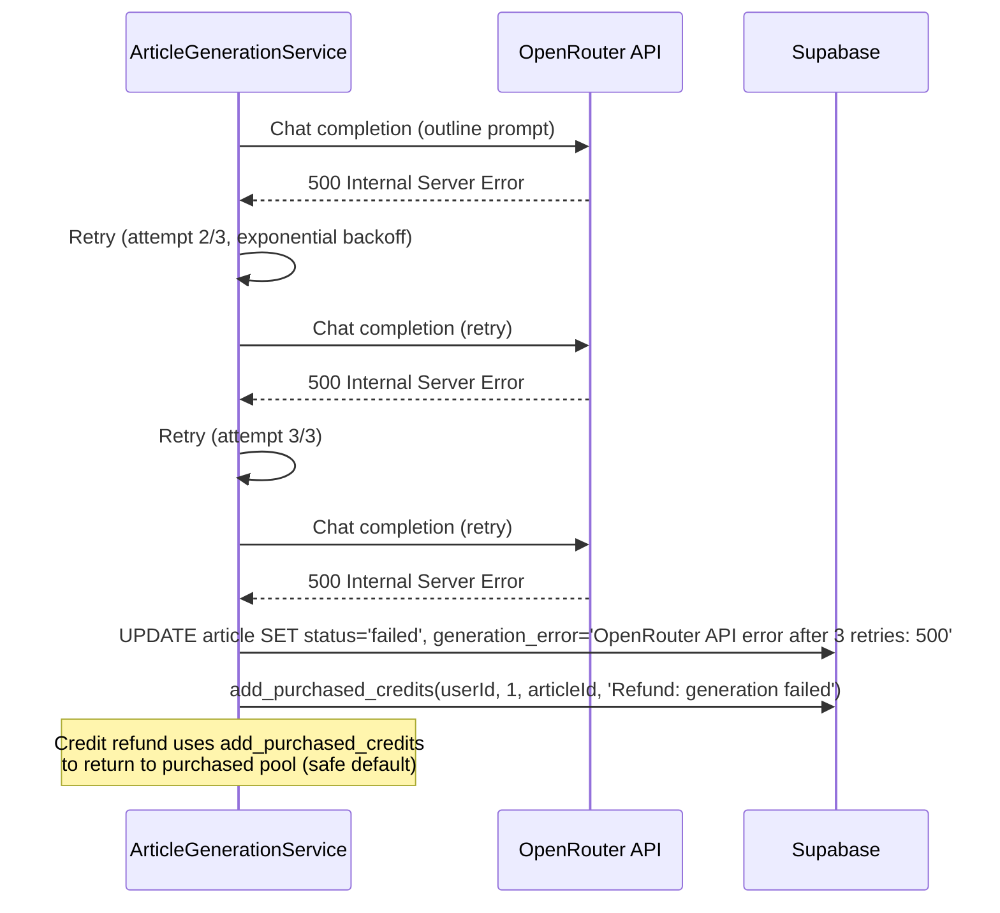

# PRD: AI Content Generation Engine

**Status:** Active
**Complexity:** 8 → HIGH mode
**Milestone:** M2 (core product — OpenRouter integration + article generation pipeline)
**Author:** Claude (Principal Architect)
**Date:** 2026-02-05

---

## 1. Context

**Problem:** The core product functionality doesn't exist yet. Users can register projects (M2 prereq, in progress) but cannot generate any content. The entire value proposition — "AI SEO articles from keywords" — is unbuilt. Everything downstream (humanizer, campaigns, publishing) depends on this engine being operational.

**Dependency Chain:**

```
M1 Foundation (DB tables) ✅
    ↓
M2 Project Management (in progress)
    ↓
→ AI Content Generation Engine (THIS PRD)
    ↓
M3 Humanizer (post-processes generated articles)
M4 Campaign Management UI (triggers bulk generation)
M6 WordPress Publishing (publishes generated articles)
```

**Current State:**

- `articles` table exists with columns: `id`, `campaign_id`, `user_id`, `title`, `content`, `primary_keyword`, `status`, `ai_model_used`, `seo_score`, `ai_detection_score`, `word_count`, `meta_description`, `published_url`, `slug`, `credits_used`, `generation_error`, `generated_at`, `published_at`
- `campaigns` table exists with: `ai_model`, `tone`, `target_word_count`, `settings` JSONB
- `projects` table exists with `content_preferences` JSONB (tone, frequency)
- `OpenRouterService` already exists in `server/services/openrouter.service.ts` but only handles vision-language image analysis — **not text generation**
- `OPENROUTER_API_KEY` and `OPENROUTER_VL_MODEL` already in `serverEnv`
- Credit system fully operational: `consume_credits_v2` RPC, `has_sufficient_credits` check, two-pool FIFO consumption
- No article generation code, no generation UI, no generation API endpoints

**Target State:**

- Users can generate an SEO-optimized article from a keyword + parameters
- Generation uses OpenRouter API to route to GPT-4, Claude, or Gemini
- Pipeline: keyword → structured outline → full article with headings, meta description, slug
- Articles stored with metadata (model used, token count, generation time)
- 1 credit deducted per generation; refunded on failure
- Async generation with status polling (article status: `queued` → `generating` → `draft` or `failed`)
- Simple "Generate Article" UI in dashboard to test the pipeline end-to-end

**Files Analyzed:**

| File | Purpose |
| --- | --- |
| `server/services/openrouter.service.ts` | Existing OpenRouter client (VL only) |
| `shared/config/env.ts` | Env vars — `OPENROUTER_API_KEY`, `OPENROUTER_VL_MODEL` already defined |
| `shared/config/credits.config.ts` | Credit costs — `API_CALL: 1` (1 credit = 1 article) |
| `shared/config/subscription.config.ts` | Plan limits, batch limits per tier |
| `supabase/migrations/20260205100200_create_articles_table.sql` | Articles schema |
| `supabase/migrations/20260205100100_create_campaigns_table.sql` | Campaigns schema (ai_model, tone, target_word_count) |
| `supabase/migrations/20251205030000_update_credit_rpcs.sql` | `consume_credits_v2`, `has_sufficient_credits` RPCs |
| `shared/utils/errors.ts` | `AppError`, `ErrorCodes` (includes `INSUFFICIENT_CREDITS`, `AI_UNAVAILABLE`) |
| `src/pages/api/_utils.ts` | `getUserIdFromLocals`, `jsonResponse`, `errorResponse`, `getBody` |
| `server/services/project.service.ts` | Service pattern — class with singleton export |

---

## 2. Solution

**Approach:**

1. Extend the existing `OpenRouterService` to support text chat completions (not just vision) with model selection, retries, and streaming support
2. Create an `ArticleGenerationService` that orchestrates: credit check → credit deduction → outline generation → full article generation → metadata extraction → article storage → credit refund on failure
3. Create API endpoints for article generation (`POST /api/articles/generate`) and status polling (`GET /api/articles/:id`)
4. Add a new `OPENROUTER_TEXT_MODEL` env var for the default text generation model (separate from VL model)
5. Build a minimal "Quick Generate" UI in the dashboard so users can test the pipeline — a form with keyword + settings → submit → poll for result
6. **Critical constraint: Cloudflare Workers 10ms CPU limit.** The generation CANNOT happen synchronously in a request handler. We must use a "fire-and-forget" pattern: the API creates the article record with `status: queued`, then kicks off generation in a non-blocking way. The client polls for completion.

**Architecture:**



**Key Decisions:**

- **OpenRouter for all models.** Single API integration that routes to GPT-4, Claude, Gemini. No direct provider SDKs. Simpler to maintain, one API key, one error handling path.
- **Two-step generation: outline → article.** First call generates a structured outline (headings, subheadings, key points). Second call uses that outline to write the full article. This produces significantly better-structured SEO content than a single prompt.
- **`waitUntil()` for background execution.** Cloudflare Workers support `ctx.waitUntil(promise)` which keeps the worker alive after the response is sent. The API handler returns immediately with the article ID, then `waitUntil` runs the actual generation. This avoids the 10ms CPU limit for the response while still running generation in the same request context.
- **No separate queue system for MVP.** We don't need Redis/SQS/etc. `waitUntil()` handles single article generation fine. Bulk generation queuing comes in M4 (Campaign Management).
- **Model selection: `auto` (default) or user choice.** `auto` routes to the best cost/quality model via OpenRouter's auto-router. Users can also pick a specific model from a curated list.
- **Retry with exponential backoff.** OpenRouter can return 429 (rate limit) or 5xx. Retry up to 3 times with backoff. On final failure, mark article as `failed` and refund credit.

**Data Changes:**

New migration to add columns needed for generation tracking:

```sql
ALTER TABLE public.articles
  ADD COLUMN IF NOT EXISTS outline JSONB,
  ADD COLUMN IF NOT EXISTS token_count INTEGER CHECK (token_count >= 0),
  ADD COLUMN IF NOT EXISTS generation_time_ms INTEGER CHECK (generation_time_ms >= 0),
  ADD COLUMN IF NOT EXISTS project_id UUID REFERENCES public.projects(id) ON DELETE SET NULL;

CREATE INDEX IF NOT EXISTS idx_articles_project_id ON public.articles(project_id);
```

**New env vars:**

```
OPENROUTER_TEXT_MODEL=openai/gpt-4o  # Default text gen model (user can override)
```

---

## 3. Sequence Flows

### Single Article Generation (Happy Path)



### Generation Failure (Credit Refund)



---

## 4. Execution Phases

### Integration Points Checklist

```
How will this feature be reached?
- [x] Entry point: POST /api/articles/generate (API endpoint)
- [x] Entry point: GET /api/articles/:id (status polling)
- [x] Entry point: "Quick Generate" button in dashboard overview
- [x] Caller: Dashboard QuickGenerate component → POST /api/articles/generate
- [x] Caller: QuickGenerate component polls GET /api/articles/:id every 3s

Is this user-facing?
- [x] YES → QuickGenerate form in dashboard
- [x] YES → Article status indicator (generating → draft)
- [x] YES → Generated article preview

Full user flow:
1. User has at least one project (from Project Management)
2. User clicks "Generate Article" in dashboard overview
3. Form appears: keyword input, model selector, tone, word count
4. User enters keyword, clicks "Generate"
5. API deducts 1 credit, creates article with status 'generating'
6. UI shows "Generating..." with progress indicator
7. Client polls every 3s for article status
8. When status = 'draft', UI shows the generated article preview
9. If status = 'failed', UI shows error message, credit already refunded
```

---

#### Phase 1: Database Migration — Add generation tracking columns to articles

**Files (1):**

- `supabase/migrations/20260206100000_add_article_generation_columns.sql`

**Implementation:**

- [ ] Add `outline` column (JSONB, nullable) — stores the structured outline between generation steps
- [ ] Add `token_count` column (INTEGER, nullable, CHECK >= 0) — total tokens used across all LLM calls
- [ ] Add `generation_time_ms` column (INTEGER, nullable, CHECK >= 0) — wall-clock time of full generation
- [ ] Add `project_id` column (UUID, nullable, FK → projects ON DELETE SET NULL) — link article to a project (nullable because campaigns already link to projects, but direct link is useful for quick-generate without campaign)
- [ ] Add index on `project_id`

**SQL:**

```sql
-- Add generation tracking columns to articles table
ALTER TABLE public.articles
  ADD COLUMN IF NOT EXISTS outline JSONB,
  ADD COLUMN IF NOT EXISTS token_count INTEGER CHECK (token_count >= 0),
  ADD COLUMN IF NOT EXISTS generation_time_ms INTEGER CHECK (generation_time_ms >= 0),
  ADD COLUMN IF NOT EXISTS project_id UUID REFERENCES public.projects(id) ON DELETE SET NULL;

CREATE INDEX IF NOT EXISTS idx_articles_project_id ON public.articles(project_id);

COMMENT ON COLUMN public.articles.outline IS 'Structured outline generated in first LLM call (JSON: headings, subheadings, key points)';
COMMENT ON COLUMN public.articles.token_count IS 'Total tokens used across all LLM calls for this article';
COMMENT ON COLUMN public.articles.generation_time_ms IS 'Total generation wall-clock time in milliseconds';
COMMENT ON COLUMN public.articles.project_id IS 'Project this article belongs to (nullable, direct link for quick-generate)';
```

**Verification Plan:**

1. **Migration test:**
   ```bash
   npx supabase db push
   # Migration applies without errors
   ```

---

#### Phase 2: OpenRouterService v2 — Extend for text chat completions

**Files (3):**

- `server/services/openrouter.service.ts` — Extend with `chatCompletion()` method
- `shared/types/article.types.ts` — Article and generation types
- `server/services/__tests__/openrouter.service.test.ts` — Unit tests

**Implementation:**

- [ ] Add `OPENROUTER_TEXT_MODEL` to env schema (`shared/config/env.ts`):
  ```typescript
  OPENROUTER_TEXT_MODEL: z.string().default('openai/gpt-4o'),
  ```
  And to `loadServerEnv()`:
  ```typescript
  OPENROUTER_TEXT_MODEL: import.meta.env.OPENROUTER_TEXT_MODEL || 'openai/gpt-4o',
  ```

- [ ] Define supported models config in `shared/config/ai-models.config.ts`:
  ```typescript
  export const AI_MODELS = {
    'openai/gpt-4o': { name: 'GPT-4o', provider: 'OpenAI', tier: 'all' },
    'openai/gpt-4o-mini': { name: 'GPT-4o Mini', provider: 'OpenAI', tier: 'all' },
    'anthropic/claude-sonnet-4-5': { name: 'Claude Sonnet 4.5', provider: 'Anthropic', tier: 'all' },
    'google/gemini-2.0-flash': { name: 'Gemini 2.0 Flash', provider: 'Google', tier: 'all' },
    'openrouter/auto': { name: 'Auto (Best Match)', provider: 'OpenRouter', tier: 'all' },
  } as const;

  export type AIModelId = keyof typeof AI_MODELS;
  export const DEFAULT_MODEL: AIModelId = 'openai/gpt-4o';
  export const MODEL_IDS = Object.keys(AI_MODELS) as AIModelId[];
  ```

- [ ] Add `chatCompletion()` method to `OpenRouterService`:
  ```typescript
  interface IChatCompletionParams {
    model: string;
    messages: Array<{ role: 'system' | 'user' | 'assistant'; content: string }>;
    maxTokens?: number;
    temperature?: number;
    responseFormat?: { type: 'json_object' } | { type: 'text' };
  }

  interface IChatCompletionResult {
    content: string;
    model: string;
    usage: { promptTokens: number; completionTokens: number; totalTokens: number };
    finishReason: string;
  }

  async chatCompletion(params: IChatCompletionParams): Promise<IChatCompletionResult>
  ```
  - Uses `fetch` to call `https://openrouter.ai/api/v1/chat/completions`
  - Sends headers: `Authorization: Bearer {apiKey}`, `Content-Type: application/json`, `HTTP-Referer`, `X-Title`
  - Maps response to `IChatCompletionResult`
  - Throws `AppError` with `AI_UNAVAILABLE` on API errors

- [ ] Add retry logic with exponential backoff:
  ```typescript
  async chatCompletionWithRetry(
    params: IChatCompletionParams,
    maxRetries: number = 3,
    baseDelayMs: number = 1000
  ): Promise<IChatCompletionResult>
  ```
  - Retries on 429 (rate limit), 500, 502, 503, 504
  - Does NOT retry on 400, 401, 403 (client errors)
  - Exponential backoff: delay * 2^attempt (1s, 2s, 4s)
  - Logs each retry attempt

- [ ] Define article types in `shared/types/article.types.ts`:
  ```typescript
  export type ArticleStatus = 'queued' | 'generating' | 'draft' | 'reviewed' | 'published' | 'failed';

  export interface IArticle {
    id: string;
    campaign_id: string;
    user_id: string;
    project_id: string | null;
    title: string | null;
    content: string | null;
    primary_keyword: string;
    status: ArticleStatus;
    ai_model_used: string | null;
    seo_score: number | null;
    ai_detection_score: number | null;
    word_count: number | null;
    meta_description: string | null;
    published_url: string | null;
    slug: string | null;
    credits_used: number;
    generation_error: string | null;
    outline: IArticleOutline | null;
    token_count: number | null;
    generation_time_ms: number | null;
    generated_at: string | null;
    published_at: string | null;
    created_at: string;
    updated_at: string;
  }

  export interface IArticleOutline {
    title: string;
    metaDescription: string;
    slug: string;
    sections: Array<{
      heading: string;
      subheadings?: string[];
      keyPoints: string[];
    }>;
  }

  export interface IGenerateArticleInput {
    keyword: string;
    projectId: string;
    model?: string;       // OpenRouter model ID, defaults to config
    tone?: string;        // professional, casual, witty, academic
    targetWordCount?: number; // 800-3000, default 1500
  }

  export interface IGenerateArticleResponse {
    articleId: string;
    status: 'generating';
  }

  export interface IArticleResponse {
    article: IArticle;
  }
  ```

**Tests Required:**

| Test File | Test Name | Assertion |
|-----------|-----------|-----------|
| `server/services/__tests__/openrouter.service.test.ts` | `should call chat completions API with correct params` | Request body matches expected format |
| | `should return parsed response with usage stats` | Result includes content, model, usage |
| | `should throw AppError AI_UNAVAILABLE on 500` | Throws with correct error code |
| | `should retry on 429 and succeed on second attempt` | Calls fetch twice, returns result |
| | `should retry with exponential backoff` | Delays increase between retries |
| | `should not retry on 400 errors` | Calls fetch once, throws immediately |
| | `should throw after max retries exhausted` | Calls fetch 3 times, throws |
| | `should validate model is in allowed list` | Throws on unknown model ID |

**Verification Plan:**

```bash
yarn test server/services/__tests__/openrouter.service.test.ts
# All tests pass
```

---

#### Phase 3: ArticleGenerationService — Core generation pipeline

**Files (3):**

- `server/services/article-generation.service.ts` — Orchestrates the full pipeline
- `server/services/prompts/article-prompts.ts` — Prompt templates for outline and article generation
- `server/services/__tests__/article-generation.service.test.ts` — Unit tests

**Implementation:**

- [ ] Create prompt templates in `server/services/prompts/article-prompts.ts`:

  **Outline prompt** — system message instructs the model to generate a structured JSON outline:
  ```
  You are an expert SEO content strategist. Generate a structured article outline for the given keyword.
  The outline must be optimized for search engine ranking.

  Requirements:
  - Title: Compelling, keyword-rich, 50-60 characters
  - Meta description: 150-160 characters, includes keyword
  - Slug: URL-friendly, includes keyword
  - 4-8 sections with H2 headings
  - Each section has 2-3 key points to cover
  - Include an introduction section and conclusion
  - Naturally incorporate the primary keyword and related terms

  Respond with ONLY valid JSON matching this schema:
  { title, metaDescription, slug, sections: [{ heading, subheadings?, keyPoints }] }
  ```

  **Article prompt** — system message instructs the model to write the full article from the outline:
  ```
  You are an expert SEO content writer. Write a comprehensive, well-researched article following the provided outline.

  Requirements:
  - Write in {tone} tone
  - Target approximately {wordCount} words
  - Use the exact headings from the outline as H2/H3 markdown headers
  - Include the primary keyword naturally 3-5 times
  - Write engaging introductions and conclusions
  - Use short paragraphs (2-3 sentences)
  - Include transition sentences between sections
  - Write in markdown format
  - Do NOT include the title as an H1 (it's handled separately)
  ```

- [ ] Create `ArticleGenerationService` class:

  ```typescript
  export class ArticleGenerationService {
    constructor(
      private openRouter: OpenRouterService,
      private supabase: SupabaseClient
    ) {}

    async generateArticle(
      articleId: string,
      userId: string,
      input: IGenerateArticleInput
    ): Promise<void>
  }
  ```

  **`generateArticle()` pipeline:**
  1. Update article status to `'generating'`
  2. Record start time
  3. **Step 1 — Generate outline:**
     - Call `openRouter.chatCompletionWithRetry()` with outline prompt
     - Parse JSON response into `IArticleOutline`
     - Save outline to article record
  4. **Step 2 — Generate full article:**
     - Call `openRouter.chatCompletionWithRetry()` with article prompt + outline context
     - Get full markdown content
  5. **Step 3 — Extract metadata:**
     - Count words from markdown content
     - Title and meta description from outline
     - Slug from outline
     - Sum token usage from both calls
     - Calculate generation time (Date.now() - startTime)
  6. **Step 4 — Save result:**
     - Update article: `status='draft'`, `content`, `title`, `meta_description`, `slug`, `word_count`, `ai_model_used`, `token_count`, `generation_time_ms`, `generated_at=NOW()`
  7. **On any error:**
     - Update article: `status='failed'`, `generation_error=errorMessage`
     - Refund credit: call `add_purchased_credits(userId, 1, articleId, 'Refund: generation failed')`
     - Log error with structured logger

- [ ] Export singleton:
  ```typescript
  export const articleGenerationService = new ArticleGenerationService(
    openRouterService,
    supabaseAdmin
  );
  ```

**Tests Required:**

| Test File | Test Name | Assertion |
|-----------|-----------|-----------|
| `server/services/__tests__/article-generation.service.test.ts` | `should generate outline and full article` | Both LLM calls made, article updated to draft |
| | `should extract word count from markdown content` | word_count matches actual count |
| | `should save outline JSON to article record` | outline column populated |
| | `should set generated_at timestamp` | generated_at is not null |
| | `should record token usage from both calls` | token_count = sum of both calls |
| | `should record generation time` | generation_time_ms > 0 |
| | `should refund credit on outline generation failure` | add_purchased_credits called with 1 |
| | `should refund credit on article generation failure` | add_purchased_credits called with 1 |
| | `should set status to failed with error message` | status='failed', generation_error set |
| | `should use project tone when not explicitly provided` | Falls back to project content_preferences |

**Verification Plan:**

```bash
yarn test server/services/__tests__/article-generation.service.test.ts
# All tests pass
```

---

#### Phase 4: API Endpoints — Generate article + status polling + article listing

**Files (3):**

- `src/pages/api/articles/generate.ts` — POST endpoint to trigger generation
- `src/pages/api/articles/[articleId]/index.ts` — GET endpoint for article details
- `src/pages/api/articles/index.ts` — GET endpoint to list user's articles

**Implementation:**

- [ ] `POST /api/articles/generate`:
  - Auth required via `getUserIdFromLocals(locals)`
  - Validate body with Zod schema:
    ```typescript
    const generateSchema = z.object({
      keyword: z.string().min(1).max(200).trim(),
      projectId: z.string().uuid(),
      model: z.string().optional(),
      tone: z.enum(['professional', 'casual', 'witty', 'academic']).optional(),
      targetWordCount: z.number().int().min(800).max(3000).optional().default(1500),
    });
    ```
  - Verify project belongs to user (via projectService)
  - Check credits: `has_sufficient_credits(userId, 1)`
  - Deduct credit: `consume_credits_v2(userId, 1, articleId, 'Article generation')`
  - Create a "scaffold" campaign for quick-generate (or use a default campaign per project)
  - Insert article record with `status: 'generating'`
  - Use Astro's `locals.runtime.ctx.waitUntil()` to run generation in background:
    ```typescript
    const ctx = locals.runtime?.ctx;
    if (ctx?.waitUntil) {
      ctx.waitUntil(articleGenerationService.generateArticle(articleId, userId, input));
    } else {
      // Fallback for dev: run async without waiting
      articleGenerationService.generateArticle(articleId, userId, input).catch(/* log */);
    }
    ```
  - Return `202 Accepted` with `{ articleId, status: 'generating' }`

- [ ] `GET /api/articles/:articleId`:
  - Auth required
  - Fetch article by ID, enforce `user_id` match
  - Return full article data
  - 404 if not found or not owned

- [ ] `GET /api/articles`:
  - Auth required
  - Optional query params: `projectId`, `status`, `limit` (default 20), `offset` (default 0)
  - Returns `{ articles: IArticle[], total: number }`
  - Ordered by `created_at DESC`

- [ ] Handle the "default campaign" for quick-generate:
  - When generating without an explicit campaign, auto-create or reuse a "Quick Generate" campaign for the project
  - This satisfies the `campaign_id NOT NULL` constraint on articles
  - Pattern: `upsert` a campaign with `name: 'Quick Generate'` + `project_id` + `user_id`

**Tests Required:**

| Test File | Test Name | Assertion |
|-----------|-----------|-----------|
| Manual curl | `POST /api/articles/generate` happy path | Returns 202 with articleId |
| Manual curl | `POST /api/articles/generate` insufficient credits | Returns 402 |
| Manual curl | `POST /api/articles/generate` invalid keyword (empty) | Returns 400 |
| Manual curl | `POST /api/articles/generate` project not owned | Returns 404 |
| Manual curl | `GET /api/articles/:id` | Returns article with current status |
| Manual curl | `GET /api/articles?projectId=...` | Returns filtered list |

**Verification Plan:**

```bash
# Happy path
curl -X POST http://localhost:4321/api/articles/generate \
  -H "Authorization: Bearer $TOKEN" \
  -H "Content-Type: application/json" \
  -d '{"keyword":"best project management tools 2026","projectId":"<uuid>"}' | jq .
# Expected: { "success": true, "data": { "articleId": "...", "status": "generating" } }

# Poll for result
curl -H "Authorization: Bearer $TOKEN" \
  http://localhost:4321/api/articles/<articleId> | jq .
# Expected: { "success": true, "data": { "article": { "status": "draft", "content": "...", ... } } }

# Insufficient credits
curl -X POST http://localhost:4321/api/articles/generate \
  -H "Authorization: Bearer $TOKEN" \
  -H "Content-Type: application/json" \
  -d '{"keyword":"test","projectId":"<uuid>"}' | jq .
# Expected: { "success": false, "error": { "code": "INSUFFICIENT_CREDITS", ... } }
```

---

#### Phase 5: Quick Generate UI — Dashboard form for article generation

**Files (4):**

- `client/components/articles/QuickGenerate.tsx` — Generation form component
- `client/components/articles/ArticlePreview.tsx` — Generated article display
- `client/hooks/useArticleGeneration.ts` — React hook for generation + polling
- `client/components/articles/__tests__/QuickGenerate.test.tsx` — Component tests

**Implementation:**

- [ ] `useArticleGeneration` hook:
  ```typescript
  interface IUseArticleGeneration {
    generate: (input: IGenerateArticleInput) => Promise<void>;
    article: IArticle | null;
    isGenerating: boolean;
    error: string | null;
    reset: () => void;
  }
  ```
  - Uses `useMutation` for the POST call
  - On success (202), starts polling `GET /api/articles/:id` every 3 seconds
  - Stops polling when `status !== 'generating'`
  - Uses `useQuery` with `refetchInterval` for polling:
    ```typescript
    const { data } = useQuery({
      queryKey: ['article', articleId],
      queryFn: () => fetchArticle(articleId),
      enabled: !!articleId,
      refetchInterval: (query) =>
        query.state.data?.status === 'generating' ? 3000 : false,
    });
    ```

- [ ] `QuickGenerate` component:
  - Form fields (React Hook Form + Zod):
    - **Keyword** (text input, required) — "Enter your target keyword or topic"
    - **AI Model** (select) — dropdown of supported models from `AI_MODELS` config, default "Auto (Best Match)"
    - **Tone** (select) — Professional, Casual, Witty, Academic — defaults to project's content_preferences.tone
    - **Target Word Count** (select) — 800, 1200, 1500, 2000, 2500, 3000 — default 1500
  - Submit button: "Generate Article (1 credit)"
  - Uses active project from `useProjects` hook
  - Disabled if no active project (shows "Create a project first")

- [ ] Generation states in UI:
  - **Idle:** Form visible, ready to submit
  - **Generating:** Form disabled, show progress indicator with "Generating your article..." message and animated spinner. Show elapsed time.
  - **Success:** Show `ArticlePreview` with generated content
  - **Failed:** Show error message with "Try Again" button. Note that credit was refunded.

- [ ] `ArticlePreview` component:
  - Renders article title as H1
  - Shows metadata badges: word count, model used, generation time, token count
  - Renders markdown content (use a simple markdown-to-HTML renderer or `dangerouslySetInnerHTML` with sanitization)
  - Shows meta description in a highlighted box
  - "Generate Another" button to reset form

- [ ] Dashboard integration:
  - Add QuickGenerate to the dashboard Overview view
  - Position: main content area, below the project overview cards
  - Only visible when user has at least one project

**Tests Required:**

| Test File | Test Name | Assertion |
|-----------|-----------|-----------|
| `client/components/articles/__tests__/QuickGenerate.test.tsx` | `should render form with keyword input` | Keyword input visible |
| | `should disable submit when no project active` | Button disabled, helper text shown |
| | `should show generating state after submit` | Spinner visible, form disabled |
| | `should show article preview on success` | Article content rendered |
| | `should show error state on failure` | Error message + "Try Again" button |
| | `should show credit refund note on failure` | "Credit has been refunded" text |
| | `should default tone from project preferences` | Tone select matches project config |

**Verification Plan:**

```bash
yarn test client/components/articles/
# All tests pass

yarn dev
# Visit /dashboard
# See QuickGenerate form
# Enter keyword → click Generate
# See generating state → article preview
```

---

#### Phase 6: Wiring, i18n & Polish — Connect everything, handle edge cases

**Files (3-4):**

- `client/components/dashboard/views/OverviewView.tsx` — Add QuickGenerate section
- i18n locale files (`locales/en/dashboard.json` or similar) — Add generation strings
- `shared/config/env.ts` — Add `OPENROUTER_TEXT_MODEL` (already listed in Phase 2 but wired here)
- `shared/config/ai-models.config.ts` — (already created in Phase 2)

**Implementation:**

- [ ] Wire `QuickGenerate` into the dashboard OverviewView
- [ ] Add all i18n strings for:
  - Form labels and placeholders
  - Generation status messages
  - Error messages
  - Article preview labels
- [ ] Handle edge cases:
  - User navigates away during generation → article still generates, visible on return via article list
  - Multiple simultaneous generations → each gets its own article ID, poll independently (but MVP allows only one at a time)
  - Credit balance shown in form ("You have X credits remaining")
  - Model not available on OpenRouter → graceful fallback error message
- [ ] Add `GENERATION_IN_PROGRESS` error code to prevent double-submission (check if user already has an article with `status='generating'` for the same keyword)
- [ ] Rate limit generation: max 5 generations per minute per user (use existing rate limiting pattern)

**Verification Plan:**

```bash
yarn verify
# Full verification pass — types, lint, tests all pass
```

---

## 5. Checkpoint Protocol

All phases use automated checkpoints (spawn `prd-work-reviewer` agent after each phase).

Phases requiring **additional manual verification**:
- **Phase 4** (API endpoints) — curl commands to verify real API responses
- **Phase 5** (UI) — visual verification of generation flow in browser

---

## 6. Acceptance Criteria

- [ ] Users can generate an SEO article from a keyword via the dashboard
- [ ] Generation uses OpenRouter API with configurable model selection
- [ ] Two-step pipeline: structured outline → full article
- [ ] Articles stored with full metadata (model, tokens, time, outline)
- [ ] 1 credit deducted before generation, refunded on failure
- [ ] Async generation via `waitUntil()` — API returns 202 immediately
- [ ] Client polls for status updates (3s interval)
- [ ] Generated articles have: title, content (markdown), meta description, slug, word count
- [ ] Error handling: retries on transient failures, clear error messages
- [ ] API endpoints return proper error codes (400, 401, 402, 404, 500, 503)
- [ ] QuickGenerate UI shows idle/generating/success/failed states
- [ ] All new code has unit tests
- [ ] `yarn verify` passes
- [ ] i18n strings added for all user-facing text

---

## 7. Out of Scope

- Bulk/batch article generation (M4 — Campaign Management)
- AI humanizer post-processing (M3 — Humanizer Engine)
- SEO scoring beyond basic word count and keyword density (M5 — Article Dashboard)
- WordPress publishing (M6)
- Article editing/rich text editor (M5 — Article Dashboard)
- Streaming generation output to UI (post-MVP enhancement)
- Queue system for concurrent generation (needed for campaigns, not single articles)
- Direct provider API fallback (if OpenRouter is down, entire generation is down — acceptable for MVP)

---

## 8. Risk Mitigation

| Risk | Impact | Mitigation |
| --- | --- | --- |
| OpenRouter API downtime | HIGH — no generation | Retry logic (3 attempts). Clear error message. Credit refund on failure. |
| Cloudflare Workers 10ms CPU limit | HIGH — generation blocked | `waitUntil()` runs generation after response sent. API handler only does credit check + DB insert. |
| LLM returns invalid outline JSON | MEDIUM — generation fails | Validate JSON parse, retry once with stricter prompt if malformed. Fallback: use plain text outline. |
| LLM generates low-quality content | MEDIUM — poor UX | Two-step pipeline (outline → article) produces better structure. Humanizer (M3) will improve further. |
| Token costs too high per article | MEDIUM — business impact | Track token_count per article. Alert on articles >$0.50. Use `gpt-4o-mini` as default (cheaper). |
| `waitUntil()` not available in dev | LOW — dev workflow | Fallback to fire-and-forget `Promise.catch()` in development mode. |
| Credit refund race condition | LOW — double refund | Use article ID as idempotency key in refund. Check article status before refunding. |

---

## Changelog

| Date | Change |
| --- | --- |
| 2026-02-05 | Initial PRD created |
