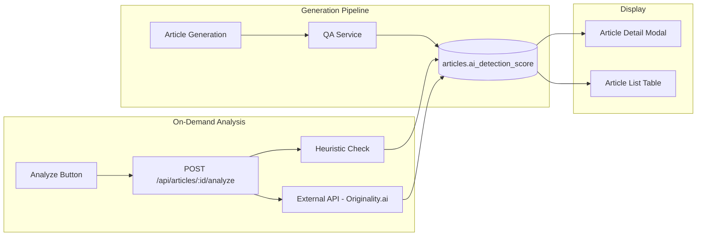
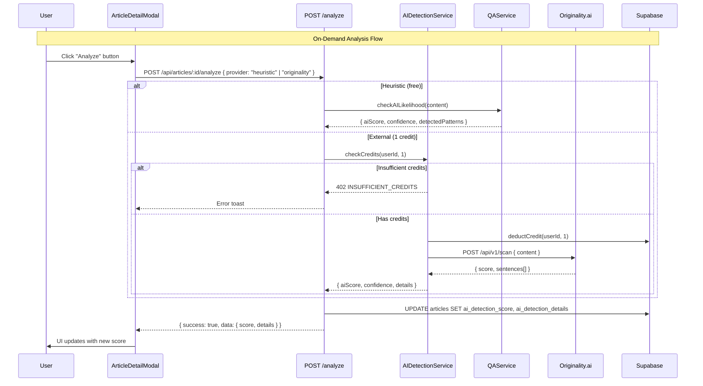

# PRD: AI Detection Score

**Complexity: 7 → HIGH mode**

---

## 1. Context

**Problem:** The AI Detection Score feature is placeholder-only — the UI component exists and the DB column exists, but the score is never populated, there's no way to trigger analysis, and the heuristic-based QA check is not surfaced to users.

**Files Analyzed:**

- `client/components/articles/AIDetectionScore.tsx` — existing UI with thresholds, progress bar, suggestions
- `client/components/articles/ArticleDetailModal.tsx` — renders AI score at line 398
- `client/components/articles/article-list/ArticleTableRow.tsx` — no AI score column yet
- `server/services/qa.service.ts` — `checkAILikelihood()` heuristic detection (5 patterns, 0-1 scale)
- `server/services/article-generation.service.ts` — runs QA at step 5.7, stores in `qa_results`, never writes `ai_detection_score`
- `src/pages/api/articles/[articleId]/index.ts` — PATCH endpoint with `updateSchema` (no `ai_detection_score`)
- `shared/types/article.types.ts` — `IArticle.ai_detection_score: number | null`
- `shared/config/env.ts` — env var patterns for API keys
- `shared/constants/credit-costs.constants.ts` — credit cost patterns
- `src/pages/api/_utils.ts` — `withAuth`, `withAuthAndBody`, `fireAndForget`

**Current Behavior:**

- `AIDetectionScore` component always shows "Not Analyzed" since `ai_detection_score` is always NULL
- QA service calculates `aiLikelihood.aiScore` (0-1) during generation but result is buried in `qa_results` JSONB — never mapped to `ai_detection_score`
- No API endpoint to trigger on-demand AI detection
- No external AI detection provider integrated (heuristic-only)
- No re-analysis after content edits

---

## 2. Solution

**Approach:**

- **Phase 1 (Quick Win):** Wire up the existing heuristic QA score to populate `ai_detection_score` during generation + show detected patterns in the UI. Zero new infrastructure.
- **Phase 2:** Add an "Analyze" button in the article detail modal so users can trigger on-demand AI detection (re-runs heuristic analysis on current content). Free — no credit cost.
- **Phase 3:** Integrate an external AI detection API (Originality.ai) for higher accuracy. Costs 1 credit per scan. Users choose between free heuristic and paid external scan.
- **Phase 4:** Show AI score in the article list table + auto-re-analyze after content edits.

**Architecture Diagram:**



**Key Decisions:**

- [x] Reuse existing `QAService.checkAILikelihood()` for free heuristic scan
- [x] External provider: **Originality.ai** — most accurate for SEO content, simple REST API, per-scan pricing ($0.01/100 words)
- [x] Credit cost: **1 credit** per external scan (aligns with budget article cost)
- [x] Heuristic scan: **free** (runs locally, no external call)
- [x] No new DB table — extend `articles` with `ai_detection_details` JSONB column for pattern breakdown
- [x] Provider-agnostic service design — easy to swap Originality.ai for GPTZero/Copyleaks later
- [x] `fireAndForget` for external API calls (Cloudflare 10ms CPU limit)

**Data Changes:**

- New migration: add `ai_detection_details JSONB` column to `articles` table
- New migration: add `ai_detection_provider TEXT` column to `articles` table (tracks which provider produced the score)
- New env var: `ORIGINALITY_AI_API_KEY` in `serverEnv`

**Integration Points Checklist:**

- [x] Entry point: "Analyze" button in `ArticleDetailModal.tsx` + auto-populate during generation
- [x] Caller: `ArticleDetailModal` → `POST /api/articles/:id/analyze` + `article-generation.service.ts` pipeline
- [x] Registration: New API route at `src/pages/api/articles/[articleId]/analyze.ts`
- [x] User-facing: YES — enhanced `AIDetectionScore` component + new "Analyze" button + article list column
- [x] Full user flow:
  1. Article is generated → heuristic AI score auto-populated (free)
  2. User opens article detail → sees score with pattern breakdown
  3. User clicks "Analyze" → chooses heuristic (free) or external (1 credit)
  4. Score updates in real-time → UI refreshes with new score + details
  5. User edits content → score auto-refreshes on save

---

## 3. Sequence Flow



---

## 4. Execution Phases

### Phase 1: Wire Heuristic Score into Generation Pipeline + Show Patterns

**User-visible outcome:** Every newly generated article gets an AI detection score (0-100) populated automatically. The detail modal shows the score WITH pattern breakdown (not just a number).

**Files (5):**

- `server/services/article-generation.service.ts` — map `qaResults.results.aiLikelihood.aiScore` (0-1) → `ai_detection_score` (0-100) in the Step 6 save
- `client/components/articles/AIDetectionScore.tsx` — enhance to accept and display `detectedPatterns` and `confidence` from `qa_results`
- `client/components/articles/ArticleDetailModal.tsx` — pass `qa_results.results.aiLikelihood` data to `AIDetectionScore`
- `shared/types/article.types.ts` — add `IAIDetectionDetails` interface for the pattern breakdown
- `server/services/qa.service.ts` — no changes needed (already returns patterns), just documenting the data flow

**Implementation:**

- [ ] In `article-generation.service.ts` Step 6 save (line 268), add: `ai_detection_score: qaResults ? Math.round((1 - qaResults.results.aiLikelihood.aiScore) * 100) : null`
  - Note: QA `aiScore` is 0-1 where **higher = more AI**. UI score is 0-100 where **higher = more human**. Invert: `(1 - aiScore) * 100`
- [ ] Add `IAIDetectionDetails` to `shared/types/article.types.ts`:
  ```typescript
  export interface IAIDetectionDetails {
    provider: 'heuristic' | 'originality';
    confidence: 'low' | 'medium' | 'high';
    detectedPatterns: string[];
    analyzedAt: string;
    rawScore?: number; // Original provider score (0-1 for heuristic)
  }
  ```
- [ ] Update `AIDetectionScore.tsx` props to accept optional `details: IAIDetectionDetails | null`
- [ ] Display detected patterns as bullet points below the score meter
- [ ] In `ArticleDetailModal.tsx`, extract `aiLikelihood` from `currentArticle.qa_results` and pass to `AIDetectionScore`

**Verification Plan:**

1. **Unit Tests:**
   - File: `tests/unit/ai-detection-score.unit.spec.ts`
   - `should convert QA aiScore 0.3 to display score 70`
   - `should convert QA aiScore 0.0 to display score 100`
   - `should convert QA aiScore 1.0 to display score 0`

2. **Integration Test:**
   - Verify article generation pipeline writes `ai_detection_score` to DB
   - Check that `qa_results.results.aiLikelihood` data is accessible in article response

3. **Evidence Required:**
   - [ ] All tests pass (`yarn test`)
   - [ ] `yarn verify` passes
   - [ ] Generated article in DB has non-null `ai_detection_score`

**Checkpoint:** Automated (prd-work-reviewer)

---

### Phase 2: On-Demand Heuristic Analysis API + "Analyze" Button

**User-visible outcome:** Users can click an "Analyze" button on any article to run (or re-run) the free heuristic AI detection analysis. Score updates immediately in the UI.

**Files (5):**

- `src/pages/api/articles/[articleId]/analyze.ts` — **NEW** — `POST` endpoint: validates ownership, runs heuristic check, updates `ai_detection_score` + returns result
- `client/components/articles/AIDetectionScore.tsx` — add "Analyze" / "Re-analyze" button at bottom of component
- `client/components/articles/ArticleDetailModal.tsx` — pass `articleId` and `onScoreUpdate` callback to `AIDetectionScore`
- `client/hooks/useArticles.ts` — add `analyzeAIDetection` mutation (or add inline fetch in component)
- `server/services/ai-detection.service.ts` — **NEW** — thin wrapper around `qaService.checkAILikelihood()` that formats results and handles DB update

**Implementation:**

- [ ] Create `server/services/ai-detection.service.ts`:
  ```typescript
  export class AIDetectionService {
    async analyzeHeuristic(articleId: string, content: string): Promise<IAIDetectionResult> {
      const result = await qaService.checkAILikelihood(content);
      const score = Math.round((1 - result.aiScore) * 100);
      const details: IAIDetectionDetails = {
        provider: 'heuristic',
        confidence: result.confidence,
        detectedPatterns: result.detectedPatterns,
        analyzedAt: new Date().toISOString(),
        rawScore: result.aiScore,
      };
      // Update DB
      await supabaseAdmin.from('articles').update({
        ai_detection_score: score,
        ai_detection_details: details,
        ai_detection_provider: 'heuristic',
      }).eq('id', articleId);
      return { score, details };
    }
  }
  ```
- [ ] Create `POST /api/articles/[articleId]/analyze.ts`:
  - Validate body: `{ provider: 'heuristic' }` (extend to `'originality'` in Phase 3)
  - Verify article ownership + has content
  - Call `aiDetectionService.analyzeHeuristic()`
  - Return `{ success: true, data: { score, details } }`
- [ ] Add "Analyze" button to `AIDetectionScore.tsx`:
  - When `score === null`: show "Run Analysis" primary button
  - When `score !== null`: show "Re-analyze" ghost button
  - Loading state while analyzing
- [ ] Wire button to `POST /api/articles/:id/analyze` via `useApiRequest`
- [ ] On success, update local article state (React Query invalidation or optimistic update)

**Verification Plan:**

1. **Unit Tests:**
   - File: `tests/unit/ai-detection.service.unit.spec.ts`
   - `should return score 0-100 from heuristic analysis`
   - `should include detected patterns in details`

2. **API Test:**
   ```bash
   # Happy path
   curl -X POST http://localhost:4321/api/articles/$ARTICLE_ID/analyze \
     -H "Authorization: Bearer $TOKEN" \
     -H "Content-Type: application/json" \
     -d '{"provider": "heuristic"}' | jq .
   # Expected: {"success": true, "data": {"score": 75, "details": {...}}}

   # No content
   curl -X POST http://localhost:4321/api/articles/$ARTICLE_ID/analyze \
     -H "Authorization: Bearer $TOKEN" \
     -d '{"provider": "heuristic"}' | jq .
   # Expected: {"success": false, "error": {"code": "INVALID_REQUEST", "message": "Article has no content"}}
   ```

3. **Evidence Required:**
   - [ ] All tests pass (`yarn test`)
   - [ ] `yarn verify` passes
   - [ ] curl commands return expected responses

**Checkpoint:** Automated (prd-work-reviewer) + Manual (verify button click → score updates in UI)

---

### Phase 3: DB Migration + External Provider Integration (Originality.ai)

**User-visible outcome:** Users can choose between free heuristic analysis and paid external analysis (1 credit) for higher accuracy. A provider selector appears in the Analyze flow.

**Files (5):**

- `supabase/migrations/YYYYMMDDHHMMSS_add_ai_detection_details.sql` — **NEW** — add `ai_detection_details JSONB`, `ai_detection_provider TEXT` columns to `articles`
- `shared/config/env.ts` — add `ORIGINALITY_AI_API_KEY` to `serverEnv`
- `server/services/ai-detection.service.ts` — add `analyzeExternal()` method calling Originality.ai API
- `src/pages/api/articles/[articleId]/analyze.ts` — extend to handle `provider: 'originality'` with credit check
- `shared/constants/credit-costs.constants.ts` — add `AI_DETECTION_CREDIT_COST = 1`

**Implementation:**

- [ ] Create migration:
  ```sql
  ALTER TABLE public.articles
    ADD COLUMN IF NOT EXISTS ai_detection_details JSONB,
    ADD COLUMN IF NOT EXISTS ai_detection_provider TEXT;

  COMMENT ON COLUMN public.articles.ai_detection_details IS 'Detailed AI detection results (patterns, confidence, raw scores)';
  COMMENT ON COLUMN public.articles.ai_detection_provider IS 'Provider that produced the AI detection score (heuristic, originality)';
  ```
- [ ] Add env var to `shared/config/env.ts` serverEnv schema:
  ```typescript
  ORIGINALITY_AI_API_KEY: z.string().default(''),
  ```
- [ ] Add `AI_DETECTION_CREDIT_COST = 1` to `credit-costs.constants.ts`
- [ ] Implement `analyzeExternal()` in `ai-detection.service.ts`:
  - Call Originality.ai `POST /api/v1/scan/ai` with article content
  - Map response: `original_score` (0-1, higher = more human) → `ai_detection_score` (0-100)
  - Parse per-sentence AI probability breakdown for details
  - Deduct 1 credit via `supabaseAdmin.rpc('add_purchased_credits', { amount: -1 })`
  - Store results in `ai_detection_details` JSONB
- [ ] Update analyze endpoint to handle both providers:
  - `provider: 'heuristic'` → free, no credit check
  - `provider: 'originality'` → check credits, deduct, call external API
  - Return 402 if insufficient credits for external scan
  - Return 503 if Originality.ai API key not configured

**Verification Plan:**

1. **Unit Tests:**
   - File: `tests/unit/ai-detection.service.unit.spec.ts`
   - `should deduct 1 credit for external scan`
   - `should return 402 when insufficient credits for external scan`
   - `should return 503 when ORIGINALITY_AI_API_KEY is empty`
   - `should map Originality.ai response to 0-100 score`

2. **API Test:**
   ```bash
   # External scan (with credits)
   curl -X POST http://localhost:4321/api/articles/$ARTICLE_ID/analyze \
     -H "Authorization: Bearer $TOKEN" \
     -d '{"provider": "originality"}' | jq .
   # Expected: {"success": true, "data": {"score": 82, "details": {"provider": "originality", ...}}}

   # External scan (no credits)
   # Expected: {"success": false, "error": {"code": "INSUFFICIENT_CREDITS", ...}}

   # External scan (no API key)
   # Expected: {"success": false, "error": {"code": "SERVICE_UNAVAILABLE", ...}}
   ```

3. **Evidence Required:**
   - [ ] Migration applies cleanly (`supabase migration up`)
   - [ ] All tests pass (`yarn test`)
   - [ ] `yarn verify` passes

**Checkpoint:** Automated (prd-work-reviewer) + Manual (verify external API call with test content)

---

### Phase 4: Article List Column + Auto Re-analyze on Edit

**User-visible outcome:** AI detection score appears as a column in the article list table (like SEO score). When users edit and save an article, the heuristic score auto-refreshes.

**Files (4):**

- `client/components/articles/article-list/ArticleTableRow.tsx` — add AI detection score column (same pattern as SEO score at line 139)
- `client/components/articles/article-list/ArticleTableHeader.tsx` — add "AI Score" column header
- `src/pages/api/articles/[articleId]/index.ts` — in PATCH handler, when `content` changes, run heuristic re-analysis via `fireAndForget`
- `client/components/articles/AIDetectionScore.tsx` — add provider badge ("Heuristic" / "Originality.ai") next to score

**Implementation:**

- [ ] Add AI score column to `ArticleTableHeader.tsx` (between SEO score and Campaign columns)
- [ ] Add AI score display to `ArticleTableRow.tsx` using same color-coded pattern as SEO score:
  ```typescript
  {article.ai_detection_score != null ? (
    <span className={`inline-flex items-center justify-center w-8 h-6 rounded text-xs
      font-bold border ${getAIScoreBorderColor(article.ai_detection_score)}
      ${getAIScoreColor(article.ai_detection_score)}`}>
      {article.ai_detection_score}
    </span>
  ) : (
    <span className="text-muted text-xs">—</span>
  )}
  ```
- [ ] Add color helper functions to `AIDetectionScore.tsx` (export `getAIScoreColor`, `getAIScoreBorderColor`) following the same pattern as `getSEOScoreColor` in `shared/utils/seo.ts`
- [ ] In article PATCH handler, after content update, trigger heuristic re-analysis:
  ```typescript
  if (input.content && input.content !== article.content) {
    const reanalyzePromise = import('@server/services/ai-detection.service')
      .then(({ aiDetectionService }) => aiDetectionService.analyzeHeuristic(articleId, input.content));
    fireAndForget(context.locals, reanalyzePromise);
  }
  ```
- [ ] Add provider badge to `AIDetectionScore.tsx` showing which provider produced the score

**Verification Plan:**

1. **Unit Tests:**
   - File: `tests/unit/ai-detection-score-colors.unit.spec.ts`
   - `should return green for score >= 80`
   - `should return yellow for score 60-79`
   - `should return red for score < 60`

2. **E2E Verification:**
   - Article list shows AI score column
   - Editing article content triggers score refresh
   - Score updates after save without page reload

3. **Evidence Required:**
   - [ ] All tests pass (`yarn test`)
   - [ ] `yarn verify` passes
   - [ ] Article list visually shows AI scores

**Checkpoint:** Automated (prd-work-reviewer) + Manual (verify list column rendering + edit-triggers-reanalysis)

---

## 5. Acceptance Criteria

- [ ] All phases complete
- [ ] All specified tests pass
- [ ] `yarn verify` passes
- [ ] All automated checkpoint reviews passed
- [ ] Generated articles have non-null `ai_detection_score`
- [ ] Users can trigger on-demand AI analysis (heuristic = free, external = 1 credit)
- [ ] Article detail modal shows score with pattern breakdown
- [ ] Article list table shows AI score column
- [ ] Content edits trigger automatic heuristic re-analysis
- [ ] External provider failure doesn't block article generation (graceful degradation)
- [ ] Credit deduction is atomic for external scans
- [ ] 402 returned when insufficient credits for external scan

---

## 6. Out of Scope (Future)

- Historical score tracking / score-over-time chart
- Bulk analysis across all articles
- AI score as a campaign-level filter or quality gate
- Additional external providers (GPTZero, Copyleaks)
- AI score in article export/report
- Automatic humanization/rewriting based on detected patterns
