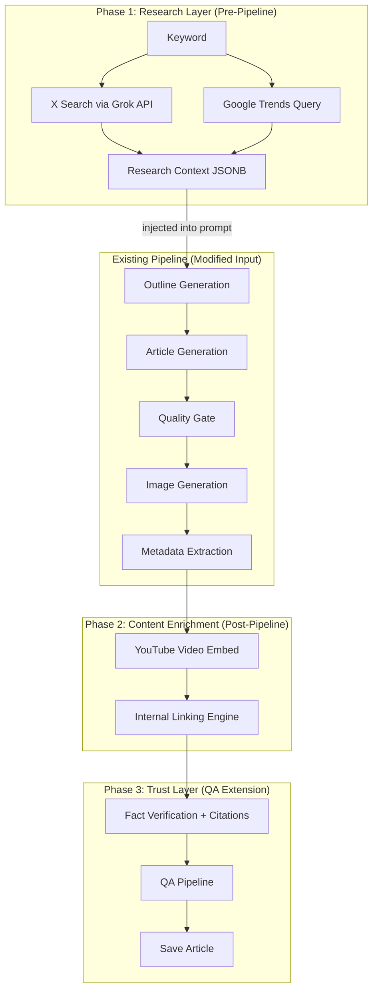
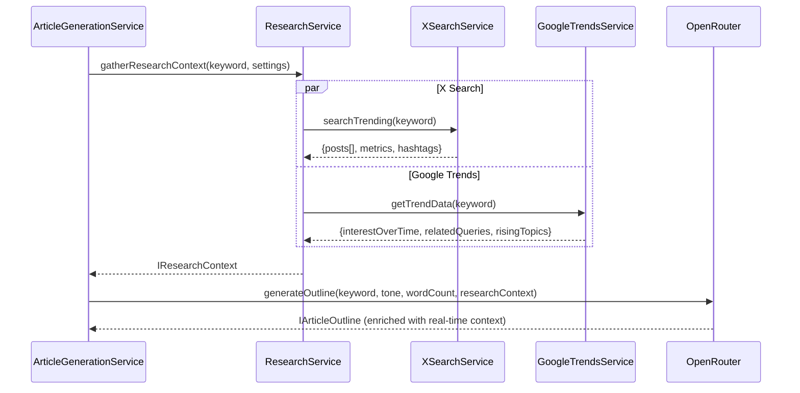
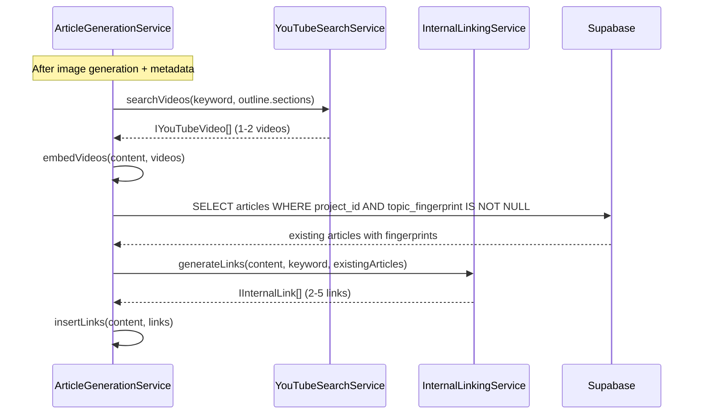
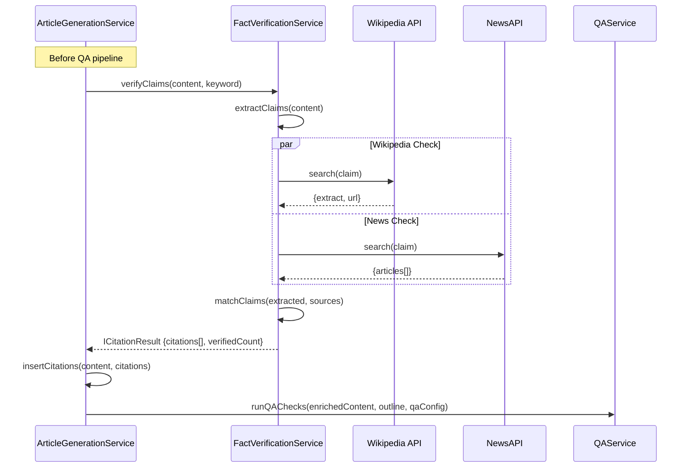

# PRD: Article Generation Enhancements v2 — Research, Enrichment & Trust

**Complexity: 9 → HIGH mode**
**Status:** Draft
**Author:** Claude
**Date:** 2026-02-10
**Primary Goal:** SEO Performance
**Branch:** `feat/article-enhancements-v2`

---

## 1. Context

**Problem:** Generated articles lack real-time context, multimedia richness, internal link structure, and verifiable citations — all of which are strong SEO ranking signals that competitors exploit. Articles are generated in isolation with no awareness of trending conversations, video content, or existing site content.

**Files Analyzed:**

- `server/services/article-generation.service.ts` — 7-step pipeline (outline → article → quality gate → images → metadata → QA → save)
- `server/services/prompts/article-prompts.ts` — outline + article prompt templates
- `server/services/openrouter.service.ts` — external API pattern (auth, retries, singleton)
- `server/services/replicate.service.ts` — external API pattern (polling, backoff)
- `server/services/qa.service.ts` — QA pipeline (plagiarism, fact consistency, readability, AI detection)
- `server/services/openai-embeddings.service.ts` — embeddings for topic fingerprint (1536 dims)
- `shared/config/env.ts` — Zod-validated env loading (serverEnv/clientEnv)
- `shared/config/ai-models.config.ts` — writer preset registry
- `shared/config/image-models.config.ts` — image preset registry
- `shared/config/credits.config.ts` — credit cost structure
- `shared/types/article.types.ts` — IArticle, IGenerateArticleInput, IArticleOutline
- `shared/types/campaign.types.ts` — ICampaign, ICreateCampaignInput
- `client/components/dashboard/views/NewCampaignModal.tsx` — 2-step campaign creation UI
- `client/components/articles/ArticleList.tsx` — article table with status, SEO, word count columns
- `supabase/migrations/20260205100100_create_campaigns_table.sql` — campaigns schema
- `supabase/migrations/20260205100200_create_articles_table.sql` — articles schema

**Current Pipeline:**

```
Outline → Full Article → Quality Gate → Images → Metadata/Fingerprint → QA → Save
```

**What Already Exists:**

- [x] Full article generation pipeline with fire-and-forget (`waitUntil()`)
- [x] OpenRouter service with retries, exponential backoff, singleton
- [x] Replicate service for image generation (pattern for external API calls)
- [x] OpenAI embeddings service for topic fingerprint (cosine similarity)
- [x] QA pipeline: plagiarism, fact consistency, readability, AI detection
- [x] Credit system with atomic RPC, FIFO deduction, refund on failure
- [x] Campaign JSONB `settings` field (currently unused — perfect for feature toggles)
- [x] `[IMAGE:n]` marker pattern for in-content media placement
- [x] Article status state machine with valid transitions
- [x] ModelSelect component for tier-based option selection

**What Doesn't Exist Yet:**

- [ ] Real-time social context for article research (X/Twitter, trends)
- [ ] Video embedding in articles
- [ ] Internal linking between articles
- [ ] Citation/source verification system
- [ ] Campaign-level feature toggle UI
- [ ] Research data display in campaign/article UI

---

## 2. Solution

**Approach: Enrichment layers that wrap the existing pipeline**

Each enhancement is an independent, toggleable enrichment layer that feeds data into existing pipeline steps. No core pipeline changes — only new pre-processing (research) and post-processing (enrichment) stages.



**Key Decisions:**

- [x] **Grok API** for X search (native X integration, supports search + trending)
- [x] **SerpAPI** for Google Trends (reliable API wrapper, avoids scraping)
- [x] **YouTube Data API v3** for video search (official, generous free tier: 10,000 units/day)
- [x] **Existing OpenAI embeddings** for internal linking (reuse topic_fingerprint, no new service)
- [x] **Wikipedia REST API + NewsAPI** for fact verification (free/cheap, broad coverage)
- [x] All features use campaign `settings` JSONB for toggles (no schema changes to campaigns table)
- [x] Graceful degradation: if any enrichment API fails, article generates normally without that enrichment
- [x] Credit cost: 0 for all Phase 1 & 2 features (encourage adoption), +1 credit for Phase 3 citations

**Data Changes:**

### New Migration: `articles` table extensions

```sql
ALTER TABLE articles ADD COLUMN IF NOT EXISTS research_context JSONB DEFAULT NULL;
ALTER TABLE articles ADD COLUMN IF NOT EXISTS youtube_videos JSONB DEFAULT NULL;
ALTER TABLE articles ADD COLUMN IF NOT EXISTS internal_links JSONB DEFAULT NULL;
ALTER TABLE articles ADD COLUMN IF NOT EXISTS citations JSONB DEFAULT NULL;
ALTER TABLE articles ADD COLUMN IF NOT EXISTS enrichment_flags JSONB DEFAULT '{}';
```

### New Table: `article_citations`

```sql
CREATE TABLE article_citations (
  id UUID PRIMARY KEY DEFAULT gen_random_uuid(),
  article_id UUID NOT NULL REFERENCES articles(id) ON DELETE CASCADE,
  position INTEGER NOT NULL,
  claim_text TEXT NOT NULL,
  source_url TEXT NOT NULL,
  source_title TEXT,
  source_type TEXT CHECK (source_type IN ('wikipedia', 'news', 'academic', 'official')),
  verified BOOLEAN DEFAULT false,
  created_at TIMESTAMPTZ DEFAULT NOW()
);
CREATE INDEX idx_article_citations_article ON article_citations(article_id);
```

---

## 3. Sequence Flows

### Research Layer (Phase 1)



### Content Enrichment (Phase 2)



### Trust Layer (Phase 3)



---

## 4. Integration Points

### How will each feature be reached?

| Feature            | Entry Point                               | Caller                                                                    | Wiring                        |
| ------------------ | ----------------------------------------- | ------------------------------------------------------------------------- | ----------------------------- |
| F1: X Search       | `ResearchService.gatherResearchContext()` | `ArticleGenerationService.generateArticle()` — before `generateOutline()` | New import + call in pipeline |
| F2: Google Trends  | `ResearchService.gatherResearchContext()` | Same as F1 (parallel inside ResearchService)                              | Same orchestrator             |
| F3: YouTube Videos | `YouTubeSearchService.searchVideos()`     | `ArticleGenerationService.generateArticle()` — after image generation     | New post-processing step      |
| F4: Internal Links | `InternalLinkingService.generateLinks()`  | `ArticleGenerationService.generateArticle()` — after YouTube step         | New post-processing step      |
| F5: Citations      | `FactVerificationService.verifyClaims()`  | `ArticleGenerationService.generateArticle()` — before QA pipeline         | New pre-QA step               |

### Is this user-facing?

- **YES** — All features have UI counterparts:
  - Campaign creation: enrichment toggle checkboxes (Step 2 of NewCampaignModal)
  - Article list: new columns (videos, links, citations count)
  - Article detail: rendered videos, clickable internal links, citation footnotes
  - Quick Generate: same toggles as campaign modal

### Full User Flow (Campaign):

1. User creates campaign → Step 2 shows new "Research & Enrichment" section with toggles
2. User enables desired features (X Search, Trends, YouTube, Internal Links, Citations)
3. Toggles stored in `campaigns.settings` JSONB
4. Campaign starts → each article reads settings → enrichment layers activate
5. Article list shows enrichment indicators (video icon, link count, citation count)
6. Article detail modal shows embedded videos, internal links as real links, citations as footnotes

---

## 5. Execution Phases

### Phase 1: Research Layer — X Search + Google Trends

**User-visible outcome:** Articles are generated with awareness of real-time X/Twitter conversations and Google Trends data, producing more topical and timely content.

#### Phase 1a: X Search Service + Research Orchestrator

**Files (5):**

- `server/services/x-search.service.ts` — **NEW** Grok API client for X search
- `server/services/research.service.ts` — **NEW** orchestrator that combines research sources
- `shared/types/research.types.ts` — **NEW** IResearchContext, IXSearchResult, ITrendsData
- `shared/config/env.ts` — ADD `GROK_API_KEY` to serverEnvSchema
- `server/services/article-generation.service.ts` — MODIFY: call ResearchService before outline

**Implementation:**

- [ ] Create `IResearchContext` type with `xSearch` and `trends` optional fields
- [ ] Create `XSearchService` following ReplicateService singleton pattern:
  - `isConfigured()` → checks `GROK_API_KEY`
  - `searchTrending(keyword: string, limit?: number)` → returns top 5-10 relevant posts, engagement metrics, trending hashtags
  - Uses Grok API endpoint for X search
  - Retry with exponential backoff on 429/5xx
  - Returns `IXSearchResult` (posts, metrics, hashtags, timestamp)
- [ ] Create `ResearchService` orchestrator:
  - `gatherResearchContext(keyword: string, settings: Record<string, unknown>)` → `Promise<IResearchContext | null>`
  - Calls enabled sources in parallel (`Promise.allSettled`)
  - Returns null if all sources disabled or all fail (graceful degradation)
  - Timeout: 10s per source, 15s total
- [ ] Add `GROK_API_KEY` to `serverEnvSchema` in env.ts (default: `''`)
- [ ] Modify `ArticleGenerationService.generateArticle()`:
  - After article record creation, before `generateOutline()`
  - Call `researchService.gatherResearchContext(keyword, campaignSettings)`
  - Pass `researchContext` to outline prompt
  - Save `research_context` JSONB on article record

**Tests Required:**

| Test File                                      | Test Name                                             | Assertion                              |
| ---------------------------------------------- | ----------------------------------------------------- | -------------------------------------- |
| `tests/unit/services/x-search.service.spec.ts` | `should return null when GROK_API_KEY not configured` | `expect(result).toBeNull()`            |
| `tests/unit/services/x-search.service.spec.ts` | `should parse X search results correctly`             | `expect(result.posts).toHaveLength(5)` |
| `tests/unit/services/research.service.spec.ts` | `should run enabled sources in parallel`              | Both promises resolved                 |
| `tests/unit/services/research.service.spec.ts` | `should gracefully handle source failures`            | Returns partial context                |
| `tests/unit/services/research.service.spec.ts` | `should return null when all sources disabled`        | `expect(result).toBeNull()`            |

**Verification Plan:**

1. **Unit Tests:** Mock Grok API responses, test parsing, error handling, timeout
2. **Integration:** Verify ResearchService orchestrates parallel calls correctly
3. **API Proof:**
   ```bash
   # Test X search directly (manual, requires GROK_API_KEY)
   curl -X POST https://api.x.ai/v1/chat/completions \
     -H "Authorization: Bearer $GROK_API_KEY" \
     -H "Content-Type: application/json" \
     -d '{"model":"grok-3","messages":[{"role":"user","content":"Search X for trending posts about: kubernetes security"}]}'
   ```

---

#### Phase 1b: Google Trends Service + Pipeline Integration

**Files (5):**

- `server/services/google-trends.service.ts` — **NEW** SerpAPI client for Google Trends
- `shared/config/env.ts` — ADD `SERPAPI_KEY` to serverEnvSchema
- `server/services/research.service.ts` — MODIFY: add Google Trends source
- `server/services/prompts/article-prompts.ts` — MODIFY: accept `researchContext` in outline prompt
- `shared/types/research.types.ts` — MODIFY: add `ITrendsData` to `IResearchContext`

**Implementation:**

- [ ] Create `GoogleTrendsService` following singleton pattern:
  - `isConfigured()` → checks `SERPAPI_KEY`
  - `getTrendData(keyword: string)` → `Promise<ITrendsData | null>`
  - Calls SerpAPI Google Trends endpoint
  - Extracts: interest over time (12 months), related queries (top 10), rising topics (top 5)
  - Returns `ITrendsData` { interestOverTime, relatedQueries, risingTopics, peakMonth }
- [ ] Add `SERPAPI_KEY` to `serverEnvSchema` in env.ts
- [ ] Integrate into `ResearchService.gatherResearchContext()`:
  - Add `googleTrendsService.getTrendData()` to parallel call
  - Merge into `IResearchContext.trends`
- [ ] Modify `getOutlinePrompt()` in article-prompts.ts:
  - Accept optional `researchContext: IResearchContext`
  - When present, inject a "Research Context" section into the system prompt:
    - Trending X posts and sentiment
    - Google Trends related queries and rising topics
    - Instruction: "Use this real-time context to make the article timely and relevant"
- [ ] Save `research_context` JSONB on the article record after outline generation

**Tests Required:**

| Test File                                             | Test Name                                                         | Assertion                                          |
| ----------------------------------------------------- | ----------------------------------------------------------------- | -------------------------------------------------- |
| `tests/unit/services/google-trends.service.spec.ts`   | `should return null when SERPAPI_KEY not configured`              | `expect(result).toBeNull()`                        |
| `tests/unit/services/google-trends.service.spec.ts`   | `should parse trends data correctly`                              | Validates ITrendsData shape                        |
| `tests/unit/services/prompts/article-prompts.spec.ts` | `should include research context in outline prompt when provided` | `expect(prompt).toContain('Research Context')`     |
| `tests/unit/services/prompts/article-prompts.spec.ts` | `should omit research context when not provided`                  | `expect(prompt).not.toContain('Research Context')` |

---

#### Phase 1c: Database Migration + Campaign UI Toggles

**Files (5):**

- `supabase/migrations/YYYYMMDDHHMMSS_article_enrichment_columns.sql` — **NEW** migration
- `client/components/dashboard/views/NewCampaignModal.tsx` — MODIFY: add enrichment toggles
- `shared/types/campaign.types.ts` — MODIFY: add `IEnrichmentSettings` type
- `shared/types/article.types.ts` — MODIFY: add enrichment fields to `IArticle`
- `locales/en/dashboard.json` — MODIFY: add enrichment toggle labels

**Implementation:**

- [ ] Create migration adding enrichment columns to articles table:
  - `research_context JSONB DEFAULT NULL`
  - `youtube_videos JSONB DEFAULT NULL`
  - `internal_links JSONB DEFAULT NULL`
  - `citations JSONB DEFAULT NULL`
  - `enrichment_flags JSONB DEFAULT '{}'`
- [ ] Define `IEnrichmentSettings` interface:
  ```typescript
  interface IEnrichmentSettings {
    enableXSearch?: boolean; // default: false
    enableTrends?: boolean; // default: false
    enableYoutube?: boolean; // default: false
    enableInternalLinks?: boolean; // default: false
    enableCitations?: boolean; // default: false
  }
  ```
- [ ] Add enrichment toggle section to NewCampaignModal Step 2:
  - "Research & Enrichment" collapsible section below tone selection
  - Toggle switches for each feature with description text
  - Group: "Research" (X Search, Google Trends) and "Content" (YouTube, Internal Links, Citations)
  - Credits impact note: "These features don't use extra credits" (except citations: +1)
  - Store in `settings.enrichment` on campaign creation
- [ ] Add enrichment fields to `IArticle` interface
- [ ] Add i18n labels for all toggle labels and descriptions

**Tests Required:**

| Test File                                             | Test Name                                          | Assertion                     |
| ----------------------------------------------------- | -------------------------------------------------- | ----------------------------- |
| `tests/unit/components/NewCampaignModal.unit.spec.ts` | `should render enrichment toggles in step 2`       | Toggles visible               |
| `tests/unit/components/NewCampaignModal.unit.spec.ts` | `should include enrichment settings in submission` | `settings.enrichment` present |

**User Verification (Manual):**

- Action: Open New Campaign modal → go to Step 2
- Expected: See "Research & Enrichment" section with 5 toggle switches
- Action: Enable all toggles → create campaign
- Expected: Campaign `settings` JSONB contains `{ enrichment: { enableXSearch: true, ... } }`

---

### Phase 2: Content Enrichment — YouTube Videos + Internal Links

**User-visible outcome:** Articles include embedded YouTube videos at relevant sections and auto-generated internal links to related articles in the same project.

#### Phase 2a: YouTube Video Search + Embed Service

**Files (5):**

- `server/services/youtube-search.service.ts` — **NEW** YouTube Data API v3 client
- `shared/types/research.types.ts` — MODIFY: add `IYouTubeVideo` type
- `shared/config/env.ts` — ADD `YOUTUBE_API_KEY` to serverEnvSchema
- `server/services/article-generation.service.ts` — MODIFY: add video embedding step after images
- `server/services/prompts/article-prompts.ts` — MODIFY: add `[VIDEO:n]` markers to article prompt

**Implementation:**

- [ ] Create `YouTubeSearchService` following singleton pattern:
  - `isConfigured()` → checks `YOUTUBE_API_KEY`
  - `searchVideos(keyword: string, sections: IArticleSection[])` → `Promise<IYouTubeVideo[]>`
  - Search YouTube API: `GET https://www.googleapis.com/youtube/v3/search?part=snippet&q={keyword}&type=video&maxResults=5&relevanceLanguage=en&order=relevance`
  - Filter: minimum 1K views (via separate videos.list call for stats), not older than 2 years
  - Return top 2 videos with: `videoId`, `title`, `channelName`, `thumbnailUrl`, `viewCount`, `publishedAt`
- [ ] Add `YOUTUBE_API_KEY` to serverEnvSchema
- [ ] Define `IYouTubeVideo`:
  ```typescript
  interface IYouTubeVideo {
    videoId: string;
    title: string;
    channelName: string;
    thumbnailUrl: string;
    viewCount: number;
    publishedAt: string;
    embedUrl: string; // https://www.youtube.com/embed/{videoId}
  }
  ```
- [ ] Add `[VIDEO:n]` marker pattern to article generation prompt (same approach as `[IMAGE:n]`):
  - Only when YouTube enrichment enabled
  - Place 1-2 `[VIDEO:n]` markers after relevant H2 sections
  - Parse markers, replace with responsive iframe embed:
    ```html
    <div class="video-embed">
      <iframe
        src="https://www.youtube.com/embed/{videoId}"
        title="{title}"
        allowfullscreen
        loading="lazy"
      ></iframe>
    </div>
    ```
- [ ] Add video embedding step to pipeline (after image generation, before internal links):
  - Parse `[VIDEO:n]` markers from content
  - Search YouTube for matching videos
  - Replace markers with embeds
  - Store `youtube_videos` JSONB on article
  - Strip unfilled `[VIDEO:n]` markers on failure

**Tests Required:**

| Test File                                                | Test Name                                               | Assertion                      |
| -------------------------------------------------------- | ------------------------------------------------------- | ------------------------------ |
| `tests/unit/services/youtube-search.service.spec.ts`     | `should return empty array when API key not configured` | `expect(result).toEqual([])`   |
| `tests/unit/services/youtube-search.service.spec.ts`     | `should filter videos below view threshold`             | Only high-view videos returned |
| `tests/unit/services/youtube-search.service.spec.ts`     | `should parse YouTube API response correctly`           | Validates IYouTubeVideo shape  |
| `tests/unit/services/article-generation.service.spec.ts` | `should embed videos when YouTube enabled`              | Content contains iframe        |
| `tests/unit/services/article-generation.service.spec.ts` | `should strip VIDEO markers on failure`                 | No `[VIDEO:` in final content  |

---

#### Phase 2b: Internal Linking Engine

**Files (5):**

- `server/services/internal-linking.service.ts` — **NEW** embedding-based link insertion
- `shared/types/research.types.ts` — MODIFY: add `IInternalLink` type
- `server/services/article-generation.service.ts` — MODIFY: add internal linking step
- `client/components/articles/ArticleList.tsx` — MODIFY: add links column
- `client/components/articles/ArticleDetailModal.tsx` — MODIFY: show internal links section

**Implementation:**

- [ ] Create `InternalLinkingService`:
  - `generateLinks(content: string, keyword: string, articleId: string, projectId: string)` → `Promise<IInternalLink[]>`
  - Query existing articles in same project with `topic_fingerprint IS NOT NULL` and `status IN ('approved', 'published')`
  - Calculate cosine similarity between current article's fingerprint and existing articles
  - Select top 5 most related articles (similarity > 0.3, exclude self)
  - For each related article, find the most contextually appropriate sentence in content to insert the link
  - Use LLM (budget model) to determine best anchor text and insertion point
  - Return `IInternalLink[]` with: `targetArticleId`, `targetTitle`, `targetSlug`, `anchorText`, `insertAfterParagraph`
- [ ] Define `IInternalLink`:
  ```typescript
  interface IInternalLink {
    targetArticleId: string;
    targetTitle: string;
    targetSlug: string;
    anchorText: string;
    insertPosition: number; // paragraph index
    similarityScore: number;
  }
  ```
- [ ] Add internal linking step to pipeline (after YouTube, before QA):
  - Call `internalLinkingService.generateLinks()`
  - Insert markdown links at designated positions
  - Store `internal_links` JSONB on article
  - Graceful degradation: skip if no related articles or embeddings unavailable
- [ ] Add "Links" column to ArticleList (count of internal links, or "—")
- [ ] Add internal links section to ArticleDetailModal (list of linked articles)

**Tests Required:**

| Test File                                              | Test Name                                              | Assertion                                      |
| ------------------------------------------------------ | ------------------------------------------------------ | ---------------------------------------------- |
| `tests/unit/services/internal-linking.service.spec.ts` | `should find related articles by embedding similarity` | Returns articles above threshold               |
| `tests/unit/services/internal-linking.service.spec.ts` | `should return empty when no articles in project`      | `expect(result).toEqual([])`                   |
| `tests/unit/services/internal-linking.service.spec.ts` | `should exclude self from results`                     | Current article not in links                   |
| `tests/unit/services/internal-linking.service.spec.ts` | `should limit to max 5 links`                          | `expect(result.length).toBeLessThanOrEqual(5)` |

**User Verification (Manual):**

- Action: Generate article in project with 3+ existing published articles
- Expected: Article detail shows "Internal Links" section with 2-5 links to related articles
- Action: Click internal link
- Expected: Navigates to linked article

---

### Phase 3: Trust & Authority — Fact Verification + Citations

**User-visible outcome:** Articles include inline citations with footnotes linking to authoritative sources (Wikipedia, news articles), improving E-E-A-T signals.

#### Phase 3a: Fact Verification Service

**Files (5):**

- `server/services/fact-verification.service.ts` — **NEW** claim extraction + source matching
- `shared/types/research.types.ts` — MODIFY: add `ICitation`, `IFactVerificationResult`
- `shared/config/env.ts` — ADD `NEWSAPI_KEY` to serverEnvSchema
- `shared/config/credits.config.ts` — MODIFY: add citation credit cost
- `server/services/article-generation.service.ts` — MODIFY: add fact verification step before QA

**Implementation:**

- [ ] Create `FactVerificationService`:
  - `verifyClaims(content: string, keyword: string)` → `Promise<IFactVerificationResult>`
  - **Step 1 — Claim Extraction:** Use LLM (budget model) to extract 5-10 verifiable factual claims from the article content (statistics, dates, named entities, cause-effect statements)
  - **Step 2 — Source Search:** For each claim, search in parallel:
    - Wikipedia REST API: `https://en.wikipedia.org/api/rest_v1/page/summary/{topic}` + search
    - NewsAPI: `https://newsapi.org/v2/everything?q={claim_keywords}&sortBy=relevance`
  - **Step 3 — Match & Verify:** Compare claim against source extracts using cosine similarity or LLM judgment
  - **Step 4 — Generate Citations:** For matched claims, create `ICitation` objects with source URL, title, and relevant excerpt
  - Timeout: 20s total (claims are processed in parallel batches of 3)
- [ ] Define types:

  ```typescript
  interface ICitation {
    position: number; // sequential [1], [2], etc.
    claimText: string; // the claim being cited
    sourceUrl: string;
    sourceTitle: string;
    sourceType: 'wikipedia' | 'news' | 'academic' | 'official';
    excerpt: string; // relevant excerpt from source
    verified: boolean; // was the claim substantiated
  }

  interface IFactVerificationResult {
    citations: ICitation[];
    totalClaims: number;
    verifiedClaims: number;
    verificationScore: number; // verified/total ratio
  }
  ```

- [ ] Add `NEWSAPI_KEY` to serverEnvSchema
- [ ] Add citation credit cost to `credits.config.ts`: `CITATION_ENRICHMENT: 1` (extra credit when enabled)
- [ ] Add fact verification step to pipeline:
  - Runs before QA pipeline
  - Inserts inline citation markers: `[1]`, `[2]` after relevant sentences
  - Appends "## Sources" section at article footer with numbered references
  - Stores `citations` JSONB and creates `article_citations` records
  - Graceful degradation: skip if APIs unavailable, article generates without citations

**Tests Required:**

| Test File                                               | Test Name                                        | Assertion                      |
| ------------------------------------------------------- | ------------------------------------------------ | ------------------------------ |
| `tests/unit/services/fact-verification.service.spec.ts` | `should extract claims from article content`     | Returns 5-10 claims            |
| `tests/unit/services/fact-verification.service.spec.ts` | `should search Wikipedia for claim verification` | API called with correct params |
| `tests/unit/services/fact-verification.service.spec.ts` | `should handle API failures gracefully`          | Returns empty citations        |
| `tests/unit/services/fact-verification.service.spec.ts` | `should format citations as footnotes`           | Content contains `[1]` markers |
| `tests/unit/services/fact-verification.service.spec.ts` | `should append Sources section to article`       | Content ends with `## Sources` |

---

#### Phase 3b: Citations Database + UI Display

**Files (5):**

- `supabase/migrations/YYYYMMDDHHMMSS_create_article_citations.sql` — **NEW** migration
- `client/components/articles/ArticleList.tsx` — MODIFY: add citations count column
- `client/components/articles/ArticleDetailModal.tsx` — MODIFY: render citations footnotes
- `client/components/articles/ArticlePreview.tsx` — MODIFY: render citation links in markdown
- `src/pages/api/articles/[articleId]/index.ts` — MODIFY: include citations in GET response

**Implementation:**

- [ ] Create migration for `article_citations` table (see schema in Section 2)
- [ ] Add "Citations" column to ArticleList:
  - Shows count badge (e.g., "5 sources")
  - Color-coded: green (3+), yellow (1-2), gray (0)
- [ ] Update ArticleDetailModal:
  - "Sources" tab showing all citations with links
  - Verification status indicator per citation
  - Total verification score display
- [ ] Update ArticlePreview markdown rendering:
  - Render `[n]` markers as superscript links that scroll to sources section
  - Render `## Sources` section as numbered list with clickable URLs
- [ ] Include citations data in article GET API response (join with `article_citations`)

**Tests Required:**

| Test File                                           | Test Name                                       | Assertion                 |
| --------------------------------------------------- | ----------------------------------------------- | ------------------------- |
| `tests/unit/components/ArticleList.unit.spec.ts`    | `should render citations count column`          | Column visible with count |
| `tests/unit/components/ArticlePreview.unit.spec.ts` | `should render citation markers as superscript` | `[1]` rendered as `<sup>` |

**User Verification (Manual):**

- Action: Generate article with citations enabled
- Expected: Article preview shows inline `[1]`, `[2]` markers linked to Sources footer
- Action: Click citation number in article body
- Expected: Scrolls to corresponding source in Sources section
- Action: View article in list
- Expected: "Citations" column shows "5 sources" badge

---

## 6. Environment Variables Summary

| Variable          | File       | Default | Required For       |
| ----------------- | ---------- | ------- | ------------------ |
| `GROK_API_KEY`    | `.env.api` | `''`    | F1: X Search       |
| `SERPAPI_KEY`     | `.env.api` | `''`    | F2: Google Trends  |
| `YOUTUBE_API_KEY` | `.env.api` | `''`    | F3: YouTube Videos |
| `NEWSAPI_KEY`     | `.env.api` | `''`    | F5: Citations      |

All are optional — features degrade gracefully when keys are not configured.

## 7. Credit Cost Summary

| Feature            | Extra Credits  | Rationale                                     |
| ------------------ | -------------- | --------------------------------------------- |
| F1: X Search       | 0              | Encourage adoption, low API cost              |
| F2: Google Trends  | 0              | Encourage adoption, low API cost              |
| F3: YouTube Videos | 0              | Free API tier, adds SEO value                 |
| F4: Internal Links | 0              | Uses existing embeddings, no new API cost     |
| F5: Citations      | +1 per article | Multiple API calls + LLM for claim extraction |

## 8. Success Metrics

| Metric                    | Target                 | Measurement                                      |
| ------------------------- | ---------------------- | ------------------------------------------------ |
| SEO score improvement     | +10 avg points         | Compare avg `seo_score` before/after enrichment  |
| Internal link density     | 3+ links per article   | Avg `internal_links` array length                |
| Citation coverage         | 5+ sources per article | Avg `citations` array length                     |
| YouTube embed rate        | 80%+ when enabled      | Articles with `youtube_videos` populated         |
| Research context hit rate | 90%+ when enabled      | Articles with `research_context` populated       |
| Enrichment failure rate   | <5%                    | Articles where enrichment fails / total enriched |

## 9. Acceptance Criteria

- [ ] All phases complete with passing automated checkpoints
- [ ] All unit tests pass (`yarn test`)
- [ ] `yarn verify` passes
- [ ] Each feature independently toggleable via campaign settings
- [ ] Graceful degradation when API keys missing or APIs fail
- [ ] Campaign UI shows enrichment toggles with clear descriptions
- [ ] Article list shows enrichment indicators (videos, links, citations)
- [ ] Article detail renders enriched content (embedded videos, internal links, citation footnotes)
- [ ] Credit costs accurately reflect per Phase 3 citations (+1)
- [ ] No regression in existing article generation pipeline
