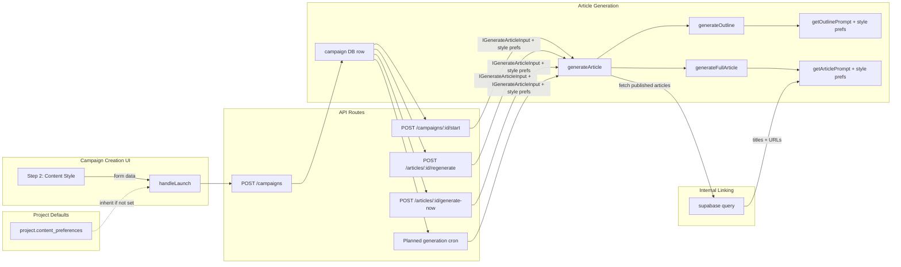
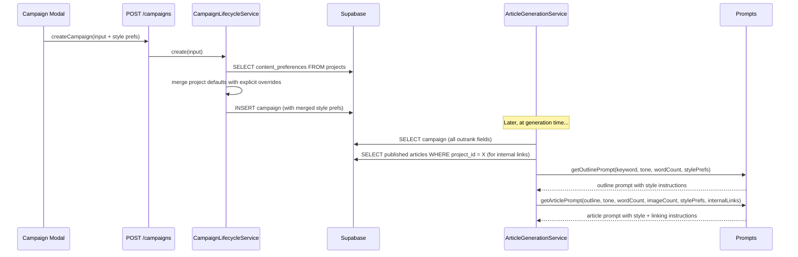

# PRD: Article Style Preferences End-to-End

> **Complexity: 5 → MEDIUM mode**
> Touches: types, prompts, generation service, 4 API routes, planned generation service, campaign creation UI, campaign lifecycle service

---

## 1. Context

**Problem:** 8 article style preference fields exist in the DB schema and TypeScript types but are completely ignored by the article generation pipeline. Users can set these during onboarding but they have zero effect on generated articles.

**Files Analyzed:**
- `shared/types/article.types.ts` — `IGenerateArticleInput` (missing outrank fields)
- `shared/types/campaign.types.ts` — `ICampaign` (has all outrank fields)
- `shared/types/project.types.ts` — `IContentPreferences` (project-level defaults)
- `server/services/prompts/article-prompts.ts` — prompt functions (only use tone/wordCount)
- `server/services/article-generation.service.ts` — `generateOutline`/`generateFullArticle` (ignore outrank)
- `src/pages/api/campaigns/[campaignId]/start.ts` — bulk start (omits outrank fields)
- `src/pages/api/articles/[articleId]/regenerate.ts` — regenerate (omits outrank fields)
- `src/pages/api/articles/[articleId]/generate-now.ts` — generate-now (omits tone + outrank)
- `server/services/planned-article-generation.service.ts` — planned gen (only fetches ai_model, image_preset)
- `client/components/dashboard/views/new-campaign-modal/` — modal (missing outrank fields)
- `client/components/onboarding/steps/ContentPreferencesSection.tsx` — has UI for project-level prefs

**Current Behavior:**
- Only `tone`, `target_word_count`, `ai_model`, `image_preset` flow end-to-end
- `article_style`, `global_instructions`, `internal_links_count`, `include_youtube`, `include_cta`, `include_emojis`, `include_infographics`, `image_style` are stored but never read at generation time
- Project `content_preferences` are never inherited by campaigns
- Internal linking is a complete no-op (field exists, no code fetches articles)

---

## 2. Solution

**Approach:**
1. Extend `IGenerateArticleInput` with all outrank fields as an `IArticleStylePreferences` interface
2. Update all 5 generation entry points to read outrank fields from the campaign and pass them through
3. Update prompt templates to incorporate style preferences into the system prompts
4. Add a "Content Style" step to the campaign creation modal, pre-filled from project `content_preferences`
5. Implement simple internal linking: fetch published articles from same project, pass titles+URLs to prompt

**Architecture Diagram:**



**Key Decisions:**
- Style preferences are a flat interface (`IArticleStylePreferences`) embedded inside `IGenerateArticleInput` — no nested object
- Project-level defaults are applied at campaign creation time (server-side), not at generation time — campaigns are self-contained after creation
- Internal linking uses a simple query: fetch up to N published articles from the same project, pass to prompt as a list
- Reuse existing `ARTICLE_STYLES`, `IMAGE_STYLES`, `INTERNAL_LINKS_OPTIONS` constants from `ContentPreferencesSection.tsx`

**Data Changes:** None — all DB columns already exist.

---

## 3. Sequence Flow



---

## 4. Execution Phases

### Phase 1: Type Definitions & Style Preferences Interface

**User-visible outcome:** No visible change — foundational types for all subsequent phases.

**Files (3):**
- `shared/types/article.types.ts` — Add `IArticleStylePreferences` interface, extend `IGenerateArticleInput`
- `shared/types/campaign.types.ts` — Add helper type `CampaignOutrankFields` (pick type for clean extraction)
- `shared/types/project.types.ts` — No changes needed (already correct)

**Implementation:**

- [ ] Create `IArticleStylePreferences` interface in `article.types.ts`:
  ```typescript
  export interface IArticleStylePreferences {
    articleStyle?: 'informative' | 'how-to' | 'listicle' | 'opinion' | 'tutorial';
    globalInstructions?: string;
    internalLinksCount?: number;
    includeYoutube?: boolean;
    includeCta?: boolean;
    includeEmojis?: boolean;
    includeInfographics?: boolean;
    imageStyle?: string;
  }
  ```
- [ ] Add `stylePreferences?: IArticleStylePreferences` to `IGenerateArticleInput`
- [ ] Add `internalLinks?: Array<{ title: string; url: string }>` to `IGenerateArticleInput` (for passing fetched links at generation time)

**Verification Plan:**
1. **Unit:** `yarn verify` passes (type-check only, no runtime changes)

---

### Phase 2: Prompt Templates — Wire Style Preferences Into Prompts

**User-visible outcome:** Prompts now incorporate all style preferences when provided. No functional change yet (callers don't pass them).

**Files (2):**
- `server/services/prompts/article-prompts.ts` — Update `getOutlinePrompt`, `getArticlePrompt`, `getArticleRetryPrompt`, `getArticleQARetryPrompt` to accept and use `IArticleStylePreferences` + internal links
- `shared/constants/writing-guidelines.ts` — No changes (static humanizer rules stay as-is)

**Implementation:**

- [ ] Add `IArticleStylePreferences` and `internalLinks` params to `getOutlinePrompt`:
  - If `articleStyle` is set, add instruction: "Write this as a [style] article"
  - If `globalInstructions` is set, add a "CUSTOM INSTRUCTIONS" section
  - If `includeEmojis` is true, override the "no emojis" rule from writing guidelines
- [ ] Add same params to `getArticlePrompt`:
  - `articleStyle` → "This is a [style] article. Structure accordingly."
  - `globalInstructions` → "CUSTOM INSTRUCTIONS FROM THE USER:" section
  - `includeCta` → "Include a clear call-to-action section before the conclusion"
  - `includeYoutube` → "Where relevant, suggest embedding a YouTube video with `[YOUTUBE: search query]` markers"
  - `includeInfographics` → "Include data visualization suggestions with `[INFOGRAPHIC: description]` markers"
  - `includeEmojis` → override "No emojis" rule, add "Use emojis sparingly to enhance readability"
  - `imageStyle` → if present, mention preferred visual style in image placement section
  - `internalLinks` → "INTERNAL LINKING: Include [N] internal links to related articles from the same site. Available articles:" + list of title/URL pairs
- [ ] Update `getArticleRetryPrompt` and `getArticleQARetryPrompt` similarly (they share the same structure)
- [ ] Keep `getQAFixPrompt` unchanged (it edits existing content, not generating from scratch)

**Verification Plan:**
1. **Unit Test:** `tests/unit/article-prompts.unit.spec.ts`
   - `should include article style instruction when articleStyle is provided`
   - `should include global instructions section when globalInstructions is provided`
   - `should include internal links section when internalLinks are provided`
   - `should include CTA instruction when includeCta is true`
   - `should include YouTube markers when includeYoutube is true`
   - `should override no-emojis rule when includeEmojis is true`
   - `should not include style sections when no preferences are set`
2. **Evidence:** `yarn test tests/unit/article-prompts.unit.spec.ts` passes

---

### Phase 3: Generation Service — Pass Style Preferences Through Pipeline

**User-visible outcome:** The generation service reads style prefs from input and passes them to prompts. Internal linking fetches published articles.

**Files (1):**
- `server/services/article-generation.service.ts` — Update `generateOutline` and `generateFullArticle` to pass `stylePreferences` and `internalLinks` to prompt functions. Add `fetchInternalLinks` private method.

**Implementation:**

- [ ] Add private method `fetchInternalLinks(projectId: string, limit: number)`:
  ```typescript
  // Query: SELECT title, published_url FROM articles
  // WHERE project_id = X AND status = 'published' AND published_url IS NOT NULL
  // ORDER BY published_at DESC LIMIT limit
  ```
  Returns `Array<{ title: string; url: string }>`
- [ ] In `generateArticle()` main flow, before calling `generateOutline`:
  - Extract `stylePreferences` and `internalLinksCount` from `input.stylePreferences`
  - If `internalLinksCount > 0`, call `fetchInternalLinks(input.projectId, internalLinksCount)`
  - Store result as `internalLinks` for passing to prompts
- [ ] Update `generateOutline()` call to pass `input.stylePreferences`
- [ ] Update `generateFullArticle()` call to pass `input.stylePreferences` and `internalLinks`
- [ ] Update the private `generateOutline()` and `generateFullArticle()` method signatures to accept new params and forward to prompt functions

**Verification Plan:**
1. **Unit Test:** `tests/unit/article-generation-style.unit.spec.ts`
   - `should pass style preferences to outline prompt`
   - `should pass style preferences and internal links to article prompt`
   - `should fetch internal links when internalLinksCount > 0`
   - `should not fetch internal links when internalLinksCount is 0 or undefined`
2. **Evidence:** `yarn test` passes, `yarn verify` passes

---

### Phase 4: API Routes — Wire All Entry Points

**User-visible outcome:** All 5 generation entry points now read outrank fields from the campaign and pass them to the generation service.

**Files (4):**
- `src/pages/api/campaigns/[campaignId]/start.ts` — Read outrank fields from campaign, pass as `stylePreferences`
- `src/pages/api/articles/[articleId]/regenerate.ts` — Read outrank fields from campaign join, pass as `stylePreferences`
- `src/pages/api/articles/[articleId]/generate-now.ts` — Pass style prefs from campaign settings
- `server/services/planned-article-generation.service.ts` — Expand `fetchCampaignGenerationSettings` to include outrank fields

**Implementation:**

- [ ] **`start.ts` (lines 127-135):** After reading `campaign` object (which already includes all columns via `campaignService.getDetail`), build `stylePreferences` from campaign fields:
  ```typescript
  const stylePreferences: IArticleStylePreferences = {
    articleStyle: campaign.article_style ?? undefined,
    globalInstructions: campaign.global_instructions ?? undefined,
    internalLinksCount: campaign.internal_links_count ?? 0,
    includeYoutube: campaign.include_youtube,
    includeCta: campaign.include_cta,
    includeEmojis: campaign.include_emojis,
    includeInfographics: campaign.include_infographics,
    imageStyle: campaign.image_style ?? undefined,
  };
  ```
  Pass `stylePreferences` in the `generateArticle` call.

- [ ] **`regenerate.ts` (lines 36-46):** Expand the `campaigns` select to include outrank fields:
  ```sql
  campaigns (id, project_id, ai_model, tone, target_word_count, image_preset,
    article_style, global_instructions, internal_links_count,
    include_youtube, include_cta, include_emojis, include_infographics, image_style)
  ```
  Build `stylePreferences` from campaign, include in `generateInput`.

- [ ] **`generate-now.ts` (lines 35-44):** The `plannedArticleGenerationService.promoteArticle` returns campaign settings. Extend `IResolvedGenerationSettings` and `fetchCampaignGenerationSettings` to include outrank fields and return them. Pass to `generateArticle`.

- [ ] **`planned-article-generation.service.ts` (lines 269-283):** Update `ICampaignGenerationSettings` interface and `fetchCampaignGenerationSettings` query to select all outrank fields. Update `resolveGenerationSettings` to include style prefs. Update `generateArticleForPlannedItem` to pass `stylePreferences`.

**Verification Plan:**
1. **API Test:** `tests/api/article-style-preferences.api.spec.ts`
   - `should pass article style from campaign to generation service on bulk start`
   - `should pass global instructions on regenerate`
   - `should include outrank fields on generate-now`
2. **Evidence:** `yarn test tests/api/article-style-preferences.api.spec.ts` passes, `yarn verify` passes

---

### Phase 5: Campaign Creation — Project Default Inheritance

**User-visible outcome:** When creating a campaign, outrank fields are inherited from project `content_preferences` if not explicitly set by the user.

**Files (2):**
- `server/services/campaign-lifecycle.service.ts` — In `createCampaign`, fetch project content_preferences and merge as defaults
- `shared/validation/campaign.schema.ts` — Ensure outrank fields are accepted in create schema (should already be, verify)

**Implementation:**

- [ ] In `campaign-lifecycle.service.ts` `createCampaign` method (or equivalent):
  - Before inserting campaign, fetch `projects.content_preferences` for the target project
  - Apply project defaults for any outrank field not explicitly provided:
    ```typescript
    const defaults = project?.content_preferences ?? {};
    const articleStyle = input.articleStyle ?? defaults.articleStyle ?? null;
    const internalLinksCount = input.internalLinksCount ?? defaults.internalLinksCount ?? 0;
    const globalInstructions = input.globalInstructions ?? defaults.globalInstructions ?? null;
    const imageStyle = input.imageStyle ?? defaults.imageStyle ?? null;
    // Boolean fields default to false if neither input nor project sets them
    const includeYoutube = input.includeYoutube ?? false;
    const includeCta = input.includeCta ?? false;
    const includeEmojis = input.includeEmojis ?? false;
    const includeInfographics = input.includeInfographics ?? false;
    const autoPublish = input.autoPublish ?? false;
    ```
  - Include these in the campaign INSERT statement

**Verification Plan:**
1. **API Test:** `tests/api/campaign-style-defaults.api.spec.ts`
   - `should inherit articleStyle from project content_preferences when not explicitly set`
   - `should use campaign-level value when explicitly set (override project default)`
   - `should default to null/0/false when neither project nor campaign sets the value`
2. **Evidence:** `yarn test` passes, `yarn verify` passes

---

### Phase 6: Campaign Creation UI — Content Style Step

**User-visible outcome:** The campaign creation modal shows style preference fields (article style, internal links, global instructions, content toggles), pre-filled from project defaults.

**Files (5):**
- `client/components/dashboard/views/new-campaign-modal/validationSchema.ts` — Add outrank fields to schema
- `client/components/dashboard/views/new-campaign-modal/constants.ts` — Add article style and content toggle constants (reuse from ContentPreferencesSection where possible)
- `client/components/dashboard/views/new-campaign-modal/GenerationSettingsStep.tsx` — Add content style fields below existing tone/wordCount section
- `client/components/dashboard/views/NewCampaignModal.tsx` — Include outrank fields in `handleLaunch` payload
- `client/components/dashboard/views/new-campaign-modal/index.ts` — Export new constants if needed

**Implementation:**

- [ ] **`validationSchema.ts`:** Add fields to `campaignSchema`:
  ```typescript
  articleStyle: z.enum(['informative', 'how-to', 'listicle', 'opinion', 'tutorial']).optional(),
  internalLinksCount: z.number().int().min(0).max(20).optional(),
  globalInstructions: z.string().max(2000).optional(),
  includeYoutube: z.boolean().optional(),
  includeCta: z.boolean().optional(),
  includeEmojis: z.boolean().optional(),
  includeInfographics: z.boolean().optional(),
  imageStyle: z.enum(['brand_text', 'watercolor', 'cinematic', 'illustration', 'sketch']).optional(),
  ```

- [ ] **`constants.ts`:** Add `ARTICLE_STYLE_OPTIONS` and `INTERNAL_LINKS_OPTIONS` arrays (same values as ContentPreferencesSection but exported from here for the modal context)

- [ ] **`GenerationSettingsStep.tsx`:** Below the existing Tone/Word Count grid, add a new "Content Style" section with:
  - Article Style dropdown (informative/how-to/listicle/opinion/tutorial)
  - Internal Links count dropdown (0-5)
  - Global Instructions textarea (max 2000 chars, with char counter)
  - Content toggles row: YouTube, CTA, Emojis, Infographics (checkboxes/toggle switches)
  - Image Style dropdown (only show if imagePreset is not null)

- [ ] **`NewCampaignModal.tsx` `handleLaunch`:** Include outrank fields in the `onSubmit` payload:
  ```typescript
  articleStyle: data.articleStyle,
  internalLinksCount: data.internalLinksCount,
  globalInstructions: data.globalInstructions,
  includeYoutube: data.includeYoutube,
  includeCta: data.includeCta,
  includeEmojis: data.includeEmojis,
  includeInfographics: data.includeInfographics,
  imageStyle: data.imageStyle,
  ```

- [ ] Add default values for new fields in the `useForm` defaultValues (should match project defaults or sensible defaults: articleStyle='informative', internalLinksCount=2, others=false)

**Verification Plan:**
1. **E2E Test:** `tests/e2e/campaign-style-preferences.e2e.spec.ts`
   - `should display content style fields in step 2 of campaign creation`
   - `should submit campaign with style preferences`
   - `should show global instructions textarea with character counter`
2. **Manual Verification:**
   - Action: Open campaign creation modal, go to Step 2
   - Expected: See article style dropdown, internal links, global instructions, content toggles
   - Action: Fill in style prefs and create campaign
   - Expected: Campaign created with style preferences stored in DB

---

## 5. Acceptance Criteria

- [ ] All 8 outrank fields flow from campaign DB → generation service → LLM prompts
- [ ] Campaign creation modal exposes all style preference fields
- [ ] Project `content_preferences` serve as defaults for new campaigns
- [ ] Internal linking fetches published articles from same project and passes to prompt
- [ ] All 5 generation entry points (bulk start, single generate, regenerate, generate-now, planned) pass style preferences
- [ ] All phases pass automated review
- [ ] `yarn verify` passes
- [ ] Unit tests cover prompt generation with style preferences
- [ ] API tests cover style preference pass-through
