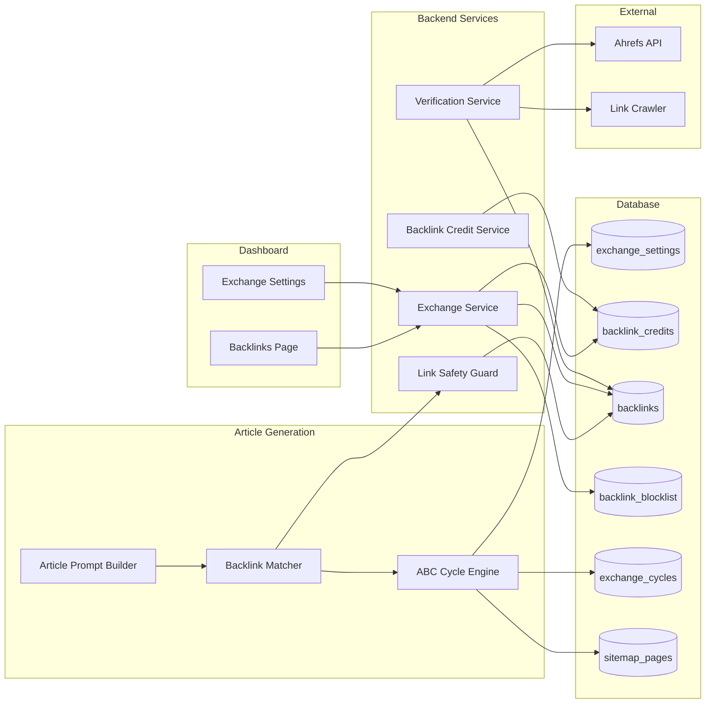
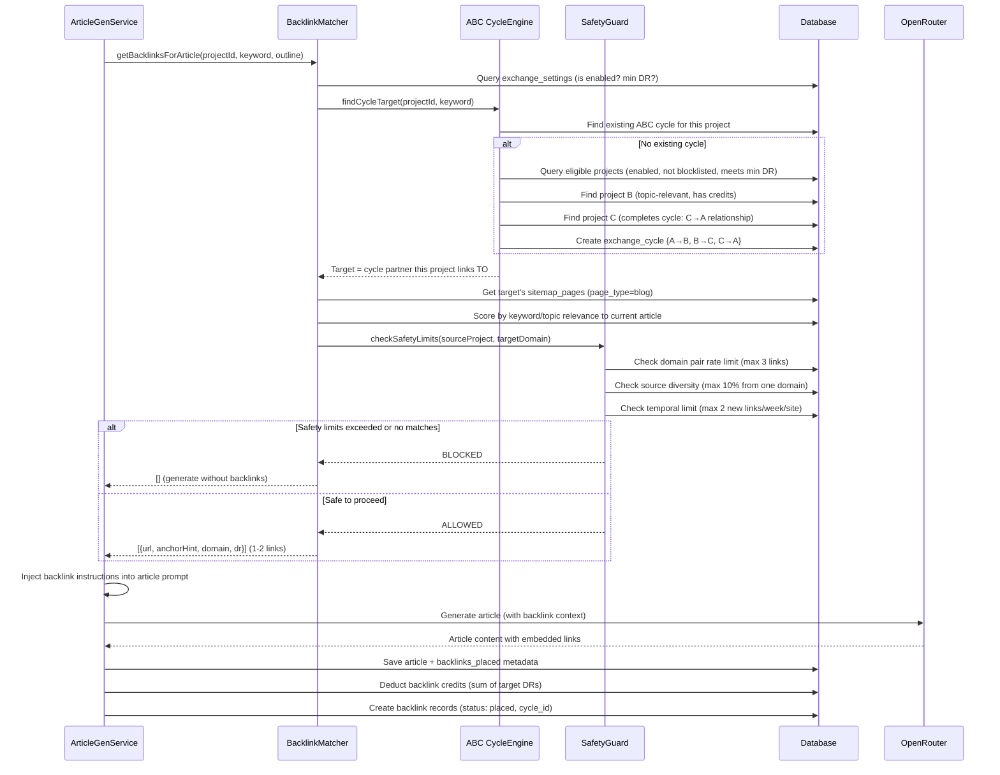
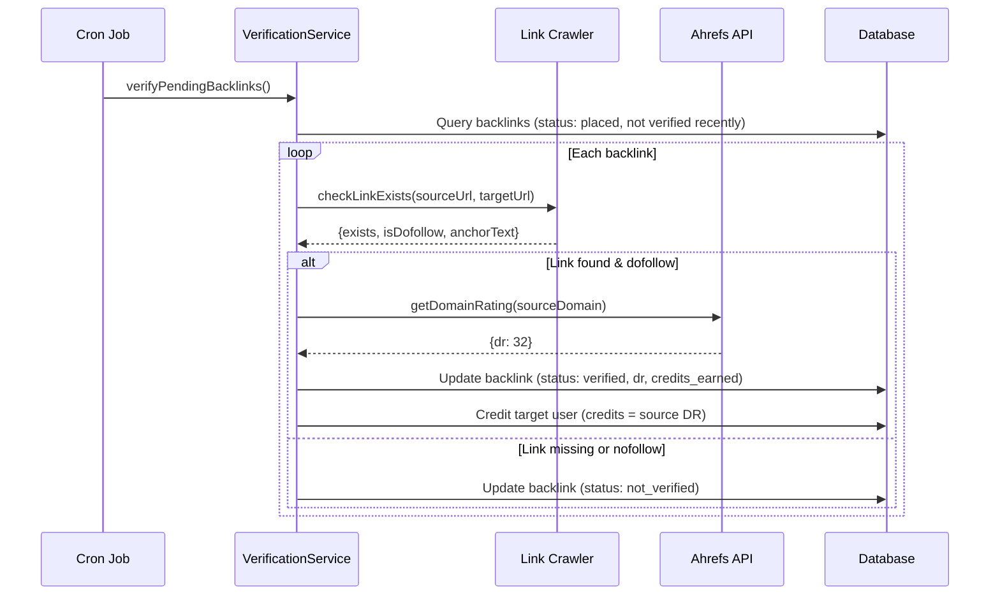

# PRD: Backlink Exchange System

**Complexity: 9 → HIGH mode** (10+ files, new system from scratch, complex state logic, DB schema changes, external API integration)

## 1. Context

**Problem:** Users need a way to build backlinks to their sites to improve Domain Rating and SEO rankings. Currently, link building is manual and expensive. An exchange network where users' generated articles naturally link to other participants' sites creates a win-win backlink flywheel. Direct A↔B reciprocal links are easily detected by Google as link schemes, so we use **three-way (ABC) exchanges** as the primary strategy to keep link profiles clean and penalty-free.

**Files Analyzed:**

- `server/services/article-generation.service.ts` — article generation pipeline
- `server/services/prompts/article-prompts.ts` — prompt templates (injection point for backlinks)
- `shared/config/subscription.config.ts` — subscription tiers (Free/Starter/Growth/Agency)
- `shared/constants/credit-costs.constants.ts` — credit system constants
- `client/config/dashboardRoutes.ts` — dashboard routes (backlinks route already exists, disabled)
- `supabase/migrations/20260224100500_create_sitemap_pages.sql` — sitemap pages table (reuse for blog detection)
- `client/components/pages/BacklinksPageClient.tsx` — placeholder page component

**Current Behavior:**

- Articles are generated via a two-step pipeline (outline → full article) with no external linking logic
- `sitemap_pages` table already stores crawled URLs per project but has no blog/page-type classification
- Dashboard route `/dashboard/backlinks` exists but is disabled (`enabled: false`)
- No backlink tracking, credit, or exchange infrastructure exists
- Subscription tiers define article credits but have no backlink credit allocation

## 2. Solution

**Approach:**

- Create a **separate backlink credit pool** (independent from article generation credits). 1 backlink credit = 1 Domain Rating point.
- **ABC (three-way) exchange as primary strategy**: Site A links to Site B, Site B links to Site C, Site C links to Site A. No direct reciprocity between any pair — Google cannot detect a link scheme. Falls back to direct exchange only when <3 participants are available in a matching cycle.
- **During article generation**, the matching service selects relevant backlink targets from the exchange pool, and injects them as contextual instructions into the article prompt. The AI weaves links naturally into content.
- A **verification system** (our own lightweight crawler) periodically checks that backlinks exist and are dofollow. Ahrefs API is used only for Domain Rating data.
- Each subscription tier includes a **monthly backlink credit allowance**. Users can top up with purchasable credit packs.
- **Topic matching** prefers same-niche placements, with cross-niche fallback when no match is available.
- **Link profile safety guardrails**: rate limiting per domain pair, source diversity enforcement, and temporal spreading to avoid suspicious patterns.

**Architecture:**



### ABC Exchange Model

```
DIRECT (A↔B) — Detectable by Google:
  Site A article → links to Site B
  Site B article → links to Site A
  ⚠️ Reciprocal pattern visible in link graph

THREE-WAY (ABC) — Undetectable:
  Site A article → links to Site B
  Site B article → links to Site C
  Site C article → links to Site A
  ✅ No reciprocal pairs exist. Each site only gives to one and receives from another.

FALLBACK to direct only when:
  - Network has <3 eligible participants for a topic cluster
  - Rate-limited: max 1 direct exchange per domain pair per 90 days
```

**Key Decisions:**

- **ABC three-way exchange primary** — no direct reciprocal links. Falls back to direct only when <3 participants available, rate-limited to max 1 direct exchange per domain pair per 90 days
- **Separate credit pool** — backlink credits don't compete with article generation credits
- **Crawler-first verification** — our crawler checks link existence/dofollow; Ahrefs API only for DR (cost control)
- **Prompt injection** — backlinks are added as instructions to the article generation prompt, not post-processed into content
- **New articles only** — backlinks inserted during generation, no retroactive updates to published articles
- **Fully automatic** — once opted in, no per-link approval needed. Users trust the system.
- **DR-relative min threshold** — on screening approval, `min_domain_rating` auto-set to `max(5, ownDR - 20)` so users get quality-matched exchanges by default without manual tuning
- **Sitemap heuristics for blog detection** — parse sitemap, identify blog URLs via path patterns (`/blog/`, `/posts/`, `/articles/`, `/news/`), add `page_type` column to `sitemap_pages`
- **Link profile safety** — rate limiting per domain pair (max 3 links), source diversity cap (max 10% of backlinks from one domain), temporal spreading (no more than 2 new backlinks per site per week)

**Data Changes:**

### New Tables

1. `backlink_exchange_settings` — per-project exchange configuration
2. `backlink_credits` — separate credit ledger (balance, transactions)
3. `backlinks` — earned and placed backlink records
4. `backlink_blocklist` — domains users want to exclude
5. `backlink_exchange_cycles` — tracks ABC cycle assignments (which projects form a cycle)

### Modified Tables

1. `sitemap_pages` — add `page_type` column (`blog` | `page` | `unknown`)
2. `articles` — add `backlinks_placed` JSONB column (records which backlinks were injected)

### New Config

1. `shared/config/backlink.config.ts` — backlink credit allocations per tier, verification intervals, matching rules

### Network Quality Gate (Anti-Spam)

To protect all participants from Google penalties, every site must pass automated screening before joining the exchange network. Sites that fail are blocked from giving OR receiving backlinks.

**Screening runs when:**

1. User enables "Network Participation" for a project (one-time on opt-in)

**Screening checks:**

| Check                      | Action                                                                                         | Rationale                                                                                          |
| -------------------------- | ---------------------------------------------------------------------------------------------- | -------------------------------------------------------------------------------------------------- |
| **Banned niche detection** | Scan site title, meta description, and top 5 sitemap pages for banned keywords                 | Reject casino, gambling, adult, pharma, payday loans, crypto gambling, weapons, CBD/cannabis sites |
| **Minimum DR threshold**   | Reject sites with DR < 5 (configurable)                                                        | Filters out brand-new/spun-up link farms                                                           |
| **Minimum content check**  | Site must have >= 5 blog posts in sitemap                                                      | Filters out empty shell sites created just for link exchange                                       |
| **Spam signals**           | Check for excessive outbound links (>50 external links per page), hidden text, redirect chains | Detects link farms and cloaked sites                                                               |

**Banned niche keyword list** (stored in config, easily extendable):

```
casino, gambling, poker, slots, betting, adult, xxx, porn, pharma, viagra, cialis,
payday loan, cash advance, crypto gambling, weapons, firearms, cbd, cannabis, vape,
essay writing, homework help, fake diploma, counterfeit
```

**Screening result stored on `backlink_exchange_settings`:**

- `screening_status`: `pending` | `approved` | `rejected`
- `screening_reason`: text (reason for rejection if applicable)
- `screened_at`: timestamp

**Only `approved` projects participate in the exchange.** Rejected sites see a clear message explaining why and how to appeal (contact support).

### Free User Economics

Free users are valuable network participants — their articles carry outbound backlinks to paid users' sites, growing the exchange pool. To reward participation while incentivizing upgrade:

| Aspect                                        | Free            | Paid (Starter/Growth/Agency) |
| --------------------------------------------- | --------------- | ---------------------------- |
| Monthly credit grant                          | 0               | 15 / 50 / 200                |
| Earn credits by giving links                  | Yes (50% rate)  | Yes (100% rate)              |
| Spend credits to get backlinks                | Yes             | Yes                          |
| Example: DR 30 verified backlink to your site | Earn 15 credits | Earn 30 credits              |

**How it works for free users:**

1. Free user enables exchange → their articles start carrying links to other network sites
2. When someone links TO the free user's site and it's verified, they earn credits at **50% of DR** (rounded down)
3. They can spend those earned credits to receive backlinks, same as paid users
4. **No monthly grant** — they must earn everything through participation
5. On pricing page: "Backlink Exchange: Earn-based (50% rate)" vs "Full backlink exchange with X credits/mo"

**Upgrade hook:** Free users see their backlinks page, see credits accumulating slowly, and understand that upgrading gives them monthly credits + full earning rate. The 50% penalty creates a clear value gap without locking them out entirely.

### Anti-Abuse: Tiered Monitoring & Credit Clawback

**Problem:** A shady participant could join the exchange, receive verified backlinks to their site, then manually remove the outbound links from their own blog posts — getting free backlinks while giving nothing.

**Tiered Monitoring Schedule:**

| Backlink Age | Check Frequency | Rationale                                    |
| ------------ | --------------- | -------------------------------------------- |
| 0–30 days    | Daily           | High-risk window — most removals happen here |
| 30–90 days   | Weekly          | Still worth watching                         |
| 90+ days     | Stop monitoring | If it survived 3 months, it's staying        |

**Cron: `monitor-backlinks` (runs daily):**

```sql
-- Recent backlinks: check daily
SELECT * FROM backlinks
WHERE status = 'verified'
  AND last_checked_at < now() - interval '24 hours'
  AND created_at > now() - interval '30 days'
UNION ALL
-- Mature backlinks: check weekly
SELECT * FROM backlinks
WHERE status = 'verified'
  AND last_checked_at < now() - interval '7 days'
  AND created_at BETWEEN now() - interval '90 days' AND now() - interval '30 days'
```

**Removal Detection & Clawback Flow:**

1. Verification crawl fails to find a previously-verified link
2. Increment `failed_checks` counter on the backlink record
3. **Grace period**: After **3 consecutive failures** (72h minimum, accounts for temporary downtime):
   - Set `status: removed`
   - **Credit clawback**: Debit the credits that were originally earned by the link remover (recorded in `credits_earned` on the backlink)
   - Create a `backlink_credit_transaction` with `type: clawback` and negative amount
   - Increment `strikes` on the offending project's `backlink_exchange_settings`
4. If link reappears during grace period → reset `failed_checks` to 0 (no penalty)

**Strike System:**

| Strikes | Consequence                                                            |
| ------- | ---------------------------------------------------------------------- |
| 1       | Warning notification to user                                           |
| 2       | 30-day cooldown — project cannot receive new backlinks                 |
| 3+      | `screening_status: suspended` — project ejected from exchange entirely |

**Cycle Impact:** When an ABC cycle leg is marked `removed`, the cycle status transitions to `broken`. The other two participants are not penalized — they keep their earned credits. Only the remover gets the clawback + strike.

**Credit Transaction Types** (updated):
`subscription_grant | earned | spent | purchased | expired | clawback`

## 3. Sequence Flow

### Article Generation with ABC Backlink Injection



### Backlink Verification Flow



## 4. Execution Phases

---

### Phase 1: Database Schema & Config — "Backlink tables exist and are queryable"

**Files (5):**

- `supabase/migrations/YYYYMMDD000000_create_backlink_exchange_tables.sql` — new tables
- `supabase/migrations/YYYYMMDD000001_add_sitemap_page_type.sql` — add page_type to sitemap_pages
- `supabase/migrations/YYYYMMDD000002_add_article_backlinks_placed.sql` — add backlinks_placed to articles
- `shared/config/backlink.config.ts` — backlink credit allocations, matching rules, verification intervals
- `shared/types/backlink.types.ts` — TypeScript interfaces

**Implementation:**

- [ ] Create `backlink_exchange_settings` table:

  ```sql
  id UUID PK
  project_id UUID FK → projects(id) ON DELETE CASCADE (UNIQUE)
  user_id UUID FK → auth.users(id) ON DELETE CASCADE
  enabled BOOLEAN DEFAULT false
  min_domain_rating INT DEFAULT 5 (CHECK >= 0 AND <= 100) — auto-set to max(5, project_domain_rating - 20) on screening approval
  -- Network quality screening
  project_domain_rating INT — DR fetched from Ahrefs during screening
  screening_status TEXT DEFAULT 'pending' (pending | approved | rejected | suspended)
  screening_reason TEXT
  screened_at TIMESTAMPTZ
  strikes INT DEFAULT 0 — incremented on confirmed link removal; 3 strikes = suspended
  created_at TIMESTAMPTZ
  updated_at TIMESTAMPTZ
  ```

- [ ] Create `backlink_credits` table:

  ```sql
  id UUID PK
  user_id UUID FK → auth.users(id) ON DELETE CASCADE
  balance INT DEFAULT 0 (CHECK >= 0)
  monthly_allowance INT DEFAULT 0
  last_monthly_reset_at TIMESTAMPTZ
  created_at TIMESTAMPTZ
  updated_at TIMESTAMPTZ
  UNIQUE(user_id)
  ```

- [ ] Create `backlink_credit_transactions` table:

  ```sql
  id UUID PK
  user_id UUID FK → auth.users(id) ON DELETE CASCADE
  amount INT NOT NULL (positive = earn, negative = spend)
  type TEXT NOT NULL (subscription_grant | earned | spent | purchased | expired | clawback)
  reference_id UUID (nullable, FK to backlink or article)
  description TEXT
  created_at TIMESTAMPTZ
  ```

- [ ] Create `backlinks` table:

  ```sql
  id UUID PK
  source_project_id UUID FK → projects(id) — project whose article contains the link
  source_article_id UUID FK → articles(id) — article containing the link
  source_url TEXT — full URL of the article
  target_project_id UUID FK → projects(id) — project receiving the backlink
  target_url TEXT NOT NULL — URL being linked to
  target_domain TEXT NOT NULL — domain for quick filtering
  anchor_text TEXT — actual anchor text used
  status TEXT DEFAULT 'placed' (placed | verified | not_verified | removed)
  domain_rating INT — DR of source site at time of verification
  credits_earned INT DEFAULT 0 — credits credited to target user
  failed_checks INT DEFAULT 0 — consecutive failed verification checks (reset on success)
  verified_at TIMESTAMPTZ
  last_checked_at TIMESTAMPTZ
  created_at TIMESTAMPTZ
  updated_at TIMESTAMPTZ
  ```

- [ ] Create `backlink_blocklist` table:

  ```sql
  id UUID PK
  user_id UUID FK → auth.users(id) ON DELETE CASCADE
  domain TEXT NOT NULL
  created_at TIMESTAMPTZ
  UNIQUE(user_id, domain)
  ```

- [ ] Create `backlink_exchange_cycles` table:

  ```sql
  id UUID PK
  -- The three projects forming the cycle: A→B→C→A
  project_a_id UUID FK → projects(id) ON DELETE CASCADE
  project_b_id UUID FK → projects(id) ON DELETE CASCADE
  project_c_id UUID FK → projects(id) ON DELETE CASCADE
  status TEXT DEFAULT 'active' (active | completed | broken)
  -- Track which legs have been fulfilled
  a_to_b_backlink_id UUID (nullable, FK → backlinks)
  b_to_c_backlink_id UUID (nullable, FK → backlinks)
  c_to_a_backlink_id UUID (nullable, FK → backlinks)
  created_at TIMESTAMPTZ
  updated_at TIMESTAMPTZ
  ```

- [ ] Add `cycle_id UUID` (nullable, FK → backlink_exchange_cycles) to `backlinks` table
- [ ] Add `exchange_type TEXT DEFAULT 'abc'` (abc | direct) to `backlinks` table
- [ ] Add `page_type TEXT DEFAULT 'unknown'` column to `sitemap_pages` (values: `blog`, `page`, `unknown`)
- [ ] Add `backlinks_placed JSONB DEFAULT '[]'` column to `articles`
- [ ] RLS policies: users see own data; service_role full access
- [ ] Indexes on foreign keys and status columns
- [ ] Composite index on `backlinks(source_project_id, target_domain)` for domain pair rate limiting
- [ ] Index on `backlinks(target_project_id, created_at)` for temporal spread checks

- [ ] Create `shared/config/backlink.config.ts`:

  ```ts
  export const BACKLINK_CONFIG = {
    creditsPerTier: {
      free: { monthly: 0, earningMultiplier: 0.5 }, // No monthly grant, earn 50% less
      starter: { monthly: 15, earningMultiplier: 1.0 },
      growth: { monthly: 50, earningMultiplier: 1.0 },
      agency: { monthly: 200, earningMultiplier: 1.0 },
    },
    matching: {
      maxLinksPerArticle: 2,
      preferSameNiche: true,
      fallbackCrossNiche: true,
      minDomainRating: 5,
    },
    exchange: {
      preferABC: true, // Three-way exchange preferred
      directFallback: true, // Allow direct if <3 participants
      directCooldownDays: 90, // Max 1 direct exchange per domain pair per 90 days
    },
    safety: {
      maxLinksPerDomainPair: 3, // Max links between any two sites (all time)
      maxSourceDiversityPct: 10, // Max % of backlinks from one domain
      maxNewLinksPerSitePerWeek: 2, // Temporal spreading
      minDaysBetweenLinksToSameSite: 7, // Cool-off between links to same target
    },
    verification: {
      intervalHours: 24,
      maxRetries: 3,
      crawlerTimeoutMs: 10000,
    },
    monitoring: {
      recentWindowDays: 30, // 0-30 days: check daily
      matureWindowDays: 90, // 30-90 days: check weekly
      // 90+ days: stop monitoring
      failedChecksBeforeRemoval: 3, // 3 consecutive failures (72h grace) → removed
      strikesBeforeSuspension: 3, // 3 removed backlinks → project suspended from exchange
    },
    blogPathPatterns: ['/blog/', '/posts/', '/articles/', '/news/', '/journal/', '/insights/'],
  } as const;
  ```

- [ ] Create `shared/types/backlink.types.ts` with interfaces for all entities

**Tests Required:**
| Test File | Test Name | Assertion |
|-----------|-----------|-----------|
| Migration test | Tables exist after migration | All 4 new tables created with correct columns |
| `shared/config/backlink.config.ts` | Config is valid | All tiers have monthly credit values |

**Verification Plan:**

1. `yarn verify` passes
2. Migration applies cleanly (no conflicts with existing schema)

---

### Phase 2: Backlink Credit Service — "Credits can be granted, spent, and queried"

**Files (4):**

- `server/services/backlink-credit.service.ts` — credit balance ops (grant, spend, check, monthly reset)
- `server/services/__tests__/backlink-credit.service.spec.ts` — unit tests
- `src/pages/api/backlinks/credits.ts` — GET endpoint for balance
- `shared/config/subscription.config.ts` — add backlink credit info to plan features array

**Implementation:**

- [ ] `BacklinkCreditService` class:
  - `getBalance(userId)` → `{ balance, monthlyAllowance, lastReset }`
  - `grantMonthlyCredits(userId, tierKey)` → adds tier's monthly credits, records transaction
  - `spendCredits(userId, amount, referenceId)` → atomic deduction with CHECK constraint
  - `earnCredits(userId, amount, referenceId)` → adds credits from verified backlinks
  - `ensureCreditRecord(userId)` → upserts a row in `backlink_credits` if missing
  - `hasEnoughCredits(userId, amount)` → boolean check

- [ ] `GET /api/backlinks/credits` — returns balance for authenticated user

- [ ] Wire monthly credit grant into subscription webhook handler (alongside existing article credit grant)

**Tests Required:**
| Test File | Test Name | Assertion |
|-----------|-----------|-----------|
| `backlink-credit.service.spec.ts` | `should return 0 balance for new user` | balance = 0 |
| `backlink-credit.service.spec.ts` | `should grant monthly credits by tier` | balance += tier monthly |
| `backlink-credit.service.spec.ts` | `should deduct credits on spend` | balance decreased |
| `backlink-credit.service.spec.ts` | `should reject spend when insufficient` | throws / returns false |
| `backlink-credit.service.spec.ts` | `should earn credits from verified backlink` | balance increased |

**Verification Plan:**

1. Unit tests pass
2. `curl GET /api/backlinks/credits` returns `{ success: true, data: { balance: 0, ... } }`
3. `yarn verify` passes

---

### Phase 3: Exchange Settings & Blocklist — "Users can enable/configure backlink exchange"

**Files (5):**

- `server/services/backlink-exchange.service.ts` — exchange settings CRUD, blocklist management
- `src/pages/api/backlinks/settings.ts` — GET/PUT exchange settings
- `src/pages/api/backlinks/blocklist.ts` — GET/POST/DELETE blocklist entries
- `server/services/__tests__/backlink-exchange.service.spec.ts` — unit tests
- `shared/validation/backlink.validation.ts` — Zod schemas for API payloads

**Implementation:**

- [ ] `BacklinkExchangeService`:
  - `getSettings(projectId)` → exchange settings for project
  - `updateSettings(projectId, { enabled, minDomainRating })` → upsert
  - `getBlocklist(userId)` → list of blocked domains
  - `addToBlocklist(userId, domain)` → add domain
  - `removeFromBlocklist(userId, domain)` → remove domain
  - `isDomainBlocked(userId, domain)` → boolean check

- [ ] Zod validation schemas for settings update and blocklist operations

- [ ] API routes with auth middleware, rate limiting

**Tests Required:**
| Test File | Test Name | Assertion |
|-----------|-----------|-----------|
| `backlink-exchange.service.spec.ts` | `should create default settings` | enabled=false, minDR=5 |
| `backlink-exchange.service.spec.ts` | `should update settings` | new values persisted |
| `backlink-exchange.service.spec.ts` | `should add/remove blocklist` | blocklist updated |
| API test | `GET /api/backlinks/settings` | returns settings |
| API test | `PUT /api/backlinks/settings` | updates settings |

**Verification Plan:**

1. Unit tests pass
2. `curl PUT /api/backlinks/settings -d '{"enabled": true, "minDomainRating": 10}'` returns success
3. `curl POST /api/backlinks/blocklist -d '{"domain": "competitor.com"}'` returns success
4. `yarn verify` passes

---

### Phase 4: Network Quality Screening — "Spammy sites are automatically rejected from the exchange"

**Files (3):**

- `server/services/backlink-screening.service.ts` — automated quality screening
- `server/services/__tests__/backlink-screening.service.spec.ts` — unit tests
- `shared/config/backlink.config.ts` — add banned keywords list and screening thresholds

**Implementation:**

- [ ] `BacklinkScreeningService`:
  - `screenProject(projectId)`:
    1. Fetch project domain + sitemap pages
    2. **Banned niche check**: scan site title, meta description, and top 5 sitemap page URLs/titles for banned keywords
    3. **Minimum content check**: verify >= 5 blog posts exist in sitemap
    4. **Spam signal check**: fetch homepage, count external links (reject if >50), check for redirect chains
    5. **Fetch Domain Rating** from Ahrefs API → store as `project_domain_rating` on `backlink_exchange_settings`
    6. **Auto-set `min_domain_rating`** to `max(5, project_domain_rating - 20)` — so users get quality-matched exchanges by default (editable later)
    7. Update `screening_status` on `backlink_exchange_settings`
  - `getBannedKeywords()` → returns banned keywords list from config

- [ ] Add to `BACKLINK_CONFIG`:

  ```ts
  screening: {
    bannedKeywords: ['casino', 'gambling', 'poker', 'slots', 'betting', 'adult', 'xxx',
      'porn', 'pharma', 'viagra', 'cialis', 'payday loan', 'cash advance',
      'crypto gambling', 'weapons', 'firearms', 'cbd', 'cannabis', 'vape',
      'essay writing', 'homework help', 'fake diploma', 'counterfeit'],
    minBlogPosts: 5,
    maxExternalLinksPerPage: 50,
  },
  ```

- [ ] Trigger screening when user enables exchange (in `BacklinkExchangeService.updateSettings()`)
- [ ] Block participation until `screening_status = 'approved'`
- [ ] If rejected: show reason + "Contact support to appeal" message in UI

**Tests Required:**
| Test File | Test Name | Assertion |
|-----------|-----------|-----------|
| `backlink-screening.service.spec.ts` | `should reject site with banned niche keywords` | status=rejected |
| `backlink-screening.service.spec.ts` | `should reject site with <5 blog posts` | status=rejected |
| `backlink-screening.service.spec.ts` | `should reject site with excessive outbound links` | status=rejected |
| `backlink-screening.service.spec.ts` | `should approve clean site` | status=approved |
| `backlink-screening.service.spec.ts` | `should store project DR and auto-set min_domain_rating` | project_domain_rating=fetched DR, min_domain_rating=max(5, DR-20) |

**Verification Plan:**

1. Unit tests pass
2. Enable exchange for a clean project → screening_status = approved
3. Enable exchange for a project with banned keyword in domain → screening_status = rejected
4. `yarn verify` passes

---

### Phase 5: Sitemap Blog Detection — "Sitemap pages are classified as blog or page"

**Files (3):**

- `server/services/sitemap.service.ts` — modify existing service to classify pages during crawl
- `server/services/__tests__/sitemap-blog-detection.spec.ts` — unit tests for heuristic
- `shared/config/backlink.config.ts` — already has `blogPathPatterns`

**Implementation:**

- [ ] Add `classifyPageType(url: string): 'blog' | 'page' | 'unknown'` function:
  - Check URL path against `BACKLINK_CONFIG.blogPathPatterns`
  - URLs matching any pattern → `blog`
  - Known non-blog patterns (`/about`, `/contact`, `/pricing`, `/terms`, `/privacy`, `/faq`) → `page`
  - Everything else → `unknown`

- [ ] Update sitemap crawl/parse to populate `page_type` on insert/upsert

- [ ] Add a backfill function to classify existing `sitemap_pages` rows on demand

**Tests Required:**
| Test File | Test Name | Assertion |
|-----------|-----------|-----------|
| `sitemap-blog-detection.spec.ts` | `should classify /blog/post as blog` | returns 'blog' |
| `sitemap-blog-detection.spec.ts` | `should classify /about as page` | returns 'page' |
| `sitemap-blog-detection.spec.ts` | `should classify unknown paths as unknown` | returns 'unknown' |

**Verification Plan:**

1. Unit tests pass
2. Existing sitemap crawl still works
3. `yarn verify` passes

---

### Phase 6: ABC Cycle Engine & Backlink Matching — "Articles get three-way exchange targets during generation"

**Files (5):**

- `server/services/backlink-cycle.service.ts` — ABC cycle formation and lookup
- `server/services/backlink-matching.service.ts` — matching algorithm + safety guard
- `server/services/__tests__/backlink-matching.service.spec.ts` — unit tests
- `server/services/prompts/article-prompts.ts` — modify to accept backlink injection
- `server/services/article-generation.service.ts` — call matcher before prompt assembly

**Implementation:**

- [ ] `BacklinkCycleService` (ABC cycle engine):
  - `findOrCreateCycle(projectId, keyword)`:
    1. Check if project has an active cycle with open legs
    2. If not: find 2 other eligible projects (enabled, not blocklisted, has credits, meets min DR)
    3. Prefer topic-matched projects. Fallback to cross-niche.
    4. Create cycle record: `{A→B, B→C, C→A}` with project assignments
    5. Return the target project this caller should link TO
  - `getCycleForProject(projectId)` → current active cycle
  - `markLegFulfilled(cycleId, leg: 'a_to_b' | 'b_to_c' | 'c_to_a', backlinkId)`
  - `isDirectFallbackAllowed(sourceProjectId, targetDomain)` → check 90-day cooldown
  - If only 2 participants available and direct fallback enabled: create direct exchange with cooldown enforcement

- [ ] `BacklinkMatchingService`:
  - `getBacklinksForArticle(projectId, keyword, outline)`:
    1. Check project's exchange settings are enabled
    2. Check user has backlink credits
    3. Call `BacklinkCycleService.findOrCreateCycle()` to get target project
    4. From target's `sitemap_pages` (page_type=blog), score by keyword/topic relevance
    5. **Safety checks** before returning:
       - Domain pair limit: max `BACKLINK_CONFIG.safety.maxLinksPerDomainPair` links between these two sites
       - Source diversity: target site doesn't already receive >10% of its backlinks from us
       - Temporal spread: no more than `maxNewLinksPerSitePerWeek` new links this week
       - Cool-off: at least `minDaysBetweenLinksToSameSite` days since last link to this target
    6. If safety blocked: skip this article (no backlinks)
    7. Return `IBacklinkTarget[]` with url, suggestedAnchor, domain, estimatedDR, cycleId, exchangeType

- [ ] Topic matching: simple keyword-in-URL + keyword-in-title scoring. Future: use topic_fingerprint embeddings.

- [ ] Modify `getArticlePrompt()` and `getArticleRetryPrompt()` to accept optional `backlinks: IBacklinkTarget[]` param:

  ```
  CONTEXTUAL BACKLINKS:
  Naturally weave the following links into the article body where topically relevant.
  Use the suggested anchor text or a natural variation. Each link should appear once.
  - [anchor: "photo booth guide"] → https://harryandedge.com/photo-booths-near-me
  - [anchor: "crystal earrings sourcing"] → https://jewelrybuydirect.com/retailers-guide
  Do NOT group these links together. Place them in different sections where they fit naturally.
  ```

- [ ] In `ArticleGenerationService.generateArticle()`, call matcher before prompt building. After generation, save `backlinks_placed` metadata on the article record. Update cycle leg as fulfilled.

**Tests Required:**
| Test File | Test Name | Assertion |
|-----------|-----------|-----------|
| `backlink-matching.service.spec.ts` | `should return empty when exchange disabled` | [] |
| `backlink-matching.service.spec.ts` | `should return empty when no credits` | [] |
| `backlink-matching.service.spec.ts` | `should form ABC cycle with 3 participants` | cycle has 3 distinct projects |
| `backlink-matching.service.spec.ts` | `should not create reciprocal A↔B links in ABC mode` | source ≠ target's source |
| `backlink-matching.service.spec.ts` | `should fallback to direct when <3 participants` | exchangeType = 'direct' |
| `backlink-matching.service.spec.ts` | `should enforce 90-day cooldown on direct exchanges` | blocked after recent direct |
| `backlink-matching.service.spec.ts` | `should block when domain pair limit exceeded` | [] |
| `backlink-matching.service.spec.ts` | `should block when temporal limit exceeded` | [] |
| `backlink-matching.service.spec.ts` | `should block when source diversity limit exceeded` | [] |
| `backlink-matching.service.spec.ts` | `should match blog pages by keyword relevance` | returns targets |
| `backlink-matching.service.spec.ts` | `should exclude blocklisted domains` | blocklisted domain not in results |
| `backlink-matching.service.spec.ts` | `should respect maxLinksPerArticle` | max 2 results |

**Verification Plan:**

1. Unit tests pass
2. Generate an article with 3+ participants → verify ABC cycle created, no reciprocal pairs
3. Generate an article with exchange disabled → `backlinks_placed` is empty/null
4. Rapidly generate articles for same pair → verify safety limits kick in
5. `yarn verify` passes

---

### Phase 7: Backlink Verification & Monitoring — "Placed backlinks are verified and continuously monitored for removal"

**Files (6):**

- `server/services/backlink-verification.service.ts` — crawler + DR lookup + initial verification
- `server/services/backlink-monitoring.service.ts` — tiered re-verification, removal detection, clawback
- `server/services/__tests__/backlink-verification.service.spec.ts` — unit tests
- `server/services/__tests__/backlink-monitoring.service.spec.ts` — unit tests
- `src/pages/api/cron/verify-backlinks.ts` — cron endpoint (initial verification)
- `src/pages/api/cron/monitor-backlinks.ts` — cron endpoint (ongoing monitoring)
- `shared/config/security.ts` — add cron routes to public API routes

**Implementation:**

#### Cron 1: Initial Verification (`verify-backlinks`)

- [ ] `BacklinkVerificationService`:
  - `verifyPendingBacklinks()`:
    1. Query backlinks with `status=placed` or `status=not_verified` (never verified yet)
    2. For each: HTTP GET the source URL, parse HTML, check for target URL link
    3. Check if link is dofollow (no `rel="nofollow"` or `rel="ugc"`)
    4. If found + dofollow: fetch DR from Ahrefs API (or cache), update status=verified, credit target user
    5. If not found: update status=not_verified
  - `checkSingleLink(sourceUrl, targetUrl)` → `{ exists, isDofollow, anchorText }`

- [ ] Lightweight HTML parser (use regex or cheerio-like lib that works in CF Workers) to find links
  - **Important**: must respect 10ms CPU limit. Parse only `<a>` tags, not full DOM.

- [ ] Ahrefs API integration for DR:
  - `getDomainRating(domain)` → number
  - Cache DR values for 7 days (avoid excessive API calls)
  - Add `AHREFS_API_KEY` to `serverEnv` schema

- [ ] Cron endpoint `POST /api/cron/verify-backlinks` (protected by `CRON_SECRET`):
  - Process backlinks in batches (max 50 per run to stay within CPU limits)
  - Schedule: every 6 hours

#### Cron 2: Ongoing Monitoring (`monitor-backlinks`)

- [ ] `BacklinkMonitoringService`:
  - `monitorVerifiedBacklinks()`:
    1. Query verified backlinks using **tiered schedule**:
       - **Recent (0–30 days old)**: `last_checked_at < now() - 24h` — checked daily
       - **Mature (30–90 days old)**: `last_checked_at < now() - 7 days` — checked weekly
       - **Old (90+ days)**: not checked (monitoring ends)
    2. Re-crawl source URL, check if target link still exists + is dofollow
    3. **If link still present**: reset `failed_checks` to 0, update `last_checked_at`
    4. **If link missing**: increment `failed_checks`
    5. **If `failed_checks` >= 3** (grace period exhausted):
       - Set `status: removed`
       - **Credit clawback**: create `backlink_credit_transaction` with `type: clawback`, negative amount = `credits_earned`
       - Debit the clawback amount from the remover's `backlink_credits.balance`
       - Increment `strikes` on the remover's `backlink_exchange_settings`
       - If `strikes >= 3`: set `screening_status: suspended`
       - If cycle exists: mark cycle `status: broken`
       - Send notification to affected user (link remover)

  - `processClawback(backlinkId)`:
    1. Look up backlink's `credits_earned` and `source_project_id`
    2. Find the user who owns the source project (the one who removed the link)
    3. Debit `credits_earned` from their balance
    4. Record clawback transaction
    5. Increment strikes

- [ ] Cron endpoint `POST /api/cron/monitor-backlinks` (protected by `CRON_SECRET`):
  - Process in batches (max 100 per run)
  - Schedule: daily

**Tests Required:**
| Test File | Test Name | Assertion |
|-----------|-----------|-----------|
| `backlink-verification.service.spec.ts` | `should detect existing dofollow link` | status=verified |
| `backlink-verification.service.spec.ts` | `should detect nofollow link` | status=not_verified |
| `backlink-verification.service.spec.ts` | `should detect missing link` | status=not_verified |
| `backlink-verification.service.spec.ts` | `should credit target user on verification` | credits increased by DR |
| `backlink-monitoring.service.spec.ts` | `should reset failed_checks when link reappears` | failed_checks=0 |
| `backlink-monitoring.service.spec.ts` | `should increment failed_checks on missing link` | failed_checks++ |
| `backlink-monitoring.service.spec.ts` | `should clawback credits after 3 consecutive failures` | balance decreased, status=removed |
| `backlink-monitoring.service.spec.ts` | `should add strike to offending project` | strikes++ |
| `backlink-monitoring.service.spec.ts` | `should suspend project after 3 strikes` | screening_status=suspended |
| `backlink-monitoring.service.spec.ts` | `should only check recent backlinks daily` | old backlinks not queried |
| `backlink-monitoring.service.spec.ts` | `should check mature backlinks weekly` | 30-90 day backlinks included when stale |
| `backlink-monitoring.service.spec.ts` | `should skip backlinks older than 90 days` | 90+ day backlinks excluded |

**Verification Plan:**

1. Unit tests pass (with mocked HTTP responses)
2. `curl POST /api/cron/verify-backlinks` with CRON_SECRET → processes placed backlinks
3. `curl POST /api/cron/monitor-backlinks` with CRON_SECRET → re-checks verified backlinks
4. Simulate link removal → after 3 failed checks, credits clawed back + strike added
5. `yarn verify` passes

---

### Phase 8: Dashboard UI — Backlinks Page — "Users can view and manage backlink exchange"

**Files (5):**

- `client/components/pages/BacklinksPageClient.tsx` — main page (replace placeholder)
- `client/components/backlinks/BacklinkExchangeSettings.tsx` — settings panel
- `client/components/backlinks/BacklinkPerformance.tsx` — stats + earned backlinks table
- `client/components/backlinks/BacklinkCreditsCard.tsx` — credit balance display
- `client/config/dashboardRoutes.ts` — enable backlinks route

**Implementation:**

- [ ] **BacklinkExchangeSettings** component:
  - Network participation toggle (enabled/disabled)
  - Min Domain Rating slider (5-100), pre-filled with DR-relative default (`max(5, ownDR - 20)`)
  - Show helper text: "Based on your site's DR of {X}, we recommend accepting sites with DR {Y}+"
  - Calls `PUT /api/backlinks/settings`

- [ ] **BacklinkCreditsCard** component:
  - Shows available credits, monthly allowance
  - Calls `GET /api/backlinks/credits`

- [ ] **BacklinkPerformance** component:
  - Stats cards: Total Backlinks, Unique Sources, Credits Earned
  - Earned Backlinks table with columns:
    - Date | Status (Verified/Not Verified badge) | Credits | DR | Source Website | Source Article | Actions
  - Calls `GET /api/backlinks` (list endpoint)

- [ ] **BacklinksPageClient** — composes all components:
  - Domain Rating display at top (from Ahrefs, cached)
  - Exchange Settings section
  - Credits section
  - Performance section

- [ ] Enable route in `dashboardRoutes.ts`: set `enabled: true`

**Tests Required:**
| Test File | Test Name | Assertion |
|-----------|-----------|-----------|
| Playwright E2E | Backlinks page loads | page has exchange settings |
| Playwright E2E | Toggle exchange enabled | settings saved |
| Playwright E2E | Backlinks table renders | table shows backlink data |

**Verification Plan:**

1. Navigate to `/dashboard/backlinks` → page loads with all sections
2. Toggle exchange → persists on refresh
3. Backlinks table shows data (or empty state)
4. `yarn verify` passes

---

### Phase 9: Blocklist UI + Integration Polish — "Users can manage blocklist and see it all working together"

**Files (4):**

- `client/components/backlinks/BacklinkBlocklist.tsx` — blocklist management UI
- `client/components/pages/BacklinksPageClient.tsx` — add blocklist section
- `src/pages/api/backlinks/index.ts` — GET endpoint for listing earned backlinks
- `shared/config/subscription.config.ts` — add backlink credits to plan features

**Implementation:**

- [ ] **BacklinkBlocklist** component:
  - List of blocked domains with delete button
  - Add domain input + button
  - Calls `GET/POST/DELETE /api/backlinks/blocklist`

- [ ] `GET /api/backlinks` endpoint:
  - List backlinks for the user (earned + placed)
  - Pagination support
  - Filter by status (verified/not_verified/placed)

- [ ] Update subscription plan features to mention backlink credits:
  - Starter: "15 backlink credits/mo"
  - Growth: "50 backlink credits/mo"
  - Agency: "200 backlink credits/mo"

- [ ] Wire monthly backlink credit grant into Stripe subscription webhook

**Tests Required:**
| Test File | Test Name | Assertion |
|-----------|-----------|-----------|
| Playwright E2E | Add domain to blocklist | domain appears in list |
| Playwright E2E | Remove domain from blocklist | domain removed |
| API test | `GET /api/backlinks?status=verified` | returns filtered results |
| API test | `GET /api/backlinks` with pagination | pagination works |

**Verification Plan:**

1. Add `competitor.com` to blocklist → visible in UI
2. Remove it → gone from UI
3. Backlinks list endpoint returns correct data
4. Pricing page shows backlink credit info
5. `yarn verify` passes

---

## 5. Integration Points Checklist

```
How will this feature be reached?
- [x] Entry point: /dashboard/backlinks (existing disabled route)
- [x] Caller: DashboardRouter renders BacklinksPageClient
- [x] Registration: Enable route in dashboardRoutes.ts
- [x] Article gen: BacklinkMatchingService called by ArticleGenerationService
- [x] Cron: verify-backlinks endpoint called by external scheduler (every 6h)
- [x] Cron: monitor-backlinks endpoint called by external scheduler (daily) — tiered re-verification + clawback
- [x] Webhook: Monthly credit grant wired into Stripe subscription handler

Is this user-facing?
- [x] YES → Dashboard backlinks page, exchange settings, blocklist, performance table

Full user flow:
1. User navigates to /dashboard/backlinks
2. Enables "Network Participation" toggle → exchange settings saved
3. Sets min Domain Rating threshold
4. Adds competitors to blocklist
5. When user generates articles (campaigns), backlink matcher selects relevant targets
6. AI weaves backlinks contextually into article content
7. Verification cron checks placed backlinks periodically
8. Verified backlinks credit the target user's backlink balance
9. User sees earned backlinks in performance table with DR, credits, status
```

## 6. Acceptance Criteria

- [ ] All 9 phases complete
- [ ] All specified tests pass
- [ ] `yarn verify` passes
- [ ] Backlinks page accessible at `/dashboard/backlinks`
- [ ] Exchange can be enabled/disabled per project
- [ ] **Network quality screening** rejects spammy/banned-niche sites on opt-in
- [ ] Blocklist prevents linking to/from specified domains
- [ ] **ABC three-way exchanges** are the primary matching mode (no direct reciprocal pairs)
- [ ] Direct exchange falls back only when <3 participants, with 90-day cooldown per domain pair
- [ ] **Safety guardrails active**: domain pair rate limit, source diversity cap, temporal spreading
- [ ] Article generation injects contextual backlinks when exchange is active
- [ ] Verification cron detects placed links and credits users
- [ ] Backlink credit balance tracks independently from article credits
- [ ] Monthly backlink credits granted per subscription tier (free users earn at 50% rate, no monthly grant)
- [ ] **Tiered monitoring active**: daily checks for 0–30 day backlinks, weekly for 30–90 days, none after 90 days
- [ ] **Credit clawback works**: removed backlinks trigger credit reversal after 3 failed checks (72h grace)
- [ ] **Strike system enforced**: 3 strikes → project suspended from exchange
- [ ] All automated checkpoint reviews pass

## 7. Environment Variables

| Variable         | File       | Purpose                             |
| ---------------- | ---------- | ----------------------------------- |
| `AHREFS_API_KEY` | `.env.api` | Ahrefs API for Domain Rating lookup |

Add to `serverEnv` schema in `shared/config/env.ts` (optional — only needed when verification is active).

## 8. Future Enhancements (Out of Scope for v1)

- **Link Targeting**: Let users prioritize which of their pages receive backlinks (Outrank upgrade feature)
- **Purchasable backlink credit packs**: Stripe integration for standalone backlink credit purchases
- **Topic fingerprint matching**: Use existing `topic_fingerprint` embeddings for semantic similarity instead of keyword heuristics
- **Retroactive backlink insertion**: Update existing published articles with new backlinks
- **Approval workflow**: Let users review/reject outbound links before publishing
- **Domain Rating tracking over time**: Chart DR history for user's domain
