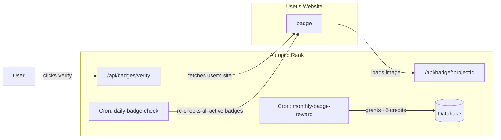
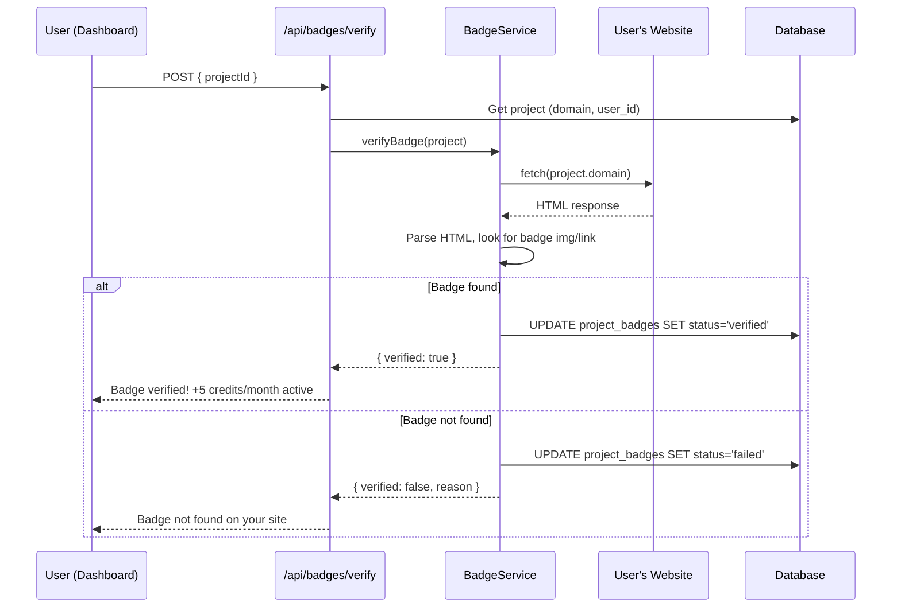
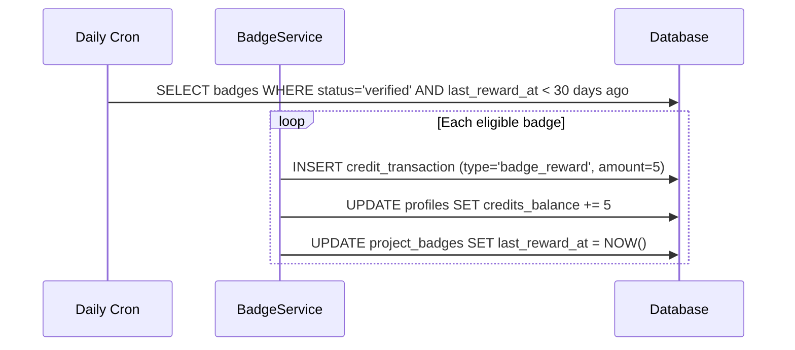

# PRD: Badge Backlink System

**Complexity: 7 → HIGH mode** (new system from scratch, DB schema changes, external API integration, 10+ files, complex verification logic)

---

## 1. Context

**Problem:** We need a mechanism to incentivize website owners to place "Powered by AutopilotRank" backlinks on their sites, driving brand awareness and SEO value. In exchange, users earn +5 bonus credits/month per project with a verified badge.

**Files Analyzed:**
- `shared/config/credits.config.ts`, `shared/config/subscription.config.ts` - Credit system
- `shared/config/env.ts` - Environment variables pattern
- `shared/config/security.ts` - Public API routes
- `client/config/dashboardRoutes.ts` - Dashboard navigation
- `supabase/migrations/` - DB schema and credit transaction types
- `server/services/` - Service layer patterns
- `src/pages/api/` - API route patterns
- `src/pages/api/cron/` - Cron job patterns

**Current Behavior:**
- Users get credits via subscriptions (30/100/500/mo) or credit packs (10/25/50)
- Free tier gets 3 trial articles, no monthly refresh
- Credit transactions use types: `purchase`, `subscription`, `usage`, `refund`, `bonus`, `plan_upgrade`, `plan_downgrade`, `trial`, `expiration`, `clawback`
- Projects table exists with `domain` field per project
- No badge/embed/backlink system exists

---

## 2. Solution

**Approach:**
- Each project gets a unique badge that users embed on their website as an `<a>` + `` HTML snippet
- Badge image is served dynamically via a public API endpoint (`/api/badge/:projectId`) supporting 3 themes (light, neutral, dark)
- Users manage badges from a dedicated `/dashboard/badges` page showing all projects and their badge status
- Daily cron job crawls verified badge URLs to confirm badges remain visible; immediately stops bonus credits on removal
- +5 credits/month granted per project with an active verified badge, tracked as `badge_reward` credit transactions

**Architecture Diagram:**



**Key Decisions:**
- Dynamic badge image via SVG (generated server-side) - lightweight, theme-able, no external assets needed
- Badge verification by fetching the project's domain URL and checking for the badge `` or `<a>` tag pointing to our domain
- `badge_reward` as a new credit transaction type (requires DB migration to update CHECK constraint)
- Cron-based verification (daily) + on-demand verification (user clicks "Verify Badge")
- Badge impressions tracked via the dynamic image endpoint (count requests per project)
- Cloudflare Workers friendly: badge SVG generation is lightweight (<1ms CPU), URL fetch for verification uses fetch API

**Data Changes:**

New table: `project_badges`
```sql
CREATE TABLE public.project_badges (
  id UUID PRIMARY KEY DEFAULT gen_random_uuid(),
  project_id UUID NOT NULL REFERENCES public.projects(id) ON DELETE CASCADE,
  user_id UUID NOT NULL REFERENCES auth.users(id) ON DELETE CASCADE,
  status TEXT NOT NULL DEFAULT 'pending' CHECK (status IN ('pending', 'verified', 'failed', 'inactive')),
  theme TEXT NOT NULL DEFAULT 'light' CHECK (theme IN ('light', 'neutral', 'dark')),
  verified_at TIMESTAMPTZ,
  last_checked_at TIMESTAMPTZ,
  last_reward_at TIMESTAMPTZ,
  check_failures INTEGER NOT NULL DEFAULT 0,
  impressions INTEGER NOT NULL DEFAULT 0,
  verification_url TEXT, -- The specific URL where badge was found
  created_at TIMESTAMPTZ NOT NULL DEFAULT NOW(),
  updated_at TIMESTAMPTZ NOT NULL DEFAULT NOW(),
  UNIQUE(project_id) -- One badge per project
);
```

Migration to update credit transaction type CHECK constraint to include `'badge_reward'`.

---

## 3. Sequence Flow

### Badge Verification Flow


### Monthly Credit Reward Flow


---

## 4. Execution Phases

### Phase 1: Database & Types - Schema foundation

**Files (4):**
- `supabase/migrations/YYYYMMDD000100_create_project_badges.sql` - New table
- `supabase/migrations/YYYYMMDD000200_add_badge_reward_transaction_type.sql` - Update CHECK constraint
- `shared/types/badge.types.ts` - TypeScript interfaces
- `shared/constants/badge.constants.ts` - Badge config constants

**Implementation:**
- [ ] Create `project_badges` table with RLS policies (user can only see/manage own badges)
- [ ] Add `badge_reward` to the credit transaction type CHECK constraint
- [ ] Create RPC function `grant_badge_reward(p_user_id UUID, p_project_id UUID, p_amount INT)` that atomically inserts credit_transaction + updates credits_balance
- [ ] Define `IProjectBadge` interface matching DB schema
- [ ] Define badge constants: `BADGE_REWARD_CREDITS = 5`, `BADGE_CHECK_INTERVAL_DAYS = 1`, `BADGE_REWARD_INTERVAL_DAYS = 30`, badge themes array

**Verification Plan:**
1. **Unit Tests:**
   - File: `tests/unit/shared/constants/badge.constants.unit.spec.ts`
   - Tests: `should export correct reward amount`, `should have valid themes`
2. **Migration Proof:**
   - Run `npx supabase db push` - migration applies without errors
   - Verify table exists with correct columns and constraints

---

### Phase 2: Badge Image API - Dynamic SVG serving

**Files (3):**
- `src/pages/api/badge/[projectId].ts` - Public API endpoint serving badge SVG
- `server/services/badge.service.ts` - Badge generation + verification logic
- `shared/config/security.ts` - Add to PUBLIC_API_ROUTES

**Implementation:**
- [ ] Create `GET /api/badge/:projectId` endpoint (public, no auth)
- [ ] Accept `?theme=light|neutral|dark` query param (default: light)
- [ ] Generate SVG badge image with "Powered by AutopilotRank" text
- [ ] Return with `Content-Type: image/svg+xml` and cache headers (`Cache-Control: public, max-age=3600`)
- [ ] Increment `impressions` counter on `project_badges` (fire-and-forget, don't block response)
- [ ] Add `/api/badge/*` to `PUBLIC_API_ROUTES`
- [ ] BadgeService: `generateBadgeSvg(theme)` method returning SVG string
- [ ] SVG design: ~212x55px, includes AutopilotRank logo text, "Powered by" subtitle, themed background

**Verification Plan:**
1. **Unit Tests:**
   - File: `tests/unit/server/services/badge.service.unit.spec.ts`
   - Tests: `should generate valid SVG for light theme`, `should generate valid SVG for dark theme`, `should generate valid SVG for neutral theme`, `should default to light when invalid theme`
2. **API Proof:**
   ```bash
   curl -s http://localhost:4321/api/badge/test-project-id?theme=light -o badge.svg
   # Expected: Valid SVG file with correct dimensions

   curl -s http://localhost:4321/api/badge/test-project-id?theme=dark -o badge-dark.svg
   # Expected: Dark-themed SVG

   curl -I http://localhost:4321/api/badge/test-project-id
   # Expected: Content-Type: image/svg+xml, Cache-Control header present
   ```

---

### Phase 3: Badge Verification Service - Crawl & verify

**Files (4):**
- `server/services/badge.service.ts` - Add verification methods
- `src/pages/api/badges/verify.ts` - Authenticated endpoint for on-demand verify
- `src/pages/api/badges/index.ts` - CRUD for user's badges (GET list, POST create)
- `src/pages/api/badges/[badgeId].ts` - GET/PATCH/DELETE individual badge

**Implementation:**
- [ ] `BadgeService.verifyBadge(projectDomain: string, projectId: string)`: Fetches the domain URL, parses HTML body for `` or `<a>` tags containing our badge URL pattern (`/api/badge/${projectId}` or `autopilotrank.com`)
- [ ] Handle edge cases: redirects (follow up to 3), timeouts (5s max), non-HTML responses, HTTPS vs HTTP
- [ ] `POST /api/badges/verify` - Triggers on-demand verification for a specific project badge. Updates `project_badges.status`, `verified_at`, `last_checked_at`
- [ ] `GET /api/badges` - Returns all badges for authenticated user (joined with project name/domain)
- [ ] `POST /api/badges` - Creates a new badge record for a project (status: 'pending')
- [ ] `GET /api/badges/:badgeId` - Get single badge details
- [ ] `PATCH /api/badges/:badgeId` - Update theme preference
- [ ] `DELETE /api/badges/:badgeId` - Remove badge (stops rewards)

**Verification Plan:**
1. **Unit Tests:**
   - File: `tests/unit/server/services/badge-verification.unit.spec.ts`
   - Tests: `should detect badge in HTML with img tag`, `should detect badge in HTML with anchor tag`, `should return false when badge not found`, `should handle timeout gracefully`, `should handle non-200 responses`, `should follow redirects`
2. **API Proof:**
   ```bash
   # Create badge
   curl -X POST http://localhost:4321/api/badges \
     -H "Authorization: Bearer $TOKEN" \
     -H "Content-Type: application/json" \
     -d '{"projectId": "uuid-here"}' | jq .
   # Expected: { "id": "...", "status": "pending", ... }

   # Verify badge
   curl -X POST http://localhost:4321/api/badges/verify \
     -H "Authorization: Bearer $TOKEN" \
     -H "Content-Type: application/json" \
     -d '{"projectId": "uuid-here"}' | jq .
   # Expected: { "verified": true/false, "reason": "..." }

   # List badges
   curl http://localhost:4321/api/badges \
     -H "Authorization: Bearer $TOKEN" | jq .
   # Expected: Array of badge objects with project info
   ```

---

### Phase 4: Daily Verification Cron - Automated re-checks

**Files (3):**
- `server/services/badge.service.ts` - Add bulk verification + reward granting
- `src/pages/api/cron/badge-check/index.ts` - Cron endpoint
- `server/controllers/BadgeCronController.ts` - Controller handling cron auth + orchestration

**Implementation:**
- [ ] `BadgeService.runDailyVerification()`: Fetches all `status='verified'` badges, re-checks each, updates status to `'inactive'` if badge no longer found (immediate stop)
- [ ] `BadgeService.grantMonthlyRewards()`: Finds all verified badges where `last_reward_at` is null or > 30 days ago, grants +5 credits each via the RPC function
- [ ] Cron endpoint at `POST /api/cron/badge-check` protected by `x-cron-secret` header (matches existing cron pattern)
- [ ] Runs both daily verification AND monthly reward check in one cron execution
- [ ] Rate limit: process max 100 badges per cron run to stay within Cloudflare Workers limits
- [ ] Log results: verified count, failed count, rewards granted count

**Verification Plan:**
1. **Unit Tests:**
   - File: `tests/unit/server/services/badge-cron.unit.spec.ts`
   - Tests: `should mark badge inactive when verification fails`, `should keep badge verified when check passes`, `should grant rewards for eligible badges`, `should not grant rewards before 30 days`, `should respect batch limit`
2. **API Proof:**
   ```bash
   # Trigger cron manually
   curl -X POST http://localhost:4321/api/cron/badge-check \
     -H "x-cron-secret: $CRON_SECRET" | jq .
   # Expected: { "checked": N, "verified": N, "failed": N, "rewards_granted": N }
   ```

---

### Phase 5: Dashboard UI - Badge management page

**Files (5):**
- `client/components/pages/BadgesPageClient.tsx` - Page wrapper
- `client/components/dashboard/views/BadgesView.tsx` - Main badges view
- `client/hooks/useBadges.ts` - Data fetching hook
- `client/config/dashboardRoutes.ts` - Add badges route
- `locales/en/dashboard.json` - Add i18n strings

**Implementation:**
- [ ] `useBadges()` hook: Fetches `GET /api/badges`, provides `createBadge()`, `verifyBadge()`, `deleteBadge()`, `updateTheme()` mutations
- [ ] `BadgesView` component showing:
  - Header: "Earn Credits with Badges" + explanation text ("Add a Powered by AutopilotRank badge to your website and earn +5 credits/month per project")
  - List of projects as cards, each showing:
    - Project name & domain
    - Badge status indicator (pending/verified/failed/inactive) with colored dot
    - Badge preview (rendered SVG)
    - Theme selector (light/neutral/dark radio buttons)
    - "Copy Badge Code" button (copies HTML snippet to clipboard)
    - "Verify Badge" button (triggers verification, shows loading state)
    - Last verified date
    - Impressions count
    - Next reward date (if verified)
  - Empty state for projects without badges ("Enable badge for this project")
  - Info callout: "Place the badge on your homepage, visible without scrolling. Badge is verified daily."
- [ ] Add `/dashboard/badges` route to `DASHBOARD_ROUTES` in primary group (use `Award` icon from lucide-react)
- [ ] Add i18n keys for all badge-related strings
- [ ] Badge code snippet template:
  ```html
  <a href="https://autopilotrank.com?ref=badge-{projectSlug}" target="_blank" rel="noopener">
    
  </a>
  ```

**Verification Plan:**
1. **Component Tests:**
   - File: `tests/unit/components/BadgesView.unit.spec.tsx`
   - Tests: `should render empty state when no badges`, `should render badge card for each project`, `should copy badge code to clipboard`, `should show verification loading state`, `should display correct status indicators`
2. **E2E / Manual Verification:**
   - Navigate to `/dashboard/badges`
   - See list of projects with badge management UI
   - Copy badge code, verify HTML is correct
   - Click "Verify Badge", see loading then result
   - Change theme, see preview update

---

## 5. Acceptance Criteria

- [ ] All phases complete with passing automated checkpoints
- [ ] `project_badges` table created with proper RLS (users see only own badges)
- [ ] `badge_reward` credit transaction type works in DB
- [ ] Dynamic badge SVG endpoint serves themed badges at `/api/badge/:projectId`
- [ ] On-demand badge verification works (fetches site, detects badge)
- [ ] Daily cron re-verifies all active badges
- [ ] Monthly reward of +5 credits granted per verified badge
- [ ] Credits stop immediately when badge is removed (detected by daily cron)
- [ ] Dashboard page at `/dashboard/badges` lets users manage badges per project
- [ ] Badge code snippet is copyable with correct URL and tracking params
- [ ] All tests pass: `yarn test`
- [ ] `yarn verify` passes
- [ ] Feature is reachable from sidebar navigation

---

## 6. Out of Scope (Future)

- Referral tracking (badge clicks → signups → bonus credits)
- Badge customization (custom colors, logos)
- Badge placement verification (above-the-fold detection)
- Email notifications for badge verification failures
- Admin dashboard for badge analytics
- Badge requirement for free tier (currently optional for all tiers)
