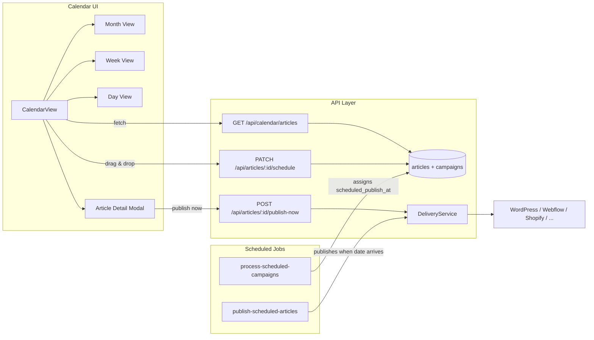
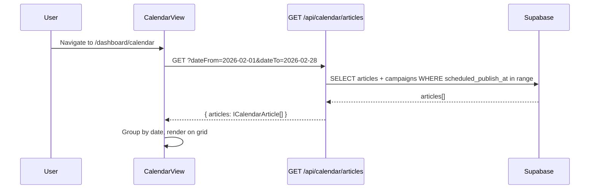
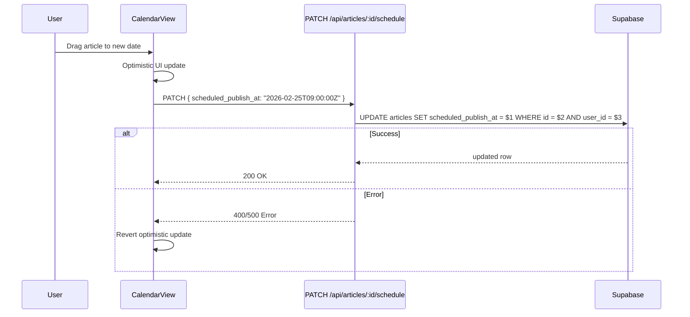
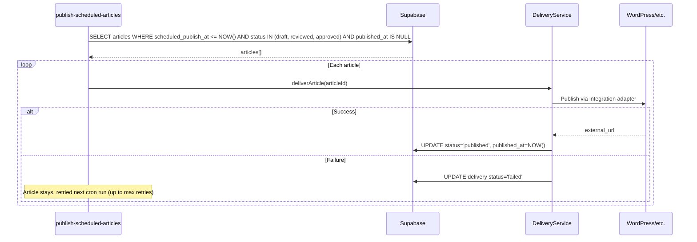

# PRD: Content Calendar System

**Complexity: 8 → HIGH mode** (10+ files, new DB columns, new cron job, full UI feature, existing system integration)

---

## 1. Context

**Problem:** Users cannot visualize when their campaign articles are scheduled to publish, nor can they manually reschedule individual articles to specific dates. The scheduling system works at the campaign-frequency level but lacks per-article publish date control and a visual calendar interface.

**Files Analyzed:**

- `client/components/dashboard/views/_disabled/CalendarView.tsx` — existing disabled calendar (month-only, mock data)
- `client/config/dashboardRoutes.ts` — route already registered, `enabled: false`
- `client/components/pages/CalendarPageClient.tsx` — lazy-loaded page wrapper
- `shared/types/article.types.ts` — article interfaces, statuses
- `shared/types/campaign.types.ts` — campaign interfaces
- `server/services/delivery.service.ts` — platform publishing flow
- `server/services/integration.service.ts` — integration management
- `server/services/campaign-scheduling.service.ts` — campaign scheduling logic
- `src/pages/api/articles/index.ts` — articles list endpoint
- `src/pages/api/cron/process-scheduled-campaigns/index.ts` — cron for campaign batch processing
- `supabase/migrations/20260205100200_create_articles_table.sql` — articles schema
- `shared/config/scheduling.config.ts` — scheduling frequencies and config
- `client/utils/statusStyles.ts` — status color utilities

**Current Behavior:**

- Articles are generated in batches via campaign schedule (frequency + batch size)
- Articles have `published_at` (actual publish timestamp) but NO `scheduled_publish_at` (desired publish date)
- Campaign cron runs every 5 minutes, generates articles immediately, no per-article publish scheduling
- A disabled CalendarView component exists with month view, drag-and-drop, and CRUD modals — all using mock data
- The dashboard route `/dashboard/calendar` is registered but `enabled: false`
- Platform publishing exists via `DeliveryService` (WordPress, Webflow, Shopify, etc.)

---

## 2. Solution

**Approach:**

1. Add `scheduled_publish_at` column to articles table — this becomes the anchor date for the calendar
2. When the campaign cron creates articles, calculate and assign individual `scheduled_publish_at` dates based on the campaign frequency
3. Add a new cron job that publishes articles whose `scheduled_publish_at` has arrived and whose content is ready (status = `draft` or `reviewed` or `approved`)
4. Revive the disabled CalendarView with real data, add week/day views, wire drag-and-drop to update `scheduled_publish_at`, and add an article detail modal with actions
5. Enable the `/dashboard/calendar` route

**Architecture Diagram:**



**Key Decisions:**

- Revive existing `CalendarView.tsx` rather than building from scratch (already has month grid, drag-and-drop, modal shell)
- Dynamic campaign colors using a hash-to-palette mapping (campaigns have no `color` DB field)
- `scheduled_publish_at` is the single source of truth for calendar positioning
- Publishing is free (credit already spent on article generation)
- Calendar shows all article statuses with distinct visual indicators
- Drag-and-drop only changes individual article's `scheduled_publish_at`, never the campaign schedule

**Data Changes:**

- New migration: `ALTER TABLE articles ADD COLUMN scheduled_publish_at TIMESTAMPTZ`
- New index: `CREATE INDEX idx_articles_scheduled_publish_at ON articles(scheduled_publish_at) WHERE scheduled_publish_at IS NOT NULL`

---

## 3. Sequence Flows

### 3.1 Calendar Data Loading



### 3.2 Drag-and-Drop Reschedule



### 3.3 Scheduled Publishing Cron



---

## 4. Execution Phases

### Integration Points Checklist

```
How will this feature be reached?
- [x] Entry point: /dashboard/calendar route (already registered, needs enabled: true)
- [x] Caller file: client/config/dashboardRoutes.ts → CalendarPageClient → CalendarView
- [x] Registration: Change enabled: false → true in dashboardRoutes.ts

Is this user-facing?
- [x] YES → CalendarView (month/week/day), Article Detail Modal, drag-and-drop

Full user flow:
1. User clicks "Calendar" in dashboard sidebar
2. DashboardRouter resolves /dashboard/calendar → CalendarPageClient
3. CalendarView loads, fetches articles for visible date range
4. User sees articles positioned on calendar by scheduled_publish_at
5. User can drag articles to reschedule, click to see details, or publish now
```

---

### Phase 1: Database Schema + Calendar API Endpoint

**User-visible outcome:** Backend ready to serve calendar data with scheduled publish dates.

**Files (4):**

- `supabase/migrations/YYYYMMDDHHMMSS_add_scheduled_publish_at.sql` — new column + index
- `shared/types/article.types.ts` — add `scheduled_publish_at` field to interfaces
- `src/pages/api/calendar/articles.ts` — new GET endpoint for calendar data
- `server/services/campaign-scheduling.service.ts` — assign `scheduled_publish_at` when creating articles

**Implementation:**

- [ ] Create migration adding `scheduled_publish_at TIMESTAMPTZ` to articles table
- [ ] Add index on `scheduled_publish_at` WHERE NOT NULL
- [ ] Add `scheduled_publish_at` to `IArticle` interface
- [ ] Create `GET /api/calendar/articles` endpoint accepting `dateFrom`, `dateTo` query params
  - Returns articles with campaign name, status, scheduled_publish_at, title, primary_keyword
  - Joins with campaigns table for campaign name
  - Filters by user_id (authenticated)
- [ ] Update `campaign-scheduling.service.ts` to assign `scheduled_publish_at` when creating article batches
  - Calculate dates based on campaign frequency and batch position (e.g., daily campaign with batch of 3 → today, tomorrow, day after)

**Verification Plan:**

1. **Migration test:** Run `npx supabase migration up` — column exists
2. **API test (curl):**

   ```bash
   # Happy path
   curl -X GET "http://localhost:4321/api/calendar/articles?dateFrom=2026-02-01&dateTo=2026-02-28" \
     -H "Authorization: Bearer $TOKEN" | jq .
   # Expected: { articles: [...], total: N }

   # Missing auth
   curl -X GET "http://localhost:4321/api/calendar/articles" | jq .
   # Expected: 401
   ```

3. **Unit tests:**
   | Test File | Test Name | Assertion |
   |-----------|-----------|-----------|
   | `tests/unit/calendar-articles.spec.ts` | `should return articles within date range` | `expect(result.articles.length).toBeGreaterThan(0)` |
   | `tests/unit/calendar-articles.spec.ts` | `should require dateFrom and dateTo params` | `expect(response.status).toBe(400)` |
   | `tests/unit/calendar-articles.spec.ts` | `should include campaign name in response` | `expect(article.campaign_name).toBeDefined()` |

---

### Phase 2: Reschedule API + Publish-Now Endpoint

**User-visible outcome:** Articles can be rescheduled to new dates and published on demand via API.

**Files (3):**

- `src/pages/api/articles/[articleId]/schedule.ts` — PATCH endpoint for rescheduling
- `src/pages/api/articles/[articleId]/publish-now.ts` — POST endpoint for immediate publishing
- `shared/config/security.ts` — add routes to security config if needed

**Implementation:**

- [ ] Create `PATCH /api/articles/:articleId/schedule` endpoint
  - Accepts `{ scheduled_publish_at: string }` (ISO 8601)
  - Validates: article belongs to user, date is in the future, article status allows scheduling
  - Updates `scheduled_publish_at` in DB
- [ ] Create `POST /api/articles/:articleId/publish-now` endpoint
  - Validates: article belongs to user, article has content (status >= draft)
  - Calls `DeliveryService.deliverArticle()` to publish to connected platforms
  - Updates `published_at` to NOW()
- [ ] Add any new routes to security config if they need special handling

**Verification Plan:**

1. **API tests (curl):**

   ```bash
   # Reschedule
   curl -X PATCH "http://localhost:4321/api/articles/ARTICLE_ID/schedule" \
     -H "Authorization: Bearer $TOKEN" \
     -H "Content-Type: application/json" \
     -d '{"scheduled_publish_at": "2026-03-01T09:00:00Z"}' | jq .
   # Expected: { success: true, scheduled_publish_at: "2026-03-01T09:00:00Z" }

   # Publish now
   curl -X POST "http://localhost:4321/api/articles/ARTICLE_ID/publish-now" \
     -H "Authorization: Bearer $TOKEN" | jq .
   # Expected: { success: true, published_at: "...", deliveries: [...] }
   ```

2. **Unit tests:**
   | Test File | Test Name | Assertion |
   |-----------|-----------|-----------|
   | `tests/unit/article-schedule.spec.ts` | `should update scheduled_publish_at` | `expect(article.scheduled_publish_at).toBe(newDate)` |
   | `tests/unit/article-schedule.spec.ts` | `should reject past dates` | `expect(response.status).toBe(400)` |
   | `tests/unit/article-schedule.spec.ts` | `should reject articles not owned by user` | `expect(response.status).toBe(403)` |
   | `tests/unit/article-publish-now.spec.ts` | `should call delivery service` | `expect(deliverArticle).toHaveBeenCalled()` |

---

### Phase 3: Publishing Cron Job

**User-visible outcome:** Articles auto-publish to connected platforms when their scheduled date arrives.

**Files (3):**

- `src/pages/api/cron/publish-scheduled-articles/index.ts` — new cron endpoint
- `server/services/scheduled-publishing.service.ts` — publishing logic
- `shared/config/scheduling.config.ts` — add publishing config constants

**Implementation:**

- [ ] Create `scheduled-publishing.service.ts` with `processScheduledPublications()` method:
  - Query articles where `scheduled_publish_at <= NOW()` AND `status IN ('draft', 'reviewed', 'approved')` AND `published_at IS NULL`
  - Limit to 10 articles per run (configurable)
  - For each article, call `DeliveryService.deliverArticle()`
  - On success: update `status = 'published'`, `published_at = NOW()`
  - On failure: log error, increment retry counter (articles without integrations are skipped and marked published locally)
- [ ] Create cron endpoint at `/api/cron/publish-scheduled-articles`
  - Protected by cron auth header (same pattern as existing crons)
  - Calls `processScheduledPublications()`
- [ ] Add config constants: `MAX_PUBLISH_PER_RUN = 10`, `MAX_PUBLISH_RETRIES = 3`

**Verification Plan:**

1. **Unit tests:**
   | Test File | Test Name | Assertion |
   |-----------|-----------|-----------|
   | `tests/unit/scheduled-publishing.spec.ts` | `should publish articles with past scheduled_publish_at` | `expect(deliverArticle).toHaveBeenCalledTimes(N)` |
   | `tests/unit/scheduled-publishing.spec.ts` | `should skip already published articles` | `expect(deliverArticle).not.toHaveBeenCalled()` |
   | `tests/unit/scheduled-publishing.spec.ts` | `should respect max retries` | `expect(skippedCount).toBe(1)` |
   | `tests/unit/scheduled-publishing.spec.ts` | `should not process future-dated articles` | `expect(result.processed).toBe(0)` |
2. **curl test:**
   ```bash
   curl -X POST "http://localhost:4321/api/cron/publish-scheduled-articles" \
     -H "Authorization: Bearer CRON_SECRET" | jq .
   # Expected: { processed: N, published: N, failed: 0 }
   ```

---

### Phase 4: Revive CalendarView — Month View with Real Data

**User-visible outcome:** Users see the Calendar in the sidebar, navigate to it, and see their articles on a month grid with real data from the API.

**Files (5):**

- `client/config/dashboardRoutes.ts` — enable calendar route
- `client/components/dashboard/views/CalendarView.tsx` — move from `_disabled/`, refactor with real data
- `client/hooks/useCalendarArticles.ts` — data fetching hook
- `client/utils/calendarHelpers.ts` — color mapping, date utilities
- `shared/types/calendar.types.ts` — calendar-specific types

**Implementation:**

- [ ] Enable route: set `enabled: true` in dashboardRoutes.ts
- [ ] Move `CalendarView.tsx` from `_disabled/` to `views/`
- [ ] Create `ICalendarArticle` type mapping article data for calendar display:
  ```typescript
  interface ICalendarArticle {
    id: string;
    title: string;
    primaryKeyword: string;
    scheduledPublishAt: string;
    status: ArticleStatus;
    campaignId: string;
    campaignName: string;
    campaignColor: string; // dynamically assigned
  }
  ```
- [ ] Create `useCalendarArticles(dateFrom, dateTo)` hook using fetch + SWR/React Query pattern
- [ ] Create `calendarHelpers.ts` with:
  - `getCampaignColor(campaignId)` — deterministic color from a palette based on campaign ID hash
  - `getCalendarStatusConfig(status)` — maps ArticleStatus → `{ label, dotColor, bgClass, textClass }`
  - Status mapping:
    - `queued` → Queued (gray)
    - `generating` → Generating (blue, animated pulse)
    - `draft` / `qa_passed` / `approved` / `reviewed` → Ready (purple)
    - `published` → Published (green)
    - `failed` / `failed_quality` / `failed_timeout` / `qa_failed` / `rejected` → Failed (red)
- [ ] Refactor CalendarView month grid to use real data:
  - Replace mock events with `useCalendarArticles` data
  - Show campaign color dot on each event
  - Show status indicator (colored dot or badge)
  - Show title (truncated) and campaign name
  - Fetch new data when month navigation changes

**Verification Plan:**

1. **Playwright E2E:**
   | Test File | Test Name | Assertion |
   |-----------|-----------|-----------|
   | `tests/e2e/calendar.e2e.spec.ts` | `should show Calendar in sidebar` | `expect(page.locator('text=Calendar')).toBeVisible()` |
   | `tests/e2e/calendar.e2e.spec.ts` | `should navigate to /dashboard/calendar` | `expect(page).toHaveURL('/dashboard/calendar')` |
   | `tests/e2e/calendar.e2e.spec.ts` | `should display month grid with day headers` | `expect(page.locator('text=Sun')).toBeVisible()` |
   | `tests/e2e/calendar.e2e.spec.ts` | `should navigate between months` | click next → month name changes |
2. **Unit tests:**
   | Test File | Test Name | Assertion |
   |-----------|-----------|-----------|
   | `tests/unit/calendarHelpers.spec.ts` | `should return consistent color for same campaign ID` | `expect(color1).toBe(color2)` |
   | `tests/unit/calendarHelpers.spec.ts` | `should map all article statuses to calendar status` | all statuses covered |
3. **Manual verification:** Navigate to /dashboard/calendar, see month grid with today highlighted

---

### Phase 5: Week + Day Views

**User-visible outcome:** Users can switch between Month, Week, and Day views for different levels of detail.

**Files (4):**

- `client/components/dashboard/views/calendar/WeekView.tsx` — week view component
- `client/components/dashboard/views/calendar/DayView.tsx` — day view component
- `client/components/dashboard/views/calendar/MonthView.tsx` — extract month grid from CalendarView
- `client/components/dashboard/views/CalendarView.tsx` — add view switcher, compose views

**Implementation:**

- [ ] Extract month grid into `MonthView.tsx` component (from current CalendarView)
- [ ] Create `WeekView.tsx`:
  - 7-column layout with time slots (hourly rows from 6 AM to 10 PM)
  - Articles positioned at their `scheduled_publish_at` hour
  - Same event cards as month view but with more detail (show keyword, status badge)
  - Drag-and-drop between time slots and days
- [ ] Create `DayView.tsx`:
  - Single day with hourly time slots
  - Full article cards with title, keyword, campaign, status, and platform
  - Drag-and-drop between time slots
- [ ] Add view switcher tabs (Month | Week | Day) to CalendarView header
  - Persist selected view in localStorage
  - Navigation buttons adapt: month ←→, week ←→, day ←→

**Verification Plan:**

1. **Playwright E2E:**
   | Test File | Test Name | Assertion |
   |-----------|-----------|-----------|
   | `tests/e2e/calendar.e2e.spec.ts` | `should switch to week view` | click Week tab → week grid visible |
   | `tests/e2e/calendar.e2e.spec.ts` | `should switch to day view` | click Day tab → hourly slots visible |
   | `tests/e2e/calendar.e2e.spec.ts` | `should persist view preference` | reload → same view selected |
2. **Manual verification:** Switch between all three views, verify navigation works in each

---

### Phase 6: Drag-and-Drop Rescheduling + Article Detail Modal

**User-visible outcome:** Users can drag articles to new dates to reschedule them, and click on articles to see details and take actions (View/Edit, Reschedule, Publish Now).

**Files (4):**

- `client/components/dashboard/views/calendar/ArticleDetailModal.tsx` — article detail/action modal
- `client/components/dashboard/views/CalendarView.tsx` — wire drag-and-drop to API
- `client/hooks/useArticleActions.ts` — hooks for reschedule + publish-now mutations
- `client/components/dashboard/views/calendar/MonthView.tsx` — update drag handlers

**Implementation:**

- [ ] Create `useArticleActions()` hook:
  - `reschedule(articleId, newDate)` — calls PATCH `/api/articles/:id/schedule`
  - `publishNow(articleId)` — calls POST `/api/articles/:id/publish-now`
  - Both use optimistic updates with rollback on error
  - Invalidate calendar query on success
- [ ] Wire drag-and-drop in all three views:
  - On drop: call `reschedule()` with new date
  - Show toast notification on success/failure
  - Only allow dragging articles with schedulable statuses (not published, not generating)
- [ ] Create `ArticleDetailModal.tsx`:
  - Triggered on article click in any view
  - Shows: title, primary keyword, campaign name (color dot), status badge, scheduled date, word count
  - Actions:
    - **Reschedule** — date picker to change `scheduled_publish_at`
    - **Publish Now** — immediate publish (with confirmation)
    - **View Article** — link to article detail page (if exists) or content preview
  - Published articles show: published URL, delivery status per platform
- [ ] Remove the old add/edit modal from the revived CalendarView (replaced by ArticleDetailModal)

**Verification Plan:**

1. **Playwright E2E:**
   | Test File | Test Name | Assertion |
   |-----------|-----------|-----------|
   | `tests/e2e/calendar.e2e.spec.ts` | `should open article detail on click` | click event → modal visible with article title |
   | `tests/e2e/calendar.e2e.spec.ts` | `should show Publish Now button for draft articles` | modal has publish button |
   | `tests/e2e/calendar.e2e.spec.ts` | `should show Reschedule date picker` | modal has date input |
2. **Unit tests:**
   | Test File | Test Name | Assertion |
   |-----------|-----------|-----------|
   | `tests/unit/useArticleActions.spec.ts` | `should call reschedule API` | `expect(fetch).toHaveBeenCalledWith(expectedUrl)` |
   | `tests/unit/useArticleActions.spec.ts` | `should optimistically update calendar` | UI updates before API response |
3. **Manual verification:** Drag an article to a new date, verify toast appears, verify API was called

---

### Phase 7: Campaign Color Legend + Filters

**User-visible outcome:** Users can filter the calendar by campaign and see a color legend showing which campaign each color represents.

**Files (3):**

- `client/components/dashboard/views/calendar/CalendarFilters.tsx` — filter bar component
- `client/components/dashboard/views/calendar/CampaignLegend.tsx` — color legend
- `client/components/dashboard/views/CalendarView.tsx` — integrate filters

**Implementation:**

- [ ] Create `CampaignLegend.tsx`:
  - Horizontal bar showing campaign name + color dot for each campaign with articles in the visible range
  - Clicking a campaign toggles its visibility (filter)
  - "Show All" button to reset
- [ ] Create `CalendarFilters.tsx`:
  - Status filter: All | Scheduled | Ready | Published | Failed
  - Campaign dropdown filter (multi-select)
  - Compact filter bar below the calendar header
- [ ] Wire filters to CalendarView:
  - Filter applied client-side (data already fetched)
  - Filtered-out events are hidden, not removed from data
  - Filter state persisted in URL search params or localStorage

**Verification Plan:**

1. **Playwright E2E:**
   | Test File | Test Name | Assertion |
   |-----------|-----------|-----------|
   | `tests/e2e/calendar.e2e.spec.ts` | `should show campaign color legend` | legend visible with campaign names |
   | `tests/e2e/calendar.e2e.spec.ts` | `should filter by campaign` | click campaign → only its articles shown |
   | `tests/e2e/calendar.e2e.spec.ts` | `should filter by status` | click status → matching articles shown |
2. **Manual verification:** Filter by campaign, verify only that campaign's articles appear

---

## 5. Checkpoint Protocol

All phases use **automated checkpoints** via `prd-work-reviewer` agent.

Phases 4, 5, 6, 7 additionally require **manual checkpoint** (UI visual changes).

| Phase | Type               | Notes                                       |
| ----- | ------------------ | ------------------------------------------- |
| 1     | Automated only     | DB migration + API endpoint                 |
| 2     | Automated only     | API endpoints                               |
| 3     | Automated only     | Cron job + service                          |
| 4     | Automated + Manual | First visual UI — verify calendar renders   |
| 5     | Automated + Manual | New views — verify week/day grids           |
| 6     | Automated + Manual | Drag-and-drop + modal — verify interactions |
| 7     | Automated + Manual | Filters — verify filtering behavior         |

---

## 6. Acceptance Criteria

- [ ] All 7 phases complete
- [ ] All unit, integration, and E2E tests pass
- [ ] `yarn verify` passes
- [ ] All automated checkpoint reviews passed
- [ ] Manual checkpoints verified for phases 4-7
- [ ] Calendar is accessible from sidebar at `/dashboard/calendar`
- [ ] Articles display on calendar at their `scheduled_publish_at` date
- [ ] Users can drag-and-drop articles to reschedule
- [ ] Users can click articles to see details and publish
- [ ] Month, Week, and Day views all functional
- [ ] Campaign color legend and filters work
- [ ] Publishing cron auto-publishes articles when scheduled date arrives
- [ ] No orphaned code — all features connected to existing flows

---

## Future Enhancements (Out of Scope)

- GSC opportunity suggestions on the calendar
- Standalone article scheduling (without a campaign)
- Recurring article templates
- Smart scheduling suggestions based on SEO velocity
- Calendar sharing / team collaboration
- Email notifications before scheduled publish
