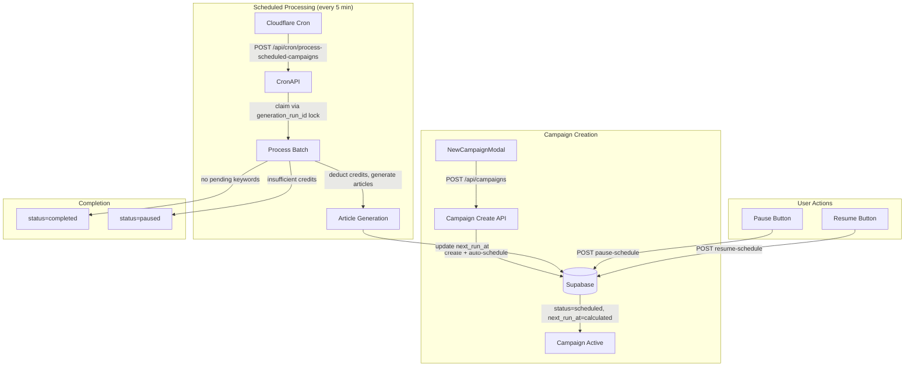
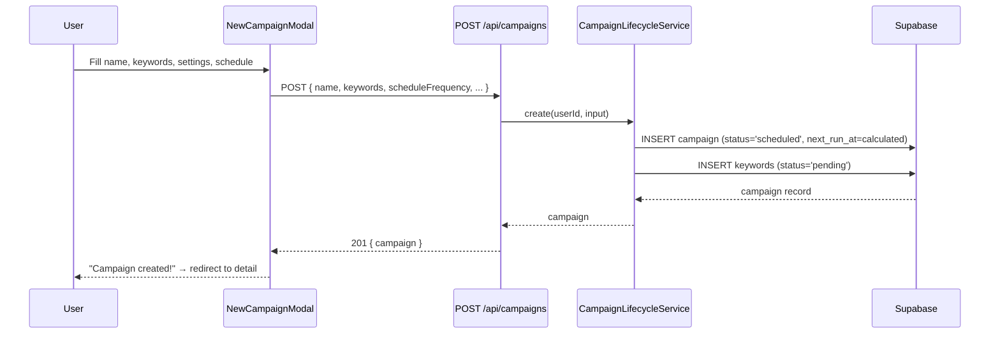
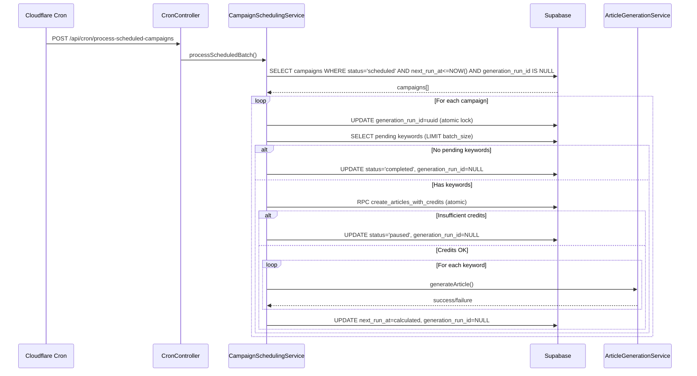

# PRD: Campaign Autopilot Simplification

**Complexity: 8 → HIGH mode**
**Status:** Draft
**Author:** Claude
**Date:** 2026-03-01
**Primary Goal:** Remove bulk generation, make all campaigns schedule-only, auto-activate on creation
**Branch:** `feat/campaign-autopilot-simplification`

---

## 1. Context

**Problem:** The campaign system has two parallel generation flows — bulk (immediate) and scheduled — which creates SEO risk (30+ articles flooding a site at once triggers Google penalties and users blame us), UX confusion (users don't understand "Start Generation" vs "Start Schedule"), and defeats the "autopilot" brand promise (campaigns require manual activation and stop dead when keywords run out).

**Files Analyzed:**

- `shared/types/campaign.types.ts` — `CampaignStatus`, `ICampaign`, `ICreateCampaignInput`
- `shared/validation/campaign.schema.ts` — `createCampaignSchema`, `updateCampaignSchema`, `CAMPAIGN_STATUSES`
- `server/services/campaign.service.ts` — Facade: `startGeneration`, `startSchedule`, `processScheduledBatch`
- `server/services/campaign-lifecycle.service.ts` — `create()`, `update()`, `delete()`, status transitions
- `server/services/campaign-scheduling.service.ts` — `startSchedule()`, `processScheduledBatch()`, cron claim logic
- `server/services/campaign-idempotency.service.ts` — Bulk-only idempotency (can be deprecated)
- `server/services/batch-limit.service.ts` — Bulk-only rate limit (can be deprecated)
- `src/pages/api/campaigns/[campaignId]/start.ts` — Bulk generation endpoint
- `src/pages/api/campaigns/[campaignId]/start-schedule.ts` — Schedule start endpoint
- `src/pages/api/campaigns/[campaignId]/pause-schedule.ts` — Schedule pause endpoint
- `src/pages/api/campaigns/[campaignId]/resume-schedule.ts` — Schedule resume endpoint
- `src/pages/api/cron/process-scheduled-campaigns/index.ts` — Cron endpoint
- `server/controllers/CronController.ts` — Routes cron requests
- `client/components/dashboard/views/NewCampaignModal.tsx` — Campaign creation wizard
- `client/components/dashboard/views/new-campaign-modal/ScheduleConfigStep.tsx` — Schedule toggle UI
- `client/components/dashboard/views/new-campaign-modal/validationSchema.ts` — Form validation
- `client/components/dashboard/views/CampaignDetailView.tsx` — Campaign detail page
- `client/components/dashboard/views/campaign-detail/CampaignDetailHeader.tsx` — Action buttons
- `client/hooks/useCampaignDetail.ts` — API functions + mutations
- `client/utils/statusStyles.ts` — Status badge styling
- `supabase/migrations/20260212100000_add_campaign_scheduling.sql` — DB CHECK constraint
- `locales/en/dashboard.json` — i18n strings
- `locales/pt-BR/dashboard.json` — i18n strings

**Current Behavior:**

- Campaign creation → `draft` status, requires manual "Start Generation" or "Start Schedule" click
- Two parallel flows: bulk (all keywords at once, `draft→active→completed`) and scheduled (cron batches, `draft→scheduled→active→scheduled→completed`)
- Bulk flow deducts all credits upfront, fires `fireAndForget` background generation
- Scheduled flow deducts per-batch, cron claims campaign by transitioning `scheduled→active` during processing
- Campaign statuses: `draft | active | paused | completed | scheduled` — 5 states
- DB CHECK constraint on `campaigns.status` enforces these 5 values
- UI shows different buttons based on status × hasScheduleConfig combinations (6+ conditionals)
- When all keywords are consumed, campaign goes to `completed` silently — no notification

**What Already Exists:**

- [x] Scheduled campaign processing via cron (every 5 min)
- [x] `calculateNextRunAt()` for computing run times from schedule config
- [x] Credit deduction per-batch via atomic RPC
- [x] Pause/resume logic for scheduled campaigns
- [x] SEO velocity advisory in schedule config UI
- [x] Calendar/planned article system (independent of this change)
- [x] Quick Generate modal (separate one-off flow, unaffected)

**What Needs to Change:**

- [ ] Remove bulk generation flow entirely (endpoint, service methods, UI)
- [ ] Make schedule config mandatory on campaign creation
- [ ] Auto-activate campaigns on creation (skip `draft` status)
- [ ] Remove `active` and `draft` from campaign statuses
- [ ] Simplify cron to not transition `scheduled→active` during processing
- [ ] Simplify UI to show only pause/resume actions
- [ ] Add low-keyword notification (future phase)

---

## 2. Solution

**Approach:**

1. **Remove bulk generation path**: Delete `start.ts` endpoint, remove `startGeneration*` methods from campaign service, remove "Start Generation" button and confirmation modal
2. **Make schedule mandatory**: Remove `scheduleEnabled` toggle from UI, make `scheduleFrequency` required in schemas, always show schedule config in campaign creation step 3
3. **Auto-activate on creation**: After creating campaign in DB, immediately call `calculateNextRunAt()` and set `status='scheduled'` + `next_run_at` — campaign is born active
4. **Simplify statuses to 3**: `scheduled` (active/running), `paused`, `completed` — remove `draft` and `active`
5. **Simplify cron processing**: Keep campaign as `scheduled` during batch processing (use a `processing_batch` flag or generation_run_id lock instead of status transition to prevent double-claims)

**Architecture Diagram:**



**Key Decisions:**

- **No new DB columns needed**: Use existing `generation_run_id` as processing lock instead of status transition
- **Migration path**: DB migration changes CHECK constraint, updates existing `draft` campaigns → `paused`, existing `active` campaigns → `scheduled`
- **Backward compat**: Existing `scheduled` and `paused` campaigns continue working unchanged
- **Error handling**: If campaign creation succeeds but schedule activation fails, set to `paused` (never leave in limbo)
- **Credit check on creation**: No credits deducted at creation — only at each cron batch run (same as current scheduled flow)

**Data Changes:**

- DB migration: Alter CHECK constraint on `campaigns.status` from `('draft','active','paused','completed','scheduled')` to `('scheduled','paused','completed')`
- DB migration: `UPDATE campaigns SET status='paused' WHERE status='draft'`
- DB migration: `UPDATE campaigns SET status='scheduled' WHERE status='active'` (with `next_run_at = NOW()` so cron picks them up)

---

## 3. Sequence Flow

### Campaign Creation (New)



### Cron Processing (Simplified)



---

## 4. Execution Phases

### Phase 1: Simplify Campaign Statuses (Backend) — "Campaign status CHECK constraint updated, existing data migrated"

**Files (5):**

- `supabase/migrations/YYYYMMDDHHMMSS_simplify_campaign_statuses.sql` — ALTER CHECK, migrate data
- `shared/types/campaign.types.ts` — Update `CampaignStatus` type
- `shared/validation/campaign.schema.ts` — Update `CAMPAIGN_STATUSES`, make schedule fields required in create schema
- `server/services/campaign-lifecycle.service.ts` — Update `create()` to auto-activate, update `delete()` and status transition validation
- `server/services/campaign-scheduling.service.ts` — Update `processScheduledBatch()` to use `generation_run_id` lock instead of status transition

**Implementation:**

- [ ] Create migration: DROP old CHECK, add new CHECK `('scheduled','paused','completed')`, UPDATE existing rows
- [ ] Change `CampaignStatus` type from `'draft' | 'active' | 'paused' | 'completed' | 'scheduled'` to `'scheduled' | 'paused' | 'completed'`
- [ ] In `CAMPAIGN_STATUSES` const array, remove `'draft'` and `'active'`
- [ ] In `createCampaignSchema`: make `scheduleFrequency` required (not optional), make `scheduleBatchSize` default to 1, make `scheduleTimezone` required with default
- [ ] In `updateCampaignSchema`: remove `status: z.enum(['active', 'paused'])` — pause/resume now only via dedicated endpoints
- [ ] In `CampaignLifecycleService.create()`: set `status: 'scheduled'` instead of `'draft'`, calculate and set `next_run_at`
- [ ] In `CampaignLifecycleService.update()`: remove status transition validation block (lines 488-526) — status changes only via pause/resume endpoints
- [ ] In `CampaignLifecycleService.delete()`: change check from `status === 'active' || status === 'scheduled'` to just `status === 'scheduled'`
- [ ] In `CampaignSchedulingService.processScheduledBatch()`: replace `UPDATE status='active'` claim with `UPDATE generation_run_id=uuid WHERE generation_run_id IS NULL AND status='scheduled'`, and at the end clear `generation_run_id` instead of setting `status='scheduled'`
- [ ] Remove `CampaignAlreadyActiveError` class (no longer needed)

**Tests Required:**

| Test File | Test Name | Assertion |
|-----------|-----------|-----------|
| `tests/unit/services/campaign-statuses.unit.spec.ts` | `should create campaign with status 'scheduled'` | `expect(campaign.status).toBe('scheduled')` |
| `tests/unit/services/campaign-statuses.unit.spec.ts` | `should set next_run_at on creation` | `expect(campaign.next_run_at).toBeDefined()` |
| `tests/unit/services/campaign-statuses.unit.spec.ts` | `should reject 'draft' as invalid status` | Schema validation fails for `status: 'draft'` |
| `tests/unit/services/campaign-statuses.unit.spec.ts` | `should lock campaign with generation_run_id during processing` | `expect(claimed.generation_run_id).toBeTruthy()` |

**Verification Plan:**

1. Unit tests: schema validation, status types
2. Run migration against local Supabase: `npx supabase db reset` or repair
3. `yarn verify` passes

---

### Phase 2: Remove Bulk Generation Endpoint & Service (Backend) — "Bulk start endpoint removed, campaign service simplified"

**Files (5):**

- `src/pages/api/campaigns/[campaignId]/start.ts` — DELETE entire file
- `server/services/campaign.service.ts` — Remove `startGeneration()`, `startGenerationWithIdempotency()`, `startGenerationInternal()`
- `server/services/campaign-idempotency.service.ts` — Mark as deprecated / remove if only used by bulk flow
- `server/services/batch-limit.service.ts` — Mark as deprecated / remove if only used by bulk flow
- `src/pages/api/campaigns/[campaignId]/start-schedule.ts` — DELETE (auto-activation replaces this)

**Implementation:**

- [ ] Delete `src/pages/api/campaigns/[campaignId]/start.ts`
- [ ] Delete `src/pages/api/campaigns/[campaignId]/start-schedule.ts`
- [ ] In `campaign.service.ts`: Remove `startGeneration()`, `startGenerationWithIdempotency()`, `startGenerationInternal()` methods
- [ ] In `campaign.service.ts`: Remove import of `CampaignIdempotencyService`, `InsufficientCreditsError`, `NoPendingKeywordsError`, `CampaignAlreadyActiveError` (if no longer used)
- [ ] Keep `startSchedule()` only if needed for resume-from-paused flow (verify)
- [ ] Check `campaign-idempotency.service.ts` — if only used by bulk start, delete. If used elsewhere, keep.
- [ ] Check `batch-limit.service.ts` — if only used by bulk start, delete. If used elsewhere, keep.
- [ ] Remove `IStartCampaignInput` and `IStartCampaignResponse` types from `campaign.types.ts` (if only used by bulk)
- [ ] Remove `IClaimCampaignGenerationResult` and `ICampaignGenerationRunResult` types (bulk-only)

**Tests Required:**

| Test File | Test Name | Assertion |
|-----------|-----------|-----------|
| `tests/api/campaign-autopilot.api.spec.ts` | `should return 404 for POST /api/campaigns/:id/start` | `expect(response.status).toBe(404)` |
| `tests/api/campaign-autopilot.api.spec.ts` | `should return 404 for POST /api/campaigns/:id/start-schedule` | `expect(response.status).toBe(404)` |
| `tests/api/campaign-autopilot.api.spec.ts` | `should auto-schedule campaign on creation` | Campaign created with `status='scheduled'` and `next_run_at` set |

**Verification Plan:**

1. API tests: verify removed endpoints return 404
2. Unit tests: verify campaign creation auto-activates
3. `yarn verify` passes (no broken imports)

---

### Phase 3: Simplify Campaign UI — Creation & Detail (Frontend) — "Campaign creation always shows schedule, detail view shows simplified controls"

**Files (5):**

- `client/components/dashboard/views/NewCampaignModal.tsx` — Remove `scheduleEnabled` toggle logic, always send schedule params, remove "Immediate Generation" path
- `client/components/dashboard/views/new-campaign-modal/ScheduleConfigStep.tsx` — Remove schedule toggle, always show schedule config
- `client/components/dashboard/views/new-campaign-modal/validationSchema.ts` — Make `scheduleFrequency` required
- `client/components/dashboard/views/campaign-detail/CampaignDetailHeader.tsx` — Remove "Start Generation" button, remove `active` status handling, simplify to pause/resume only
- `client/components/dashboard/views/CampaignDetailView.tsx` — Remove `startCampaign` usage, remove start confirmation modal, clean up `handleTogglePause`

**Implementation:**

- [ ] **ScheduleConfigStep.tsx**: Remove the schedule toggle `<input type="checkbox" {...register('scheduleEnabled')}>`; always render the schedule config fields. Remove the "Immediate Mode Info" section at the bottom.
- [ ] **validationSchema.ts**: Change `scheduleFrequency` from `.optional()` to required (`.default('daily')`), change `scheduleBatchSize` from `.optional()` to `.default(1)`. Remove `scheduleEnabled` field entirely.
- [ ] **NewCampaignModal.tsx**:
  - Remove `scheduleEnabled` from form `defaultValues` and all `watchedScheduleEnabled` references
  - In `handleLaunch`: Always include schedule params (remove the `data.scheduleEnabled ? ... : {}` conditional)
  - Remove credit check for "immediate mode" (`!data.scheduleEnabled && !hasEnoughCredits` → remove, scheduled mode never checks credits upfront)
  - Change Step 3 submit button: Always show "Create Campaign" (not conditional "Start Schedule" vs "Create")
  - Post-creation (Step 4): Remove "Plan Content" prompt or keep it but note campaign is already active
- [ ] **CampaignDetailHeader.tsx**:
  - Remove `{campaign.status === 'draft' && ...}` conditionals (no more draft status)
  - Remove `{campaign.status === 'active' && !hasSchedule && ...}` (no more non-scheduled active)
  - Remove `{campaign.status === 'active' && hasSchedule && ...}` processing indicator (campaign stays `scheduled` during processing)
  - Keep: `{campaign.status === 'scheduled' && ...}` (next batch display + pause button)
  - Keep: `{campaign.status === 'paused' && ...}` (resume button)
  - Remove `onStartGeneration` and `onTogglePause` props — only `onPauseSchedule` and `onResumeSchedule` needed
- [ ] **CampaignDetailView.tsx**:
  - Remove `startCampaign` from `useCampaignDetail` destructure
  - Remove `isConfirmModalOpen`, `isGenerating`, `handleStartGenerationClick`, `handleConfirmStartGeneration` state/handlers
  - Remove the entire `<ConfirmDialog>` block for start generation
  - Remove `handleTogglePause` handler (not needed — only schedule pause/resume exists)
  - Remove `onTogglePause` and `onStartGeneration` from `CampaignDetailHeader` props

**Tests Required:**

| Test File | Test Name | Assertion |
|-----------|-----------|-----------|
| `tests/e2e/campaigns.e2e.spec.ts` | `should show schedule config without toggle` | No checkbox for "Schedule Generation", frequency selector always visible |
| `tests/e2e/campaigns.e2e.spec.ts` | `should show pause button for scheduled campaign` | Pause button visible when status is 'scheduled' |
| `tests/e2e/campaigns.e2e.spec.ts` | `should not show Start Generation button` | No "Start Generation" button in detail view |

**Verification Plan:**

1. E2E tests: campaign creation flow, detail view actions
2. `yarn verify` passes
3. Manual: visual check of campaign creation wizard and detail header

---

### Phase 4: Simplify Campaign Hook & Status Styles (Frontend Cleanup) — "Client hook simplified, unused API functions removed"

**Files (5):**

- `client/hooks/useCampaignDetail.ts` — Remove `startCampaign` function and mutation, simplify polling (no `active` status)
- `client/utils/statusStyles.ts` — Update `getCampaignStatusStyles` and `getCampaignProgressStyles` to remove `active` and add `scheduled` styling
- `client/components/dashboard/views/CampaignsView.tsx` — Update campaign card progress bar colors (remove `active` references)
- `locales/en/dashboard.json` — Remove `campaigns.status.draft`, `campaigns.status.active`, `campaigns.detail.startGeneration`, `campaigns.detail.startConfirm_*`, etc.; Add `campaigns.status.scheduled` if not present
- `locales/pt-BR/dashboard.json` — Same i18n cleanup

**Implementation:**

- [ ] **useCampaignDetail.ts**:
  - Remove `startCampaign` API function (line 117-126) and `startCampaignMutation` (line 312-319) and `handleStartCampaign` (line 352-358)
  - Remove `startCampaign` from return object
  - Remove `startScheduleApi` function (line 131-139) and `startScheduleMutation` (line 361-368) and `handleStartSchedule` — `startSchedule` no longer needed (auto-activated on creation)
  - Update polling: change `cachedStatus === 'active' ? 5000` to remove `active` — poll every 5s when `scheduled` and generation_run_id is set (or just keep 30s for `scheduled`)
  - Update `IUseCampaignDetailReturn` interface: remove `startCampaign` and `startSchedule`
- [ ] **statusStyles.ts**:
  - `getCampaignStatusStyles`: Add `scheduled: 'bg-green-500/10 text-green-400 border-green-500/20'` (same as old `active`), remove `active` key
  - `getCampaignProgressStyles`: Add `scheduled: 'bg-accent'` (same as old `active`), remove `active` key
- [ ] **CampaignsView.tsx**: Update any references to `active` status in progress bar color logic to use `scheduled` instead
- [ ] **locales/en/dashboard.json**: Remove unused bulk generation strings, ensure `campaigns.status.scheduled` exists with proper translation
- [ ] **locales/pt-BR/dashboard.json**: Same cleanup

**Tests Required:**

| Test File | Test Name | Assertion |
|-----------|-----------|-----------|
| `tests/unit/statusStyles.unit.spec.ts` | `should return green styles for 'scheduled' status` | `expect(getCampaignStatusStyles('scheduled')).toContain('green')` |
| `tests/unit/statusStyles.unit.spec.ts` | `should return fallback for 'active' status` | `expect(getCampaignStatusStyles('active')).toContain('bg-surface')` |

**Verification Plan:**

1. Unit tests: status style functions
2. `yarn verify` passes
3. Manual: visual check of campaign cards and detail view status badges

---

### Phase 5: Update Existing Tests & Clean Up Dead Code — "All existing tests updated to new status model, dead code removed"

**Files (5):**

- `tests/api/campaign-start-pause.api.spec.ts` — Rewrite: no bulk start, test pause/resume schedule only
- `tests/api/article-batch-campaign.api.spec.ts` — Update: campaign creation returns `scheduled` status
- `tests/api/projects-campaigns.api.spec.ts` — Update: no `draft` status in assertions
- `tests/unit/services/campaign.service.unit.spec.ts` — Remove bulk start tests
- `tests/integration/campaign-start-idempotency.integration.spec.ts` — Delete or convert to scheduled tests

**Implementation:**

- [ ] Update all test assertions that expect `status: 'draft'` to expect `status: 'scheduled'`
- [ ] Update all test assertions that expect `status: 'active'` to expect `status: 'scheduled'`
- [ ] Remove tests for `POST /api/campaigns/:id/start` endpoint
- [ ] Remove tests for `startGenerationWithIdempotency` method
- [ ] Add tests for auto-activation: create campaign → verify `status='scheduled'` + `next_run_at` set
- [ ] Clean up any remaining imports of deleted files/types
- [ ] Run `yarn test` — fix all failures
- [ ] Run `yarn verify` — fix all type errors

**Tests Required:**

All existing campaign tests must pass with updated assertions.

**Verification Plan:**

1. `yarn test` — all tests pass
2. `yarn verify` — no type errors, no broken imports
3. `grep -r "start.ts\|startGeneration\|status.*draft\|status.*active" --include="*.ts" --include="*.tsx"` — no remaining references to removed code

---

## 5. Integration Points Checklist

```markdown
**How will this feature be reached?**
- [x] Entry point identified: Campaign creation (POST /api/campaigns) → auto-activate
- [x] Caller file identified: NewCampaignModal.tsx → campaign creation API → CampaignLifecycleService.create()
- [x] Registration/wiring needed: No new routes — existing creation endpoint gains auto-scheduling behavior

**Is this user-facing?**
- [x] YES → UI components modified:
  - NewCampaignModal: schedule always visible, no toggle
  - CampaignDetailHeader: simplified action buttons
  - CampaignDetailView: no start confirmation modal
  - CampaignsView: updated status badge colors

**Full user flow:**
1. User does: Creates campaign with name, keywords, schedule frequency
2. Triggers: POST /api/campaigns → CampaignLifecycleService.create()
3. Campaign created with status='scheduled', next_run_at calculated → cron picks it up
4. Result displayed in: Campaign detail view showing "Next batch: X" and Pause button
```

---

## 6. Acceptance Criteria

- [ ] No `POST /api/campaigns/:id/start` endpoint exists (404)
- [ ] No `POST /api/campaigns/:id/start-schedule` endpoint exists (404)
- [ ] Campaign creation always requires schedule config (frequency, batch size, timezone, hour)
- [ ] Campaign is created with `status='scheduled'` and `next_run_at` set
- [ ] No "Start Generation" button anywhere in the UI
- [ ] No schedule toggle in campaign creation wizard
- [ ] Campaign detail shows only Pause/Resume actions (no Start)
- [ ] Cron continues processing scheduled campaigns without status transition to `active`
- [ ] Existing `scheduled` and `paused` campaigns continue working unchanged
- [ ] Existing `draft` campaigns migrated to `paused`
- [ ] Existing `active` campaigns migrated to `scheduled`
- [ ] Quick Generate modal unaffected
- [ ] Calendar/planned article system unaffected
- [ ] All tests pass (`yarn test`)
- [ ] `yarn verify` passes
- [ ] All automated checkpoint reviews passed

---

## 7. Future Work (Not in Scope)

### Low-Keyword Notification (Phase 2 — separate PRD)
- When pending keyword count drops below 1 week of content, notify user
- Email: "Your campaign {name} is running low on keywords (X remaining)"
- Dashboard badge/notification
- Cron check during `processScheduledBatch()`: if remaining keywords < frequency × batch_size × 7 days

### AI Keyword Replenishment (Phase 3 — separate PRD)
- Campaign setting: `replenish_mode: 'manual' | 'ai_suggest' | 'auto_expand'`
- `ai_suggest`: Generate keyword suggestions via OpenRouter, surface in dashboard for user approval
- `auto_expand`: Generate and queue keywords automatically (with notification)
- Requires deduplication against existing articles
