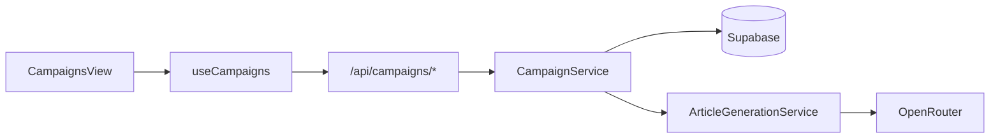
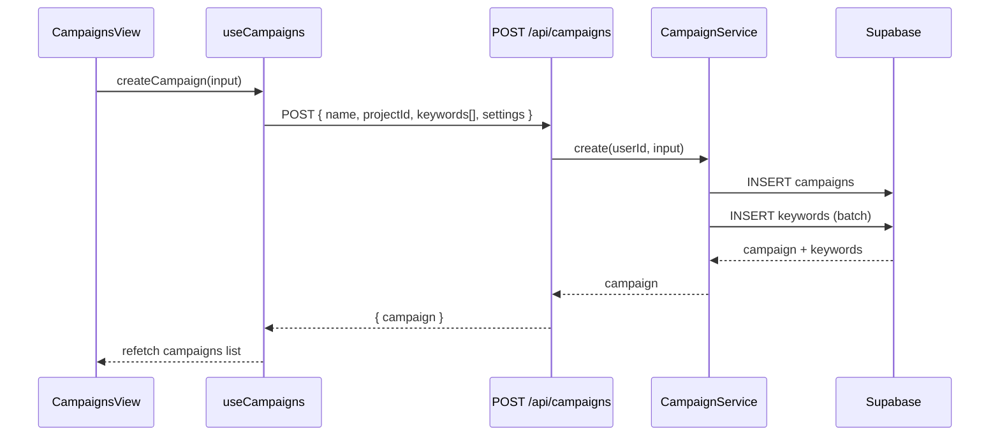
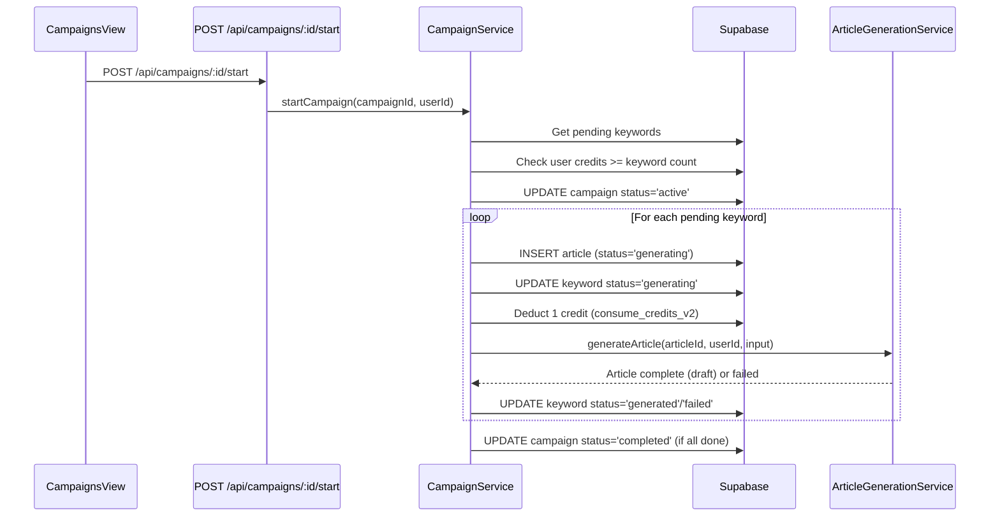

# PRD: Campaign Management (Milestone 4)

**Complexity: 7 → HIGH mode**

**Last Updated:** 2026-02-05

---

## 1. Context

**Problem:** Users can only generate one article at a time via Quick Generate. They need a way to organize keywords into campaigns and trigger bulk article generation with credit management.

**Files Analyzed:**

- `supabase/migrations/20260205100100_create_campaigns_table.sql` — campaigns schema
- `supabase/migrations/20260205100300_create_keywords_table.sql` — keywords schema
- `supabase/migrations/20260205100200_create_articles_table.sql` — articles schema
- `shared/types/article.types.ts` — article interfaces
- `shared/types/project.types.ts` — project interfaces
- `server/services/article-generation.service.ts` — generation pipeline
- `server/services/project.service.ts` — CRUD service pattern
- `server/services/openrouter.service.ts` — LLM integration
- `src/pages/api/articles/generate.ts` — generation endpoint pattern
- `src/pages/api/articles/index.ts` — list endpoint pattern
- `src/pages/api/_utils.ts` — API utilities (auth, json, error responses)
- `client/hooks/useProjects.ts` — React Query hook pattern
- `client/hooks/useArticleGeneration.ts` — article generation hook
- `client/components/dashboard/views/CampaignsView.tsx` — existing UI stub (mock data)
- `client/components/dashboard/views/NewCampaignModal.tsx` — existing modal stub
- `client/components/pages/CampaignsPageClient.tsx` — page wrapper
- `client/config/dashboardRoutes.ts` — route config (campaigns disabled)
- `shared/config/credits.config.ts` — credit constants
- `shared/config/ai-models.config.ts` — model config
- `locales/en/dashboard.json` — i18n strings

**Current Behavior:**

- `campaigns` table exists with schema: id, user_id, project_id, name, status (draft/active/paused/completed), ai_model, tone, target_word_count, settings
- `keywords` table exists: id, campaign_id, keyword, search_volume, difficulty, status (pending/queued/generating/generated/failed), priority, UNIQUE(campaign_id, keyword)
- `articles` table links to campaigns via `campaign_id`
- Quick Generate auto-creates a "Quick Generate" campaign per project
- CampaignsView has mock data UI, NewCampaignModal has unconnected form
- Campaign route is `enabled: false` in dashboardRoutes.ts
- No `shared/types/campaign.types.ts` exists
- No CampaignService exists
- No campaign API endpoints exist

---

## 2. Solution

**Approach:**

1. Create shared campaign/keyword types matching the existing DB schema
2. Build CampaignService following ProjectService patterns (CRUD + keyword management + bulk generation orchestration)
3. Create REST API endpoints for campaigns and keywords
4. Build `useCampaigns` hook following `useProjects` hook patterns (React Query + mutations)
5. Connect existing CampaignsView/NewCampaignModal to real data, replacing mock data
6. Enable the campaign route in dashboardRoutes.ts

**Architecture:**



**Key Decisions:**

- Reuse existing `ArticleGenerationService` for each keyword's article generation — no new LLM logic needed
- Bulk generation is sequential (one keyword at a time) to respect credit deduction and avoid overwhelming OpenRouter
- Generation uses `ctx.waitUntil()` for background processing (same pattern as Quick Generate)
- CSV upload is client-side parsing only (Papa Parse or native) — no server upload endpoint needed
- Campaign settings (model, tone, word count) serve as defaults inherited by each article in the campaign

**Data Changes:** None — all tables already exist. Only new TypeScript types and code.

---

## 3. Sequence Flows

### Create Campaign + Add Keywords



### Start Campaign (Bulk Generation)



---

## 4. Integration Points Checklist

```markdown
**How will this feature be reached?**
- [x] Entry point: /dashboard/campaigns route (sidebar nav click)
- [x] Caller: DashboardRouter renders CampaignsPage → CampaignsView
- [x] Registration: Enable route in dashboardRoutes.ts (set enabled: true)

**Is this user-facing?**
- [x] YES → CampaignsView (list/detail), NewCampaignModal (create form)

**Full user flow:**
1. User clicks "Campaigns" in sidebar → sees campaign list
2. User clicks "New Campaign" → modal with name, keywords (manual/CSV), settings
3. User launches campaign → keywords queued, generation starts in background
4. User sees campaign detail → progress bar, article queue table with statuses
5. Articles appear as draft when generation completes → user reviews later (Milestone 5)
```

---

## 5. Execution Phases

### Phase 1: Types + CampaignService — "Campaign CRUD works via service layer"

**Files (5):**

- `shared/types/campaign.types.ts` — NEW: campaign + keyword interfaces
- `server/services/campaign.service.ts` — NEW: CampaignService with CRUD + keywords
- `server/services/campaign.service.unit.spec.ts` → `tests/unit/services/campaign.service.unit.spec.ts` — NEW: unit tests

**Implementation:**

- [ ] Create `shared/types/campaign.types.ts`:
  - `CampaignStatus = 'draft' | 'active' | 'paused' | 'completed'`
  - `KeywordStatus = 'pending' | 'queued' | 'generating' | 'generated' | 'failed'`
  - `KeywordDifficulty = 'easy' | 'medium' | 'hard' | 'unknown'`
  - `ICampaign` interface matching DB schema (id, user_id, project_id, name, status, ai_model, tone, target_word_count, settings, created_at, updated_at)
  - `IKeyword` interface matching DB schema
  - `ICreateCampaignInput` — name, projectId, keywords (string[]), model?, tone?, targetWordCount?
  - `IUpdateCampaignInput` — partial of name, status, model, tone, targetWordCount
  - `IAddKeywordsInput` — campaignId, keywords (string[])
  - `ICampaignWithStats` — ICampaign + keywordCount, articleCount, completedCount
  - `ICampaignListResponse`, `ICampaignDetailResponse`

- [ ] Create `server/services/campaign.service.ts` following ProjectService patterns:
  - `listByProject(userId, projectId)` — list campaigns for a project with stats (join keyword/article counts)
  - `getById(campaignId, userId)` — single campaign with ownership check
  - `create(userId, input: ICreateCampaignInput)` — create campaign + batch insert keywords, validate project ownership
  - `update(campaignId, userId, input: IUpdateCampaignInput)` — update campaign settings
  - `delete(campaignId, userId)` — hard delete (cascade deletes keywords + articles via FK)
  - `addKeywords(campaignId, userId, keywords: string[])` — batch insert, skip duplicates (ON CONFLICT DO NOTHING)
  - `removeKeyword(keywordId, userId)` — delete single keyword with ownership check through campaign
  - `getKeywords(campaignId, userId)` — list keywords for a campaign
  - Ownership enforcement via `user_id` check on all operations
  - Use `supabaseAdmin` for all DB operations

- [ ] Write unit tests (mock supabaseAdmin):
  - `should list campaigns with stats for a project`
  - `should create campaign with keywords`
  - `should reject creation if project not owned by user`
  - `should update campaign settings`
  - `should delete campaign`
  - `should add keywords skipping duplicates`
  - `should remove a keyword`
  - `should return 404 for non-existent campaign`

**Verification Plan:**

1. **Unit Tests:**
   - File: `tests/unit/services/campaign.service.unit.spec.ts`
   - 8+ tests covering CRUD + keyword operations + ownership checks
2. **Evidence Required:**
   - [ ] All tests pass (`yarn test`)
   - [ ] `yarn verify` passes

---

### Phase 2: Campaign API Endpoints — "Full REST API for campaigns and keywords"

**Files (5):**

- `src/pages/api/campaigns/index.ts` — NEW: GET (list) + POST (create)
- `src/pages/api/campaigns/[campaignId]/index.ts` — NEW: GET (detail) + PUT (update) + DELETE
- `src/pages/api/campaigns/[campaignId]/keywords.ts` — NEW: GET (list) + POST (add)
- `src/pages/api/campaigns/[campaignId]/keywords/[keywordId].ts` — NEW: DELETE keyword
- `src/pages/api/campaigns/[campaignId]/start.ts` — NEW: POST (start bulk generation)

**Implementation:**

- [ ] `GET /api/campaigns?projectId=X` — List campaigns for project (require projectId query param). Use `CampaignService.listByProject()`. Return `{ campaigns: ICampaignWithStats[] }`.

- [ ] `POST /api/campaigns` — Create campaign. Zod validation:
  ```
  name: string min(1) max(100)
  projectId: string uuid
  keywords: string[] min(1) max(500), each min(1) max(200)
  model: string optional
  tone: enum optional
  targetWordCount: number int min(800) max(3000) optional
  ```
  Verify project ownership. Return 201 `{ campaign }`.

- [ ] `GET /api/campaigns/:campaignId` — Get campaign detail with keywords and article stats. Ownership check. Return `{ campaign, keywords, articleStats }`.

- [ ] `PUT /api/campaigns/:campaignId` — Update campaign. Zod validation for partial fields. Return `{ campaign }`.

- [ ] `DELETE /api/campaigns/:campaignId` — Delete campaign. Return 204.

- [ ] `GET /api/campaigns/:campaignId/keywords` — List keywords. Return `{ keywords }`.

- [ ] `POST /api/campaigns/:campaignId/keywords` — Add keywords. Zod: `keywords: string[] min(1) max(500)`. Return `{ added: number, duplicates: number }`.

- [ ] `DELETE /api/campaigns/:campaignId/keywords/:keywordId` — Remove keyword. Return 204.

- [ ] `POST /api/campaigns/:campaignId/start` — Start bulk generation:
  1. Get all `pending` keywords for campaign
  2. Check user has enough credits (1 per keyword)
  3. Set campaign status to `active`
  4. For each pending keyword: create article record, update keyword status to `queued`
  5. Use `ctx.waitUntil()` to run sequential generation in background
  6. Return 202 `{ queued: number, creditsRequired: number }`
  7. Background: for each queued keyword, deduct credit → generate article → update keyword status

- [ ] All endpoints use `authenticateUserFromHeader()`, `jsonResponse()`, `errorResponse()` from `_utils.ts`

**Verification Plan:**

1. **Unit Tests:** Service layer already tested in Phase 1
2. **API Proof (curl commands):**
   ```bash
   # Create campaign
   curl -X POST http://localhost:4321/api/campaigns \
     -H "Authorization: Bearer $TOKEN" \
     -H "Content-Type: application/json" \
     -d '{"name":"Test Campaign","projectId":"<id>","keywords":["best coffee maker","espresso machine reviews"]}'
   # Expected: 201 { success: true, data: { campaign: {...} } }

   # List campaigns
   curl "http://localhost:4321/api/campaigns?projectId=<id>" \
     -H "Authorization: Bearer $TOKEN"
   # Expected: 200 { success: true, data: { campaigns: [...] } }

   # Add keywords
   curl -X POST "http://localhost:4321/api/campaigns/<id>/keywords" \
     -H "Authorization: Bearer $TOKEN" \
     -H "Content-Type: application/json" \
     -d '{"keywords":["french press guide","cold brew recipe"]}'
   # Expected: 200 { success: true, data: { added: 2, duplicates: 0 } }

   # Start campaign
   curl -X POST "http://localhost:4321/api/campaigns/<id>/start" \
     -H "Authorization: Bearer $TOKEN"
   # Expected: 202 { success: true, data: { queued: 4, creditsRequired: 4 } }
   ```
3. **Evidence Required:**
   - [ ] All curl commands return expected responses
   - [ ] `yarn verify` passes

---

### Phase 3: useCampaigns Hook — "React Query hook for campaign operations"

**Files (3):**

- `client/hooks/useCampaigns.ts` — NEW: React Query hook for campaigns
- `client/hooks/useCampaignDetail.ts` — NEW: Hook for single campaign with keywords + articles
- `tests/unit/hooks/useCampaigns.unit.spec.ts` — NEW: unit tests

**Implementation:**

- [ ] Create `client/hooks/useCampaigns.ts` following `useProjects.ts` pattern:
  - API functions: `fetchCampaigns(projectId)`, `createCampaign(input)`, `deleteCampaign(id)`
  - Uses `getAuthHeaders()` helper (extract to shared util or duplicate — keep it simple)
  - `useCampaigns(projectId)` returns:
    - `campaigns: ICampaignWithStats[]`
    - `isLoading, error`
    - `createCampaign(input)` — mutation with toast on success
    - `deleteCampaign(id)` — mutation with toast on success
    - `refetch()`
  - Query key: `['campaigns', projectId]`
  - staleTime: 30 seconds (campaigns change more frequently than projects)
  - Only enabled when projectId is provided

- [ ] Create `client/hooks/useCampaignDetail.ts`:
  - `fetchCampaignDetail(campaignId)` — GET `/api/campaigns/:id`
  - `fetchCampaignKeywords(campaignId)` — GET `/api/campaigns/:id/keywords`
  - `fetchCampaignArticles(campaignId)` — GET `/api/articles?campaignId=:id` (reuse existing articles endpoint, add campaignId filter)
  - `useCampaignDetail(campaignId)` returns:
    - `campaign, keywords, articles`
    - `isLoading, error`
    - `addKeywords(keywords: string[])` — mutation
    - `removeKeyword(keywordId)` — mutation
    - `startCampaign()` — mutation (POST /start)
    - `updateCampaign(input)` — mutation
    - Polling: refetch articles every 5s while campaign status is `active`

- [ ] Add `campaignId` filter support to `GET /api/articles` endpoint (tiny change in `src/pages/api/articles/index.ts` — add `.eq('campaign_id', campaignId)` when param present)

- [ ] Write unit tests:
  - `should fetch campaigns for a project`
  - `should create a campaign and invalidate query`
  - `should delete a campaign and invalidate query`
  - `should fetch campaign detail with keywords and articles`
  - `should start campaign generation`

**Verification Plan:**

1. **Unit Tests:**
   - File: `tests/unit/hooks/useCampaigns.unit.spec.ts`
   - 5+ tests for hook behavior
2. **Evidence Required:**
   - [ ] All tests pass (`yarn test`)
   - [ ] `yarn verify` passes

---

### Phase 4: Campaign List UI — "Users see their campaigns in the dashboard"

**Files (4):**

- `client/config/dashboardRoutes.ts` — EDIT: enable campaigns route
- `client/components/pages/CampaignsPageClient.tsx` — EDIT: connect to real hook
- `client/components/dashboard/views/CampaignsView.tsx` — EDIT: replace mock data with useCampaigns hook
- `locales/en/dashboard.json` — EDIT: add campaign-specific i18n strings

**Implementation:**

- [ ] Enable campaign route in `dashboardRoutes.ts`: set `enabled: true`

- [ ] Update `CampaignsPageClient.tsx`:
  - Import `useCampaigns` and `useProjects`
  - Pass real data and handlers to `CampaignsView`

- [ ] Refactor `CampaignsView.tsx` to use real data:
  - Remove local `ICampaign` and `IArticle` interfaces — use shared types
  - Remove mock data arrays
  - Accept props: `campaigns`, `isLoading`, `onNewCampaign`, `onCampaignClick`, `onDeleteCampaign`
  - Show loading skeleton while fetching
  - Show empty state when no campaigns exist (with CTA to create)
  - Campaign cards show real data: name, status, progress (completedCount/keywordCount), model, last updated (relative time via dayjs)
  - Keep the "Add New Card" button
  - Remove detail view from this component (moved to separate route/component in Phase 5)

- [ ] Add i18n strings to `locales/en/dashboard.json` under `campaigns`:
  ```json
  "campaigns": {
    "title": "Campaigns",
    "subtitle": "Manage your content generation queues.",
    "newCampaign": "New Campaign",
    "empty": "No campaigns yet. Create your first campaign to start generating content.",
    "createFirst": "Create Your First Campaign",
    "status": {
      "draft": "Draft",
      "active": "Active",
      "paused": "Paused",
      "completed": "Completed"
    },
    "card": {
      "progress": "Progress",
      "lastUpdated": "Updated",
      "model": "Model",
      "keywords": "keywords"
    },
    "delete": {
      "confirm": "Delete this campaign? All keywords and generated articles will be permanently removed.",
      "success": "Campaign deleted successfully.",
      "error": "Failed to delete campaign."
    }
  }
  ```

**Verification Plan:**

1. **Unit Tests:**
   - Existing CampaignsView tests updated to verify real data rendering
2. **Manual Verification (HIGH — UI changes):**
   - Navigate to /dashboard/campaigns → see campaign list (or empty state)
   - Campaign cards show correct data from API
   - "New Campaign" button opens modal
3. **Evidence Required:**
   - [ ] All tests pass (`yarn test`)
   - [ ] `yarn verify` passes
   - [ ] Campaign route appears in sidebar (no longer "Soon" badge)

---

### Phase 5: New Campaign Modal — "Users can create campaigns with keywords"

**Files (4):**

- `client/components/dashboard/views/NewCampaignModal.tsx` — EDIT: connect to real API with React Hook Form + Zod
- `client/components/dashboard/views/CampaignsView.tsx` — EDIT: integrate modal state
- `locales/en/dashboard.json` — EDIT: add modal i18n strings
- `tests/unit/components/NewCampaignModal.unit.spec.ts` — NEW: component tests

**Implementation:**

- [ ] Rewrite `NewCampaignModal.tsx` with React Hook Form + Zod:
  - **Step 1 — Campaign Info:**
    - Campaign name (required, 1-100 chars)
    - Keywords input: tabbed interface (Manual Input / CSV Upload)
    - Manual: textarea, one keyword per line. Parse on submit.
    - CSV: file input with client-side parsing. Support CSV with header row or plain list. Show parsed count.
    - Show keyword count badge: "X keywords"
  - **Step 2 — Generation Settings:**
    - AI Model selector (from `AI_MODELS` config — use `getModelOptions()`)
    - Word count target (select: 800/1500/2500 or custom)
    - Tone selector (radio: Professional/Casual/Witty/Academic)
  - **Footer:**
    - Cancel / Back / Next / "Create Campaign" (final step)
    - Show credit cost: "This will use X credits (X keywords × 1 credit each)"
    - Disable submit if insufficient credits
  - On submit: call `useCampaigns.createCampaign()` → close modal → refetch campaigns

- [ ] CSV parsing: Use simple native parsing (split by newline, trim, filter empty). No library needed for single-column CSV.

- [ ] Add i18n strings:
  ```json
  "newCampaign": {
    "title": "Create New Campaign",
    "step1": "Campaign Info",
    "step2": "Generation Settings",
    "stepOf": "Step {{current}} of {{total}}",
    "name": "Campaign Name",
    "namePlaceholder": "e.g. Best Coffee Machines Q4",
    "keywords": "Target Keywords",
    "keywordsManual": "Manual Input",
    "keywordsCsv": "CSV Upload",
    "keywordsPlaceholder": "Enter one keyword per line...",
    "keywordsCount": "{{count}} keywords",
    "csvDrop": "Drag & drop CSV file here",
    "csvBrowse": "or click to browse",
    "model": "AI Model",
    "wordCount": "Word Count Target",
    "tone": "Tone of Voice",
    "creditCost": "This will use {{count}} credits ({{count}} keywords × 1 credit each)",
    "insufficientCredits": "Not enough credits. You need {{required}} but have {{available}}.",
    "cancel": "Cancel",
    "back": "Back",
    "next": "Next Step",
    "create": "Create Campaign",
    "creating": "Creating...",
    "success": "Campaign created with {{count}} keywords!",
    "error": "Failed to create campaign."
  }
  ```

- [ ] Component tests:
  - `should render step 1 with name and keyword inputs`
  - `should parse keywords from textarea (one per line)`
  - `should advance to step 2 when Next clicked`
  - `should show credit cost based on keyword count`
  - `should disable submit when insufficient credits`
  - `should call createCampaign on submit`

**Verification Plan:**

1. **Unit Tests:**
   - File: `tests/unit/components/NewCampaignModal.unit.spec.ts`
   - 6+ tests for form validation, step navigation, keyword parsing, credit display
2. **Manual Verification (HIGH — UI changes):**
   - Click "New Campaign" → modal opens
   - Enter name + paste keywords → shows count
   - Advance to step 2 → select model, tone, word count
   - Submit → campaign appears in list
   - CSV upload → keywords parsed and counted
3. **Evidence Required:**
   - [ ] All tests pass (`yarn test`)
   - [ ] `yarn verify` passes

---

### Phase 6: Campaign Detail View + Bulk Generation — "Users see keyword queue, start generation"

**Files (5):**

- `client/components/dashboard/views/CampaignDetailView.tsx` — NEW: campaign detail with keyword table + generation controls
- `client/components/pages/CampaignsPageClient.tsx` — EDIT: route between list/detail views
- `client/config/dashboardRoutes.ts` — EDIT: add campaign detail child route
- `locales/en/dashboard.json` — EDIT: add detail view i18n strings
- `tests/unit/components/CampaignDetailView.unit.spec.ts` — NEW: component tests

**Implementation:**

- [ ] Create `CampaignDetailView.tsx`:
  - Uses `useCampaignDetail(campaignId)` hook
  - **Header:** Campaign name, status badge, model/keyword count meta, back button
  - **Actions:** "Start Generation" button (disabled if no pending keywords or insufficient credits), "Add Keywords" button, "Pause" / "Resume" toggle, "Settings" (edit modal)
  - **Stats grid** (4 cards): Queued, Generating, Draft/Review, Published — derived from article statuses
  - **Keyword/Article table:**
    - Columns: Keyword, Status (badge), Word Count, Generated At, Actions (delete keyword, view article)
    - Status badges with color coding matching existing CampaignsView patterns
    - Sort by status (generating first, then queued, then completed)
    - Search/filter bar
  - **Polling:** When campaign is `active`, refetch articles every 5s to show live progress
  - **Progress bar:** Shows `completed / total` keywords with percentage

- [ ] Add campaign detail route: `/dashboard/campaigns/:campaignId`
  - Add as child route in dashboardRoutes.ts
  - DashboardRouter already supports dynamic routes via `matchDynamicRoute()`

- [ ] "Start Generation" flow:
  1. User clicks "Start Generation"
  2. Confirmation modal: "Generate N articles using N credits?"
  3. POST `/api/campaigns/:id/start`
  4. Button changes to progress indicator
  5. Articles appear in table as they complete (via polling)

- [ ] "Add Keywords" flow:
  1. Small modal with textarea (same as step 1 of creation)
  2. POST `/api/campaigns/:id/keywords`
  3. Toast: "Added X keywords (Y duplicates skipped)"

- [ ] Add i18n strings for detail view

- [ ] Component tests:
  - `should render campaign header with name and status`
  - `should show stats grid with article counts`
  - `should render keyword table with status badges`
  - `should show Start Generation button when pending keywords exist`
  - `should disable Start Generation when insufficient credits`
  - `should poll articles when campaign is active`

**Verification Plan:**

1. **Unit Tests:**
   - File: `tests/unit/components/CampaignDetailView.unit.spec.ts`
   - 6+ tests for rendering, stats, table, generation controls
2. **Manual Verification (HIGH — UI changes + generation):**
   - Click campaign card → see detail view with keywords
   - Click "Start Generation" → confirmation → articles start generating
   - Watch progress as articles complete (live polling)
   - Add more keywords → they appear in table
3. **Evidence Required:**
   - [ ] All tests pass (`yarn test`)
   - [ ] `yarn verify` passes
   - [ ] End-to-end: create campaign → add keywords → start generation → articles generated

---

## 6. Acceptance Criteria

- [ ] All 6 phases complete
- [ ] All specified tests pass
- [ ] `yarn verify` passes
- [ ] All automated checkpoint reviews passed
- [ ] Campaign route enabled and reachable from sidebar
- [ ] Full flow works: create campaign → add keywords → start generation → articles appear as draft
- [ ] Credit deduction works correctly (1 per keyword, refund on failure)
- [ ] Campaign progress visible in real-time (polling during active generation)
- [ ] CSV keyword upload works
- [ ] i18n strings added for all user-facing text
