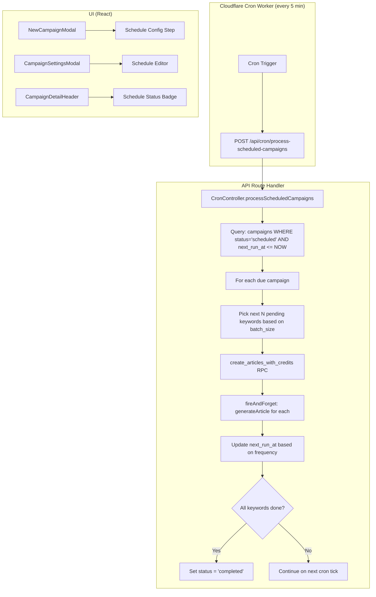
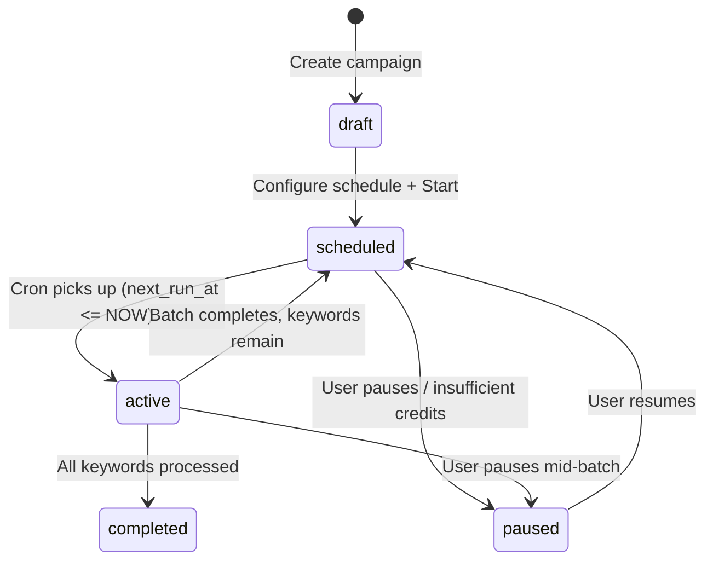
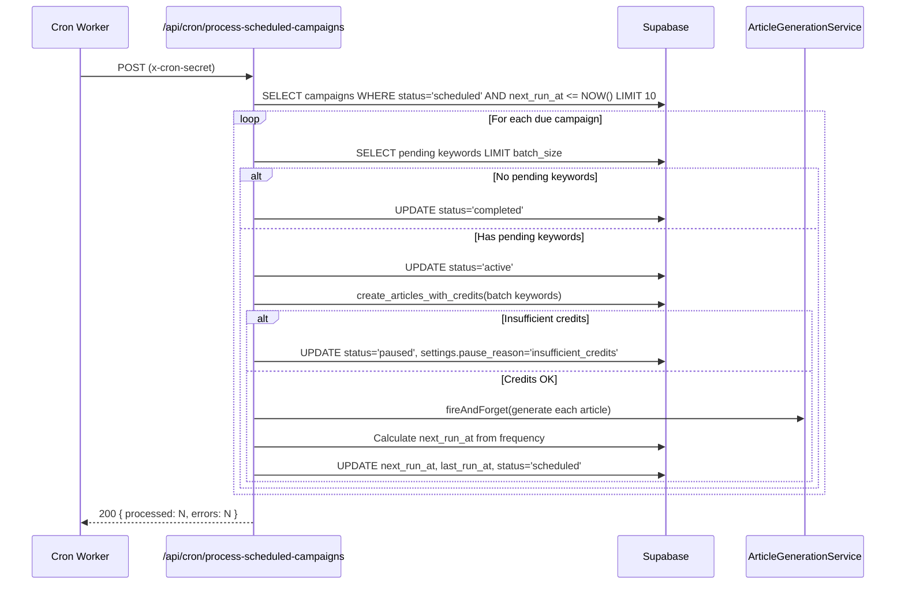
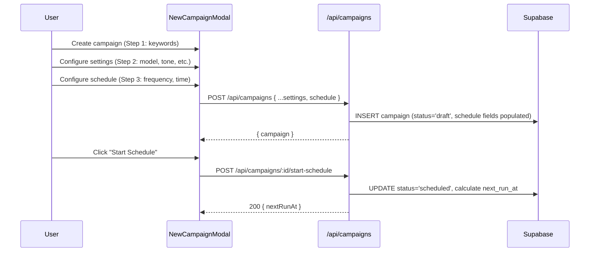

# PRD: Campaign Scheduling — Automated Article Publishing Frequency

**Complexity: 9 → HIGH mode**
**Status:** Draft
**Author:** Claude
**Date:** 2026-02-10
**Primary Goal:** Enable scheduled, drip-feed article generation for campaigns
**Branch:** `feat/campaign-scheduling`

---

## 1. Context

**Problem:** Currently, campaign generation is all-or-nothing — users click "Start" and all keywords are queued for immediate sequential generation. There is no way to spread article generation over time (e.g., 2 articles/day, 3 articles/week), which is critical for SEO drip-feed strategies, credit budgeting, and avoiding content floods that search engines penalize.

**Files Analyzed:**

- `shared/types/campaign.types.ts` — ICampaign, ICreateCampaignInput, CampaignStatus
- `shared/validation/campaign.schema.ts` — Zod schemas for campaign CRUD
- `shared/config/subscription.config.ts` — Plan tiers, batchLimit per plan
- `shared/config/credits.config.ts` — Credit costs structure
- `server/services/campaign.service.ts` — Campaign CRUD + generation start logic
- `server/services/article-generation.service.ts` — Article generation pipeline
- `server/controllers/CronController.ts` — Existing cron patterns + auth
- `src/pages/api/campaigns/[campaignId]/start.ts` — Fire-and-forget bulk start
- `workers/cron/index.ts` — Cloudflare Worker cron router
- `workers/cron/wrangler.toml` — Cron trigger definitions
- `client/components/dashboard/views/NewCampaignModal.tsx` — Campaign creation UI
- `client/components/dashboard/views/campaign-detail/CampaignSettingsModal.tsx` — Settings UI
- `client/components/dashboard/views/campaign-detail/CampaignDetailHeader.tsx` — Campaign actions
- `supabase/migrations/20260205100100_create_campaigns_table.sql` — Campaign schema

**Current Behavior:**

- User creates campaign with keywords, then clicks "Start Generation"
- All pending keywords are atomically queued + credits deducted via `create_articles_with_credits` RPC
- Keywords are processed sequentially via `fireAndForget()` + Cloudflare `waitUntil()`
- Campaign transitions: `draft → active → completed` (or `paused`)
- No concept of "generate N articles per time period" exists
- Cron worker already exists with 3 scheduled tasks (webhook recovery, expiration check, reconciliation)

**What Already Exists:**

- [x] Cloudflare Worker cron infrastructure (`workers/cron/`)
- [x] `CronController` with `x-cron-secret` authentication pattern
- [x] Campaign pause/resume logic (checks status before each keyword)
- [x] Sequential keyword processing with fire-and-forget
- [x] Atomic credit deduction via RPC
- [x] Campaign `settings` JSONB field (currently unused — perfect for schedule config)
- [x] `batchLimit` per subscription plan (already in subscription config)
- [x] Stale article recovery cron (recovery pattern for stuck jobs)

**What Doesn't Exist Yet:**

- [ ] Schedule configuration on campaigns (frequency, batch size, time preferences)
- [ ] Cron endpoint to process scheduled campaigns
- [ ] Scheduling state machine (scheduled status, next_run_at tracking)
- [ ] UI for configuring schedule in campaign creation/settings
- [ ] Schedule status display in campaign detail view

---

## 2. Solution

**Approach: Cron-driven batch processor using existing infrastructure**

- Add schedule fields to the `campaigns` table (frequency, batch size, next run time, timezone)
- Introduce a new campaign status `scheduled` that sits between `draft` and `active`
- Add a new cron endpoint `POST /api/cron/process-scheduled-campaigns` that runs every 5 minutes
- The cron job finds campaigns where `next_run_at <= NOW()` and processes `batch_size` keywords per run
- Reuse existing `create_articles_with_credits` RPC and `articleGenerationService.generateArticle()` — no changes to the generation pipeline
- UI: Add schedule configuration step in NewCampaignModal and CampaignSettingsModal

**Architecture Diagram:**



**Key Decisions:**

- **100% Cloudflare Workers compatible** — The entire scheduling system runs within Cloudflare's edge runtime constraints:
  - **Cron Worker** (`workers/cron/`): A separate Cloudflare Worker with native `[triggers] crons` in `wrangler.toml`. This worker only makes a single `fetch()` call per trigger (well within 10ms CPU + 50 subrequest limits). Already deployed and battle-tested.
  - **API Handler** (`/api/cron/process-scheduled-campaigns`): Runs on Cloudflare Pages Functions. Uses `waitUntil()` via `fireAndForget()` to extend execution beyond the response. This is the same pattern used for existing campaign generation.
  - **No external queue needed** — Cloudflare cron triggers + Supabase `next_run_at` column acts as a lightweight job queue. This matches existing patterns (webhook recovery, stale article recovery) and avoids adding Redis/Bull complexity that wouldn't work on the edge anyway.
- **No new npm dependencies for cron parsing** — Schedule frequencies are stored as a preset enum (8 options from `3x_daily` to `every_2_weeks`) rather than raw cron expressions. This is simpler for users and avoids needing `cron-parser` or `croner` libraries on the edge. Combined with a user-defined `batch_size` (1-50 articles per run), this gives full flexibility: e.g. `3x_daily` × 5 batch = 15 articles/day, or `weekly` × 1 batch = 1 article/week. The cron worker itself already uses Cloudflare's native cron triggers.
- **Credits deducted per batch, not upfront** — Unlike the current "Start" flow which deducts all credits at once, scheduled campaigns deduct credits for each batch as it runs. This prevents locking up credits for weeks and handles insufficient credits gracefully (pause the schedule, notify user).
- **`settings` JSONB for schedule config** — The campaign `settings` JSONB field is already in the schema but unused. We store schedule configuration there instead of adding multiple nullable columns. A dedicated `schedule_*` column set is added only for query-critical fields (`next_run_at`, `schedule_frequency`).
- **5-minute cron granularity** — The scheduler runs every 5 minutes. For daily/weekly schedules this is more than precise enough. The `next_run_at` timestamp ensures exact timing regardless of cron interval.
- **Error handling** — If a scheduled batch fails (insufficient credits, all keywords fail), the campaign is paused and the user is notified via the existing notification system. The schedule does not retry failed batches automatically — the stale article recovery cron handles individual article retries.
- **Timezone support** — Users select their preferred timezone for scheduling. `next_run_at` is always stored in UTC. The preferred publish hour (e.g., "9:00 AM") is converted to UTC using the user's timezone.

**Data Changes:**

### New columns on `campaigns` table:

```sql
-- Query-critical columns (indexed for cron lookup)
schedule_frequency  TEXT         -- '3x_daily' | '2x_daily' | 'daily' | 'every_other_day' | '3x_weekly' | '2x_weekly' | 'weekly' | 'every_2_weeks' | NULL
schedule_batch_size INTEGER      -- articles per batch (1-50, default from plan batchLimit)
next_run_at         TIMESTAMPTZ  -- next scheduled execution time (NULL = not scheduled)
last_run_at         TIMESTAMPTZ  -- last successful batch execution
schedule_timezone   TEXT         -- IANA timezone (e.g., 'America/New_York')
schedule_hour       INTEGER      -- preferred hour in user's timezone (0-23, default 9)
```

**Flexibility model:** Frequency controls _how often_ a batch runs. Batch size controls _how many articles_ per run. These two dimensions are independent, giving users full control:

| Use case             | Frequency       | Batch size | Result                  |
| -------------------- | --------------- | ---------- | ----------------------- |
| Aggressive SEO blitz | `3x_daily`      | 5          | 15 articles/day         |
| Steady daily drip    | `daily`         | 1-2        | 1-2 articles/day        |
| Conservative weekly  | `weekly`        | 3          | 3 articles/week         |
| Light touch          | `every_2_weeks` | 1          | 1 article every 2 weeks |
| Moderate pace        | `2x_weekly`     | 2          | 4 articles/week         |

### Updated `campaigns.status` constraint:

```sql
-- Add 'scheduled' to allowed statuses
CHECK (status IN ('draft', 'scheduled', 'active', 'paused', 'completed'))
```

Note: `scheduled` means the campaign has a schedule configured and is waiting for the next cron tick. `active` means a batch is currently being processed (in-flight generation). After a batch completes, it goes back to `scheduled` if there are remaining keywords, or `completed` if all are done.

### SEO Velocity Guardrails

Google's [Firefly system](https://www.hobo-web.co.uk/firefly/) detects scaled content abuse by correlating three signals: **content velocity spikes**, **quality ratio** (new URLs vs. high-quality articles), and **user dissatisfaction** (high clicks, low engagement). There is no hard daily publishing limit — the risk comes from **sudden spikes relative to a site's history**, not from a specific number.

**What this means for our scheduling feature:**

- Publishing 5 articles/day is safe for an established site that ramped up gradually.
- A brand-new site jumping from 0 to 5/day on day 1 is risky — it triggers the velocity spike signal.
- The quality of articles matters more than the quantity. Google compares total new URLs vs. "good" articles.

**Implementation: Soft warnings, not hard blocks.** We do NOT enforce hard limits on publishing frequency — that's the user's decision. Instead, we provide **advisory UI warnings** based on their configuration:

```typescript
// SEO velocity advisory thresholds (soft warnings only, never block the user)
export const SEO_VELOCITY_ADVISORIES = {
  // Effective articles per day thresholds
  MODERATE_THRESHOLD: 3, // > 3/day: show informational tip
  HIGH_THRESHOLD: 5, // > 5/day: show yellow warning
  AGGRESSIVE_THRESHOLD: 10, // > 10/day: show orange caution

  // Recommended ramp-up schedule for new sites
  RAMP_UP_RECOMMENDATIONS: {
    week1: 1, // articles per day
    week2: 2,
    week3: 3,
    week4: 5, // full velocity after ~1 month
  },
} as const;
```

**UI Advisory Messages (Phase 4 addition):**

| Effective rate | Advisory                                                                                                                  | Tone                 |
| -------------- | ------------------------------------------------------------------------------------------------------------------------- | -------------------- |
| <= 3/day       | None                                                                                                                      | —                    |
| 4-5/day        | "Tip: For newer sites, consider starting slower and ramping up over 2-4 weeks."                                           | Informational (blue) |
| 6-10/day       | "High volume: Make sure your site has established authority before publishing at this pace."                              | Warning (amber)      |
| > 10/day       | "Very high volume: Sudden spikes in content velocity can trigger Google's spam detection. Consider ramping up gradually." | Caution (orange)     |

These are always dismissible and **never prevent the user from proceeding**. Power users know their sites and should be able to publish at any rate they choose.

---

## 3. Sequence Flow

### Scheduled Campaign Lifecycle:



### Cron Processing Flow:



### User Configures Schedule:



---

## 4. Integration Points Checklist

```markdown
**How will this feature be reached?**

- [x] Entry point: Cloudflare cron trigger (every 5 min) → POST /api/cron/process-scheduled-campaigns
- [x] Caller file: workers/cron/index.ts (add new cron pattern mapping)
- [x] Registration/wiring: Add cron pattern to workers/cron/wrangler.toml, add route to CronController

**Is this user-facing?**

- [x] YES → UI components required:
  - Schedule config section in NewCampaignModal (Step 3)
  - Schedule editor in CampaignSettingsModal
  - Schedule status badge in CampaignDetailHeader
  - "Start Schedule" / "Pause Schedule" actions
  - Next run time display in CampaignMetadata

**Full user flow:**

1. User creates campaign with keywords + settings
2. User configures schedule (frequency: daily, batch size: 3, time: 9AM EST)
3. User clicks "Start Schedule" → campaign status becomes 'scheduled'
4. Every 5 min, cron checks if next_run_at <= NOW
5. When due: picks 3 pending keywords, deducts credits, generates articles
6. Calculates next_run_at (tomorrow 9AM EST → stored as UTC)
7. User sees progress in campaign detail (3/50 keywords done, next batch: tomorrow 9AM)
8. Repeats until all keywords processed → status becomes 'completed'
```

---

## 5. Execution Phases

### Phase 1: Database Schema + Types — "Schedule fields exist in DB and TypeScript"

**Files (4):**

- `supabase/migrations/YYYYMMDDHHMMSS_add_campaign_scheduling.sql` — New migration
- `shared/types/campaign.types.ts` — Add schedule types to ICampaign
- `shared/validation/campaign.schema.ts` — Add schedule validation to schemas
- `shared/config/scheduling.config.ts` — New config for schedule constants

**Implementation:**

- [ ] Create migration adding `schedule_frequency`, `schedule_batch_size`, `next_run_at`, `last_run_at`, `schedule_timezone`, `schedule_hour` columns to `campaigns`
- [ ] Update `status` CHECK constraint to include `'scheduled'`
- [ ] Add index on `(status, next_run_at)` for efficient cron queries
- [ ] Add `ScheduleFrequency` type: `'3x_daily' | '2x_daily' | 'daily' | 'every_other_day' | '3x_weekly' | '2x_weekly' | 'weekly' | 'every_2_weeks'`
- [ ] Add `'scheduled'` to `CampaignStatus` union type
- [ ] Add schedule fields to `ICampaign` interface
- [ ] Add schedule fields to `ICreateCampaignInput` and `IUpdateCampaignInput`
- [ ] Create `shared/config/scheduling.config.ts` with:
  - `SCHEDULE_FREQUENCIES` map with all 8 options:
    ```typescript
    export const SCHEDULE_FREQUENCIES = {
      '3x_daily': { label: '3x per day', intervalHours: 8, description: 'Every 8 hours' },
      '2x_daily': { label: '2x per day', intervalHours: 12, description: 'Every 12 hours' },
      daily: { label: 'Daily', intervalHours: 24, description: 'Once per day' },
      every_other_day: {
        label: 'Every other day',
        intervalHours: 48,
        description: 'Once every 2 days',
      },
      '3x_weekly': { label: '3x per week', intervalHours: 56, description: 'Mon / Wed / Fri' },
      '2x_weekly': { label: '2x per week', intervalHours: 84, description: 'Mon / Thu' },
      weekly: { label: 'Weekly', intervalHours: 168, description: 'Once per week' },
      every_2_weeks: {
        label: 'Every 2 weeks',
        intervalHours: 336,
        description: 'Once every 2 weeks',
      },
    } as const;
    ```
  - `DEFAULT_SCHEDULE_HOUR` = 9
  - `DEFAULT_SCHEDULE_TIMEZONE` = 'UTC'
  - `MAX_CAMPAIGNS_PER_CRON_RUN` = 10
  - `CRON_INTERVAL_MINUTES` = 5
  - `calculateNextRunAt(frequency, timezone, hour, fromDate?)` utility function
  - `estimateCompletionDays(frequency, batchSize, pendingKeywords)` utility function for UI
  - `getEffectiveArticlesPerDay(frequency, batchSize)` utility for SEO advisory calculation
  - `SEO_VELOCITY_ADVISORIES` thresholds for soft UI warnings (see SEO Velocity Guardrails section)
- [ ] Add schedule fields to Zod schemas (`createCampaignSchema`, `updateCampaignSchema`)

**Tests Required:**

| Test File                                                   | Test Name                                                  | Assertion                                                      |
| ----------------------------------------------------------- | ---------------------------------------------------------- | -------------------------------------------------------------- |
| `tests/unit/shared/config/scheduling.config.unit.spec.ts`   | `should calculate next daily run correctly`                | `expect(calculateNextRunAt('daily', 'UTC', 9)).toBeAfter(now)` |
| `tests/unit/shared/config/scheduling.config.unit.spec.ts`   | `should calculate next weekly run correctly`               | next run is 7 days from now at specified hour                  |
| `tests/unit/shared/config/scheduling.config.unit.spec.ts`   | `should handle timezone conversion`                        | 9AM EST = 14:00 UTC                                            |
| `tests/unit/shared/config/scheduling.config.unit.spec.ts`   | `should handle every_other_day frequency`                  | next run is 2 days from now                                    |
| `tests/unit/shared/config/scheduling.config.unit.spec.ts`   | `should handle 3x_daily frequency`                         | next run is ~8 hours from now                                  |
| `tests/unit/shared/config/scheduling.config.unit.spec.ts`   | `should handle 2x_daily frequency`                         | next run is ~12 hours from now                                 |
| `tests/unit/shared/config/scheduling.config.unit.spec.ts`   | `should handle 3x_weekly frequency`                        | next run is ~56 hours from now                                 |
| `tests/unit/shared/config/scheduling.config.unit.spec.ts`   | `should handle 2x_weekly frequency`                        | next run is ~84 hours from now                                 |
| `tests/unit/shared/config/scheduling.config.unit.spec.ts`   | `should handle every_2_weeks frequency`                    | next run is 14 days from now                                   |
| `tests/unit/shared/config/scheduling.config.unit.spec.ts`   | `should estimate completion days correctly`                | 50 keywords, daily, batch 3 = ~17 days                         |
| `tests/unit/shared/config/scheduling.config.unit.spec.ts`   | `should have all 8 frequency keys in SCHEDULE_FREQUENCIES` | all 8 present with valid intervalHours                         |
| `tests/unit/shared/config/scheduling.config.unit.spec.ts`   | `getEffectiveArticlesPerDay should calculate correctly`    | `3x_daily` + batch 5 = 15, `weekly` + batch 1 = ~0.14          |
| `tests/unit/shared/config/scheduling.config.unit.spec.ts`   | `should return no advisory for <= 3/day`                   | advisory is null for `daily` + batch 3                         |
| `tests/unit/shared/config/scheduling.config.unit.spec.ts`   | `should return warning advisory for > 5/day`               | advisory.level is 'warning' for `daily` + batch 6              |
| `tests/unit/shared/config/scheduling.config.unit.spec.ts`   | `should return caution advisory for > 10/day`              | advisory.level is 'caution' for `3x_daily` + batch 5           |
| `tests/unit/shared/validation/campaign.schema.unit.spec.ts` | `should validate schedule frequency enum`                  | rejects invalid frequencies, accepts all 8 valid ones          |
| `tests/unit/shared/validation/campaign.schema.unit.spec.ts` | `should validate schedule_batch_size range 1-50`           | rejects 0 and 51                                               |

**Verification Plan:**

1. Unit tests for `calculateNextRunAt` with all frequencies and timezones
2. Zod schema validation tests
3. Migration applies without error: `npx supabase migration up`
4. `yarn verify` passes

---

### Phase 2: Campaign Service + API Routes — "Schedule can be started/stopped via API"

**Files (5):**

- `server/services/campaign.service.ts` — Add schedule management methods
- `src/pages/api/campaigns/[campaignId]/start-schedule.ts` — New endpoint
- `src/pages/api/campaigns/[campaignId]/pause.ts` — Update for schedule awareness (if needed)
- `shared/validation/campaign.schema.ts` — Add `startScheduleSchema` if needed
- `shared/config/security.ts` — Ensure cron route is public (already covered by `/api/cron/*`)

**Implementation:**

- [ ] Add `campaignService.startSchedule(campaignId, userId)` method:
  - Validates campaign has schedule config (frequency, batch_size)
  - Validates campaign has pending keywords
  - Calculates `next_run_at` from schedule config
  - Sets status to `'scheduled'`
  - Returns `{ nextRunAt, pendingKeywords }`
- [ ] Add `campaignService.pauseSchedule(campaignId, userId)` method:
  - Sets status to `'paused'`, clears `next_run_at`
  - Returns `{ paused: true }`
- [ ] Add `campaignService.resumeSchedule(campaignId, userId)` method:
  - Recalculates `next_run_at` from schedule config
  - Sets status to `'scheduled'`
  - Returns `{ nextRunAt }`
- [ ] Create `POST /api/campaigns/:campaignId/start-schedule` route:
  - Uses `withAuth`, validates campaignId
  - Calls `campaignService.startSchedule()`
  - Returns 200 `{ nextRunAt, pendingKeywords }`
- [ ] Update `PUT /api/campaigns/:campaignId` to accept schedule fields in update payload

**Tests Required:**

| Test File                                                  | Test Name                                                      | Assertion                              |
| ---------------------------------------------------------- | -------------------------------------------------------------- | -------------------------------------- |
| `tests/unit/server/services/campaign.service.unit.spec.ts` | `startSchedule should set status to scheduled`                 | status updated, next_run_at calculated |
| `tests/unit/server/services/campaign.service.unit.spec.ts` | `startSchedule should reject campaign without schedule config` | throws validation error                |
| `tests/unit/server/services/campaign.service.unit.spec.ts` | `pauseSchedule should clear next_run_at`                       | next_run_at is null                    |
| `tests/unit/server/services/campaign.service.unit.spec.ts` | `resumeSchedule should recalculate next_run_at`                | next_run_at is in the future           |

**Verification Plan:**

1. Unit tests for service methods
2. API proof:
   ```bash
   # Start schedule
   curl -X POST http://localhost:3000/api/campaigns/$CAMPAIGN_ID/start-schedule \
     -H "Authorization: Bearer $TOKEN" | jq .
   # Expected: { "nextRunAt": "2026-02-11T14:00:00Z", "pendingKeywords": 25 }
   ```
3. `yarn verify` passes

---

### Phase 3: Cron Processor — "Scheduled campaigns auto-generate articles on cron tick"

**Files (5):**

- `server/controllers/CronController.ts` — Add `processScheduledCampaigns` method
- `src/pages/api/cron/process-scheduled-campaigns.ts` — New cron endpoint
- `workers/cron/index.ts` — Add new cron pattern mapping
- `workers/cron/wrangler.toml` — Add `*/5 * * * *` cron trigger
- `server/services/campaign.service.ts` — Add `getScheduledCampaignsDue()` and `processScheduledBatch()` methods

**Implementation:**

- [ ] Add `CronController.processScheduledCampaigns()`:
  - Query campaigns where `status = 'scheduled' AND next_run_at <= NOW()` (limit `MAX_CAMPAIGNS_PER_CRON_RUN`)
  - For each campaign:
    1. Set status to `'active'`
    2. Get next `batch_size` pending keywords
    3. If no pending keywords → set status to `'completed'`, continue
    4. Call `create_articles_with_credits` RPC for the batch
    5. If insufficient credits → set status to `'paused'`, set `settings.pause_reason = 'insufficient_credits'`, continue
    6. `fireAndForget()` sequential article generation for the batch
    7. Calculate `next_run_at` from schedule config
    8. Update `next_run_at`, `last_run_at`, set status back to `'scheduled'`
  - Return `{ processed, skipped, errors, completedCampaigns }`
- [ ] Create `POST /api/cron/process-scheduled-campaigns` route:
  - Uses cron secret authentication (same pattern as existing cron routes)
  - Calls `CronController.processScheduledCampaigns()`
- [ ] Add to `workers/cron/wrangler.toml`:
  ```toml
  crons = [
    "*/5 * * * *",   # Scheduled campaign processing - every 5 minutes
    "*/15 * * * *",  # Webhook recovery
    "5 * * * *",     # Expiration check
    "5 3 * * *"      # Full reconciliation
  ]
  ```
- [ ] Add to `workers/cron/index.ts` (Cloudflare Worker scheduled handler):
  ```typescript
  // This runs on Cloudflare Workers edge — only makes a single fetch() call
  // Well within 10ms CPU limit and 50 subrequest cap
  } else if (cronPattern === '*/5 * * * *') {
    endpoint = '/api/cron/process-scheduled-campaigns';
    jobName = 'Scheduled Campaign Processing';
  }
  ```
  Note: The cron Worker's only job is to route the cron trigger to our API endpoint via HTTP POST with `x-cron-secret`. All heavy logic runs in the Pages Function handler, not in the Worker.
- [ ] Add `campaignService.getScheduledCampaignsDue(limit)` — query helper
- [ ] Add `campaignService.processScheduledBatch(campaignId)` — single campaign batch processing

**Tests Required:**

| Test File                                                   | Test Name                                                 | Assertion                                    |
| ----------------------------------------------------------- | --------------------------------------------------------- | -------------------------------------------- |
| `tests/unit/server/controllers/CronController.unit.spec.ts` | `should process due scheduled campaigns`                  | processes campaigns where next_run_at <= now |
| `tests/unit/server/controllers/CronController.unit.spec.ts` | `should skip campaigns not yet due`                       | ignores campaigns with future next_run_at    |
| `tests/unit/server/controllers/CronController.unit.spec.ts` | `should mark campaign completed when no pending keywords` | status transitions to completed              |
| `tests/unit/server/controllers/CronController.unit.spec.ts` | `should pause campaign on insufficient credits`           | status='paused', pause_reason set            |
| `tests/unit/server/controllers/CronController.unit.spec.ts` | `should calculate correct next_run_at after batch`        | next_run_at advances by frequency interval   |
| `tests/unit/server/controllers/CronController.unit.spec.ts` | `should respect MAX_CAMPAIGNS_PER_CRON_RUN limit`         | processes at most 10 campaigns               |

**Verification Plan:**

1. Unit tests for cron processing logic
2. API proof:
   ```bash
   # Manually trigger scheduled processing
   curl -X POST http://localhost:3000/api/cron/process-scheduled-campaigns \
     -H "x-cron-secret: $CRON_SECRET" | jq .
   # Expected: { "processed": 2, "skipped": 0, "errors": 0, "completedCampaigns": [] }
   ```
3. Integration test: Create campaign with schedule → advance time → verify cron picks it up
4. `yarn verify` passes

---

### Phase 4: UI — Schedule Configuration — "Users can configure and manage schedules"

**Files (5):**

- `client/components/dashboard/views/NewCampaignModal.tsx` — Add Step 3 for schedule
- `client/components/dashboard/views/campaign-detail/CampaignSettingsModal.tsx` — Add schedule fields
- `client/components/dashboard/views/campaign-detail/CampaignDetailHeader.tsx` — Add schedule actions
- `client/components/dashboard/views/campaign-detail/CampaignMetadata.tsx` — Show schedule info
- `shared/config/scheduling.config.ts` — Add `SCHEDULE_FREQUENCY_OPTIONS` for UI consumption

**Implementation:**

- [ ] **NewCampaignModal — Step 3 (Schedule):**
  - Add optional "Schedule" toggle (default: off = immediate generation as today)
  - When enabled, show:
    - Frequency selector (grouped pill buttons, like tone picker):
      - **Fast:** 3x/day, 2x/day
      - **Standard (default group):** Daily, Every other day
      - **Relaxed:** 3x/week, 2x/week, Weekly, Every 2 weeks
    - Batch size: number input (1-50, default from plan's `batchLimit`)
    - Preferred time: hour selector (dropdown, 12h format with AM/PM)
    - Timezone: auto-detected from browser via `Intl.DateTimeFormat().resolvedOptions().timeZone`, editable dropdown (common timezones)
  - Show estimated completion: "~X days to complete all Y keywords" (uses `estimateCompletionDays()`)
  - Show effective rate: "~N articles/day" or "~N articles/week" summary label
  - Show SEO velocity advisory (dismissible) when effective rate exceeds thresholds (see SEO Velocity Guardrails). Uses `getEffectiveArticlesPerDay()` to calculate rate from frequency + batch size. Advisory appears inline below the frequency/batch selectors.
  - When schedule is on, "Start" button becomes "Start Schedule" (different action)
- [ ] **CampaignSettingsModal — Schedule section:**
  - Same schedule fields as creation
  - Only editable when campaign is in `draft`, `scheduled`, or `paused` state
  - Changing schedule on `scheduled` campaign recalculates `next_run_at`
- [ ] **CampaignDetailHeader — Schedule actions:**
  - When `status === 'scheduled'`: Show "Pause Schedule" button + "Next batch: [date/time]" badge
  - When `status === 'paused'` and has schedule: Show "Resume Schedule" button
  - When `status === 'draft'` and has schedule: Show "Start Schedule" button
  - When `status === 'active'` (batch running): Show "Processing batch..." indicator
- [ ] **CampaignMetadata — Schedule display:**
  - Show frequency, batch size, next run time, last run time
  - Show progress: "12/50 keywords processed, ~13 days remaining"
  - Show pause reason if paused due to insufficient credits
- [ ] Add `SCHEDULE_FREQUENCY_UI_GROUPS` to scheduling config for grouped pill display:
  ```typescript
  export const SCHEDULE_FREQUENCY_UI_GROUPS = [
    {
      label: 'Fast',
      options: [
        { key: '3x_daily', label: '3x / day', subtitle: 'Every 8h' },
        { key: '2x_daily', label: '2x / day', subtitle: 'Every 12h' },
      ],
    },
    {
      label: 'Standard',
      default: true,
      options: [
        { key: 'daily', label: 'Daily', subtitle: 'Once per day' },
        { key: 'every_other_day', label: 'Every 2 days', subtitle: 'Once every 48h' },
      ],
    },
    {
      label: 'Relaxed',
      options: [
        { key: '3x_weekly', label: '3x / week', subtitle: 'Mon/Wed/Fri' },
        { key: '2x_weekly', label: '2x / week', subtitle: 'Mon/Thu' },
        { key: 'weekly', label: 'Weekly', subtitle: 'Once per week' },
        { key: 'every_2_weeks', label: 'Biweekly', subtitle: 'Every 2 weeks' },
      ],
    },
  ] as const;
  ```
- [ ] Add `getEffectiveRate(frequency, batchSize)` helper that returns human-readable rate:
  - e.g. `getEffectiveRate('2x_daily', 3)` → `"~6 articles/day"`
  - e.g. `getEffectiveRate('weekly', 2)` → `"~2 articles/week"`

**Tests Required:**

| Test File                                                 | Test Name                                                        | Assertion                                               |
| --------------------------------------------------------- | ---------------------------------------------------------------- | ------------------------------------------------------- |
| `tests/unit/shared/config/scheduling.config.unit.spec.ts` | `SCHEDULE_FREQUENCY_UI_GROUPS should cover all 8 frequency keys` | all 8 frequencies present across groups                 |
| `tests/unit/shared/config/scheduling.config.unit.spec.ts` | `getEffectiveRate should return human-readable rate`             | `getEffectiveRate('2x_daily', 3)` → `'~6 articles/day'` |
| `tests/unit/shared/config/scheduling.config.unit.spec.ts` | `estimateCompletionDays should handle all frequencies`           | correct estimates for all 8                             |
| E2E (manual)                                              | Schedule toggle shows/hides fields                               | Fields appear when toggle is on                         |
| E2E (manual)                                              | Estimated completion calculates correctly                        | Shows correct day estimate                              |

**Verification Plan:**

1. Unit tests for scheduling config constants
2. Manual verification: Open NewCampaignModal → toggle schedule → verify UI
3. Manual verification: Campaign detail shows schedule status
4. `yarn verify` passes

---

### Phase 5: Notifications + Edge Cases — "System handles errors and informs users"

**Files (4):**

- `server/services/campaign.service.ts` — Add notification triggers
- `server/controllers/CronController.ts` — Add error handling + metrics
- `client/components/dashboard/views/campaign-detail/CampaignDetailHeader.tsx` — Insufficient credits warning
- `shared/types/campaign.types.ts` — Add `ISchedulePauseReason` type

**Implementation:**

- [ ] When cron pauses a campaign due to insufficient credits:
  - Store `{ pause_reason: 'insufficient_credits', paused_at: ISO_STRING }` in campaign `settings`
  - Log warning with campaign ID, user ID, credits needed vs available
- [ ] When all keywords in a scheduled campaign complete:
  - Log completion with stats (total keywords, success/fail counts, total duration)
- [ ] CampaignDetailHeader shows warning banner when `settings.pause_reason === 'insufficient_credits'`:
  - "Schedule paused: insufficient credits. Buy more credits or resume manually."
  - Link to credits purchase page
- [ ] Handle edge cases:
  - **E1:** Campaign deleted while scheduled → cron query filters by status, no issue
  - **E2:** User changes schedule while batch is active → next_run_at recalculated after current batch
  - **E3:** Multiple cron ticks overlap → `status='active'` prevents double-processing (cron only picks `status='scheduled'`)
  - **E4:** Batch partially fails → successful articles saved, failed keywords can be retried (existing pattern)
  - **E5:** User has 0 credits → cron pauses campaign, doesn't deduct
  - **E6:** User downgrades plan mid-schedule → batch_size capped to new plan's `batchLimit`

**Tests Required:**

| Test File                                                   | Test Name                                         | Assertion                                        |
| ----------------------------------------------------------- | ------------------------------------------------- | ------------------------------------------------ |
| `tests/unit/server/controllers/CronController.unit.spec.ts` | `should not double-process active campaigns`      | active campaigns are skipped by cron query       |
| `tests/unit/server/controllers/CronController.unit.spec.ts` | `should handle zero pending keywords gracefully`  | campaign marked completed, no errors             |
| `tests/unit/server/services/campaign.service.unit.spec.ts`  | `should set pause_reason on insufficient credits` | settings.pause_reason === 'insufficient_credits' |

**Verification Plan:**

1. Unit tests for edge cases
2. Manual: Create campaign with schedule + 0 credits → verify it pauses with correct message
3. `yarn verify` passes

---

## 6. Schedule Frequency Reference

### All 8 Presets (batch_size=3, 50 keywords)

| Frequency         | Interval | Effective rate    | Est. completion |
| ----------------- | -------- | ----------------- | --------------- |
| `3x_daily`        | 8h       | 9 articles/day    | ~6 days         |
| `2x_daily`        | 12h      | 6 articles/day    | ~9 days         |
| `daily`           | 24h      | 3 articles/day    | ~17 days        |
| `every_other_day` | 48h      | 1.5 articles/day  | ~34 days        |
| `3x_weekly`       | ~56h     | ~9 articles/week  | ~39 days        |
| `2x_weekly`       | ~84h     | ~6 articles/week  | ~59 days        |
| `weekly`          | 168h     | 3 articles/week   | ~117 days       |
| `every_2_weeks`   | 336h     | 1.5 articles/week | ~234 days       |

### Flexibility Examples

| User goal                      | Config                                     | Result                   |
| ------------------------------ | ------------------------------------------ | ------------------------ |
| "I want 1 article per day"     | `daily` + batch 1                          | 1/day                    |
| "I want 2 per day"             | `daily` + batch 2, OR `2x_daily` + batch 1 | 2/day                    |
| "I want 1 per week"            | `weekly` + batch 1                         | 1/week                   |
| "I want 2 per week spread out" | `2x_weekly` + batch 1                      | 2/week (Mon/Thu)         |
| "Maximum speed"                | `3x_daily` + batch 5                       | 15/day                   |
| "Light touch, just trickle"    | `every_2_weeks` + batch 1                  | 1 every 2 weeks          |
| "3 per week bundled"           | `weekly` + batch 3                         | 3/week (all on same day) |
| "3 per week spread out"        | `3x_weekly` + batch 1                      | 3/week (Mon/Wed/Fri)     |

## 7. Acceptance Criteria

- [ ] All 5 phases complete
- [ ] All specified tests pass
- [ ] `yarn verify` passes
- [ ] All automated checkpoint reviews passed
- [ ] User can create a campaign with a schedule and see it auto-generate articles on the configured frequency
- [ ] Cron processor runs every 5 minutes and picks up due campaigns
- [ ] Credits are deducted per batch (not upfront)
- [ ] Insufficient credits pauses the schedule with a clear UI message
- [ ] Campaign detail shows schedule status, next run time, and progress
- [ ] Existing "Start Generation" (immediate) flow is unchanged
- [ ] All 8 frequency presets work correctly (from `3x_daily` to `every_2_weeks`)
- [ ] UI shows grouped frequency picker (Fast / Standard / Relaxed) with effective rate summary
- [ ] No new npm dependencies required (uses Cloudflare native cron triggers + Supabase timestamps)
- [ ] Entire system runs within Cloudflare Workers constraints (10ms CPU for cron Worker, `waitUntil()` for generation)
