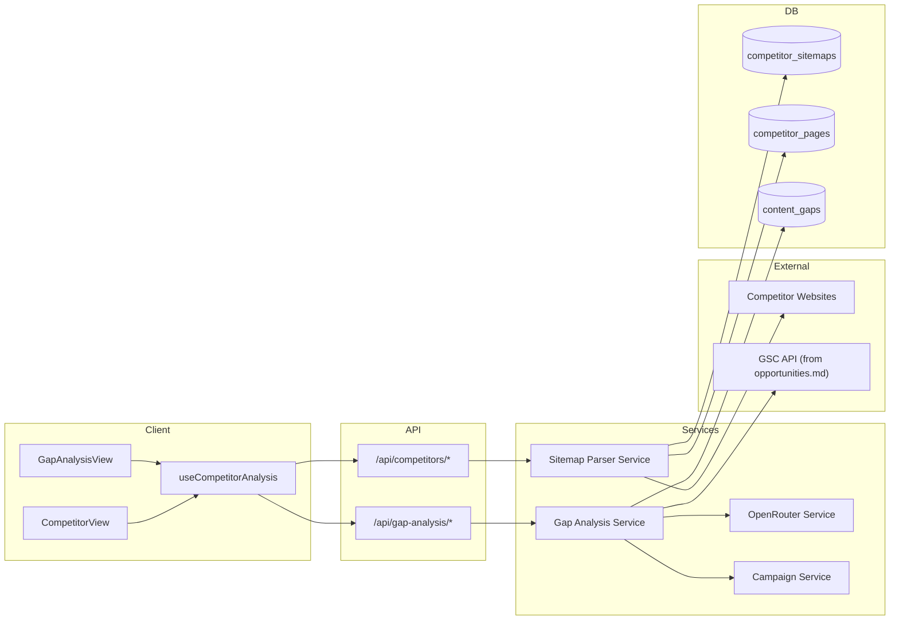
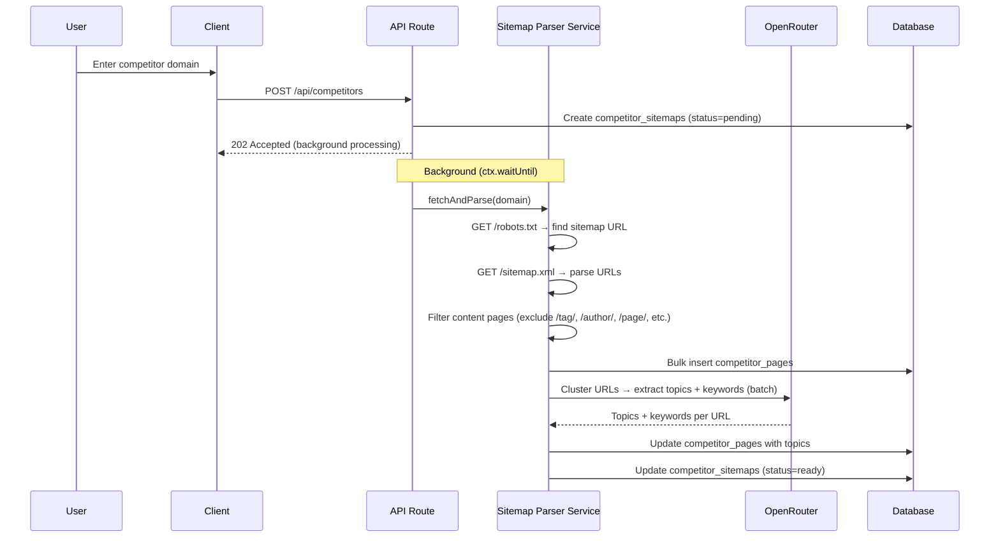
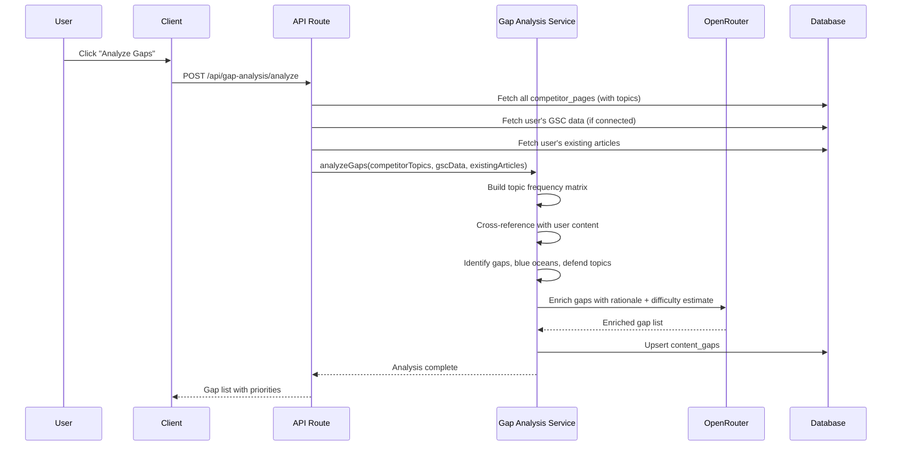
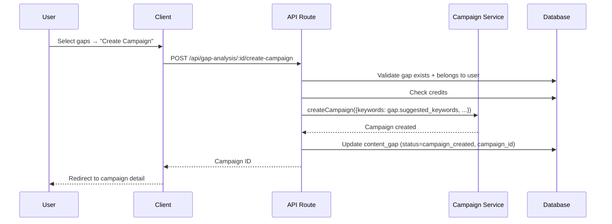

# PRD: Competitor Sitemap Gap Analysis → Article Generation

**Complexity: 9 → HIGH mode** (new system from scratch, external API integration, database schema changes, 15+ files, AI-powered analysis, complex gap-detection logic)

**Depends on:** `opportunities.md` PRD (GSC integration — Phases 1-2 provide GSC tables + service)

---

## 1. Context

**Problem:** Users create campaigns by manually researching keywords. They have no data-driven way to discover what competitors are writing about, what gaps exist in their own content, or which topics competitors are _not_ covering (blue ocean opportunities). This leads to wasted credits on low-impact articles.

**Files Analyzed:**

- `shared/types/campaign.types.ts` — campaign + keyword types
- `shared/config/credits.config.ts` — credit cost model (1 credit = 1 article)
- `client/config/dashboardRoutes.ts` — dashboard navigation config
- `server/services/article-generation.service.ts` — article gen pipeline
- `server/services/openrouter.service.ts` — AI service pattern
- `server/services/campaign.service.ts` — campaign creation flow
- `shared/config/env.ts` — environment config
- `docs/PRDs/opportunities.md` — existing GSC + opportunity analysis PRD

**Current Behavior:**

- Users manually brainstorm keywords or use external tools (Ahrefs, SEMrush)
- No competitor intelligence inside the product
- No way to compare your content footprint against competitors
- GSC integration is planned (`opportunities.md`) but no competitor layer exists
- Campaign creation requires manual keyword entry

---

## 2. Solution

**Approach:**

- Users paste one or more competitor sitemap URLs (or domain → we auto-discover `sitemap.xml`)
- System fetches, parses, and stores competitor URLs with extracted topic/keyword signals
- AI clusters competitor URLs into topic categories and extracts target keywords
- System crosses competitor topics against the user's GSC data (existing rankings + impressions) and existing articles
- Gap matrix surfaces 3 opportunity types: **gaps to fill**, **topics to defend**, and **blue ocean** (topics nobody covers well)
- Users can bulk-create campaigns directly from discovered gaps — keywords pre-filled, ready to generate

**Architecture Diagram:**



**Key Decisions:**

- [x] **Sitemap.xml parsing** — standard XML, well-structured, no scraping needed (respects robots.txt)
- [x] **AI topic extraction** — use OpenRouter to infer topics/keywords from competitor URL slugs + titles (no need to fetch full page content — too slow/expensive)
- [x] **Gap analysis is free** — only article generation from gaps costs credits (same as normal: 1 credit/article)
- [x] **Competitor limit per user** — max 5 competitors (prevents abuse, keeps analysis manageable)
- [x] **URL limit per competitor** — max 500 URLs parsed (focus on blog/content pages, filter out utility pages)
- [x] **Depends on GSC data** — gap analysis is most powerful when GSC is connected, but works in "competitor-only" mode too (shows what competitors cover, without your ranking data)
- [x] **Reuse existing services** — `openrouter.service.ts` for AI, `campaign.service.ts` for campaign creation
- [x] **Cloudflare 10ms CPU limit** — sitemap fetching + AI analysis done via `ctx.waitUntil()` background tasks, results stored pre-computed

**Data Changes:**

### New Tables

**`competitor_sitemaps`** — Tracks competitor domains added by the user

| Column          | Type        | Notes                                        |
| --------------- | ----------- | -------------------------------------------- |
| id              | UUID        | PK                                           |
| user_id         | UUID        | FK → profiles                                |
| domain          | TEXT        | e.g., "competitor.com"                       |
| sitemap_url     | TEXT        | Full sitemap URL (auto-discovered or manual) |
| status          | TEXT        | 'pending' / 'fetching' / 'ready' / 'error'   |
| page_count      | INTEGER     | Number of content pages found                |
| last_fetched_at | TIMESTAMPTZ | Last successful fetch                        |
| error_message   | TEXT        | Null unless status='error'                   |
| created_at      | TIMESTAMPTZ |                                              |
| updated_at      | TIMESTAMPTZ |                                              |

**`competitor_pages`** — Individual URLs extracted from competitor sitemaps

| Column            | Type        | Notes                                                   |
| ----------------- | ----------- | ------------------------------------------------------- |
| id                | UUID        | PK                                                      |
| sitemap_id        | UUID        | FK → competitor_sitemaps                                |
| user_id           | UUID        | FK → profiles                                           |
| url               | TEXT        | Full page URL                                           |
| slug              | TEXT        | URL path portion (e.g., "/blog/seo-tips")               |
| inferred_topic    | TEXT        | AI-extracted topic (e.g., "SEO tips for beginners")     |
| inferred_keywords | TEXT[]      | AI-extracted target keywords                            |
| category          | TEXT        | AI-assigned category (e.g., "SEO", "Content Marketing") |
| last_modified     | TIMESTAMPTZ | From sitemap `<lastmod>` if available                   |
| created_at        | TIMESTAMPTZ |                                                         |

**`content_gaps`** — Discovered gap opportunities from analysis

| Column               | Type        | Notes                                                           |
| -------------------- | ----------- | --------------------------------------------------------------- |
| id                   | UUID        | PK                                                              |
| user_id              | UUID        | FK → profiles                                                   |
| gap_type             | TEXT        | 'competitor_covers' / 'blue_ocean' / 'defend'                   |
| topic                | TEXT        | Topic/keyword cluster label                                     |
| suggested_keywords   | TEXT[]      | Keywords to target                                              |
| competitor_urls      | JSONB       | Array of `{domain, url, slug}` covering this topic              |
| your_urls            | JSONB       | Your existing pages on this topic (from GSC), null if gap       |
| your_metrics         | JSONB       | GSC metrics if you have pages `{position, clicks, impressions}` |
| priority_score       | INTEGER     | 0-100 weighted score                                            |
| estimated_difficulty | TEXT        | 'easy' / 'medium' / 'hard'                                      |
| status               | TEXT        | 'open' / 'campaign_created' / 'dismissed'                       |
| campaign_id          | UUID        | FK → campaigns (nullable, set when campaign created)            |
| ai_rationale         | TEXT        | AI explanation of why this gap matters                          |
| created_at           | TIMESTAMPTZ |                                                                 |
| updated_at           | TIMESTAMPTZ |                                                                 |

### Gap Types Explained

| Gap Type            | Description                                                              | Priority Signal                    |
| ------------------- | ------------------------------------------------------------------------ | ---------------------------------- |
| `competitor_covers` | Competitors have content on this topic, you don't                        | HIGH — direct competitive gap      |
| `blue_ocean`        | Topic with GSC impressions but no competitor OR your content covering it | HIGH — low competition opportunity |
| `defend`            | You rank for this topic but competitors are also covering it             | MEDIUM — protect your position     |

---

## 3. Sequence Flows

### Add Competitor Flow



### Gap Analysis Flow



### Create Campaign from Gap



---

## 4. Integration Points

**How will this feature be reached?**

- [x] Entry point: New sidebar item "Competitors" in dashboard primary navigation
- [x] Route: `/dashboard/competitors`
- [x] Registration: Add to `DASHBOARD_ROUTES` in `client/config/dashboardRoutes.ts`
- [x] Gap analysis accessed from within the Competitors view (tab: "Competitors" | "Gap Analysis")

**Is this user-facing?**

- [x] YES → Full dashboard view with competitor management + gap analysis tabs

**Full user flow:**

1. User navigates to `/dashboard/competitors`
2. Sees empty state → "Add your first competitor"
3. Enters a domain (e.g., `competitor.com`) → system fetches sitemap in background
4. Sees competitor card with status (fetching → ready), page count, top topics
5. Adds up to 5 competitors
6. Clicks "Analyze Gaps" tab → system crosses competitor topics with GSC + existing articles
7. Sees gap matrix: prioritized list of content gaps, blue ocean topics, and defend topics
8. Selects gaps → "Create Campaign" → campaign created with keywords pre-filled
9. Proceeds to normal campaign flow (start generation, articles created)

---

## 5. Execution Phases

### Phase 1: Database Schema + Types

**User-visible outcome:** Foundation tables and shared types are ready for all subsequent phases.

**Files (5):**

- `supabase/migrations/YYYYMMDDHHMMSS_create_competitor_sitemaps.sql` — competitor_sitemaps table + RLS
- `supabase/migrations/YYYYMMDDHHMMSS_create_competitor_pages.sql` — competitor_pages table + RLS
- `supabase/migrations/YYYYMMDDHHMMSS_create_content_gaps.sql` — content_gaps table + RLS + indexes
- `shared/types/competitor.types.ts` — ICompetitorSitemap, ICompetitorPage, IContentGap, enums
- `shared/types/index.ts` — re-export new types

**Implementation:**

- [ ] Create `competitor_sitemaps` table with RLS (user can only see own competitors)
- [ ] Create `competitor_pages` table with RLS + index on (sitemap_id)
- [ ] Create `content_gaps` table with RLS + indexes on (user_id, status), (user_id, gap_type)
- [ ] Add constraint: max 5 competitors per user (CHECK or application-level)
- [ ] Define TypeScript interfaces matching all tables
- [ ] Define literal union types: `CompetitorStatus`, `GapType`, `GapDifficulty`, `GapStatus`

**Verification Plan:**

1. **Unit Tests:**
   - File: `tests/unit/shared/types/competitor.types.unit.spec.ts`
   - Tests: `should define all gap types`, `should define all competitor statuses`

2. **Migration Verification:**
   - Apply migrations locally: `npx supabase migration up`
   - Verify tables exist with correct columns and RLS policies

---

### Phase 2: Sitemap Parser Service

**User-visible outcome:** System can fetch a competitor's sitemap.xml, parse it, and extract content URLs.

**Files (4):**

- `server/services/sitemap-parser.service.ts` — fetch + parse sitemap XML
- `shared/config/competitor.config.ts` — limits, filters, URL patterns to exclude
- `shared/validation/competitor.validation.ts` — Zod schemas for competitor input
- `src/pages/api/competitors/index.ts` — POST add competitor, GET list competitors

**Implementation:**

- [ ] Create `competitor.config.ts` with:
  - `MAX_COMPETITORS_PER_USER: 5`
  - `MAX_PAGES_PER_SITEMAP: 500`
  - `EXCLUDED_URL_PATTERNS: ['/tag/', '/author/', '/page/', '/category/', '/wp-admin/', '/feed/']`
  - `CONTENT_URL_PATTERNS: ['/blog/', '/articles/', '/posts/', '/guides/', '/resources/']` (boost scoring for these)
- [ ] Create `SitemapParserService`:
  - `discoverSitemap(domain)` — try `/sitemap.xml`, then parse `/robots.txt` for Sitemap directive
  - `fetchSitemap(url)` — GET sitemap XML, handle sitemap index (recursive), handle gzipped sitemaps
  - `parseUrls(xml)` — extract `<url><loc>` entries with optional `<lastmod>`
  - `filterContentPages(urls)` — remove utility pages, keep content-likely URLs, cap at 500
- [ ] Create Zod validation schema: `addCompetitorSchema` (domain: string, valid URL format)
- [ ] Create API routes:
  - `POST /api/competitors` — add competitor, trigger background fetch via `ctx.waitUntil()`
  - `GET /api/competitors` — list user's competitors with status + page counts

**Verification Plan:**

1. **Unit Tests:**
   - File: `tests/unit/server/services/sitemap-parser.service.unit.spec.ts`
   - Tests: `should parse standard sitemap XML`, `should handle sitemap index`, `should filter non-content URLs`, `should respect 500 URL limit`, `should discover sitemap from robots.txt`

2. **API Proof:**

   ```bash
   # Add competitor
   curl -X POST http://localhost:4321/api/competitors \
     -H "Authorization: Bearer $TOKEN" \
     -H "Content-Type: application/json" \
     -d '{"domain": "competitor.com"}' | jq .
   # Expected: {"id": "...", "status": "pending"}

   # List competitors
   curl http://localhost:4321/api/competitors \
     -H "Authorization: Bearer $TOKEN" | jq .
   # Expected: {"competitors": [{...}]}
   ```

---

### Phase 3: AI Topic Extraction

**User-visible outcome:** Competitor pages have AI-inferred topics and keywords extracted from their URL patterns.

**Files (4):**

- `server/services/topic-extraction.service.ts` — AI-powered topic inference from URLs
- `shared/config/competitor.config.ts` — add AI prompt templates
- `src/pages/api/competitors/[id]/index.ts` — GET competitor detail, DELETE competitor
- `src/pages/api/competitors/[id]/refresh.ts` — POST re-fetch sitemap

**Implementation:**

- [ ] Create `TopicExtractionService`:
  - `extractTopics(pages: ICompetitorPage[])` — batch URLs to OpenRouter (groups of 50)
  - AI prompt: given a list of blog URL slugs from domain X, infer the topic, 2-3 target keywords, and a category for each
  - `categorizeTopics(topics)` — group into clusters (AI assigns categories like "SEO", "Content Marketing", "Link Building")
  - Store results back to `competitor_pages` table
- [ ] Integrate with sitemap parser: after URL extraction, automatically trigger topic extraction
- [ ] Create API routes:
  - `GET /api/competitors/:id` — competitor detail with pages + topic summary
  - `DELETE /api/competitors/:id` — remove competitor + cascade pages
  - `POST /api/competitors/:id/refresh` — re-fetch sitemap + re-extract topics

**Verification Plan:**

1. **Unit Tests:**
   - File: `tests/unit/server/services/topic-extraction.service.unit.spec.ts`
   - Tests: `should extract topics from URL slugs`, `should batch URLs in groups of 50`, `should handle OpenRouter errors gracefully`, `should categorize topics into clusters`

2. **API Proof:**
   ```bash
   # Get competitor detail with topics
   curl http://localhost:4321/api/competitors/COMP_ID \
     -H "Authorization: Bearer $TOKEN" | jq .
   # Expected: {"competitor": {...}, "pages": [{url, inferred_topic, inferred_keywords, category}], "topicSummary": {...}}
   ```

---

### Phase 4: Gap Analysis Service

**User-visible outcome:** System can cross-reference competitor topics against user's GSC data and existing articles to produce a prioritized gap list.

**Files (5):**

- `server/services/gap-analysis.service.ts` — core gap detection + AI enrichment
- `shared/config/competitor.config.ts` — add gap scoring weights + thresholds
- `src/pages/api/gap-analysis/analyze.ts` — POST trigger analysis
- `src/pages/api/gap-analysis/index.ts` — GET list gaps
- `src/pages/api/gap-analysis/[id]/index.ts` — PATCH update gap status, dismiss

**Implementation:**

- [ ] Add gap scoring config:
  - `competitor_covers` base score: 70 (boosted if 2+ competitors cover it)
  - `blue_ocean` base score: 85 (high GSC impressions + no competitor content)
  - `defend` base score: 50 (boosted if competitor content is newer)
  - Modifiers: +10 if topic has >1000 monthly impressions, +5 per additional competitor covering it
- [ ] Create `GapAnalysisService`:
  - `analyze(userId)`:
    1. Fetch all competitor pages with topics
    2. Fetch user's GSC data (if connected, via `gsc_snapshots` from opportunities.md)
    3. Fetch user's existing articles
    4. Build topic frequency map from competitors
    5. Cross-reference: for each competitor topic, check if user has matching content (fuzzy match on keywords)
    6. Identify gaps: topics competitors cover that user doesn't
    7. Identify blue ocean: GSC queries with impressions but no competitor or user content
    8. Identify defend: topics both user and competitors cover
  - `enrichWithAI(gaps)` — OpenRouter to generate rationale, difficulty estimate, and refined keywords
  - `calculatePriority(gap)` — weighted scoring based on type + metrics
- [ ] Create API routes:
  - `POST /api/gap-analysis/analyze` — trigger full analysis (background via `ctx.waitUntil()`)
  - `GET /api/gap-analysis` — list gaps (paginated, filterable by gap_type, status, difficulty)
  - `PATCH /api/gap-analysis/:id` — update status (dismiss, etc.)

**Verification Plan:**

1. **Unit Tests:**
   - File: `tests/unit/server/services/gap-analysis.service.unit.spec.ts`
   - Tests:
     - `should identify competitor_covers gaps when competitor has topic user lacks`
     - `should identify blue_ocean when GSC shows impressions with no content`
     - `should identify defend when both have content on same topic`
     - `should calculate priority score correctly`
     - `should not create duplicate gaps on re-analysis`
     - `should work without GSC data (competitor-only mode)`

2. **API Proof:**

   ```bash
   # Trigger analysis
   curl -X POST http://localhost:4321/api/gap-analysis/analyze \
     -H "Authorization: Bearer $TOKEN" | jq .
   # Expected: {"status": "analyzing", "message": "Gap analysis started"}

   # List gaps
   curl "http://localhost:4321/api/gap-analysis?gap_type=competitor_covers&status=open" \
     -H "Authorization: Bearer $TOKEN" | jq .
   # Expected: {"gaps": [...], "total": 23}
   ```

---

### Phase 5: Campaign Creation from Gaps

**User-visible outcome:** Users can create a campaign directly from one or more content gaps, with keywords pre-filled.

**Files (3):**

- `src/pages/api/gap-analysis/[id]/create-campaign.ts` — POST create campaign from gap
- `src/pages/api/gap-analysis/bulk-create-campaign.ts` — POST create campaign from multiple gaps
- `shared/validation/competitor.validation.ts` — add campaign creation schemas

**Implementation:**

- [ ] Create single gap → campaign API:
  - Validate gap exists, belongs to user, status is 'open'
  - Check credits (same cost: `CREDIT_COSTS.API_CALL` per keyword)
  - Create campaign via existing `campaignService.create()` with:
    - `name`: AI-generated from gap topic (e.g., "Gap: SEO Tips for Beginners")
    - `keywords`: `gap.suggested_keywords`
    - Settings: `{ source: 'gap_analysis', gap_id: gap.id }`
  - Update gap: `status = 'campaign_created'`, `campaign_id = campaign.id`
- [ ] Create bulk gap → campaign API:
  - Accept array of gap IDs
  - Merge keywords from all selected gaps into one campaign
  - Deduplicate keywords
  - Same credit check + campaign creation flow
- [ ] Add Zod schemas for both endpoints

**Verification Plan:**

1. **Unit Tests:**
   - File: `tests/unit/api/gap-analysis.create-campaign.unit.spec.ts`
   - Tests:
     - `should create campaign with gap keywords`
     - `should update gap status to campaign_created`
     - `should check credits before creating`
     - `should reject if gap already has campaign`
     - `should deduplicate keywords in bulk creation`

2. **API Proof:**
   ```bash
   # Create campaign from single gap
   curl -X POST http://localhost:4321/api/gap-analysis/GAP_ID/create-campaign \
     -H "Authorization: Bearer $TOKEN" \
     -H "Content-Type: application/json" \
     -d '{"model": "balanced", "tone": "professional"}' | jq .
   # Expected: {"campaignId": "...", "keywordCount": 3}
   ```

---

### Phase 6: Dashboard UI — Competitors Tab

**User-visible outcome:** Users can add/remove competitors and see their topic coverage from a new dashboard tab.

**Files (5):**

- `client/components/pages/CompetitorsPageClient.tsx` — page wrapper
- `client/components/dashboard/views/CompetitorsView.tsx` — main view with tabs
- `client/components/dashboard/views/competitors/CompetitorCard.tsx` — competitor status card
- `client/hooks/useCompetitorAnalysis.ts` — data fetching + mutations
- `client/config/dashboardRoutes.ts` — add route

**Implementation:**

- [ ] Create `useCompetitorAnalysis()` hook:
  - `competitors` — React Query: fetch competitor list
  - `addCompetitor(domain)` — mutation: POST /api/competitors
  - `removeCompetitor(id)` — mutation: DELETE /api/competitors/:id
  - `refreshCompetitor(id)` — mutation: POST /api/competitors/:id/refresh
- [ ] Create `CompetitorCard`:
  - Domain name + favicon (via Google favicon API)
  - Status indicator (pending/fetching/ready/error)
  - Page count + top 5 topic categories
  - "Refresh" and "Remove" actions
- [ ] Create `CompetitorsView` with two tabs:
  - **Competitors tab**: list of competitor cards + "Add Competitor" input
  - **Gap Analysis tab**: (Phase 7)
- [ ] Register route in `dashboardRoutes.ts` with `Users` icon (representing competitors)
- [ ] Add i18n keys to `locales/en/dashboard.json`

**Verification Plan:**

1. **Unit Tests:**
   - File: `tests/unit/components/CompetitorsView.unit.spec.tsx`
   - Tests: `should render empty state`, `should render competitor cards`, `should handle add competitor`, `should show error state`
   - File: `tests/unit/hooks/useCompetitorAnalysis.unit.spec.ts`
   - Tests: `should fetch competitors`, `should add competitor`, `should remove competitor`

2. **User Verification:**
   - Navigate to `/dashboard/competitors`
   - See empty state with "Add Competitor" prompt
   - Enter domain → competitor card appears with "Fetching..." status
   - Card updates to "Ready" with topic summary

---

### Phase 7: Dashboard UI — Gap Analysis Tab

**User-visible outcome:** Users can view the gap matrix, filter/sort gaps, and create campaigns from gaps.

**Files (5):**

- `client/components/dashboard/views/competitors/GapAnalysisTab.tsx` — gap list with filters
- `client/components/dashboard/views/competitors/GapCard.tsx` — individual gap display
- `client/components/dashboard/views/competitors/CreateCampaignFromGapsModal.tsx` — modal for campaign creation
- `client/hooks/useCompetitorAnalysis.ts` — add gap-related queries + mutations
- `locales/en/dashboard.json` — add gap analysis i18n keys

**Implementation:**

- [ ] Extend `useCompetitorAnalysis()` hook:
  - `gaps` — React Query: fetch gap list with filters
  - `analyzeGaps()` — mutation: POST /api/gap-analysis/analyze
  - `dismissGap(id)` — mutation: PATCH /api/gap-analysis/:id
  - `createCampaignFromGaps(gapIds, options)` — mutation: POST /api/gap-analysis/bulk-create-campaign
- [ ] Create `GapAnalysisTab`:
  - "Analyze Gaps" button (disabled if no competitors, shows last analysis timestamp)
  - Filter bar: gap type (all/competitor_covers/blue_ocean/defend), difficulty, status
  - Sortable by priority score
  - Bulk selection checkboxes → "Create Campaign from Selected" button
  - Empty state: "Add competitors first" or "Run analysis"
- [ ] Create `GapCard`:
  - Topic label + gap type badge (color-coded)
  - Suggested keywords as pills
  - Competitor URLs that cover this topic
  - Your existing coverage (if any, from GSC)
  - Priority score bar + difficulty badge
  - AI rationale text
  - Actions: "Create Campaign", "Dismiss"
- [ ] Create `CreateCampaignFromGapsModal`:
  - Shows merged keyword list from selected gaps
  - Allows removing keywords before creation
  - Model + tone selector (reuse existing campaign creation form fields)
  - Credit cost estimate
  - "Create Campaign" → calls bulk API

**Verification Plan:**

1. **Unit Tests:**
   - File: `tests/unit/components/GapAnalysisTab.unit.spec.tsx`
   - Tests: `should render gap list`, `should filter by gap type`, `should handle bulk selection`, `should show create campaign modal`
   - File: `tests/unit/components/CreateCampaignFromGapsModal.unit.spec.tsx`
   - Tests: `should merge keywords from gaps`, `should calculate credit cost`, `should allow keyword removal`

2. **User Verification:**
   - Navigate to Competitors → Gap Analysis tab
   - Click "Analyze Gaps" → loading state → gaps appear
   - Filter by "Blue Ocean" → only blue ocean gaps shown
   - Select 3 gaps → "Create Campaign" → modal opens with merged keywords
   - Confirm → campaign created, redirect to campaign detail

---

## 6. Environment Variables

No new environment variables required. This feature reuses:

- `OPENROUTER_API_KEY` — for AI topic extraction + gap enrichment (existing)
- GSC data comes from `opportunities.md` integration (existing `GOOGLE_OAUTH_CLIENT_SECRET`)

---

## 7. Acceptance Criteria

- [ ] All 7 phases complete
- [ ] All specified tests pass
- [ ] `yarn verify` passes
- [ ] All automated checkpoint reviews passed
- [ ] Users can add up to 5 competitor domains
- [ ] System fetches + parses competitor sitemaps in background
- [ ] AI extracts topics + keywords from competitor URLs
- [ ] Gap analysis crosses competitor data with GSC data + existing articles
- [ ] Three gap types are identified: competitor_covers, blue_ocean, defend
- [ ] Gaps are prioritized with a 0-100 score
- [ ] Users can create campaigns directly from gaps (keywords pre-filled)
- [ ] Feature works without GSC (competitor-only mode, degraded but functional)
- [ ] Feature is reachable from dashboard sidebar navigation
- [ ] No competitor data leaks between users (RLS enforced)
- [ ] Background processing respects Cloudflare 10ms CPU limit
