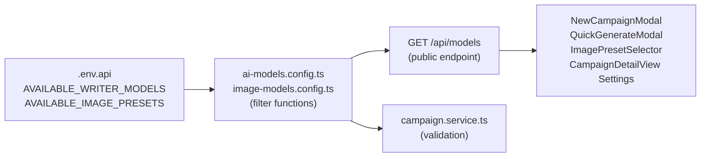
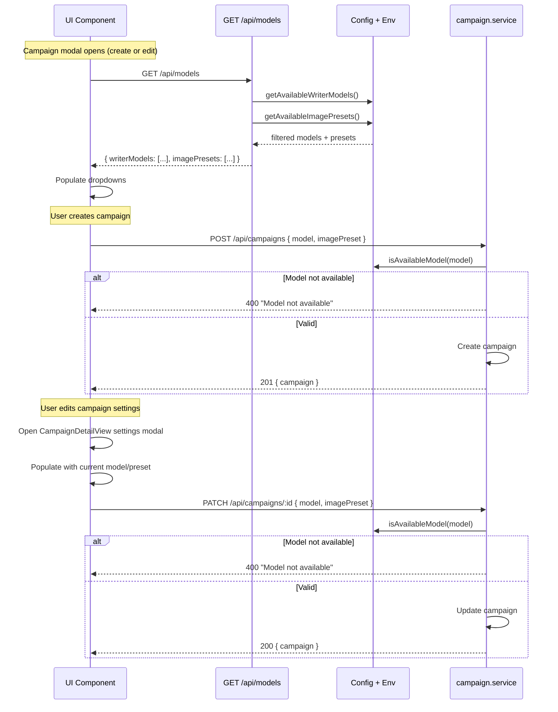

# PRD: Configurable AI Models via Environment Variables

**Complexity: 5 → MEDIUM mode**

---

## 1. Context

**Problem:** Writer models and image presets are hardcoded in config files. Adding/removing available models requires a code deploy. We need .env-driven configuration so the operator can control which models are available without touching code.

**Files Analyzed:**

- `shared/config/ai-models.config.ts` — hardcoded writer model registry
- `shared/config/image-models.config.ts` — hardcoded image preset registry
- `shared/config/env.ts` — centralized env loading (Zod schemas)
- `shared/config/security.ts` — PUBLIC_API_ROUTES list
- `client/components/dashboard/views/NewCampaignModal.tsx` — imports `AI_MODELS` directly
- `client/components/dashboard/views/CampaignDetailView.tsx` — settings modal lacks model/preset editing
- `client/components/articles/QuickGenerateModal.tsx` — imports `AI_MODELS` directly
- `client/components/articles/ImagePresetSelector.tsx` — imports `IMAGE_PRESETS` directly
- `server/services/campaign.service.ts` — validates model on create/update
- `server/services/article-generation.service.ts` — uses model during generation

**Current Behavior:**

- `AI_MODELS` object is hardcoded with 5 writer models in `ai-models.config.ts`
- `IMAGE_PRESETS` object is hardcoded with 6 image presets in `image-models.config.ts`
- Client components import these directly — no way to restrict which are available
- No .env variables control available models; only `OPENROUTER_TEXT_MODEL` sets the default fallback
- Campaign creation shows all models regardless of operator intent
- **Campaign settings modal only edits name, tone, word count — NOT model or image preset**

---

## 2. Solution

**Approach:**

- Add `AVAILABLE_WRITER_MODELS` and `AVAILABLE_IMAGE_PRESETS` to `.env.api` (comma-separated)
- Add getter functions in existing config files that filter the full registry to only .env-enabled entries
- Create a public `GET /api/models` endpoint that returns available models + presets with full metadata
- Update client components (`NewCampaignModal`, `QuickGenerateModal`, `ImagePresetSelector`) to fetch from the API instead of importing hardcoded config
- **Add writer model and image preset dropdowns to `CampaignDetailView` settings modal**
- Add server-side validation in campaign service to reject models/presets not in the available list

**Architecture:**



**Key Decisions:**

- .env values are **server-side only** (`AVAILABLE_WRITER_MODELS`, `AVAILABLE_IMAGE_PRESETS` in `.env.api`)
- The full model registry stays in code (metadata like name, provider, cost); .env just toggles which are **enabled**
- API endpoint is **public** (no auth needed — available models aren't sensitive)
- If .env is empty/unset, **all models** are available (backward-compatible default)
- Image presets show the underlying Replicate model name in the API response for clarity

**Data Changes:** None (no DB migrations needed)

---

## 3. Sequence Flow



---

## 4. Execution Phases

### Phase 1: Environment + Config Layer — "Available models are filterable via .env"

**Files (4):**

- `.env.api` — add new variables
- `shared/config/env.ts` — add to serverEnvSchema + loadServerEnv
- `shared/config/ai-models.config.ts` — add `getAvailableWriterModels()` function
- `shared/config/image-models.config.ts` — add `getAvailableImagePresets()` function

**Implementation:**

- [ ] Add to `.env.api`:

  ```
  # Available AI models (comma-separated OpenRouter model IDs, empty = all)
  AVAILABLE_WRITER_MODELS=openai/gpt-4o,openai/gpt-4o-mini,anthropic/claude-sonnet-4-5,google/gemini-2.0-flash,openrouter/auto
  # Available image presets (comma-separated preset keys, empty = all)
  AVAILABLE_IMAGE_PRESETS=blog-hero,social-card,product-shot,premium-hero,photorealistic,illustration
  ```

- [ ] Add to `serverEnvSchema` in `shared/config/env.ts`:

  ```typescript
  AVAILABLE_WRITER_MODELS: z.string().default(''),
  AVAILABLE_IMAGE_PRESETS: z.string().default(''),
  ```

  And add corresponding entries in `loadServerEnv()`.

- [ ] In `ai-models.config.ts`, add:

  ```typescript
  /**
   * Parse comma-separated env string into available model IDs.
   * Empty string = all models available.
   */
  export function getAvailableWriterModels(
    envValue: string
  ): Array<{ id: AIModelId; name: string; provider: string }> {
    const enabledIds = envValue
      .split(',')
      .map(s => s.trim())
      .filter(Boolean);

    const ids = enabledIds.length > 0 ? MODEL_IDS.filter(id => enabledIds.includes(id)) : MODEL_IDS;

    return ids.map(id => ({ id, ...AI_MODELS[id] }));
  }

  export function isAvailableWriterModel(modelId: string, envValue: string): boolean {
    const available = getAvailableWriterModels(envValue);
    return available.some(m => m.id === modelId);
  }
  ```

- [ ] In `image-models.config.ts`, add:

  ```typescript
  /**
   * Parse comma-separated env string into available image presets.
   * Empty string = all presets available.
   */
  export function getAvailableImagePresets(envValue: string): IImagePreset[] {
    const enabledKeys = envValue
      .split(',')
      .map(s => s.trim())
      .filter(Boolean);

    const keys =
      enabledKeys.length > 0
        ? IMAGE_PRESET_KEYS.filter(k => enabledKeys.includes(k))
        : IMAGE_PRESET_KEYS;

    return keys.map(k => IMAGE_PRESETS[k]);
  }

  export function isAvailableImagePreset(presetKey: string, envValue: string): boolean {
    const available = getAvailableImagePresets(envValue);
    return available.some(p => p.key === presetKey);
  }
  ```

**Tests Required:**

| Test File                                                   | Test Name                                     | Assertion                                   |
| ----------------------------------------------------------- | --------------------------------------------- | ------------------------------------------- |
| `tests/unit/shared/config/ai-models.config.unit.spec.ts`    | `should return all models when env is empty`  | All 5 models returned                       |
| `tests/unit/shared/config/ai-models.config.unit.spec.ts`    | `should filter to only enabled models`        | Only specified models returned              |
| `tests/unit/shared/config/ai-models.config.unit.spec.ts`    | `should ignore invalid model IDs in env`      | Invalid IDs silently skipped                |
| `tests/unit/shared/config/ai-models.config.unit.spec.ts`    | `should validate available model correctly`   | `isAvailableWriterModel` returns true/false |
| `tests/unit/shared/config/image-models.config.unit.spec.ts` | `should return all presets when env is empty` | All 6 presets returned                      |
| `tests/unit/shared/config/image-models.config.unit.spec.ts` | `should filter to only enabled presets`       | Only specified presets returned             |
| `tests/unit/shared/config/image-models.config.unit.spec.ts` | `should validate available preset correctly`  | `isAvailableImagePreset` returns true/false |

**Verification Plan:**

1. Unit tests for both config files
2. `yarn verify` passes

---

### Phase 2: Public API Endpoint — "Client can fetch available models"

**Files (3):**

- `src/pages/api/models/index.ts` — **NEW** — GET endpoint
- `shared/config/security.ts` — add `/api/models` to PUBLIC_API_ROUTES
- `shared/types/models.types.ts` — **NEW** — response type

**Implementation:**

- [ ] Create `shared/types/models.types.ts`:

  ```typescript
  export interface IAvailableWriterModel {
    id: string;
    name: string;
    provider: string;
  }

  export interface IAvailableImagePreset {
    key: string;
    displayName: string;
    description: string;
    bestFor: string;
    replicateModel: string; // Show underlying model for clarity
    creditCost: number;
    aspectRatio: string;
  }

  export interface IAvailableModelsResponse {
    writerModels: IAvailableWriterModel[];
    imagePresets: IAvailableImagePreset[];
  }
  ```

- [ ] Create `src/pages/api/models/index.ts`:

  ```typescript
  // GET /api/models — returns available writer models and image presets
  export const GET: APIRoute = async () => {
    const writerModels = getAvailableWriterModels(serverEnv.AVAILABLE_WRITER_MODELS);
    const imagePresets = getAvailableImagePresets(serverEnv.AVAILABLE_IMAGE_PRESETS);

    return new Response(JSON.stringify({ writerModels, imagePresets }), {
      status: 200,
      headers: { 'Content-Type': 'application/json' },
    });
  };
  ```

- [ ] Add `/api/models` to `PUBLIC_API_ROUTES` in `shared/config/security.ts`

**Tests Required:**

| Test File                            | Test Name                                              | Assertion                                         |
| ------------------------------------ | ------------------------------------------------------ | ------------------------------------------------- |
| `tests/unit/api/models.unit.spec.ts` | `should return 200 with writerModels and imagePresets` | Response shape matches `IAvailableModelsResponse` |
| `tests/unit/api/models.unit.spec.ts` | `should return filtered models based on env`           | Only env-enabled models in response               |

**Verification Plan:**

1. Unit tests for API endpoint
2. curl command: `curl http://localhost:4321/api/models | jq .`
3. `yarn verify` passes

---

### Phase 3: Client Hook + UI Update — "Campaign modals use dynamic models"

**Files (6):**

- `client/hooks/useAvailableModels.ts` — **NEW** — React Query hook to fetch /api/models
- `client/components/dashboard/views/NewCampaignModal.tsx` — replace hardcoded `AI_MODELS` import
- `client/components/dashboard/views/CampaignDetailView.tsx` — **add model/preset to settings modal**
- `client/components/articles/QuickGenerateModal.tsx` — replace hardcoded `AI_MODELS` import
- `client/components/articles/ImagePresetSelector.tsx` — accept models as prop instead of importing
- `tests/unit/components/NewCampaignModal.unit.spec.tsx` — update tests

**Implementation:**

- [ ] Create `client/hooks/useAvailableModels.ts`:

  ```typescript
  import { useQuery } from '@tanstack/react-query';
  import type { IAvailableModelsResponse } from '@shared/types/models.types';

  export function useAvailableModels() {
    return useQuery<IAvailableModelsResponse>({
      queryKey: ['available-models'],
      queryFn: async () => {
        const res = await fetch('/api/models');
        if (!res.ok) throw new Error('Failed to fetch models');
        return res.json();
      },
      staleTime: 5 * 60 * 1000, // 5 min — models rarely change
    });
  }
  ```

- [ ] Update `NewCampaignModal.tsx`:
  - Remove `import { AI_MODELS } from '@shared/config/ai-models.config'`
  - Add `import { useAvailableModels } from '@client/hooks/useAvailableModels'`
  - Call `const { data: models, isLoading: modelsLoading } = useAvailableModels()`
  - Replace `Object.entries(AI_MODELS).map(...)` with `models?.writerModels.map(m => <option key={m.id} value={m.id}>{m.name} ({m.provider})</option>)`
  - Show loading state if `modelsLoading`

- [ ] Update `ImagePresetSelector.tsx`:
  - Add `availablePresets` prop: `IAvailableImagePreset[]`
  - Replace `Object.values(IMAGE_PRESETS).map(...)` with `availablePresets.map(...)`
  - Keep `getImagePresetCreditCost` import for the "No images" option (always available)
  - The `replicateModel` field is now available — show it as a subtle label under each preset for clarity (e.g., "flux-schnell" extracted from "black-forest-labs/flux-schnell")

- [ ] Update `QuickGenerateModal.tsx`:
  - Same pattern as NewCampaignModal: use `useAvailableModels()` hook
  - Pass `availablePresets` to `ImagePresetSelector`

- [ ] Update `CampaignDetailView.tsx` settings modal:
  - Add `import { useAvailableModels } from '@client/hooks/useAvailableModels'`
  - Call `const { data: models } = useAvailableModels()` at component top level
  - Extend `settingsForm` state to include `model` and `imagePreset`:
    ```typescript
    const [settingsForm, setSettingsForm] = useState<{
      name: string;
      tone: CampaignTone | '';
      targetWordCount: number;
      model: string; // NEW
      imagePreset: string; // NEW
    }>({
      name: '',
      tone: '',
      targetWordCount: 1500,
      model: '', // NEW
      imagePreset: '', // NEW
    });
    ```
  - Update `handleOpenSettings` to populate current model/preset:
    ```typescript
    setSettingsForm({
      name: campaign.name,
      tone: campaign.tone,
      targetWordCount: campaign.target_word_count,
      model: campaign.ai_model, // NEW
      imagePreset: campaign.image_preset || '', // NEW
    });
    ```
  - Add writer model dropdown in settings modal (after tone section):
    ```tsx
    {
      /* Writer Model */
    }
    <div>
      <label className="block text-sm font-medium text-secondary mb-1.5">Writer Model</label>
      <select
        value={settingsForm.model}
        onChange={e => setSettingsForm({ ...settingsForm, model: e.target.value })}
        className="w-full bg-main border border-border rounded-lg px-3 py-2 text-white focus:ring-1 focus:ring-accent outline-none"
      >
        {models?.writerModels.map(m => (
          <option key={m.id} value={m.id}>
            {m.name} ({m.provider})
          </option>
        ))}
      </select>
    </div>;
    ```
  - Add image preset dropdown (after writer model):
    ```tsx
    {
      /* Image Preset */
    }
    <div>
      <label className="block text-sm font-medium text-secondary mb-1.5">Image Preset</label>
      <select
        value={settingsForm.imagePreset}
        onChange={e => setSettingsForm({ ...settingsForm, imagePreset: e.target.value })}
        className="w-full bg-main border border-border rounded-lg px-3 py-2 text-white focus:ring-1 focus:ring-accent outline-none"
      >
        <option value="">No images</option>
        {models?.imagePresets.map(p => (
          <option key={p.key} value={p.key}>
            {p.displayName}
          </option>
        ))}
      </select>
    </div>;
    ```
  - Update `handleSaveSettings` to include model/preset:
    ```typescript
    await updateCampaign({
      name: settingsForm.name,
      tone: settingsForm.tone,
      targetWordCount: settingsForm.targetWordCount,
      model: settingsForm.model, // NEW
      imagePreset: settingsForm.imagePreset || null, // NEW
    });
    ```

- [ ] Update existing tests for `NewCampaignModal` to mock `useAvailableModels`

**Tests Required:**

| Test File                                                 | Test Name                                                  | Assertion                                            |
| --------------------------------------------------------- | ---------------------------------------------------------- | ---------------------------------------------------- |
| `tests/unit/hooks/useAvailableModels.unit.spec.ts`        | `should fetch and return available models`                 | Returns `writerModels` and `imagePresets`            |
| `tests/unit/hooks/useAvailableModels.unit.spec.ts`        | `should handle loading state`                              | `isLoading` is true initially                        |
| `tests/unit/components/ImagePresetSelector.unit.spec.tsx` | `should render only available presets`                     | Only presets from prop are rendered                  |
| `tests/unit/components/CampaignDetailView.unit.spec.tsx`  | `should populate settings modal with current model/preset` | Form shows campaign's existing model and preset      |
| `tests/unit/components/CampaignDetailView.unit.spec.tsx`  | `should update campaign model/preset on save`              | `updateCampaign` called with new model/preset values |

**User Verification:**

- Action: Open "New Campaign" modal
- Expected: Writer model dropdown shows only .env-enabled models, Image preset selector shows only .env-enabled presets. Removing a model from .env and refreshing hides it from the UI.
- Action: Open existing campaign, click Settings (gear icon)
- Expected: Settings modal shows current writer model and image preset in dropdowns. Changing values and saving updates the campaign with server validation.

---

### Phase 4: Server-Side Validation — "Reject unavailable models"

**Files (2):**

- `server/services/campaign.service.ts` — validate model/preset against available list
- `tests/unit/services/campaign.service.unit.spec.ts` — add validation tests

**Implementation:**

- [ ] In `campaign.service.ts`, in `create()` and `update()` methods:
  - Import `isAvailableWriterModel` and `isAvailableImagePreset`
  - Before saving, check:
    ```typescript
    if (
      validated.model &&
      !isAvailableWriterModel(validated.model, serverEnv.AVAILABLE_WRITER_MODELS)
    ) {
      throw new AppError('Selected writer model is not available', 400);
    }
    if (
      validated.imagePreset &&
      !isAvailableImagePreset(validated.imagePreset, serverEnv.AVAILABLE_IMAGE_PRESETS)
    ) {
      throw new AppError('Selected image preset is not available', 400);
    }
    ```

**Tests Required:**

| Test File                                           | Test Name                                                 | Assertion                    |
| --------------------------------------------------- | --------------------------------------------------------- | ---------------------------- |
| `tests/unit/services/campaign.service.unit.spec.ts` | `should reject unavailable writer model on create`        | Throws 400 error             |
| `tests/unit/services/campaign.service.unit.spec.ts` | `should reject unavailable image preset on create`        | Throws 400 error             |
| `tests/unit/services/campaign.service.unit.spec.ts` | `should accept available model on create`                 | No error thrown              |
| `tests/unit/services/campaign.service.unit.spec.ts` | `should accept any model when env is empty (all allowed)` | No error for any valid model |
| `tests/unit/services/campaign.service.unit.spec.ts` | `should reject unavailable writer model on update`        | Throws 400 error             |
| `tests/unit/services/campaign.service.unit.spec.ts` | `should reject unavailable image preset on update`        | Throws 400 error             |

**Verification Plan:**

1. Unit tests for campaign service validation
2. `yarn verify` passes

---

## 5. Integration Points Checklist

**How will this feature be reached?**

- [x] Entry point: `GET /api/models` (public API endpoint)
- [x] Caller: `useAvailableModels()` hook, called by `NewCampaignModal`, `QuickGenerateModal`, and `CampaignDetailView`
- [x] Registration: Add to `PUBLIC_API_ROUTES` in `security.ts`

**Is this user-facing?**

- [x] YES — campaign creation/edit modals dynamically show only available models

**Full user flow:**

**Creating a campaign:**

1. User opens "New Campaign" modal
2. Modal mounts `useAvailableModels()` hook → calls `GET /api/models`
3. API reads `.env.api` values → filters model registries → returns available models + presets
4. Dropdowns populate with only available options
5. User selects model + preset → creates campaign
6. Server validates selection against available list → saves campaign

**Editing an existing campaign:**

1. User opens campaign detail → clicks Settings (gear icon)
2. Settings modal shows current model/preset pre-selected
3. User changes model/preset from dropdown
4. Server validates new selection → updates campaign

---

## 6. Acceptance Criteria

- [ ] All phases complete
- [ ] All specified tests pass
- [ ] `yarn verify` passes
- [ ] `.env.api` controls which writer models appear in campaign modals
- [ ] `.env.api` controls which image presets appear in campaign modals
- [ ] Empty .env values = all models/presets available (backward compatible)
- [ ] Invalid model IDs in .env are silently ignored (no crash)
- [ ] Server rejects campaigns with unavailable model/preset (400 error)
- [ ] Image presets clearly show underlying model name in the UI
- [ ] `GET /api/models` is publicly accessible (no auth required)
- [ ] **Campaign settings modal allows changing writer model and image preset**
- [ ] **Settings modal shows current model/preset pre-selected**
- [ ] **Server validates model/preset changes on update (400 error if unavailable)**
