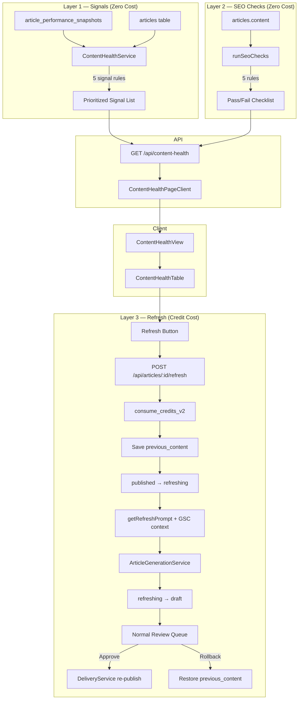

# PRD: Content Health & Refresh (Iterate Step)

**Complexity: 8 → HIGH mode** (10+ files, new service + API + UI, DB schema change, status machine extension, reuses existing generation pipeline)

## Context

**Problem:** AutopilotRank's full workflow pipeline is `Research → Generate → Optimize → Publish → Track → Iterate`. The Track step (GSC performance analytics) is live, but there's no way to close the loop — users can see which articles are underperforming but can't act on it. The Iterate step detects articles needing attention and lets users refresh content via the existing generation pipeline.

**Approach:** Build a 3-layer system — (1) performance-based refresh signals from existing GSC snapshots (zero cost), (2) static SEO checks on article content (zero cost), (3) LLM-powered content refresh reusing the existing generation pipeline (credit cost). New `/dashboard/content-health` view shows a prioritized list. Refresh action reuses `ArticleGenerationService` with a new refresh prompt, and refreshed articles go through the normal review → publish flow.

## Integration Points Checklist

```
How will this feature be reached?
- [x] Entry: /dashboard/content-health (new sidebar item, after Analytics)
- [x] Caller: ContentHealthPageClient → useContentHealth hook → GET /api/content-health
- [x] Refresh trigger: POST /api/articles/:id/refresh (button in ContentHealthTable row)
- [x] Route registration: dashboardRoutes.ts (add new primary route)

Is this user-facing?
- [x] YES → ContentHealthView, ContentHealthTable, signal badges

Full user flow:
1. User navigates to /dashboard/content-health
2. System fetches published articles + latest GSC snapshots + runs signal/SEO checks
3. User sees prioritized table of articles needing attention with signal badges
4. User clicks "Refresh" on an article → credits deducted → content regenerated with performance context
5. Refreshed article appears in normal review queue (draft status)
6. User approves → re-published via existing integrations
7. If unhappy → rollback to previous content
```

## Architecture



**Key Decisions:**
- Reuse `ArticleGenerationService.generateArticle()` — new `refreshArticle()` wrapper method that skips outline generation, uses refresh-specific prompt, skips dedup
- New `refreshing` status — opens `published` as non-terminal, follows established pattern for adding statuses (drop/add constraint)
- `previous_content` column — enables rollback without versioning table complexity (YAGNI)
- Refresh prompt injects: original content, GSC top queries, detected signals → LLM improves, doesn't rewrite from scratch
- Color tokens confirmed: `error` (high), `warning` (medium), `text-muted` (low) for priority badges

**Data Changes:**
- Add columns to `articles`: `previous_content TEXT`, `previous_version INT DEFAULT 1`, `refresh_count INT DEFAULT 0`
- Add `refreshing` to `articles_status_check` constraint
- Add partial index for published articles health queries

---

## Phase 1: Foundation — Types, Migration, Status Machine (5 files)

**Outcome:** DB supports content refresh, TypeScript types compile, status machine allows `published → refreshing`.

**Files:**
- `shared/types/content-health.types.ts` — NEW: `IRefreshSignal`, `ISeoCheck`, `IContentHealthArticle`, `IContentHealthResponse`, enums for signal/priority types
- `shared/types/article.types.ts` — MODIFY: Add `'refreshing'` to `ArticleStatus` union, add `previous_content`, `previous_version`, `refresh_count` to `IArticle`
- `supabase/migrations/20260228000000_add_content_refresh_support.sql` — NEW: Add 3 columns, update status constraint, add partial indexes
- `server/services/article-status-transitions.ts` — MODIFY: `published: ['refreshing']`, add `refreshing: ['draft', 'failed']`
- `shared/validation/content-health.schema.ts` — NEW: Zod schemas for content-health query params and refresh body

**Tests:**
| Test File | Test | Assertion |
|-----------|------|-----------|
| `server/services/__tests__/article-status-transitions.test.ts` | `should allow published → refreshing` | `isValidTransition('published', 'refreshing') === true` |
| `server/services/__tests__/article-status-transitions.test.ts` | `should allow refreshing → draft` | `isValidTransition('refreshing', 'draft') === true` |
| `server/services/__tests__/article-status-transitions.test.ts` | `should allow refreshing → failed` | `isValidTransition('refreshing', 'failed') === true` |

**Checkpoint:** Automated (`prd-work-reviewer`)

---

## Phase 2: Content Health Service (3 files)

**Outcome:** Server can compute refresh signals and SEO checks for published articles.

**Files:**
- `server/services/content-health.service.ts` — NEW: `ContentHealthService` with:
  - `getContentHealth(userId, projectId)` — fetches published articles + latest 2 snapshots, runs signals + SEO checks, returns sorted by priority score
  - `calculateRefreshSignals(article, latestSnapshot, previousSnapshot?)` — pure function, 5 signal rules
  - `runSeoChecks(article)` — pure function, 5 SEO rules on content/title/meta
  - `calculatePriorityScore(signals, seoChecks)` — weighted: HIGH=30, MEDIUM=20, LOW=10, failed SEO=5 each, cap 100
- `server/services/prompts/article-prompts.ts` — MODIFY: Add `getRefreshPrompt()` that takes original content + GSC queries + signals, asks LLM to improve (not rewrite)
- `server/services/__tests__/content-health.service.test.ts` — NEW: Unit tests

**Signal Rules:**
| Signal | Condition | Priority |
|--------|-----------|----------|
| `page_2_limbo` | Position 11-20 AND impressions > 50 | HIGH |
| `low_ctr` | CTR < 2% AND position < 20 | HIGH |
| `declining_position` | Latest position > previous position by 5+ | MEDIUM |
| `high_impressions_no_clicks` | Impressions > 100 AND clicks < 5 | MEDIUM |
| `content_staleness` | Published > 90 days ago AND position > 15 | LOW |

**SEO Check Rules:**
| Check | Condition | Pass when |
|-------|-----------|-----------|
| `title_length` | Title chars | 30-60 chars |
| `meta_description` | Meta desc | Present AND < 160 chars |
| `thin_content` | Word count | >= 800 words |
| `missing_h1` | H1 in content | At least one `# ` heading |
| `no_images` | Images in content | At least one `![` or `<img` |

**Tests:**
| Test File | Test | Assertion |
|-----------|------|-----------|
| `content-health.service.test.ts` | `should detect page_2_limbo signal` | Article at position 15 with 100 impressions → HIGH signal |
| `content-health.service.test.ts` | `should detect low_ctr signal` | CTR 1% at position 8 → HIGH signal |
| `content-health.service.test.ts` | `should detect declining_position` | Position went from 5 to 12 → MEDIUM signal |
| `content-health.service.test.ts` | `should detect thin_content seo check` | 500-word article → failed check |
| `content-health.service.test.ts` | `should calculate priority score correctly` | 2 HIGH signals + 1 failed SEO = 65 |
| `content-health.service.test.ts` | `should exclude healthy articles` | No signals, all checks pass → not in results |

**Checkpoint:** Automated (`prd-work-reviewer`)

---

## Phase 3: API Endpoints — Content Health + Refresh (3 files)

**Outcome:** Working API endpoints for fetching health data and triggering refresh.

**Files:**
- `src/pages/api/content-health/index.ts` — NEW: `GET` handler, validates projectId, calls `contentHealthService.getContentHealth()`, returns `IContentHealthResponse`
- `src/pages/api/articles/[articleId]/refresh.ts` — NEW: `POST` handler following `regenerate.ts` pattern:
  1. Fetch article + campaign (validate ownership, status = `published`)
  2. `consume_credits_v2` atomic deduction
  3. Save `previous_content = content`, increment `previous_version` + `refresh_count`
  4. Conditional UPDATE `WHERE status = 'published'` → `refreshing` (race protection)
  5. If update fails → refund credits, return 409
  6. `fireAndForget` → `articleGenerationService.refreshArticle()`
  7. Return 202
- `server/services/article-generation.service.ts` — MODIFY: Add `refreshArticle(articleId, userId, input, originalContent, topQueries, signals)` method that:
  - Skips outline generation (reuses existing outline from article)
  - Uses `getRefreshPrompt()` instead of `getArticlePrompt()`
  - Skips semantic dedup
  - Runs QA pipeline as normal
  - Sets final status to `draft` (not published)

**Tests:**
| Test File | Test | Assertion |
|-----------|------|-----------|
| `src/pages/api/__tests__/content-health.test.ts` | `should return 401 without auth` | Status 401 |
| `src/pages/api/__tests__/content-health.test.ts` | `should return health data for project` | Status 200, articles array |
| `src/pages/api/articles/__tests__/refresh.test.ts` | `should return 400 for non-published article` | Status 400 |
| `src/pages/api/articles/__tests__/refresh.test.ts` | `should return 402 for insufficient credits` | Status 402 |
| `src/pages/api/articles/__tests__/refresh.test.ts` | `should return 409 on race condition` | Status 409, credits refunded |
| `src/pages/api/articles/__tests__/refresh.test.ts` | `should return 202 and start refresh` | Status 202, article status = refreshing |

**Checkpoint:** Automated (`prd-work-reviewer`)

---

## Phase 4: Client — Hook + View + Route (5 files)

**Outcome:** Content Health visible in dashboard sidebar, shows prioritized articles with signals.

**Files:**
- `client/hooks/useContentHealth.ts` — NEW: React Query hook with `useQuery` for GET + `useMutation` for refresh, cache invalidation on refresh
- `client/components/dashboard/views/ContentHealthView.tsx` — NEW: Main view following `AnalyticsView.tsx` pattern (header + summary cards + table, loading/empty/no-GSC states)
- `client/components/dashboard/views/content-health/ContentHealthTable.tsx` — NEW: Expandable table rows (pattern from `ArticlePerformanceTable.tsx`), signal badges with priority colors (`bg-error/10 text-error` for HIGH, `bg-warning/10 text-warning` for MEDIUM, `bg-surface-light text-muted` for LOW), SEO check pass/fail list, refresh button per row
- `client/components/pages/ContentHealthPageClient.tsx` — NEW: Page wrapper (follows `AnalyticsPageClient.tsx` pattern)
- `client/config/dashboardRoutes.ts` — MODIFY: Add `/dashboard/content-health` route after analytics, icon: `HeartPulse` from lucide-react, group: primary

**Tests:**
| Test File | Test | Assertion |
|-----------|------|-----------|
| `client/hooks/__tests__/useContentHealth.test.ts` | `should fetch content health data` | Hook returns data on success |
| `client/hooks/__tests__/useContentHealth.test.ts` | `should invalidate cache after refresh` | Query refetched after mutation |

**Checkpoint:** Automated + Manual (UI visual verification)

---

## Phase 5: Polish — i18n, Rollback, Astro Page (4 files)

**Outcome:** Full i18n, rollback capability, Astro page wired up.

**Files:**
- `locales/en/dashboard.json` — MODIFY: Add `contentHealth.*` keys (title, subtitle, signals, priorities, refresh button, rollback, empty states)
- `src/pages/api/articles/[articleId]/rollback.ts` — NEW: `POST` handler — only allowed when article is `draft` and has `previous_content`. Swaps content ↔ previous_content, decrements version.
- `src/pages/dashboard/content-health.astro` — NEW: Astro page that renders `ContentHealthPageClient` (follows pattern of other dashboard pages)
- `shared/types/article.types.ts` — MODIFY (if not fully done in Phase 1): Ensure `IArticle` has all new fields

**Edge cases handled:**
- Article with no GSC data (recently published): excluded from health check
- Article currently `refreshing`: show "Refreshing..." badge, disable refresh button
- Article already refreshed (`refresh_count > 0`): show count, still allow re-refresh
- Rollback when `previous_content` is null: return 400

**Tests:**
| Test File | Test | Assertion |
|-----------|------|-----------|
| `src/pages/api/articles/__tests__/rollback.test.ts` | `should rollback to previous content` | Content swapped, status remains draft |
| `src/pages/api/articles/__tests__/rollback.test.ts` | `should return 400 when no previous content` | Status 400 |
| `src/pages/api/articles/__tests__/rollback.test.ts` | `should return 400 when not in draft status` | Status 400 |

**Checkpoint:** Automated + Manual (full flow verification)

---

## Acceptance Criteria

- [ ] All 5 phases complete with passing tests
- [ ] `yarn verify` passes
- [ ] Published articles with GSC data show in Content Health view with correct signals
- [ ] Refresh button deducts credits, regenerates article, lands in review queue as draft
- [ ] Rollback restores previous content
- [ ] Content Health route visible in dashboard sidebar (after Analytics)
- [ ] All DB queries enforce user ownership
- [ ] Works on Cloudflare Workers (no Node.js-specific APIs)
- [ ] Status machine updated: `published → refreshing → draft/failed`

## Files Summary

| # | File | Action |
|---|------|--------|
| 1 | `shared/types/content-health.types.ts` | CREATE |
| 2 | `shared/types/article.types.ts` | MODIFY |
| 3 | `supabase/migrations/20260228000000_add_content_refresh_support.sql` | CREATE |
| 4 | `server/services/article-status-transitions.ts` | MODIFY |
| 5 | `shared/validation/content-health.schema.ts` | CREATE |
| 6 | `server/services/content-health.service.ts` | CREATE |
| 7 | `server/services/prompts/article-prompts.ts` | MODIFY |
| 8 | `server/services/__tests__/content-health.service.test.ts` | CREATE |
| 9 | `src/pages/api/content-health/index.ts` | CREATE |
| 10 | `src/pages/api/articles/[articleId]/refresh.ts` | CREATE |
| 11 | `server/services/article-generation.service.ts` | MODIFY |
| 12 | `client/hooks/useContentHealth.ts` | CREATE |
| 13 | `client/components/dashboard/views/ContentHealthView.tsx` | CREATE |
| 14 | `client/components/dashboard/views/content-health/ContentHealthTable.tsx` | CREATE |
| 15 | `client/components/pages/ContentHealthPageClient.tsx` | CREATE |
| 16 | `client/config/dashboardRoutes.ts` | MODIFY |
| 17 | `locales/en/dashboard.json` | MODIFY |
| 18 | `src/pages/api/articles/[articleId]/rollback.ts` | CREATE |
| 19 | `src/pages/dashboard/content-health.astro` | CREATE |
