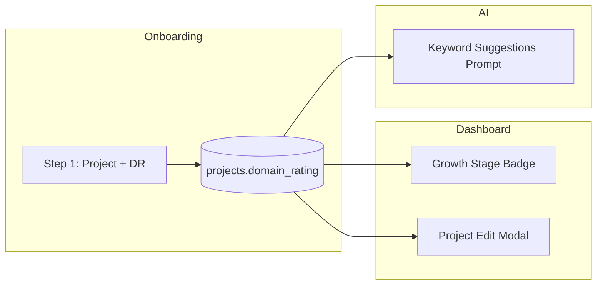
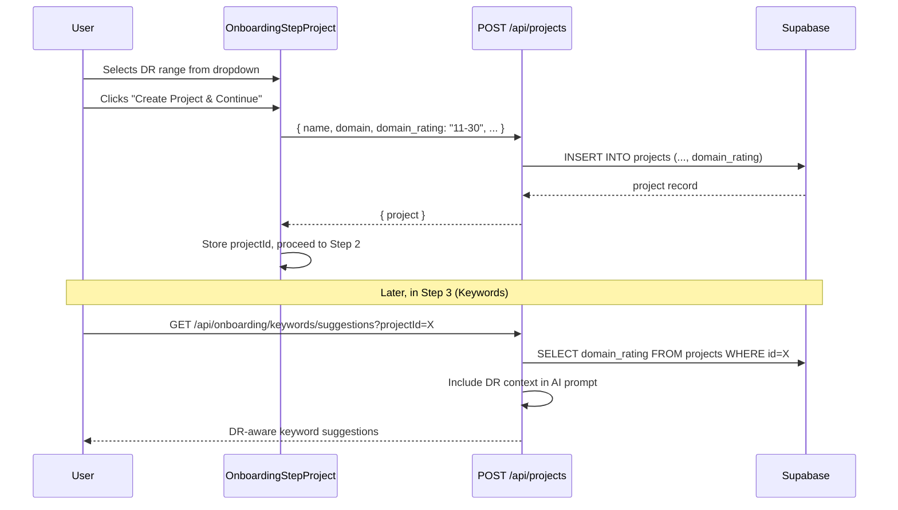

# PRD: Domain Rating (DR) in Onboarding & Growth Stage System

**Complexity: 5 → MEDIUM mode**

| Item           | Detail                                                                          |
| -------------- | ------------------------------------------------------------------------------- |
| Status         | Draft                                                                           |
| Author         | Claude (Principal Architect)                                                    |
| Created        | 2026-02-25                                                                      |
| Last Updated   | 2026-02-25                                                                      |

---

## 1. Context

**Problem:** We have no idea what stage a user's website is at (new site vs established authority), so keyword suggestions, content strategy, and campaign pacing are generic for everyone.

**Files Analyzed:**
- `shared/types/project.types.ts` — `IProject`, `ICreateProjectInput`, `IUpdateProjectInput`
- `shared/validation/project.schema.ts` — `createProjectSchema`, `updateProjectSchema`
- `shared/validation/onboarding.schema.ts` — `enhancedProjectSchema`
- `client/components/onboarding/steps/OnboardingStepProject.tsx` — Step 1 form
- `client/components/projects/ProjectEditModal.tsx` — Project edit form
- `client/components/dashboard/views/OverviewView.tsx` — Dashboard overview
- `client/store/onboardingStore.ts` — Zustand inter-step store
- `src/pages/api/onboarding/keywords/suggestions.ts` — Keyword suggestion AI prompts

**Current Behavior:**
- Onboarding Step 1 collects: name, domain, industry, description, language, country, sitemap_url, blog_url
- No DR / domain authority field exists anywhere in the codebase
- Keyword suggestions use the same prompt regardless of site maturity
- Content strategy recommendations are uniform for all users
- The only DR reference is in the unimplemented `backlink-exchange.md` PRD draft

---

## 2. Solution

**Approach:**
- Add a **required** `domain_rating` field (5-tier dropdown) to the `projects` table and onboarding Step 1
- Map DR ranges to a **Growth Stage** enum: `new` (0-10), `growing` (11-30), `established` (31-50), `strong` (51-70), `authority` (71+)
- Include a "Don't know your DR?" helper link to [Ahrefs Free Website Authority Checker](https://ahrefs.com/website-authority-checker)
- Show a **stage badge with icon** on the dashboard overview, reflecting the user's current growth stage
- Make DR editable in the **Project Edit Modal** so users can update as their site grows
- Wire DR into **keyword suggestion prompts** (Step 3) and define **stage-specific strategy constants** for future content/pacing features

**Architecture Diagram:**



**Key Decisions:**
- Self-reported DR (no API integration needed — zero cost, zero latency)
- Store the **exact range key** (e.g., `'0-10'`, `'11-30'`) not a number — avoids ambiguity about whether it's self-reported vs verified
- Growth stage derived from DR range at runtime (no separate column needed)
- Badge uses distinct icon per stage (Sprout, TrendingUp, Award, Crown, Star)

**Data Changes:**
- New column: `projects.domain_rating TEXT` (migration)
- New Zod field in `createProjectSchema`, `updateProjectSchema`, `enhancedProjectSchema`
- New field in `IProject`, `ICreateProjectInput`, `IUpdateProjectInput`

---

## 3. Sequence Flow



---

## 4. Shared Constants & Types

All DR-related constants and types will live in a single shared file to ensure consistency across onboarding, dashboard, project settings, and AI prompts.

**File: `shared/config/domain-rating.ts`**

```typescript
/**
 * Domain Rating (DR) ranges and growth stage configuration.
 * Single source of truth for DR-related constants used across
 * onboarding, dashboard badges, project settings, and AI prompts.
 */

export const DOMAIN_RATING_RANGES = ['0-10', '11-30', '31-50', '51-70', '71-100'] as const;
export type DomainRatingRange = (typeof DOMAIN_RATING_RANGES)[number];

export interface IGrowthStageConfig {
  range: DomainRatingRange;
  label: string;
  stage: string;
  description: string;
  /** lucide-react icon name */
  icon: string;
  /** Tailwind color class prefix (e.g., 'emerald' → 'text-emerald-400') */
  color: string;
  /** Keyword difficulty guidance for AI prompts */
  keywordDifficulty: string;
  /** Content strategy guidance for AI prompts */
  contentStrategy: string;
  /** Suggested articles per week */
  pacingRange: string;
}

export const GROWTH_STAGES: Record<DomainRatingRange, IGrowthStageConfig> = {
  '0-10': {
    range: '0-10',
    label: 'New Site',
    stage: 'seedling',
    description: 'Just getting started — focus on building topical authority with easy-win keywords',
    icon: 'Sprout',
    color: 'lime',
    keywordDifficulty: 'Target very low competition keywords (KD 0-15). Focus on long-tail, question-based queries with low search volume but high intent.',
    contentStrategy: 'Write comprehensive, long-form guides (1500-2500 words) on niche topics. Build topical clusters. Prioritize informational content to establish E-E-A-T.',
    pacingRange: '2-3 articles/week',
  },
  '11-30': {
    range: '11-30',
    label: 'Growing',
    stage: 'growing',
    description: 'Building momentum — mix easy wins with medium-difficulty targets',
    icon: 'TrendingUp',
    color: 'emerald',
    keywordDifficulty: 'Target low-to-medium competition keywords (KD 5-30). Mix long-tail keywords with some medium-volume terms. Start targeting comparison and "best" keywords.',
    contentStrategy: 'Balance informational and commercial content. Start creating comparison articles and "best of" lists. Aim for 1200-2000 words per article.',
    pacingRange: '3-5 articles/week',
  },
  '31-50': {
    range: '31-50',
    label: 'Established',
    stage: 'established',
    description: 'Solid foundation — compete for medium-difficulty keywords confidently',
    icon: 'Award',
    color: 'blue',
    keywordDifficulty: 'Target medium competition keywords (KD 15-45). Go after product-focused and commercial intent keywords. Challenge competitors on mid-volume terms.',
    contentStrategy: 'Focus on commercial and transactional content. Create detailed product comparisons, reviews, and buying guides. Update and improve existing high-performing content.',
    pacingRange: '4-7 articles/week',
  },
  '51-70': {
    range: '51-70',
    label: 'Strong',
    stage: 'strong',
    description: 'Proven authority — go after competitive keywords and high-volume targets',
    icon: 'Crown',
    color: 'purple',
    keywordDifficulty: 'Target medium-to-high competition keywords (KD 30-60). Compete for industry head terms. Target high-volume commercial keywords aggressively.',
    contentStrategy: 'Prioritize high-value commercial content. Create definitive guides that outrank competitors. Focus on content freshness and comprehensive coverage.',
    pacingRange: '5-10 articles/week',
  },
  '71-100': {
    range: '71-100',
    label: 'Authority',
    stage: 'authority',
    description: 'Industry leader — dominate competitive terms and defend top positions',
    icon: 'Star',
    color: 'amber',
    keywordDifficulty: 'Target high competition keywords (KD 50+). Compete for the most valuable industry terms. Focus on defending and expanding existing rankings.',
    contentStrategy: 'Create industry-defining content. Launch content hubs and pillar pages. Focus on thought leadership and original research to maintain authority.',
    pacingRange: '7-15 articles/week',
  },
};

/** Get growth stage config from a DR range string */
export function getGrowthStage(range: DomainRatingRange): IGrowthStageConfig {
  return GROWTH_STAGES[range];
}

/** Dropdown options for forms */
export const DR_DROPDOWN_OPTIONS = DOMAIN_RATING_RANGES.map(range => ({
  value: range,
  label: `${GROWTH_STAGES[range].label} (DR ${range})`,
}));
```

---

## 5. Integration Points Checklist

```
**How will this feature be reached?**
- [x] Entry point: Onboarding Step 1 form (required dropdown)
- [x] Caller file: OnboardingStepProject.tsx → POST /api/projects
- [x] Registration: domain_rating added to existing project creation/update API schemas

**Is this user-facing?**
- [x] YES → UI components:
  - DR dropdown in OnboardingStepProject.tsx
  - Growth Stage badge in OverviewView.tsx
  - DR field in ProjectEditModal.tsx

**Full user flow:**
1. User opens onboarding → Step 1 shows DR dropdown (required)
2. User selects DR range → helper link available if unsure
3. User submits → project created with domain_rating
4. Step 3: Keyword suggestions use DR to tailor difficulty targeting
5. Dashboard: Growth stage badge with icon shows current stage
6. Project Edit Modal: DR is editable for future updates
```

---

## 6. Execution Phases

### Phase 1: Database & Shared Types — "Project stores DR range"

**Files (4):**
- `supabase/migrations/YYYYMMDDHHMMSS_add_domain_rating.sql` — new column
- `shared/config/domain-rating.ts` — **NEW** constants, types, helper functions
- `shared/types/project.types.ts` — add `domain_rating` to interfaces
- `shared/validation/project.schema.ts` — add field to create/update schemas

**Implementation:**
- [ ] Create migration: `ALTER TABLE projects ADD COLUMN domain_rating TEXT;`
- [ ] Create `shared/config/domain-rating.ts` with all constants (see Section 4)
- [ ] Add `domain_rating: DomainRatingRange | null` to `IProject`
- [ ] Add `domain_rating?: DomainRatingRange` to `ICreateProjectInput` and `IUpdateProjectInput`
- [ ] Add `domain_rating` field to `createProjectSchema` and `updateProjectSchema` (enum of `DOMAIN_RATING_RANGES`)

**Tests Required:**
| Test File | Test Name | Assertion |
|-----------|-----------|-----------|
| `tests/unit/shared/domain-rating.unit.spec.ts` | `should return correct growth stage for each DR range` | All 5 ranges map to expected stage configs |
| `tests/unit/shared/domain-rating.unit.spec.ts` | `should generate correct dropdown options` | `DR_DROPDOWN_OPTIONS` has 5 entries with correct labels |
| `tests/unit/shared/domain-rating.unit.spec.ts` | `createProjectSchema should accept valid domain_rating` | Schema parses `'0-10'` through `'71-100'` |
| `tests/unit/shared/domain-rating.unit.spec.ts` | `createProjectSchema should reject invalid domain_rating` | Schema rejects `'0-100'`, `'abc'`, `999` |

**Verification:**
- `yarn verify` passes
- Migration SQL is syntactically valid

---

### Phase 2: Onboarding Step 1 UI — "User selects DR when creating project"

**Files (3):**
- `shared/validation/onboarding.schema.ts` — add `domain_rating` to `enhancedProjectSchema`
- `client/components/onboarding/steps/OnboardingStepProject.tsx` — add DR dropdown + helper link
- `tests/unit/components/onboarding/OnboardingStepProject.unit.spec.tsx` — update tests

**Implementation:**
- [ ] Add `domain_rating` (required enum) to `enhancedProjectSchema`
- [ ] Add DR dropdown to Step 1 form between Industry and "About Your Website" section
- [ ] Dropdown shows 5 options using `DR_DROPDOWN_OPTIONS` from shared config
- [ ] Include helper text: "Don't know your DR?" with link to `https://ahrefs.com/website-authority-checker` (opens new tab)
- [ ] Pass `domain_rating` through to `createProject()` call in `onSubmit`
- [ ] Field required — form cannot submit without selection

**UI Spec:**
```
┌─────────────────────────────────────────────┐
│  Domain Rating *                            │
│  ┌─────────────────────────────────────┐    │
│  │ ▼ Select your domain rating         │    │
│  └─────────────────────────────────────┘    │
│  Don't know your DR? Check it free here →   │
│  Helps us suggest the right keyword          │
│  difficulty and content strategy for you     │
└─────────────────────────────────────────────┘
```

**Tests Required:**
| Test File | Test Name | Assertion |
|-----------|-----------|-----------|
| `tests/unit/components/onboarding/OnboardingStepProject.unit.spec.tsx` | `should render DR dropdown with 5 options` | Dropdown visible with all 5 range options |
| `tests/unit/components/onboarding/OnboardingStepProject.unit.spec.tsx` | `should show Ahrefs helper link` | Link to ahrefs.com/website-authority-checker present with target=_blank |
| `tests/unit/components/onboarding/OnboardingStepProject.unit.spec.tsx` | `should require DR selection to submit` | Submit disabled/errors when no DR selected |

**User Verification:**
- Action: Open onboarding wizard, fill project name, select DR range, submit
- Expected: Project created with DR value, proceed to Step 2

---

### Phase 3: Keyword Suggestions DR Context — "AI tailors keywords to site maturity"

**Files (1):**
- `src/pages/api/onboarding/keywords/suggestions.ts` — include DR context in prompts

**Implementation:**
- [ ] Add `domain_rating` to the project SELECT query (alongside existing fields)
- [ ] Update `IProjectKeywordContext` interface to include `domain_rating: string | null`
- [ ] Update `buildMetadataSuggestionPrompt()` to include DR context:
  - Import `getGrowthStage` from `shared/config/domain-rating.ts`
  - If `domain_rating` exists, append keyword difficulty and content strategy guidance to prompt
- [ ] Update `buildSuggestionPrompt()` (GSC-based) to include DR context as additional guidance
- [ ] No changes needed to AI response parsing — just prompt enrichment

**Prompt Addition Example:**
```
Website Domain Rating: DR 11-30 (Growing stage)
Keyword Targeting Guidance: Target low-to-medium competition keywords (KD 5-30). Mix long-tail keywords with some medium-volume terms. Start targeting comparison and "best" keywords.
```

**Tests Required:**
| Test File | Test Name | Assertion |
|-----------|-----------|-----------|
| `tests/unit/api/keyword-suggestions.unit.spec.ts` | `should include DR context in metadata prompt when DR is set` | Prompt string contains "Domain Rating" and difficulty guidance |
| `tests/unit/api/keyword-suggestions.unit.spec.ts` | `should work without DR (null) for backward compat` | No error when domain_rating is null |

**Verification:**
- `yarn verify` passes
- Prompt strings contain DR context when DR is provided

---

### Phase 4: Dashboard Badge & Project Edit — "User sees growth stage, can update DR"

**Files (4):**
- `client/components/dashboard/ui/GrowthStageBadge.tsx` — **NEW** badge component
- `client/components/dashboard/views/OverviewView.tsx` — render badge near project info
- `client/components/projects/ProjectEditModal.tsx` — add DR dropdown
- `tests/unit/components/dashboard/GrowthStageBadge.unit.spec.tsx` — **NEW** badge tests

**Implementation:**
- [ ] Create `GrowthStageBadge` component:
  - Takes `domainRating: DomainRatingRange | null` prop
  - If null, shows nothing (backward compat for old projects)
  - Renders: icon (from lucide) + stage label + DR range in a styled chip
  - Each stage has distinct color using Tailwind theme tokens
  - Include link to `https://ahrefs.com/website-authority-checker` (target=_blank) as small "Check DR" link below badge
- [ ] Add badge to `OverviewView.tsx` in the active project section
- [ ] Add DR dropdown to `ProjectEditModal.tsx` (same options as onboarding, but optional — user can keep existing value)
- [ ] Wire `domain_rating` through `handleSubmit` in ProjectEditModal

**Badge Visual Spec:**
```
  🌱 New Site  ·  DR 0-10        (lime accents)
  📈 Growing   ·  DR 11-30       (emerald accents)
  🏆 Established · DR 31-50     (blue accents)
  👑 Strong    ·  DR 51-70       (purple accents)
  ⭐ Authority  · DR 71-100     (amber accents)
```
Note: Use lucide icons (Sprout, TrendingUp, Award, Crown, Star), not emojis.

**Tests Required:**
| Test File | Test Name | Assertion |
|-----------|-----------|-----------|
| `tests/unit/components/dashboard/GrowthStageBadge.unit.spec.ts` | `should render correct label and icon for each DR range` | All 5 ranges render expected label |
| `tests/unit/components/dashboard/GrowthStageBadge.unit.spec.ts` | `should render nothing when DR is null` | Component returns null |
| `tests/unit/components/dashboard/GrowthStageBadge.unit.spec.ts` | `should include free DR checker link` | Ahrefs link present with target=_blank |

**User Verification:**
- Action: View dashboard overview with a project that has DR set
- Expected: Growth stage badge visible with correct icon, label, and color
- Action: Open Project Edit Modal, change DR, save
- Expected: Badge updates to new stage

---

## 7. Acceptance Criteria

- [ ] All 4 phases complete
- [ ] All specified tests pass
- [ ] `yarn verify` passes
- [ ] Migration adds `domain_rating` column to `projects`
- [ ] Onboarding Step 1 requires DR selection (5-tier dropdown)
- [ ] Helper link to Ahrefs free checker present in onboarding and dashboard badge
- [ ] Keyword suggestion prompts include DR context when available
- [ ] Dashboard shows growth stage badge with distinct icon per tier
- [ ] Project Edit Modal allows updating DR
- [ ] Backward compatible: existing projects with null DR work without errors

---

## 8. Out of Scope (Future)

- Auto-fetching DR via Ahrefs/Moz/DataForSEO API (potential Phase 2 enhancement)
- DR-based campaign pacing auto-configuration (constants defined, wiring deferred)
- DR-based content strategy auto-application to article generation prompts (constants defined, wiring deferred)
- DR verification/discrepancy alerts
- DR historical tracking / changelog
