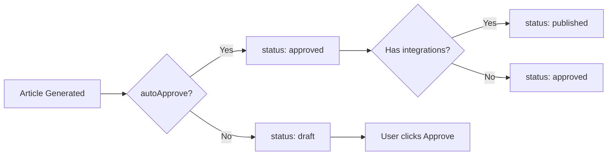
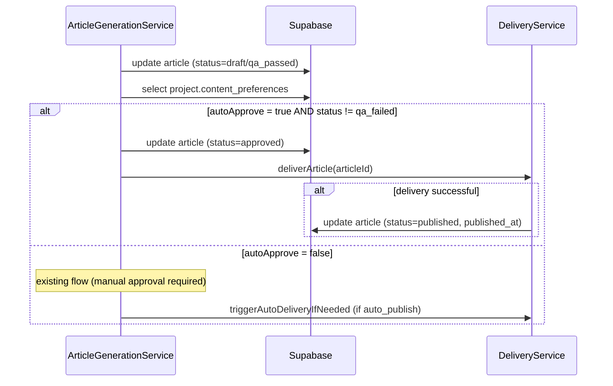

# PRD: Auto-Approve & Publish Articles

**Complexity: 5 → MEDIUM mode**

| Factor | Score |
|--------|-------|
| Touches 6-10 files | +2 |
| Database schema change (JSONB field) | +1 |
| Multi-component UI changes | +1 |
| State logic (status transitions) | +1 |

---

## 1. Context

**Problem:** All articles require manual approval before delivery, forcing users to click "Approve" on every single article. Users with high-volume campaigns (50-100+ articles) need a hands-off workflow where articles are auto-approved and delivered to their CMS immediately.

**Files Analyzed:**
- `shared/types/project.types.ts` — `IContentPreferences` interface
- `server/services/project.service.ts` — Zod schemas for create/update
- `server/services/article-generation.service.ts` — post-generation flow (lines 265-310)
- `server/services/delivery.service.ts` — `shouldAutoDeliver()`, `deliverArticle()`
- `server/services/article-status-transitions.ts` — valid transitions
- `client/components/onboarding/steps/ContentPreferencesSection.tsx` — preferences form
- `client/components/dashboard/views/SettingsView.tsx` — settings page layout
- `src/pages/api/articles/[articleId]/publish-now.ts` — manual publish endpoint
- `locales/en/dashboard.json` — existing i18n keys for auto_publish

**Current Behavior:**
- Articles generate with status `draft` or `qa_passed`
- If campaign has `auto_publish` enabled, articles are delivered to integrations immediately BUT article status stays at `draft`/`qa_passed` (not `approved` or `published`)
- Users must manually click "Approve" in ArticleDetailModal to set status to `approved`
- Status `published` is only set by `scheduled-publishing.service.ts` after delivery
- No project-level approval preference exists

---

## 2. Solution

**Approach:**
- Add `autoApprove` boolean to project `content_preferences` JSONB (no migration needed — JSONB is schemaless)
- After article generation completes with `draft` or `qa_passed`, check the project's `autoApprove` setting
- If enabled: transition article to `approved`, then trigger delivery (reusing existing `triggerAutoDeliveryIfNeeded`)
- After successful delivery, transition to `published` (consistent with scheduled-publishing behavior)
- Add toggle in onboarding wizard (Step 4: Preferences) and in Settings page
- Inform users clearly: "Articles will be automatically approved and published to your connected integrations without manual review"

**Architecture:**



**Key Decisions:**
- Setting lives in `content_preferences` JSONB (no DB migration needed)
- Project-level scope (applies to all campaigns in the project)
- `qa_failed` articles are NEVER auto-approved (always need human review)
- Reuse existing `deliveryService.deliverArticle()` — no new delivery logic
- Default: `false` (opt-in, not opt-out)

**Data Changes:**
- Add `autoApprove?: boolean` to `IContentPreferences` type
- Add `autoApprove` to both Zod schemas in `project.service.ts`
- No SQL migration required (JSONB column already exists)

---

## 3. Sequence Flow



---

## 4. Execution Phases

### Phase 1: Backend — Type, Schema, and Auto-Approve Logic

**User-visible outcome:** Articles are automatically approved and published when project has `autoApprove` enabled.

**Files (4):**
- `shared/types/project.types.ts` — add `autoApprove` to `IContentPreferences`
- `server/services/project.service.ts` — add `autoApprove` to both Zod schemas
- `server/services/article-generation.service.ts` — add auto-approve logic after Step 6 (article save)
- `locales/en/dashboard.json` + `locales/pt-BR/dashboard.json` — i18n keys

**Implementation:**

- [ ] Add `autoApprove?: boolean` to `IContentPreferences` in `project.types.ts`
- [ ] Add `autoApprove: z.boolean().optional()` to both `createProjectSchema` and `updateProjectSchema` `content_preferences` objects in `project.service.ts`
- [ ] In `article-generation.service.ts`, after Step 6 (save article, line ~287), add new Step 6.4:
  ```
  // Step 6.4: Auto-approve if project setting enabled
  if ((finalStatus === 'qa_passed' || finalStatus === 'draft') && input.projectId) {
    const shouldAutoApprove = await this.shouldAutoApprove(input.projectId);
    if (shouldAutoApprove) {
      await supabaseAdmin.from('articles').update({ status: 'approved' }).eq('id', articleId);
      // Trigger delivery and mark as published on success
      const { deliveryService } = await import('@server/services/delivery.service');
      const result = await deliveryService.deliverArticle(articleId);
      if (result.successful > 0) {
        await supabaseAdmin.from('articles').update({
          status: 'published',
          published_at: new Date().toISOString(),
        }).eq('id', articleId);
      }
      return; // Skip the separate triggerAutoDeliveryIfNeeded call
    }
  }
  ```
- [ ] Add `shouldAutoApprove(projectId)` private method that reads `projects.content_preferences` and returns `autoApprove === true`
- [ ] Add i18n keys for `autoApprove`, `autoApproveLabel`, `autoApproveDescription` in both locale files

**Verification Plan:**

1. **Unit Test:**
   - File: `tests/unit/server/services/article-generation.service.unit.spec.ts`
   - Test: `should auto-approve article when project autoApprove is enabled`
   - Test: `should NOT auto-approve qa_failed articles`
   - Test: `should skip auto-approve when setting is disabled/missing`

2. **Evidence Required:**
   - [ ] `yarn verify` passes
   - [ ] Unit tests pass

---

### Phase 2: UI — Onboarding Preferences Toggle

**User-visible outcome:** Users see an "Auto-approve articles" toggle in onboarding Step 4, with clear description of behavior.

**Files (2):**
- `client/components/onboarding/steps/ContentPreferencesSection.tsx` — add toggle
- `client/components/onboarding/steps/OnboardingStepPreferences.tsx` — pass through new field

**Implementation:**

- [ ] Add `autoApprove: z.boolean()` to `contentPreferencesFormSchema` in `ContentPreferencesSection.tsx`
- [ ] Add `autoApprove: false` to `DEFAULT_VALUES`
- [ ] Add toggle UI after "Global Instructions" section:
  - Section header: "Article Approval"
  - Toggle label: "Auto-approve & publish" (with Zap icon from lucide)
  - Description: "Articles are automatically approved and published to your connected integrations without manual review. Disable this to review each article before publishing."
  - Warning text when enabled: "Articles will go live on your website immediately after generation."
- [ ] Wire `autoApprove` into `handleChange` callback so it propagates to parent

**Verification Plan:**

1. **Manual Verification:**
   - [ ] Navigate to onboarding wizard Step 4
   - [ ] Toggle appears below Global Instructions
   - [ ] Toggle defaults to OFF
   - [ ] Toggling ON shows warning text
   - [ ] Value persists through wizard navigation

2. **Evidence Required:**
   - [ ] `yarn verify` passes

---

### Phase 3: UI — Settings Page Content Preferences Section

**User-visible outcome:** Users can change auto-approve setting from Settings page after onboarding.

**Files (3):**
- `client/components/settings/ContentPreferencesSettings.tsx` — NEW component
- `client/components/dashboard/views/SettingsView.tsx` — add new tab/section
- `client/hooks/useProject.ts` or equivalent — may need to check if hook exists for fetching/updating project

**Implementation:**

- [ ] Create `ContentPreferencesSettings.tsx`:
  - Fetch current project's `content_preferences` via `GET /api/projects/:projectId`
  - Reuse `ContentPreferencesSection` component for the preference fields
  - Add save button that calls `PATCH /api/projects/:projectId` with updated `content_preferences`
  - Show success/error toast on save
- [ ] In `SettingsView.tsx`:
  - Add new tab: `{ id: 'content', label: 'Content', icon: <FileText /> }`
  - Render `ContentPreferencesSettings` when `activeTab === 'content'`
- [ ] Wire project selection (user may have multiple projects — use active project from Zustand store or a project selector)

**Verification Plan:**

1. **Manual Verification:**
   - [ ] Settings page shows "Content" tab
   - [ ] Content tab loads current project preferences
   - [ ] Auto-approve toggle reflects current setting
   - [ ] Toggling and saving persists the change
   - [ ] Toast confirmation on save

2. **Evidence Required:**
   - [ ] `yarn verify` passes

---

## 5. Acceptance Criteria

- [ ] All phases complete
- [ ] `yarn verify` passes
- [ ] When `autoApprove` is enabled on a project:
  - Articles transition `draft → approved → published` automatically
  - Delivery to integrations triggers automatically
  - `qa_failed` articles are NOT auto-approved
- [ ] When `autoApprove` is disabled (default):
  - Existing manual approval flow unchanged
- [ ] Toggle available in onboarding wizard (Step 4)
- [ ] Toggle available in Settings page
- [ ] i18n keys added for both locales (en, pt-BR)
