# PRD: Blog Content Pipeline — Weekly SEO Content Strategy

**Complexity: 3 → LOW mode** (+1 touches 1-5 files, +1 content/data changes, +1 blog template adjustments)

**Date:** 2026-02-23
**Status:** Draft
**Priority:** P1 — Blog content drives Tier 4 top-of-funnel traffic and builds topical authority

---

## 1. Context

**Problem:** `docs/PRDs/on-page-seo-strategy.md` Phase 5 plans only 5 blog posts. The user strategy targets 1 post/week minimum on educational Tier 4 keywords. Specific topics requested: "how to automate SEO", "AI content that ranks", "autopilot blog posting guide". A systematic content calendar and templates are needed beyond the initial 5 posts.

**Source:**

- `docs/SEO/keywords/google-ads-keyword-research.md` — Tier 4 educational keyword list
- `docs/SEO/keywords/ahrefs-analysis-2-23-26.md` — Competitor traffic analysis
- `docs/business/business-model-canvas/key-activities.md` — "4-8 blog posts per month" target in growth phase
- `on-page-seo-strategy.md` Phase 5 — First 5 posts already planned (DO NOT duplicate)

**Files Analyzed:**

- `src/pages/blog/[slug].astro` — Blog post template
- `src/pages/blog/index.astro` — Blog listing page
- `server/blog.ts` — Blog data loader
- `content/blog-data.json` — Blog post data (DB-backed)
- `docs/PRDs/on-page-seo-strategy.md` Phase 5 — Existing 5-post plan (weeks 1-5)

**Current Behavior:**

- Blog system fully built (DB-backed, not MDX)
- Blog posts created via admin panel
- Article schema, OG tags, reading time already implemented
- `on-page-seo-strategy.md` Phase 5 covers posts 1-5 (weeks 1-5)
- No content calendar beyond post 5 exists

**This PRD covers:** Posts 6-20 (weeks 6-20), establishing the weekly content cadence and content templates for sustained production.

---

## 2. Solution

**Approach:**

1. Define a 15-post content calendar (weeks 6-20) targeting validated low-KD keywords
2. Create a blog post SEO template checklist (complements the template in `on-page-seo-strategy.md`)
3. Establish content categories and topical clusters for authority building
4. Add 3 specifically requested posts: "how to automate SEO", "AI content that ranks", "autopilot blog posting guide"

**Content Architecture:**

```mermaid
flowchart TD
    subgraph Pillar["Pillar Content (Long-form 2000+ words)"]
        P1["Automated SEO Complete Guide"]
        P2["AI Content That Ranks Guide"]
        P3["SEO Autopilot Complete Guide"]
    end

    subgraph Cluster1["Cluster: SEO Automation"]
        C1["How to Automate SEO Step-by-Step"]
        C2["Best SEO Automation Tools 2026"]
        C3["Free vs Paid SEO Automation"]
        C4["SEO Automation ROI Calculator"]
    end

    subgraph Cluster2["Cluster: AI Content Quality"]
        C5["Can AI Write Blog Posts That Rank"]
        C6["How to Humanize AI Content"]
        C7["AI Detection: What It Means for SEO"]
        C8["AI Content vs Human Content"]
    end

    subgraph Cluster3["Cluster: Publishing & Automation"]
        C9["Auto Publish WordPress Guide"]
        C10["Content Calendar Automation"]
        C11["Scheduled Blog Publishing"]
        C12["CMS Integration Guide"]
    end

    P1 --> C1 & C2 & C3 & C4
    P2 --> C5 & C6 & C7 & C8
    P3 --> C9 & C10 & C11 & C12
```

**Key Decisions:**

- All posts created via admin panel (DB-backed) per existing system
- Each post must follow the SEO template from `on-page-seo-strategy.md` Phase 5
- Internal linking targets: comparison pages, alternative pages, tool pages, use-case pages
- Priority order: highest-volume/lowest-KD keywords first
- No new code needed — this PRD is content-only

**Data Changes:** Blog posts added to DB via admin panel — no schema changes.

---

## 3. Content Calendar (Weeks 6-20)

### Topical Cluster 1: SEO Automation (Core Category)

**Target:** Own the "automated SEO" and "SEO automation" keyword clusters.

#### Post 6: "How to Automate SEO: A Complete Step-by-Step Guide" _(User-requested)_

| Field          | Value                                                                                                                                                                                                                       |
| -------------- | --------------------------------------------------------------------------------------------------------------------------------------------------------------------------------------------------------------------------- |
| Target Keyword | `how to automate SEO`                                                                                                                                                                                                       |
| Volume         | Medium (Tier 4)                                                                                                                                                                                                             |
| KD             | Low                                                                                                                                                                                                                         |
| Content Type   | How-To Guide                                                                                                                                                                                                                |
| Word Count     | 2,000-2,500                                                                                                                                                                                                                 |
| H2s            | "What Tasks Can Be Automated in SEO?", "Step 1: Automate Keyword Research", "Step 2: Automate Content Creation", "Step 3: Automate Publishing", "Step 4: Automate Rank Tracking", "Common SEO Automation Mistakes to Avoid" |
| Internal Links | `/compare/autopilotrank-vs-outrank`, `/features/auto-publishing`, `/tools/blog-keyword-generator`, `/pricing`                                                                                                               |
| CTA            | "Start automating your SEO today → Start Free Trial"                                                                                                                                                                        |

#### Post 7: "Free vs Paid SEO Automation Tools: What's the Difference?"

| Field          | Value                                                                                                                                                                 |
| -------------- | --------------------------------------------------------------------------------------------------------------------------------------------------------------------- |
| Target Keyword | `free SEO automation tools`                                                                                                                                           |
| Volume         | Low                                                                                                                                                                   |
| KD             | Very Low                                                                                                                                                              |
| Content Type   | Comparison                                                                                                                                                            |
| Word Count     | 1,500-2,000                                                                                                                                                           |
| H2s            | "What Free SEO Automation Tools Offer", "Limitations of Free Tools", "When to Upgrade to Paid", "Best Free SEO Tools Available", "Best Paid SEO Automation Platforms" |
| Internal Links | `/tools/keyword-density-checker`, `/tools/meta-description-validator`, `/tools/seo-title-generator`, `/pricing`                                                       |
| CTA            | "Try AutopilotRank free — 3 articles, no credit card"                                                                                                                 |

#### Post 8: "SEO Automation ROI: How to Calculate the Value"

| Field          | Value                                                                                                                                                                              |
| -------------- | ---------------------------------------------------------------------------------------------------------------------------------------------------------------------------------- |
| Target Keyword | `SEO automation ROI`                                                                                                                                                               |
| Volume         | Low                                                                                                                                                                                |
| KD             | Very Low                                                                                                                                                                           |
| Content Type   | Educational                                                                                                                                                                        |
| Word Count     | 1,500-2,000                                                                                                                                                                        |
| H2s            | "The True Cost of Manual SEO Content", "How to Calculate SEO Automation ROI", "Real Examples: Time Savings", "Breaking Down Cost Per Article", "When Does SEO Automation Pay Off?" |
| Internal Links | `/compare/autopilotrank-vs-outrank`, `/use-cases/agency-white-label`, `/pricing`                                                                                                   |
| CTA            | "Calculate your ROI with our free SEO ROI calculator" → links to `/tools/seo-roi-calculator`                                                                                       |

---

### Topical Cluster 2: AI Content Quality (Humanizer Differentiator)

**Target:** Capture searchers concerned about AI content quality and Google penalties.

#### Post 9: "Can AI Write Blog Posts That Rank on Google? (2026 Answer)"

| Field          | Value                                                                                                                                                                                                                                          |
| -------------- | ---------------------------------------------------------------------------------------------------------------------------------------------------------------------------------------------------------------------------------------------- |
| Target Keyword | `can AI write blog posts that rank`                                                                                                                                                                                                            |
| Volume         | Medium                                                                                                                                                                                                                                         |
| KD             | Low                                                                                                                                                                                                                                            |
| Content Type   | Educational / FAQ                                                                                                                                                                                                                              |
| Word Count     | 2,000-2,500                                                                                                                                                                                                                                    |
| H2s            | "The Short Answer: Yes, But...", "What Google Says About AI Content", "The Quality Problem With Generic AI Content", "How Humanized AI Content Ranks", "Best Practices for AI Blog Posts That Rank", "Case Study: Before and After Humanizing" |
| Internal Links | `/features/humanizer`, `/compare/autopilotrank-vs-jasper`, `/alternative/outrank`, `/pricing`                                                                                                                                                  |
| CTA            | "Generate AI blog posts that actually rank → Start Free Trial"                                                                                                                                                                                 |

#### Post 10: "How to Humanize AI Content for SEO (2026 Guide)" _(AI Content That Ranks — user-requested)_

| Field          | Value                                                                                                                                                                                                                                |
| -------------- | ------------------------------------------------------------------------------------------------------------------------------------------------------------------------------------------------------------------------------------ |
| Target Keyword | `humanize AI content`, `AI content that ranks`                                                                                                                                                                                       |
| Volume         | Medium                                                                                                                                                                                                                               |
| KD             | Low                                                                                                                                                                                                                                  |
| Content Type   | How-To Guide                                                                                                                                                                                                                         |
| Word Count     | 2,000-2,500                                                                                                                                                                                                                          |
| H2s            | "Why AI Content Gets Penalized", "Signs of AI Writing to Avoid", "How to Humanize AI Content Step-by-Step", "Tools for Humanizing AI Content", "How AutopilotRank's Humanizer Works", "Testing Your Content With AI Detection Tools" |
| Internal Links | `/features/humanizer`, `/features/content-quality`, `/compare/autopilotrank-vs-outrank`, `/pricing`                                                                                                                                  |
| CTA            | "Use AutopilotRank's built-in humanizer → Start Free Trial"                                                                                                                                                                          |

#### Post 11: "AI Content Detection: What It Means for Your SEO Strategy"

| Field          | Value                                                                                                                                                                     |
| -------------- | ------------------------------------------------------------------------------------------------------------------------------------------------------------------------- |
| Target Keyword | `AI content detection SEO`                                                                                                                                                |
| Volume         | Low                                                                                                                                                                       |
| KD             | Very Low                                                                                                                                                                  |
| Content Type   | Educational                                                                                                                                                               |
| Word Count     | 1,500-2,000                                                                                                                                                               |
| H2s            | "What Is AI Content Detection?", "Does Google Penalize AI Content?", "How AI Detection Tools Work", "Strategies to Pass AI Detection", "The Future of AI Content and SEO" |
| Internal Links | `/features/content-quality`, `/features/humanizer`, `/geo/ai-content-seo`, `/pricing`                                                                                     |
| CTA            | "Generate AI-undetectable content → Start Free Trial"                                                                                                                     |

---

### Topical Cluster 3: Publishing & Automation (CMS Integration)

**Target:** Capture "auto publish WordPress" and scheduling keywords. Directly maps to `/features/auto-publishing`.

#### Post 12: "How to Auto-Publish Blog Posts to WordPress (Complete Guide)" _(User-requested "autopilot blog posting")_

| Field          | Value                                                                                                                                                                                                                                                                            |
| -------------- | -------------------------------------------------------------------------------------------------------------------------------------------------------------------------------------------------------------------------------------------------------------------------------- |
| Target Keyword | `auto publish WordPress`, `automatic blog posting`                                                                                                                                                                                                                               |
| Volume         | Medium                                                                                                                                                                                                                                                                           |
| KD             | Low                                                                                                                                                                                                                                                                              |
| Content Type   | How-To Guide                                                                                                                                                                                                                                                                     |
| Word Count     | 2,000-2,500                                                                                                                                                                                                                                                                      |
| H2s            | "Why Auto-Publishing Matters for SEO", "How to Connect Your WordPress Site", "Setting Up Automated Publishing Schedules", "Drip-Feed vs Batch Publishing: Which Is Better?", "Handling Categories, Tags, and Featured Images Automatically", "Monitoring Auto-Published Content" |
| Internal Links | `/features/auto-publishing`, `/use-cases/wordpress-auto-publish`, `/compare/autopilotrank-vs-outrank`, `/pricing`                                                                                                                                                                |
| CTA            | "Set up auto-publishing to your WordPress site → Start Free Trial"                                                                                                                                                                                                               |

#### Post 13: "Content Calendar Automation: Run Your Blog on Autopilot"

| Field          | Value                                                                                                                                                                                             |
| -------------- | ------------------------------------------------------------------------------------------------------------------------------------------------------------------------------------------------- |
| Target Keyword | `content calendar automation`                                                                                                                                                                     |
| Volume         | Low                                                                                                                                                                                               |
| KD             | Low                                                                                                                                                                                               |
| Content Type   | Guide                                                                                                                                                                                             |
| Word Count     | 1,500-2,000                                                                                                                                                                                       |
| H2s            | "What Is Content Calendar Automation?", "Building Your Automated Content Pipeline", "Setting Publishing Frequency", "How to Never Run Out of Content Ideas", "The 5-Minute Weekly Content Review" |
| Internal Links | `/features/gsc-integration`, `/features/auto-publishing`, `/use-cases/saas-blog-automation`, `/pricing`                                                                                           |
| CTA            | "Automate your content calendar → Start Free Trial"                                                                                                                                               |

---

### Topical Cluster 4: Competitive Comparisons & Alternatives (Conversion)

**Target:** Capture high-intent comparison searches. Works alongside existing pSEO comparison/alternative pages.

#### Post 14: "Outrank.so Review 2026: Is It Worth $99/Month?"

| Field          | Value                                                                                                                                                                                                                                     |
| -------------- | ----------------------------------------------------------------------------------------------------------------------------------------------------------------------------------------------------------------------------------------- |
| Target Keyword | `outrank review`, `outrank.so review`                                                                                                                                                                                                     |
| Volume         | Medium                                                                                                                                                                                                                                    |
| KD             | Low                                                                                                                                                                                                                                       |
| Content Type   | Review                                                                                                                                                                                                                                    |
| Word Count     | 2,000-2,500                                                                                                                                                                                                                               |
| H2s            | "What Is Outrank.so?", "Outrank.so Features Overview", "Outrank.so Content Quality: Honest Assessment", "Outrank.so Pricing: Is It Worth It?", "Outrank.so vs Alternatives", "Should You Use Outrank.so?", "The Best Outrank Alternative" |
| Internal Links | `/compare/autopilotrank-vs-outrank`, `/alternative/outrank`, `/pricing`                                                                                                                                                                   |
| CTA            | "Try a better Outrank alternative → Start Free Trial"                                                                                                                                                                                     |

#### Post 15: "RankYak Review 2026: Honest Pros, Cons & Alternatives"

| Field          | Value                                                                                                                                    |
| -------------- | ---------------------------------------------------------------------------------------------------------------------------------------- |
| Target Keyword | `rankyak review`                                                                                                                         |
| Volume         | Low                                                                                                                                      |
| KD             | Low                                                                                                                                      |
| Content Type   | Review                                                                                                                                   |
| Word Count     | 2,000-2,500                                                                                                                              |
| H2s            | "What Is RankYak?", "RankYak Features", "RankYak Pricing", "RankYak Limitations", "RankYak vs AutopilotRank", "Best RankYak Alternative" |
| Internal Links | `/compare/autopilotrank-vs-rankyak`, `/pricing`                                                                                          |
| CTA            | "Compare AutopilotRank vs RankYak → Start Free Trial"                                                                                    |

---

### Topical Cluster 5: Advanced SEO Automation (Technical Depth)

#### Post 16: "Programmatic SEO: What It Is and How to Scale It With AI"

| Field          | Value                                                                                                                                                                                         |
| -------------- | --------------------------------------------------------------------------------------------------------------------------------------------------------------------------------------------- |
| Target Keyword | `programmatic SEO tool`                                                                                                                                                                       |
| Volume         | Low                                                                                                                                                                                           |
| KD             | Low                                                                                                                                                                                           |
| Content Type   | Pillar Guide                                                                                                                                                                                  |
| Word Count     | 2,500-3,000                                                                                                                                                                                   |
| H2s            | "What Is Programmatic SEO?", "How to Build a pSEO Strategy", "Programmatic SEO Examples", "Tools for Programmatic SEO", "Automating Your pSEO Pipeline", "Measuring Programmatic SEO Success" |
| Internal Links | `/compare` (multiple), `/use-cases/shopify-seo`, `/features/keyword-research`, `/pricing`                                                                                                     |
| CTA            | "Scale your pSEO with AutopilotRank → Start Free Trial"                                                                                                                                       |

#### Post 17: "GSC Integration for SEO: How to Use Data to Drive Content"

| Field          | Value                                                                                                                                                                          |
| -------------- | ------------------------------------------------------------------------------------------------------------------------------------------------------------------------------ |
| Target Keyword | `Google Search Console SEO tips`                                                                                                                                               |
| Volume         | Medium                                                                                                                                                                         |
| KD             | Medium                                                                                                                                                                         |
| Content Type   | How-To Guide                                                                                                                                                                   |
| Word Count     | 2,000-2,500                                                                                                                                                                    |
| H2s            | "Why GSC Data Beats Guessing", "Key GSC Metrics for Content Strategy", "Finding Keyword Gaps With GSC", "How to Use GSC Data to Plan Content", "Automating GSC-Driven Content" |
| Internal Links | `/features/gsc-integration`, `/compare/autopilotrank-vs-surfer-seo`, `/pricing`                                                                                                |
| CTA            | "Connect GSC and auto-generate content from your data → Growth Plan"                                                                                                           |

#### Post 18: "Semantic SEO Automation: Advanced Guide for 2026" _(Complements Post 3 in on-page-seo-strategy)_

_Note: Post 3 in `on-page-seo-strategy.md` targets `semantic SEO automation` at introductory level. This post goes deeper._

| Field          | Value                                                                                                                                                                                                                       |
| -------------- | --------------------------------------------------------------------------------------------------------------------------------------------------------------------------------------------------------------------------- |
| Target Keyword | `semantic SEO tools`                                                                                                                                                                                                        |
| Volume         | Low                                                                                                                                                                                                                         |
| KD             | Low                                                                                                                                                                                                                         |
| Content Type   | Advanced Guide                                                                                                                                                                                                              |
| Word Count     | 2,000-2,500                                                                                                                                                                                                                 |
| H2s            | "What Is Semantic SEO in 2026?", "Entity Optimization vs Keyword Optimization", "How AI Improves Semantic SEO", "Tools for Semantic SEO Automation", "Implementing Semantic SEO at Scale", "Measuring Semantic SEO Success" |
| Internal Links | `/geo/generative-engine-optimization`, `/features/content-quality`, `/pricing`                                                                                                                                              |
| CTA            | "Automate semantic SEO → Start Free Trial"                                                                                                                                                                                  |

---

### Topical Cluster 6: Brand & Conversion Posts

#### Post 19: "AutopilotRank vs. Hiring a Content Agency: Real Cost Comparison"

| Field          | Value                                                                                                                                                                                             |
| -------------- | ------------------------------------------------------------------------------------------------------------------------------------------------------------------------------------------------- |
| Target Keyword | `AI content vs content agency`                                                                                                                                                                    |
| Volume         | Low                                                                                                                                                                                               |
| KD             | Very Low                                                                                                                                                                                          |
| Content Type   | Comparison                                                                                                                                                                                        |
| Word Count     | 1,500-2,000                                                                                                                                                                                       |
| H2s            | "What Agencies Charge for Content", "The True Cost of Human Writers", "What You Get With AutopilotRank", "Quality Comparison: AI vs Human", "When to Use AI vs When to Hire", "Making the Switch" |
| Internal Links | `/pricing`, `/compare/autopilotrank-vs-jasper`, `/use-cases/agency-white-label`                                                                                                                   |
| CTA            | "Replace your agency with AutopilotRank → Start Free Trial"                                                                                                                                       |

#### Post 20: "SEO Content Automation: The Complete 2026 Buyer's Guide"

| Field          | Value                                                                                                                                                                                      |
| -------------- | ------------------------------------------------------------------------------------------------------------------------------------------------------------------------------------------ |
| Target Keyword | `SEO content automation`                                                                                                                                                                   |
| Volume         | Medium                                                                                                                                                                                     |
| KD             | Medium                                                                                                                                                                                     |
| Content Type   | Buyer's Guide                                                                                                                                                                              |
| Word Count     | 3,000+                                                                                                                                                                                     |
| H2s            | "What to Look for in SEO Content Automation", "Feature Checklist for Buyers", "Pricing Models Compared", "Top SEO Content Automation Platforms Ranked", "Our Verdict: Best for [Use Case]" |
| Internal Links | Multiple comparison pages, `/pricing`, `/use-cases` (multiple)                                                                                                                             |
| CTA            | "Try the best-value SEO content automation → Start Free Trial"                                                                                                                             |

---

## 4. Blog Post SEO Checklist (Template)

Every post in this pipeline MUST follow these requirements before publishing:

### Title & Meta

- [ ] Title tag: `{Post Title} | AutopilotRank Blog` — max 70 chars total
- [ ] Target keyword appears in first 40 characters of title
- [ ] Meta description: 150-160 chars, keyword in first 50 chars, ends with CTA
- [ ] H1 matches (or closely mirrors) the title tag

### Content Structure

- [ ] Min 3 H2 sections, each targeting a secondary keyword or related question
- [ ] Target word count achieved (see per-post spec)
- [ ] At least 1 H3 under each H2 for content hierarchy
- [ ] No heading level skipped (H1 → H2 → H3, not H1 → H3)

### Internal Links

- [ ] Min 2 links to pSEO pages (comparisons, alternatives, use-cases, or tools)
- [ ] Min 1 link to a feature page (`/features/[slug]`)
- [ ] 1 link to pricing or signup
- [ ] No orphaned post — must be linked from at least 1 other blog post

### SEO & Schema

- [ ] Article JSON-LD schema with `published_time`, `modified_time`
- [ ] OG tags: `article:published_time`, `article:section`, `article:tag`
- [ ] All images have descriptive alt text containing relevant keywords
- [ ] Canonical URL is self-referencing

### CTA

- [ ] Mid-article CTA (text link or button) targeting the primary action
- [ ] End-of-article CTA block with "Start Free Trial" link to `/pricing`

---

## 5. Publishing Schedule

| Week | Post # | Title                                              | Target Keyword                      |
| ---- | ------ | -------------------------------------------------- | ----------------------------------- |
| 1-5  | 1-5    | _(Covered in on-page-seo-strategy.md Phase 5)_     | Various                             |
| 6    | 6      | How to Automate SEO: Complete Step-by-Step Guide   | `how to automate SEO`               |
| 7    | 7      | Free vs Paid SEO Automation Tools                  | `free SEO automation tools`         |
| 8    | 8      | SEO Automation ROI                                 | `SEO automation ROI`                |
| 9    | 9      | Can AI Write Blog Posts That Rank?                 | `can AI write blog posts that rank` |
| 10   | 10     | How to Humanize AI Content (AI Content That Ranks) | `humanize AI content`               |
| 11   | 11     | AI Content Detection & SEO                         | `AI content detection SEO`          |
| 12   | 12     | Auto-Publish Blog Posts to WordPress               | `auto publish WordPress`            |
| 13   | 13     | Content Calendar Automation                        | `content calendar automation`       |
| 14   | 14     | Outrank.so Review 2026                             | `outrank review`                    |
| 15   | 15     | RankYak Review 2026                                | `rankyak review`                    |
| 16   | 16     | Programmatic SEO With AI                           | `programmatic SEO tool`             |
| 17   | 17     | GSC Integration for Content Strategy               | `Google Search Console SEO tips`    |
| 18   | 18     | Semantic SEO Automation Advanced Guide             | `semantic SEO tools`                |
| 19   | 19     | AutopilotRank vs Content Agency                    | `AI content vs content agency`      |
| 20   | 20     | SEO Content Automation Buyer's Guide 2026          | `SEO content automation`            |

---

## 6. Execution Phases

### Phase 1: Blog Template Verification

**User-visible outcome:** Blog post template in `blog/[slug].astro` correctly handles all required OG meta tags.

**Files (max 5):**

- `src/pages/blog/[slug].astro` — Verify `article:published_time`, `article:section`, `article:tag` OG tags

_(Note: This may already be done in on-page-seo-strategy.md Phase 4. Skip if already complete.)_

**Implementation:**

- [ ] Confirm `article:published_time` OG tag is present using post's `date` field
- [ ] Confirm `article:section` uses post's `category` field
- [ ] Confirm `article:tag` includes post tags joined by comma

**Tests Required:**
| Test File | Test Name | Assertion |
|-----------|-----------|-----------|
| Build verification | `yarn build` | Blog post pages render with OG tags |

---

### Phase 2: Content Creation (Posts 6-20)

**User-visible outcome:** Posts 6-20 published via admin panel, each following the SEO checklist.

**Files:** No code files — content created via admin panel (DB-backed blog).

**Implementation:**

For each post in weeks 6-20:

- [ ] Create post via admin panel with correct title, slug, meta description, content
- [ ] Follow H2 structure from Section 3 calendar
- [ ] Add all specified internal links
- [ ] Verify article JSON-LD schema renders in page source
- [ ] Verify word count meets target
- [ ] Run SEO checklist before publishing
- [ ] After publishing: add link from a related existing post to the new post

**Publishing cadence:** 1 post per week, published on Tuesday (based on industry data showing Tue/Wed posts get most engagement).

**Tests Required:**
| Test | Assertion |
|------|-----------|
| Manual per post | Post appears at correct URL |
| Manual per post | Source contains `article:published_time` OG tag |
| Manual per post | Source contains Article JSON-LD |
| Manual per post | At least 2 internal links to pSEO pages |
| Manual per post | Word count matches target range |

---

## 7. Acceptance Criteria

- [ ] Blog post template has correct OG tags (`article:published_time`, `article:section`, `article:tag`)
- [ ] Posts 6-20 published with unique target keywords per post
- [ ] Each post follows the SEO checklist (title ≤70 chars, description 150-160 chars, 2+ internal links)
- [ ] The 3 user-requested topics covered: "how to automate SEO" (Post 6), "AI content that ranks" (Post 10), "autopilot blog posting guide" (Post 12)
- [ ] All posts appear in `sitemap-blog.xml` (auto-generated)
- [ ] Each published post links to at least 1 other blog post (no orphaned posts)
- [ ] `yarn build` succeeds after template verification
