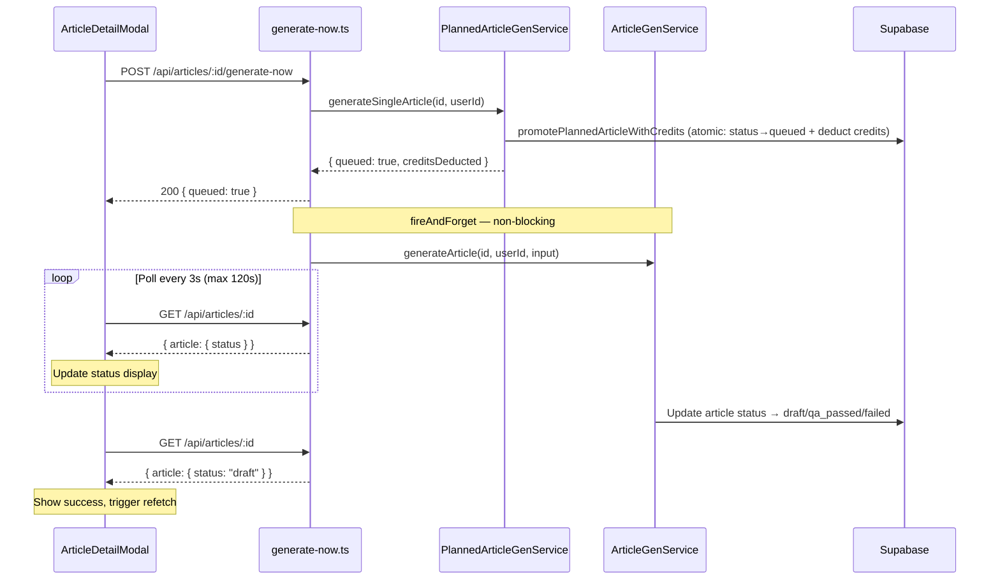

# PRD: Calendar Article Generation Bugfixes

**Complexity: 4 → MEDIUM mode**

| Score breakdown           | Points |
| ------------------------- | ------ |
| Touches 5 files           | +1     |
| Complex async/state logic | +2     |
| Database query fixes      | +1     |

---

## 1. Context

**Problem:** Manual "Generate Now" from the calendar view hangs on "Queuing..." for ~54 seconds, then auto-delivery and email notification both crash due to nonexistent DB columns.

**Files Analyzed:**

- `server/services/delivery.service.ts` — selects `articles.featured_image_url` (doesn't exist)
- `server/services/article-generation.service.ts` — selects `profiles.email` and `profiles.display_name` (don't exist)
- `client/components/dashboard/views/calendar/ArticleDetailModal.tsx` — no status polling, blocks on full generation
- `src/pages/api/articles/[articleId]/generate-now.ts` — awaits full generation synchronously
- `server/services/planned-article-generation.service.ts` — `generateSingleArticle` awaits full pipeline
- `client/hooks/useCalendarArticles.ts` — manual `refetch()` only, no auto-polling
- `src/pages/api/articles/[articleId]/index.ts` — existing GET endpoint returns article with status (can be polled)

**Current Behavior:**

1. User clicks "Generate Now" → POST to `/api/articles/:articleId/generate-now`
2. `generateSingleArticle()` promotes article (fast) then **awaits** full `generateArticle()` (~54s)
3. HTTP response blocks for ~54s → UI shows "Queuing..." the entire time
4. After generation: delivery fails with `column articles.featured_image_url does not exist`
5. Email notification fails with `column profiles.email does not exist`

---

## 2. Solution

**Approach:**

1. **Bug #1 — `featured_image_url`:** Remove nonexistent column from the delivery service query. Images are already fetched via the `article_images(...)` relation.
2. **Bug #2 — `profiles.email`:** Replace the profiles query with `supabaseAdmin.auth.admin.getUserById()` to get email from `auth.users` (same pattern used by `admin-users.service.ts`).
3. **Bug #3 — UX hang:** Refactor `generateSingleArticle` to separate the synchronous credit deduction/status promotion from the async generation. Use `fireAndForget` in the API route so the POST returns immediately. Update the modal to poll the existing `GET /api/articles/:articleId` endpoint for status transitions.

**Key Decisions:**

- Reuse existing `GET /api/articles/:articleId` for status polling — no new endpoint needed
- Use `fireAndForget` pattern already established in the codebase
- Poll interval: 3s (generation takes ~54s, so ~18 polls max)
- Timeout: 120s (safety net, covers retries)
- Show real-time status in the modal (Queued → Generating → Done/Failed)

**Data Changes:** None — only fixing queries to use existing columns/APIs correctly.

### Integration Points Checklist

```
How will this feature be reached?
- [x] Entry point: "Generate Now" button in ArticleDetailModal
- [x] Caller: POST /api/articles/:articleId/generate-now → PlannedArticleGenerationService
- [x] No new registration needed — fixing existing flow

Is this user-facing?
- [x] YES → ArticleDetailModal needs updated status display during generation

Full user flow:
1. User clicks "Generate Now" in calendar article detail modal
2. POST /api/articles/:articleId/generate-now returns immediately (~200ms)
3. Modal shows live status polling (Queued → Generating → Draft/QA Passed/Failed)
4. On success: modal shows success state, parent refetches calendar
5. On failure: modal shows error message
```

### Sequence Flow



---

## 3. Execution Phases

### Phase 1: Fix DB column errors (delivery + email notification)

**User-visible outcome:** Auto-delivery and email notification no longer crash after article generation.

**Files (3):**

- `server/services/delivery.service.ts` — remove `featured_image_url` from SELECT
- `server/services/article-generation.service.ts` — replace profiles query with auth admin API

**Implementation:**

- [ ] In `delivery.service.ts` line 71: remove `featured_image_url` from the `.select()` string
- [ ] In `article-generation.service.ts` lines 317-341: replace the `profiles` query with `supabaseAdmin.auth.admin.getUserById(userId)` to fetch email
- [ ] Use `authUser.user.email` for the email parameter
- [ ] Use `authUser.user.user_metadata?.full_name` or fallback to `'there'` for userName

**Tests Required:**

| Test File | Test Name | Assertion |
|-----------|-----------|-----------|
| Manual / existing tests | delivery.service query doesn't crash | No `42703` error in logs |
| Manual / existing tests | email notification resolves user email | Email sent or graceful skip |

**Verification Plan:**

1. `yarn verify` passes (TypeScript + ESLint)
2. Run dev server, trigger article generation on a campaign with auto-delivery enabled → no `column does not exist` errors in logs

---

### Phase 2: Make generate-now non-blocking + add status polling UI

**User-visible outcome:** "Generate Now" returns instantly, modal shows live generation progress.

**Files (3):**

- `server/services/planned-article-generation.service.ts` — extract `promoteAndQueue` method that returns immediately
- `src/pages/api/articles/[articleId]/generate-now.ts` — call promote, then `fireAndForget` generation
- `client/components/dashboard/views/calendar/ArticleDetailModal.tsx` — add status polling after POST

**Implementation:**

- [ ] In `planned-article-generation.service.ts`: extract a `promoteArticle(articleId, userId)` method that does ONLY the credit deduction + status promotion (lines 180-212) and returns `{ creditsDeducted, article }`. Keep `generateSingleArticle` for cron use (awaits full pipeline).
- [ ] In `generate-now.ts`: call `promoteArticle()` for the immediate response, then `fireAndForget` the actual generation call to `articleGenerationService.generateArticle()`
- [ ] In `ArticleDetailModal.tsx`:
  - After POST succeeds, do NOT close the modal
  - Show a generation status indicator (Queued → Generating → Done/Failed)
  - Poll `GET /api/articles/:articleId` every 3 seconds
  - Use article `status` field to determine current phase
  - On terminal status (`draft`, `qa_passed`, `qa_failed`, `failed`, `failed_quality`): stop polling, show result, call `onSuccess()` to refetch calendar
  - On success statuses: show success message, auto-close after 2s
  - On failure statuses: show error message with option to close
  - Safety timeout: 120s → stop polling, show timeout message

**Terminal statuses (stop polling):**
- Success: `draft`, `qa_passed`, `reviewed`, `approved`
- Failure: `failed`, `failed_quality`, `qa_failed`

**Tests Required:**

| Test File | Test Name | Assertion |
|-----------|-----------|-----------|
| Manual | Generate Now returns immediately | POST response in <1s |
| Manual | Modal shows live status transitions | Status updates visible |
| Manual | Modal auto-closes on success | Closes after draft/qa_passed |

**Verification Plan:**

1. `yarn verify` passes
2. Manual: Click "Generate Now" → POST returns instantly → modal shows "Queued..." → "Generating..." → "Done!" → auto-close
3. Calendar view refreshes with updated article status

---

## 4. Acceptance Criteria

- [ ] All phases complete
- [ ] `yarn verify` passes
- [ ] No `column does not exist` errors in logs during article generation
- [ ] Auto-delivery works after generation (no crash)
- [ ] Email notification resolves email from auth.users (no crash)
- [ ] "Generate Now" POST returns in <1 second
- [ ] Modal shows real-time status transitions during generation
- [ ] Modal handles success and failure terminal states gracefully
- [ ] Calendar view refreshes after generation completes
