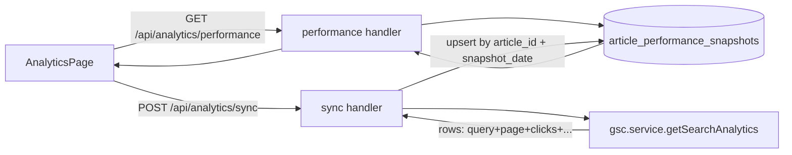
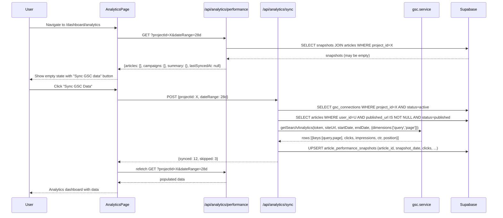

# PRD: Content Performance Analytics

> **Status:** Done
> **Priority:** P0 — closes the full-workflow loop (Track step)
> **Created:** 2026-02-27
> **Complexity:** 9 → HIGH mode (mandatory checkpoints every phase)

---

## Complexity Assessment

```
+3  Touches 10+ files
+2  New system/module from scratch (analytics data layer + UI)
+2  Complex state logic (time-range filtering, per-article aggregation)
+1  Database schema changes (article_performance_metrics table)
+1  External API integration (GSC searchAnalytics - existing service, new usage)
= 9 → HIGH
```

---

## Integration Points Checklist

```
How will this feature be reached?
- [x] Entry point: /dashboard/analytics (existing route, currently disabled)
- [x] Caller file: dashboardRoutes.ts (toggle enabled: true)
- [x] Registration/wiring: enable route + replace 13-line stub

Is this user-facing? YES
- [x] AnalyticsPageClient.tsx — full replacement
- [x] AnalyticsView.tsx — main view component
- [x] ArticlePerformanceTable.tsx — per-article metrics table
- [x] CampaignPerformanceCard.tsx — campaign aggregate
- [x] PerformanceSummaryBar.tsx — top-level totals
- [x] useAnalytics.ts — React Query hook

Full user flow:
1. User publishes an article → article.published_url is set
2. User navigates to /dashboard/analytics
3. Page calls GET /api/analytics/performance?projectId=X&dateRange=28d
4. API fetches active GSC connection for project, calls getSearchAnalytics() filtered to known published_url values
5. Results persisted to article_performance_snapshots table (for caching + history)
6. UI displays per-article table + campaign aggregates + summary bar
7. User can click an article row to see keyword breakdown
```

---

## 1. Context

**Problem:** AutopilotRank generates and publishes articles but has zero visibility into how those articles perform in search. The "Track" step of the full-workflow pipeline is entirely missing, undermining the core value proposition.

**Files Analyzed:**

- `server/services/gsc.service.ts` — GSC OAuth + `getSearchAnalytics()` fully built
- `supabase/migrations/20260205100200_create_articles_table.sql` — `articles.published_url TEXT` already exists
- `supabase/migrations/20260211000500_create_opportunities.sql` — `opportunity_performance_checks` table exists (article_id FK, before/after metrics)
- `supabase/migrations/20260211000300_create_gsc_connections.sql` — `gsc_connections` table
- `client/components/pages/AnalyticsPageClient.tsx` — 13-line placeholder stub
- `client/config/dashboardRoutes.ts:188-195` — analytics route, `enabled: false`
- `client/hooks/useGscConnection.ts` — GSC hook pattern to follow
- `client/hooks/useOpportunities.ts` — hook pattern reference
- `src/pages/api/analytics/event/index.ts` — existing analytics event route (Amplitude; unrelated)

**Current Behavior:**

- `/dashboard/analytics` is disabled and shows "Analytics Module / Connecting to Google Search Console..."
- No API endpoints exist for article performance data
- `articles.published_url` is stored but never queried for performance
- GSC `getSearchAnalytics()` is only used by the Opportunities feature (opportunity analysis), not for post-publish tracking

---

## 2. Solution

**Approach:**

1. Add a new `article_performance_snapshots` table to store GSC metrics per article per sync
2. Build a server-side sync endpoint that, on demand, fetches GSC search analytics filtered to the project's published article URLs
3. Build a `/api/analytics/performance` GET endpoint that returns aggregated + per-article data
4. Build the full UI: summary bar → campaign aggregate cards → per-article table with keyword drill-down
5. Enable the `/dashboard/analytics` route

**Architecture Diagram:**



**Key Decisions:**

- **On-demand sync, not cron** — user clicks "Refresh" to pull latest GSC data; avoids background workers hitting Cloudflare 10ms CPU limit; aligns with existing Opportunities pattern
- **Snapshot table** — store GSC results per-article per sync date so we have history; upsert by `(article_id, snapshot_date)` to avoid duplicates
- **URL matching** — join `articles.published_url` with GSC `page` dimension key; only articles with `published_url` set AND `status='published'` are eligible
- **Date range** — default last 28 days; user can select 7d / 28d / 90d
- **No new GSC connection needed** — reuse existing project's `gsc_connections` record; if not connected, show the same "connect GSC" empty state as Opportunities
- **Campaign aggregates** — computed on the fly from article-level snapshots in the API response (no separate table needed)

**Data Changes:** New table `article_performance_snapshots` (see Phase 1)

---

## 3. Sequence Flow



---

## 4. Execution Phases

### Phase 1: Database Schema — New snapshot table

**Files (2):**

- `supabase/migrations/YYYYMMDDHHMMSS_create_article_performance_snapshots.sql` — new table
- `docs/PRDs/content-performance-analytics.md` — update status to in-progress

**Implementation:**

- [ ] Create migration file with timestamp prefix `20260227120000`
- [ ] Table: `article_performance_snapshots`
  ```sql
  id UUID PRIMARY KEY DEFAULT gen_random_uuid(),
  article_id UUID NOT NULL REFERENCES public.articles(id) ON DELETE CASCADE,
  user_id UUID NOT NULL REFERENCES public.profiles(id) ON DELETE CASCADE,
  snapshot_date DATE NOT NULL,  -- the date we pulled this data (NOT the GSC data date range start)
  date_range_days INTEGER NOT NULL DEFAULT 28,  -- the window queried (7, 28, 90)
  clicks INTEGER NOT NULL DEFAULT 0,
  impressions INTEGER NOT NULL DEFAULT 0,
  ctr NUMERIC(6,4) NOT NULL DEFAULT 0,     -- e.g. 0.1234 = 12.34%
  avg_position NUMERIC(6,2) NOT NULL DEFAULT 0,
  top_queries JSONB,  -- [{query: string, clicks: int, impressions: int, position: number}]
  created_at TIMESTAMPTZ NOT NULL DEFAULT NOW(),
  updated_at TIMESTAMPTZ NOT NULL DEFAULT NOW(),
  UNIQUE(article_id, snapshot_date, date_range_days)
  ```
- [ ] Enable RLS: user can view/insert own snapshots; service role full access
- [ ] Index: `(user_id, snapshot_date DESC)`, `(article_id, snapshot_date DESC)`
- [ ] Trigger: `handle_updated_at`

**Tests Required:**
| Test File | Test Name | Assertion |
|-----------|-----------|-----------|
| Manual migration test | migration applies cleanly | `supabase db push` exits 0 |
| Manual migration test | RLS blocks cross-user access | SELECT from other user_id returns 0 rows |

**User Verification:**

- Action: Run `npx supabase db push` locally
- Expected: Migration applies without errors; table visible in Supabase Studio

---

### Phase 2: API — Sync endpoint (POST /api/analytics/sync)

**Files (3):**

- `src/pages/api/analytics/sync/index.ts` — new route handler
- `server/services/analytics-performance.service.ts` — sync logic
- `shared/types/analytics.types.ts` — shared types

**Implementation:**

`shared/types/analytics.types.ts`:

```typescript
export interface IArticlePerformanceSnapshot {
  id: string;
  article_id: string;
  snapshot_date: string; // ISO date
  date_range_days: number;
  clicks: number;
  impressions: number;
  ctr: number;
  avg_position: number;
  top_queries: ITopQuery[];
  created_at: string;
}

export interface ITopQuery {
  query: string;
  clicks: number;
  impressions: number;
  position: number;
}

export interface IAnalyticsSyncRequest {
  projectId: string;
  dateRangeDays?: 7 | 28 | 90;
}

export interface IAnalyticsSyncResponse {
  synced: number;
  skipped: number;
  reason?: string;
}
```

`server/services/analytics-performance.service.ts`:

```typescript
// Key methods:
// syncPerformanceData(userId, projectId, dateRangeDays) → IAnalyticsSyncResponse
//   1. Load active gsc_connection for project (verify user_id ownership)
//   2. Get valid access token via gscService.getValidAccessToken()
//   3. Load all published articles with published_url set for this user
//   4. Call gscService.getSearchAnalytics(token, siteUrl, startDate, endDate, {dimensions: ['query', 'page'], rowLimit: 5000})
//   5. Group GSC rows by page (URL)
//   6. Match page URLs to articles.published_url (normalize trailing slash)
//   7. For each matched article: aggregate clicks/impressions/CTR/avgPosition, collect top 10 queries
//   8. Upsert into article_performance_snapshots
//   9. Return { synced: N, skipped: M }
```

`src/pages/api/analytics/sync/index.ts`:

```typescript
// POST /api/analytics/sync
// Body: { projectId: string, dateRangeDays?: 7 | 28 | 90 }
// Uses withAuthAndBody(schema, handler)
// Returns: { success: true, data: IAnalyticsSyncResponse }
// Errors:
//   400 — invalid body
//   404 — no active GSC connection
//   403 — project not owned by user
//   500 — GSC API failure
```

- [ ] Add `POST /api/analytics/sync` to `PUBLIC_API_ROUTES`? → No, it's protected (auth required)
- [ ] Validate dateRangeDays is one of [7, 28, 90], default 28
- [ ] Normalize URLs for matching: strip trailing slash, lowercase
- [ ] Limit `top_queries` to top 10 by clicks desc

**Tests Required:**
| Test File | Test Name | Assertion |
|-----------|-----------|-----------|
| `tests/api/analytics.api.spec.ts` | `should return 401 when not authenticated` | status 401 |
| `tests/api/analytics.api.spec.ts` | `should return 404 when no GSC connection` | status 404 |
| `tests/api/analytics.api.spec.ts` | `should sync and return synced count` | `body.data.synced >= 0` |
| `tests/api/analytics.api.spec.ts` | `should return 400 for invalid dateRangeDays` | status 400 |

**User Verification:**

```bash
# Test sync endpoint (requires active GSC connection)
curl -X POST http://localhost:3000/api/analytics/sync \
  -H "Authorization: Bearer $TOKEN" \
  -H "Content-Type: application/json" \
  -d '{"projectId": "YOUR_PROJECT_ID", "dateRangeDays": 28}' | jq .
# Expected: {"success": true, "data": {"synced": N, "skipped": M}}
```

---

### Phase 3: API — Performance data endpoint (GET /api/analytics/performance)

**Files (2):**

- `src/pages/api/analytics/performance/index.ts` — new route handler
- `server/services/analytics-performance.service.ts` — add read methods (extend Phase 2 file)

**Implementation:**

Add to `analytics-performance.service.ts`:

```typescript
// getPerformanceData(userId, projectId, dateRangeDays) → IAnalyticsData
//   1. Load most recent snapshots per article (latest snapshot_date for given date_range_days)
//   2. Load article metadata (title, primary_keyword, campaign_id, published_url, published_at)
//   3. Join + build per-article rows
//   4. Group by campaign_id → campaign aggregates
//   5. Compute summary totals
//   6. Return { articles, campaigns, summary, lastSyncedAt }
```

Response shape (add to `shared/types/analytics.types.ts`):

```typescript
export interface IArticlePerformanceRow {
  article_id: string;
  title: string | null;
  primary_keyword: string;
  published_url: string;
  published_at: string | null;
  campaign_id: string;
  campaign_name: string;
  clicks: number;
  impressions: number;
  ctr: number;
  avg_position: number;
  top_queries: ITopQuery[];
  snapshot_date: string;
}

export interface ICampaignPerformanceRow {
  campaign_id: string;
  campaign_name: string;
  article_count: number;
  total_clicks: number;
  total_impressions: number;
  avg_ctr: number;
  avg_position: number;
}

export interface IPerformanceSummary {
  total_clicks: number;
  total_impressions: number;
  avg_ctr: number;
  avg_position: number;
  articles_tracked: number;
  articles_published: number; // total published articles with published_url set
}

export interface IAnalyticsData {
  articles: IArticlePerformanceRow[];
  campaigns: ICampaignPerformanceRow[];
  summary: IPerformanceSummary;
  lastSyncedAt: string | null;
  hasGscConnection: boolean;
  dateRangeDays: number;
}
```

`src/pages/api/analytics/performance/index.ts`:

```typescript
// GET /api/analytics/performance?projectId=X&dateRangeDays=28
// Uses withAuth(handler)
// Returns: { success: true, data: IAnalyticsData }
```

**Tests Required:**
| Test File | Test Name | Assertion |
|-----------|-----------|-----------|
| `tests/api/analytics.api.spec.ts` | `should return 401 when not authenticated` | status 401 |
| `tests/api/analytics.api.spec.ts` | `should return empty data when no snapshots exist` | `body.data.articles` is `[]` |
| `tests/api/analytics.api.spec.ts` | `should return data after sync` | `body.data.summary.articles_tracked >= 0` |

**User Verification:**

```bash
curl "http://localhost:3000/api/analytics/performance?projectId=YOUR_ID&dateRangeDays=28" \
  -H "Authorization: Bearer $TOKEN" | jq .
# Expected: {"success":true,"data":{"articles":[...],"campaigns":[...],"summary":{...},"lastSyncedAt":"..."}}
```

---

### Phase 4: UI — AnalyticsPageClient full replacement

**Files (5):**

- `client/components/pages/AnalyticsPageClient.tsx` — full replacement (orchestrator, ~120 lines)
- `client/hooks/useAnalytics.ts` — new React Query hook
- `client/components/dashboard/views/AnalyticsView.tsx` — main view component
- `client/components/dashboard/views/analytics/PerformanceSummaryBar.tsx` — summary metrics
- `client/components/dashboard/views/analytics/ArticlePerformanceTable.tsx` — per-article table

**Implementation:**

`client/hooks/useAnalytics.ts`:

```typescript
// useAnalytics(projectId, dateRangeDays)
// - useQuery(['analytics', projectId, dateRangeDays], fetchPerformance)
// - useMutation syncPerformance → invalidate analytics query on success
// Returns: { data, isLoading, isSyncing, sync, lastSyncedAt, hasGscConnection }
```

`client/components/pages/AnalyticsPageClient.tsx` (orchestrator):

```typescript
// - Gets activeProject from useProjects
// - Gets gscConnection from useGscConnection
// - Uses useAnalytics(activeProject?.id, dateRangeDays)
// - Passes everything to <AnalyticsView />
```

`AnalyticsView.tsx` (handles 3 states):

1. **No GSC connection** → show "Connect Google Search Console" empty state with connect button (same pattern as OpportunitiesView)
2. **No data yet** → show "Sync GSC data" empty state with sync button + explanation
3. **Data loaded** → show `<PerformanceSummaryBar>` + campaign cards + `<ArticlePerformanceTable>`

`PerformanceSummaryBar.tsx`:

```
┌─────────────────────────────────────────────────────────┐
│ Total Clicks   Impressions   Avg CTR   Avg Position     │
│    1,234          45,678      2.71%       18.4          │
│  Articles tracked: 23 / 30 published                    │
└─────────────────────────────────────────────────────────┘
```

`ArticlePerformanceTable.tsx`:

- Columns: Title / Primary Keyword | Clicks | Impressions | CTR | Avg Position | Published URL | Snapshot Date
- Sortable columns (clicks, impressions, position)
- Click row → expand to show `top_queries` breakdown
- Empty row state: "No GSC data — article may not be indexed yet"

**Date range selector** (in AnalyticsView header):

- Pills: 7 days | 28 days | 90 days (default: 28)
- Changing range triggers refetch

**Tests Required:**
| Test File | Test Name | Assertion |
|-----------|-----------|-----------|
| Unit: `useAnalytics.spec.ts` | `should return empty state when no data` | `data.articles` is `[]` |
| Unit: `AnalyticsView.spec.tsx` | `should show connect GSC state when not connected` | renders "Connect Google Search Console" |
| Unit: `AnalyticsView.spec.tsx` | `should show sync state when no data` | renders sync button |
| Unit: `ArticlePerformanceTable.spec.tsx` | `should render article rows` | renders `data-testid="article-row"` |

**User Verification:**

- Action: Navigate to /dashboard/analytics with GSC connected and published articles
- Expected: Summary bar shows totals, table shows per-article rows with GSC metrics

---

### Phase 5: Enable route + wire up i18n labels

**Files (3):**

- `client/config/dashboardRoutes.ts` — set analytics `enabled: true`
- `client/i18n/en/dashboard.json` — add analytics i18n keys
- `client/i18n/pt-BR/dashboard.json` — add analytics i18n keys (pt-BR)

**Implementation:**

- [ ] Change analytics route `enabled: false` → `enabled: true`
- [ ] Add i18n keys:
  ```json
  "analytics": {
    "title": "Analytics",
    "subtitle": "Track how your published articles perform in search.",
    "syncButton": "Sync GSC Data",
    "syncing": "Syncing...",
    "lastSynced": "Last synced {{date}}",
    "noConnection": "Connect Google Search Console to track article performance.",
    "noData": "No performance data yet. Sync to pull data from Google Search Console.",
    "dateRange": {
      "7d": "7 days",
      "28d": "28 days",
      "90d": "90 days"
    },
    "table": {
      "article": "Article",
      "clicks": "Clicks",
      "impressions": "Impressions",
      "ctr": "CTR",
      "position": "Avg Position",
      "publishedUrl": "URL",
      "snapshotDate": "Last Updated"
    },
    "summary": {
      "clicks": "Total Clicks",
      "impressions": "Total Impressions",
      "ctr": "Avg CTR",
      "position": "Avg Position",
      "tracked": "Articles Tracked"
    },
    "error": {
      "sync": "Failed to sync GSC data. Please try again.",
      "load": "Failed to load analytics data."
    },
    "success": {
      "sync": "Successfully synced {{count}} articles."
    }
  }
  ```
- [ ] Add `"sidebar.analytics": "Analytics"` key to en + pt-BR

**Tests Required:**

- `yarn verify` passes (TypeScript + lint)

**User Verification:**

- Action: Navigate to /dashboard → sidebar should now show "Analytics" link
- Expected: Analytics route is accessible, shows correct page title

---

## 5. Checkpoint Protocol

After each phase, spawn `prd-work-reviewer`:

```
Task({
  subagent_type: 'prd-work-reviewer',
  prompt: `Review checkpoint for phase [N] of PRD at docs/PRDs/content-performance-analytics.md`,
})
```

Phases 4 and 5 require manual UI verification in addition to automated review.

---

## 6. Acceptance Criteria

- [ ] Phase 1: Migration applies cleanly, table exists with correct RLS
- [ ] Phase 2: POST /api/analytics/sync returns `{synced: N}` for real GSC-connected project
- [ ] Phase 3: GET /api/analytics/performance returns structured data (articles, campaigns, summary)
- [ ] Phase 4: Analytics page shows summary bar + article table with real GSC data
- [ ] Phase 5: Analytics route appears in sidebar; `yarn verify` passes
- [ ] All automated checkpoint reviews passed
- [ ] `yarn test` passes on new test files
- [ ] `yarn verify` passes
- [ ] `CURRENT-FEATURES.md` updated: Analytics → ✅ Live
- [ ] `ROADMAP.md` workflow status updated: `Track ✅`

---

## 7. Out of Scope (Future)

- Historical trend charts (line chart of clicks/impressions over time) — needs multiple snapshots
- Rank tracking by keyword over time — needs scheduled cron snapshots
- Email digest for performance reports
- Export to CSV
- Campaign-level drill-down page
