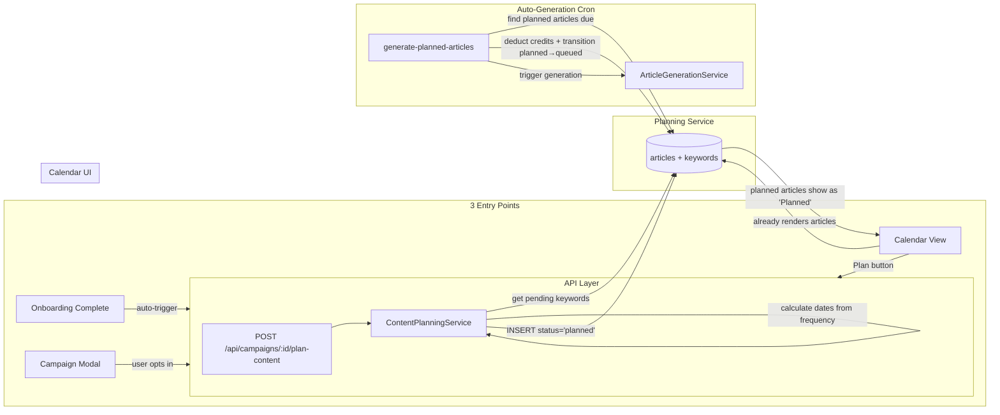
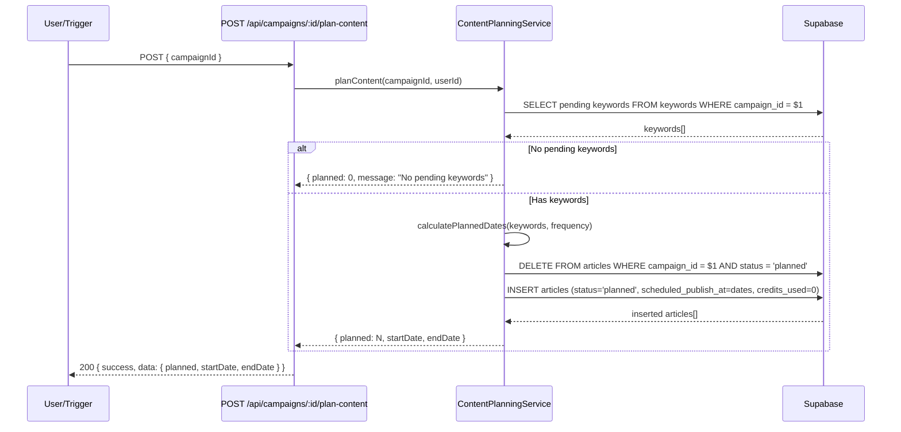
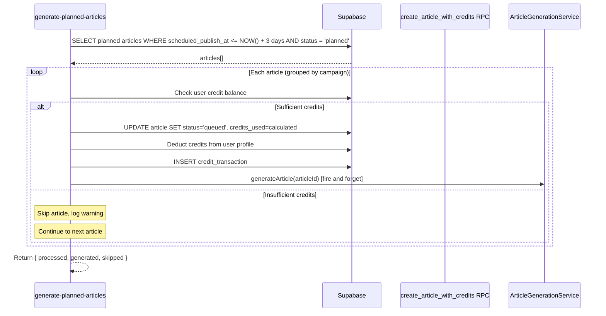
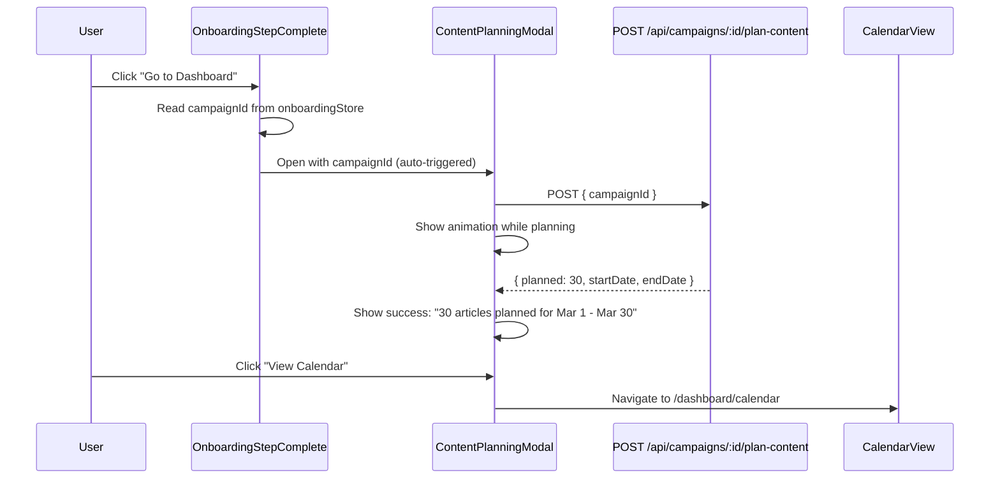

# PRD: Content Planning System

**Complexity: 8 → HIGH mode** (10+ files, new service + cron, DB schema change, 3 UI entry points)

**Depends on:** `calendar-system-PRD.md` (Phases 1-7 assumed complete)

---

## 1. Context

**Problem:** Users can't visualize or plan their upcoming content before spending credits on generation. There's no way to see "what will be written when" without first paying to generate articles. Users want a content calendar planning layer (like outrank.so) that distributes keywords across dates, shows a visual timeline, and auto-generates articles when their publish date approaches.

**Files Analyzed:**

- `supabase/migrations/20260205100200_create_articles_table.sql` — articles schema, status CHECK constraint
- `supabase/migrations/20260210110000_atomic_article_creation_with_credits.sql` — `create_articles_with_credits` RPC
- `shared/types/article.types.ts` — ArticleStatus union type
- `server/services/article-status-transitions.ts` — status state machine
- `server/services/campaign-scheduling.service.ts` — scheduled batch processing, assigns `scheduled_publish_at`
- `server/services/scheduled-publishing.service.ts` — cron publishing service
- `shared/config/scheduling.config.ts` — SCHEDULE_FREQUENCIES, calculateNextRunAt()
- `client/components/onboarding/OnboardingWizard.tsx` — 6-step wizard, ephemeral state
- `client/components/onboarding/steps/OnboardingStepComplete.tsx` — Step 6, "Go to Dashboard" button
- `client/store/onboardingStore.ts` — holds campaignId, projectId, keywordCount between steps
- `client/components/dashboard/views/CalendarView.tsx` — calendar main component
- `client/utils/calendarHelpers.ts` — status → display config mapping
- `client/hooks/useCalendarArticles.ts` — fetches articles by date range
- `client/hooks/useArticleActions.ts` — reschedule/publishNow hooks
- `src/pages/api/cron/publish-scheduled-articles/index.ts` — existing publishing cron pattern

**Current Behavior:**

- Articles are created only when generation starts (costs credits immediately)
- No "planning" layer exists — keywords sit in campaigns until generation is triggered
- Calendar shows only articles that already exist with `scheduled_publish_at`
- Onboarding ends at Step 6 with "Go to Dashboard" — no content planning prompt
- Campaign creation modal ends with "Create" / "Start Schedule" — no planning prompt

---

## 2. Solution

**Approach:**

1. Add `planned` as a new ArticleStatus — article stubs with keyword + scheduled date, NO content, NO credits spent
2. Create a `ContentPlanningService` that distributes a campaign's pending keywords across dates using the campaign's `schedule_frequency`
3. Add a `generate-planned-articles` cron that auto-generates planned articles N days before their `scheduled_publish_at` (deducting credits at that point)
4. Wire 3 UI entry points: post-onboarding (auto-trigger with modal), post-campaign-creation (prompt), and calendar view (manual button)

**Architecture Diagram:**



**Key Decisions:**

- Reuse existing `articles` table with new `planned` status (no new tables — DRY, calendar already renders articles)
- Planned articles have `credits_used = 0` — credits deducted only when `planned → queued` transition happens
- Cannot use `create_articles_with_credits` RPC for planned articles (it requires credits > 0) — use direct INSERT instead
- Lead time is a global constant (`GENERATION_LEAD_TIME_DAYS = 3`) initially (YAGNI — per-campaign config is a future enhancement)
- Reuse campaign's `schedule_frequency` for date spacing (default to `daily` if campaign has no frequency set)
- Re-planning a campaign that already has planned articles: delete existing planned articles first, then re-plan

**Data Changes:**

- Migration: ALTER articles status CHECK to include `'planned'`
- Migration: Update `create_article_with_credits` and `create_articles_with_credits` RPCs to accept `'planned'` status (even though we won't use them for planned articles, the constraint should be consistent)

---

## 3. Sequence Flows

### 3.1 Content Planning (any entry point)



### 3.2 Auto-Generation Cron



### 3.3 Post-Onboarding Planning



---

## 4. Execution Phases

### Integration Points Checklist

```
How will this feature be reached?
- [x] Entry point 1: Onboarding Step 6 → auto-triggers planning API → shows modal
- [x] Entry point 2: NewCampaignModal → post-creation prompt → triggers planning API
- [x] Entry point 3: CalendarView → "Plan Content" button → opens modal → triggers planning API
- [x] Entry point 4: Cron /api/cron/generate-planned-articles (every 5 min)
- [x] Caller files: OnboardingStepComplete.tsx, NewCampaignModal.tsx, CalendarView.tsx
- [x] Registration: Add cron route to security config, add 'planned' to DB constraint

Is this user-facing?
- [x] YES → PlanContentModal (shared by all 3 entry points), calendar status display

Full user flow:
1. User completes onboarding OR creates campaign OR clicks "Plan Content" on calendar
2. POST /api/campaigns/:id/plan-content creates planned article stubs
3. Articles appear on calendar with "Planned" status (amber/yellow)
4. Cron auto-generates articles 3 days before their scheduled_publish_at
5. Generated articles show as "Ready" on calendar, then get published by existing publish cron
```

---

### Phase 1: Database Schema + Types + Status Machine

**User-visible outcome:** `planned` status is available in the system and accepted by all constraints.

**Files (5):**

- `supabase/migrations/YYYYMMDDHHMMSS_add_planned_article_status.sql` — ALTER CHECK constraint, update RPCs
- `shared/types/article.types.ts` — add `'planned'` to ArticleStatus union
- `server/services/article-status-transitions.ts` — add `planned: ['queued']` transition
- `client/utils/calendarHelpers.ts` — add `'planned'` case to getCalendarStatusConfig()
- `shared/config/scheduling.config.ts` — add GENERATION_LEAD_TIME_DAYS constant

**Implementation:**

- [ ] Create migration that:
  - Drops and recreates the status CHECK constraint on articles to include `'planned'`
  - Updates `create_article_with_credits` RPC to accept `'planned'` in validation
  - Updates `create_articles_with_credits` RPC to accept `'planned'` in validation
- [ ] Add `'planned'` to `ArticleStatus` type union in `shared/types/article.types.ts`
- [ ] Add `planned: ['queued'] as const` to `ARTICLE_STATUS_TRANSITIONS` in `article-status-transitions.ts`
- [ ] Add `'planned'` case to `getCalendarStatusConfig()` returning amber/yellow colors:
  ```typescript
  case 'planned':
    return { label: 'Planned', dotColor: 'bg-amber-500', bgClass: 'bg-amber-900/20', textClass: 'text-amber-300', borderClass: 'border-amber-500/20' };
  ```
- [ ] Add to `shared/config/scheduling.config.ts`:
  ```typescript
  export const GENERATION_LEAD_TIME_DAYS = 3;
  export const MAX_PLANNED_ARTICLES_PER_RUN = 10;
  ```

**Verification Plan:**

1. **Migration test:** Run migration — no errors
2. **Unit tests:**
   | Test File | Test Name | Assertion |
   |-----------|-----------|-----------|
   | `tests/unit/article-status-transitions.spec.ts` | `should allow planned → queued transition` | `expect(isValidTransition('planned', 'queued')).toBe(true)` |
   | `tests/unit/article-status-transitions.spec.ts` | `should block planned → generating transition` | `expect(isValidTransition('planned', 'generating')).toBe(false)` |
   | `tests/unit/calendarHelpers.spec.ts` | `should return Planned config for planned status` | `expect(config.label).toBe('Planned')` |

---

### Phase 2: Content Planning Service + API Endpoint

**User-visible outcome:** Backend can create planned article stubs from a campaign's keywords, distributing them across dates using the campaign frequency.

**Files (4):**

- `server/services/content-planning.service.ts` — NEW: planning logic
- `src/pages/api/campaigns/[campaignId]/plan-content.ts` — NEW: POST endpoint
- `shared/types/calendar.types.ts` — add IPlanContentResponse type
- `shared/config/security.ts` — add route to config if needed

**Implementation:**

- [ ] Create `ContentPlanningService` class with `planContent(campaignId, userId)` method:
  1. Fetch campaign (validate ownership, get schedule_frequency)
  2. Fetch pending keywords for the campaign
  3. If no pending keywords, return `{ planned: 0 }`
  4. Delete existing planned articles for this campaign (`status = 'planned'`)
  5. Calculate dates: starting from tomorrow, space keywords using campaign's `schedule_frequency` (default to `'daily'` if not set)
  6. Use `schedule_hour` and `schedule_timezone` from campaign for time-of-day (default 9 AM UTC)
  7. INSERT articles with: `status='planned'`, `title=primary_keyword` (placeholder), `content=NULL`, `credits_used=0`, `scheduled_publish_at=calculated_date`, `campaign_id`, `user_id`, `project_id`
  8. Return `{ planned: count, startDate, endDate }`

- [ ] Create `POST /api/campaigns/:campaignId/plan-content` endpoint:
  - Authenticated (user_id from session)
  - Validates campaignId is UUID
  - Calls `contentPlanningService.planContent()`
  - Returns `{ success: true, data: IPlanContentResponse }`

- [ ] Add `IPlanContentResponse` to `shared/types/calendar.types.ts`:
  ```typescript
  export interface IPlanContentResponse {
    planned: number;
    startDate: string | null;
    endDate: string | null;
    message?: string;
  }
  ```

**Verification Plan:**

1. **Unit tests:**
   | Test File | Test Name | Assertion |
   |-----------|-----------|-----------|
   | `tests/unit/content-planning.spec.ts` | `should create planned articles from campaign keywords` | `expect(articles).toHaveLength(keywordCount)` |
   | `tests/unit/content-planning.spec.ts` | `should space articles using campaign frequency` | dates spaced by frequency interval |
   | `tests/unit/content-planning.spec.ts` | `should return 0 when no pending keywords` | `expect(result.planned).toBe(0)` |
   | `tests/unit/content-planning.spec.ts` | `should delete existing planned articles before re-planning` | old planned articles gone, new ones created |
   | `tests/unit/content-planning.spec.ts` | `should default to daily frequency when campaign has none` | dates spaced 24h apart |

2. **API Proof (curl):**

   ```bash
   # Happy path
   curl -X POST "http://localhost:4321/api/campaigns/CAMPAIGN_ID/plan-content" \
     -H "Authorization: Bearer $TOKEN" | jq .
   # Expected: { success: true, data: { planned: N, startDate: "...", endDate: "..." } }

   # No pending keywords
   curl -X POST "http://localhost:4321/api/campaigns/COMPLETED_ID/plan-content" \
     -H "Authorization: Bearer $TOKEN" | jq .
   # Expected: { success: true, data: { planned: 0, message: "No pending keywords" } }

   # Unauthorized
   curl -X POST "http://localhost:4321/api/campaigns/CAMPAIGN_ID/plan-content" | jq .
   # Expected: 401
   ```

---

### Phase 3: Auto-Generation Cron

**User-visible outcome:** Planned articles automatically transition to generation when their publish date approaches (3 days before), deducting credits at that point.

**Files (5):**

- `server/services/planned-article-generation.service.ts` — NEW: cron logic
- `src/pages/api/cron/generate-planned-articles/index.ts` — NEW: cron endpoint
- `workers/cron/index.ts` — add new cron pattern → endpoint mapping
- `workers/cron/wrangler.toml` — add new cron trigger pattern (e.g., `2/5 * * * *` — every 5 min offset by 2)
- `shared/config/security.ts` — add cron route if needed

**Implementation:**

- [ ] Create `PlannedArticleGenerationService` with `processPlannedArticles()` method:
  1. Query articles where `status = 'planned'` AND `scheduled_publish_at <= NOW() + GENERATION_LEAD_TIME_DAYS days` AND `scheduled_publish_at IS NOT NULL`
  2. Limit to `MAX_PLANNED_ARTICLES_PER_RUN` (10) per invocation
  3. Group articles by user_id for credit checking
  4. For each article:
     a. Check user has sufficient credits (using campaign's model + image preset to calculate cost)
     b. If sufficient: UPDATE article `status='queued'`, `credits_used=calculated_cost`; deduct credits from profile; INSERT credit_transaction
     c. If insufficient: skip article, log warning (don't block other articles)
     d. After status update to queued, the existing `process-scheduled-campaigns` or article generation flow picks it up
  5. Return `{ processed, queued, skippedInsufficientCredits }`

- [ ] Create cron endpoint at `/api/cron/generate-planned-articles`:
  - Protected by `x-cron-secret` header (same pattern as existing crons)
  - Calls `plannedArticleGenerationService.processPlannedArticles()`
  - Returns `{ success, data: { processed, queued, skipped } }`

- [ ] Register cron in `workers/cron/index.ts`:
  - Add pattern `2/5 * * * *` → endpoint `/api/cron/generate-planned-articles`, jobName `'Planned Article Generation'`
- [ ] Add cron trigger to `workers/cron/wrangler.toml`: `"2/5 * * * *"` (every 5 min at :02, :07, :12...)
- [ ] Note: The queued articles need to be picked up for actual generation. Evaluate whether the existing campaign scheduling cron handles orphaned queued articles, or if we need to trigger `fireAndForget` generation from this cron directly.

**Verification Plan:**

1. **Unit tests:**
   | Test File | Test Name | Assertion |
   |-----------|-----------|-----------|
   | `tests/unit/planned-article-generation.spec.ts` | `should transition planned→queued for articles within lead time` | `expect(article.status).toBe('queued')` |
   | `tests/unit/planned-article-generation.spec.ts` | `should skip articles beyond lead time` | `expect(result.processed).toBe(0)` |
   | `tests/unit/planned-article-generation.spec.ts` | `should skip when user has insufficient credits` | `expect(result.skippedInsufficientCredits).toBe(1)` |
   | `tests/unit/planned-article-generation.spec.ts` | `should deduct correct credits based on model+imagePreset` | credits deducted match cost |
   | `tests/unit/planned-article-generation.spec.ts` | `should respect MAX_PLANNED_ARTICLES_PER_RUN limit` | max 10 processed |

2. **curl test:**
   ```bash
   curl -X POST "http://localhost:4321/api/cron/generate-planned-articles" \
     -H "x-cron-secret: $CRON_SECRET" | jq .
   # Expected: { success: true, data: { processed: N, queued: N, skippedInsufficientCredits: 0 } }
   ```

---

### Phase 4: Content Planning Modal (shared UI component)

**User-visible outcome:** A reusable modal that shows planning progress with animation and results, used by all 3 entry points.

**Files (3):**

- `client/components/dashboard/views/calendar/PlanContentModal.tsx` — NEW: shared planning modal
- `client/hooks/useContentPlanning.ts` — NEW: hook for calling plan API
- `shared/types/calendar.types.ts` — already has IPlanContentResponse from Phase 2

**Implementation:**

- [ ] Create `useContentPlanning()` hook:
  - `planContent(campaignId)` — calls POST `/api/campaigns/:id/plan-content`
  - State: `isPlanning`, `result`, `error`
  - Returns `{ planContent, isPlanning, result, error, reset }`

- [ ] Create `PlanContentModal` component:
  - Props: `isOpen`, `onClose`, `campaignId`, `campaignName?`, `onSuccess?`
  - **Planning state** (isPlanning=true): Show animated illustration/spinner with "Planning your content calendar..." text
  - **Success state** (result): Show summary: "X articles planned from [startDate] to [endDate]", with "View Calendar" button that navigates to `/dashboard/calendar`
  - **Error state**: Show error message with retry button
  - **Empty state** (planned=0): Show "No pending keywords found. Add keywords to your campaign first."
  - Auto-triggers planning on mount when campaignId is provided (for onboarding auto-trigger)
  - Uses Tailwind animations (pulse/spin) for loading state — no external animation library needed

**Verification Plan:**

1. **Playwright E2E:**
   | Test File | Test Name | Assertion |
   |-----------|-----------|-----------|
   | `tests/e2e/content-planning.e2e.spec.ts` | `should show planning modal with loading state` | modal visible, spinner present |
   | `tests/e2e/content-planning.e2e.spec.ts` | `should show success state with article count` | "X articles planned" text visible |
   | `tests/e2e/content-planning.e2e.spec.ts` | `should navigate to calendar on View Calendar click` | URL = /dashboard/calendar |

2. **Manual verification:** Open modal → see animation → see results

---

### Phase 5: Onboarding Integration

**User-visible outcome:** After completing onboarding, a planning modal automatically appears showing content being planned for the user's first campaign.

**Files (3):**

- `client/components/onboarding/steps/OnboardingStepComplete.tsx` — add planning trigger
- `client/components/onboarding/OnboardingWizard.tsx` — pass planning state
- `client/store/onboardingStore.ts` — add planning trigger flag if needed

**Implementation:**

- [ ] Modify `OnboardingStepComplete`:
  - Add state: `showPlanningModal` (boolean, default false)
  - Change "Go to Dashboard" button behavior:
    1. If `campaignId` exists in onboardingStore → set `showPlanningModal = true`
    2. If no campaignId → call `onClose()` directly (no planning possible)
  - Render `PlanContentModal` with `isOpen={showPlanningModal}` and `campaignId` from store
  - On modal success → `onClose()` (closes onboarding) + navigate to `/dashboard/calendar`
  - On modal close → `onClose()` (closes onboarding, goes to dashboard normally)

**Verification Plan:**

1. **Playwright E2E:**
   | Test File | Test Name | Assertion |
   |-----------|-----------|-----------|
   | `tests/e2e/content-planning.e2e.spec.ts` | `should show planning modal after onboarding completion` | onboarding → Go to Dashboard → modal visible |
   | `tests/e2e/content-planning.e2e.spec.ts` | `should navigate to calendar after planning` | View Calendar → /dashboard/calendar |

2. **Manual verification:** Complete onboarding → planning modal appears with animation → shows results → navigates to calendar

---

### Phase 6: Campaign Creation Integration

**User-visible outcome:** After creating a campaign via NewCampaignModal, user is prompted to plan their content calendar.

**Files (2):**

- `client/components/dashboard/views/NewCampaignModal.tsx` — add post-creation planning prompt
- (PlanContentModal already created in Phase 4)

**Implementation:**

- [ ] After successful campaign creation in `NewCampaignModal`:
  - Add a new "success" state/step after the 3 existing steps
  - Show: "Campaign created! Want to plan your content calendar?"
  - Two buttons: "Plan Content" (opens PlanContentModal with new campaignId) and "Skip" (closes modal)
  - On Plan Content success → close modal + navigate to `/dashboard/calendar`

**Verification Plan:**

1. **Playwright E2E:**
   | Test File | Test Name | Assertion |
   |-----------|-----------|-----------|
   | `tests/e2e/content-planning.e2e.spec.ts` | `should prompt content planning after campaign creation` | success step shows "Plan Content" button |
   | `tests/e2e/content-planning.e2e.spec.ts` | `should allow skipping content planning` | "Skip" closes modal |

2. **Manual verification:** Create campaign → see planning prompt → click Plan Content → see modal → results

---

### Phase 7: Calendar View Integration

**User-visible outcome:** Calendar view has a "Plan Content" button that opens a campaign picker, then plans content for the selected campaign.

**Files (3):**

- `client/components/dashboard/views/CalendarView.tsx` — add Plan Content button + campaign picker
- `client/components/dashboard/views/calendar/ArticleDetailModal.tsx` — add "Generate Now" action for planned articles
- (PlanContentModal already created in Phase 4)

**Implementation:**

- [ ] Add "Plan Content" button to CalendarView header (next to view switcher):
  - Opens a dropdown/popover listing user's campaigns (draft/scheduled status only)
  - On campaign select → opens PlanContentModal with that campaignId
  - On modal success → refetch calendar data

- [ ] Update ArticleDetailModal for planned articles:
  - Show "Generate Now" button (transitions planned → queued, costs credits)
  - Show "Delete Plan" button (deletes the planned article)
  - Show "Reschedule" (already exists, works for planned articles too)
  - Disable "Publish Now" for planned articles (no content yet)

- [ ] Planned articles on calendar should be visually distinct:
  - Amber/yellow color scheme (already configured in Phase 1)
  - Dashed border to indicate "planned, not yet generated"
  - Show keyword as title (since title = keyword for planned articles)

**Verification Plan:**

1. **Playwright E2E:**
   | Test File | Test Name | Assertion |
   |-----------|-----------|-----------|
   | `tests/e2e/content-planning.e2e.spec.ts` | `should show Plan Content button on calendar` | button visible |
   | `tests/e2e/content-planning.e2e.spec.ts` | `should open campaign picker on Plan Content click` | dropdown with campaigns visible |
   | `tests/e2e/content-planning.e2e.spec.ts` | `should show planned articles with amber styling` | planned articles have amber class |
   | `tests/e2e/content-planning.e2e.spec.ts` | `should show Generate Now for planned articles` | click planned article → modal has Generate Now button |

2. **Manual verification:** Click Plan Content → select campaign → see planned articles appear on calendar → click one → see Generate Now option

---

## 5. Checkpoint Protocol

All phases use **automated checkpoints** via `prd-work-reviewer` agent.

Phases 4, 5, 6, 7 additionally require **manual checkpoint** (UI visual changes).

| Phase | Type               | Notes                                        |
| ----- | ------------------ | -------------------------------------------- |
| 1     | Automated only     | DB migration + types + status machine        |
| 2     | Automated only     | Service + API endpoint                       |
| 3     | Automated only     | Cron job + service                           |
| 4     | Automated + Manual | Planning modal — verify animation + states   |
| 5     | Automated + Manual | Onboarding hook — verify auto-trigger works  |
| 6     | Automated + Manual | Campaign modal — verify post-creation prompt |
| 7     | Automated + Manual | Calendar — verify button, picker, styling    |

---

## 6. Acceptance Criteria

- [ ] All 7 phases complete
- [ ] All unit, integration, and E2E tests pass
- [ ] `yarn verify` passes
- [ ] All automated checkpoint reviews passed
- [ ] Manual checkpoints verified for phases 4-7
- [ ] `planned` status in DB CHECK constraint, TypeScript types, and status machine
- [ ] `POST /api/campaigns/:id/plan-content` creates planned article stubs
- [ ] Planned articles appear on calendar with amber/yellow "Planned" styling
- [ ] Onboarding auto-triggers content planning with visible modal
- [ ] Campaign creation prompts to plan content calendar
- [ ] Calendar has "Plan Content" button with campaign picker
- [ ] Cron auto-generates planned articles 3 days before publish date
- [ ] Credits are only deducted when planned → queued transition happens
- [ ] Re-planning a campaign replaces existing planned articles

---

## Future Enhancements (Out of Scope)

- Per-campaign `generation_lead_time_days` setting (currently global constant)
- AI-generated titles during planning phase (currently title = keyword)
- Drag-and-drop planned articles between campaigns
- Smart keyword ordering based on search volume / difficulty
- Planning suggestions based on GSC opportunity data
- Bulk "Generate All Planned" button on calendar
