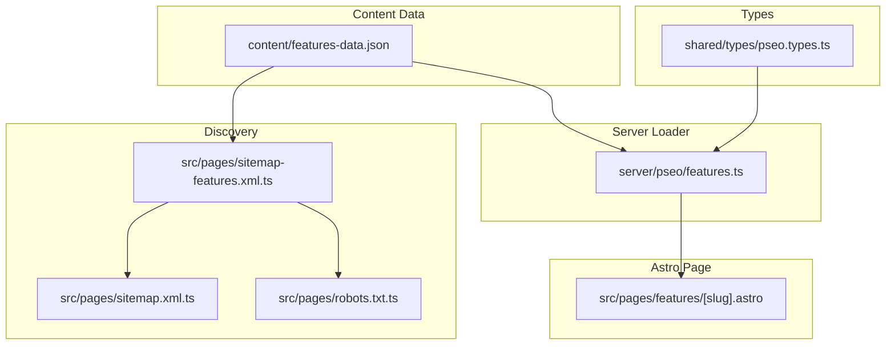

# PRD: Feature Landing Pages (pSEO)

**Complexity: 6 → MEDIUM mode** (+2 new pSEO category from scratch, +2 touches 6-10 files, +1 data files, +1 sitemap integration)

**Date:** 2026-02-23
**Status:** Draft
**Priority:** P1 — Feature keyword clusters drive high commercial-intent traffic

---

## 1. Context

**Problem:** AutopilotRank has a single `/features` overview page (React island) but no individual feature landing pages targeting specific keyword clusters. Competitors like Outrank.so rank for feature-specific terms like "auto publish WordPress", "AI content humanizer", "automated keyword research". Each feature keyword cluster deserves its own SEO-optimized landing page to capture bottom-of-funnel commercial traffic.

**Source:** Keyword research at `docs/SEO/keywords/google-ads-keyword-research.md` identifies Tier 2 feature keywords as high-priority targets that map directly to product features.

**Files Analyzed:**

- `src/pages/features.astro` — Single overview page (React client-side)
- `src/pages/alternative/[slug].astro` — pSEO pattern to follow
- `src/pages/tools/[slug].astro` — Similar interactive page pattern
- `content/tools-data.json` — JSON data-driven page pattern
- `content/use-cases-data.json` — Feature-benefit page pattern
- `server/pseo/alternatives.ts` — Data loader pattern
- `shared/types/pseo.types.ts` — pSEO type definitions
- `src/pages/sitemap.xml.ts` — Sitemap index (needs new child sitemap)
- `src/pages/robots.txt.ts` — Needs new sitemap directive
- `shared/config/subscription.config.ts` — Feature lists per plan (source of truth for what exists)
- `docs/business/business-model-canvas/value-proposition.md` — Product positioning & feature matrix
- `docs/SEO/keywords/google-ads-keyword-research.md` — Tier 2 keyword targets

**Current Behavior:**

- `/features` renders a client-side React component listing all features generically
- No individual feature pages exist at `/features/[slug]`
- Feature-specific keywords have no dedicated landing pages
- Use-case pages cover industry verticals but NOT feature-specific keyword clusters

**Implemented features (grounded in codebase):**

- Multi-model AI engine: `server/services/providers/` (GPT-4, Claude, Gemini adapters)
- Humanizer: `shared/constants/writing-guidelines.ts` (anti-AI writing patterns baked into prompts)
- CMS publishing: `server/integrations/` (wordpress.adapter.ts, webflow.adapter.ts, shopify.adapter.ts, ghost.adapter.ts, notion.adapter.ts, webhook.adapter.ts)
- GSC integration: `server/services/gsc.service.ts` + `opportunity-analysis.service.ts`
- Scheduled publishing: `server/services/opportunity-scheduler.service.ts`
- Pre-publication QA: article generation pipeline with SEO scoring

---

## 2. Solution

**Approach:**

1. Create a new pSEO category `/features/[slug]` with 5 initial feature pages following the existing pSEO pattern (JSON data → TypeScript loader → Astro dynamic route)
2. Each page targets a specific keyword cluster with: hero section, how-it-works steps, benefits, plan availability, FAQ, CTA
3. Add `sitemap-features.xml` child sitemap and register in sitemap index + robots.txt
4. Cross-link from the existing `/features` overview page and CrossCategoryLinks component

**Architecture:**



**Key Decisions:**

- Reuse existing pSEO patterns (JSON data, server loader, Astro prerendered dynamic route)
- All feature claims grounded in actual codebase (no aspirational features)
- Each page includes `SoftwareApplication` + `FAQPage` + `BreadcrumbList` + `HowTo` JSON-LD schemas
- No database changes — all content lives in `content/features-data.json`
- The existing `/features` (overview page) remains unchanged; `/features/[slug]` pages are new siblings

**Data Changes:** None (JSON data files only, no DB schema)

---

## 3. Feature Pages & Keyword Mapping

All features below are **implemented in the codebase** — see "Source" field for each.

### Page 1: Auto-Publishing (`/features/auto-publishing`)

| Element           | Value                                                                                                                                                                                                                               |
| ----------------- | ----------------------------------------------------------------------------------------------------------------------------------------------------------------------------------------------------------------------------------- |
| Source            | `server/integrations/wordpress.adapter.ts`, `server/services/delivery.service.ts`, `server/services/opportunity-scheduler.service.ts`                                                                                               |
| Target Keyword    | `auto publish WordPress`, `automatic blog posting`                                                                                                                                                                                  |
| Secondary         | `auto publish blog posts`, `WordPress auto-publishing`, `scheduled content publishing`, `auto publish SEO content`                                                                                                                  |
| Title             | `Auto-Publish SEO Content to WordPress \| AutopilotRank`                                                                                                                                                                            |
| Meta Description  | `Automatically publish AI-generated SEO articles to WordPress on a schedule. Connect in 2 minutes, drip-feed or batch publish. From $49/mo.`                                                                                        |
| H1                | `Auto-Publish SEO Content to Your CMS`                                                                                                                                                                                              |
| Content Angle     | How AutopilotRank connects to WordPress/Webflow/Shopify/Ghost/Notion via native adapters, drip-feed scheduled publishing via `opportunity-scheduler.service.ts`, handles categories/tags/featured images. CMS adapter architecture. |
| Plan Availability | All paid plans (Starter: 1 site, Growth: 3 sites, Agency: unlimited)                                                                                                                                                                |

### Page 2: AI Content Humanizer (`/features/humanizer`)

| Element           | Value                                                                                                                                                                                                                                        |
| ----------------- | -------------------------------------------------------------------------------------------------------------------------------------------------------------------------------------------------------------------------------------------- |
| Source            | `shared/constants/writing-guidelines.ts` (anti-AI writing patterns), `server/services/prompts/article-prompts.ts`                                                                                                                            |
| Target Keyword    | `AI content humanizer`, `humanize AI content`                                                                                                                                                                                                |
| Secondary         | `make AI content undetectable`, `humanized AI writing`, `AI detection bypass for SEO`                                                                                                                                                        |
| Title             | `AI Content Humanizer — Undetectable AI Writing \| AutopilotRank`                                                                                                                                                                            |
| Meta Description  | `Built-in humanizer makes AI content pass detection tools. Anti-AI writing patterns based on Wikipedia's "Signs of AI writing" guide. No extra tools needed.`                                                                                |
| H1                | `AI Content Humanizer: Write Like a Human, Scale Like a Machine`                                                                                                                                                                             |
| Content Angle     | How the writing guidelines system works (based on Wikipedia's "Signs of AI writing"), forbidden word lists, anti-patterns baked into every generation, comparison to standalone humanizer tools. Reference `buildWritingGuidelinesPrompt()`. |
| Plan Availability | All paid plans (Starter: basic, Growth+: advanced humanizer per subscription.config.ts)                                                                                                                                                      |

### Page 3: GSC Integration (`/features/gsc-integration`)

| Element           | Value                                                                                                                                                                                                                  |
| ----------------- | ---------------------------------------------------------------------------------------------------------------------------------------------------------------------------------------------------------------------- |
| Source            | `server/services/gsc.service.ts`, `server/services/opportunity-analysis.service.ts`, `server/services/opportunity-performance.service.ts`                                                                              |
| Target Keyword    | `Google Search Console integration`, `GSC SEO tool`                                                                                                                                                                    |
| Secondary         | `automated GSC analysis`, `search console automation`, `GSC data for content`, `keyword opportunity finder`                                                                                                            |
| Title             | `Google Search Console Integration for Automated SEO \| AutopilotRank`                                                                                                                                                 |
| Meta Description  | `Connect GSC to find content gaps, track rankings, and auto-generate articles from real search data. Data-driven SEO automation. Growth plan.`                                                                         |
| H1                | `Google Search Console Integration: Data-Driven SEO Automation`                                                                                                                                                        |
| Content Angle     | OAuth connection flow, opportunity analysis service that surfaces keyword gaps (impressions without clicks), auto-content generation from GSC data, performance tracking. Reference `opportunity-analysis.service.ts`. |
| Plan Availability | Growth and Agency plans                                                                                                                                                                                                |

### Page 4: Keyword Research & Content Generation (`/features/keyword-research`)

| Element           | Value                                                                                                                                                                                                                                            |
| ----------------- | ------------------------------------------------------------------------------------------------------------------------------------------------------------------------------------------------------------------------------------------------ |
| Source            | `server/services/article-generation.service.ts`, keyword upload/CSV import functionality                                                                                                                                                         |
| Target Keyword    | `automated keyword research`, `AI SEO content generation`                                                                                                                                                                                        |
| Secondary         | `SEO keyword research tool`, `AI article generator`, `bulk content generation`, `programmatic SEO tool`                                                                                                                                          |
| Title             | `Automated Keyword Research & AI Content Generation \| AutopilotRank`                                                                                                                                                                            |
| Meta Description  | `Upload keywords via CSV, let AI generate SEO-optimized articles. Multi-model engine (GPT-4, Claude, Gemini) for variety and quality. From $49/mo.`                                                                                              |
| H1                | `Automated Keyword Research & AI Content Generation`                                                                                                                                                                                             |
| Content Angle     | Custom keyword upload (CSV/Excel), multi-model AI selection (GPT-4o, Claude Sonnet, Gemini Flash via OpenRouter), batch generation, campaign-based content pipeline. Reference `article-generation.service.ts` and `server/services/providers/`. |
| Plan Availability | All paid plans (Starter: batch 5, Growth: batch 25, Agency: batch 100)                                                                                                                                                                           |

### Page 5: Pre-Publication QA & SEO Scoring (`/features/content-quality`)

| Element           | Value                                                                                                                                                                                               |
| ----------------- | --------------------------------------------------------------------------------------------------------------------------------------------------------------------------------------------------- |
| Source            | `shared/utils/seo.ts` (SEO scoring), article generation pipeline QA checks                                                                                                                          |
| Target Keyword    | `AI content quality scoring`, `SEO content optimization`                                                                                                                                            |
| Secondary         | `pre-publication QA`, `AI detection scoring`, `content quality assurance`, `SEO scoring tool`                                                                                                       |
| Title             | `Pre-Publication QA & SEO Content Scoring \| AutopilotRank`                                                                                                                                         |
| Meta Description  | `Every article is scored for SEO, readability, and AI detection before publishing. Multi-layer QA catches issues automatically. From $49/mo.`                                                       |
| H1                | `Pre-Publication QA: Every Article Scored Before It Goes Live`                                                                                                                                      |
| Content Angle     | SEO scoring utilities, readability analysis, AI detection pass rates, multi-layer validation pipeline, how QA ensures publish-ready quality without manual review. Reference `shared/utils/seo.ts`. |
| Plan Availability | All paid plans                                                                                                                                                                                      |

---

## 4. Page Structure (Template)

Each feature page follows this structure:

```
1. Breadcrumb: Home > Features > {Feature Name}
2. Hero Section: H1 + subtitle + primary CTA ("Start Free Trial")
3. How It Works: 3-5 numbered steps (from actual product flow)
4. Key Benefits: 4-6 benefit cards
5. Plan Availability: Which plans include this feature + pricing
6. Feature Comparison: Table comparing our feature vs competitors (grounded in value-proposition.md competitor matrix)
7. FAQ Section: 4-6 questions targeting secondary keywords
8. Bottom CTA: "Try {Feature Name} Free" with signup link
9. Cross-Category Links: Related use-cases, comparisons, blog posts
```

---

## 5. Integration Points

```markdown
**How will this feature be reached?**

- [x] Entry point: `/features/[slug]` routes (Astro prerendered)
- [x] Caller: Organic search + internal links from `/features` overview, footer, CrossCategoryLinks, blog posts
- [x] Registration: New `sitemap-features.xml`, registered in sitemap index + robots.txt

**Is this user-facing?**

- [x] YES — Public marketing pages for all visitors

**Full user flow:**

1. User searches Google for "auto publish WordPress SEO"
2. Google indexes prerendered `/features/auto-publishing` page
3. User reads how-it-works steps, sees plan availability and pricing
4. CTA drives to `/pricing` or signup
5. Internal links connect to related comparisons and use-cases
```

---

## 6. Execution Phases

### Phase 1: Data & Infrastructure (types, loader, data file, sitemap)

**User-visible outcome:** Feature page data infrastructure is ready, sitemap registered.

**Files (max 5):**

- `shared/types/pseo.types.ts` — Add `IFeaturePage` interface
- `content/features-data.json` — **NEW** data file with all 5 feature pages
- `server/pseo/features.ts` — **NEW** data loader (follows `server/pseo/alternatives.ts` pattern)
- `src/pages/sitemap-features.xml.ts` — **NEW** sitemap for feature pages
- `src/pages/sitemap.xml.ts` — Register new sitemap in index

**Implementation:**

- [ ] Add `IFeaturePage` type to `pseo.types.ts` with fields: `slug`, `title`, `metaTitle`, `metaDescription`, `h1`, `heroSubtitle`, `primaryKeyword`, `secondaryKeywords`, `lastUpdated`, `featureName`, `howItWorks` (steps array), `benefits` (array), `planAvailability` (array of plan keys from subscription.config.ts), `featureComparison` (table data — grounded in value-proposition.md competitor matrix), `faqs` (array), `relatedFeatures` (slugs array)
- [ ] Create `content/features-data.json` with all 5 feature pages. All claims must be grounded in actual codebase functionality (see Section 3 "Source" fields)
- [ ] Create `server/pseo/features.ts` with `getAllFeatureSlugs()`, `getFeatureBySlug()`, `getFeaturesBySlugs()` functions
- [ ] Create `src/pages/sitemap-features.xml.ts` following `sitemap-tools.xml.ts` pattern
- [ ] Add `/sitemap-features.xml` to `sitemap.xml.ts` sitemaps array

**Tests Required:**
| Test File | Test Name | Assertion |
|-----------|-----------|-----------|
| `tests/unit/pages/features-data.spec.ts` | `should load all feature pages` | `getAllFeatureSlugs().length === 5` |
| `tests/unit/pages/features-data.spec.ts` | `should load feature by slug` | `getFeatureBySlug('humanizer')` returns valid data |
| Build verification | `yarn build` succeeds | No build errors |

**User Verification:**

- Action: Run unit tests
- Expected: All feature data loads correctly

---

### Phase 2: Astro Page Template & Rendering

**User-visible outcome:** All 5 feature pages render at `/features/[slug]` with full SEO markup.

**Files (max 5):**

- `src/pages/features/[slug].astro` — **NEW** dynamic route for feature pages
- `src/pages/robots.txt.ts` — Add sitemap directive
- `src/components/pseo/CrossCategoryLinks.astro` — Add 'feature' category support (if not already present)

**Implementation:**

- [ ] Create `src/pages/features/[slug].astro` with `prerender = true` and `getStaticPaths()`
- [ ] Include all JSON-LD schemas: `SoftwareApplication`, `FAQPage`, `BreadcrumbList`, `HowTo`
- [ ] Render all page sections per Section 4 template
- [ ] Add `CrossCategoryLinks` component at bottom
- [ ] Use `SEO.astro` component for meta tags
- [ ] Add `Sitemap: ${BASE_URL}/sitemap-features.xml` to `robots.txt.ts`

**Tests Required:**
| Test File | Test Name | Assertion |
|-----------|-----------|-----------|
| Build verification | `yarn build` succeeds | All 5 pages pre-rendered |
| Manual | Visit `/features/humanizer` | Page renders with hero, steps, FAQ, CTA |
| Schema validation | Google Rich Results Test | HowTo + FAQ schemas validate |

**User Verification:**

- Action: `yarn build && yarn preview`, visit `/features/auto-publishing`
- Expected: Full page renders with breadcrumb, hero, how-it-works steps, benefits, plan availability, FAQ, and CTA

---

### Phase 3: Internal Linking & Cross-References

**User-visible outcome:** Feature pages are linked from the overview page, footer, and cross-category links.

**Files (max 5):**

- `src/pages/features.astro` — Add links to individual feature pages
- `src/components/pseo/CrossCategoryLinks.astro` — Include feature pages in cross-linking
- Footer component — Add feature page links under "Product" section

**Implementation:**

- [ ] Add a "Learn More" link from each feature section on `/features` to the corresponding `/features/[slug]` page
- [ ] Update `CrossCategoryLinks.astro` to include feature pages when showing related content on other pSEO pages
- [ ] Add individual feature page links to footer under "Product" section

**Tests Required:**
| Test File | Test Name | Assertion |
|-----------|-----------|-----------|
| Build verification | `yarn build` succeeds | No broken links |
| Manual | Check `/features` overview | Each feature has a "Learn More" link to detail page |
| Manual | Check a comparison page | CrossCategoryLinks shows a relevant feature page |

**User Verification:**

- Action: Visit `/features`, click "Learn More" on humanizer section
- Expected: Navigates to `/features/humanizer` with full feature page

---

## 7. Acceptance Criteria

- [ ] All 5 feature pages render at `/features/[slug]`
- [ ] Each page has optimized title (<=60 chars) and meta description (<=160 chars)
- [ ] Each page has `SoftwareApplication` + `FAQPage` + `BreadcrumbList` + `HowTo` JSON-LD
- [ ] All feature claims are grounded in actual codebase (no aspirational features)
- [ ] All pages appear in `sitemap-features.xml`
- [ ] Sitemap registered in sitemap index and robots.txt
- [ ] Cross-category internal linking includes feature pages
- [ ] `/features` overview page links to individual feature pages
- [ ] `yarn verify` passes
- [ ] `yarn build` succeeds with all 5 pages pre-rendered
