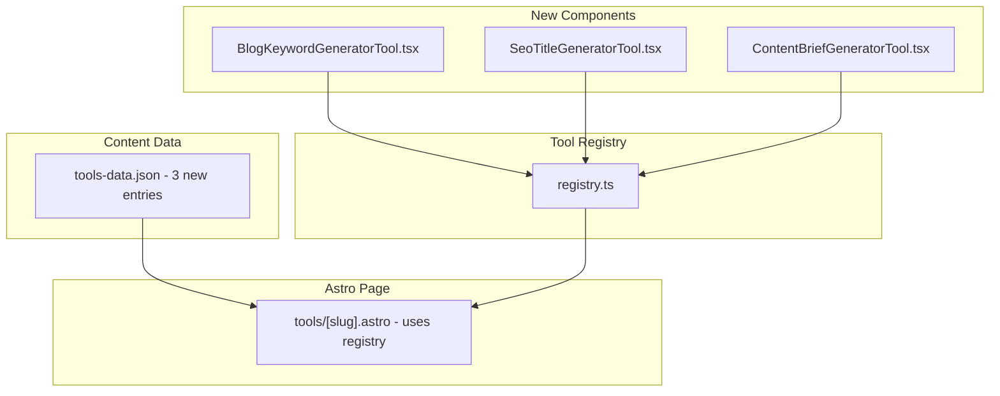

# PRD: Free SEO Tools Expansion (3 New Tools)

**Complexity: 6 → MEDIUM mode** (+2 new tools from scratch, +2 touches 6-10 files, +1 data file, +1 registry change)

**Date:** 2026-02-23
**Status:** Draft
**Priority:** P1 — Free tools drive top-of-funnel traffic for Tier 4 keywords (source: `docs/SEO/keywords/google-ads-keyword-research.md`)

---

## 1. Context

**Problem:** AutopilotRank has 3 existing free SEO tools (keyword density checker, meta description validator, title tag optimizer) that are analysis/validation tools. Competitors like Outrank.so and SEO.ai offer content generation tools (keyword generators, title generators, brief generators) that attract "free tool" searches. We need parity on generation-focused tools to capture Tier 4 keyword traffic like "blog keyword generator", "SEO title generator", "content brief generator".

**Source:** `docs/business/business-model-canvas/key-activities.md` lists "Free tools (keyword clustering, content brief generator)" as a key content marketing activity. `docs/SEO/keywords/google-ads-keyword-research.md` identifies "blog post outline generator" as a Tier 4 keyword target.

**Files Analyzed:**

- `client/components/tools/registry.ts` — Tool component registry (6 components, 3 unlinked)
- `client/components/tools/KeywordDensityTool.tsx` — Client-side tool pattern
- `client/components/tools/TitleTagTool.tsx` — Existing title tool pattern
- `content/tools-data.json` — 3 existing tool pages
- `src/pages/tools/[slug].astro` — Dynamic tool page template
- `server/pseo/tools.ts` — Data loader
- `shared/types/pseo.types.ts` — `IToolPage` type definition
- `src/pages/sitemap-tools.xml.ts` — Auto-picks up new tools from data

**Current Behavior:**

- 3 tools exist (analysis/validation): keyword density, meta description, title tag
- Registry has `SeoRoiCalculator`, `ReadingLevelChecker`, `ContentLengthAnalyzer` already built but NOT in `tools-data.json` (unlinked)
- No generation-focused tools (keyword generation, title generation, brief generation)
- Existing tools pattern: client-side React components with no API calls (Cloudflare-compatible)

**Important constraint:** Cloudflare Workers 10ms CPU limit — all tools MUST be client-side JavaScript only, no API calls to AI endpoints. Pure algorithmic generation using pattern matching and templates.

---

## 2. Solution

**Approach:**

1. Create 3 new client-side React tool components: `BlogKeywordGeneratorTool`, `SeoTitleGeneratorTool`, `ContentBriefGeneratorTool`
2. Register all 3 in `client/components/tools/registry.ts`
3. Add 3 new page entries to `content/tools-data.json`
4. Sitemap auto-updates (no changes needed — `sitemap-tools.xml.ts` reads from data file dynamically)

**Architecture:**



**Key Decisions:**

- Pure client-side JavaScript — no AI API calls (Cloudflare-safe, instant results, no auth needed)
- Algorithmic generation using keyword templates and modifiers
- Follow existing component pattern (`className?: string` prop interface)
- Tools are free with no signup required — maximize conversion to trial via CTAs

---

## 3. Tool Specifications

### Tool 1: Blog Keyword Generator (`/tools/blog-keyword-generator`)

**Component:** `BlogKeywordGeneratorTool`

**Input:** Seed keyword/topic (e.g., "automated SEO")

**Output:** 20+ keyword variations organized into categories:

- Question keywords: "what is automated SEO", "how does automated SEO work", "why use automated SEO"
- Long-tail variations: "automated SEO for small business", "automated SEO tools 2026", "automated SEO platform"
- Informational: "automated SEO guide", "automated SEO tutorial", "automated SEO examples"
- Commercial: "best automated SEO", "automated SEO software", "automated SEO services"

**Algorithm:** Client-side only — combines seed keyword with modifier lists (question words, modifiers, suffixes, year). No external API. Pure string manipulation.

| SEO Element      | Value                                                                                                                                                        |
| ---------------- | ------------------------------------------------------------------------------------------------------------------------------------------------------------ |
| Target Keyword   | `blog keyword generator`, `keyword generator for blog posts`                                                                                                 |
| Secondary        | `SEO keyword ideas`, `blog topic generator`, `keyword research tool free`                                                                                    |
| Title            | `Free Blog Keyword Generator — Get 20+ Keyword Ideas Instantly \| AutopilotRank`                                                                             |
| Meta Description | `Generate 20+ blog keyword ideas from any seed topic. Free tool with question keywords, long-tail variations, and commercial modifiers. No signup required.` |
| H1               | `Free Blog Keyword Generator`                                                                                                                                |

---

### Tool 2: SEO Title Generator (`/tools/seo-title-generator`)

**Component:** `SeoTitleGeneratorTool`

**Input:** Target keyword + content type (How-To, Listicle, Guide, Comparison, Review)

**Output:** 10 title suggestions using proven SEO title templates:

- How-To: "How to {keyword} in 2026 (Step-by-Step Guide)"
- Listicle: "7 Best {keyword} Tools in 2026"
- Guide: "The Complete Guide to {keyword} for Beginners"
- Comparison: "{keyword} vs Manual: Which Is Better in 2026?"
- Review: "{keyword} Review 2026: Is It Worth It?"

**Algorithm:** Template-based generation. Each template fills in the keyword + current year. Character counter shows which titles are within Google's 60-char limit.

| SEO Element      | Value                                                                                                                                     |
| ---------------- | ----------------------------------------------------------------------------------------------------------------------------------------- |
| Target Keyword   | `SEO title generator`, `blog title generator`, `title generator for blog posts`                                                           |
| Secondary        | `meta title generator`, `SEO headline generator`, `title tag generator`                                                                   |
| Title            | `Free SEO Title Generator — 10 Optimized Titles Instantly \| AutopilotRank`                                                               |
| Meta Description | `Generate 10 SEO-optimized title ideas from your target keyword. Choose How-To, Listicle, Guide, or Comparison formats. Free, no signup.` |
| H1               | `Free SEO Title Generator`                                                                                                                |

---

### Tool 3: Content Brief Generator (`/tools/content-brief-generator`)

**Component:** `ContentBriefGeneratorTool`

**Input:** Target keyword + content type

**Output:** A structured content brief with:

- Suggested H1 (based on keyword)
- Recommended word count (based on content type)
- Suggested H2 sections (5-8 sections based on keyword + content type template)
- Internal linking suggestions (link to related pSEO pages — static suggestions based on keyword)
- Target keywords section (primary + secondary keyword suggestions)
- "Next Step" CTA: "Generate this article automatically with AutopilotRank"

**Algorithm:** Template-based. Each content type has a set of H2 templates filled with the keyword. Deterministic output (no randomness needed — consistency is a feature for free tools).

| SEO Element      | Value                                                                                                                                       |
| ---------------- | ------------------------------------------------------------------------------------------------------------------------------------------- |
| Target Keyword   | `content brief generator`, `blog content brief template`, `SEO content brief`                                                               |
| Secondary        | `content outline generator`, `blog outline generator`, `article brief generator`                                                            |
| Title            | `Free Content Brief Generator — Get a Complete SEO Brief \| AutopilotRank`                                                                  |
| Meta Description | `Generate a complete SEO content brief in seconds. Get H1, H2 sections, word count targets, and keyword suggestions. Free tool, no signup.` |
| H1               | `Free Content Brief Generator`                                                                                                              |

---

## 4. Integration Points

```markdown
**How will this feature be reached?**

- [x] Entry point: `/tools/[slug]` routes (Astro prerendered)
- [x] Caller: Organic search + links from footer "Free Tools" section + blog posts + CrossCategoryLinks
- [x] Registration: tools-data.json auto-populates sitemap-tools.xml.ts — no sitemap changes needed

**Is this user-facing?**

- [x] YES — Public free tools, no auth required

**Full user flow:**

1. User searches "free content brief generator"
2. Google indexes our prerendered `/tools/content-brief-generator` page
3. User enters keyword, gets instant brief
4. Bottom CTA: "Generate this article automatically with AutopilotRank → Start free trial"
5. Converts to trial signup
```

---

## 5. Execution Phases

### Phase 1: Three New React Tool Components

**User-visible outcome:** All 3 tool components built and working client-side.

**Files (max 5):**

- `client/components/tools/BlogKeywordGeneratorTool.tsx` — **NEW**
- `client/components/tools/SeoTitleGeneratorTool.tsx` — **NEW**
- `client/components/tools/ContentBriefGeneratorTool.tsx` — **NEW**
- `client/components/tools/registry.ts` — Register all 3 new components
- `client/components/tools/__tests__/BlogKeywordGeneratorTool.test.tsx` — **NEW** unit tests

**Implementation:**

**`BlogKeywordGeneratorTool.tsx`:**

- [ ] Input: single text field for seed keyword
- [ ] On "Generate" click: expand keyword using modifier arrays (question words: what/how/why/when/can, modifiers: best/top/free/guide/tools/software/2026, long-tail suffixes: for beginners/for small business/examples/tutorial)
- [ ] Output: grouped results by category (Question, Informational, Commercial, Long-tail)
- [ ] "Copy All" button copies keyword list to clipboard
- [ ] Bottom CTA: "Turn these keywords into articles automatically → Start Free Trial"

**`SeoTitleGeneratorTool.tsx`:**

- [ ] Inputs: keyword field + content type selector (How-To, Listicle, Guide, Comparison, Review)
- [ ] On "Generate": apply 10 title templates filled with the keyword and current year
- [ ] Each title shows character count (green if ≤60, yellow 61-70, red >70)
- [ ] "Copy" button per title + "Copy All" button
- [ ] Bottom CTA: "Publish articles with these titles automatically → Start Free Trial"

**`ContentBriefGeneratorTool.tsx`:**

- [ ] Inputs: keyword field + content type selector
- [ ] On "Generate": build a structured brief with: H1, target word count, 6-8 H2 sections from templates, primary/secondary keyword suggestions
- [ ] Output rendered as a formatted brief preview
- [ ] "Copy Brief" button copies entire brief as markdown text
- [ ] Bottom CTA: "Generate this full article automatically with AutopilotRank → Start Free Trial"

- [ ] Register all 3 in `registry.ts`: `BlogKeywordGeneratorTool`, `SeoTitleGeneratorTool`, `ContentBriefGeneratorTool`

**Tests Required:**
| Test File | Test Name | Assertion |
|-----------|-----------|-----------|
| `BlogKeywordGeneratorTool.test.tsx` | `should generate question keywords from seed` | Input "SEO" → output includes "what is SEO" |
| `BlogKeywordGeneratorTool.test.tsx` | `should generate 15+ keyword variations` | `keywords.length >= 15` |
| `SeoTitleGeneratorTool.test.tsx` | `should generate 10 title suggestions` | `titles.length === 10` |
| `SeoTitleGeneratorTool.test.tsx` | `should flag titles over 60 chars` | Title >60 chars has `isLong: true` |
| `ContentBriefGeneratorTool.test.tsx` | `should include H2 sections` | `brief.sections.length >= 5` |

**User Verification:**

- Action: Open each tool, enter "automated SEO", click Generate
- Expected: Relevant keyword/title/brief output appears with copy functionality and CTA

---

### Phase 2: Data Entries & pSEO Pages

**User-visible outcome:** All 3 tools have SEO-optimized pages at `/tools/[slug]`.

**Files (max 5):**

- `content/tools-data.json` — Add 3 new page entries

**Implementation:**

- [ ] Add entry for `blog-keyword-generator` with `componentName: 'BlogKeywordGeneratorTool'`, full SEO data, 5 FAQs, `howToUse` steps, `whyUseIt` benefits, `relatedTools` links
- [ ] Add entry for `seo-title-generator` with `componentName: 'SeoTitleGeneratorTool'`, full SEO data, 5 FAQs, `howToUse` steps, `whyUseIt` benefits, `relatedTools` links
- [ ] Add entry for `content-brief-generator` with `componentName: 'ContentBriefGeneratorTool'`, full SEO data, 5 FAQs, `howToUse` steps, `whyUseIt` benefits, `relatedTools` links

Each tools-data entry must include:

- `slug`, `title`, `metaTitle` (≤60 chars), `metaDescription` (150-160 chars, keyword in first 50 chars)
- `h1`, `primaryKeyword`, `secondaryKeywords`, `lastUpdated`
- `toolName`, `toolDescription`, `componentName`
- `howToUse` (3-5 steps)
- `whyUseIt` (4-5 benefits, including "free with no signup required")
- `faqs` (5 FAQ pairs targeting secondary keywords)
- `relatedTools` (slug array linking to other tools)

**Tests Required:**
| Test File | Test Name | Assertion |
|-----------|-----------|-----------|
| Build verification | `yarn build` | All 3 tool pages render |
| Data validation | `tools-data.json` is valid JSON | `JSON.parse` succeeds |
| Manual | Visit `/tools/blog-keyword-generator` | Page renders with tool component |

**User Verification:**

- Action: `yarn build && yarn preview`, visit all 3 tool URLs
- Expected: Pages render with working tool components, correct SEO title/description, HowTo schema, FAQ section

---

## 6. Acceptance Criteria

- [ ] `BlogKeywordGeneratorTool`, `SeoTitleGeneratorTool`, `ContentBriefGeneratorTool` components built and tested
- [ ] All 3 components registered in `registry.ts`
- [ ] All 3 have entries in `tools-data.json` with full SEO metadata
- [ ] Each tool page has optimized title (≤60 chars) and meta description (150-160 chars)
- [ ] Each tool page includes HowTo JSON-LD schema (auto-generated by `tools/[slug].astro`)
- [ ] All 3 tools appear in `sitemap-tools.xml` (auto-generated from data)
- [ ] All tools work client-side with no API calls (Cloudflare-safe)
- [ ] Each tool has a CTA linking to signup/pricing
- [ ] Unit tests pass for all 3 components
- [ ] `yarn verify` passes
- [ ] `yarn build` succeeds
