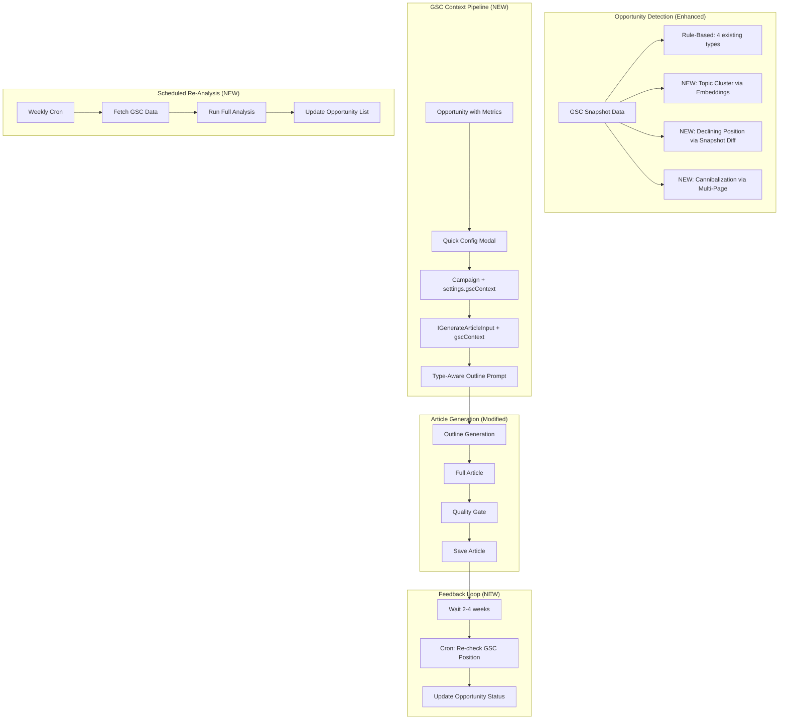
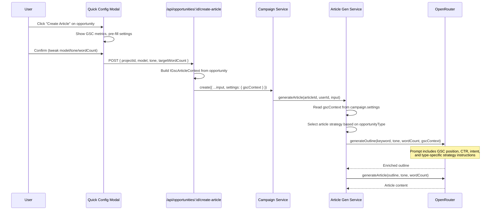
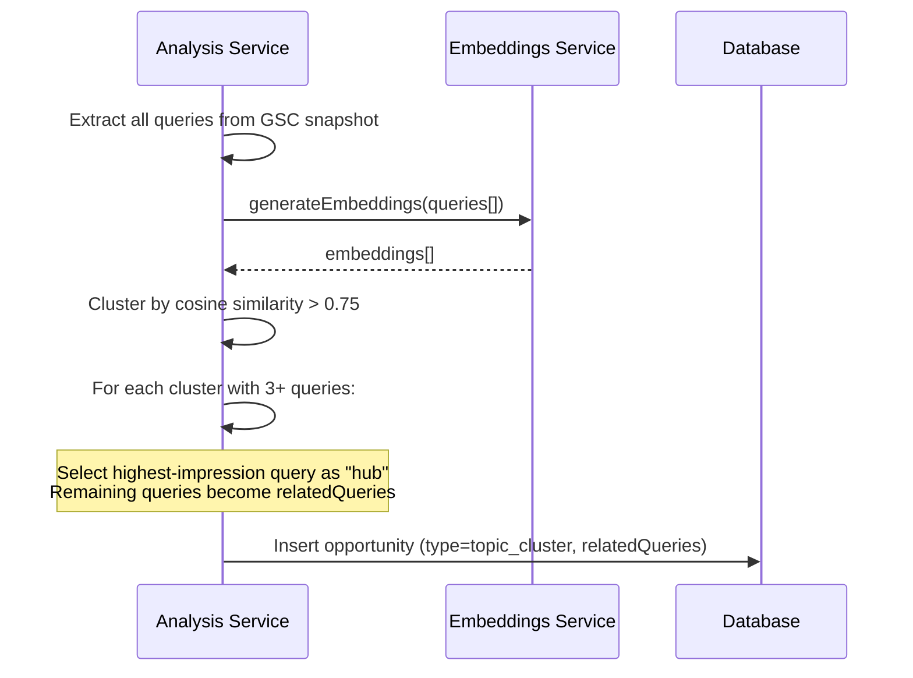
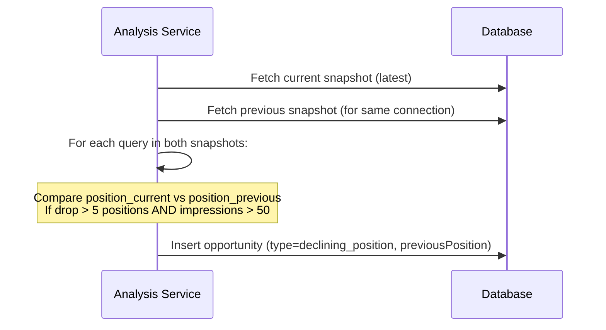
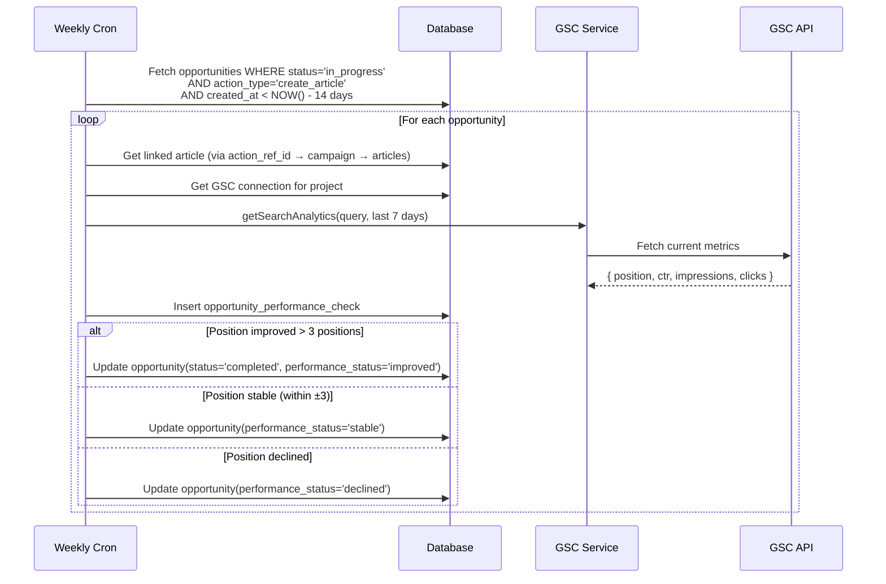

# PRD: GSC-Guided Article Generation Pipeline & Opportunity Completeness

**Complexity: 10 → HIGH mode** (cross-cutting pipeline changes, 3 new detection algorithms, new cron job, new UI modal, DB schema changes, AI prompt modifications, feedback loop system, 25+ files)

**Depends on:** `gsc-integration.md` (implemented), `campaign-management.md` (implemented)

---

## 1. Context

**Problem:** Articles created from GSC opportunities are generated completely blind — zero SEC context (metrics, position, intent, opportunity type) flows into the article generation prompts. A `content_gap` article (write from scratch for unranked query) is generated identically to a `low_hanging_fruit` article (optimize existing ranking). Additionally, 3 of 7 opportunity types (topic_cluster, declining_position, cannibalization) are defined but never detected. There's no scheduled re-analysis, no configuration when creating articles from opportunities, and no feedback loop to track if generated articles actually improve rankings.

**Files Analyzed:**

- `src/pages/api/opportunities/[id]/create-article.ts` — creates bare campaign with ZERO context
- `server/services/opportunity-analysis.service.ts` — only detects 4 of 7 types
- `server/services/article-generation.service.ts` — full pipeline, no GSC awareness
- `server/services/prompts/article-prompts.ts` — prompts accept only keyword/tone/wordCount
- `server/services/campaign.service.ts` — `create()` method, ICreateCampaignInput
- `shared/types/article.types.ts` — IGenerateArticleInput has no GSC fields
- `shared/types/opportunity.types.ts` — all 7 types defined but 3 unimplemented
- `shared/types/campaign.types.ts` — ICampaign, settings JSONB field (available for context)
- `shared/config/opportunity.config.ts` — thresholds, priority weights, AI prompt
- `shared/constants/writing-guidelines.ts` — humanizer prompt guidelines
- `client/components/dashboard/views/opportunities/OpportunityDetailPanel.tsx` — detail panel
- `client/hooks/useOpportunities.ts` — client hook
- `src/pages/api/cron/process-scheduled-campaigns/index.ts` — cron pattern reference
- `supabase/migrations/20260211000400_create_gsc_snapshots.sql` — snapshots schema
- `supabase/migrations/20260211000500_create_opportunities.sql` — opportunities schema

**Current Behavior:**

- `create-article.ts` passes ONLY `{ name: opp.title, projectId, keywords: [opp.query] }` to campaign creation — no metrics, no type, no tone, no model config
- Article generation prompts (`getOutlinePrompt`, `getArticlePrompt`) accept only keyword, tone, targetWordCount — no GSC context parameter
- `IGenerateArticleInput` has no field for opportunity/GSC context
- Only 4 opportunity types are detected: `content_gap`, `low_hanging_fruit`, `low_ctr`, `thin_content`
- `topic_cluster` — not implemented (requires query grouping logic)
- `declining_position` — not implemented (requires multi-snapshot comparison, comment in code: "future enhancement")
- `cannibalization` — not implemented (requires multi-page analysis per query)
- User must manually click "Analyze Now" — no scheduled re-analysis
- No mechanism to track if articles from opportunities improve GSC rankings

---

## 2. Solution

**Approach:**

- Thread GSC context (opportunity type, metrics, intent signals) through campaign `settings` JSONB → article generation input → outline/article prompts
- Create type-specific article generation strategies that produce fundamentally different content based on opportunity type
- Implement 3 missing detection algorithms: topic_cluster (semantic grouping via embeddings), declining_position (snapshot-over-snapshot comparison), cannibalization (multi-page query overlap)
- Replace bare "Create Article" redirect with a quick config modal that shows GSC context and lets users tweak model/tone/word count
- Add a cron job for weekly GSC re-analysis per project (piggyback on existing cron infrastructure)
- Build a feedback loop that re-checks GSC positions 2-4 weeks after article publication and updates opportunity status

**Architecture Diagram:**



**Key Decisions:**

- [x] **Campaign `settings` JSONB** for threading GSC context (no schema change to campaigns table)
- [x] **Type-specific prompt strategies** — 3 distinct article strategies (new_content, optimize_existing, topic_hub)
- [x] **OpenAI embeddings** for topic clustering (reuse existing `openai-embeddings.service.ts`)
- [x] **Snapshot diff** for declining position — compare latest snapshot vs previous snapshot per project
- [x] **Same credit cost** — GSC-guided articles cost the same as regular articles
- [x] **Graceful degradation** — if GSC context missing, prompts fall back to current behavior
- [x] **Existing cron pattern** — new cron routes use same `CronController` pattern + `x-cron-secret` auth
- [x] **Feedback loop is passive** — cron-based, no user action needed. Re-checks positions automatically

**Data Changes:**

### Modified: `campaigns.settings` JSONB

No schema change needed. New `gscContext` key stored in existing JSONB:

```typescript
// campaigns.settings.gscContext (when created from opportunity)
interface IGscArticleContext {
  opportunityId: string;
  opportunityType: OpportunityType;
  query: string;
  metrics: {
    position: number;
    ctr: number;
    impressions: number;
    clicks: number;
    avgCtrForPosition?: number;
    competingPages?: string[];
  };
  articleStrategy: 'new_content' | 'optimize_existing' | 'topic_hub';
  relatedQueries?: string[];  // for topic_cluster
  pageUrl?: string;           // for low_hanging_fruit, low_ctr
}
```

### New Migration: `opportunity_performance_checks`

```sql
CREATE TABLE opportunity_performance_checks (
  id UUID PRIMARY KEY DEFAULT gen_random_uuid(),
  opportunity_id UUID NOT NULL REFERENCES opportunities(id) ON DELETE CASCADE,
  article_id UUID REFERENCES articles(id) ON DELETE SET NULL,
  check_date DATE NOT NULL,
  position_before NUMERIC(6,2),
  position_after NUMERIC(6,2),
  ctr_before NUMERIC(6,4),
  ctr_after NUMERIC(6,4),
  impressions_before INTEGER,
  impressions_after INTEGER,
  clicks_before INTEGER,
  clicks_after INTEGER,
  status TEXT NOT NULL CHECK (status IN ('improved', 'stable', 'declined', 'not_found')),
  created_at TIMESTAMPTZ NOT NULL DEFAULT NOW()
);
CREATE INDEX idx_opp_perf_opportunity ON opportunity_performance_checks(opportunity_id);
CREATE INDEX idx_opp_perf_article ON opportunity_performance_checks(article_id);
```

### Modified: `opportunities` table — add scheduling columns

```sql
ALTER TABLE opportunities ADD COLUMN IF NOT EXISTS last_checked_at TIMESTAMPTZ;
ALTER TABLE opportunities ADD COLUMN IF NOT EXISTS performance_status TEXT CHECK (performance_status IN ('pending', 'improved', 'stable', 'declined', 'not_found'));
```

### Modified: `gsc_connections` table — add schedule columns

```sql
ALTER TABLE gsc_connections ADD COLUMN IF NOT EXISTS auto_analyze BOOLEAN DEFAULT false;
ALTER TABLE gsc_connections ADD COLUMN IF NOT EXISTS analyze_frequency TEXT DEFAULT 'weekly' CHECK (analyze_frequency IN ('daily', 'weekly', 'biweekly'));
ALTER TABLE gsc_connections ADD COLUMN IF NOT EXISTS next_analyze_at TIMESTAMPTZ;
ALTER TABLE gsc_connections ADD COLUMN IF NOT EXISTS last_analyzed_at TIMESTAMPTZ;
```

---

## 3. Sequence Flows

### GSC Context → Article Generation



### Topic Cluster Detection



### Declining Position Detection



### Performance Feedback Loop



---

## 4. Integration Points

**How will this feature be reached?**

- [x] Entry point: Modified "Create Article" button in `OpportunityDetailPanel` and `OpportunityActions`
- [x] Entry point: New cron route `/api/cron/analyze-opportunities`
- [x] Entry point: New cron route `/api/cron/check-opportunity-performance`
- [x] Caller: `OpportunityDetailPanel.onCreateArticle()` opens modal instead of direct API call
- [x] Registration: New cron routes registered in Cloudflare Worker cron triggers

**Is this user-facing?**

- [x] YES — Quick config modal, enhanced opportunity detail panel with performance indicators, auto-analysis settings in GSC connection card

**Full user flow:**

1. User navigates to `/dashboard/opportunities` → sees prioritized list
2. Clicks "Create Article" on a content opportunity
3. **NEW**: Quick Config Modal opens showing:
   - GSC metrics summary (position, CTR, impressions)
   - Opportunity type context ("This is a content gap — you need a comprehensive new article")
   - Pre-filled settings: model (based on estimated_impact), tone, word count
   - "Create & Start" button
4. User confirms → campaign created with GSC context in settings
5. Article generation uses type-specific prompts:
   - `content_gap` → comprehensive new article targeting the query directly
   - `low_hanging_fruit` → focused optimization article better than position 8-20 competition
   - `topic_cluster` → hub article with internal linking to sub-topics
6. 2-4 weeks later, cron checks GSC positions
7. Opportunity status auto-updates to "completed" (improved) or flags "needs attention" (declined)
8. User sees performance indicators on opportunity cards

---

## 5. Execution Phases

### Phase 1: GSC Context Pipeline — Threading Context to Prompts

**User-visible outcome:** Articles created from opportunities are generated with GSC-aware prompts that produce fundamentally different content based on opportunity type.

**Files (5):**

- `shared/types/opportunity.types.ts` — ADD `IGscArticleContext`, `ArticleStrategy` type
- `server/services/prompts/article-prompts.ts` — MODIFY: accept `gscContext` parameter in outline prompt
- `shared/config/opportunity.config.ts` — ADD type-to-strategy mapping, strategy-specific prompt instructions
- `server/services/article-generation.service.ts` — MODIFY: read `gscContext` from campaign settings, pass to prompts
- `shared/types/article.types.ts` — MODIFY: add optional `gscContext` to `IGenerateArticleInput`

**Implementation:**

- [ ] Define `IGscArticleContext` interface in `opportunity.types.ts`:
  ```typescript
  interface IGscArticleContext {
    opportunityId: string;
    opportunityType: OpportunityType;
    query: string;
    metrics: IOpportunityMetrics;
    articleStrategy: ArticleStrategy;
    relatedQueries?: string[];
    pageUrl?: string;
  }
  type ArticleStrategy = 'new_content' | 'optimize_existing' | 'topic_hub';
  ```
- [ ] Add `ARTICLE_STRATEGY_MAP` in `opportunity.config.ts`:
  ```typescript
  content_gap → 'new_content'
  low_hanging_fruit → 'optimize_existing'
  topic_cluster → 'topic_hub'
  ```
- [ ] Add `STRATEGY_PROMPT_INSTRUCTIONS` in `opportunity.config.ts` — 3 distinct prompt blocks:
  - `new_content`: "Create a comprehensive, authoritative article on this topic. The user's site has NO existing content for this query. The article must be THE definitive resource. Target position 1-3. The query gets {impressions} monthly impressions."
  - `optimize_existing`: "The user already ranks at position {position} for this query with {ctr}% CTR. Create content that is significantly better and more comprehensive than what currently ranks at positions 1-7. Focus on: depth, unique insights, better structure."
  - `topic_hub`: "Create a pillar/hub article that serves as the central resource for this topic cluster. Related sub-topics to reference: {relatedQueries}. Structure the article to naturally link to future sub-topic articles."
- [ ] Modify `getOutlinePrompt()` to accept optional `gscContext: IGscArticleContext` parameter:
  - When present, inject strategy-specific instructions + metrics context after the main requirements
  - When absent, behavior unchanged (backwards compatible)
- [ ] Add optional `gscContext?: IGscArticleContext` to `IGenerateArticleInput`
- [ ] Modify `ArticleGenerationService.generateArticle()`:
  - After reading campaign from DB, extract `settings.gscContext` if present
  - Pass to `generateOutline()` and `getOutlinePrompt()`

**Verification Plan:**

1. **Unit Tests:**
   - File: `tests/unit/server/services/prompts/article-prompts.unit.spec.ts`
   - Tests:
     - `should include GSC context in outline prompt when provided`
     - `should use new_content strategy for content_gap opportunities`
     - `should use optimize_existing strategy with position data for low_hanging_fruit`
     - `should use topic_hub strategy with related queries for topic_cluster`
     - `should omit GSC context when not provided (backwards compatible)`

2. **Unit Tests:**
   - File: `tests/unit/shared/config/opportunity.config.unit.spec.ts`
   - Tests:
     - `should map all content opportunity types to a strategy`
     - `should have strategy prompt for each strategy type`

---

### Phase 2: Create-Article Quick Config Modal

**User-visible outcome:** Clicking "Create Article" on an opportunity opens a modal showing GSC context with configurable settings instead of immediately creating a bare campaign.

**Files (5):**

- `client/components/dashboard/views/opportunities/CreateArticleModal.tsx` — **NEW** modal component
- `client/hooks/useOpportunities.ts` — MODIFY: update `createArticle` to accept config, thread through
- `client/components/dashboard/views/opportunities/OpportunityDetailPanel.tsx` — MODIFY: open modal instead of direct API call
- `src/pages/api/opportunities/[id]/create-article.ts` — MODIFY: accept model/tone/targetWordCount, build gscContext
- `shared/validation/opportunity-detail.schema.ts` — MODIFY: add optional config fields to schema

**Implementation:**

- [ ] Create `CreateArticleModal`:
  - Header: opportunity title + type badge
  - GSC Context Card: position, CTR, impressions (from opportunity.metrics)
  - Strategy Explanation: "This is a {type} opportunity. We'll generate a {strategy} article."
  - Config form (pre-filled with smart defaults):
    - Model selector (pre-select based on estimated_impact: high→pro, medium→balanced, low→budget)
    - Tone selector (default: professional)
    - Word count slider (default by type: content_gap→2000, low_hanging_fruit→1800, topic_cluster→2500)
    - Image preset selector (optional)
  - For topic_cluster: show related queries that will influence the article
  - Credit cost estimate
  - "Create & Start" primary CTA, "Cancel" secondary
- [ ] Modify `createArticleFromOpportunitySchema` to accept optional:
  ```typescript
  model?: z.string()
  tone?: z.enum(['professional', 'casual', 'witty', 'academic'])
  targetWordCount?: z.number().min(800).max(3000)
  imagePreset?: z.string()
  autoStart?: z.boolean().default(true)
  ```
- [ ] Modify `create-article.ts` API route:
  - Build `IGscArticleContext` from opportunity data
  - Pass `model`, `tone`, `targetWordCount`, `imagePreset` to `campaignService.create()`
  - Store `gscContext` in `campaign.settings`
  - If `autoStart: true`, trigger campaign start after creation
- [ ] Modify `useOpportunities.createArticle()` to pass config object
- [ ] Modify `OpportunityDetailPanel` to open `CreateArticleModal` instead of calling API directly

**Verification Plan:**

1. **Unit Tests:**
   - File: `tests/unit/client/components/CreateArticleModal.unit.spec.tsx`
   - Tests:
     - `should display opportunity metrics in GSC context card`
     - `should pre-select model based on estimated_impact`
     - `should show related queries for topic_cluster opportunities`
     - `should calculate credit cost with selected model + images`
     - `should submit with configured settings`

2. **API Tests:**
   - File: `tests/api/opportunities.create-article.api.spec.ts`
   - Tests:
     - `should store gscContext in campaign settings when creating from opportunity`
     - `should accept model/tone/targetWordCount overrides`
     - `should auto-start campaign when autoStart is true`

3. **User Verification:**
   - Click "Create Article" on content_gap opportunity
   - Expected: Modal opens with position/CTR/impressions displayed, "Pro" model pre-selected (high impact)
   - Confirm → campaign created AND started, redirect to campaign detail

---

### Phase 3: Missing Opportunity Type — Topic Cluster Detection

**User-visible outcome:** GSC analysis detects groups of related queries and surfaces them as topic_cluster opportunities with multiple keywords, enabling hub-article generation.

**Files (5):**

- `server/services/opportunity-analysis.service.ts` — MODIFY: add topic cluster detection method
- `shared/config/opportunity.config.ts` — ADD cluster thresholds
- `shared/types/opportunity.types.ts` — MODIFY: add `relatedQueries` to `IOpportunityMetrics`
- `src/pages/api/opportunities/[id]/create-article.ts` — MODIFY: handle topic_cluster (multi-keyword campaign)
- `server/services/openai-embeddings.service.ts` — no changes, reuse existing service

**Implementation:**

- [ ] Add cluster config to `opportunity.config.ts`:
  ```typescript
  TOPIC_CLUSTER: {
    minClusterSize: 3,         // minimum queries in a cluster
    similarityThreshold: 0.75, // cosine similarity threshold
    minTotalImpressions: 200,  // cluster must have meaningful volume
    maxClusters: 10,           // cap per analysis
  }
  ```
- [ ] Add `detectTopicClusters()` method to `OpportunityAnalysisService`:
  1. Collect all queries from snapshot with impressions > 10
  2. Generate embeddings for all queries via `openaiEmbeddingsService`
  3. Agglomerative clustering: group queries where pairwise cosine similarity > 0.75
  4. Filter clusters with fewer than 3 queries
  5. For each cluster:
     - Select query with highest impressions as "hub query"
     - Remaining queries become `relatedQueries`
     - Calculate aggregate metrics (total impressions, avg position)
     - Create opportunity with `type: 'topic_cluster'`
- [ ] Add `relatedQueries?: string[]` to `IOpportunityMetrics` interface
- [ ] Integrate `detectTopicClusters()` into main `analyzeSnapshot()` pipeline (after rule-based detection)
- [ ] Modify `create-article.ts`: for `topic_cluster`, create campaign with ALL related queries as keywords (not just the hub query)

**Verification Plan:**

1. **Unit Tests:**
   - File: `tests/unit/server/services/opportunity-analysis.service.unit.spec.ts`
   - Tests:
     - `should cluster queries with cosine similarity > 0.75`
     - `should select highest-impression query as hub`
     - `should store related queries in opportunity metrics`
     - `should not create cluster with fewer than 3 queries`
     - `should cap clusters at maxClusters limit`
     - `should create multi-keyword campaign from topic_cluster opportunity`

---

### Phase 4: Missing Opportunity Type — Declining Position Detection

**User-visible outcome:** System detects queries that have lost significant ranking positions by comparing the current GSC snapshot against the previous one, alerting users to content that needs refreshing.

**Files (4):**

- `server/services/opportunity-analysis.service.ts` — MODIFY: add declining position detection
- `shared/config/opportunity.config.ts` — already has DECLINING_POSITION threshold (positionDropThreshold: 5)
- `src/pages/api/opportunities/analyze.ts` — MODIFY: fetch previous snapshot for comparison
- `shared/types/opportunity.types.ts` — MODIFY: add `previousPosition`/`positionChange` (already in IOpportunityMetrics)

**Implementation:**

- [ ] Add `detectDecliningPositions()` method to `OpportunityAnalysisService`:
  1. Accept current snapshot data AND previous snapshot data
  2. Build a lookup map of previous query → position
  3. For each query in current snapshot:
     - If query exists in previous snapshot
     - AND position_current - position_previous >= `positionDropThreshold` (5)
     - AND impressions >= 50 (meaningful volume)
     - Create opportunity with `type: 'declining_position'`
     - Store `previousPosition` and `positionChange` in metrics
  4. Skip queries that are brand new (not in previous snapshot)
- [ ] Modify `analyze.ts` API route:
  - After fetching current snapshot, also fetch the most recent _previous_ snapshot for the same connection
  - Pass both to `analyzeSnapshot()` as new optional `previousSnapshot` parameter
- [ ] Modify `analyzeSnapshot()` signature to accept optional `previousSnapshot: IGscSnapshot`
- [ ] Call `detectDecliningPositions()` when `previousSnapshot` is available

**Verification Plan:**

1. **Unit Tests:**
   - File: `tests/unit/server/services/opportunity-analysis.service.unit.spec.ts`
   - Tests:
     - `should detect declining position when drop > 5`
     - `should not flag queries with position drop < 5`
     - `should store previousPosition and positionChange in metrics`
     - `should skip queries not in previous snapshot`
     - `should skip declining detection when no previous snapshot available`
     - `should require minimum 50 impressions for declining detection`

---

### Phase 5: Missing Opportunity Type — Cannibalization Detection

**User-visible outcome:** System detects when multiple pages from the user's site compete for the same query, suggesting consolidation.

**Files (3):**

- `server/services/opportunity-analysis.service.ts` — MODIFY: add cannibalization detection
- `shared/config/opportunity.config.ts` — ADD cannibalization thresholds
- `shared/types/opportunity.types.ts` — already has `competingPages` in `IOpportunityMetrics`

**Implementation:**

- [ ] Add cannibalization config to `opportunity.config.ts`:
  ```typescript
  CANNIBALIZATION: {
    minPages: 2,               // minimum pages ranking for same query
    minImpressions: 30,        // query must have meaningful volume
    maxPositionSpread: 20,     // both pages within top 20
  }
  ```
- [ ] Add `detectCannibalization()` method to `OpportunityAnalysisService`:
  1. The GSC API returns rows with dimensions `[query, page]` — group by query
  2. For each query with 2+ pages in the results:
     - Both pages must have position <= 20
     - Query must have >= 30 total impressions
     - Create opportunity with `type: 'cannibalization'`
     - Store `competingPages: string[]` in metrics
     - Store metrics from the highest-ranking page
  3. Category: 'technical' (requires page consolidation, not new content)
- [ ] Note: GSC snapshot `data.queries` currently aggregates by query only. Need to also use raw row data (query+page pairs) from GSC API. Modify `IGscSnapshotData` to include `queryPagePairs` alongside aggregated `queries`.
- [ ] Integrate into `analyzeSnapshot()` pipeline

**Verification Plan:**

1. **Unit Tests:**
   - File: `tests/unit/server/services/opportunity-analysis.service.unit.spec.ts`
   - Tests:
     - `should detect cannibalization when 2+ pages rank for same query`
     - `should store competing page URLs in metrics`
     - `should not flag single-page queries`
     - `should require minimum 30 impressions`
     - `should classify cannibalization as technical category`

---

### Phase 6: Database Migration + Scheduled Re-Analysis Cron

**User-visible outcome:** GSC data is automatically refreshed on a schedule (weekly by default), and new opportunities are detected without manual intervention.

**Files (5):**

- `supabase/migrations/YYYYMMDDHHMMSS_opportunities_scheduling.sql` — NEW migration (all schema changes)
- `src/pages/api/cron/analyze-opportunities/index.ts` — NEW cron route
- `server/services/opportunity-scheduler.service.ts` — NEW service for scheduled analysis
- `client/components/dashboard/views/opportunities/GscConnectionCard.tsx` — MODIFY: add auto-analyze toggle
- `shared/config/security.ts` — ADD cron route to public routes

**Implementation:**

- [ ] Create migration:
  - Add `auto_analyze`, `analyze_frequency`, `next_analyze_at`, `last_analyzed_at` to `gsc_connections`
  - Add `last_checked_at`, `performance_status` to `opportunities`
  - Create `opportunity_performance_checks` table with RLS
- [ ] Create `OpportunitySchedulerService`:
  - `getConnectionsDueForAnalysis()` — query `gsc_connections` where `auto_analyze = true AND next_analyze_at <= NOW()`
  - `runScheduledAnalysis(connectionId)` — same flow as manual "Analyze Now" but triggered by cron
  - `calculateNextAnalyzeAt(frequency)` — based on analyze_frequency setting
  - `updateScheduleAfterAnalysis(connectionId)` — update `last_analyzed_at` and `next_analyze_at`
- [ ] Create cron route `POST /api/cron/analyze-opportunities`:
  - Authenticated via `x-cron-secret` header (same as existing crons)
  - Find all connections due for analysis
  - Process up to 5 connections per run (prevent timeout)
  - Background processing via `ctx.waitUntil()`
- [ ] Add `/api/cron/analyze-opportunities` to `PUBLIC_API_ROUTES` in `security.ts`
- [ ] Modify `GscConnectionCard` connected state:
  - Add "Auto-analyze" toggle switch (default: off)
  - When enabled, show frequency selector (weekly/biweekly)
  - Show "Next analysis: {date}" when scheduled
  - API: `PATCH /api/gsc/connections/:id` to update auto_analyze settings

**Verification Plan:**

1. **Unit Tests:**
   - File: `tests/unit/server/services/opportunity-scheduler.service.unit.spec.ts`
   - Tests:
     - `should find connections due for analysis`
     - `should calculate next analyze date based on frequency`
     - `should process max 5 connections per cron run`
     - `should update schedule after successful analysis`

2. **API Tests:**
   - File: `tests/api/cron/analyze-opportunities.api.spec.ts`
   - Tests:
     - `should reject requests without cron secret`
     - `should process due connections and update schedule`

3. **User Verification:**
   - Enable auto-analyze on GSC connection card
   - Expected: "Next analysis" date appears
   - After cron runs: new opportunities appear without manual trigger

---

### Phase 7: Performance Feedback Loop

**User-visible outcome:** 2-4 weeks after creating an article from an opportunity, the system automatically checks GSC rankings and shows whether the article improved, maintained, or hurt the ranking.

**Files (5):**

- `src/pages/api/cron/check-opportunity-performance/index.ts` — NEW cron route
- `server/services/opportunity-performance.service.ts` — NEW service for performance tracking
- `client/components/dashboard/views/opportunities/OpportunityDetailPanel.tsx` — MODIFY: show performance indicators
- `client/components/dashboard/views/OpportunitiesView.tsx` — MODIFY: show performance badges
- `shared/config/security.ts` — ADD cron route to public routes

**Implementation:**

- [ ] Create `OpportunityPerformanceService`:
  - `getOpportunitiesDueForCheck()`:
    - Opportunities with `status = 'in_progress'` AND `action_type = 'create_article'`
    - Created at least 14 days ago (give articles time to index)
    - NOT checked in the last 7 days (avoid over-checking)
  - `checkPerformance(opportunity)`:
    1. Get the linked campaign via `action_ref_id`
    2. Find generated articles in that campaign
    3. Get the project's active GSC connection
    4. Fetch current GSC metrics for the opportunity's query (last 7 days)
    5. Compare against original opportunity metrics (stored in `opportunity.metrics`)
    6. Determine status: improved (position gained >3), stable (±3), declined (lost >3), not_found (no data)
    7. Insert `opportunity_performance_check` record
    8. Update `opportunity.performance_status` and `opportunity.last_checked_at`
    9. If improved by >5 positions: auto-complete opportunity (`status = 'completed'`)
- [ ] Create cron route `POST /api/cron/check-opportunity-performance`:
  - Authenticated via `x-cron-secret`
  - Run weekly
  - Process up to 20 opportunities per run
  - Background processing via `ctx.waitUntil()`
- [ ] Add `/api/cron/check-opportunity-performance` to `PUBLIC_API_ROUTES`
- [ ] Modify `OpportunityDetailPanel`:
  - Show "Performance" section when `performance_status` is set
  - Green card: "Position improved from {before} to {after}" with up arrow
  - Yellow card: "Position stable at ~{current}"
  - Red card: "Position declined from {before} to {after}" with suggestions
  - Timeline of performance checks
- [ ] Modify `OpportunitiesView`:
  - Add small performance badge on opportunity cards (green/yellow/red dot)
  - Filter option: `performance_status`

**Verification Plan:**

1. **Unit Tests:**
   - File: `tests/unit/server/services/opportunity-performance.service.unit.spec.ts`
   - Tests:
     - `should find opportunities due for check (14+ days old, not recently checked)`
     - `should compare current GSC metrics against original opportunity metrics`
     - `should mark as improved when position gained > 3`
     - `should mark as stable when position change <= 3`
     - `should mark as declined when position lost > 3`
     - `should auto-complete opportunity when improved by > 5 positions`
     - `should handle missing GSC data gracefully (not_found status)`

2. **API Tests:**
   - File: `tests/api/cron/check-opportunity-performance.api.spec.ts`
   - Tests:
     - `should reject requests without cron secret`
     - `should process eligible opportunities and insert performance checks`

3. **User Verification:**
   - Create article from opportunity → wait 14+ days (or manually adjust dates for testing)
   - Cron runs → performance check created
   - View opportunity detail → "Performance" section shows position change
   - Opportunity cards show green/yellow/red dot

---

## 6. Environment Variables

No new environment variables needed. All features reuse existing:

- `OPENROUTER_API_KEY` — for AI enrichment (existing)
- `GOOGLE_OAUTH_CLIENT_SECRET` — for GSC API access (existing)
- `OPENAI_API_KEY` — for topic cluster embeddings (existing)
- `CRON_SECRET` — for cron authentication (existing)

---

## 7. Cron Schedule Summary

| Cron Route | Schedule | Purpose |
|-----------|----------|---------|
| `/api/cron/analyze-opportunities` | Every 6 hours | Process scheduled GSC re-analyses |
| `/api/cron/check-opportunity-performance` | Weekly (Mondays) | Check performance of articles created from opportunities |

Both use existing cron pattern: `x-cron-secret` header auth, `ctx.waitUntil()` for background processing, rate-limited per run.

---

## 8. Article Strategy Prompt Details

### Strategy: `new_content` (for `content_gap`)

```
SEO CONTEXT:
This article targets a content gap opportunity. Your site has NO existing content for the query "{query}".
This query receives approximately {impressions} monthly impressions with no clicks going to your site.

STRATEGY:
- Create the DEFINITIVE resource on this topic
- Target search intent: informational/transactional (inferred from query structure)
- Go deeper and more comprehensive than the top 3 results
- Include actionable takeaways, not just theory
- Aim for position 1-3 in search results
```

### Strategy: `optimize_existing` (for `low_hanging_fruit`)

```
SEO CONTEXT:
This article targets a low-hanging-fruit opportunity. Your site currently ranks at position {position}
for the query "{query}" with a CTR of {ctr}%. The expected CTR for this position is {avgCtrForPosition}%.
The query receives {impressions} monthly impressions.

STRATEGY:
- Create content that is SIGNIFICANTLY better than what currently occupies positions 1-7
- Address the exact search intent more directly and completely
- Include unique data, examples, or perspectives that competitors miss
- Optimize for both the primary keyword and related long-tail variations
- Target moving from position {position} to top 5
```

### Strategy: `topic_hub` (for `topic_cluster`)

```
SEO CONTEXT:
This article is a PILLAR/HUB article for a topic cluster. The primary topic is "{query}".
Related sub-topics in this cluster: {relatedQueries}
Total cluster search volume: approximately {impressions} monthly impressions.

STRATEGY:
- Create a comprehensive pillar article that covers the primary topic broadly
- Mention and briefly explain each related sub-topic: {relatedQueries}
- Structure the article so each sub-topic section could naturally link to a dedicated article
- Use the sub-topics as H2/H3 sections within the hub article
- This article should be the "table of contents" for the topic cluster
- Aim for 2000-2500 words to adequately cover the breadth of the cluster
```

---

## 9. Acceptance Criteria

- [ ] All 7 phases complete
- [ ] All specified tests pass
- [ ] `yarn verify` passes
- [ ] All automated checkpoint reviews passed
- [ ] **Pipeline**: Articles from opportunities include GSC context in prompts (verifiable in article outline/content)
- [ ] **Pipeline**: Different opportunity types produce visibly different article structures
- [ ] **Modal**: Quick config modal shows GSC metrics and allows model/tone/wordCount override
- [ ] **Modal**: Auto-start generates article immediately after campaign creation
- [ ] **Topic Cluster**: Analysis detects and groups related queries from GSC data
- [ ] **Topic Cluster**: "Create Article" from topic_cluster creates multi-keyword campaign
- [ ] **Declining Position**: Analysis compares snapshots and detects position drops > 5
- [ ] **Cannibalization**: Analysis detects multiple pages ranking for the same query
- [ ] **Scheduled Analysis**: GSC data re-analyzed automatically when auto-analyze enabled
- [ ] **Feedback Loop**: Performance checks run 14+ days after article creation
- [ ] **Feedback Loop**: Opportunity cards show performance indicators (improved/stable/declined)
- [ ] **Backwards Compatible**: Articles NOT from opportunities generate identically to before
- [ ] No new environment variables required
- [ ] RLS policies on all new tables
- [ ] Feature respects Cloudflare 10ms CPU limit (background processing for heavy work)
