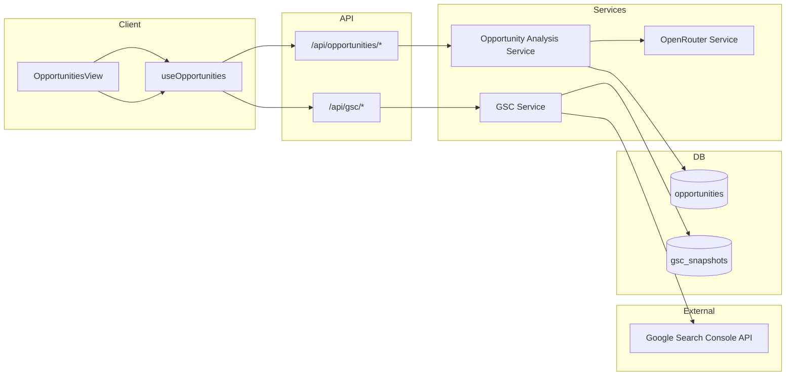
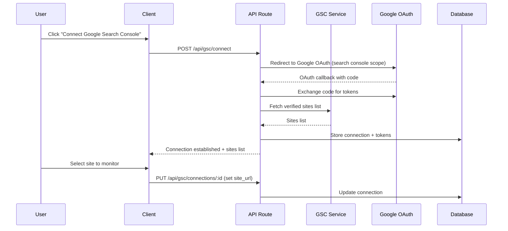
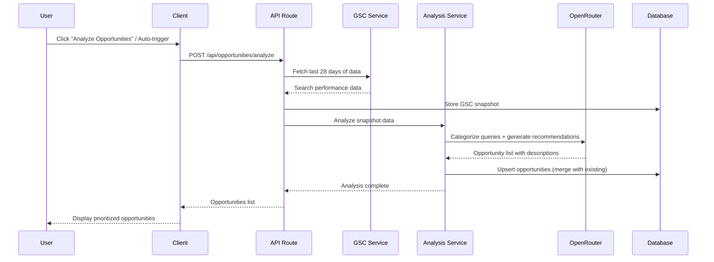
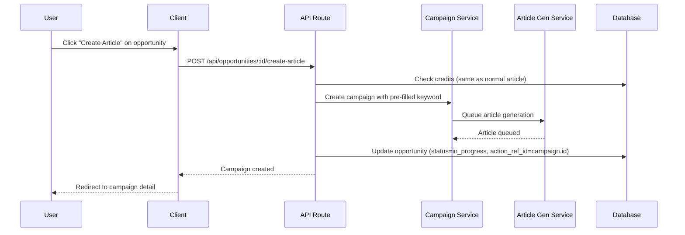

# PRD: GSC Integration (Google Search Console-Powered SEO Insights)

**Complexity: 9 → HIGH mode** (new system from scratch, external API integration, database schema changes, 15+ files, AI analysis, complex state logic)

---

## 1. Context

**Problem:** Users have no visibility into what content they should create next or what SEO issues need fixing. They manually check Google Search Console, interpret data, and decide what to do — a time-consuming process that most users skip entirely.

**Files Analyzed:**

- `client/config/dashboardRoutes.ts` — dashboard navigation config
- `client/hooks/useCampaigns.ts` — campaign hooks pattern
- `client/hooks/useArticles.ts` — article hooks pattern
- `client/hooks/useMutationWithToast.ts` — mutation wrapper pattern
- `client/utils/api-client.ts` — centralized API client
- `client/components/dashboard/views/CampaignsView.tsx` — view pattern reference
- `client/components/dashboard/views/campaign-detail/` — sub-component pattern
- `server/services/article-generation.service.ts` — article generation flow
- `server/services/openrouter.service.ts` — AI service pattern
- `shared/config/env.ts` — environment config
- `shared/config/credits.config.ts` — credit costs
- `shared/types/campaign.types.ts` — type patterns
- `src/pages/api/campaigns/index.ts` — API route pattern
- `supabase/migrations/` — migration patterns

**Current Behavior:**

- No GSC integration exists
- Users manually research keywords before creating campaigns
- No automated opportunity detection or prioritization
- No visibility into SEO issues (declining rankings, low CTR, etc.)
- Article creation requires manual keyword input via campaign creation

---

## 2. Solution

**Approach:**

- Add Google OAuth scope for Search Console API access (reuse existing Google OAuth flow)
- Create a GSC service that fetches search performance data for the user's verified sites
- Build an AI-powered analysis pipeline that categorizes GSC data into actionable opportunities
- Display opportunities in a new dashboard tab with auto-prioritization and manual actions
- Allow one-click campaign/article creation from any content opportunity

**Architecture Diagram:**



**Key Decisions:**

- [x] **Google OAuth + API** for GSC data ingestion (user already authenticates via Google)
- [x] **AI-powered analysis** via OpenRouter to categorize and describe opportunities
- [x] **Content + Technical SEO** opportunity types (blog ideas, CTR fixes, declining pages, cannibalization, thin content)
- [x] **Same credit cost** as normal article generation when creating content from opportunities
- [x] **Opportunity discovery is free** — only article generation costs credits
- [x] Reuse existing `openrouter.service.ts` for AI analysis
- [x] Reuse existing `api-client.ts` + `apiFetch()` for client-side API calls
- [x] Reuse existing `useMutationWithToast()` pattern for mutations
- [x] Store GSC snapshots (not raw query-level data) to stay within Cloudflare 10ms CPU limit

**Data Changes:**

### New Tables

**`gsc_connections`** — Tracks which Google accounts are connected for GSC access

| Column | Type | Notes |
|--------|------|-------|
| id | UUID | PK |
| user_id | UUID | FK → profiles |
| project_id | UUID | FK → projects |
| google_email | TEXT | Connected Google account |
| site_url | TEXT | GSC verified site URL |
| access_token | TEXT | Encrypted OAuth access token |
| refresh_token | TEXT | Encrypted OAuth refresh token |
| token_expires_at | TIMESTAMPTZ | Token expiry |
| last_synced_at | TIMESTAMPTZ | Last successful sync |
| status | TEXT | 'active' / 'disconnected' / 'error' |
| created_at | TIMESTAMPTZ | |
| updated_at | TIMESTAMPTZ | |

**`gsc_snapshots`** — Stores aggregated GSC data per sync (not raw per-query rows)

| Column | Type | Notes |
|--------|------|-------|
| id | UUID | PK |
| connection_id | UUID | FK → gsc_connections |
| project_id | UUID | FK → projects |
| user_id | UUID | FK → profiles |
| date_range_start | DATE | Start of query period |
| date_range_end | DATE | End of query period |
| data | JSONB | Aggregated queries, pages, metrics |
| query_count | INTEGER | Number of queries in snapshot |
| created_at | TIMESTAMPTZ | |

**`opportunities`** — Individual opportunity items

| Column | Type | Notes |
|--------|------|-------|
| id | UUID | PK |
| project_id | UUID | FK → projects |
| user_id | UUID | FK → profiles |
| snapshot_id | UUID | FK → gsc_snapshots (nullable) |
| type | TEXT | See Opportunity Types below |
| category | TEXT | 'content' / 'technical' |
| title | TEXT | AI-generated short title |
| description | TEXT | AI-generated explanation + recommendation |
| query | TEXT | Primary GSC query (nullable) |
| page_url | TEXT | Affected page URL (nullable) |
| metrics | JSONB | Relevant metrics (position, CTR, impressions, etc.) |
| priority_score | INTEGER | 0-100, auto-calculated |
| estimated_impact | TEXT | 'high' / 'medium' / 'low' |
| status | TEXT | 'open' / 'in_progress' / 'completed' / 'dismissed' |
| action_type | TEXT | 'create_article' / 'optimize_page' / 'fix_issue' / null |
| action_ref_id | UUID | Reference to campaign/article created (nullable) |
| created_at | TIMESTAMPTZ | |
| updated_at | TIMESTAMPTZ | |

### Opportunity Types

| Type | Category | Description |
|------|----------|-------------|
| `content_gap` | content | Keyword with impressions but no ranking page — write new article |
| `low_hanging_fruit` | content | Position 8-20 with good impressions — create targeted content |
| `topic_cluster` | content | Group of related queries that could form a content cluster |
| `low_ctr` | technical | Page ranking well but CTR below average — improve title/meta |
| `declining_position` | technical | Page losing rankings over time — needs content refresh |
| `thin_content` | technical | Page with few impressions despite ranking — needs expansion |
| `cannibalization` | technical | Multiple pages competing for same query — consolidate |

---

## 3. Sequence Flow

### GSC Connection Flow



### Opportunity Analysis Flow



### Create Article from Opportunity



---

## 4. Integration Points

**How will this feature be reached?**
- [x] Entry point: New sidebar item "Opportunities" in dashboard primary navigation
- [x] Route: `/dashboard/opportunities`
- [x] Registration: Add to `DASHBOARD_ROUTES` in `client/config/dashboardRoutes.ts`
- [x] GSC connection managed from within Opportunities view (inline setup flow)

**Is this user-facing?**
- [x] YES → Full dashboard view with table, filters, action buttons, GSC connection UI

**Full user flow:**
1. User navigates to `/dashboard/opportunities`
2. If no GSC connection → shown onboarding card to connect Google account
3. If connected → sees prioritized list of opportunities
4. Can filter by type (content/technical), sort by priority, search
5. Can click "Analyze Now" to trigger fresh analysis
6. Can click "Create Article" on content opportunities → creates pre-filled campaign
7. Can click "View Details" on technical opportunities → sees recommendations
8. Can dismiss irrelevant opportunities
9. Status updates as actions are taken (open → in_progress → completed)

---

## 5. Execution Phases

### Phase 1: Database Schema + Types

**User-visible outcome:** Foundation tables and shared types are ready for all subsequent phases.

**Files (5):**

- `supabase/migrations/YYYYMMDDHHMMSS_create_gsc_connections.sql` — gsc_connections table + RLS
- `supabase/migrations/YYYYMMDDHHMMSS_create_gsc_snapshots.sql` — gsc_snapshots table + RLS
- `supabase/migrations/YYYYMMDDHHMMSS_create_opportunities.sql` — opportunities table + RLS + indexes
- `shared/types/opportunity.types.ts` — IOpportunity, IGscConnection, IGscSnapshot, enums
- `shared/types/index.ts` — re-export new types

**Implementation:**

- [ ] Create `gsc_connections` table with RLS policies (user can only see own connections)
- [ ] Create `gsc_snapshots` table with RLS policies
- [ ] Create `opportunities` table with RLS policies + indexes on (project_id, status), (project_id, type)
- [ ] Define TypeScript interfaces matching all tables
- [ ] Define literal union types for `OpportunityType`, `OpportunityCategory`, `OpportunityStatus`

**Verification Plan:**

1. **Unit Tests:**
   - File: `tests/unit/shared/types/opportunity.types.unit.spec.ts`
   - Tests: type guards validate correctly, enum values are exhaustive

2. **Migration Verification:**
   - Apply migrations locally: `npx supabase migration up`
   - Verify tables exist with correct columns
   - Verify RLS policies are active

---

### Phase 2: GSC Service + OAuth Connection

**User-visible outcome:** Users can connect their Google Search Console account and we can fetch their search data.

**Files (5):**

- `server/services/gsc.service.ts` — Google Search Console API client
- `src/pages/api/gsc/connect.ts` — Initiate OAuth flow
- `src/pages/api/gsc/callback.ts` — Handle OAuth callback, store tokens
- `src/pages/api/gsc/connections.ts` — GET connections, DELETE disconnect
- `shared/config/env.ts` — Add `GOOGLE_OAUTH_CLIENT_SECRET` to serverEnv (client ID already exists as `PUBLIC_GOOGLE_CLIENT_ID`)

**Implementation:**

- [ ] Add `GOOGLE_OAUTH_CLIENT_SECRET` to `serverEnvSchema` in env.ts (reuse existing `PUBLIC_GOOGLE_CLIENT_ID` from clientEnv for the client ID)
- [ ] Create `GscService` class following existing service patterns (see `openrouter.service.ts`)
- [ ] Implement `getAuthUrl()` — generate Google OAuth URL with `webmasters.readonly` scope
- [ ] Implement `exchangeCode()` — exchange auth code for access + refresh tokens
- [ ] Implement `refreshToken()` — refresh expired access tokens
- [ ] Implement `getSites()` — list verified GSC sites
- [ ] Implement `getSearchAnalytics()` — fetch search performance data (queries, pages, metrics)
- [ ] Create API routes for OAuth flow (connect → callback → store)
- [ ] Create API route to list/delete connections
- [ ] Add `/api/gsc/callback` to `PUBLIC_API_ROUTES` in `shared/config/security.ts`

**Verification Plan:**

1. **Unit Tests:**
   - File: `tests/unit/server/services/gsc.service.unit.spec.ts`
   - Tests: `should build correct OAuth URL`, `should handle token refresh`, `should parse GSC response`

2. **API Proof:**
   ```bash
   # Initiate connection
   curl -X POST http://localhost:4321/api/gsc/connect \
     -H "Authorization: Bearer $TOKEN" \
     -H "Content-Type: application/json" \
     -d '{"projectId": "xxx"}' | jq .
   # Expected: {"authUrl": "https://accounts.google.com/o/oauth2/..."}

   # List connections
   curl http://localhost:4321/api/gsc/connections?projectId=xxx \
     -H "Authorization: Bearer $TOKEN" | jq .
   # Expected: {"connections": [...]}
   ```

---

### Phase 3: Opportunity Analysis Service

**User-visible outcome:** System can analyze GSC data and produce categorized, prioritized opportunities.

**Files (4):**

- `server/services/opportunity-analysis.service.ts` — AI-powered analysis pipeline
- `src/pages/api/opportunities/analyze.ts` — POST trigger analysis
- `src/pages/api/opportunities/index.ts` — GET list, PATCH update status
- `shared/config/opportunity.config.ts` — Analysis prompts, priority weights, thresholds

**Implementation:**

- [ ] Create analysis config with priority scoring weights and thresholds:
  - Position 8-20 + >100 impressions → `low_hanging_fruit` (high priority)
  - CTR < 50% of average for position → `low_ctr` (medium priority)
  - Position dropped >5 in 28 days → `declining_position` (high priority)
  - Multiple pages ranking for same query → `cannibalization` (medium priority)
  - Impressions but no clicks + no owned page → `content_gap` (high priority)
- [ ] Create `OpportunityAnalysisService`:
  - `analyzeSnapshot(snapshot, existingOpportunities)` — rule-based pre-filtering
  - `enrichWithAI(filteredOpportunities)` — OpenRouter call to generate titles + descriptions
  - `calculatePriority(opportunity)` — weighted score based on metrics + type
- [ ] Implement analysis API route (POST) — fetches GSC data, runs analysis, stores results
- [ ] Implement opportunities list API route (GET) — paginated, filterable, sortable
- [ ] Implement opportunity update API route (PATCH) — update status, dismiss

**Verification Plan:**

1. **Unit Tests:**
   - File: `tests/unit/server/services/opportunity-analysis.service.unit.spec.ts`
   - Tests: `should identify low_hanging_fruit from position 8-20`, `should detect low_ctr`, `should calculate priority score correctly`, `should merge with existing opportunities`

2. **API Proof:**
   ```bash
   # Trigger analysis
   curl -X POST http://localhost:4321/api/opportunities/analyze \
     -H "Authorization: Bearer $TOKEN" \
     -H "Content-Type: application/json" \
     -d '{"projectId": "xxx"}' | jq .
   # Expected: {"opportunities": [...], "newCount": 12, "updatedCount": 3}

   # List opportunities
   curl "http://localhost:4321/api/opportunities?projectId=xxx&category=content&status=open" \
     -H "Authorization: Bearer $TOKEN" | jq .
   # Expected: {"opportunities": [...], "total": 15}
   ```

---

### Phase 4: Dashboard View — Opportunities List

**User-visible outcome:** Users can see a prioritized list of opportunities in a new dashboard tab.

**Files (5):**

- `client/components/pages/OpportunitiesPageClient.tsx` — page wrapper
- `client/components/dashboard/views/OpportunitiesView.tsx` — main view component
- `client/hooks/useOpportunities.ts` — data fetching hook
- `client/config/dashboardRoutes.ts` — add route
- `locales/en/dashboard.json` — add i18n keys

**Implementation:**

- [ ] Create `useOpportunities(projectId)` hook:
  - Fetch opportunities list with React Query
  - `analyzeOpportunities()` mutation
  - `updateOpportunityStatus()` mutation
  - `dismissOpportunity()` mutation
- [ ] Create `OpportunitiesView`:
  - Empty state with "Connect GSC" onboarding card (if no connection)
  - Filter bar: category (content/technical), status (open/in_progress/completed/dismissed), search
  - Sortable table: priority score, type icon, title, query, metrics, status, actions
  - "Analyze Now" button in header
  - Last analyzed timestamp
- [ ] Create `OpportunitiesPageClient` page wrapper (following existing page pattern)
- [ ] Register route in `dashboardRoutes.ts` with `Lightbulb` icon from lucide-react
- [ ] Add translation keys: `sidebar.opportunities`, `opportunities.title`, `opportunities.empty`, etc.

**Verification Plan:**

1. **Unit Tests:**
   - File: `tests/unit/hooks/useOpportunities.unit.spec.ts`
   - Tests: `should fetch opportunities for project`, `should filter by category`, `should handle empty state`
   - File: `tests/unit/components/OpportunitiesView.unit.spec.tsx`
   - Tests: `should render empty state when no connection`, `should render opportunity list`, `should filter by type`

2. **User Verification:**
   - Navigate to `/dashboard/opportunities`
   - See empty state if no GSC connection
   - See opportunity list if connected (mock data for now)

---

### Phase 5: GSC Connection UI + Onboarding

**User-visible outcome:** Users can connect/disconnect their Google Search Console from within the Opportunities tab.

**Files (4):**

- `client/components/dashboard/views/opportunities/GscConnectionCard.tsx` — connect/disconnect UI
- `client/components/dashboard/views/opportunities/GscSiteSelector.tsx` — site selection after OAuth
- `client/hooks/useGscConnection.ts` — GSC connection management hook
- `client/components/dashboard/views/OpportunitiesView.tsx` — integrate connection components

**Implementation:**

- [ ] Create `useGscConnection(projectId)` hook:
  - Fetch connection status
  - `connect()` — opens Google OAuth popup/redirect
  - `disconnect()` — removes connection
  - `selectSite(siteUrl)` — sets which site to monitor
- [ ] Create `GscConnectionCard`:
  - Not connected: illustration + explanation + "Connect Google Search Console" button
  - Connected: green status dot, connected email, selected site, "Disconnect" link
  - Error state: red status dot, error message, "Reconnect" button
- [ ] Create `GscSiteSelector`:
  - Dropdown of verified sites returned from Google
  - Auto-select if only one site
- [ ] Integrate into `OpportunitiesView` — show card at top when not connected, inline status when connected

**Verification Plan:**

1. **Unit Tests:**
   - File: `tests/unit/components/GscConnectionCard.unit.spec.tsx`
   - Tests: `should show connect button when disconnected`, `should show site info when connected`, `should handle error state`

2. **User Verification:**
   - Visit Opportunities tab → see onboarding card
   - Click Connect → Google OAuth flow opens
   - After auth → site selector appears
   - Select site → connection established, card updates to connected state

---

### Phase 6: Opportunity Detail + Actions

**User-visible outcome:** Users can view full opportunity details and take actions (create article, dismiss, mark complete).

**Files (5):**

- `client/components/dashboard/views/opportunities/OpportunityDetailPanel.tsx` — slide-over/modal detail view
- `client/components/dashboard/views/opportunities/OpportunityActions.tsx` — action buttons
- `src/pages/api/opportunities/[id]/create-article.ts` — create campaign+article from opportunity
- `src/pages/api/opportunities/[id]/index.ts` — GET detail, PATCH update
- `client/hooks/useOpportunities.ts` — add `createArticleFromOpportunity()` mutation

**Implementation:**

- [ ] Create `OpportunityDetailPanel`:
  - Title, description, category badge, type badge
  - Metrics card: position, CTR, impressions, clicks (with sparkline if declining)
  - For content opportunities: "Create Article" primary CTA
  - For technical opportunities: step-by-step fix recommendations
  - Status timeline (open → in_progress → completed)
- [ ] Create `OpportunityActions`:
  - "Create Article" button (content type) → creates campaign with keyword pre-filled
  - "Mark as Done" button (technical type) → marks opportunity completed
  - "Dismiss" button → hides from list
- [ ] Create API route `POST /api/opportunities/:id/create-article`:
  - Validates opportunity exists and belongs to user
  - Checks credits (same as normal: `CREDIT_COSTS.API_CALL`)
  - Creates campaign with opportunity's keyword
  - Queues article generation
  - Updates opportunity status to `in_progress` with `action_ref_id`
- [ ] Add detail/update API route for individual opportunities

**Verification Plan:**

1. **Unit Tests:**
   - File: `tests/unit/components/OpportunityDetailPanel.unit.spec.tsx`
   - Tests: `should show create article CTA for content type`, `should show fix steps for technical type`
   - File: `tests/unit/api/opportunities.create-article.unit.spec.ts`
   - Tests: `should create campaign from opportunity`, `should check credits`, `should update opportunity status`

2. **API Proof:**
   ```bash
   # Create article from opportunity
   curl -X POST http://localhost:4321/api/opportunities/OPP_ID/create-article \
     -H "Authorization: Bearer $TOKEN" \
     -H "Content-Type: application/json" \
     -d '{"projectId": "xxx"}' | jq .
   # Expected: {"campaignId": "...", "articleId": "..."}
   ```

3. **User Verification:**
   - Click an opportunity row → detail panel slides open
   - See full description, metrics, recommendations
   - Click "Create Article" → campaign created, redirected to campaign detail
   - Opportunity status changes to "in_progress"

---

## 6. Environment Variables

The Google OAuth client ID already exists as `PUBLIC_GOOGLE_CLIENT_ID` in `.env.client` (used for Google Sign-In). The same OAuth client is reused for GSC — we just request the additional `webmasters.readonly` scope. Only the client secret needs to be added server-side.

Add to `.env.api`:

```bash
# Google OAuth (generic — used for GSC and any future Google API scopes)
GOOGLE_OAUTH_CLIENT_SECRET=    # Google Cloud OAuth client secret (paired with PUBLIC_GOOGLE_CLIENT_ID)
```

Add to `serverEnvSchema` in `shared/config/env.ts`:

```typescript
GOOGLE_OAUTH_CLIENT_SECRET: z.string().default(''),
```

**Note:** The GSC service reads `clientEnv.GOOGLE_CLIENT_ID` for the OAuth client ID and `serverEnv.GOOGLE_OAUTH_CLIENT_SECRET` for the secret. No new client-side env vars needed.

---

## 7. Acceptance Criteria

- [ ] All 6 phases complete
- [ ] All specified tests pass
- [ ] `yarn verify` passes
- [ ] All automated checkpoint reviews passed
- [ ] Users can connect Google Search Console via OAuth
- [ ] GSC data is fetched and stored as snapshots
- [ ] AI analysis produces categorized, prioritized opportunities
- [ ] Opportunities are displayed in a filterable, sortable dashboard tab
- [ ] Users can create articles directly from content opportunities (costs normal credits)
- [ ] Users can dismiss or mark technical opportunities as complete
- [ ] Opportunity status updates as actions are taken
- [ ] No GSC tokens are exposed client-side
- [ ] RLS policies enforce user-scoped data access on all new tables
- [ ] Feature is fully reachable from dashboard sidebar navigation
