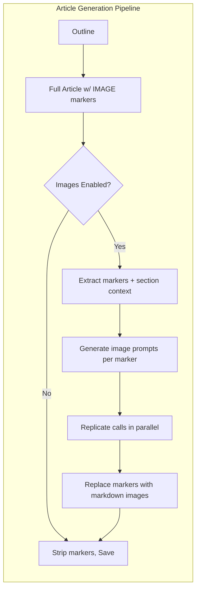
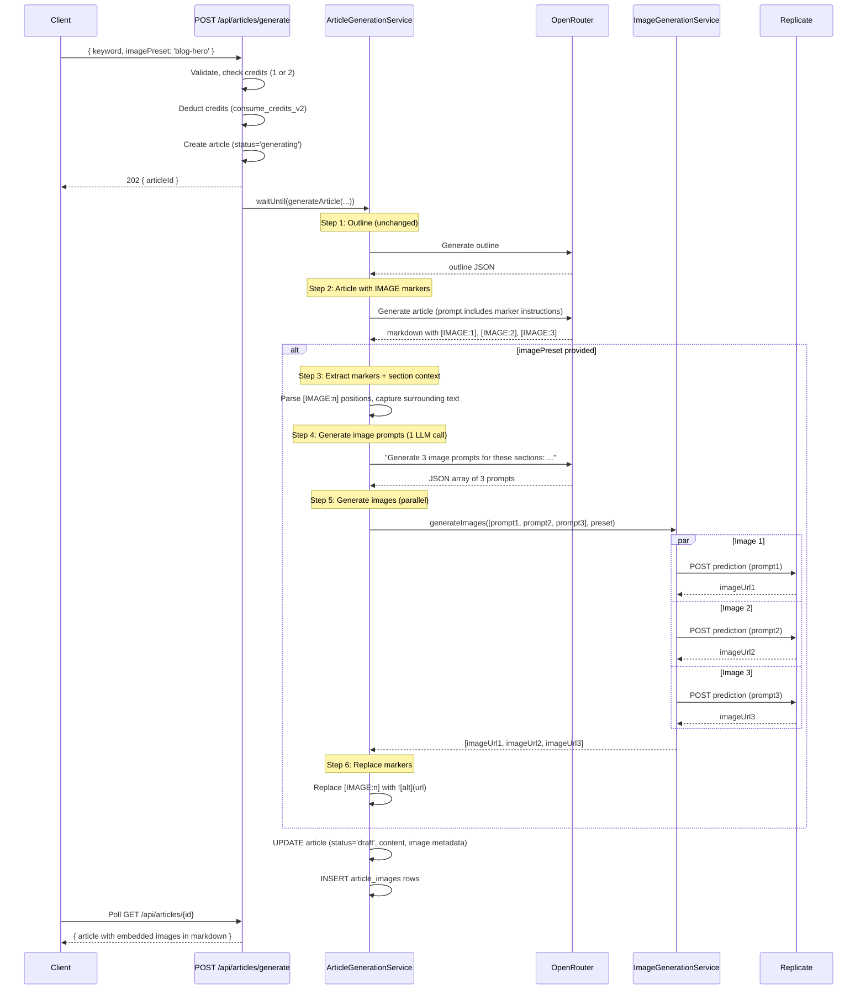

# PRD: Image Generation Pipeline via Replicate API

**Complexity: 8 → HIGH mode**
**Status:** Draft (v2 — rewritten for multi-image in-content support)
**Author:** Claude
**Date:** 2026-02-06
**Branch:** `feat/image-generation`

---

## 1. Context

**Problem:** Articles generated by AutopilotRank are text-only markdown. SEO-optimized articles need visuals embedded naturally throughout the content (featured image + 1-2 in-section images) to improve engagement, time-on-page, and search ranking. Users currently have no way to generate images for their articles.

**Files Analyzed:**

- `server/services/article-generation.service.ts` — current 2-step pipeline (outline → article)
- `server/services/prompts/article-prompts.ts` — prompt templates with humanizer instructions
- `server/services/openrouter.service.ts` — external API integration pattern (auth, retries, singleton)
- `server/services/providers/replicate.provider-adapter.ts` — existing Replicate adapter (upscaling only)
- `shared/config/credits.config.ts` — credit costs (1 credit = 1 article, flat)
- `shared/config/ai-models.config.ts` — model registry pattern (id → metadata)
- `shared/config/env.ts` — env var loading with Zod schemas
- `shared/types/article.types.ts` — IArticle, IArticleOutline, IGenerateArticleInput
- `shared/types/campaign.types.ts` — ICampaign, ICreateCampaignInput
- `supabase/migrations/20260205100200_create_articles_table.sql` — articles schema
- `supabase/migrations/20260205100100_create_campaigns_table.sql` — campaigns schema
- `src/pages/api/articles/generate.ts` — generation API endpoint (Zod validation, credit deduction, waitUntil)
- `src/pages/api/campaigns/[campaignId]/start.ts` — bulk generation endpoint (sequential keyword processing)
- `client/components/articles/QuickGenerate.tsx` — generation form UI (React Hook Form + Zod)
- `client/components/articles/ArticlePreview.tsx` — markdown-to-HTML preview (marked + DOMPurify)
- `client/hooks/useArticleGeneration.ts` — React Query polling (3s interval while generating)

**What Already Exists (DONE):**

- [x] Article generation pipeline: outline → full article (markdown output)
- [x] OpenRouter service with retries, error handling, singleton pattern
- [x] Replicate provider adapter for image upscaling (different use case, but proves Replicate API familiarity)
- [x] Credit system: `consume_credits_v2` RPC, FIFO deduction, refund on failure
- [x] QuickGenerate form with React Hook Form + Zod
- [x] ArticlePreview rendering markdown → sanitized HTML
- [x] Polling hook (useArticleGeneration) with React Query
- [x] Campaign bulk generation via `waitUntil()` (sequential)
- [x] AI model registry pattern (`ai-models.config.ts`)

**What Doesn't Exist Yet (TODO):**

- [ ] Image generation of any kind
- [ ] Replicate service for generation (only upscaling adapter exists)
- [ ] Image placement markers in article prompts
- [ ] `article_images` table
- [ ] Image preset config
- [ ] UI for image settings

---

## 2. Solution

**Approach: Images as first-class content, not a bolt-on**

The LLM generates articles with `[IMAGE:n]` placement markers embedded naturally in the markdown. After the article text is complete, a post-processing step generates contextual image prompts for each marker, calls Replicate, and replaces the markers with real `` markdown images.

This gives us:

- **2-3 images per article** (1 featured hero + 1-2 in-section visuals)
- **Natural placement** — the LLM decides where images belong in the flow
- **Contextual prompts** — each image prompt is derived from its surrounding section, not just the article title
- **Graceful degradation** — if image gen fails, markers are stripped and the article is saved as text-only

**Architecture Diagram:**



**Key Decisions:**

1. **Markers in LLM output, not post-processing guesses:** The article prompt instructs the LLM to place `[IMAGE:1]`, `[IMAGE:2]`, `[IMAGE:3]` markers where images should appear. The LLM understands content flow better than any heuristic.

2. **`article_images` table (1-to-many) instead of flat columns:** Multiple images per article means we need a proper child table. Each row stores: position index, prompt used, model, URL, and the surrounding section context that generated it.

3. **Parallel image generation:** All 2-3 images are generated concurrently via `Promise.allSettled()` — no reason to wait sequentially. A single article's images take ~5-10s total instead of 15-30s.

4. **Image count driven by word count:**
   - 800-1200 words → 2 images (1 hero + 1 in-section)
   - 1200-2000 words → 3 images (1 hero + 2 in-section)
   - 2000-3000 words → 3 images (same — diminishing returns above 3)

5. **Credit model:** Images are bundled per tier, not charged individually per image. This is simpler for users and matches the "1 credit = 1 article" mental model.

6. **Use case presets over raw model names:** Users pick "Blog Hero" or "Illustration" instead of "flux-schnell" — each preset maps to a model + default prompt style + params.

7. **Replicate output URLs expire.** We accept this for MVP and note R2 storage as future work. Replicate URLs are valid for ~1 hour, but articles are typically reviewed/published shortly after generation.

**Marker Format:**

The LLM outputs markdown like:

```markdown
## Introduction

Coffee culture has exploded in the last decade...

[IMAGE:1]

## The best drip coffee makers

When it comes to drip brewing, three machines stand out...

[IMAGE:2]

## Pour-over vs drip: which is better?

This is where things get interesting...

[IMAGE:3]

## Conclusion

...
```

Post-processing replaces each marker:

```markdown

```

---

## 3. Image Model Presets

Each preset maps a **use case** to a **Replicate model** with sensible defaults.

| Preset Key       | Display Name   | Replicate Model                  | Cost/Image (USD) | Aspect Ratio | Best For                      |
| ---------------- | -------------- | -------------------------------- | ---------------- | ------------ | ----------------------------- |
| `blog-hero`      | Blog Hero      | `black-forest-labs/flux-schnell` | $0.003           | 16:9         | Featured images, hero banners |
| `social-card`    | Social Card    | `black-forest-labs/flux-schnell` | $0.003           | 1.91:1       | OG images, social sharing     |
| `product-shot`   | Product Shot   | `black-forest-labs/flux-dev`     | $0.025           | 4:3          | Product/service visuals       |
| `premium-hero`   | Premium Hero   | `black-forest-labs/flux-1.1-pro` | $0.040           | 16:9         | High-quality editorial        |
| `photorealistic` | Photorealistic | `bytedance/seedream-4.5`         | ~$0.03           | 16:9         | Stock-photo-style imagery     |
| `illustration`   | Illustration   | `recraft-ai/recraft-v3`          | $0.040           | 4:3          | Blog illustrations, diagrams  |

**Credit Cost Model (per article, not per image):**

| Tier     | Preset Keys                                      | Images/Article | Our Cost       | Credit Cost               |
| -------- | ------------------------------------------------ | -------------- | -------------- | ------------------------- |
| Standard | `blog-hero`, `social-card`                       | 2-3            | ~$0.009-$0.009 | +0 (included in 1 credit) |
| Enhanced | `product-shot`                                   | 2-3            | ~$0.050-$0.075 | +0 (included in 1 credit) |
| Premium  | `premium-hero`, `photorealistic`, `illustration` | 2-3            | ~$0.090-$0.120 | +1 credit                 |

**Rationale:**

- Base article = 1 credit. Our LLM cost ≈ $0.01-0.03.
- Standard presets (FLUX Schnell at $0.003/image x 3 = $0.009) — negligible, bundled.
- Enhanced presets (FLUX Dev at $0.025/image x 3 = $0.075) — still within 1 credit margin at $1.63/credit.
- Premium presets ($0.030-0.040/image x 3 = $0.090-$0.120) — meaningful cost → charge +1 credit.
- At Starter tier ($49/30 credits = $1.63/credit), even premium is healthy margin.

---

## 4. Data Model

### New table: `article_images`

```sql
CREATE TABLE public.article_images (
  id UUID PRIMARY KEY DEFAULT gen_random_uuid(),
  article_id UUID NOT NULL REFERENCES public.articles(id) ON DELETE CASCADE,
  position INTEGER NOT NULL,           -- 1, 2, 3 (order in article)
  image_url TEXT,                       -- Replicate output URL
  prompt TEXT NOT NULL,                 -- The image generation prompt used
  section_context TEXT,                 -- The heading/paragraph surrounding the marker
  replicate_model TEXT NOT NULL,        -- e.g., 'black-forest-labs/flux-schnell'
  preset_key TEXT NOT NULL,             -- e.g., 'blog-hero'
  status TEXT NOT NULL DEFAULT 'pending'
    CHECK (status IN ('pending', 'generating', 'completed', 'failed')),
  error TEXT,                           -- Error message if generation failed
  replicate_prediction_id TEXT,         -- For tracking/debugging
  generation_time_ms INTEGER,
  created_at TIMESTAMPTZ NOT NULL DEFAULT NOW()
);

CREATE INDEX idx_article_images_article_id ON public.article_images(article_id);
```

### New column on `campaigns`:

```sql
ALTER TABLE public.campaigns
  ADD COLUMN IF NOT EXISTS image_preset TEXT DEFAULT NULL;
```

### New column on `articles`:

```sql
ALTER TABLE public.articles
  ADD COLUMN IF NOT EXISTS image_preset TEXT DEFAULT NULL,
  ADD COLUMN IF NOT EXISTS image_count INTEGER DEFAULT 0;
```

---

## 5. Integration Points Checklist

```
How will this feature be reached?
- [x] Entry point: POST /api/articles/generate (extended with imagePreset param)
- [x] Caller: ArticleGenerationService.generateArticle() calls new ImageGenerationService
- [x] Registration: New imagePreset field added to IGenerateArticleInput

Is this user-facing?
- [x] YES → UI: QuickGenerate form (image toggle + preset selector),
             Campaign settings, ArticlePreview (renders images from markdown)

Full user flow:
1. User fills QuickGenerate form, toggles "Generate Images" ON, selects preset
2. POST /api/articles/generate with { keyword, model, imagePreset: 'blog-hero' }
3. Pipeline: outline → article with [IMAGE:n] markers → extract markers → generate prompts → Replicate (parallel) → replace markers → save
4. Client polls until status=draft; ArticlePreview renders markdown with embedded images
5. Images appear naturally within the article content (not just a hero on top)
```

---

## 6. Sequence Flow



---

## 7. Execution Phases

### Phase 1: Image Model Config + Replicate Service (backend foundation)

**User-visible outcome:** Replicate API integration exists and can generate images via a service call (tested via unit tests).

**Files (5):**

- `shared/config/image-models.config.ts` — **NEW** — image preset registry
- `shared/config/env.ts` — **EDIT** — add `REPLICATE_API_KEY` to serverEnv schema
- `server/services/replicate.service.ts` — **NEW** — Replicate API client (create, poll, generate)
- `server/services/image-generation.service.ts` — **NEW** — orchestrates prompt gen + parallel Replicate calls
- `.env.api` — **EDIT** — add `REPLICATE_API_KEY` placeholder

**Implementation:**

- [ ] Create `shared/config/image-models.config.ts`:
  - Export `IMAGE_PRESETS` config object with 6 presets
  - Each preset: `{ key, displayName, description, bestFor, replicateModel, defaultParams, creditCost, aspectRatio }`
  - `creditCost`: 0 for standard/enhanced, 1 for premium (per article, not per image)
  - Export `ImagePresetKey` type union
  - Export helpers: `getImagePreset(key)`, `isValidImagePreset(key)`, `getImagePresetCreditCost(key)`
  - Export `IMAGE_PRESET_KEYS` array for UI rendering
  - Export `getImageCountForWordCount(targetWordCount): number` (800-1200→2, 1200+→3)

- [ ] Add `REPLICATE_API_KEY` to `shared/config/env.ts`:
  - Add to `serverEnvSchema`: `REPLICATE_API_KEY: z.string().default('')`
  - Add to `loadServerEnv()`: `REPLICATE_API_KEY: import.meta.env.REPLICATE_API_KEY || ''`

- [ ] Create `server/services/replicate.service.ts`:
  - Singleton class `ReplicateService` (follow `OpenRouterService` pattern)
  - `isConfigured(): boolean` — check API key exists
  - `createPrediction(model, input): Promise<IPrediction>` — POST to `/v1/models/{owner}/{name}/predictions`
  - `pollPrediction(predictionId, maxAttempts=30, intervalMs=2000): Promise<IPrediction>` — poll until `succeeded`/`failed`/`canceled`
  - `generateImage(model, prompt, params): Promise<string>` — create + poll + return output URL
  - Auth: `Authorization: Bearer ${serverEnv.REPLICATE_API_KEY}`
  - Error handling: retry on 429/5xx (same pattern as OpenRouter), throw `AppError` with `ErrorCodes.AI_UNAVAILABLE`
  - Types: `IPrediction { id, status, output, error, urls }`, `IReplicateInput { prompt, aspect_ratio?, ... }`

- [ ] Create `server/services/image-generation.service.ts`:
  - `generateImagesForArticle(markers: IImageMarker[], presetKey): Promise<IImageResult[]>`
  - Uses `Promise.allSettled()` to generate all images in parallel
  - Each marker: `{ position: number, sectionContext: string, prompt: string }`
  - Returns `IImageResult[]`: `{ position, imageUrl, prompt, model, presetKey, status, error? }`
  - On individual image failure: returns `status: 'failed'` for that image, doesn't fail the batch
  - `generateImagePrompts(markers: IImageMarker[], keyword, presetDescription): Promise<string[]>`
    - Single OpenRouter call: "Generate N concise image prompts for a blog article. For each, I'll give you the section context. Style: {presetDescription}. Output JSON array of prompt strings."
    - Falls back to basic title+keyword prompt if LLM call fails

- [ ] Add `REPLICATE_API_KEY=` to `.env.api`

**Verification Plan:**

1. **Unit Tests:**
   - `tests/unit/services/replicate.service.spec.ts`
     - `should create prediction with correct headers and body`
     - `should poll until prediction succeeds`
     - `should throw on prediction failure`
     - `should retry on 429/5xx errors`
     - `should return false for isConfigured when no API key`
   - `tests/unit/services/image-generation.service.spec.ts`
     - `should generate all images in parallel via Promise.allSettled`
     - `should return partial results when some images fail`
     - `should generate contextual prompts from section context`
   - `tests/unit/config/image-models.config.spec.ts`
     - `should define all 6 presets with required fields`
     - `should return correct credit costs per preset`
     - `should return correct image count for word count ranges`

2. **Evidence Required:**
   - [ ] All tests pass (`yarn test`)
   - [ ] `yarn verify` passes

---

### Phase 2: Database Migration + Types Update

**User-visible outcome:** Article images table exists; TypeScript types are updated for image support.

**Files (5):**

- `supabase/migrations/20260207000000_create_article_images_table.sql` — **NEW**
- `supabase/migrations/20260207000001_add_image_columns.sql` — **NEW** — image_preset + image_count on articles, image_preset on campaigns
- `shared/types/article.types.ts` — **EDIT** — add image fields to IArticle, IGenerateArticleInput
- `shared/types/campaign.types.ts` — **EDIT** — add `image_preset` to ICampaign, ICreateCampaignInput, IUpdateCampaignInput
- `shared/config/credits.config.ts` — **EDIT** — add image generation credit constants

**Implementation:**

- [ ] Create migration `20260207000000_create_article_images_table.sql`:

  ```sql
  CREATE TABLE public.article_images (
    id UUID PRIMARY KEY DEFAULT gen_random_uuid(),
    article_id UUID NOT NULL REFERENCES public.articles(id) ON DELETE CASCADE,
    position INTEGER NOT NULL,
    image_url TEXT,
    prompt TEXT NOT NULL,
    section_context TEXT,
    replicate_model TEXT NOT NULL,
    preset_key TEXT NOT NULL,
    status TEXT NOT NULL DEFAULT 'pending'
      CHECK (status IN ('pending', 'generating', 'completed', 'failed')),
    error TEXT,
    replicate_prediction_id TEXT,
    generation_time_ms INTEGER,
    created_at TIMESTAMPTZ NOT NULL DEFAULT NOW()
  );

  CREATE INDEX idx_article_images_article_id ON public.article_images(article_id);

  -- RLS
  ALTER TABLE public.article_images ENABLE ROW LEVEL SECURITY;

  CREATE POLICY "Users can view own article images"
    ON public.article_images FOR SELECT
    USING (
      EXISTS (
        SELECT 1 FROM public.articles
        WHERE articles.id = article_images.article_id
        AND articles.user_id = auth.uid()
      )
    );

  CREATE POLICY "Service role has full access to article_images"
    ON public.article_images FOR ALL
    USING (auth.role() = 'service_role');
  ```

- [ ] Create migration `20260207000001_add_image_columns.sql`:

  ```sql
  ALTER TABLE public.articles
    ADD COLUMN IF NOT EXISTS image_preset TEXT DEFAULT NULL,
    ADD COLUMN IF NOT EXISTS image_count INTEGER DEFAULT 0;

  ALTER TABLE public.campaigns
    ADD COLUMN IF NOT EXISTS image_preset TEXT DEFAULT NULL;

  COMMENT ON COLUMN public.articles.image_preset IS 'Image generation preset used (null = no images)';
  COMMENT ON COLUMN public.articles.image_count IS 'Number of images generated for this article';
  COMMENT ON COLUMN public.campaigns.image_preset IS 'Default image preset for campaign articles (null = text only)';
  ```

- [ ] Update `shared/types/article.types.ts`:
  - Add to `IArticle`: `image_preset: string | null`, `image_count: number`
  - Add to `IGenerateArticleInput`: `imagePreset?: string`
  - Add new interface:
    ```typescript
    export interface IArticleImage {
      id: string;
      article_id: string;
      position: number;
      image_url: string | null;
      prompt: string;
      section_context: string | null;
      replicate_model: string;
      preset_key: string;
      status: 'pending' | 'generating' | 'completed' | 'failed';
      error: string | null;
      generation_time_ms: number | null;
      created_at: string;
    }
    ```
  - Add `IImageMarker`: `{ position: number, sectionContext: string }`
  - Add `IImageResult`: `{ position: number, imageUrl: string | null, prompt: string, model: string, presetKey: string, status: 'completed' | 'failed', error?: string }`

- [ ] Update `shared/types/campaign.types.ts`:
  - Add `image_preset: string | null` to `ICampaign`
  - Add `imagePreset?: string` to `ICreateCampaignInput` and `IUpdateCampaignInput`

- [ ] Update `shared/config/credits.config.ts`:
  - Add `IMAGE_GENERATION_FREE: 0` (standard + enhanced presets)
  - Add `IMAGE_GENERATION_PREMIUM: 1` (premium presets)

**Verification Plan:**

1. **Database:**
   - [ ] Migrations run without error
   - [ ] `article_images` table exists with correct columns
   - [ ] RLS policies are active on `article_images`

2. **Evidence Required:**
   - [ ] Migrations applied
   - [ ] `yarn verify` passes

---

### Phase 3: Pipeline Integration (the core change)

**User-visible outcome:** When `imagePreset` is provided in the generation request, the article is generated with `[IMAGE:n]` markers, images are generated in parallel, and the final markdown contains real image URLs.

**Files (5):**

- `server/services/prompts/article-prompts.ts` — **EDIT** — add image marker instructions to article prompt
- `server/services/prompts/image-prompts.ts` — **NEW** — prompt template for contextual image prompt generation
- `server/services/article-generation.service.ts` — **EDIT** — add image generation steps after text
- `src/pages/api/articles/generate.ts` — **EDIT** — accept `imagePreset`, calculate total credits
- `src/pages/api/campaigns/[campaignId]/start.ts` — **EDIT** — pass campaign `image_preset` to article generation

**Implementation:**

- [ ] Edit `server/services/prompts/article-prompts.ts`:
  - Add `imageCount` parameter to `getArticlePrompt(outline, tone, targetWordCount, imageCount?)`
  - When `imageCount > 0`, append to the prompt:

    ```
    IMAGE PLACEMENT:
    You MUST include exactly {imageCount} image markers in the article, placed where a visual would naturally enhance the content.
    Use this exact format: [IMAGE:1], [IMAGE:2], [IMAGE:3] (numbered sequentially).

    Rules:
    - Place [IMAGE:1] after the introduction (this becomes the featured/hero image)
    - Place [IMAGE:2] and [IMAGE:3] between sections, where a visual break helps readability
    - Never place two markers next to each other
    - Never place a marker inside a list, table, or code block
    - Each marker should be on its own line, with a blank line before and after
    ```

  - When `imageCount === 0` or undefined, no marker instructions (backward compatible)

- [ ] Create `server/services/prompts/image-prompts.ts`:
  - `getImagePromptsGenerationPrompt(markers: IImageMarker[], keyword, presetDescription): string`
  - System prompt:

    ```
    You are an expert at writing image generation prompts for blog articles.
    For each section context below, write a concise, vivid image prompt (1-2 sentences).
    The images should match this style: {presetDescription}.
    The article topic is: {keyword}.

    Sections:
    1. {marker1.sectionContext}
    2. {marker2.sectionContext}
    3. {marker3.sectionContext}

    Respond with ONLY a JSON array of prompt strings, one per section. Example: ["prompt 1", "prompt 2", "prompt 3"]
    ```

- [ ] Edit `server/services/article-generation.service.ts`:
  - Add `imagePreset` param to `generateArticle()`
  - Pass `imageCount` to article prompt generation (from `getImageCountForWordCount`)
  - After full article generation, if `imagePreset` is set:
    - **Step 3:** Parse `[IMAGE:n]` markers from markdown, extract surrounding section context (heading + first paragraph before/after marker)
    - **Step 4:** Generate image prompts via single OpenRouter call
    - **Step 5:** Call `ImageGenerationService.generateImagesForArticle()` (parallel)
    - **Step 6:** Replace `[IMAGE:n]` markers with `` for succeeded images, strip markers for failed ones
    - Save `article_images` rows to database
    - Update article: `image_preset`, `image_count` (count of successful images)
  - If no markers found in output (LLM didn't follow instructions): log warning, save text-only
  - On total image failure: strip all markers, save text-only, refund credit if premium preset
  - `credits_used` reflects actual total (1 for free preset, 2 for premium)
  - New private method: `parseImageMarkers(markdown: string): IImageMarker[]`
  - New private method: `replaceImageMarkers(markdown: string, results: IImageResult[]): string`

- [ ] Edit `src/pages/api/articles/generate.ts`:
  - Add `imagePreset` to Zod schema: `imagePreset: z.string().optional().refine(v => !v || isValidImagePreset(v), 'Invalid image preset')`
  - Calculate total credits: `1 + getImagePresetCreditCost(input.imagePreset)` (0 or 1)
  - Update credit check to use total cost instead of hardcoded `1`
  - Update `credits_used` on article insert to total
  - Update `consume_credits_v2` amount to total
  - Pass `imagePreset` through to `articleGenerationService.generateArticle()`

- [ ] Edit `src/pages/api/campaigns/[campaignId]/start.ts`:
  - Read `campaign.image_preset` from campaign detail
  - Pass as `imagePreset` to each `articleGenerationService.generateArticle()` call
  - Update credit calculation: each keyword costs `1 + getImagePresetCreditCost(campaign.image_preset)`

**Verification Plan:**

1. **Unit Tests:**
   - `tests/unit/services/article-generation.service.spec.ts` (extend):
     - `should pass imageCount to article prompt when imagePreset provided`
     - `should parse [IMAGE:n] markers from generated markdown`
     - `should extract section context around each marker`
     - `should replace markers with real image URLs`
     - `should strip markers when images fail`
     - `should skip image generation when imagePreset is not provided`
     - `should save article_images rows to database`
     - `should continue with text-only on total image failure`
     - `should deduct 1 credit for free preset, 2 for premium`
   - `tests/unit/prompts/article-prompts.spec.ts`:
     - `should include IMAGE marker instructions when imageCount > 0`
     - `should NOT include marker instructions when imageCount is 0`
   - `tests/unit/api/articles-generate.spec.ts` (extend):
     - `should accept imagePreset in request body`
     - `should reject invalid imagePreset values`
     - `should check sufficient credits for premium preset`

2. **Evidence Required:**
   - [ ] All tests pass (`yarn test`)
   - [ ] `yarn verify` passes

---

### Phase 4: UI — QuickGenerate Form + ArticlePreview

**User-visible outcome:** Users can toggle image generation ON/OFF, select a preset, see credit cost, and view generated images inline in the article preview.

**Files (5):**

- `client/components/articles/ImagePresetSelector.tsx` — **NEW** — reusable preset picker component
- `client/components/articles/QuickGenerate.tsx` — **EDIT** — add image toggle + preset selector
- `client/components/articles/ArticlePreview.tsx` — **EDIT** — images render automatically from markdown (already uses `marked`)
- `client/hooks/useArticleGeneration.ts` — **EDIT** — pass imagePreset to API call
- `locales/en/articles.json` — **EDIT** — add i18n keys

**Implementation:**

- [ ] Create `client/components/articles/ImagePresetSelector.tsx`:
  - Display preset cards with: name, description, bestFor, credit cost badge
  - Props: `selectedPreset: string | null`, `onSelect: (preset: string | null) => void`
  - Import and render from `IMAGE_PRESETS` config (shared code)
  - Show "+0 credits" or "+1 credit" badge per preset
  - "None (text only)" option
  - Responsive: grid on desktop, scrollable on mobile

- [ ] Edit `client/components/articles/QuickGenerate.tsx`:
  - Add toggle: "Generate Images" (default: OFF)
  - When ON: show `ImagePresetSelector` component
  - Update form schema: add `imagePreset: z.string().optional()`
  - Update credit display: "1 credit" → "1 credit" or "2 credits" based on preset
  - Pass `imagePreset` to generation mutation

- [ ] `ArticlePreview.tsx` — **minimal change needed:**
  - Already renders markdown → HTML via `marked` + `DOMPurify`
  - `` in markdown will automatically render as `` tags
  - Only change: add CSS for in-article images (max-width, border-radius, margin)
  - Optional: show image count badge in article metadata

- [ ] Edit `client/hooks/useArticleGeneration.ts`:
  - Accept `imagePreset` in `IGenerateArticleInput` (already typed, just pass through)

- [ ] Edit `locales/en/articles.json`:
  - Add keys: `generateImages`, `generateImagesToggle`, `imagePreset`, `selectImagePreset`, `includedInCredit`, `premiumImages`, `creditsWithImages`, `textOnly`, `imageCount`

**Verification Plan:**

1. **Component Tests:**
   - `tests/unit/components/ImagePresetSelector.spec.tsx`
     - `should render all 6 presets plus text-only option`
     - `should show credit cost for each preset`
     - `should call onSelect when preset is clicked`
     - `should highlight selected preset`

2. **Visual:**
   - ArticlePreview renders images from markdown naturally (no extra image component needed)

3. **Evidence Required:**
   - [ ] All tests pass
   - [ ] `yarn verify` passes

---

### Phase 5: Campaign Settings Integration

**User-visible outcome:** Users can set a default image preset for campaigns, so bulk generation includes images.

**Files (4):**

- `client/components/campaigns/NewCampaignModal.tsx` — **EDIT** — add image preset to campaign settings
- `server/services/campaign.service.ts` — **EDIT** — accept and save `image_preset`
- `locales/en/campaigns.json` — **EDIT** — add i18n keys
- `src/pages/api/campaigns/` — **EDIT** — pass `image_preset` in create/update endpoints

**Implementation:**

- [ ] Edit campaign create/update API routes:
  - Accept `imagePreset` in Zod validation (optional, validated against `isValidImagePreset`)
  - Save to `campaigns.image_preset` column

- [ ] Edit `server/services/campaign.service.ts`:
  - Accept `image_preset` in create/update operations
  - `startGeneration()`: calculate total credits as `pendingKeywords * (1 + getImagePresetCreditCost(campaign.image_preset))`

- [ ] Edit `client/components/campaigns/NewCampaignModal.tsx`:
  - Add "Image Generation" section in settings step
  - Reuse `ImagePresetSelector` component
  - Default: "None (text only)"
  - Show total credit impact: "50 keywords x 2 credits = 100 credits"

- [ ] Edit `locales/en/campaigns.json`:
  - Add keys: `imagePresetSetting`, `imagePresetDescription`, `noImages`, `campaignImagePreset`, `totalCreditsWithImages`

**Verification Plan:**

1. **Unit Tests:**
   - `tests/unit/services/campaign.service.spec.ts` (extend):
     - `should save image_preset when creating campaign`
     - `should calculate credits including image cost`
     - `should pass image_preset to article generation`

2. **Evidence Required:**
   - [ ] All tests pass
   - [ ] `yarn verify` passes

---

## 8. Acceptance Criteria

- [ ] All 5 phases complete
- [ ] All tests pass (unit + integration)
- [ ] `yarn verify` passes
- [ ] Articles with images contain 2-3 images naturally embedded in markdown
- [ ] Images render correctly in ArticlePreview (via standard markdown rendering)
- [ ] Feature is reachable: user can toggle image generation in QuickGenerate UI
- [ ] Feature works in campaigns: campaign `image_preset` propagates to article generation
- [ ] Credit deduction is correct: 1 credit for standard/enhanced presets, 2 for premium
- [ ] Image failure doesn't break article generation (markers stripped, text-only fallback)
- [ ] `article_images` table stores metadata for each generated image
- [ ] Parallel image generation completes within ~10s for 3 images
- [ ] Roadmap updated

---

## 9. Credit System Impact Summary

| Action                              | Credits | Our Cost (3 images) | Revenue @ Starter ($1.63/cr) |
| ----------------------------------- | ------- | ------------------- | ---------------------------- |
| Article only (no images)            | 1       | ~$0.02              | $1.63                        |
| Article + standard images (Schnell) | 1       | ~$0.029             | $1.63                        |
| Article + enhanced images (Dev)     | 1       | ~$0.095             | $1.63                        |
| Article + premium images (Pro)      | 2       | ~$0.140             | $3.26                        |

Margin remains healthy across all tiers. Standard image presets add negligible cost and are bundled to increase perceived value. Premium presets have meaningful cost but still ~23x margin at Starter pricing.

---

## 10. Out of Scope (Future)

- **R2/S3 image storage** — Replicate output URLs expire (~1 hour). For production, we'll need to download and store in Cloudflare R2. Address before launch.
- **Image-to-image editing/refinement** — regenerate a specific image with tweaks
- **Custom user-provided image prompts** — override the auto-generated prompt per image
- **Image regeneration without regenerating the article** — "regenerate image 2 only"
- **More than 3 images per article** — current limit is 3 for cost/quality balance
- **Video generation** — Replicate supports video models, but not in scope
- **Image SEO** — alt text optimization, structured data for images (address in SEO milestone)

---

## 11. Cloudflare Workers Considerations

- **10ms CPU limit:** Image generation runs in `waitUntil()` background context, not in the request handler. Replicate API calls are I/O (fetch), not CPU.
- **Parallel fetch calls:** `Promise.allSettled()` with 3 Replicate predictions is fine — each is an async fetch, not CPU work.
- **Polling:** Each Replicate prediction polls every 2s for up to 30 attempts. With 3 predictions in parallel, worst case is ~60s total wall time, but typical is 5-10s per image.
- **No heavy computation:** Image generation happens on Replicate's GPU infrastructure, not in our Worker.
