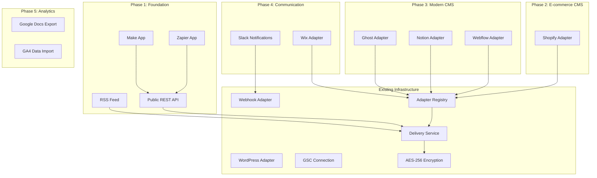

# PRD: Integrations Deep Dive - Expanding AutopilotRank's Integration Ecosystem

**Complexity: 10 → HIGH mode** (new adapters from scratch, multiple external API integrations, OAuth flows, database schema changes, 30+ files across all phases, UI components for each integration)

---

## Executive Summary

This PRD defines the integration expansion strategy for AutopilotRank based on competitive analysis of 14+ SEO tools (Outrank.so, RankYak, Surfer SEO, Semrush, Ahrefs, NeuronWriter, SE Ranking, Serpstat, Clearscope, Frase, MarketMuse, Mangools, PageOptimizer Pro, WriterZen). It prioritizes integrations by competitive frequency, user value, and implementation complexity.

---

## 1. Context

**Problem:** AutopilotRank currently supports only WordPress and generic webhook publishing. Competitors like RankYak offer 10 integrations (5 CMS, GSC, Zapier, Make, API, Webhooks, RSS) and Outrank.so offers WordPress, Webflow, Shopify, Framer, Notion plus Zapier. We're missing critical CMS platforms and automation connectors that competitors treat as table stakes.

**Files Analyzed:**

- `server/integrations/adapter.interface.ts` - ICMSAdapter interface (testConnection + publish)
- `server/integrations/wordpress.adapter.ts` - WordPress REST API adapter
- `server/integrations/webhook.adapter.ts` - Generic webhook adapter (HMAC-SHA256)
- `server/integrations/index.ts` - Adapter registry + getAdapter() factory
- `server/services/integration.service.ts` - CRUD, encryption, connection testing
- `server/services/delivery.service.ts` - Article delivery orchestration
- `server/services/gsc.service.ts` - Google Search Console OAuth + API
- `server/utils/encryption.ts` - AES-256-GCM encryption (Web Crypto API)
- `shared/types/integration.types.ts` - IntegrationType union, configs, credentials
- `shared/config/env.ts` - Environment variable system (clientEnv/serverEnv)
- `shared/config/security.ts` - PUBLIC_API_ROUTES
- `src/pages/api/integrations/` - CRUD routes + test endpoint
- `src/pages/api/gsc/` - OAuth flow (connect, callback, connections)
- `supabase/migrations/20260210110100_create_integrations_tables.sql` - integrations schema
- `supabase/migrations/20260211000300_create_gsc_connections.sql` - GSC schema
- `client/hooks/useIntegrations.ts` - React Query hook with CRUD
- `client/components/onboarding/steps/OnboardingStepIntegrations.tsx` - Onboarding step 4
- `docs/PRDs/integrations-tab.md` - Existing WordPress + Webhook PRD (DONE)
- `docs/PRDs/gsc-integration.md` - Existing GSC PRD (DONE)

**Current Behavior:**

- WordPress integration via Application Passwords (Basic Auth) - fully working
- Webhook integration with optional HMAC-SHA256 signing - fully working
- GSC OAuth connection for keyword research/opportunity detection - fully working
- Clean adapter pattern (`ICMSAdapter`) makes adding new CMS adapters straightforward
- Credentials encrypted with AES-256-GCM, stored as blob in `encrypted_credentials` column
- IntegrationType is a CHECK constraint: `'wordpress' | 'webhook'` - must be updated for new types
- Onboarding step 4 offers WordPress or Webhook selection

---

## 2. Competitive Landscape Analysis

### 2.1 Integration Frequency Across 14 SEO Tools

| Rank | Integration | Tools Offering It | Frequency | Status in AutopilotRank |
|------|------------|-------------------|-----------|------------------------|
| 1 | WordPress | 10/14 | 71% | DONE |
| 2 | Google Docs (export) | 10/14 | 71% | NOT BUILT |
| 3 | Chrome Extension | 10/14 | 71% | NOT PLANNED (out of scope) |
| 4 | API Access | 10/14 | 71% | NOT BUILT |
| 5 | Google Search Console | 8/14 | 57% | DONE |
| 6 | Zapier | 7/14 | 50% | NOT BUILT |
| 7 | Shopify | 4/14 | 29% | NOT BUILT |
| 8 | Looker Studio | 4/14 | 29% | NOT PLANNED (low priority) |
| 9 | Make (Integromat) | 4/14 | 29% | NOT BUILT |
| 10 | Google Analytics | 3/14 | 21% | NOT BUILT |
| 11 | Webflow | 2/14 | 14% | NOT BUILT |
| 12 | Wix | 2/14 | 14% | NOT BUILT |
| 13 | Notion | 0/14 | 0% | NOT BUILT (market gap!) |
| 14 | Slack | 1/14 native | 7% | NOT BUILT |

### 2.2 Direct Competitor Comparison

| Integration | RankYak | Outrank.so | AutopilotRank (Current) | AutopilotRank (Planned) |
|------------|---------|------------|------------------------|------------------------|
| WordPress | Yes | Yes (plugin) | Yes | Yes |
| Shopify | Yes | Yes (app) | No | Phase 2 |
| Webflow | Yes | Yes | No | Phase 3 |
| Ghost | No | Yes (Admin API) | No | Phase 3 |
| Wix | Yes | Yes | No | Phase 4 |
| Framer | No | Yes (plugin) | No | Future (evaluate demand) |
| Notion | No | Yes | No | Phase 3 |
| Google Docs | No | Yes (import) | No | Phase 5 |
| GSC | Yes | Yes | Yes | Yes |
| Zapier | Yes | Yes | No | Phase 1 |
| Make | Yes | Yes (not confirmed) | No | Phase 1 |
| API | Yes | No | No | Phase 1 |
| Webhooks | Yes | Yes | Yes | Yes |
| RSS Feed | Yes | No | No | Phase 1 |
| Slack | No | No | No | Phase 4 |
| Backlink Exchange | Yes | Yes (P2P network) | No | Separate PRD (badge-backlink-system.md) |
| GA4 | No | No | No | Phase 5 |

### 2.3 Key Strategic Insights

1. **We match on WordPress + GSC + Webhooks** - these are our strongest existing integrations
2. **Critical gap: No automation platform connectors** - Both competitors offer Zapier + Make. This is the highest-priority gap because it unlocks hundreds of downstream integrations without us building them natively
3. **CMS gap: Missing Shopify, Webflow, Wix** - These are the 2nd-4th most popular CMS platforms after WordPress
4. **Market differentiator opportunity: Notion** - Zero competitors offer native Notion integration. This could be a unique selling point
5. **RSS Feed is a quick win** - Simple to implement, provides universal content distribution

---

## 3. Integration Priority Matrix

### Prioritization Criteria

| Factor | Weight | Description |
|--------|--------|-------------|
| Competitive Parity | 30% | How many competitors already offer this? |
| User Value | 30% | How much does this feature unlock for users? |
| Implementation Effort | 20% | How hard is this to build? (inverse - easier = higher score) |
| Revenue Impact | 20% | Does this help convert/retain paying users? |

### Priority Ranking

| Priority | Integration | Score | Rationale |
|----------|------------|-------|-----------|
| **P0** | Zapier Triggers/Actions | 9.2 | 50% competitor frequency, unlocks 7000+ app connections, MEDIUM effort |
| **P0** | Public REST API | 9.0 | 71% competitor frequency, developer ecosystem, enables all custom integrations |
| **P0** | RSS Feed | 8.8 | Quick win (1-2 days), universal content distribution, RankYak has it |
| **P1** | Shopify Blog | 8.2 | 29% frequency, large e-commerce market, MEDIUM effort (GraphQL API) |
| **P1** | Make (Integromat) | 8.0 | 29% frequency, complements Zapier, similar architecture |
| **P2** | Webflow CMS | 7.5 | Direct competitor feature, growing platform, REST API |
| **P2** | Notion Pages | 7.5 | Zero competitors (except Outrank) = market differentiator, REST API |
| **P2** | Ghost CMS | 7.3 | Outrank.so supports it, clean Admin API, LOW-MEDIUM effort, growing platform |
| **P3** | Wix Blog | 6.5 | RankYak + Outrank have it, smaller market share, complex API |
| **P3** | Slack Notifications | 6.0 | Low competitor frequency but high user convenience |
| **P4** | Google Docs Export | 5.5 | Content teams use it, but we auto-publish (less relevant) |
| **P4** | GA4 Data Import | 5.0 | Useful for analytics but not core to content publishing |

---

## 4. Technical API Research Summary

### 4.1 Zapier Developer Platform

- **Auth**: OAuth 2.0 or API Key (our API key approach is simpler)
- **Model**: Triggers (events we fire) + Actions (things Zapier tells us to do) + Searches
- **Key Triggers**: "New Article Published", "Article Approved", "Campaign Completed", "New Opportunity Found"
- **Key Actions**: "Create Campaign", "Approve Article", "Generate Article for Keyword"
- **Requirements**: Must build a Zapier app via their CLI/developer platform; requires a public API first
- **Complexity**: MEDIUM (requires our own public API + Zapier app registration)
- **Partner Program**: Free to create apps; review required for public listing

### 4.2 Shopify Admin API (GraphQL)

- **Auth**: OAuth 2.0 (Custom App or Public App)
- **Scopes**: `write_content` for blog articles, `read_content` for listing blogs
- **Key Endpoints**: `blogCreate`, `articleCreate`, `articleUpdate` (GraphQL mutations)
- **Rate Limits**: 50 cost points/second (standard), 1000/second (Shopify Plus); article creation = 10 points
- **Content Model**: Blog -> Articles (each Shopify store can have multiple blogs)
- **Image Handling**: Must upload images separately via `fileCreate` mutation, then reference
- **Complexity**: MEDIUM (GraphQL, OAuth app registration, image handling)

### 4.3 Webflow CMS API

- **Auth**: OAuth 2.0 (Site-level authorization) or API Token (workspace-level)
- **Key Endpoints**: `POST /collections/{id}/items` to create CMS items, `GET /sites/{id}/collections` to list
- **Rate Limits**: 60 requests/minute (general), 30 requests/minute (staging/publishing)
- **Content Model**: Sites -> Collections -> Items. User maps their "Blog Posts" collection
- **Complexity**: MEDIUM (REST API, need collection field mapping)

### 4.4 Notion API

- **Auth**: OAuth 2.0 (public integrations) or Internal Integration Token
- **Key Endpoints**: `POST /pages` (create page), `PATCH /pages/{id}` (update), `POST /blocks/{id}/children` (add content blocks)
- **Content Model**: Workspaces -> Pages -> Blocks. Rich text via block types (paragraph, heading, bulleted_list, etc.)
- **Rate Limits**: 3 requests/second average
- **HTML to Blocks**: Must convert HTML article content to Notion block format
- **Complexity**: MEDIUM-HIGH (block format conversion is the main challenge)

### 4.5 Ghost Admin API

- **Auth**: Admin API Key (custom integration token generated in Ghost admin panel)
- **Key Endpoints**: `POST /admin/posts` (create post), `PUT /admin/posts/{id}` (update), `GET /admin/posts` (list)
- **Content Model**: Posts with HTML body, tags, authors, featured images, custom excerpts
- **Auth Token**: JWT generated from Admin API key (split into id:secret, sign with secret)
- **Rate Limits**: Not formally documented; generally generous for self-hosted instances
- **HTML Support**: Ghost accepts raw HTML in the `html` field (Mobiledoc or Lexical editor format also available but HTML is simplest)
- **Requirements**: Ghost instance must be on Creator plan or above (Starter plan has no API access)
- **Complexity**: LOW-MEDIUM (clean REST API, accepts HTML directly, JWT auth is straightforward)
- **Note**: Outrank.so already supports Ghost - this is competitive parity

### 4.6 Wix Blog API

- **Auth**: OAuth 2.0 (Wix App Market)
- **Key Endpoints**: `POST /blog/posts` (create draft), `POST /blog/posts/{id}/publish`
- **Content Model**: Blog -> Posts with rich content (DraftJS format)
- **Rate Limits**: 100 requests/minute
- **Complexity**: MEDIUM-HIGH (DraftJS content format, Wix App Market registration)

### 4.6 Slack API

- **Auth**: OAuth 2.0 or Incoming Webhooks (simpler)
- **Key Method**: `chat.postMessage` for sending messages
- **Rate Limits**: 1 message/second/channel; Tier 1 for posting
- **Approach**: Incoming Webhooks (no OAuth needed) - user pastes webhook URL, we POST formatted messages
- **Block Kit**: Rich message formatting with sections, buttons, links
- **Complexity**: LOW (Incoming Webhooks are trivial, similar to our existing webhook adapter)

### 4.7 Google Analytics 4 Data API

- **Auth**: OAuth 2.0 (reuse existing Google OAuth flow)
- **Scopes**: `analytics.readonly` (for reading reports)
- **Key Endpoints**: `runReport` (dimensions + metrics), `batchRunReports`
- **Rate Limits**: 10,000 requests/day/project; 10 concurrent requests
- **Data**: Page views, sessions, bounce rate, traffic sources per URL
- **Complexity**: MEDIUM (OAuth reuse, but complex report building)

### 4.8 RSS Feed (Outbound)

- **No API needed** - we generate the feed
- **Format**: RSS 2.0 or Atom feed of published articles
- **Implementation**: Static Astro endpoint that queries published articles
- **Auth**: Per-user unique feed URL with token parameter
- **Complexity**: LOW (1-2 days, static endpoint)

### 4.9 Public REST API

- **Auth**: API keys (generated per-user in settings)
- **Endpoints**: Mirror existing internal API routes with API key auth
- **Rate Limits**: Per-key rate limiting (100 req/min default)
- **Documentation**: Auto-generated OpenAPI spec
- **Complexity**: MEDIUM (API key system, rate limiting, documentation)

---

## 5. Solution - Phased Integration Roadmap

### Architecture Diagram



### Key Decisions

- **Reuse ICMSAdapter interface** for all new CMS adapters (Shopify, Webflow, Notion, Wix)
- **Public API is prerequisite for Zapier/Make** - build API first, then register Zapier/Make apps on top
- **OAuth tokens stored in dedicated tables** (like GSC) for OAuth-based integrations (Shopify, Webflow, Notion, Wix)
- **Slack uses Incoming Webhooks** (same pattern as existing webhook adapter) - no OAuth needed
- **RSS Feed is a static Astro endpoint** with per-user auth token - no adapter needed
- **API keys stored in `api_keys` table** with hashed key, rate limit tracking

---

## Phase 1: Foundation Layer (Public API + RSS + Zapier/Make Readiness)

**User-visible outcome:** Users can generate API keys, access a public REST API, subscribe to RSS feeds of their published articles, and connect AutopilotRank to Zapier/Make via webhooks.

### Phase 1A: Public REST API

**Files (5):**

- `supabase/migrations/YYYYMMDDHHMMSS_create_api_keys.sql` - API keys table
- `shared/types/api-key.types.ts` - API key interfaces
- `server/services/api-key.service.ts` - Key generation, hashing, validation
- `src/pages/api/settings/api-keys/index.ts` - CRUD for API keys
- `server/middleware/apiKeyAuth.ts` - API key authentication middleware

**Implementation:**

- [ ] Create `api_keys` table: `id`, `user_id`, `name`, `key_hash` (SHA-256), `key_prefix` (first 8 chars for display), `last_used_at`, `rate_limit` (default 100/min), `scopes` (JSONB), `expires_at`, `created_at`
- [ ] API key format: `apr_live_<32-char-random>` (prefix for identification)
- [ ] Key is shown ONCE on creation (stored hashed, never retrievable)
- [ ] Middleware: Extract `Authorization: Bearer apr_live_xxx` header, hash and lookup, check rate limit, attach userId to request
- [ ] Rate limiting: Sliding window counter using Cloudflare KV or in-memory (Redis-less)
- [ ] Scopes: `articles:read`, `articles:write`, `campaigns:read`, `campaigns:write`, `integrations:read`

**Tests Required:**

| Test File | Test Name | Assertion |
|-----------|-----------|-----------|
| `tests/unit/services/api-key.service.unit.spec.ts` | `should generate key with apr_live_ prefix` | Key starts with `apr_live_` |
| `tests/unit/services/api-key.service.unit.spec.ts` | `should hash key with SHA-256` | Hash matches expected |
| `tests/unit/middleware/apiKeyAuth.unit.spec.ts` | `should reject invalid key` | Returns 401 |
| `tests/unit/middleware/apiKeyAuth.unit.spec.ts` | `should rate limit exceeded requests` | Returns 429 |

---

### Phase 1B: RSS Feed

**Files (3):**

- `src/pages/api/feeds/[userId]/articles.xml.ts` - RSS feed endpoint
- `server/services/feed.service.ts` - Query published articles, generate RSS XML
- `shared/types/feed.types.ts` - Feed configuration types

**Implementation:**

- [ ] RSS 2.0 feed endpoint at `/api/feeds/:userId/articles.xml?token=<feed_token>`
- [ ] Feed token: Generated per-user (stored in `user_profiles.feed_token`), regeneratable
- [ ] Feed contains: title, description, link, pubDate, content:encoded (full HTML), category tags
- [ ] Filter by project (optional query param `?project=<id>`)
- [ ] Cache feed for 5 minutes (Cloudflare cache headers)
- [ ] Limit to last 50 articles
- [ ] Add feed URL to Settings page UI

**Tests Required:**

| Test File | Test Name | Assertion |
|-----------|-----------|-----------|
| `tests/unit/services/feed.service.unit.spec.ts` | `should generate valid RSS 2.0 XML` | Valid XML with required elements |
| `tests/unit/services/feed.service.unit.spec.ts` | `should filter by project` | Only project articles included |
| `tests/unit/services/feed.service.unit.spec.ts` | `should reject invalid token` | Returns 401 |

---

### Phase 1C: API Key Management UI + Settings Page

**Files (5):**

- `client/components/dashboard/views/SettingsView.tsx` - Add API Keys section (or create if needed)
- `client/components/settings/ApiKeysSection.tsx` - API key list, create, revoke UI
- `client/components/settings/RssFeedSection.tsx` - RSS feed URL display + copy + regenerate
- `client/hooks/useApiKeys.ts` - React Query hook for API key CRUD
- `locales/en/settings.json` - Translation keys

**Implementation:**

- [ ] Settings page sections: "API Keys" and "RSS Feed"
- [ ] API Keys: Create key dialog (name + scopes selection), key list with last-used timestamp, revoke button with confirmation
- [ ] Show key ONCE after creation in a copyable dialog (like Stripe does)
- [ ] RSS Feed: Display feed URL with copy button, regenerate token button
- [ ] Feed URL format: `https://autopilotrank.com/api/feeds/:userId/articles.xml?token=xxx`

---

### Phase 1D: Zapier/Make Webhook Events (Outbound Triggers)

**Files (5):**

- `supabase/migrations/YYYYMMDDHHMMSS_create_webhook_subscriptions.sql` - Webhook subscriptions table
- `shared/types/webhook-event.types.ts` - Event types and payloads
- `server/services/webhook-event.service.ts` - Event dispatch service
- `src/pages/api/webhooks/subscribe.ts` - Subscribe/unsubscribe endpoint (for Zapier/Make)
- `server/services/delivery.service.ts` - **MODIFY** to fire events after delivery

**Implementation:**

- [ ] `webhook_subscriptions` table: `id`, `user_id`, `event_type`, `target_url`, `secret`, `active`, `created_at`
- [ ] Event types: `article.published`, `article.approved`, `article.generated`, `campaign.completed`, `opportunity.found`
- [ ] When events occur, fan out to all active subscriptions for that user + event type
- [ ] Payload includes: `event`, `timestamp`, `data` (event-specific payload)
- [ ] HMAC-SHA256 signature in `X-AutopilotRank-Signature` header
- [ ] This is the foundation Zapier/Make will use (they subscribe to events via REST API)
- [ ] Fire-and-forget delivery using `waitUntil` (Cloudflare Workers pattern)
- [ ] Retry failed deliveries 3 times with exponential backoff

**Tests Required:**

| Test File | Test Name | Assertion |
|-----------|-----------|-----------|
| `tests/unit/services/webhook-event.service.unit.spec.ts` | `should dispatch to all subscribers` | All active subscribers receive event |
| `tests/unit/services/webhook-event.service.unit.spec.ts` | `should sign payload with HMAC` | Signature matches expected |
| `tests/unit/services/webhook-event.service.unit.spec.ts` | `should skip inactive subscriptions` | Inactive subs not called |

---

## Phase 2: Shopify CMS Adapter

**User-visible outcome:** Users can connect their Shopify store and auto-publish articles as blog posts.

**Files (5):**

- `server/integrations/shopify.adapter.ts` - Shopify GraphQL adapter
- `shared/types/integration.types.ts` - **MODIFY** Add `'shopify'` to IntegrationType union
- `server/integrations/index.ts` - **MODIFY** Register shopify adapter
- `supabase/migrations/YYYYMMDDHHMMSS_add_shopify_integration_type.sql` - Update CHECK constraint
- `client/components/onboarding/steps/OnboardingStepIntegrations.tsx` - **MODIFY** Add Shopify option

**Implementation:**

- [ ] Shopify adapter implements `ICMSAdapter` interface
- [ ] Auth: Custom App with Admin API access token (user provides in setup - same as WordPress pattern)
- [ ] `testConnection`: Query `shop { name }` via GraphQL to verify credentials
- [ ] `publish`: Create article via `articleCreate` mutation with HTML body, title, author, tags
- [ ] Config: `IShopifyConfig { store_url: string; blog_id?: string }` (auto-detect default blog)
- [ ] Credentials: `IShopifyCredentials { accessToken: string }` (encrypted)
- [ ] Handle image hosting: Shopify requires images uploaded via `fileCreate` or external URLs
- [ ] Map article HTML to Shopify's expected format (they accept raw HTML in article body)
- [ ] Blog selection: On first setup, list available blogs via `blogs` query, let user choose

**Shopify GraphQL Examples:**

```graphql
# Test connection
query { shop { name url } }

# List blogs
query { blogs(first: 10) { edges { node { id title handle } } } }

# Create article
mutation articleCreate($article: ArticleCreateInput!) {
  articleCreate(article: $article) {
    article { id title handle }
    userErrors { field message }
  }
}
```

**Tests Required:**

| Test File | Test Name | Assertion |
|-----------|-----------|-----------|
| `tests/unit/integrations/shopify.adapter.unit.spec.ts` | `should test connection successfully` | Returns `{ success: true }` |
| `tests/unit/integrations/shopify.adapter.unit.spec.ts` | `should create article via GraphQL` | Returns external ID and URL |
| `tests/unit/integrations/shopify.adapter.unit.spec.ts` | `should handle GraphQL errors` | Returns structured error |

---

## Phase 3: Modern CMS Adapters (Webflow + Notion + Ghost)

### Phase 3A: Webflow CMS Adapter

**User-visible outcome:** Users can connect their Webflow site and publish articles as CMS collection items.

**Files (5):**

- `server/integrations/webflow.adapter.ts` - Webflow REST API adapter
- `shared/types/integration.types.ts` - **MODIFY** Add `'webflow'` to IntegrationType
- `server/integrations/index.ts` - **MODIFY** Register webflow adapter
- `supabase/migrations/YYYYMMDDHHMMSS_add_webflow_integration_type.sql` - Update CHECK
- `client/components/onboarding/steps/OnboardingStepIntegrations.tsx` - **MODIFY** Add Webflow option

**Implementation:**

- [ ] Webflow REST API v2 adapter
- [ ] Auth: API Token (user provides token from Webflow dashboard - same pattern as WordPress)
- [ ] `testConnection`: `GET /sites` to verify token works
- [ ] `publish`: `POST /collections/{collectionId}/items` with field mapping
- [ ] Setup flow: User provides API token → we list sites → they pick site → we list collections → they pick "Blog Posts" collection → we auto-detect field mapping (name, slug, post-body, date, etc.)
- [ ] Field mapping stored in config: `IWebflowConfig { site_id, collection_id, field_map: Record<string, string> }`
- [ ] Credentials: `IWebflowCredentials { apiToken: string }` (encrypted)
- [ ] Rate limits: 60 req/min - add retry with backoff

---

### Phase 3B: Notion Pages Adapter

**User-visible outcome:** Users can export articles as Notion pages in a selected database.

**Files (5):**

- `server/integrations/notion.adapter.ts` - Notion API adapter with HTML-to-blocks converter
- `server/integrations/notion-blocks.ts` - HTML to Notion blocks converter utility
- `shared/types/integration.types.ts` - **MODIFY** Add `'notion'` to IntegrationType
- `server/integrations/index.ts` - **MODIFY** Register notion adapter
- `supabase/migrations/YYYYMMDDHHMMSS_add_notion_integration_type.sql` - Update CHECK

**Implementation:**

- [ ] Notion Internal Integration Token approach (user creates integration in Notion settings, provides token)
- [ ] `testConnection`: `GET /users/me` to verify token
- [ ] Setup flow: User provides token → we list databases → they pick target database → we verify it has a "Title" property
- [ ] `publish`: Create page via `POST /pages` with database_id as parent
- [ ] **Critical**: HTML → Notion Blocks converter
  - `<h1>` → `heading_1` block
  - `<h2>` → `heading_2` block
  - `<h3>` → `heading_3` block
  - `<p>` → `paragraph` block with rich_text
  - `<ul><li>` → `bulleted_list_item` block
  - `<ol><li>` → `numbered_list_item` block
  - `<blockquote>` → `quote` block
  - `<code>` → `code` block
  - `` → `image` block (external URL)
  - `<a>` → rich_text with link annotation
  - `<strong>` → rich_text with bold annotation
  - `<em>` → rich_text with italic annotation
- [ ] Rate limits: 3 req/sec - add queue with backoff
- [ ] Config: `INotionConfig { database_id: string }`
- [ ] Credentials: `INotionCredentials { integrationToken: string }` (encrypted)

**Tests Required:**

| Test File | Test Name | Assertion |
|-----------|-----------|-----------|
| `tests/unit/integrations/notion-blocks.unit.spec.ts` | `should convert h1 to heading_1 block` | Correct block structure |
| `tests/unit/integrations/notion-blocks.unit.spec.ts` | `should convert nested list to list items` | Nested blocks correct |
| `tests/unit/integrations/notion-blocks.unit.spec.ts` | `should handle inline formatting` | Bold/italic/link annotations |
| `tests/unit/integrations/notion.adapter.unit.spec.ts` | `should create page in database` | Returns page URL |

---

### Phase 3C: Ghost CMS Adapter

**User-visible outcome:** Users can connect their Ghost blog and auto-publish articles as Ghost posts.

**Files (5):**

- `server/integrations/ghost.adapter.ts` - Ghost Admin API adapter
- `shared/types/integration.types.ts` - **MODIFY** Add `'ghost'` to IntegrationType
- `server/integrations/index.ts` - **MODIFY** Register ghost adapter
- `supabase/migrations/YYYYMMDDHHMMSS_add_ghost_integration_type.sql` - Update CHECK
- `client/components/onboarding/steps/OnboardingStepIntegrations.tsx` - **MODIFY** Add Ghost option

**Implementation:**

- [ ] Ghost Admin API adapter (REST, accepts HTML directly)
- [ ] Auth: Admin API Key (format `id:secret`). User creates "Custom Integration" in Ghost admin settings → copies the Admin API key
- [ ] JWT token generation: Split key into `id` and `secret`, create short-lived JWT signed with secret (HS256, aud: `/admin/`, 5 min expiry)
- [ ] `testConnection`: `GET /admin/site/` to verify credentials and get site info
- [ ] `publish`: `POST /admin/posts/` with `{ posts: [{ title, html, status, tags, feature_image }] }`
- [ ] Ghost accepts raw HTML in the `html` field - no content conversion needed (unlike Notion/Wix)
- [ ] Publish as draft (default) or published (user toggle)
- [ ] Tag mapping: Convert article tags/categories to Ghost tags
- [ ] Featured image: Pass article image URL directly (Ghost downloads it)
- [ ] Config: `IGhostConfig { site_url: string }` (e.g., `https://myblog.ghost.io`)
- [ ] Credentials: `IGhostCredentials { adminApiKey: string }` (encrypted, format: `hexId:hexSecret`)
- [ ] **Complexity**: LOW-MEDIUM - Ghost has one of the cleanest CMS APIs; accepts HTML directly, no format conversion
- [ ] **Note**: Requires Ghost Creator plan or above (Starter plan has no API access)

**Tests Required:**

| Test File | Test Name | Assertion |
|-----------|-----------|-----------|
| `tests/unit/integrations/ghost.adapter.unit.spec.ts` | `should generate valid JWT from admin key` | JWT has correct header/payload |
| `tests/unit/integrations/ghost.adapter.unit.spec.ts` | `should test connection successfully` | Returns `{ success: true }` with site name |
| `tests/unit/integrations/ghost.adapter.unit.spec.ts` | `should create post with HTML content` | Returns external ID and URL |
| `tests/unit/integrations/ghost.adapter.unit.spec.ts` | `should handle invalid API key` | Returns structured auth error |

---

## Phase 4: Wix + Slack

### Phase 4A: Wix Blog Adapter

**User-visible outcome:** Users can connect their Wix site and publish articles as blog posts.

**Files (5):**

- `server/integrations/wix.adapter.ts` - Wix REST API adapter
- `shared/types/integration.types.ts` - **MODIFY** Add `'wix'` to IntegrationType
- `server/integrations/index.ts` - **MODIFY** Register wix adapter
- `supabase/migrations/YYYYMMDDHHMMSS_add_wix_integration_type.sql` - Update CHECK
- `client/components/onboarding/steps/OnboardingStepIntegrations.tsx` - **MODIFY** Add Wix option

**Implementation:**

- [ ] Wix API key approach (user generates key in Wix dashboard)
- [ ] `testConnection`: `GET /blog/posts?limit=1` to verify connection
- [ ] `publish`: `POST /blog/posts` with DraftJS content format
- [ ] **Challenge**: HTML → Wix DraftJS conversion (Wix uses a custom rich content format)
- [ ] Alternative: Use Wix's HTML-accepting endpoint if available (check latest API docs)
- [ ] Config: `IWixConfig { site_id: string }`
- [ ] Credentials: `IWixCredentials { apiKey: string; accountId: string }` (encrypted)

### Phase 4B: Slack Notifications

**User-visible outcome:** Users receive Slack messages when articles are published, campaigns complete, or opportunities are found.

**Files (5):**

- `server/integrations/slack.adapter.ts` - Slack Incoming Webhook adapter
- `server/integrations/slack-messages.ts` - Block Kit message templates
- `shared/types/integration.types.ts` - **MODIFY** Add `'slack'` to IntegrationType
- `server/integrations/index.ts` - **MODIFY** Register slack adapter
- `supabase/migrations/YYYYMMDDHHMMSS_add_slack_integration_type.sql` - Update CHECK

**Implementation:**

- [ ] Uses Incoming Webhooks (simplest Slack integration - no OAuth, no bot)
- [ ] User creates webhook URL in Slack admin → pastes into AutopilotRank
- [ ] `testConnection`: Send a "Connected!" message to the webhook URL
- [ ] `publish`: Send rich Block Kit message with article title, excerpt, link to dashboard
- [ ] Event-based notifications (not CMS publishing):
  - Article published: Title + link + word count
  - Campaign completed: Summary stats (articles generated, keywords covered)
  - Opportunity found: Keyword + opportunity type + recommended action
- [ ] **Note**: Slack adapter extends `ICMSAdapter` loosely - `publish` sends a notification, not CMS content
- [ ] Config: `ISlackConfig { channel_name: string }` (display only)
- [ ] Credentials: `ISlackCredentials { webhookUrl: string }` (encrypted)
- [ ] Rate limit: Max 1 message/second/channel (Slack enforced)

---

## Phase 5: Analytics & Content Export (Future)

### Phase 5A: Google Docs Export

**User-visible outcome:** Users can export any article to Google Docs with one click.

**Implementation Notes:**

- Reuse existing Google OAuth flow (add `drive.file` scope)
- `POST /api/articles/:id/export/google-docs` endpoint
- Create Google Doc with article content, share with user
- Not a CMS adapter (one-off export, not auto-publish)
- Alternative: "Download as DOCX" could be simpler and avoid OAuth scope creep

### Phase 5B: GA4 Data Import

**User-visible outcome:** Users see page performance (views, bounce rate) alongside their articles in the dashboard.

**Implementation Notes:**

- Reuse existing Google OAuth (add `analytics.readonly` scope)
- Match GA4 page paths to published article URLs
- Display metrics in article detail view: page views, avg. time on page, bounce rate
- Sync daily via cron job (not real-time)
- Store in `article_analytics` table

---

## 6. Integration Points Checklist

```markdown
**How will this feature be reached?**
- [x] Entry point: Settings page (API keys, RSS), Integrations tab (CMS adapters), webhook subscriptions (API)
- [x] Caller files: OnboardingStepIntegrations.tsx, IntegrationsPageClient.tsx, SettingsView.tsx
- [x] Registration: New adapters registered in server/integrations/index.ts ADAPTERS map

**Is this user-facing?**
- [x] YES → UI components for each integration type in onboarding + integrations page + settings

**Full user flow (example: Shopify):**
1. User navigates to Settings > Integrations > "Add Integration"
2. Selects "Shopify" from integration type dropdown
3. Enters store URL + Admin API access token
4. System tests connection (queries shop name via GraphQL)
5. User selects target blog from dropdown (populated by API)
6. Integration saved + assigned to campaigns
7. When articles are approved/auto-published, they appear as Shopify blog posts
```

---

## 7. Database Changes Summary

| Migration | Tables | Purpose |
|-----------|--------|---------|
| `create_api_keys` | `api_keys` | API key storage with hashed keys, scopes, rate limits |
| `create_webhook_subscriptions` | `webhook_subscriptions` | Outbound event subscriptions for Zapier/Make |
| `add_feed_token` | `user_profiles` (ALTER) | Add `feed_token` column for RSS auth |
| `add_shopify_type` | `integrations` (ALTER CHECK) | Add 'shopify' to IntegrationType |
| `add_webflow_type` | `integrations` (ALTER CHECK) | Add 'webflow' to IntegrationType |
| `add_notion_type` | `integrations` (ALTER CHECK) | Add 'notion' to IntegrationType |
| `add_ghost_type` | `integrations` (ALTER CHECK) | Add 'ghost' to IntegrationType |
| `add_wix_type` | `integrations` (ALTER CHECK) | Add 'wix' to IntegrationType |
| `add_slack_type` | `integrations` (ALTER CHECK) | Add 'slack' to IntegrationType |

---

## 8. Environment Variables (New)

```
# Phase 1 - API
# No new env vars (API keys stored in DB, rate limits configurable per key)

# Phase 2 - Shopify
# No new env vars (credentials per-user, encrypted in DB)

# Phase 3 - Webflow/Notion
# No new env vars (same pattern)

# Phase 5 - GA4
GOOGLE_ANALYTICS_SCOPE=https://www.googleapis.com/auth/analytics.readonly
# (Added to existing Google OAuth scope list, not a new var)
```

**Note:** All integration credentials are per-user and stored encrypted in the database. No global API keys needed for CMS integrations (unlike GSC which uses our Google OAuth client).

---

## 9. Risk Assessment

| Risk | Impact | Mitigation |
|------|--------|------------|
| Shopify/Webflow API changes | Adapter breaks | Version-pin API, monitor changelogs |
| Notion block format complexity | Incomplete HTML conversion | Start with common elements, iterate |
| Wix DraftJS format | Complex content serialization | Use Wix's HTML endpoint if available |
| Rate limiting on free tiers | Delivery delays | Queue + backoff, batch where possible |
| Zapier app review process | Delays public listing | Start with "private" Zapier app initially |
| 10ms Cloudflare CPU limit | Complex adapters may timeout | Delegate heavy work to `waitUntil`, keep adapters lean |

---

## 10. Success Metrics

| Metric | Target | Measurement |
|--------|--------|-------------|
| Integration adoption rate | 40% of users connect 1+ integration | DB query on integrations table |
| Multi-integration users | 20% of users connect 2+ integrations | DB query |
| API key creation | 10% of users create API key within 30 days | DB query |
| RSS feed subscriptions | 15% of users access feed within 30 days | Feed endpoint analytics |
| Delivery success rate | >95% for all adapters | Delivery tracking table |
| Time to first integration | <5 minutes from signup | Onboarding analytics |

---

## 11. Acceptance Criteria

- [ ] All phases include unit tests for adapters
- [ ] Each new adapter passes `testConnection` and `publish` with real credentials
- [ ] `yarn verify` passes after each phase
- [ ] Onboarding step 4 shows all available integration types
- [ ] Integrations page supports full CRUD for all types
- [ ] API keys can be created, listed, and revoked from Settings
- [ ] RSS feed returns valid XML with published articles
- [ ] Webhook events fire for article lifecycle events
- [ ] All credentials encrypted at rest (AES-256-GCM)
- [ ] No integration adapter exceeds 10ms CPU time on Cloudflare Workers (network I/O excluded)
