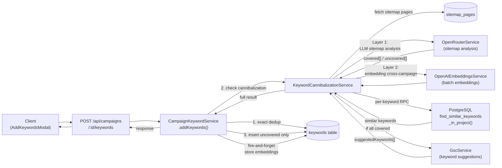
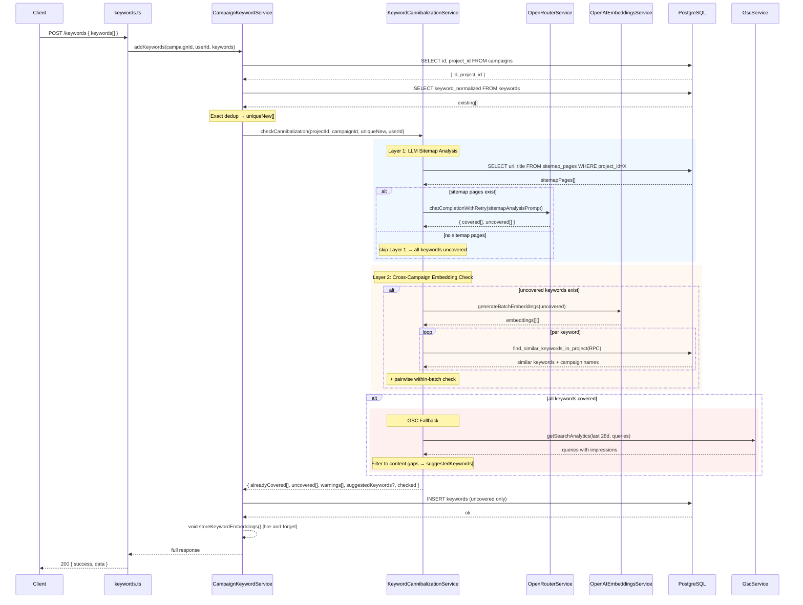
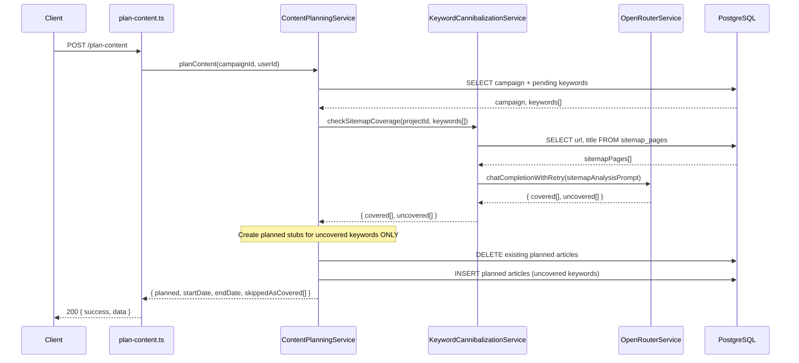

# PRD: Keyword Cannibalization Prevention

**Status:** Draft
**Complexity Score:** 8 → HIGH
**Created:** 2026-02-25
**Updated:** 2026-02-28 — Rewritten: LLM-based sitemap analysis replaces embedding-only approach
**Author:** Claude (Principal Architect)
**Depends on:** `content-planning-PRD.md` (complete — `planned` status, `ContentPlanningService`, and calendar integration are live)

---

## Complexity Assessment

| Factor                   | Score | Rationale                                                                      |
| ------------------------ | ----- | ------------------------------------------------------------------------------ |
| Touches 10+ files        | +2    | 12 files modified/created across DB, services, types, client UI                |
| New service from scratch | +2    | `KeywordCannibalizationService` — LLM analysis + embedding dedup + GSC lookup  |
| Database schema changes  | +1    | New column + IVFFlat index + SQL RPC function                                  |
| External API integration | +1    | OpenRouter LLM call (new prompt) + OpenAI batch embeddings + GSC query         |
| Plan-time hook           | +1    | Second integration point in `ContentPlanningService`                           |
| UI result state          | +1    | AddKeywordsModal result view + PlanContentModal skipped display                |
| **Total**                | **8** | **HIGH** — 6 phases, full-stack feature                                        |

**Risk Areas:**

- OpenRouter latency on large sitemap payloads (500+ pages → ~10K tokens) — mitigated by chunking
- Cloudflare Workers 10ms CPU limit — LLM call is I/O-bound (network wait), not CPU
- GSC connection may not exist — graceful skip with clear messaging
- LLM may misidentify coverage — non-blocking warnings, user keeps final decision

---

## Integration Points Checklist

```
How will this feature be reached?
- [x] Entry point 1: POST /api/campaigns/:campaignId/keywords (keyword addition)
- [x] Entry point 2: POST /api/campaigns/:campaignId/plan-content (content planning)
- [x] Caller files:
      - src/pages/api/campaigns/[campaignId]/keywords.ts
      - src/pages/api/campaigns/[campaignId]/plan-content.ts
- [x] Wiring: No new routes — extends existing responses

Is this user-facing?
- [x] YES — covered keywords filtered at addition; warnings returned to client
       (backend returns data; client hook types updated; toast/modal UI is out of scope)

Full user flow:
1. User pastes keywords into the Add Keywords modal
2. Client calls POST /api/campaigns/:campaignId/keywords
3. CampaignKeywordService.addKeywords() runs exact dedup (existing)
4. KeywordCannibalizationService runs two checks:
   a. LLM sitemap analysis: compares keywords against user's published blog pages
   b. Cross-campaign embedding check: compares against other campaign keywords in the same project
5. Covered keywords (matching existing sitemap pages) are NOT inserted
6. Remaining unique keywords are inserted normally
7. If ALL keywords were covered → GSC fallback suggests alternative keywords
8. Response includes { added, duplicates, alreadyCovered[], cannibalizationWarnings[], suggestedKeywords? }
9. Fire-and-forget: embeddings stored on inserted keyword rows for future cross-campaign checks

Second flow (plan-time):
1. User triggers "Plan Content" on a campaign
2. ContentPlanningService.planContent() fetches pending keywords
3. Re-runs sitemap analysis on pending keywords (catches new sitemap content added since keywords were added)
4. Filters out newly-covered keywords before creating planned article stubs
5. Returns coverage info alongside planning result
```

---

## 1. Context

### Problem

The content generation system prevents exact keyword duplicates within a campaign (case-insensitive via `keyword_normalized`) and has article-level semantic dedup at generation time (E10). However, there are two gaps:

1. **No check against the user's existing published content** — if the user already has a blog post about "best coffee makers", the system happily accepts that keyword and generates a competing article. The `sitemap_pages` table already stores the user's published URLs and titles, but this data is never consulted during keyword intake.

2. **No cross-campaign keyword overlap detection** — "best coffee makers" in Campaign A and "top coffee machines" in Campaign B both generate articles competing for the same search intent.

### Files Analyzed

| File                                                                              | Purpose                                                          |
| --------------------------------------------------------------------------------- | ---------------------------------------------------------------- |
| `server/services/campaign-keyword.service.ts`                                     | Primary file to modify — `addKeywords()` method                  |
| `server/services/content-planning.service.ts`                                     | Second integration point — `planContent()` method                |
| `server/services/openrouter.service.ts`                                           | LLM calls via OpenRouter — `chatCompletionWithRetry()`           |
| `server/services/openai-embeddings.service.ts`                                    | Existing embeddings service — add batch method                   |
| `server/services/sitemap-page.service.ts`                                         | Fetch sitemap pages for a project                                |
| `server/services/gsc.service.ts`                                                  | GSC search analytics — keyword suggestions fallback              |
| `server/services/campaign.service.ts`                                             | Facade — update return type                                      |
| `shared/types/campaign.types.ts`                                                  | `IAddKeywordsResponse`, `IKeyword`                               |
| `shared/types/calendar.types.ts`                                                  | `IPlanContentResponse`                                           |
| `client/hooks/useCampaignDetail.ts`                                               | Client hook — update return types                                |
| `supabase/migrations/20260210240100_add_topic_fingerprint_for_semantic_dedup.sql` | Reference pattern for vector column + index                      |

### Current Behavior

- `addKeywords()` detects exact duplicates (case-insensitive normalization) within the same campaign
- Response: `{ added: number, duplicates: number }` — no similarity or coverage information
- `sitemap_pages` stores the user's published URLs + titles — never consulted at keyword intake
- `keywords` table has no embedding column
- Semantic dedup (E10) runs only at generation time, too late to warn the user
- `planContent()` creates planned stubs from all pending keywords without checking for overlap
- GSC connection and search analytics are available but not used for keyword suggestions

### Target Behavior

- When keywords are added, the system:
  1. Runs existing exact dedup (unchanged)
  2. **LLM sitemap analysis**: sends new keywords + project's sitemap pages to an LLM, which identifies keywords already covered by published content
  3. Covered keywords are **filtered out** (not inserted) and returned in `alreadyCovered[]`
  4. **Cross-campaign embedding check**: generates embeddings for remaining keywords, compares against other campaigns in the project via pgvector RPC
  5. Cross-campaign matches are returned as `cannibalizationWarnings[]` (non-blocking — keywords still inserted)
  6. If ALL keywords were covered → **GSC fallback**: queries Search Console for content gap keywords as `suggestedKeywords[]`
  7. Stores embeddings on inserted keyword rows (fire-and-forget) for future cross-campaign checks
- When content is planned, the system:
  1. Re-runs sitemap analysis on pending keywords (catches sitemap changes since keyword addition)
  2. Skips covered keywords when creating planned article stubs
  3. Returns coverage info in `IPlanContentResponse`
- If OpenRouter/OpenAI unavailable → keywords insert normally, `cannibalizationChecked: false`

---

## 2. Solution

### Approach

- **Two-layer cannibalization detection**:
  - **Layer 1 (LLM sitemap analysis)**: Send keyword batch + sitemap page titles/URLs to OpenRouter LLM. The LLM understands search intent deeply — "best coffee makers" matches a page titled "Top Rated Coffee Brewers Guide" even though there's no string overlap. Covered keywords are **filtered out**.
  - **Layer 2 (embedding cross-campaign dedup)**: For keywords that pass Layer 1, generate OpenAI embeddings and compare against other campaign keywords via pgvector RPC. These are returned as **warnings** (non-blocking).
- **GSC fallback**: When all submitted keywords are already covered, query GSC for content gap opportunities — queries with impressions but no corresponding published page.
- **Plan-time re-check**: Re-run Layer 1 at `planContent()` time to catch sitemap pages published after keywords were added.
- **Non-blocking throughout**: every failure point is caught, logged, and skipped; keyword insertion never fails due to this feature.

### Architecture Diagram



### Key Decisions

- **Layer 1 model**: `serverEnv.OPENROUTER_DEFAULT_MODEL` (fallback `openai/gpt-4o-mini`) — fast, cheap, great at structured analysis
- **Sitemap payload**: send `{ url, title }[]` — titles are primary signal, URLs as fallback for null titles (LLM infers topic from URL slugs like `/reviews/best-coffee-brewers`)
- **Large sitemaps**: chunk at 200 pages per LLM call; merge results
- **Scope: per-project** — check across all campaigns within a project
- **Embedding threshold: 0.85** — same as article-level semantic dedup (E10)
- **Layer 1 action: filter** — covered keywords not inserted (strong protection before credits spent)
- **Layer 2 action: warn** — cross-campaign matches shown as warnings, user decides
- **GSC fallback**: only triggered when ALL keywords are covered; queries last 28 days of search analytics
- **Plan-time**: re-runs Layer 1 only (no embedding re-check needed — keywords already have embeddings stored)

### Data Changes

New migration `supabase/migrations/20260228200000_add_keyword_cannibalization.sql`:

- `keywords.keyword_embedding vector(1536)` — nullable; populated fire-and-forget after insertion
- IVFFlat index on `keyword_embedding` with `vector_cosine_ops`
- SQL function `find_similar_keywords_in_project(p_project_id, p_exclude_campaign_id, p_embedding, p_threshold, p_limit)`

No changes to `sitemap_pages` — LLM reads existing `url` + `title` fields directly.

---

## 3. Sequence Flow

### Keyword Addition Flow



### Plan-Time Flow



---

## 4. Execution Phases

### Phase 1: Database Foundation

**User-visible outcome:** Migration applied; `keywords` table has `keyword_embedding` column and `find_similar_keywords_in_project` RPC function.

**Files (1):**

- `supabase/migrations/20260228200000_add_keyword_cannibalization.sql` — CREATE

**Implementation:**

- [ ] Add `CREATE EXTENSION IF NOT EXISTS vector;` (idempotent — already enabled for articles, safe to repeat)
- [ ] `ALTER TABLE public.keywords ADD COLUMN IF NOT EXISTS keyword_embedding vector(1536);`
- [ ] Create IVFFlat index: `USING ivfflat (keyword_embedding vector_cosine_ops) WITH (lists = 100)`
- [ ] Create RPC function (SECURITY DEFINER, STABLE):
  ```sql
  CREATE OR REPLACE FUNCTION find_similar_keywords_in_project(
    p_project_id UUID,
    p_exclude_campaign_id UUID,
    p_embedding vector(1536),
    p_threshold FLOAT DEFAULT 0.85,
    p_limit INT DEFAULT 3
  )
  RETURNS TABLE (
    keyword_id UUID,
    keyword TEXT,
    campaign_id UUID,
    campaign_name TEXT,
    similarity FLOAT
  )
  LANGUAGE sql STABLE SECURITY DEFINER SET search_path = public
  AS $$
    SELECT
      k.id,
      k.keyword,
      c.id,
      c.name,
      1 - (k.keyword_embedding <=> p_embedding) AS similarity
    FROM keywords k
    INNER JOIN campaigns c ON c.id = k.campaign_id
    WHERE c.project_id = p_project_id
      AND k.campaign_id != p_exclude_campaign_id
      AND k.keyword_embedding IS NOT NULL
      AND 1 - (k.keyword_embedding <=> p_embedding) >= p_threshold
    ORDER BY k.keyword_embedding <=> p_embedding ASC
    LIMIT p_limit;
  $$;
  ```
- [ ] Add `COMMENT ON COLUMN` and `COMMENT ON FUNCTION`

**Tests Required:**

| Test                                   | Assertion                                            |
| -------------------------------------- | ---------------------------------------------------- |
| Migration runs without error           | `npx supabase db push` exits 0                       |
| `keyword_embedding` column exists      | `\d keywords` shows column                           |
| RPC function exists                    | `\df find_similar_keywords_in_project` returns 1 row |
| RPC with null embeddings returns empty | Call with all-null embeddings → 0 rows               |

**User Verification:**

- Action: Run `npx supabase db push` or `npx supabase migration up`
- Expected: Migration applies cleanly; no errors

---

### Phase 2: Batch Embeddings Method

**User-visible outcome:** `OpenAIEmbeddingsService` can generate embeddings for multiple texts in one API call.

**Files (1):**

- `server/services/openai-embeddings.service.ts` — add `generateBatchEmbeddings()` method

**Implementation:**

- [ ] Add method signature: `async generateBatchEmbeddings(texts: string[]): Promise<number[][]>`
- [ ] Guard: `if (!this.isConfigured()) throw new Error('OpenAI API key not configured')`
- [ ] Guard: `if (texts.length === 0) return []`
- [ ] Trim and filter empty strings before sending
- [ ] Build request body: `{ model: this.model, input: trimmedTexts, encoding_format: 'float' }`
- [ ] Same `fetch()` pattern as `generateEmbedding()` with same error handling
- [ ] Sort `data` array by `item.index` before mapping — guarantee order matches input
- [ ] Return `sorted.map(item => item.embedding)` — `number[][]`
- [ ] No new types needed: `IOpenAIEmbeddingResponse` already has `data: Array<{ embedding, index }>`

**Tests Required:**

| Test File                                                           | Test Name                                   | Assertion                                                       |
| ------------------------------------------------------------------- | ------------------------------------------- | --------------------------------------------------------------- |
| `tests/unit/server/services/openai-embeddings.service.unit.spec.ts` | `should return embeddings in input order`   | Result array length matches input length; index order preserved |
|                                                                     | `should return empty array for empty input` | `generateBatchEmbeddings([])` returns `[]`                      |
|                                                                     | `should throw when not configured`          | Rejects with "not configured" when `OPENAI_API_KEY` empty       |
|                                                                     | `should make single API call for batch`     | `fetch` spy called once for 10 inputs                           |

**User Verification:**

- Action: `yarn verify` passes (TypeScript + lint)
- Expected: No compile errors

---

### Phase 3: Cannibalization Service + Types

**User-visible outcome:** `KeywordCannibalizationService` detects keywords covered by existing sitemap pages (LLM), cross-campaign overlap (embeddings), and suggests GSC alternatives when all keywords are covered.

**Files (2):**

- `server/services/keyword-cannibalization.service.ts` — CREATE
- `shared/types/campaign.types.ts` — extend `IAddKeywordsResponse`, add new interfaces

#### `shared/types/campaign.types.ts` changes

Add after `IAddKeywordsResponse`:

```typescript
/**
 * A keyword that is already covered by existing published content
 */
export interface IKeywordCoverage {
  /** The keyword that was filtered out */
  keyword: string;
  /** URL of the existing page that covers this keyword */
  coveredByUrl: string;
  /** Title of the existing page (may be null if sitemap had no title) */
  coveredByTitle: string | null;
  /** LLM reasoning for why this keyword is already covered */
  reason: string;
}

/**
 * A cross-campaign keyword cannibalization warning (non-blocking)
 */
export interface ICannibalizationWarning {
  /** The newly-added keyword that has potential overlap */
  newKeyword: string;
  /** The existing keyword it overlaps with */
  existingKeyword: string;
  /** Name of the campaign containing the existing keyword */
  existingCampaignName: string;
  /** ID of the campaign containing the existing keyword */
  existingCampaignId: string;
  /** Cosine similarity score (0-1) */
  similarity: number;
  /** Human-readable similarity percentage (0-100) */
  similarityPercent: number;
}
```

Extend `IAddKeywordsResponse`:

```typescript
export interface IAddKeywordsResponse {
  added: number;
  duplicates: number;
  /** Keywords filtered out because they're already covered by published content */
  alreadyCovered?: IKeywordCoverage[];
  /** Cross-campaign overlap warnings (non-blocking — keywords still added) */
  cannibalizationWarnings?: ICannibalizationWarning[];
  /** Alternative keywords from GSC (only present when all keywords were covered) */
  suggestedKeywords?: string[];
  /** Whether the cannibalization check ran (false if services unavailable) */
  cannibalizationChecked?: boolean;
}
```

#### `shared/types/calendar.types.ts` changes

Extend `IPlanContentResponse`:

```typescript
export interface IPlanContentResponse {
  planned: number;
  startDate: string | null;
  endDate: string | null;
  message?: string;
  /** Keywords skipped because they're now covered by published content */
  skippedAsCovered?: IKeywordCoverage[];
}
```

#### `server/services/keyword-cannibalization.service.ts`

Constants:

```typescript
const DEFAULT_THRESHOLD = 0.85;
const MAX_SIMILAR_PER_KEYWORD = 3;
const EMBEDDING_BATCH_SIZE = 100;
const SITEMAP_CHUNK_SIZE = 200; // max pages per LLM call
```

**LLM Sitemap Analysis Prompt** (Layer 1):

```
System: You are a keyword cannibalization analyst for SEO. Given a list of
existing published blog pages (URL + title) and a list of new target keywords,
determine which keywords are already covered by existing content.

A keyword is "covered" if an existing page targets the same search intent —
even if the wording differs. For example, "best coffee makers" is covered by
a page titled "Top Rated Coffee Machines Guide".

Respond in JSON:
{
  "covered": [
    { "keyword": "...", "coveredByUrl": "...", "coveredByTitle": "...", "reason": "..." }
  ],
  "uncovered": ["keyword1", "keyword2"]
}

User: Existing pages: [sitemap data]
New keywords: [keyword list]
```

**Methods:**

`checkCannibalization(projectId, campaignId, newKeywords[], userId)`:

1. Guard: empty array → `{ alreadyCovered: [], uncovered: newKeywords, warnings: [], checked: true }`
2. **Layer 1 — LLM Sitemap Analysis**:
   a. Fetch `sitemap_pages` for `projectId`
   b. If no sitemap pages → skip Layer 1, all keywords are "uncovered"
   c. If sitemap pages exist → chunk at `SITEMAP_CHUNK_SIZE`, call `openRouterService.chatCompletionWithRetry()` per chunk with `responseFormat: { type: 'json_object' }`
   d. Merge results across chunks
   e. Parse JSON response → `alreadyCovered[]` + `uncoveredKeywords[]`
   f. On LLM error → `console.warn` + treat all as uncovered (fail-open)
3. **Layer 2 — Cross-Campaign Embedding Check** (on uncovered keywords only):
   a. If `openaiEmbeddingsService.isConfigured()` is false → skip, `warnings: []`
   b. Generate batch embeddings (chunked by `EMBEDDING_BATCH_SIZE`)
   c. Pairwise within-batch check (same as original PRD)
   d. Per-keyword RPC `find_similar_keywords_in_project()`
   e. Collect `cannibalizationWarnings[]`
4. **GSC Fallback** (only if ALL keywords were covered):
   a. Look up GSC connection for project
   b. If connected → `gscService.getSearchAnalytics()` last 28 days, dimension `query`
   c. Filter to queries with impressions ≥ 10 that are NOT in sitemap page URLs
   d. Return top 10 as `suggestedKeywords[]`
   e. On error → skip, `suggestedKeywords: undefined`
5. Return full result

`checkSitemapCoverage(projectId, keywords[])`:

- Simplified version for plan-time use — runs Layer 1 only (no embeddings, no GSC)
- Returns `{ covered: IKeywordCoverage[], uncovered: string[] }`

`storeKeywordEmbeddings(keywordTexts[], campaignId)`:

- Same as original PRD — fire-and-forget embedding storage

Export singleton: `export const keywordCannibalizationService = new KeywordCannibalizationService()`

**Implementation checklist:**

- [ ] Import `supabaseAdmin` from `@server/supabase/supabaseAdmin`
- [ ] Import `openRouterService` from `./openrouter.service`
- [ ] Import `openaiEmbeddingsService` from `./openai-embeddings.service`
- [ ] Import `gscService` from `./gsc.service`
- [ ] Import `sitemapPageService` from `./sitemap-page.service`
- [ ] Import types from `@shared/types/campaign.types`
- [ ] Use `serverEnv.OPENROUTER_DEFAULT_MODEL` for LLM model (fallback `openai/gpt-4o-mini`)
- [ ] Normalize helper: same `kw.trim().toLowerCase().replace(/\s+/g, ' ')` as `campaign-keyword.service.ts`
- [ ] LLM call: `responseFormat: { type: 'json_object' }` for structured output
- [ ] Sitemap chunking: `for (let i = 0; i < pages.length; i += SITEMAP_CHUNK_SIZE)`
- [ ] LLM response parsing wrapped in try/catch (malformed JSON → fail-open)
- [ ] Embedding batch chunking: `for (let i = 0; i < keywords.length; i += EMBEDDING_BATCH_SIZE)`
- [ ] Within-batch: only push warning once per pair (use `i < j` check)
- [ ] RPC call: `p_embedding` must be formatted as PostgreSQL vector string `'[x,y,z,...]'`
- [ ] All external calls wrapped in individual try/catch
- [ ] GSC connection lookup: `supabaseAdmin.from('gsc_connections').select().eq('project_id', projectId).eq('status', 'active').single()`
- [ ] GSC filter: exclude queries that already exist as keywords in any campaign of the project

**Tests Required:**

| Test File                                                                 | Test Name                                                    | Assertion                                                                 |
| ------------------------------------------------------------------------- | ------------------------------------------------------------ | ------------------------------------------------------------------------- |
| `tests/unit/server/services/keyword-cannibalization.service.unit.spec.ts` | `should return checked:false when OpenRouter not configured` | Guard returns early with all keywords uncovered                           |
| | `should identify covered keywords via LLM` | Mock LLM returns covered → `alreadyCovered` has entries |
| | `should treat all as uncovered when no sitemap pages` | Empty sitemap → all keywords in `uncovered[]` |
| | `should handle LLM JSON parse error gracefully` | Malformed LLM response → all keywords uncovered, no throw |
| | `should chunk large sitemaps` | 300 pages → `chatCompletionWithRetry` called twice |
| | `should return warning for cross-campaign match` | RPC returns match → `warnings` has entry |
| | `should return warning for within-batch similarity` | Two similar keywords → warning without RPC |
| | `should continue on RPC error` | RPC rejects → `warnings` partial, no throw |
| | `should suggest GSC keywords when all covered` | All covered + GSC connected → `suggestedKeywords` present |
| | `should skip GSC when not connected` | No GSC connection → `suggestedKeywords: undefined` |
| | `checkSitemapCoverage: should run Layer 1 only` | No embedding calls made, no GSC calls |
| | `storeKeywordEmbeddings: should update keyword rows` | `supabaseAdmin.from.update` called per keyword |
| | `storeKeywordEmbeddings: should skip when not configured` | Returns early without API call |

**User Verification:**

- Action: `yarn verify`
- Expected: TypeScript compiles, no lint errors

---

### Phase 4: Service Integration (addKeywords)

**User-visible outcome:** Adding keywords returns coverage analysis, cannibalization warnings, and GSC suggestions in the API response.

**Files (3):**

- `server/services/campaign-keyword.service.ts` — integrate cannibalization check + filter
- `server/services/campaign.service.ts` — update facade return type
- `client/hooks/useCampaignDetail.ts` — update client return types

#### `server/services/campaign-keyword.service.ts`

1. Add imports: `keywordCannibalizationService`, `IKeywordCoverage`, `ICannibalizationWarning`
2. Expand campaign query: `.select('id, project_id')`
3. After exact dedup builds `uniqueNew[]`, before insertion:
   ```typescript
   let cannibalizationResult = {
     alreadyCovered: [] as IKeywordCoverage[],
     uncovered: uniqueNew,
     warnings: [] as ICannibalizationWarning[],
     suggestedKeywords: undefined as string[] | undefined,
     checked: false,
   };
   if (campaign.project_id && uniqueNew.length > 0) {
     try {
       cannibalizationResult = await keywordCannibalizationService.checkCannibalization(
         campaign.project_id,
         campaignId,
         uniqueNew,
         userId
       );
     } catch (error) {
       console.warn('[CampaignKeywordService] Cannibalization check failed:', error);
       // Fail-open: insert all keywords
     }
   }
   ```
4. Insert only `cannibalizationResult.uncovered` (not all `uniqueNew`)
5. Fire-and-forget `storeKeywordEmbeddings()` for inserted keywords
6. Return full response shape

#### `server/services/campaign.service.ts`

Update `addKeywords()` return type to match `IAddKeywordsResponse`.

#### `client/hooks/useCampaignDetail.ts`

1. Import `IKeywordCoverage`, `ICannibalizationWarning`
2. Update `addKeywords` return type to match `IAddKeywordsResponse`
3. Update `apiFetch` data type assertion

**Tests Required:**

| Test File                                                          | Test Name                                                       | Assertion                                                              |
| ------------------------------------------------------------------ | --------------------------------------------------------------- | ---------------------------------------------------------------------- |
| `tests/unit/server/services/campaign-keyword.service.unit.spec.ts` | `should filter out covered keywords`                            | Mock CAS returns 2 covered → only uncovered inserted                   |
|                                                                    | `should include alreadyCovered in response`                     | Response has `alreadyCovered[]` with correct entries                    |
|                                                                    | `should include cannibalizationWarnings in response`            | Mock CAS returns warning → response has it                             |
|                                                                    | `should include suggestedKeywords when all covered`             | Mock CAS returns suggestions → response has them                       |
|                                                                    | `should return cannibalizationChecked:false when service fails` | CAS throws → all keywords inserted, `checked: false`                   |
|                                                                    | `should fire-and-forget storeKeywordEmbeddings`                 | Method called with uncovered keywords after insert                     |
|                                                                    | `should pass project_id to checkCannibalization`                | Campaign query returns `project_id`; passed to CAS                     |
|                                                                    | `test mode: should return checked:false without hitting CAS`    | Mock user path returns early with defaults                             |

**User Verification:**

```bash
curl -X POST http://localhost:3000/api/campaigns/{campaignId}/keywords \
  -H "Cookie: <session>" \
  -H "Content-Type: application/json" \
  -d '{"keywords":["best coffee makers","top coffee machines"]}' | jq .

# Expected:
# {
#   "success": true,
#   "data": {
#     "added": 1,
#     "duplicates": 0,
#     "alreadyCovered": [{ "keyword": "best coffee makers", ... }],
#     "cannibalizationWarnings": [...] or [],
#     "suggestedKeywords": [...] or absent,
#     "cannibalizationChecked": true
#   }
# }
```

---

### Phase 5: Plan-Time Integration

**User-visible outcome:** Content planning filters out keywords covered by recently-published sitemap pages.

**Files (2):**

- `server/services/content-planning.service.ts` — add sitemap coverage check before creating stubs
- `shared/types/calendar.types.ts` — extend `IPlanContentResponse` (done in Phase 3)

#### `server/services/content-planning.service.ts`

After fetching pending keywords (Step 2) and before deleting existing planned articles (Step 4):

```typescript
// Step 3: Re-check sitemap coverage (catches new content published since keywords were added)
let keywordsToplan = keywords;
let skippedAsCovered: IKeywordCoverage[] = [];

if (campaign.project_id) {
  try {
    const coverageResult = await keywordCannibalizationService.checkSitemapCoverage(
      campaign.project_id,
      keywords.map(k => k.keyword)
    );
    skippedAsCovered = coverageResult.covered;
    // Filter to only plan uncovered keywords
    const uncoveredSet = new Set(coverageResult.uncovered.map(k => k.toLowerCase()));
    keywordsToplan = keywords.filter(k => uncoveredSet.has(k.keyword.toLowerCase()));
  } catch (error) {
    console.warn('[ContentPlanningService] Sitemap coverage check failed:', error);
    // Fail-open: plan all keywords
  }
}
```

Then use `keywordsToplan` instead of `keywords` for stub creation. Include `skippedAsCovered` in response.

**Tests Required:**

| Test File                                                             | Test Name                                                   | Assertion                                                      |
| --------------------------------------------------------------------- | ----------------------------------------------------------- | -------------------------------------------------------------- |
| `tests/unit/server/services/content-planning.service.unit.spec.ts`    | `should skip covered keywords at plan time`                 | Mock CAS returns 2 covered → only uncovered stubs created      |
|                                                                       | `should include skippedAsCovered in response`               | Response has `skippedAsCovered[]` with correct entries          |
|                                                                       | `should plan all keywords when coverage check fails`        | CAS throws → all keywords planned, no throw                    |
|                                                                       | `should plan all keywords when no project_id`               | Campaign without project → all keywords planned                |

**User Verification:**

- Action: Import a sitemap with a page about "coffee makers", then plan content for a campaign with the keyword "best coffee makers"
- Expected: The keyword is skipped; `skippedAsCovered` includes it with the matching sitemap page URL

---

### Phase 6: UI Integration

**User-visible outcome:** Users see which keywords were filtered, why, and get GSC suggestions — both at keyword addition time and plan-content time.

**Files (4):**

- `client/components/dashboard/views/campaign-detail/AddKeywordsModal.tsx` — add result state with coverage details
- `client/components/dashboard/views/CampaignDetailView.tsx` — pass result data to modal
- `client/components/dashboard/views/calendar/PlanContentModal.tsx` — show skipped keywords in success state
- `client/hooks/useCampaignDetail.ts` — already updated in Phase 4 (return type); no additional changes

#### `AddKeywordsModal.tsx` — Result State

Currently the modal calls `onAdd(parsed)` → closes immediately on success. The new flow keeps the modal open after submission and transitions to a **result state** showing what happened.

**Props change:**

```typescript
interface IAddKeywordsModalProps {
  isOpen: boolean;
  onClose: () => void;
  onAdd: (keywords: string[]) => Promise<IAddKeywordsResponse>;  // was void | Promise<void>
}
```

**New state:**

```typescript
const [result, setResult] = useState<IAddKeywordsResponse | null>(null);
```

**Updated `handleAdd`:**

```typescript
const handleAdd = async () => {
  const parsed = newKeywords.split('\n').map(k => k.trim()).filter(k => k.length > 0);
  if (parsed.length === 0) return;
  setIsSubmitting(true);
  try {
    const response = await onAdd(parsed);
    setResult(response);               // ← show result state instead of closing
    // Do NOT close the modal yet — user reviews the result first
  } finally {
    setIsSubmitting(false);
  }
};
```

**Result state UI** (rendered when `result !== null`):

```
┌─────────────────────────────────────────────────┐
│  Keyword Analysis Results                    ✕  │
├─────────────────────────────────────────────────┤
│                                                 │
│  ✓  5 keywords added                            │
│  ⚠  2 already covered by published content      │
│  ⓘ  1 cross-campaign overlap warning            │
│                                                 │
│  ┌─ Already Covered ──────────────────────────┐ │
│  │ "best coffee makers"                       │ │
│  │  → /reviews/top-coffee-machines (92%)      │ │
│  │  "This page targets the same search        │ │
│  │   intent: coffee maker recommendations"    │ │
│  │                                            │ │
│  │ "espresso machine guide"                   │ │
│  │  → /guides/espresso-buying-guide (88%)     │ │
│  │  "Existing guide covers espresso machine   │ │
│  │   purchase advice comprehensively"         │ │
│  └────────────────────────────────────────────┘ │
│                                                 │
│  ┌─ Cross-Campaign Overlaps ──────────────────┐ │
│  │ "cold brew methods" → 87% similar to       │ │
│  │  "cold brew techniques" in Campaign B      │ │
│  └────────────────────────────────────────────┘ │
│                                                 │
│  ┌─ Suggested Keywords (from GSC) ────────────┐ │
│  │  (only shown when all keywords covered)    │ │
│  │  □ "pour over coffee ratio"                │ │
│  │  □ "french press vs aeropress"             │ │
│  │  □ "coffee grind size chart"               │ │
│  │  [ Add Selected ]                          │ │
│  └────────────────────────────────────────────┘ │
│                                                 │
│            [ Done ]                             │
└─────────────────────────────────────────────────┘
```

**Implementation structure:**

```typescript
{result !== null ? (
  <div className="p-6 space-y-4">
    {/* Summary counts */}
    <div className="space-y-2">
      {result.added > 0 && (
        <p className="text-sm text-success flex items-center gap-2">
          <CheckCircle className="w-4 h-4" /> {result.added} keyword(s) added
        </p>
      )}
      {result.duplicates > 0 && (
        <p className="text-sm text-muted flex items-center gap-2">
          <Copy className="w-4 h-4" /> {result.duplicates} duplicate(s) skipped
        </p>
      )}
      {(result.alreadyCovered?.length ?? 0) > 0 && (
        <p className="text-sm text-amber-400 flex items-center gap-2">
          <AlertTriangle className="w-4 h-4" /> {result.alreadyCovered!.length} already covered
        </p>
      )}
    </div>

    {/* Already Covered section — collapsible */}
    {(result.alreadyCovered?.length ?? 0) > 0 && (
      <CoverageDetailSection items={result.alreadyCovered!} />
    )}

    {/* Cross-Campaign Warnings — collapsible */}
    {(result.cannibalizationWarnings?.length ?? 0) > 0 && (
      <WarningsSection warnings={result.cannibalizationWarnings!} />
    )}

    {/* GSC Suggestions — with checkboxes and "Add Selected" action */}
    {result.suggestedKeywords && result.suggestedKeywords.length > 0 && (
      <GscSuggestionsSection
        suggestions={result.suggestedKeywords}
        onAddSelected={(selected) => { /* re-submit selected keywords */ }}
      />
    )}

    <DashboardButton onClick={handleDone} className="w-full">Done</DashboardButton>
  </div>
) : (
  /* existing input/file upload UI */
)}
```

**`handleDone`:**

```typescript
const handleDone = () => {
  setResult(null);
  setNewKeywords('');
  setFileName(null);
  setInputTab('manual');
  onClose();
};
```

**Sub-components** (extract within same file or co-locate):

1. **`CoverageDetailSection`** — renders `IKeywordCoverage[]` as expandable cards:
   - Keyword text (bold)
   - Matched page URL (clickable link, truncated)
   - Matched page title (if available)
   - LLM reason text (muted, smaller)

2. **`WarningsSection`** — renders `ICannibalizationWarning[]`:
   - New keyword → existing keyword (with similarity badge)
   - Campaign name link

3. **`GscSuggestionsSection`** — renders `string[]` with checkboxes:
   - Each suggestion as a checkbox item
   - "Add Selected" button → calls `onAdd()` again with selected keywords
   - Disabled when none selected

#### `CampaignDetailView.tsx` — Pass Result Through

The current wiring:

```typescript
const handleAddKeywords = async (keywords: string[]): Promise<void> => {
  await addKeywords(keywords);
};
```

Needs to become:

```typescript
const handleAddKeywords = async (keywords: string[]): Promise<IAddKeywordsResponse> => {
  return await addKeywords(keywords);
};
```

The `addKeywords` function from `useCampaignDetail` already returns the response data — it's just not being passed through. The `useMutationWithToast` wrapper returns the result, so this is a one-line change.

**Toast message update** — the `successMessage` callback in `useCampaignDetail` should be updated to include coverage info:

```typescript
successMessage: (data: IAddKeywordsResponse) => {
  const parts = [`${data.added} keyword(s) added`];
  if (data.duplicates > 0) parts.push(`${data.duplicates} duplicate(s)`);
  if (data.alreadyCovered?.length) parts.push(`${data.alreadyCovered.length} already covered`);
  return parts.join(', ');
},
```

#### `PlanContentModal.tsx` — Skipped Keywords in Success State

Extend the success state to show `skippedAsCovered` when present.

**After the planned count and date range** (line ~134), add:

```typescript
{result.skippedAsCovered && result.skippedAsCovered.length > 0 && (
  <div className="w-full mt-3 p-3 bg-amber-500/10 border border-amber-500/20 rounded-lg">
    <p className="text-sm text-amber-400 font-medium mb-2">
      {result.skippedAsCovered.length} keyword(s) skipped — already covered
    </p>
    <ul className="space-y-1.5">
      {result.skippedAsCovered.map((item, i) => (
        <li key={i} className="text-xs text-muted">
          <span className="text-secondary">"{item.keyword}"</span>
          {' → '}
          <a
            href={item.coveredByUrl}
            target="_blank"
            rel="noopener noreferrer"
            className="text-accent hover:underline truncate"
          >
            {item.coveredByTitle || item.coveredByUrl}
          </a>
        </li>
      ))}
    </ul>
  </div>
)}
```

The `IPlanContentResponse` type was already extended in Phase 3, so no type changes needed here.

**Tests Required:**

| Test File                                                                                | Test Name                                                         | Assertion                                                         |
| ---------------------------------------------------------------------------------------- | ----------------------------------------------------------------- | ----------------------------------------------------------------- |
| `client/components/dashboard/views/campaign-detail/__tests__/AddKeywordsModal.test.tsx`  | `should show result state after submission`                       | After `onAdd` resolves, result UI renders (not input UI)          |
|                                                                                          | `should display covered keywords with page URLs`                  | `alreadyCovered` items render with URL links and reason text      |
|                                                                                          | `should display cross-campaign warnings with similarity`          | `cannibalizationWarnings` items render with percentage badge      |
|                                                                                          | `should display GSC suggestions with checkboxes`                  | `suggestedKeywords` render as selectable items                    |
|                                                                                          | `should allow adding GSC suggestions`                             | Selecting suggestions and clicking "Add Selected" calls `onAdd`   |
|                                                                                          | `should reset to input state on Done`                             | Clicking "Done" clears result and closes modal                    |
|                                                                                          | `should show only summary when no warnings or coverage`           | `added > 0, alreadyCovered: []` → only success count shown        |
| `client/components/dashboard/views/calendar/__tests__/PlanContentModal.test.tsx`         | `should show skipped keywords in success state`                   | `skippedAsCovered` present → amber banner with keyword list       |
|                                                                                          | `should not show skipped section when empty`                      | `skippedAsCovered: []` → no amber banner                          |
|                                                                                          | `should link skipped keywords to sitemap pages`                   | Each skipped keyword has clickable URL link                       |

**User Verification:**

1. Add keywords where some match sitemap pages → modal shows result state with covered keywords, reasons, and page links
2. Add keywords with cross-campaign overlap → warning section appears with similarity percentages
3. Add keywords that are ALL covered → GSC suggestions section appears with "Add Selected" button
4. Plan content for a campaign with covered keywords → PlanContentModal shows amber "skipped" banner

---

## 5. Checkpoint Protocol

After each phase, spawn the prd-work-reviewer agent:

```
Task({
  subagent_type: 'prd-work-reviewer',
  prompt: 'Review checkpoint for phase [N] of PRD at docs/PRDs/keyword-cannibalization-prevention.md',
  description: 'Review phase N checkpoint'
})
```

Continue only when agent reports PASS.

---

## 6. Acceptance Criteria

- [ ] Phase 1: Migration applies cleanly; `keyword_embedding` column + IVFFlat index + RPC exist
- [ ] Phase 2: `generateBatchEmbeddings()` works; sends single API call per batch; preserves order
- [ ] Phase 3: `KeywordCannibalizationService` detects sitemap coverage (LLM), cross-campaign overlap (embeddings), suggests GSC alternatives; unit tests pass
- [ ] Phase 4: `addKeywords()` filters covered keywords, returns `alreadyCovered[]`, `cannibalizationWarnings[]`, `suggestedKeywords?`; backward-compatible; client types updated
- [ ] Phase 5: `planContent()` re-checks sitemap coverage and skips covered keywords; returns `skippedAsCovered[]`
- [ ] Phase 6: AddKeywordsModal shows result state with coverage details, warnings, and GSC suggestions; PlanContentModal shows skipped keywords; component tests pass
- [ ] All unit tests pass (`yarn test`)
- [ ] `yarn verify` passes (TypeScript + lint)
- [ ] Keyword insertion never fails when OpenRouter/OpenAI is unavailable (fail-open)
- [ ] Test mode returns `cannibalizationChecked: false` without hitting any external APIs
- [ ] Large sitemaps (500+ pages) handled via chunking without timeout

---

## 7. Out of Scope (Follow-up Tasks)

- **Configurable threshold**: Per-campaign or per-user similarity threshold for embedding layer
- **Retroactive backfill**: Generating embeddings for existing keywords already in the DB
- **Sitemap auto-refresh**: Periodically re-crawl user sitemap to keep `sitemap_pages` current (currently manual import only)
- **Article-level cross-project check**: Today's E10 (article dedup) handles same-campaign; cross-campaign article check is not planned
- **Keyword Health dashboard**: Persistent view in campaign detail showing overall keyword coverage and overlap status
