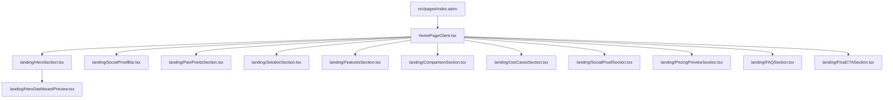

# PRD: AutopilotRank Landing Page Rebrand & UI Template Merge

**Complexity: 8 → HIGH mode**

```
COMPLEXITY SCORE:
+3  Touches 10+ files (landing page, locale, env, layout, nav, footer, pricing, features, meta tags, config)
+2  New system/module from scratch (7 new landing page sections)
+1  External API integration (none new, but Stripe price IDs reconfigured)
+2  Complex state logic (interactive hero dashboard, tab-based sections, comparison table)
= 8 → HIGH
```

---

## 1. Context

**Problem:** The current landing page and branding belong to a generic "SaaS Boilerplate" for developers. The product is being repositioned as **AutopilotRank**, an AI SEO content automation platform. The landing page needs to communicate the AutopilotRank value proposition, and the UI_TEMPLATE reference implementation provides the target design and section structure that must be adapted into the existing Astro 5 + React islands architecture.

**Files Analyzed:**

- `src/pages/index.astro` - Landing page entry point (Astro wrapper)
- `client/components/pages/HomePageClient.tsx` - Current landing page (334 lines, generic SaaS copy)
- `UI_TEMPLATE/App.tsx` - Reference app structure showing section order
- `UI_TEMPLATE/components/Hero.tsx` - Interactive hero with dashboard preview (527 lines)
- `UI_TEMPLATE/components/PainPoints.tsx` - 3-column pain point agitation
- `UI_TEMPLATE/components/Solution.tsx` - Workflow diagram + feature grid
- `UI_TEMPLATE/components/Features.tsx` - Alternating feature deep-dives
- `UI_TEMPLATE/components/Comparison.tsx` - Competitor comparison table
- `UI_TEMPLATE/components/UseCases.tsx` - Tabbed customer segments
- `UI_TEMPLATE/components/SocialProof.tsx` - Logo bar + metrics + testimonials
- `UI_TEMPLATE/components/Pricing.tsx` - 3-tier pricing cards
- `UI_TEMPLATE/components/FAQ.tsx` - Accordion FAQ
- `UI_TEMPLATE/components/Dashboard.tsx` - Dashboard layout reference
- `UI_TEMPLATE/components/dashboard/*.tsx` - 8 dashboard view components
- `locales/en/homepage.json` - Current generic i18n strings
- `.env.client` - `PUBLIC_APP_NAME=SaaS Boilerplate` and other branding vars
- `src/layouts/Layout.astro` - Layout with stale JSON-LD ("image upscaling")
- `shared/config/subscription.config.ts` - Current plans (Free/Starter/Hobby/Pro/Business)
- `shared/config/credits.config.ts` - Credit costs (API_CALL: 1)
- `shared/config/stripe.ts` - Stripe price IDs and plan definitions
- `docs/business/landing-page.md` - Landing page specification
- `docs/business/business-model-canvas/value-proposition.md` - Competitive positioning
- `docs/business/business-model-canvas/revenue-streams.md` - Pricing strategy
- `docs/business/business-model-canvas/customer-segments.md` - Target personas

**Current Behavior:**

- Landing page says "Build Your SaaS Faster Than Ever" with generic API/developer messaging
- Only 4 sections: Hero, Features (3 generic cards), FAQ (4 generic items), CTAs
- `.env.client` has `PUBLIC_APP_NAME=SaaS Boilerplate`
- Layout JSON-LD references "image upscaling" (leftover from previous product)
- Subscription plans are Free/Starter($9)/Hobby($19)/Pro($49)/Business($149) with credit-based pricing
- No pain points, solution workflow, competitor comparison, use cases, or social proof sections

---

## 2. Solution

**Approach:**

1. **Rebrand all touchpoints** - Update `.env.client`, Layout JSON-LD, meta tags, page titles from "SaaS Boilerplate" to "AutopilotRank"
2. **Rebuild HomePageClient** - Replace the 4-section generic page with 10 sections adapted from the UI_TEMPLATE, using AutopilotRank copy from `docs/business/landing-page.md`
3. **Extract sections into separate components** under `client/components/landing/` for maintainability
4. **Update locale strings** in `locales/en/homepage.json` with AutopilotRank-specific copy
5. **Reconfigure pricing** - Update `subscription.config.ts` and `credits.config.ts` to match the new Starter($49)/Growth($99)/Agency($249) tiers where 1 credit = 1 article
6. **Add dashboard route reference section** documenting the upcoming new dashboard views from the UI_TEMPLATE (Campaigns, Keywords, Optimization, Calendar, Backlinks, Analytics)

**Architecture:**



**Key Decisions:**

- **Adapt, don't copy-paste** the UI_TEMPLATE. The template uses raw Tailwind with `slate-950`/`brand-*` colors and standalone React. We must use the project's Tailwind config tokens (`main`, `surface`, `elevated`, `accent`, `text-primary`, etc.) and integrate with the Astro islands pattern.
- **Keep i18n pattern** - All user-facing strings stay in `locales/en/homepage.json` referenced via `getTranslations('homepage')`.
- **Legal safety for competitor references** - The landing page copy references competitors (Outrank, Byword, Surfer). We must:
  - Only state **verifiable facts** (pricing from public sites, features from public docs)
  - Use review quotes **with attribution** (e.g., "Reddit user" or "G2 review")
  - Avoid subjective disparagement (no "AI slop", no "looking at you, Byword")
  - Use factual comparison tables with check/cross icons rather than editorial commentary
  - Replace "Outrank crashes" with neutral "Platform stability varies"
  - Remove the FAQ question "How is this different from Outrank.so?" and replace with a generic "How does AutopilotRank compare to other tools?"
  - Never claim specific percentages (e.g., "95% AI detection pass rate") until we can substantiate them
- **Social proof** - Use placeholder testimonials clearly marked as examples (no fabricated names/companies) until real testimonials are gathered. Omit fake G2/Capterra badges.
- **Hero dashboard preview** - Adapt the UI_TEMPLATE's interactive dashboard preview (typing effect, tabbed views) to show AutopilotRank functionality. This is a key differentiator in the landing page design.
- **Pricing section** shows a preview on the landing page (3 cards) and links to `/pricing` for the full experience. The actual Stripe integration changes will be handled in a separate PRD.

**Data Changes:**

- `locales/en/homepage.json` - Complete rewrite (~150 keys)
- `.env.client` - Update `PUBLIC_APP_NAME`, `PUBLIC_APP_SLUG`, `PUBLIC_PRIMARY_DOMAIN` etc.
- `shared/config/subscription.config.ts` - Restructure to Starter/Growth/Agency tiers
- `shared/config/credits.config.ts` - Redefine credits (1 credit = 1 article)

---

## 3. Competitor Copy Legal Guidelines

**Critical:** All competitor references must be legally defensible.

### What IS allowed:
- Factual feature comparisons using publicly available information
- Pricing pulled from competitor websites (with date noted)
- Citing public reviews with proper attribution (platform + approximate date)
- Stating objective feature differences (e.g., "offers WordPress integration" vs "does not")

### What is NOT allowed:
- Subjective insults ("AI slop", "buggy", "crashes", "sucks")
- Fabricated or exaggerated statistics without substantiation
- Fake testimonials or review badges (G2, Capterra) we don't have
- Implying competitors are dishonest ("looking at you, Byword")
- Using competitor trademarks in paid advertising or meta tags

### Copy transformations from `docs/business/landing-page.md`:

| Original (risky) | Revised (safe) |
|---|---|
| "Outrank crashes. Byword doesn't work with your host. Support takes days." | "Some tools have reliability issues. Some lack hosting compatibility. Support response times vary across the industry." |
| "AI slop" / "generic AI slop" | "generic-sounding content" |
| "Support sucks" (Reddit) | "Many users report slow support response times" |
| "(looking at you, Byword)" | Remove entirely |
| "95%+ AI detection pass rate" | "High AI detection pass rate" (until substantiated) |
| "50,000+ articles generated" / "500+ happy customers" | Remove until real (use "Launching soon" or similar) |
| Fake G2/Capterra badges | Remove entirely |
| Fabricated testimonial names (Sarah J., Mike T., etc.) | Use placeholder format: "[Name] - [Role]" with note "Beta user testimonials coming soon" |

### Comparison table approach:
- Use checkmarks/crosses for feature availability (objective)
- Link to sources for pricing claims
- Add small-print disclaimer: "Feature comparison based on publicly available information as of February 2026. Verify current details on each provider's website."

---

## 4. Integration Points Checklist

```markdown
**How will this feature be reached?**
- [x] Entry point: `src/pages/index.astro` → `HomePageClient` (already exists)
- [x] Caller file: `Layout.astro` renders the page with nav + footer
- [x] No new routes needed - this replaces existing content

**Is this user-facing?**
- [x] YES → Landing page components (10 new sections)
- [x] YES → Updated navigation text, footer, meta tags

**Full user flow:**
1. User visits autopilotrank.com (or localhost:4321)
2. Layout.astro renders NavBarAstro + HomePageClient + FooterAstro
3. HomePageClient renders all 10 landing page sections in order
4. CTAs trigger openAuthModal('register') or navigate to /pricing
5. Updated branding visible throughout (nav logo, footer, page title)
```

---

## 5. Execution Phases

### Phase 1: Branding & Configuration Update

**User-visible outcome:** App displays "AutopilotRank" everywhere instead of "SaaS Boilerplate". JSON-LD and meta tags reference AutopilotRank.

**Files (5):**

- `.env.client` - Update PUBLIC_APP_NAME, PUBLIC_APP_SLUG, domain vars
- `src/layouts/Layout.astro` - Fix stale JSON-LD descriptions
- `src/pages/index.astro` - Update title/description meta tags
- `locales/en/homepage.json` - Update nav/footer strings for AutopilotRank
- `client/components/pages/FeaturesPageClient.tsx` - Update generic feature descriptions (or defer)

**Implementation:**

- [ ] Update `.env.client`:
  - `PUBLIC_APP_NAME=AutopilotRank`
  - `PUBLIC_APP_SLUG=autopilotrank`
  - `PUBLIC_DOWNLOAD_PREFIX=autopilotrank`
  - `PUBLIC_BATCH_FOLDER_NAME=autopilotrank_batch`
  - `PUBLIC_CACHE_USER_KEY_PREFIX=autopilotrank`
  - `PUBLIC_WEB_SERVICE_NAME=autopilotrank-web`
  - `PUBLIC_CRON_SERVICE_NAME=autopilotrank-cron`
  - `PUBLIC_PRIMARY_DOMAIN=autopilotrank.com`
  - `PUBLIC_APP_DOMAIN=autopilotrank.com`
  - `PUBLIC_TWITTER_HANDLE=autopilotrank`
  - Update contact emails to @autopilotrank.com
- [ ] Update `Layout.astro` JSON-LD:
  - `websiteJsonLd.description` → "AI SEO content automation platform. Generate publish-ready, human-quality SEO content on autopilot."
  - `organizationJsonLd.description` → "AutopilotRank - AI-powered SEO content automation for businesses and agencies."
- [ ] Update `src/pages/index.astro`:
  - `title` → ``${clientEnv.APP_NAME} - AI SEO Content Automation Platform``
  - `description` → "Generate publish-ready, human-quality SEO content on autopilot. The only AI platform with full automation, native CMS publishing, and pre-publication QA. Start free."
- [ ] Update `locales/en/homepage.json` nav and footer sections with AutopilotRank copy
- [ ] Verify `clientEnv` correctly picks up new values

**Tests Required:**

| Test File | Test Name | Assertion |
|-----------|-----------|-----------|
| Manual | Page title shows AutopilotRank | Browser tab displays "AutopilotRank - AI SEO Content Automation Platform" |
| Manual | Nav logo text correct | Navbar shows AutopilotRank brand |
| `yarn verify` | TypeScript + lint pass | No type errors from env changes |

**Verification Plan:**
1. `yarn verify` passes
2. Manual: Load localhost:4321, confirm "AutopilotRank" in title, nav, footer
3. View page source: JSON-LD contains updated descriptions

---

### Phase 2: Landing Page Section Components (Hero + Pain Points + Solution)

**User-visible outcome:** Landing page shows the new AutopilotRank hero with interactive dashboard preview, pain points section, and solution workflow.

**Files (5):**

- `client/components/landing/HeroSection.tsx` - New hero with headline, CTAs, trust badges
- `client/components/landing/HeroDashboardPreview.tsx` - Interactive dashboard mockup (adapted from UI_TEMPLATE Hero)
- `client/components/landing/PainPointsSection.tsx` - 3-column problem agitation
- `client/components/landing/SolutionSection.tsx` - Workflow diagram + feature grid
- `locales/en/homepage.json` - Add hero, pain points, solution string keys

**Implementation:**

- [ ] Create `HeroSection.tsx`:
  - Badge: "AI SEO Content Automation"
  - H1: "Scale Your Organic Traffic on Autopilot" (from landing-page.md Option B - solution-focused, avoids competitor name issues)
  - Subheadline: "The only AI SEO platform that automates content creation, optimization, and publishing with human-level quality."
  - Primary CTA: "Start Free Trial" → `openAuthModal('register')`
  - Secondary CTA: "Watch Demo" (ghost button, links to #demo or opens video modal later)
  - Trust badges: "No credit card required" / "3 free articles" / "Cancel anytime"
  - Use existing `AmbientBackground`, `FadeIn`, `motion` patterns from current hero
  - All text from locale keys

- [ ] Create `HeroDashboardPreview.tsx`:
  - Adapt from `UI_TEMPLATE/components/Hero.tsx` PipelineView/KeywordView/AuditView/CalendarView
  - Replace `slate-950` → project theme tokens (`bg-main`, `bg-surface`, `bg-elevated`)
  - Replace `brand-*` → `accent` token
  - Auto-rotating tabs (6s interval) with manual click navigation
  - Typewriter effect on Pipeline view
  - Window chrome (macOS dots, URL bar showing "app.autopilotrank.com")
  - Keep sidebar nav + content area pattern
  - Responsive: hide sidebar labels on mobile, show icons only

- [ ] Create `PainPointsSection.tsx`:
  - Headline: "Sound Familiar?"
  - 3 cards with icons (Bot, Bug, Wrench from lucide):
    1. "AI Content That Sounds Like AI" / "You've tried AI writers. The output is generic, repetitive, and needs hours of editing."
    2. "Unreliable Tools, Slow Support" / "Some platforms have stability issues and slow response times. You're paying premium prices for an inconsistent experience."
    3. "Multiple Tools, One Job" / "An optimizer here, a writer there, keyword tool somewhere else. Multiple subscriptions and you still do most of the work."
  - Transition CTA: "There's a better way →"

- [ ] Create `SolutionSection.tsx`:
  - Headline: "One Platform. Complete Automation. Human-Quality Content."
  - 5-step workflow: Keywords → Content → Optimize → Publish → Track (each marked "Auto")
  - 4 feature cards: Set It & Forget It / Publish-Ready Quality / All-In-One / Works With Your Stack
  - Animated connecting line between workflow steps
  - Adapted from `UI_TEMPLATE/components/Solution.tsx`

- [ ] Update `locales/en/homepage.json` with ~50 new keys for these sections

**Tests Required:**

| Test File | Test Name | Assertion |
|-----------|-----------|-----------|
| Manual | Hero renders with new copy | H1 says "Scale Your Organic Traffic on Autopilot" |
| Manual | Dashboard preview rotates | Tabs auto-cycle every 6 seconds |
| Manual | Pain points visible | 3 cards with icons render below hero |
| Manual | Solution workflow renders | 5 steps with "Auto" badges visible |
| `yarn verify` | TypeScript + lint pass | No errors |

---

### Phase 3: Landing Page Section Components (Features + Comparison)

**User-visible outcome:** Feature deep-dive section with alternating layout and competitor comparison table.

**Files (4):**

- `client/components/landing/FeaturesSection.tsx` - Alternating feature blocks
- `client/components/landing/ComparisonSection.tsx` - Feature comparison table
- `locales/en/homepage.json` - Add feature + comparison keys
- `client/styles/index.css` - Any new utility classes needed

**Implementation:**

- [ ] Create `FeaturesSection.tsx`:
  - Section label: "Feature Deep Dive"
  - Headline: "Built for Quality at Scale"
  - Subheadline: "We didn't just wrap ChatGPT in a UI. We built a complete publishing engine."
  - 3 features with alternating left/right layout:
    1. **Multi-Model AI Engine** - "Not Just GPT-4. The Best Model for Each Task." / Describe multi-model routing (GPT-4, Claude, Gemini). Subtle differentiation: "Unlike single-model tools that can produce repetitive content."
    2. **Humanizer Engine** - "AI Content That Actually Sounds Human" / Describe rewriting engine. Proof point: "Designed to significantly reduce editing time."
    3. **Pre-Publication QA** - "Multi-Layer Quality Checks" / Describe plagiarism, AI detection, SEO, readability checks. Differentiation: "Quality checks happen before publishing, not after."
  - Each feature has icon, headline, description, and a proof-point quote
  - Image placeholders (use colored gradient divs until real screenshots available)

- [ ] Create `ComparisonSection.tsx`:
  - Headline: "How We Compare"
  - Responsive table with horizontal scroll on mobile
  - Columns: Feature / AutopilotRank / "Tool A" / "Tool B" / "Tool C"
  - **Legal safety**: Use generic labels ("Tool A", "Tool B", "Tool C") with a tooltip or footnote that maps to actual competitors. Alternatively, use actual names but only with factual checkmarks based on publicly verifiable features.
  - **Recommended approach**: Use actual competitor names (Outrank, Surfer, Byword) with factual feature checks only. No editorial commentary in the table itself. Add footnote: "Comparison based on publicly available information as of Feb 2026."
  - Rows: Full Automation, Human-Quality Content, Platform Reliability (remove - subjective), Native CMS Publishing, GSC Integration, Humanizer/AI Detection, Pre-Publication QA, Starting Price
  - AutopilotRank column highlighted with accent border
  - CTA below: "Start Free Trial"

- [ ] Add ~30 locale keys for features and comparison

**Tests Required:**

| Test File | Test Name | Assertion |
|-----------|-----------|-----------|
| Manual | Features alternate layout | Feature 1 text-left/image-right, Feature 2 reversed |
| Manual | Comparison table scrolls on mobile | Horizontal scroll works |
| Manual | No subjective claims in comparison | Review copy for legal safety |
| `yarn verify` | TypeScript + lint pass | No errors |

---

### Phase 4: Landing Page Section Components (Use Cases + Social Proof + FAQ)

**User-visible outcome:** Use case tabs, social proof metrics strip + placeholder testimonials, and updated FAQ.

**Files (5):**

- `client/components/landing/UseCasesSection.tsx` - Tabbed customer segments
- `client/components/landing/SocialProofBar.tsx` - Top logo bar (inline)
- `client/components/landing/SocialProofSection.tsx` - Metrics + testimonials
- `client/components/landing/FAQSection.tsx` - Updated FAQ with AutopilotRank questions
- `locales/en/homepage.json` - Add use case, social proof, FAQ keys

**Implementation:**

- [ ] Create `UseCasesSection.tsx`:
  - Headline: "Built For Teams Like Yours"
  - 3 tabs: SMB Owners / Content Sites / Agencies
  - Each tab: headline, 4 bullet points, testimonial placeholder
  - Adapted from `UI_TEMPLATE/components/UseCases.tsx`
  - Testimonial format: Placeholder with note "Beta testimonials coming soon"
  - Use `InternalTabs` pattern or simple state-managed tabs

- [ ] Create `SocialProofBar.tsx` (top placement):
  - "Launching Soon - Join the Beta" or "Trusted by early adopters" (honest since we don't have customers yet)
  - If no real logos: Skip the logo bar for MVP, or show "As featured in" with placeholder marks
  - **Better approach for launch**: Show metrics like "Built on 3 AI models" / "5+ CMS integrations" / "Pre-publication QA included" instead of fake social proof

- [ ] Create `SocialProofSection.tsx` (bottom placement):
  - Metrics strip: Use factual platform capabilities instead of fake customer metrics
    - "3 AI Models" / "5+ Integrations" / "Multi-Layer QA" / "Human-Quality Output"
  - Testimonials: Use placeholder cards with "[Testimonial from beta user]" format
  - Remove fake G2/Capterra badges entirely

- [ ] Create `FAQSection.tsx`:
  - Reuse existing `FAQ` component from `client/components/ui/FAQ.tsx`
  - 6 questions (adapted from landing-page.md, legally sanitized):
    1. "Will Google penalize AI-generated content?" (safe - factual about Google policy)
    2. "How does AutopilotRank compare to other tools?" (generic, avoids naming competitors in negative context)
    3. "Do I need technical skills to set this up?" (safe)
    4. "What CMS platforms do you support?" (safe - lists our own features)
    5. "Can I review content before it publishes?" (safe)
    6. "What's your refund policy?" (safe - describes our own policy without mentioning competitors)
  - FAQ schema markup added to page head for SEO

- [ ] Add ~60 locale keys

**Tests Required:**

| Test File | Test Name | Assertion |
|-----------|-----------|-----------|
| Manual | Use case tabs switch content | Clicking each tab shows different content |
| Manual | No fake social proof | No fabricated numbers, names, or badges |
| Manual | FAQ accordion works | Click question → answer expands |
| `yarn verify` | TypeScript + lint pass | No errors |

---

### Phase 5: Pricing Preview + Final CTA + HomePageClient Assembly

**User-visible outcome:** Complete landing page with all 10 sections assembled, pricing preview, final CTA, and mobile sticky CTA.

**Files (5):**

- `client/components/landing/PricingPreviewSection.tsx` - 3-tier pricing cards (landing page version)
- `client/components/landing/FinalCTASection.tsx` - Bottom conversion section
- `client/components/pages/HomePageClient.tsx` - **Rewrite** to compose all new sections
- `locales/en/homepage.json` - Final pricing + CTA keys
- `src/pages/index.astro` - Add FAQ schema markup to head

**Implementation:**

- [ ] Create `PricingPreviewSection.tsx`:
  - Headline: "Simple, Transparent Pricing"
  - Subheadline: "No per-word charges. No seat limits. No surprise fees."
  - 3 cards: Starter ($49/mo, 30 articles), Growth ($99/mo, 100 articles, "Most Popular"), Agency ($249/mo, 500 articles)
  - Growth card elevated with accent border (adapted from UI_TEMPLATE Pricing)
  - All plans include: Humanizer engine, Pre-publication QA, WordPress publishing
  - Trust line: "No credit card required - Cancel anytime - 3 free articles to try"
  - CTA buttons: "Start Free Trial" (Starter/Growth) / "Contact Sales" (Agency)
  - Link to `/pricing` for full comparison
  - **Note**: This is a preview. Actual Stripe integration changes happen in a separate pricing config PRD.

- [ ] Create `FinalCTASection.tsx`:
  - Headline: "Ready to Scale Your Organic Traffic?"
  - Subheadline: "Join businesses publishing quality content on autopilot"
  - Primary CTA: "Start Your Free Trial" (large, gradient)
  - Secondary: "Compare Plans" → /pricing
  - Trust: "No credit card required" / "3 free articles" / "Setup in 15 minutes"

- [ ] Rewrite `HomePageClient.tsx` to compose sections:
  ```tsx
  <HeroSection />
  <SocialProofBar />
  <PainPointsSection />
  <SolutionSection />
  <FeaturesSection />
  <ComparisonSection />
  <UseCasesSection />
  <SocialProofSection />
  <PricingPreviewSection />
  <FAQSection />
  <FinalCTASection />
  // Mobile sticky CTA
  ```
  - Keep existing auth redirect logic (login/signup query params)
  - Remove all old generic section content

- [ ] Update `src/pages/index.astro` with FAQ schema markup in head slot
- [ ] Add remaining ~30 locale keys

**Tests Required:**

| Test File | Test Name | Assertion |
|-----------|-----------|-----------|
| Manual | Full page renders all 10 sections | Scroll through entire page, all sections visible |
| Manual | Mobile sticky CTA appears | On mobile viewport, bottom CTA bar is visible |
| Manual | All CTAs trigger correct actions | "Start Free Trial" opens auth modal, "Compare Plans" navigates to /pricing |
| Manual | Page responsive on mobile | No horizontal overflow, all sections readable |
| `yarn verify` | TypeScript + lint pass | No errors |

**User Verification:**
- Action: Load localhost:4321 on desktop and mobile
- Expected: Complete AutopilotRank landing page with hero, pain points, solution, features, comparison, use cases, social proof, pricing, FAQ, final CTA

---

### Phase 6: Dashboard Routes Reference & Features Page Update

**User-visible outcome:** Features page updated with AutopilotRank product features. Dashboard section mapping documented for future implementation.

**Files (4):**

- `client/components/pages/FeaturesPageClient.tsx` - Rewrite with AutopilotRank features
- `src/pages/features.astro` - Update meta tags
- `locales/en/homepage.json` - Add features page strings (or new features.json)
- `docs/PRDs/dashboard-autopilotrank.md` - Create stub PRD for dashboard routes (reference only)

**Implementation:**

- [ ] Rewrite `FeaturesPageClient.tsx` with AutopilotRank features:
  - Multi-Model AI Engine (GPT-4, Claude, Gemini)
  - Campaign Management (keyword campaigns → articles)
  - Humanizer Engine (AI detection bypass)
  - Pre-Publication QA (plagiarism, readability, SEO scoring)
  - WordPress Publishing (native integration)
  - GSC Integration (keyword opportunities)
  - Content Calendar (scheduled publishing)
  - Article Editor (inline review and editing)

- [ ] Update `src/pages/features.astro` meta tags for AutopilotRank

- [ ] Create `docs/PRDs/dashboard-autopilotrank.md` as a stub documenting the new dashboard views that need to be built (from UI_TEMPLATE):
  - **Overview** (OverviewView.tsx) - Campaign stats, recent articles, credit usage
  - **Campaigns** (CampaignsView.tsx) - Campaign CRUD, article queue, status tracking
  - **Keywords** (KeywordsView.tsx) - Keyword research, volume/difficulty, opportunities
  - **Optimization** (OptimizationView.tsx) - SEO audit, content scoring, humanizer status
  - **Calendar** (CalendarView.tsx) - Editorial calendar, scheduled publications
  - **Backlinks** (BacklinkExchangeView.tsx) - Link exchange network (post-MVP)
  - **Settings** (SettingsView.tsx) - WordPress connection, model preferences, notification settings
  - **Website Onboarding** (WebsiteOnboarding.tsx) - Connect first website flow
  - **New Campaign Modal** (NewCampaignModal.tsx) - Campaign creation wizard

  This is a reference document, not implementation. The actual dashboard build will be a separate PRD.

**Tests Required:**

| Test File | Test Name | Assertion |
|-----------|-----------|-----------|
| Manual | Features page shows AutopilotRank features | Visit /features, see AI/SEO features |
| `yarn verify` | TypeScript + lint pass | No errors |

---

## 6. Verification Strategy

### Phase Verification Template

Each phase will be verified with:

1. **`yarn verify`** - Must pass (TypeScript + ESLint)
2. **Manual browser verification** - Visual inspection on desktop (1440px) and mobile (375px)
3. **Legal review of copy** - Ensure no unsubstantiated claims or competitor disparagement
4. **Automated checkpoint** - `prd-work-reviewer` agent after each phase

### Evidence Required Per Phase:

- [ ] `yarn verify` passes
- [ ] No console errors in browser
- [ ] Responsive layout correct on mobile
- [ ] All locale keys resolve (no missing translations)
- [ ] No hardcoded colors (all from Tailwind config tokens)
- [ ] Competitor references are factual and defensible

---

## 7. Acceptance Criteria

- [ ] All 6 phases complete
- [ ] Landing page has 10 sections matching the structure from `docs/business/landing-page.md`
- [ ] All branding references say "AutopilotRank" (no "SaaS Boilerplate" or "image upscaling" remnants)
- [ ] Competitor comparison is factual with disclaimer footnote
- [ ] No fake social proof (fabricated testimonials, fake badges, unsubstantiated metrics)
- [ ] All text pulled from locale files (no hardcoded English strings in components)
- [ ] Mobile responsive with sticky CTA
- [ ] Hero dashboard preview is interactive (auto-rotating + clickable tabs)
- [ ] `yarn verify` passes
- [ ] Features page updated for AutopilotRank
- [ ] Dashboard routes documented in stub PRD for future implementation

---

## 8. Out of Scope (Separate PRDs)

These items are intentionally excluded from this PRD:

1. **Stripe price ID reconfiguration** - The pricing preview on the landing page is visual only. Actual Stripe product/price creation and `subscription.config.ts` changes need a separate PRD to handle billing migration safely.
2. **Dashboard functionality** - The UI_TEMPLATE dashboard components (Campaigns, Keywords, etc.) are documented as reference but not implemented. Separate PRD required.
3. **Logo/brand assets** - New logo files in `/public/logo/` and OG images need design work.
4. **Blog content** - Launch blog posts ("Why AI SEO Content", product announcement) are separate.
5. **Email templates** - Welcome email, notification templates need separate update.
6. **Pricing page** (`/pricing`) - Full pricing page rewrite with tier comparison is separate from the landing page preview.

---

## Changelog

| Date | Change |
|------|--------|
| 2026-02-04 | Initial PRD created for landing page rebrand and UI template merge |

---
XenonFlow Ticket: t-1770273123750-14edp11jg
Project: autopilotrank.com (p-1770273090951-89hy5c5o8)
Created: 2026-02-05
---
