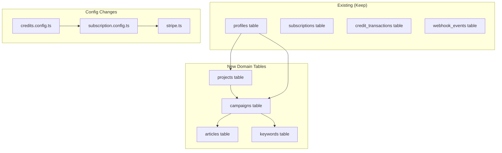
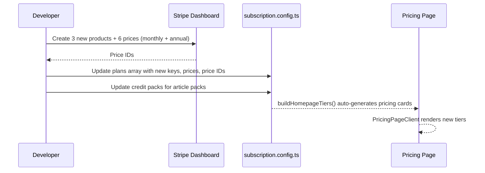
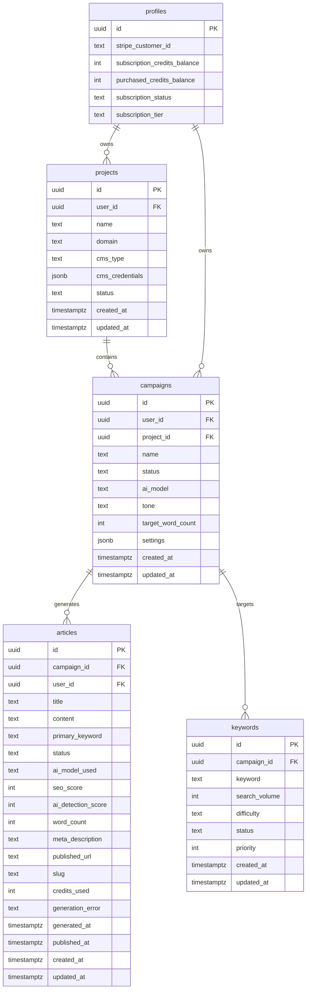

# PRD: Milestone 1 — Foundation (Database + Billing Reconfiguration)

**Status:** Active
**Complexity:** 7 → HIGH mode
**Milestone:** M1 (all other milestones depend on this)
**Author:** Claude (Principal Architect)
**Date:** 2026-02-05

---

## 1. Context

**Problem:** The app is a generic SaaS boilerplate (image upscaler credits). It needs to be reconfigured for AutopilotRank — an AI SEO content platform where 1 credit = 1 article generation. The database has no domain tables (projects, campaigns, articles, keywords) and the billing tiers (Free/$9/$19/$49/$149) don't match the new pricing ($49/$99/$249).

**Files Analyzed:**

| File                                                     | Purpose                                           |
| -------------------------------------------------------- | ------------------------------------------------- |
| `shared/config/subscription.config.ts`                   | Single source of truth for plans, credits, packs  |
| `shared/config/subscription.types.ts`                    | TypeScript interfaces for subscription system     |
| `shared/config/subscription.utils.ts`                    | Price resolution, plan lookups, credit operations |
| `shared/config/credits.config.ts`                        | Credit cost constants                             |
| `shared/config/stripe.ts`                                | Stripe price IDs, backward compat exports         |
| `shared/types/stripe.types.ts`                           | IUserProfile, ISubscription types                 |
| `client/components/pages/PricingPageClient.tsx`          | Pricing page React component                      |
| `supabase/migrations/*.sql`                              | 36 existing migrations                            |
| `docs/business/business-model-canvas/revenue-streams.md` | Pricing strategy & competitive positioning        |

**Current Behavior:**

- 5 plans: Free (disabled), Starter ($9/100cr), Hobby ($19/200cr), Pro ($49/1000cr), Business ($149/5000cr)
- Credits are generic "API calls" (1 credit = 1 API call)
- 3 credit packs: Small (50/$4.99), Medium (200/$14.99), Large (600/$39.99)
- No domain tables (projects, campaigns, articles, keywords)
- `processing_jobs` table exists but is for image processing — not relevant for AutopilotRank
- Free tier gives 10 credits on signup, no monthly refresh

**Target State:**

- 3 plans: Starter ($49/30 articles), Growth ($99/100 articles), Agency ($249/500 articles)
- 1 credit = 1 article generation
- 3 free articles on signup (trial), no credit card required
- 4 new domain tables: `projects`, `campaigns`, `articles`, `keywords`
- Credit packs repositioned for article overages

---

## 2. Solution

**Approach:**

1. Create 4 new domain tables via Supabase migrations with proper RLS, indexes, and FK constraints
2. Reconfigure `subscription.config.ts` (the single source of truth) with new plan keys, pricing, and credit allocations
3. Update `credits.config.ts` to reflect article-based credits
4. Create new Stripe products/prices in Stripe dashboard, update price IDs in config
5. Update pricing page UI to show new tiers with competitive comparison messaging

**Architecture Diagram:**



**Key Decisions:**

- Reuse existing `subscription.config.ts` as the single source of truth (no architectural change)
- Keep backward-compatible builder functions in `subscription.utils.ts` — just change the data they build from
- Keep credit packs as article packs (useful for overage use cases)
- `processing_jobs` table stays untouched — it's a boilerplate artifact that doesn't conflict
- Article content stored as `TEXT` (Markdown), not `JSONB` — simpler for MVP, easy to query
- Credentials for CMS connections stored as encrypted `JSONB` in `projects` — application-level encryption via a server-side utility

**Data Changes:**

- 4 new tables via Supabase migration
- No existing table schema changes
- Config file updates only (no migration needed for billing — it's all in-code)

---

## 3. Sequence Flow

### Billing Reconfiguration Flow



### Domain Table Relationships



---

## 4. Execution Phases

### Integration Points Checklist

```
How will this feature be reached?
- [x] Entry point: Pricing page (billing changes), Dashboard (domain tables queried by future milestones)
- [x] Caller files: PricingPageClient.tsx reads from subscription.config.ts via stripe.ts
- [x] Registration/wiring: subscription.config.ts is already wired — just change the data

Is this user-facing?
- [x] YES → Pricing page updated with new tiers
- [x] YES → Trial signup gives 3 articles instead of 10 generic credits

Full user flow:
1. User visits /pricing → sees Starter ($49), Growth ($99), Agency ($249) tiers
2. User signs up → gets 3 free article credits (no CC required)
3. User subscribes via Stripe checkout → subscription created with new price ID
4. Webhook processes → credits allocated per new plan (30/100/500)
5. Domain tables ready for Milestone 2 (content generation engine)
```

---

#### Phase 1: Domain Database Tables — Create the 4 core tables

**Files (4):**

- `supabase/migrations/20260205100000_create_projects_table.sql` — projects table + RLS + indexes
- `supabase/migrations/20260205100100_create_campaigns_table.sql` — campaigns table + RLS + indexes
- `supabase/migrations/20260205100200_create_articles_table.sql` — articles table + RLS + indexes
- `supabase/migrations/20260205100300_create_keywords_table.sql` — keywords table + RLS + indexes

**Implementation:**

- [ ] Create `projects` table with columns: `id` (UUID PK), `user_id` (FK profiles), `name` (TEXT NOT NULL), `domain` (TEXT), `cms_type` (TEXT CHECK IN wordpress/webflow/shopify/other), `cms_credentials` (JSONB DEFAULT '{}'), `status` (TEXT CHECK IN active/inactive/error DEFAULT 'active'), `created_at`, `updated_at`
- [ ] Create `campaigns` table with columns: `id` (UUID PK), `user_id` (FK profiles), `project_id` (FK projects, nullable — campaigns can exist without a project), `name` (TEXT NOT NULL), `status` (TEXT CHECK IN draft/active/paused/completed DEFAULT 'draft'), `ai_model` (TEXT DEFAULT 'auto'), `tone` (TEXT DEFAULT 'professional'), `target_word_count` (INT DEFAULT 1500), `settings` (JSONB DEFAULT '{}'), `created_at`, `updated_at`
- [ ] Create `articles` table with columns: `id` (UUID PK), `campaign_id` (FK campaigns), `user_id` (FK profiles), `title` (TEXT), `content` (TEXT), `primary_keyword` (TEXT NOT NULL), `status` (TEXT CHECK IN queued/generating/draft/reviewed/published/failed DEFAULT 'queued'), `ai_model_used` (TEXT), `seo_score` (INT), `ai_detection_score` (INT), `word_count` (INT), `meta_description` (TEXT), `published_url` (TEXT), `slug` (TEXT), `credits_used` (INT DEFAULT 1), `generation_error` (TEXT), `generated_at` (TIMESTAMPTZ), `published_at` (TIMESTAMPTZ), `created_at`, `updated_at`
- [ ] Create `keywords` table with columns: `id` (UUID PK), `campaign_id` (FK campaigns NOT NULL), `keyword` (TEXT NOT NULL), `search_volume` (INT), `difficulty` (TEXT CHECK IN easy/medium/hard/unknown DEFAULT 'unknown'), `status` (TEXT CHECK IN pending/queued/generating/generated/failed DEFAULT 'pending'), `priority` (INT DEFAULT 0), `created_at`, `updated_at`
- [ ] Enable RLS on all 4 tables with policies: users SELECT/INSERT/UPDATE own rows (via `user_id` or through campaign FK), service_role full access
- [ ] Add indexes: `user_id` on all tables, `campaign_id` on articles and keywords, `status` on articles and keywords, `project_id` on campaigns, composite `(campaign_id, status)` on articles
- [ ] Add `updated_at` triggers using existing `handle_updated_at()` function
- [ ] Add unique constraint on `(campaign_id, keyword)` in keywords table to prevent duplicates

**Verification Plan:**

1. **Migration Test:**

   ```bash
   npx supabase migration list
   # Should show 4 new migrations with status "not applied"
   npx supabase db push
   # All migrations should apply without errors
   ```

2. **Schema Verification (SQL):**

   ```sql
   -- Verify tables exist with correct columns
   SELECT table_name, column_name, data_type
   FROM information_schema.columns
   WHERE table_schema = 'public'
     AND table_name IN ('projects', 'campaigns', 'articles', 'keywords')
   ORDER BY table_name, ordinal_position;

   -- Verify RLS is enabled
   SELECT tablename, rowsecurity
   FROM pg_tables
   WHERE schemaname = 'public'
     AND tablename IN ('projects', 'campaigns', 'articles', 'keywords');

   -- Verify indexes exist
   SELECT indexname, tablename
   FROM pg_indexes
   WHERE schemaname = 'public'
     AND tablename IN ('projects', 'campaigns', 'articles', 'keywords');
   ```

3. **RLS Policy Tests:**

   ```bash
   # Verify policies exist
   # Should show SELECT/INSERT/UPDATE for authenticated, ALL for service_role
   ```

4. **Evidence Required:**
   - [ ] All 4 migrations apply cleanly via `npx supabase db push`
   - [ ] Tables have correct columns and constraints
   - [ ] RLS enabled on all tables
   - [ ] Indexes created for all FK and status columns

**User Verification:**

- Action: Run `npx supabase db push` locally
- Expected: All 4 migrations apply without errors, tables queryable

---

#### Phase 2: Billing Reconfiguration — Update plans, credits, and config

**Files (3):**

- `shared/config/credits.config.ts` — Update credit constants for article-based system
- `shared/config/subscription.config.ts` — Replace plans with Starter/Growth/Agency, update free user config
- `shared/config/stripe.ts` — Update type assertions for new plan keys

**Implementation:**

- [ ] Update `credits.config.ts`:
  - Rename/replace credit constants: `STARTER_MONTHLY_CREDITS: 30`, `GROWTH_MONTHLY_CREDITS: 100`, `AGENCY_MONTHLY_CREDITS: 500`
  - Remove `HOBBY_MONTHLY_CREDITS`, `PRO_MONTHLY_CREDITS`, `BUSINESS_MONTHLY_CREDITS`
  - Update `DEFAULT_FREE_CREDITS: 3` (3 trial articles)
  - Update credit packs: Small (10/$9.99), Medium (25/$19.99), Large (50/$34.99) — repositioned as article packs
  - Update `API_CALL: 1` (keep — 1 credit = 1 article)
  - Update `LOW_CREDIT_WARNING_THRESHOLD: 2` (warn at 2 articles remaining)

- [ ] Update `subscription.config.ts`:
  - Replace 5 plans with 3: `starter` ($49/30cr), `growth` ($99/100cr), `agency` ($249/500cr)
  - Keep `free` plan (disabled) but update: `creditsPerCycle: 3`, `maxRollover: 3` (no rollover for trial)
  - New plan keys: `starter`, `growth`, `agency`
  - Starter: `priceInCents: 4900`, `creditsPerCycle: 30`, `maxRollover: 90` (3x), `batchLimit: 5`, features list for SEO content
  - Growth: `priceInCents: 9900`, `creditsPerCycle: 100`, `maxRollover: 300` (3x), `batchLimit: 25`, recommended: true
  - Agency: `priceInCents: 24900`, `creditsPerCycle: 500`, `maxRollover: 0` (no rollover), `batchLimit: 100`
  - Update `freeUser.initialCredits: 3` (3 trial articles)
  - Update `freeUser.maxBalance: 3`
  - Update credit packs to article-sized packs
  - Update feature descriptions to reflect SEO content product (not generic API)
  - **Stripe Price IDs:** Use placeholder `'price_PLACEHOLDER_STARTER_MONTHLY'` etc. until real Stripe products are created. Add a `// TODO: Replace with real Stripe price IDs after creating products` comment.

- [ ] Update `stripe.ts`:
  - Update `STRIPE_PRICES` type assertion to use new keys: `STARTER_MONTHLY`, `GROWTH_MONTHLY`, `AGENCY_MONTHLY` (remove `HOBBY_MONTHLY`, `PRO_MONTHLY`, `BUSINESS_MONTHLY`)
  - Update `SUBSCRIPTION_PLANS` type assertion for new keys
  - Update `getPlanDisplayName()` switch cases: remove `hobby`/`pro`/`business`, add `growth`/`agency`

**Implementation Notes:**

- The `buildStripePrices()`, `buildSubscriptionPlans()`, `buildCreditPacks()`, and `buildHomepageTiers()` functions in `subscription.utils.ts` generate their output from `subscription.config.ts` dynamically — they should work without changes as long as the config data shape is correct.
- The pricing page (`PricingPageClient.tsx`) renders from `SUBSCRIPTION_PLANS` and `HOMEPAGE_TIERS` which are built from config — it should auto-update.
- Webhook handlers use `resolvePriceId()` which reads from the price index — will work with new price IDs.

**Verification Plan:**

1. **Unit Tests:**
   - File: `tests/unit/subscription-config.spec.ts` (update existing)
   - Tests: `should have 3 enabled plans`, `should have correct pricing for starter/growth/agency`, `should give 3 free trial credits`, `should not have hobby/pro/business plans`

2. **Config Validation:**

   ```bash
   # Run existing subscription validator
   yarn test --grep "subscription"
   ```

3. **Build Verification:**

   ```bash
   yarn build
   # Should compile without type errors
   yarn verify
   # Full verification pass
   ```

4. **Evidence Required:**
   - [ ] `yarn build` passes with no type errors
   - [ ] `yarn test` passes for subscription-related tests
   - [ ] `getSubscriptionConfig().plans` returns exactly 3 enabled plans + 1 disabled free
   - [ ] `buildHomepageTiers()` generates correct pricing cards
   - [ ] `yarn verify` passes

**User Verification:**

- Action: Run `yarn build && yarn test`
- Expected: No type errors, all subscription tests pass with new plan data

---

#### Phase 3: Fix References & Update Pricing UI — Ensure all code referencing old plans compiles and pricing page displays correctly

**Files (max 5):**

- `shared/config/subscription.utils.ts` — Update `buildStripePrices()` key generation if needed for new plan names
- `client/components/pages/PricingPageClient.tsx` — Verify renders correctly (may need minor updates for 3-plan layout)
- `shared/constants/billing.ts` — Update billing copy/messaging if it references old plan names
- Tests files that reference old plan keys (update assertions)

**Implementation:**

- [ ] Search codebase for references to old plan keys (`hobby`, `pro`, `business`) and update to new keys (`starter`, `growth`, `agency`)
- [ ] Update `buildStripePrices()` in `subscription.utils.ts` if the key-to-STRIPE_KEY mapping needs adjustment (e.g., `growth` → `GROWTH_MONTHLY`)
- [ ] Update billing constants/copy in `shared/constants/billing.ts` if they reference old plan names
- [ ] Verify `PricingPageClient.tsx` renders 3 plans correctly (the component iterates over enabled plans from config, so it should auto-adapt)
- [ ] Update all test files that assert against old plan keys/counts
- [ ] Run `yarn verify` to catch any remaining type errors or broken references

**Verification Plan:**

1. **Full Build + Test:**

   ```bash
   yarn verify
   # Must pass completely — no type errors, no test failures
   ```

2. **Manual Verification (visual):**
   - Start dev server: `yarn dev`
   - Visit `/pricing` page
   - Verify: 3 plan cards (Starter $49, Growth $99, Agency $249)
   - Verify: "Recommended" badge on Growth plan
   - Verify: Feature lists accurate for SEO content product
   - Verify: Credit pack selector shows article packs

3. **Evidence Required:**
   - [ ] `yarn verify` passes
   - [ ] Pricing page shows 3 correct tiers
   - [ ] No references to old plan names (hobby/pro/business) remain in active code

**User Verification:**

- Action: Run `yarn dev`, visit `/pricing`
- Expected: See Starter ($49/mo, 30 articles), Growth ($99/mo, 100 articles), Agency ($249/mo, 500 articles)

---

#### Phase 4: Stripe Product Creation & Final Wiring — Create real Stripe products and wire price IDs

**Files (2):**

- `shared/config/subscription.config.ts` — Replace placeholder price IDs with real Stripe price IDs
- `shared/config/subscription.config.ts` — Update credit pack price IDs if packs change

**Implementation:**

- [ ] In Stripe Dashboard (test mode), create 3 new products:
  - **AutopilotRank Starter** — $49/mo recurring, $39/mo yearly
  - **AutopilotRank Growth** — $99/mo recurring, $79/mo yearly
  - **AutopilotRank Agency** — $249/mo recurring, $199/mo yearly
- [ ] Copy the 6 price IDs (3 monthly + 3 annual) from Stripe
- [ ] Update `subscription.config.ts` with real price IDs replacing `PLACEHOLDER` values
- [ ] Optionally create new credit pack products in Stripe for article packs (or reuse existing if amounts work)
- [ ] Update credit pack price IDs in config
- [ ] Verify Stripe webhook endpoint is still configured at `/api/webhooks/stripe`
- [ ] Archive or deactivate old Stripe products/prices (starter $9, hobby $19, pro $49, business $149)

**Verification Plan:**

1. **Stripe CLI Test:**

   ```bash
   # Trigger a test webhook for checkout.session.completed
   stripe trigger checkout.session.completed
   # Verify webhook handler processes the event
   ```

2. **Checkout Flow Test:**

   ```bash
   # Start dev server
   yarn dev
   # Navigate to /pricing, click Subscribe on Starter
   # Complete Stripe test checkout with card 4242424242424242
   # Verify subscription created with correct price ID
   ```

3. **Config Validation:**

   ```bash
   yarn test --grep "stripe"
   # Should validate all price IDs are real (not placeholders)
   ```

4. **Evidence Required:**
   - [ ] All 6 price IDs are real Stripe price IDs (not placeholders)
   - [ ] Test checkout completes successfully
   - [ ] Webhook processes subscription creation
   - [ ] Credits allocated correctly (30 for Starter, 100 for Growth, 500 for Agency)
   - [ ] `yarn verify` passes

**User Verification:**

- Action: Subscribe to Starter plan using test card `4242 4242 4242 4242`
- Expected: Subscription created, 30 article credits allocated, dashboard shows "Starter Plan"

---

## 5. Acceptance Criteria

- [ ] All 4 domain tables created with correct schema, RLS, indexes, and triggers
- [ ] Billing reconfigured: 3 plans (Starter $49, Growth $99, Agency $249) with correct credits (30/100/500)
- [ ] Free trial: 3 articles on signup, no CC required
- [ ] Credit packs repositioned as article packs
- [ ] Pricing page displays 3 tiers with correct pricing and features
- [ ] All references to old plans (hobby/pro/business) removed from active code
- [ ] Stripe products created and price IDs wired
- [ ] `yarn verify` passes
- [ ] All automated checkpoint reviews pass
- [ ] Existing webhook handlers work with new price IDs (no breaking changes)

---

## 6. Out of Scope

These are explicitly **NOT** in this milestone:

- Content generation engine (Milestone 2)
- Humanizer engine (Milestone 3)
- Campaign management UI (Milestone 4)
- Article dashboard UI (Milestone 5)
- WordPress publishing (Milestone 6)
- Annual billing toggle on pricing page (Post-MVP Phase 1)
- Overage charges (Post-MVP Phase 1)
- Enterprise tier (Post-MVP Phase 2)
- Competitive comparison table on pricing page (Milestone 7 — Polish)

---

## 7. Risk Mitigation

| Risk                                           | Impact                      | Mitigation                                                                                    |
| ---------------------------------------------- | --------------------------- | --------------------------------------------------------------------------------------------- |
| Old Stripe price IDs in existing subscriptions | Active users lose access    | Phase 4 is manual — archive old prices only after confirming no active subscriptions use them |
| `buildStripePrices()` key generation breaks    | Type errors across codebase | Phase 3 explicitly searches for and fixes all references                                      |
| RLS policies on new tables too restrictive     | API calls fail silently     | Test with both authenticated user and service_role in Phase 1 verification                    |
| Migration timestamp conflict                   | `duplicate key` error       | Using `20260205HHMMSS` format with unique timestamps per migration (lesson from MEMORY.md)    |

---

## 8. Database Migration Details

### Table: `projects`

```sql
CREATE TABLE public.projects (
  id UUID PRIMARY KEY DEFAULT gen_random_uuid(),
  user_id UUID NOT NULL REFERENCES public.profiles(id) ON DELETE CASCADE,
  name TEXT NOT NULL,
  domain TEXT,
  cms_type TEXT NOT NULL DEFAULT 'wordpress'
    CHECK (cms_type IN ('wordpress', 'webflow', 'shopify', 'other')),
  cms_credentials JSONB DEFAULT '{}',
  status TEXT NOT NULL DEFAULT 'active'
    CHECK (status IN ('active', 'inactive', 'error')),
  created_at TIMESTAMPTZ NOT NULL DEFAULT NOW(),
  updated_at TIMESTAMPTZ NOT NULL DEFAULT NOW()
);
```

### Table: `campaigns`

```sql
CREATE TABLE public.campaigns (
  id UUID PRIMARY KEY DEFAULT gen_random_uuid(),
  user_id UUID NOT NULL REFERENCES public.profiles(id) ON DELETE CASCADE,
  project_id UUID REFERENCES public.projects(id) ON DELETE SET NULL,
  name TEXT NOT NULL,
  status TEXT NOT NULL DEFAULT 'draft'
    CHECK (status IN ('draft', 'active', 'paused', 'completed')),
  ai_model TEXT NOT NULL DEFAULT 'auto',
  tone TEXT NOT NULL DEFAULT 'professional',
  target_word_count INTEGER NOT NULL DEFAULT 1500,
  settings JSONB DEFAULT '{}',
  created_at TIMESTAMPTZ NOT NULL DEFAULT NOW(),
  updated_at TIMESTAMPTZ NOT NULL DEFAULT NOW()
);
```

### Table: `articles`

```sql
CREATE TABLE public.articles (
  id UUID PRIMARY KEY DEFAULT gen_random_uuid(),
  campaign_id UUID NOT NULL REFERENCES public.campaigns(id) ON DELETE CASCADE,
  user_id UUID NOT NULL REFERENCES public.profiles(id) ON DELETE CASCADE,
  title TEXT,
  content TEXT,
  primary_keyword TEXT NOT NULL,
  status TEXT NOT NULL DEFAULT 'queued'
    CHECK (status IN ('queued', 'generating', 'draft', 'reviewed', 'published', 'failed')),
  ai_model_used TEXT,
  seo_score INTEGER CHECK (seo_score >= 0 AND seo_score <= 100),
  ai_detection_score INTEGER CHECK (ai_detection_score >= 0 AND ai_detection_score <= 100),
  word_count INTEGER CHECK (word_count >= 0),
  meta_description TEXT,
  published_url TEXT,
  slug TEXT,
  credits_used INTEGER NOT NULL DEFAULT 1,
  generation_error TEXT,
  generated_at TIMESTAMPTZ,
  published_at TIMESTAMPTZ,
  created_at TIMESTAMPTZ NOT NULL DEFAULT NOW(),
  updated_at TIMESTAMPTZ NOT NULL DEFAULT NOW()
);
```

### Table: `keywords`

```sql
CREATE TABLE public.keywords (
  id UUID PRIMARY KEY DEFAULT gen_random_uuid(),
  campaign_id UUID NOT NULL REFERENCES public.campaigns(id) ON DELETE CASCADE,
  keyword TEXT NOT NULL,
  search_volume INTEGER,
  difficulty TEXT NOT NULL DEFAULT 'unknown'
    CHECK (difficulty IN ('easy', 'medium', 'hard', 'unknown')),
  status TEXT NOT NULL DEFAULT 'pending'
    CHECK (status IN ('pending', 'queued', 'generating', 'generated', 'failed')),
  priority INTEGER NOT NULL DEFAULT 0,
  created_at TIMESTAMPTZ NOT NULL DEFAULT NOW(),
  updated_at TIMESTAMPTZ NOT NULL DEFAULT NOW(),
  UNIQUE (campaign_id, keyword)
);
```

---

## 9. Config Change Details

### `credits.config.ts` — New Values

```typescript
export const CREDIT_COSTS = {
  API_CALL: 1, // 1 credit = 1 article

  // Free trial credits
  DEFAULT_FREE_CREDITS: 3, // was 10
  DEFAULT_TRIAL_CREDITS: 0,

  // Credit pack amounts (article packs)
  SMALL_PACK_CREDITS: 10, // was 50
  MEDIUM_PACK_CREDITS: 25, // was 200
  LARGE_PACK_CREDITS: 50, // was 600

  // Subscription credit amounts
  STARTER_MONTHLY_CREDITS: 30, // was 100
  GROWTH_MONTHLY_CREDITS: 100, // new (replaces HOBBY)
  AGENCY_MONTHLY_CREDITS: 500, // new (replaces BUSINESS)
  // REMOVED: HOBBY_MONTHLY_CREDITS, PRO_MONTHLY_CREDITS, BUSINESS_MONTHLY_CREDITS

  // Warning thresholds
  LOW_CREDIT_WARNING_THRESHOLD: 2, // was 5
  CREDIT_WARNING_PERCENTAGE: 0.2,
} as const;
```

### `subscription.config.ts` — New Plans (summary)

| Key     | Name    | Price | Credits/mo   | Rollover | Batch | Recommended |
| ------- | ------- | ----- | ------------ | -------- | ----- | ----------- |
| free    | Free    | $0    | 3 (one-time) | 3 (none) | 1     | No          |
| starter | Starter | $49   | 30           | 90 (3x)  | 5     | No          |
| growth  | Growth  | $99   | 100          | 300 (3x) | 25    | Yes         |
| agency  | Agency  | $249  | 500          | 0 (none) | 100   | No          |

### Feature Lists (per plan)

**Starter ($49/mo):**

- 30 articles per month
- Multi-model AI (GPT-4, Claude, Gemini)
- Humanizer engine
- 1 WordPress site
- SEO scoring & AI detection
- Email support

**Growth ($99/mo):**

- 100 articles per month
- Everything in Starter
- GSC integration
- 3 CMS sites
- Advanced humanizer
- Scheduled publishing
- Priority support

**Agency ($249/mo):**

- 500 articles per month
- Everything in Growth
- Unlimited CMS sites
- White-label (coming soon)
- Team accounts (up to 5)
- API access
- Dedicated account manager

---

## Changelog

| Date       | Change              |
| ---------- | ------------------- |
| 2026-02-05 | Initial PRD created |
