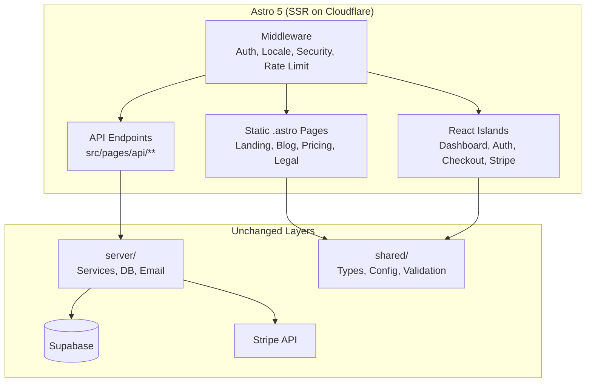
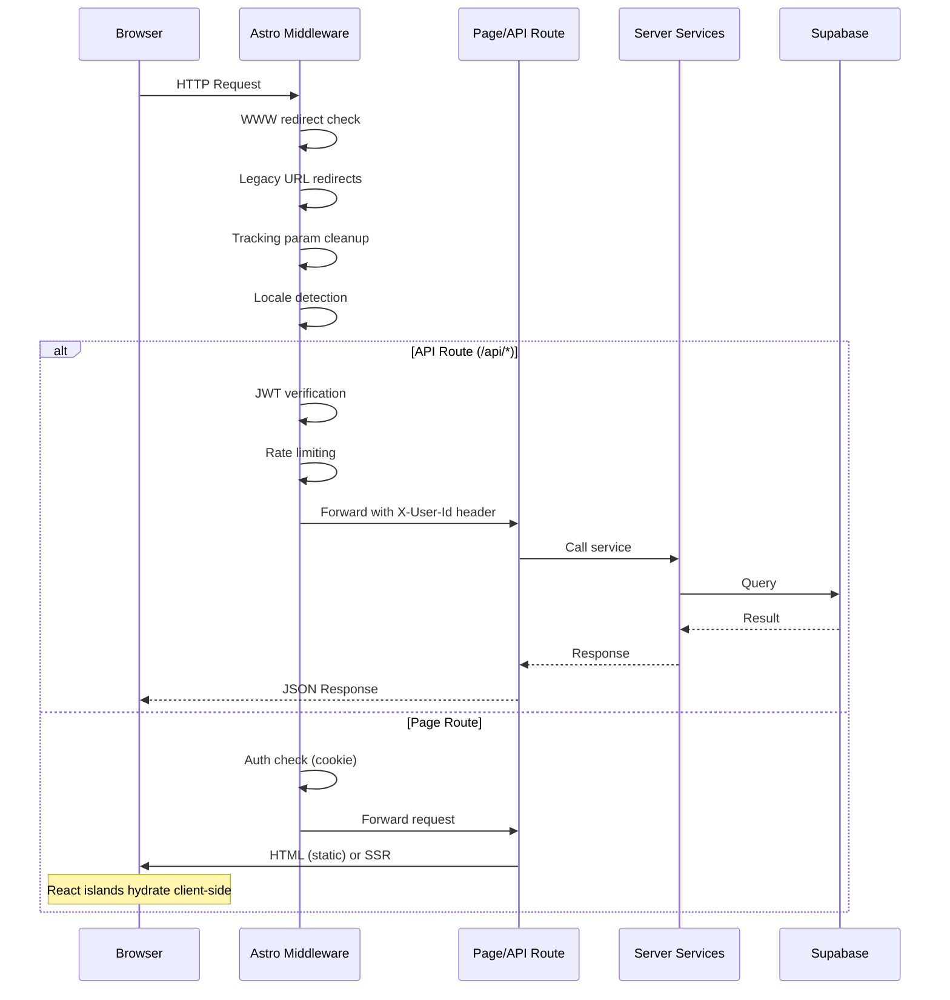

# PRD: Migrate Next.js 15 SaaS Boilerplate to Astro

**Complexity: 10 → HIGH mode**

**Goal: Preserve all existing Next.js behavior. Switch the framework, don't introduce regressions.**

---

## Migration Status (Updated: 2026-02-04)

### ✅ Completed Phases

- **Phase 1: Project Scaffolding** - Astro installed, configured, building
- **Phase 2: Middleware Migration** - `src/middleware.ts` functional with all auth/security logic
- **Phase 3: API Endpoints** - All 22 route endpoints migrated to `src/pages/api/`
- **Phase 4: Static Pages** - Landing, blog, pricing, legal, help all ported
- **Phase 5: Auth & Payment Pages** - Auth callback/confirm/reset, checkout, success, canceled, subscription confirmed

### 🚧 Remaining Work

- **Phase 6: Dashboard Pages & Layouts** - DashboardLayout, dashboard home, billing, history, settings, support, admin, verify-email (10 pages + 1 layout)
- **Phase 7: SEO, Sitemaps & Manifest** - robots.txt, sitemaps, manifest.json, meta tags (4 files)
- **Phase 8: Error Pages, Cleanup & Tests** - 404/500 pages, remove Next.js files, fix test suite

### 🧹 Cleanup (Phase 8 — only after all tests pass)

- `next.config.js`
- `open-next.config.ts`
- `i18n.config.ts`
- `middleware.ts` (root) — replaced by `src/middleware.ts`
- `app/` directory (71 files) — replaced by `src/pages/`

---

## 1. Context

**Problem:** The current SaaS boilerplate is built on Next.js 15 with App Router. We want to migrate to Astro for its superior static-site generation, smaller bundle sizes, opt-in hydration (islands architecture), and simpler mental model for content-heavy pages while retaining React for interactive islands (dashboard, auth, checkout).

**Files Analyzed:**

- `middleware.ts` - 658 lines of request processing (auth, locale, security, rate limiting)
- `shared/config/env.ts` - Environment variable system (clientEnv/serverEnv via Zod)
- `app/` - 70 route files (pages + API routes)
- `client/components/` - 70 React component files
- `server/` - Business logic, services, database access
- `shared/` - Types, validation, config (framework-agnostic)
- `package.json` - Dependencies (Next.js 16.0.10, next-intl, opennextjs/cloudflare)
- `wrangler.toml` - Cloudflare Pages deployment config
- `open-next.config.ts` - OpenNext Cloudflare adapter
- `i18n/config.ts` - next-intl locale configuration
- `locales/en/*.json` - 20+ translation files

**Current Behavior:**

- Next.js App Router with `[locale]` dynamic segment for i18n
- Server Components (default) with `"use client"` directives for interactive parts
- Middleware handles: WWW redirect, legacy redirects, tracking param cleanup, locale detection, API auth (JWT), page auth, rate limiting, security headers, CORS
- Deployed to Cloudflare Pages via OpenNext adapter (`@opennextjs/cloudflare`)
- Environment variables loaded via centralized `shared/config/env.ts` (Zod-validated, `NEXT_PUBLIC_*` prefix convention)

---

## 2. Solution

**Approach:**

- Migrate to Astro 5 with the Cloudflare adapter (`@astrojs/cloudflare`)
- Use Astro's islands architecture: static `.astro` pages by default, React islands (`client:load`, `client:visible`) for interactive components (dashboard, auth forms, Stripe checkout)
- Keep the entire `server/`, `shared/`, and `emails/` directories largely untouched since they are framework-agnostic
- Replace `next-intl` with Astro's built-in i18n routing (`i18n` config in `astro.config.mjs`)
- Replace Next.js middleware with Astro middleware (`src/middleware.ts`)
- Replace Next.js API routes (`app/api/`) with Astro API endpoints (`src/pages/api/`)
- Replace `NEXT_PUBLIC_*` env convention with Astro's `PUBLIC_*` convention (or `import.meta.env`)
- Retain Supabase, Stripe, Zustand, Tailwind, Vitest, Playwright as-is

**Architecture Diagram:**

**Key Decisions:**

- **Astro + React integration** via `@astrojs/react` - keeps all existing React components functional inside `client:*` islands
- **SSR mode** (`output: 'server'`) required for API routes, auth middleware, and dynamic dashboard pages
- **Cloudflare adapter** (`@astrojs/cloudflare`) replaces `@opennextjs/cloudflare` - native Astro support, no OpenNext shim
- **Environment variables** - Replace `NEXT_PUBLIC_*` with `PUBLIC_*` prefix; update `shared/config/env.ts` to use `import.meta.env` instead of `process.env`
- **Routing** - Astro file-based routing in `src/pages/` replaces Next.js `app/` directory; `[locale]` becomes Astro i18n config with `prefixDefaultLocale: false`
- **Error handling** - Astro `src/pages/404.astro` and `src/pages/500.astro` replace Next.js `error.tsx`/`not-found.tsx`
- **Blog/MDX** - Astro Content Collections replace `next-mdx-remote` - better DX and type safety

**Data Changes:** None. Supabase schema, migrations, and RLS policies are unchanged.

---

## 3. Sequence Flow

---

## 4. Complete Source → Target File Mapping

### Page Routes

| Status | Next.js Source (`app/[locale]/`) | Astro Target (`src/pages/`) |
|--------|--------------------------------|---------------------------|
| ✅ | `page.tsx` (landing) | `index.astro` |
| ✅ | `pricing/page.tsx` | `pricing.astro` |
| ✅ | `privacy/page.tsx` | `privacy.astro` |
| ✅ | `terms/page.tsx` | `terms.astro` |
| ✅ | `help/page.tsx` | `help.astro` |
| ✅ | `blog/page.tsx` | `blog/index.astro` |
| ✅ | `blog/[slug]/page.tsx` | `blog/[slug].astro` |
| ✅ | `auth/callback/page.tsx` | `auth/callback.astro` |
| ✅ | `auth/confirm/page.tsx` | `auth/confirm.astro` |
| ✅ | `auth/reset-password/page.tsx` | `auth/reset-password.astro` |
| ✅ | `checkout/page.tsx` | `checkout.astro` |
| ✅ | `success/page.tsx` | `success.astro` |
| ✅ | `canceled/page.tsx` | `canceled.astro` |
| ✅ | `subscription/confirmed/page.tsx` | `subscription/confirmed.astro` |
| ❌ | `verify-email/page.tsx` | `verify-email.astro` |
| ❌ | `dashboard/page.tsx` | `dashboard/index.astro` |
| ❌ | `dashboard/billing/page.tsx` | `dashboard/billing.astro` |
| ❌ | `dashboard/history/page.tsx` | `dashboard/history.astro` |
| ❌ | `dashboard/settings/page.tsx` | `dashboard/settings.astro` |
| ❌ | `dashboard/support/page.tsx` | `dashboard/support.astro` |
| ❌ | `dashboard/admin/page.tsx` | `dashboard/admin/index.astro` |
| ❌ | `dashboard/admin/users/page.tsx` | `dashboard/admin/users/index.astro` |
| ❌ | `dashboard/admin/users/[userId]/page.tsx` | `dashboard/admin/users/[userId].astro` |

### Layouts

| Status | Next.js Source | Astro Target |
|--------|---------------|-------------|
| ✅ | `app/layout.tsx` + `app/[locale]/layout.tsx` | `src/layouts/Layout.astro` |
| ❌ | `app/[locale]/dashboard/layout.tsx` | `src/layouts/DashboardLayout.astro` |
| ❌ | `app/[locale]/dashboard/admin/layout.tsx` | Handled within admin pages or shared layout |

### API Routes

| Status | Next.js Source (`app/api/`) | Astro Target (`src/pages/api/`) |
|--------|---------------------------|-------------------------------|
| ✅ | `health/route.ts` | `health/index.ts` |
| ✅ | `health/stripe/route.ts` | `health/stripe/index.ts` |
| ✅ | `checkout/route.ts` | `checkout/index.ts` |
| ✅ | `portal/route.ts` | `portal/index.ts` |
| ✅ | `analytics/event/route.ts` | `analytics/event/index.ts` |
| ✅ | `credits/history/route.ts` | `credits/history/index.ts` |
| ✅ | `subscription/change/route.ts` | `subscription/change/index.ts` |
| ✅ | `subscription/preview-change/route.ts` | `subscription/preview-change/index.ts` |
| ✅ | `subscription/cancel-scheduled/route.ts` | `subscription/cancel-scheduled/index.ts` |
| ✅ | `subscriptions/cancel/route.ts` | `subscriptions/cancel/index.ts` |
| ✅ | `support/contact/route.ts` | `support/contact/index.ts` |
| ✅ | `email/send/route.ts` | `email/send/index.ts` |
| ✅ | `email/preferences/route.ts` | `email/preferences/index.ts` |
| ✅ | `cron/check-expirations/route.ts` | `cron/check-expirations/index.ts` |
| ✅ | `cron/reconcile/route.ts` | `cron/reconcile/index.ts` |
| ✅ | `cron/recover-webhooks/route.ts` | `cron/recover-webhooks/index.ts` |
| ✅ | `webhooks/stripe/route.ts` | `webhooks/stripe/index.ts` |
| ✅ | `admin/stats/route.ts` | `admin/stats/index.ts` |
| ✅ | `admin/credits/adjust/route.ts` | `admin/credits/adjust/index.ts` |
| ✅ | `admin/subscription/route.ts` | `admin/subscription/index.ts` |
| ✅ | `admin/users/route.ts` | `admin/users/index.ts` |
| ✅ | `admin/users/[userId]/route.ts` | `admin/users/[userId]/index.ts` |
| ✅ | `protected/example/route.ts` | `protected/example/index.ts` |

Webhook handlers (`server/webhooks/stripe/handlers/` and `server/webhooks/stripe/services/`) are framework-agnostic and require no migration.

### Special Files

| Status | Next.js Source | Astro Target |
|--------|---------------|-------------|
| ❌ | `app/not-found.tsx` | `src/pages/404.astro` |
| ❌ | `app/error.tsx` / `app/global-error.tsx` | `src/pages/500.astro` |
| ❌ | `app/manifest.ts` | `src/pages/manifest.json.ts` |
| ❌ | `app/robots.ts` | `src/pages/robots.txt.ts` |
| ❌ | `app/sitemap-blog.xml/route.ts` | `src/pages/sitemap-blog.xml.ts` |
| ❌ | `app/sitemap-static.xml/route.ts` | `src/pages/sitemap-static.xml.ts` |

---

## 5. Execution Phases (Remaining Work)

Phases 1–5 are complete. The remaining work is organized below.

---

#### Phase 6: Dashboard Pages

**Goal:** Port all dashboard pages. Use `client:only="react"` to wrap existing React page components as full islands initially — preserving exact behavior. Optimize to partial islands later if desired.

**Source → Target:**

| Source | Target |
|--------|--------|
| `app/[locale]/verify-email/page.tsx` | `src/pages/verify-email.astro` |
| `app/[locale]/dashboard/page.tsx` | `src/pages/dashboard/index.astro` |
| `app/[locale]/dashboard/layout.tsx` | `src/layouts/DashboardLayout.astro` |
| `app/[locale]/dashboard/billing/page.tsx` | `src/pages/dashboard/billing.astro` |
| `app/[locale]/dashboard/history/page.tsx` | `src/pages/dashboard/history.astro` |
| `app/[locale]/dashboard/settings/page.tsx` | `src/pages/dashboard/settings.astro` |
| `app/[locale]/dashboard/support/page.tsx` | `src/pages/dashboard/support.astro` |
| `app/[locale]/dashboard/admin/page.tsx` | `src/pages/dashboard/admin/index.astro` |
| `app/[locale]/dashboard/admin/layout.tsx` | (merged into admin pages or DashboardLayout) |
| `app/[locale]/dashboard/admin/users/page.tsx` | `src/pages/dashboard/admin/users/index.astro` |
| `app/[locale]/dashboard/admin/users/[userId]/page.tsx` | `src/pages/dashboard/admin/users/[userId].astro` |

**Implementation:**

- [ ] Create `src/layouts/DashboardLayout.astro` — read the existing `app/[locale]/dashboard/layout.tsx`, replicate its structure as an `.astro` layout that wraps the existing React `DashboardLayout` component with `client:only="react"`
- [ ] Port `ClientProviders.tsx` (Zustand, Supabase context) — wrap all dashboard islands so client state works
- [ ] For each dashboard page: create `.astro` file that imports the existing React page component and renders it with `client:only="react"`. This preserves exact behavior without rewriting any React code
- [ ] Admin pages: check `locals.isAdmin` in the `.astro` page frontmatter, return 403 if not admin
- [ ] Port `verify-email/page.tsx` → `src/pages/verify-email.astro`
- [ ] Update `shared/utils/supabase/server.ts` to work with Astro cookies API if not already done

**Testing:** Run existing test suite (`yarn test`, `yarn test:e2e`) — fix any failures caused by framework switch. Do not write new test files for behavior that is already covered.

**User Verification:**

- Navigate to `/dashboard` without auth → redirected to `/` with `?login=1`
- Navigate to `/dashboard/billing` as authenticated user → billing page renders

---

#### Phase 7: SEO, Sitemaps & Manifest

**Goal:** Port robots.txt, sitemaps, manifest.json, and ensure meta tags match existing behavior.

**Source → Target:**

| Source | Target |
|--------|--------|
| `app/robots.ts` | `src/pages/robots.txt.ts` |
| `app/manifest.ts` | `src/pages/manifest.json.ts` |
| `app/sitemap-blog.xml/route.ts` | `src/pages/sitemap-blog.xml.ts` |
| `app/sitemap-static.xml/route.ts` | `src/pages/sitemap-static.xml.ts` |

**Implementation:**

- [ ] Port `app/robots.ts` → Astro API endpoint returning `text/plain`
- [ ] Port `app/manifest.ts` → Astro API endpoint returning `application/json`
- [ ] Port `app/sitemap-blog.xml/route.ts` → Astro API endpoint returning `application/xml`
- [ ] Port `app/sitemap-static.xml/route.ts` → Astro API endpoint returning `application/xml`
- [ ] Verify all `.astro` pages have correct `<head>` meta tags (title, description, OG, canonical) — compare against the `generateMetadata` output from each Next.js page

**Testing:** Compare output of each endpoint against current Next.js output. Sitemaps should contain the same URLs. Meta tags should match.

**User Verification:**

- `curl /robots.txt` → valid robots.txt with sitemap URL
- `curl /sitemap-static.xml` → valid XML with all static page URLs

---

#### Phase 8: Error Pages, Cleanup & Tests

**Goal:** Add error pages, remove all Next.js artifacts, ensure full test suite passes.

**IMPORTANT: Do not delete `app/` directory until all existing tests pass against the Astro build.**

**Source → Target:**

| Source | Target |
|--------|--------|
| `app/not-found.tsx` | `src/pages/404.astro` |
| `app/error.tsx` / `app/global-error.tsx` | `src/pages/500.astro` |

**Implementation — Error Pages:**

- [ ] Port `app/not-found.tsx` → `src/pages/404.astro` — replicate the same UI
- [ ] Port `app/error.tsx` → `src/pages/500.astro` — replicate the same UI

**Implementation — Test Suite:**

- [ ] Run `yarn test` — fix all unit test failures
- [ ] Run `yarn test:e2e` — fix all E2E test failures (update port if Astro uses 4321 instead of 3000)
- [ ] Run `yarn verify` — fix TypeScript and lint errors

**Implementation — Cleanup (only after tests pass):**

- [ ] Delete `next.config.js`
- [ ] Delete `open-next.config.ts`
- [ ] Delete `i18n.config.ts`
- [ ] Delete root `middleware.ts` (replaced by `src/middleware.ts`)
- [ ] Delete entire `app/` directory
- [ ] Remove Next.js deps from `package.json`: `next`, `next-intl`, `next-mdx-remote`, `@opennextjs/cloudflare`
- [ ] Update ESLint config: remove Next.js rules/plugins
- [ ] Update `.gitignore`: replace `.next/` with `.astro/`, `dist/`
- [ ] Update `CLAUDE.md` boilerplate instructions for Astro
- [ ] Run `yarn verify` again after cleanup to confirm nothing broke

**User Verification:**

- Visit `/nonexistent-page` → custom 404 page
- `yarn verify` passes
- `yarn build` succeeds

---

## 6. Risk Assessment

| Risk                                           | Impact | Mitigation                                                                                                     |
| ---------------------------------------------- | ------ | -------------------------------------------------------------------------------------------------------------- |
| React islands hydration mismatch               | HIGH   | Use `client:only="react"` for dashboard pages initially — avoids SSR mismatch entirely. Migrate to `client:load` only after verifying behavior |
| Supabase SSR cookie handling differs in Astro  | MEDIUM | `@supabase/ssr` supports generic cookie adapters; Astro cookie adapter already wired in middleware (Phase 2) |
| Cloudflare Workers 10ms CPU limit              | HIGH   | Astro SSR is lighter than Next.js; monitor CPU time in staging                                                 |
| `import.meta.env` vs `process.env` differences | LOW    | Already handled in Phase 1; `shared/config/env.ts` updated                                                     |
| Breaking changes in existing test suites       | MEDIUM | Run existing tests against Astro build; fix failures before cleanup. Don't delete `app/` until tests pass     |
| Email templates use `@react-email/components`  | LOW    | These render server-side only; no framework dependency                                                         |

---

## 7. What Stays Unchanged

These directories/files require **zero or minimal changes**:

| Path                                   | Reason                                                 |
| -------------------------------------- | ------------------------------------------------------ |
| `server/`                              | Framework-agnostic business logic, services, DB access |
| `shared/types/`                        | Pure TypeScript interfaces                             |
| `shared/validation/`                   | Zod schemas                                            |
| `shared/repositories/`                 | Database access layer                                  |
| `shared/config/stripe.ts`              | Stripe configuration                                   |
| `shared/config/credits.config.ts`      | Credit costs                                           |
| `shared/config/subscription.config.ts` | Subscription plans                                     |
| `emails/`                              | React Email templates (server-side rendering only)     |
| `supabase/`                            | Database migrations                                    |
| `locales/`                             | Translation JSON files                                 |
| `client/store/`                        | Zustand stores (framework-agnostic)                    |
| `client/components/stripe/`            | React components (used as islands)                     |
| `client/components/modal/`             | React components (used as islands)                     |
| `client/components/form/`              | React components (used as islands)                     |

---

## 8. Acceptance Criteria

- [ ] All pages from the file mapping (Section 4) are ported — every ❌ becomes ✅
- [ ] All existing Playwright E2E tests pass against the Astro build
- [ ] All existing Vitest unit tests pass
- [ ] `yarn verify` passes (TypeScript, ESLint)
- [ ] All API endpoints respond identically to Next.js versions
- [ ] Stripe webhooks process payments
- [ ] Auth flow works (login, register, OAuth, password reset)
- [ ] Dashboard pages render for authenticated users
- [ ] `app/` directory and all Next.js config files deleted
- [ ] No `next`, `next-intl`, `next-mdx-remote`, or `@opennextjs/cloudflare` in final `package.json`
- [ ] `yarn build` produces deployable output
