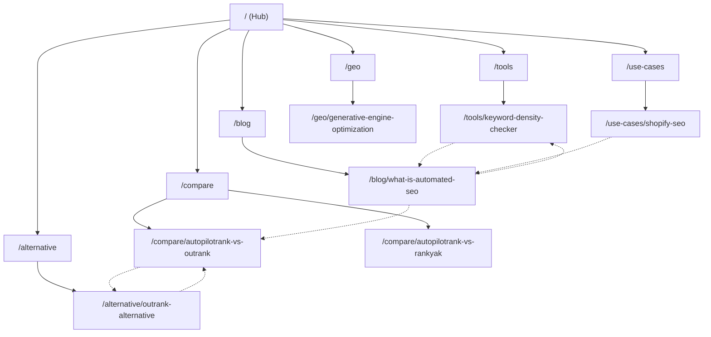

# PRD: On-Page Technical SEO Strategy & Blog Content Pipeline

**Complexity: 5 → MEDIUM mode**

---

## 1. Context

**Problem:** autopilotrank.com has DR 0, 0 organic keywords, and 0 traffic. While the site has 45+ pSEO pages and solid SEO infrastructure (meta tags, JSON-LD, sitemaps, hreflang), the on-page keyword targeting is not aligned with keyword research, title/meta templates are inconsistent, internal linking is sparse, schema markup can be enhanced, and there's no blog content pipeline to capture informational traffic.

**Competitors:**
| Site | DR | Keywords | Monthly Traffic |
|------|-----|----------|-----------------|
| autopilotrank.com | 0 | 0 | 0 |
| outrank.so | 71 | 2,435 | ~7,900 |
| rankyak.com | ~25 | 1,207 | ~800 |

**Files Analyzed:**

- `src/pages/index.astro` - Homepage
- `src/components/SEO.astro` - SEO component
- `src/layouts/Layout.astro` - Base layout (hreflang, JSON-LD)
- `src/pages/compare/[slug].astro` - Comparison template
- `src/pages/alternative/[slug].astro` - Alternative template
- `src/pages/tools/[slug].astro` - Tool template
- `src/pages/use-cases/[slug].astro` - Use case template
- `src/pages/geo/[slug].astro` - GEO page template
- `src/pages/blog/[slug].astro` - Blog post template
- `src/pages/blog/index.astro` - Blog listing page
- `src/pages/robots.txt.ts` - Robots configuration
- `src/pages/sitemap*.xml.ts` - All 7 sitemaps
- `src/pages/sitemap-static.xml.ts` - Static pages sitemap
- `content/comparisons-data.json` - 23 comparison pages
- `content/tools-data.json` - 3 tool pages
- `content/use-cases-data.json` - 11 use-case pages
- `content/geo-data.json` - 8 GEO pages
- `shared/types/pseo.types.ts` - pSEO type definitions
- `server/pseo/*.ts` - pSEO data access layer
- `docs/SEO/keywords/ahrefs-analysis-2-23-26.md` - Ahrefs keyword research
- `docs/SEO/keywords/google-ads-keyword-research.md` - Google Ads keyword research

**Current Behavior:**

- Homepage title: "AutopilotRank - Scale Your Organic Traffic on Autopilot" — doesn't target primary money keywords
- Homepage meta description: generic, doesn't include "automated SEO", "AI SEO tool", or other money keywords
- Homepage JSON-LD has aggregateRating with only 12 reviews — too low for credibility
- pSEO pages have keywords in data but title/meta templates may not be optimally structured for CTR
- No cross-category internal linking (comparisons don't link to use-cases, tools don't link to comparisons, etc.)
- Footer has only 8 unique links — misses many internal linking opportunities
- Blog system exists but has 0 published posts — no informational content capturing search traffic
- No HowTo schema on tool pages (only on GEO pages)
- No `article:published_time`/`article:modified_time` OG tags on blog posts
- Duplicate canonical URLs possible (Layout.astro sets canonical AND individual pages can also set canonical via SEO.astro)
- `robots.txt` blocks `Google-Extended` — this prevents Gemini training but NOT Google Search indexing (this is correct and intentional)
- Sitemap `lastmod` uses `new Date().toISOString()` — should use actual content modification dates

---

## 2. Solution

**Approach:**

1. **Homepage keyword optimization** — Rewrite title, meta, H1, and description to target "automated SEO", "SEO autopilot", "AI SEO tool"
2. **Title tag & meta description template system** — Standardize patterns per page type for consistent keyword targeting and CTR optimization
3. **Internal linking architecture** — Add cross-category linking component, enhance footer with more pSEO links, add contextual links within pSEO page content
4. **Schema markup enhancement** — Add HowTo schema to tool pages, add `article:published_time` OG tags to blog, enhance Organization schema with sameAs
5. **Fix technical SEO issues** — Remove duplicate canonical tags, use real lastmod dates in sitemaps, add structured data for resources page
6. **Blog content pipeline** — Create first batch of SEO-optimized blog posts targeting low-KD keywords from research, establish content templates and publishing workflow

**Architecture:**

```mermaid
flowchart TD
    subgraph "Phase 1: Homepage & Technical Fixes"
        A[Homepage SEO Optimization] --> B[Fix duplicate canonicals]
        B --> C[Fix sitemap lastmod dates]
    end
    subgraph "Phase 2: Title/Meta Templates"
        D[Standardize title tag patterns] --> E[Standardize meta description patterns]
    end
    subgraph "Phase 3: Internal Linking"
        F[Cross-category link component] --> G[Footer link expansion]
        G --> H[Contextual links in pSEO pages]
    end
    subgraph "Phase 4: Schema Enhancement"
        I[HowTo on tool pages] --> J[Article OG tags on blog]
        J --> K[Organization sameAs]
    end
    subgraph "Phase 5: Blog Content Pipeline"
        L[Content templates] --> M[First 5 blog posts]
        M --> N[Internal link integration]
    end
```



**Key Decisions:**

- Title tag format: `{Primary Keyword} | {Brand}` for pSEO pages, `{Brand} — {Primary Keyword}` for homepage
- Meta descriptions: 150-160 chars, include primary keyword in first 50 chars, CTA at end
- Internal linking: hub-and-spoke model with homepage as hub, category index pages as spokes, individual pages as leaves
- Blog posts: DB-backed (not MDX), published via admin panel, targeting low-KD keywords first
- No changes to JSON data structure — all optimizations happen at template/component level or in JSON data files

**Data Changes:** None (no schema/migration changes)

---

## 3. Keyword-to-Page Mapping

### Homepage (`/`)

| Element          | Current                                                                         | Optimized                                                                                                                                                                |
| ---------------- | ------------------------------------------------------------------------------- | ------------------------------------------------------------------------------------------------------------------------------------------------------------------------ |
| Title            | `AutopilotRank - Scale Your Organic Traffic on Autopilot`                       | `AutopilotRank — Automated SEO Content Platform \| AI SEO Tool`                                                                                                          |
| Meta Description | `AI content that ranks and reads human. Set it, forget it, watch traffic grow.` | `Automated SEO platform that generates human-quality content and publishes to your CMS on autopilot. Multi-model AI, built-in humanizer, from $49/mo. Start free trial.` |
| H1               | (inside React component, varies)                                                | Keep current — React island handles this                                                                                                                                 |
| Target Keywords  | —                                                                               | `automated SEO`, `SEO autopilot`, `AI SEO tool`, `SEO automation software`                                                                                               |

### Comparison Pages (`/compare/[slug]`)

| Element          | Template Pattern                                                                                                        |
| ---------------- | ----------------------------------------------------------------------------------------------------------------------- |
| Title            | `{CompetitorA} vs {CompetitorB}: {Year} Comparison \| AutopilotRank`                                                    |
| Meta Description | `Compare {CompetitorA} vs {CompetitorB} features, pricing & performance. See why {winnerVerb}. Updated {Month} {Year}.` |
| H1               | `{CompetitorA} vs {CompetitorB}: Complete {Year} Comparison`                                                            |

### Alternative Pages (`/alternative/[slug]`)

| Element          | Template Pattern                                                                                                                           |
| ---------------- | ------------------------------------------------------------------------------------------------------------------------------------------ |
| Title            | `Best {CompetitorName} Alternative ({Year}) \| AutopilotRank`                                                                              |
| Meta Description | `Looking for a {CompetitorName} alternative? AutopilotRank offers {keyDifferentiator} at a better price. Compare features & switch today.` |
| H1               | `Best {CompetitorName} Alternative in {Year}`                                                                                              |

### Tool Pages (`/tools/[slug]`)

| Element          | Template Pattern                                                                                |
| ---------------- | ----------------------------------------------------------------------------------------------- |
| Title            | `Free {ToolName} — {primaryKeyword} \| AutopilotRank`                                           |
| Meta Description | `Use our free {toolName} to {toolBenefit}. No signup required. {secondaryBenefit}. Try it now.` |
| H1               | Already good (`page.h1` from data)                                                              |

### Use Case Pages (`/use-cases/[slug]`)

| Element          | Template Pattern                                                                                                              |
| ---------------- | ----------------------------------------------------------------------------------------------------------------------------- |
| Title            | `{industry} SEO Content Automation \| AutopilotRank`                                                                          |
| Meta Description | `Automate SEO content for your {industry} business. {keyBenefit}. From keyword research to CMS publishing, all on autopilot.` |
| H1               | Already good (`page.h1` from data)                                                                                            |

### GEO Pages (`/geo/[slug]`)

| Element          | Template Pattern                                      |
| ---------------- | ----------------------------------------------------- |
| Title            | `{topic} — Complete Guide ({Year}) \| AutopilotRank`  |
| Meta Description | Already good from data — these are educational guides |
| H1               | Already good (`page.h1` from data)                    |

### Blog Posts (`/blog/[slug]`)

| Element          | Template Pattern                                                         |
| ---------------- | ------------------------------------------------------------------------ |
| Title            | `{PostTitle} \| AutopilotRank Blog`                                      |
| Meta Description | Post `description` field from DB                                         |
| OG Tags          | Add `article:published_time`, `article:modified_time`, `article:section` |

---

## 4. Blog Content Pipeline

### Target Keywords (Month 1-2 Priority — Low KD, High Relevance)

| #   | Title                                                     | Target Keyword                | Volume | KD   | Content Type   |
| --- | --------------------------------------------------------- | ----------------------------- | ------ | ---- | -------------- |
| 1   | What is Automated SEO? A Complete Beginner's Guide        | `automated SEO`               | 1,600  | 13   | Pillar guide   |
| 2   | How to Track Google Rankings Automatically in 2026        | `how to track google ranking` | 1,400  | 5-10 | How-to guide   |
| 3   | Semantic SEO Automation: What It Is and How to Use It     | `semantic SEO automation`     | 400    | 2    | Educational    |
| 4   | 7 Best Automated SEO Tools Compared (2026)                | `automated SEO tools`         | 1,600  | 13   | Listicle       |
| 5   | How to Put Your SEO on Autopilot (Without Losing Quality) | `SEO on autopilot`            | Low    | Low  | Brand-defining |

### Blog Post SEO Template

Each blog post MUST include:

- **Title tag**: `{PostTitle} | AutopilotRank Blog`
- **Meta description**: 150-160 chars, keyword in first 50 chars
- **H1**: Post title (naturally includes target keyword)
- **H2 structure**: Min 3 H2 sections, each targeting a secondary keyword or related question
- **Internal links**: Min 2 links to pSEO pages (comparisons, tools, use-cases), 1 link to homepage
- **CTA**: At least one contextual CTA to signup/pricing mid-article
- **Schema**: Article JSON-LD (already implemented), add `article:published_time` OG meta
- **Images**: All images must have descriptive alt text containing relevant keywords
- **Word count**: 1,500-2,500 words for pillar content, 800-1,200 for tactical posts

### Blog Post Internal Linking Rules

Every blog post should link to:

1. At least 1 comparison page (e.g., "See how we compare to [competitor]")
2. At least 1 relevant use-case page (e.g., "Learn how [industry] teams use AutopilotRank")
3. At least 1 tool page if relevant (e.g., "Try our free keyword density checker")
4. The homepage or pricing page via CTA

---

## 5. Internal Linking Architecture

### Hub-and-Spoke Model



### Cross-Category Linking Component

Add a new `CrossCategoryLinks.astro` component that renders at the bottom of every pSEO page, showing links to related pages in OTHER categories:

```
On a Comparison page → show 1 related Alternative + 1 related Use Case + 1 related Blog Post
On an Alternative page → show 1 related Comparison + 1 related Use Case + 1 related Blog Post
On a Use Case page → show 1 related Comparison + 1 related Tool + 1 related Blog Post
On a Tool page → show 1 related Use Case + 1 related Blog Post
On a GEO page → show 1 related Blog Post + 1 related Tool
```

### Footer Enhancement

Current footer links: 8 pages. Enhance to include:

**Product:**

- Pricing (/pricing)
- Features (/features)
- How It Works (/how-it-works)

**Free Tools:**

- Keyword Density Checker (/tools/keyword-density-checker)
- Meta Description Validator (/tools/meta-description-validator)
- Title Tag Optimizer (/tools/title-tag-optimizer)

**Resources:**

- Blog (/blog)
- GEO Guides (/geo)
- Comparisons (/compare)
- Alternatives (/alternative)
- Use Cases (/use-cases)

**Company:**

- Help (/help)
- Privacy (/privacy)
- Terms (/terms)

---

## 6. Execution Phases

### Phase 1: Homepage SEO & Technical Fixes

**User-visible outcome:** Homepage targets money keywords, duplicate canonical issue fixed, sitemaps use real dates.

**Files (max 5):**

- `src/pages/index.astro` — Update title, meta description, JSON-LD
- `src/layouts/Layout.astro` — Remove duplicate canonical (let page-level SEO.astro handle it), enhance Organization schema with `sameAs`
- `src/components/SEO.astro` — Ensure no double canonical when Layout also sets one
- `src/pages/sitemap-static.xml.ts` — Use actual `lastmod` dates instead of `new Date()`
- `src/pages/sitemap.xml.ts` — Use actual `lastmod` dates

**Implementation:**

- [ ] Update homepage title to: `AutopilotRank — Automated SEO Content Platform | AI SEO Tool`
- [ ] Update homepage meta description to: `Automated SEO platform that generates human-quality content and publishes to your CMS on autopilot. Multi-model AI, built-in humanizer, from $49/mo. Start free trial.`
- [ ] Update homepage JSON-LD `SoftwareApplication`:
  - Keep `aggregateRating` but note it should be updated when we have real reviews
  - Add `description` field with keyword-rich text
  - Add `url` field pointing to homepage
- [ ] Remove the canonical `<link>` from `Layout.astro` (line 93) — let `SEO.astro` component handle canonical per-page to avoid duplicates
- [ ] Verify `SEO.astro` always generates canonical correctly for pages that use it
- [ ] For pages that DON'T use `SEO.astro` (like homepage which does it manually), ensure canonical is set in the `<Fragment slot="head">`
- [ ] Add `sameAs` array to Organization JSON-LD in `Layout.astro` (link to social profiles when available)
- [ ] In `sitemap-static.xml.ts`, replace `new Date().toISOString()` with static dates per page (use a `lastmod` field in the page arrays)
- [ ] In `sitemap.xml.ts`, use a fixed recent date for the sitemap index lastmod

**Tests Required:**
| Test File | Test Name | Assertion |
|-----------|-----------|-----------|
| Build verification | `yarn build` succeeds | No build errors |
| Manual | Check homepage source | Title/meta/canonical correct, no duplicate canonicals |

**User Verification:**

- Action: Run `yarn build` then inspect the built homepage HTML
- Expected: Title tag contains "Automated SEO", meta description mentions "automated SEO platform", only ONE canonical tag in `<head>`

---

### Phase 2: Title Tag & Meta Description Optimization

**User-visible outcome:** All pSEO pages have optimized, keyword-targeted titles and meta descriptions.

**Files (max 5):**

- `content/comparisons-data.json` — Update `metaTitle` and `metaDescription` for all 23 pages
- `content/use-cases-data.json` — Update `metaTitle` and `metaDescription` for all 11 pages
- `content/tools-data.json` — Update `metaTitle` and `metaDescription` for all 3 pages
- `content/geo-data.json` — Review and update where needed for 8 pages

**Implementation:**

- [ ] For each comparison page, update `metaTitle` to pattern: `{CompetitorA} vs {CompetitorB}: 2026 Comparison | AutopilotRank`
- [ ] For each comparison page, update `metaDescription` to be 150-160 chars with primary keyword in first 50 chars and a CTA
- [ ] For each use-case page, update `metaTitle` to pattern: `AI SEO for {Industry} — {Industry} Content Automation | AutopilotRank`
- [ ] For each use-case page, update `metaDescription` to mention the industry, key benefit, and CTA
- [ ] For each tool page, update `metaTitle` to pattern: `Free {ToolName} — {PrimaryKeyword} | AutopilotRank`
- [ ] For each tool page, ensure `metaDescription` starts with primary keyword and includes "free" + "no signup"
- [ ] For GEO pages, review existing titles — most are already good, but ensure they follow pattern: `{Topic} — Complete Guide (2026) | AutopilotRank`
- [ ] Ensure NO title exceeds 60 characters (Google truncates at ~60)
- [ ] Ensure NO meta description exceeds 160 characters

**Tests Required:**
| Test File | Test Name | Assertion |
|-----------|-----------|-----------|
| Build verification | `yarn build` succeeds | No build errors |
| Validation script | Check title/meta lengths | All titles ≤60 chars, all descriptions ≤160 chars |

**User Verification:**

- Action: `yarn build`, then spot-check 3-4 comparison pages in build output
- Expected: Titles follow pattern `X vs Y: 2026 Comparison | AutopilotRank`, descriptions are 150-160 chars with keyword-rich first 50 chars

---

### Phase 3: Internal Linking Architecture

**User-visible outcome:** Every pSEO page links to related pages in other categories. Footer has comprehensive link structure.

**Files (max 5):**

- `src/components/pseo/CrossCategoryLinks.astro` — **NEW** component for cross-category linking
- `src/pages/compare/[slug].astro` — Add CrossCategoryLinks component
- `src/pages/alternative/[slug].astro` — Add CrossCategoryLinks component
- `src/pages/use-cases/[slug].astro` — Add CrossCategoryLinks component
- `src/client/components/layout/FooterAstro.tsx` — Expand footer links

**Implementation:**

- [ ] Create `CrossCategoryLinks.astro` component:
  - Props: `currentCategory: 'comparison' | 'alternative' | 'use-case' | 'tool' | 'geo'`, `currentSlug: string`
  - Uses server-side data access to fetch 1-2 pages from each OTHER category
  - Renders as a "You might also like" section with links grouped by category
  - Each link shows: title + short description (100 chars max)
- [ ] Add `CrossCategoryLinks` to comparison page template (after Related Comparisons section)
- [ ] Add `CrossCategoryLinks` to alternative page template (after Related Alternatives section)
- [ ] Add `CrossCategoryLinks` to use-cases page template (after Related Use Cases section)
- [ ] Expand FooterAstro with restructured link sections:
  - **Product**: Pricing, Features, How It Works
  - **Free Tools**: Link to each tool page by name
  - **Resources**: Blog, GEO Guides, Comparisons, Alternatives, Use Cases
  - **Company**: Help, Privacy, Terms

**Tests Required:**
| Test File | Test Name | Assertion |
|-----------|-----------|-----------|
| Build verification | `yarn build` succeeds | No build errors |
| Manual | Check comparison page | Shows cross-category links at bottom |
| Manual | Check footer | Shows expanded link structure |

**User Verification:**

- Action: Build site, check `/compare/autopilotrank-vs-outrank` page
- Expected: Bottom of page shows "You might also like" with links to a use-case page, an alternative page, and a tool page

---

### Phase 4: Schema Markup Enhancement

**User-visible outcome:** Enhanced structured data for better SERP features (rich snippets, knowledge panels).

**Files (max 5):**

- `src/pages/tools/[slug].astro` — Add HowTo schema for tool usage steps
- `src/pages/blog/[slug].astro` — Add `article:published_time` OG meta, enhance Article schema
- `src/layouts/Layout.astro` — Enhance Organization schema with `sameAs`, add `potentialAction` SearchAction to WebSite schema
- `src/pages/index.astro` — Add `description` and `url` to SoftwareApplication schema

**Implementation:**

- [ ] **Tool pages**: Add `HowTo` JSON-LD schema using `page.howToUse` steps (same pattern as GEO pages already use)
- [ ] **Blog posts**: Add OG meta tags:
  - `<meta property="article:published_time" content={post.date} />`
  - `<meta property="article:modified_time" content={post.date} />`
  - `<meta property="article:section" content={post.category} />`
  - `<meta property="article:tag" content={post.tags.join(',')} />`
- [ ] **Layout.astro**: Add `potentialAction` to WebSite schema:
  ```json
  "potentialAction": {
    "@type": "SearchAction",
    "target": "{BASE_URL}/blog?search={search_term_string}",
    "query-input": "required name=search_term_string"
  }
  ```
- [ ] **Layout.astro**: Add placeholder `sameAs` to Organization schema (empty array for now, to be populated when social profiles are created)
- [ ] **Homepage**: Add `description` and `url` fields to SoftwareApplication schema

**Tests Required:**
| Test File | Test Name | Assertion |
|-----------|-----------|-----------|
| Build verification | `yarn build` succeeds | No build errors |
| Schema validation | Google Rich Results Test | Tool page passes HowTo validation |
| Schema validation | Google Rich Results Test | Blog post passes Article validation |

**User Verification:**

- Action: Build site, extract JSON-LD from tool page HTML
- Expected: Contains both `WebApplication` and `HowTo` schema objects
- Action: Check blog post HTML for `article:published_time` meta tag
- Expected: Tag present with ISO date

---

### Phase 5: Blog Content — First 5 Posts

**User-visible outcome:** 5 SEO-optimized blog posts published, targeting low-KD keywords from research.

**Files (max 5):**

- Blog posts are created via the admin panel (DB-backed, not file-based)
- `src/pages/blog/[slug].astro` — May need minor template adjustments for internal links
- `src/pages/blog/index.astro` — Verify listing page works with new posts
- `content/` — No changes needed (blog is DB-backed)

**Implementation:**

This phase involves creating blog content via the admin panel or directly in the DB. Each post must follow the Blog Post SEO Template defined in Section 4.

- [ ] **Post 1: "What is Automated SEO? A Complete Beginner's Guide"**
  - Target: `automated SEO` (1,600 vol, KD 13)
  - H2s: "What is Automated SEO?", "How Automated SEO Tools Work", "Benefits of SEO Automation", "Manual SEO vs Automated SEO", "Getting Started with Automated SEO"
  - Internal links: /compare/autopilotrank-vs-outrank, /use-cases/saas-blog-automation, /pricing
  - Word count: 2,000-2,500

- [ ] **Post 2: "How to Track Google Rankings Automatically in 2026"**
  - Target: `how to track google ranking` (1,400 vol, KD 5-10)
  - H2s: "Why Track Google Rankings?", "Manual vs Automated Rank Tracking", "Best Rank Tracking Methods", "Setting Up Automated Rank Tracking", "Using Google Search Console for Rank Tracking"
  - Internal links: /tools/keyword-density-checker, /compare/autopilotrank-vs-semrush, /geo/generative-engine-optimization
  - Word count: 1,500-2,000

- [ ] **Post 3: "Semantic SEO Automation: What It Is and How to Use It"**
  - Target: `semantic SEO automation` (400 vol, KD 2)
  - H2s: "What is Semantic SEO?", "Why Automate Semantic SEO?", "Tools for Semantic SEO Automation", "Step-by-Step: Automating Your Semantic SEO", "Common Mistakes to Avoid"
  - Internal links: /use-cases/content-quality, /alternative/outrank-alternative, /pricing
  - Word count: 1,500-2,000

- [ ] **Post 4: "7 Best Automated SEO Tools Compared (2026)"**
  - Target: `automated SEO tools` (1,600 vol, KD 13)
  - H2s: "What to Look for in an Automated SEO Tool", "1. AutopilotRank", "2. Outrank.so", "3. RankYak", "4. Surfer SEO", "5. Frase", "6. MarketMuse", "7. Clearscope", "Our Verdict"
  - Internal links: /compare (multiple), /pricing, /alternative (multiple)
  - Word count: 2,500-3,000

- [ ] **Post 5: "How to Put Your SEO on Autopilot (Without Losing Quality)"**
  - Target: `SEO on autopilot` (Low vol, brand-defining)
  - H2s: "What Does 'SEO on Autopilot' Mean?", "The Myth of Set-and-Forget", "How AutopilotRank Combines AI + Quality", "Our Quality Control Pipeline", "Getting Started"
  - Internal links: /use-cases/content-operations, /compare/autopilotrank-vs-outrank, /pricing
  - Word count: 1,500-2,000

**Tests Required:**
| Test File | Test Name | Assertion |
|-----------|-----------|-----------|
| Manual | Visit /blog | All 5 posts appear in listing |
| Manual | Check each post | H-tag hierarchy correct, internal links work, meta tags present |
| Manual | Google Rich Results Test | Article schema validates for each post |

**User Verification:**

- Action: Visit /blog after publishing
- Expected: 5 posts displayed with titles, dates, categories, reading times. Each post has correct H1, H2 hierarchy and internal links to pSEO pages.

---

## 7. Technical SEO Audit Checklist

These items should be verified after all phases are complete:

### Title Tags

- [ ] Every page has a unique title tag
- [ ] No title exceeds 60 characters
- [ ] Primary keyword appears in first 40 characters
- [ ] Brand name appears in every title (after `|`)
- [ ] Homepage uses `—` separator, other pages use `|`

### Meta Descriptions

- [ ] Every page has a unique meta description
- [ ] No description exceeds 160 characters
- [ ] Primary keyword in first 50 characters
- [ ] Each description includes a CTA ("Start free trial", "Compare now", "Try it free")

### Canonical Tags

- [ ] Every page has exactly ONE canonical tag
- [ ] No page has conflicting canonical tags from Layout + SEO component
- [ ] Self-referencing canonicals on all pages

### Internal Links

- [ ] Homepage links to all category index pages
- [ ] Every pSEO page links to at least 3 other pages
- [ ] Cross-category links present on comparison, alternative, use-case pages
- [ ] Footer contains links to all major sections
- [ ] No broken internal links

### Schema Markup

- [ ] WebSite + Organization schema on every page (via Layout)
- [ ] SoftwareApplication schema on homepage
- [ ] FAQPage schema on all pages with FAQs
- [ ] BreadcrumbList schema on all pSEO pages
- [ ] Article schema on all blog posts
- [ ] WebApplication schema on all tool pages
- [ ] HowTo schema on tool pages and GEO pages

### Heading Hierarchy

- [ ] Every page has exactly one H1
- [ ] H2s used for main sections
- [ ] No heading level skipped (no H1→H3 without H2)

### Sitemaps

- [ ] All pages appear in sitemaps
- [ ] lastmod dates reflect actual content dates
- [ ] Priority values are reasonable (1.0 for homepage, 0.8-0.9 for key pages)
- [ ] Blog posts appear in sitemap-blog.xml

### robots.txt

- [ ] All sitemaps referenced
- [ ] API routes blocked
- [ ] Dashboard blocked
- [ ] No public pages accidentally blocked

---

## 8. Acceptance Criteria

- [ ] All 5 phases complete
- [ ] All specified tests pass
- [ ] `yarn verify` passes
- [ ] Homepage targets "automated SEO" keywords in title and meta
- [ ] All 45+ pSEO pages have optimized title tags (≤60 chars) and meta descriptions (≤160 chars)
- [ ] Cross-category internal linking present on comparison, alternative, use-case pages
- [ ] Footer expanded with comprehensive link structure
- [ ] HowTo schema added to tool pages
- [ ] Article OG tags added to blog posts
- [ ] No duplicate canonical tags on any page
- [ ] 5 blog posts published targeting low-KD keywords
- [ ] Each blog post has min 2 internal links to pSEO pages
- [ ] `yarn build` succeeds with no errors
