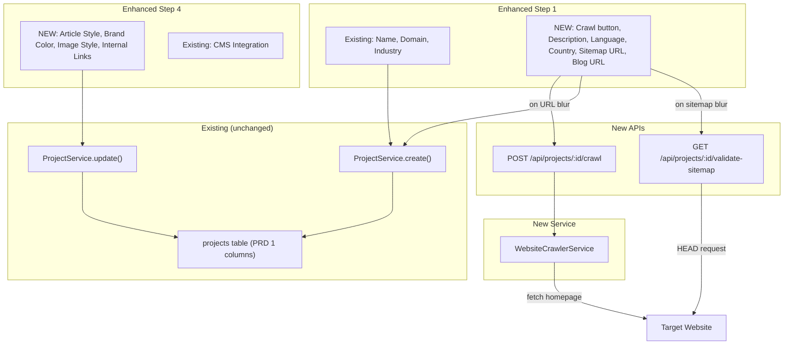
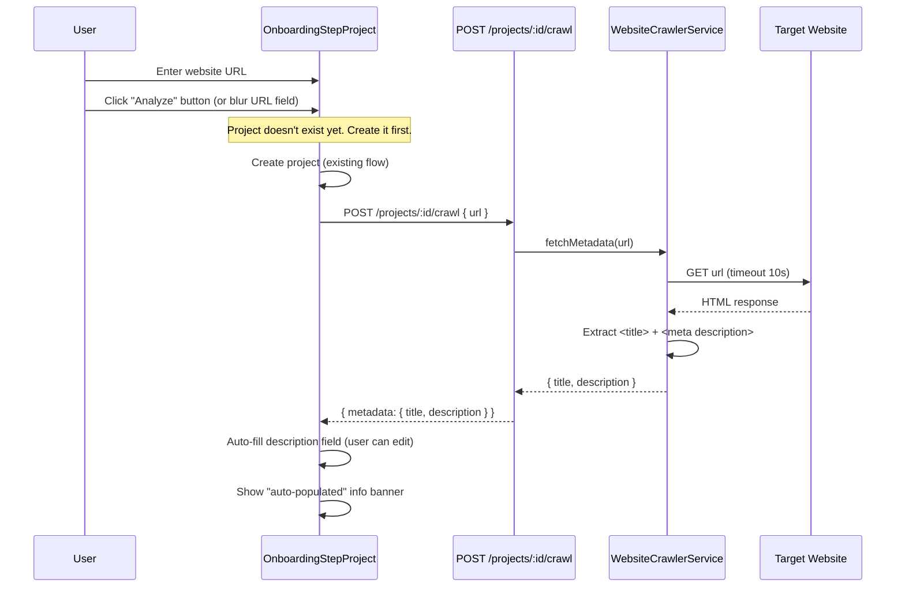
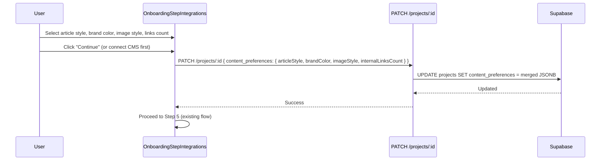

# PRD: Additive Onboarding Enhancement

**Status:** Draft
**Complexity Score:** 5 → MEDIUM
**Created:** 2026-02-25
**Author:** Claude (Principal Architect)
**Depends On:** PRD 1 (Schema & Data Model) — already implemented
**Relationship:** Cherry-picks critical fields from PRD 4 (Enhanced Onboarding) without restructuring the wizard

---

## Complexity Assessment

| Factor | Score | Rationale |
|--------|-------|-----------|
| Files touched | +2 | 8-10 files modified/created |
| New service from scratch | +1 | Lightweight WebsiteCrawlerService |
| External API integration | +1 | Website crawl fetch, sitemap HEAD validation |
| UI component changes | +1 | Step 1 + Step 4 enhancements |
| **Total** | **5** | **MEDIUM** |

**What this is NOT:** This is NOT the full PRD 4 onboarding redesign. The original 5-step flow, step numbers, step semantics, keywords step, campaign creation, and completion screen are all preserved. This is purely additive — new fields and capabilities layered onto existing steps.

---

## Integration Points Checklist

```
How will this feature be reached?
- [x] Entry point: Existing OnboardingWizard.tsx renders enhanced Step 1 and Step 4
- [x] Caller: OnboardingStepProject.tsx calls new crawl endpoint on URL blur
- [x] Caller: OnboardingStepIntegrations.tsx saves content preferences on continue
- [x] New endpoint: POST /api/projects/:projectId/crawl
- [x] New endpoint: GET /api/projects/:projectId/validate-sitemap

Is this user-facing?
- [x] YES — Enhanced Step 1 form and new preferences section in Step 4

Full user flow:
1. User opens onboarding wizard (unchanged trigger)
2. Step 1: Enters website URL → clicks "Analyze" → auto-populates name + description
3. Step 1: Fills language, country, sitemap URL, blog URL → creates project with all fields
4. Steps 2-3: Unchanged (GSC, Keywords)
5. Step 4: New "Content Preferences" section appears above CMS integration
6. Step 4: Sets article style, brand color, image style, internal links → saves to project
7. Step 4: Optionally connects CMS integration (unchanged)
8. Step 5: Completion (unchanged)
```

---

## 1. Context

### Problem

The current onboarding collects only a project name, optional domain, and industry in Step 1. The domain is never used to gather intelligence. There are no fields for language, country, description, sitemap URL, blog URL, or content preferences. These fields already exist in the database (PRD 1) but have no UI to populate them during onboarding.

### Files Analyzed

| File | Purpose |
|------|---------|
| `client/components/onboarding/steps/OnboardingStepProject.tsx` | Current Step 1 — name, domain, industry |
| `client/components/onboarding/steps/OnboardingStepIntegrations.tsx` | Current Step 4 — CMS integration only |
| `client/components/onboarding/OnboardingWizard.tsx` | Wizard container, step routing |
| `client/store/onboardingStore.ts` | Zustand store — current shape |
| `shared/types/project.types.ts` | IProject, IContentPreferences, ICreateProjectInput |
| `shared/validation/project.schema.ts` | createProjectSchema — already supports outrank fields |
| `server/services/project.service.ts` | ProjectService — already handles outrank fields |
| `src/pages/api/projects/[projectId]/` | Existing API routes |

### Current Behavior

- Step 1 creates a project with only `name`, `domain` (optional), `industry` (optional)
- `language`, `country`, `description`, `sitemap_url`, `blog_url`, `brand_color` columns exist in DB but are never set during onboarding (defaults: `'en'`, `'US'`, null, null, null, null)
- `content_preferences` JSONB only stores `frequency` — no article style, toggles, etc.
- Step 4 only handles CMS integration — no content preference settings
- No website crawling capability exists

---

## 2. Solution

### Approach

1. **Enhance Step 1** with website crawl auto-populate, description, language, country, sitemap URL, and blog URL
2. **Add a Content Preferences section to Step 4** (above the existing CMS integration) for article style, brand color, image style, and internal links
3. **Create a lightweight WebsiteCrawlerService** that fetches a homepage and extracts `<title>` + `<meta description>` via regex (Cloudflare Workers compatible — no DOM API)
4. **Create two new API endpoints**: crawl and sitemap validation
5. **Extend IContentPreferences** interface with article preference fields
6. **All changes are additive** — no existing fields, steps, or behaviors are removed

### Architecture



### Key Decisions

1. **Domain becomes effectively required (soft)** — The "Analyze" button only appears when a domain is entered. Domain itself stays technically optional to not break existing flow, but the UI nudges users to provide it.
2. **Content preferences saved via project update** — Step 4 saves preferences to `projects.content_preferences` JSONB via `PATCH /api/projects/:projectId`. No new tables needed.
3. **Crawl is best-effort** — If the website can't be reached, the user fills fields manually. No hard failure.
4. **Sitemap validation is HEAD-only** — Minimal bandwidth, respects Cloudflare 10ms CPU limit.
5. **No store shape changes needed for Step 1** — New fields are saved directly to the project via API, not tracked in the onboarding Zustand store. The store already tracks `projectId` which is all we need.
6. **Step 4 preferences have defaults** — User can click "Continue" without changing anything.

### Data Changes

**No new tables or columns** — everything uses existing PRD 1 schema.

**Extended `IContentPreferences` interface:**

```typescript
export interface IContentPreferences {
  frequency?: 'daily' | '3x_week' | 'weekly';
  // NEW: Article preferences (set in onboarding Step 4)
  articleStyle?: 'informative' | 'how-to' | 'listicle' | 'opinion' | 'tutorial' | 'review' | 'comparison';
  internalLinksCount?: number;  // 0, 1, 2, 3, or 5
  brandColor?: string;          // hex, e.g. "#4F46E5"
  imageStyle?: 'brand-text' | 'watercolor' | 'cinematic' | 'illustration' | 'sketch';
  globalInstructions?: string;  // max 1000 chars
}
```

### New API Endpoints

| Method | Path | Purpose |
|--------|------|---------|
| `POST` | `/api/projects/:projectId/crawl` | Fetch homepage, extract title + meta description |
| `GET` | `/api/projects/:projectId/validate-sitemap` | HEAD request to check sitemap URL returns 200 |

---

## 3. Sequence Flow

### Step 1: Website Crawl Auto-Populate



### Step 4: Content Preferences Save



---

## 4. Execution Phases

### Phase 1: Backend — WebsiteCrawlerService + API Endpoints

**Goal:** Create the crawl service and two new API endpoints. No UI changes yet.

**Files (4):**

| # | File | Action | Description |
|---|------|--------|-------------|
| 1 | `server/services/website-crawler.service.ts` | Create | Lightweight service: `fetchMetadata(url)` returns `{ title, description }`. Uses regex extraction (no DOM API). Validates URLs (block private IPs). 10s timeout, 5MB max. |
| 2 | `src/pages/api/projects/[projectId]/crawl.ts` | Create | `POST` — Verify ownership, call `websiteCrawlerService.fetchMetadata(url)`, return metadata. |
| 3 | `src/pages/api/projects/[projectId]/validate-sitemap.ts` | Create | `GET ?url=X` — HEAD request to validate sitemap URL. Returns `{ valid, reason? }`. |
| 4 | `shared/types/project.types.ts` | Modify | Extend `IContentPreferences` with `articleStyle`, `internalLinksCount`, `brandColor`, `imageStyle`, `globalInstructions`. |

**Implementation:**

- [ ] Create `WebsiteCrawlerService` with `fetchMetadata(url)`:
  - Validate URL (block localhost, private IPs, non-HTTP protocols)
  - `fetch()` with 10s timeout via `AbortController`
  - Extract `<title>` and `<meta name="description">` via regex
  - Return `{ title: string | null, description: string | null }`
- [ ] Create `POST /api/projects/:projectId/crawl`:
  - `withAuthAndBody` with schema: `{ url: z.string().url() }`
  - Verify project ownership via `projectService.getById()`
  - Call `websiteCrawlerService.fetchMetadata(body.url)`
  - Return `{ metadata: { title, description } }`
- [ ] Create `GET /api/projects/:projectId/validate-sitemap`:
  - `withAuth` wrapper
  - Read `url` from query params, validate with `z.string().url()`
  - Verify project ownership
  - `fetch(url, { method: 'HEAD', signal: AbortController(5s) })`
  - Return `{ valid: true }` or `{ valid: false, reason: 'not_found' | 'timeout' | 'error' }`
- [ ] Extend `IContentPreferences` interface with new fields (type-only change)

**Tests Required:**

| Test File | Test Name | Assertion |
|-----------|-----------|-----------|
| `server/services/__tests__/website-crawler.service.test.ts` | `should extract title from HTML` | Returns correct title |
| | `should extract meta description` | Returns correct description |
| | `should handle missing tags gracefully` | Returns null for missing fields |
| | `should reject private IPs (SSRF)` | Throws on localhost, 127.0.0.1, etc. |
| | `should timeout on slow responses` | Throws timeout error after 10s |
| | `should reject non-HTML responses` | Throws on JSON/binary content-type |

**Verification:** `yarn test server/services/__tests__/website-crawler.service.test.ts && yarn verify`

---

### Phase 2: Step 1 Enhancement — Business Fields + Auto-Crawl

**Goal:** Add description, language, country, sitemap URL, blog URL, and "Analyze Website" button to Step 1.

**Files (3):**

| # | File | Action | Description |
|---|------|--------|-------------|
| 1 | `client/components/onboarding/steps/OnboardingStepProject.tsx` | Modify | Add new form fields below existing ones. Add "Analyze Website" button that calls crawl endpoint. Auto-suggest sitemap/blog URLs from domain. |
| 2 | `shared/validation/onboarding.schema.ts` | Modify | Add Zod schema for enhanced Step 1 fields. |
| 3 | `client/components/onboarding/OnboardingWizard.tsx` | Modify | Update Step 1 subtitle to mention website intelligence. |

**Implementation:**

- [ ] Add new fields to Step 1 form schema:
  ```
  description: z.string().max(500).optional()
  language: z.string().default('en')
  country: z.string().default('US')
  sitemap_url: z.string().url().optional().or(z.literal(''))
  blog_url: z.string().url().optional().or(z.literal(''))
  ```
- [ ] Add "Analyze Website" button next to domain input:
  - Shows only when domain has a value
  - On click: calls `POST /api/projects/:projectId/crawl` with the domain URL
  - Shows loading spinner during fetch
  - On success: auto-fills description field, shows info banner
  - On failure: shows subtle warning, user fills manually
  - Note: project must exist first — create project on domain blur if it doesn't exist yet, or create on "Analyze" click
- [ ] Add description textarea below domain (auto-populated or manual)
- [ ] Add language + country dropdowns in a 2-column row:
  - Use `LANGUAGES` and `COUNTRIES` constants from `shared/validation/project.schema.ts`
  - Display human-readable labels (e.g., "English (en)", "United States (US)")
  - Default: English, United States
- [ ] Add sitemap URL field:
  - Auto-suggest `{domain}/sitemap.xml` when domain is entered
  - On blur: call `GET /api/projects/:projectId/validate-sitemap?url=...`
  - Show green check icon for valid, orange warning for invalid
- [ ] Add blog URL field:
  - Auto-suggest `{domain}/blog` when domain is entered
  - Simple text input, no validation beyond URL format
- [ ] On form submit: pass all new fields to `createProject()`:
  ```
  { name, domain, industry, language, country, description, sitemap_url, blog_url }
  ```
- [ ] Section the form visually:
  - Section 1: "Your Project" — Name, Domain + Analyze button, Industry
  - Section 2: "About Your Website" — Description, Language, Country, Sitemap URL, Blog URL

**UI Layout (Step 1 enhanced):**

```
┌─────────────────────────────────────┐
│  YOUR PROJECT                       │
│  ┌─────────────────────────────┐    │
│  │ Project Name *              │    │
│  └─────────────────────────────┘    │
│  ┌──────────────────┐ ┌──────────┐  │
│  │ Website URL       │ │ Analyze │  │
│  └──────────────────┘ └──────────┘  │
│  ┌─────────────────────────────┐    │
│  │ Industry (optional)         │    │
│  └─────────────────────────────┘    │
│                                     │
│  ABOUT YOUR WEBSITE                 │
│  ┌─────────────────────────────┐    │
│  │ Description (auto-filled)   │    │
│  │                             │    │
│  └─────────────────────────────┘    │
│  ┌──────────┐ ┌──────────────┐      │
│  │ Language  │ │ Country      │      │
│  └──────────┘ └──────────────┘      │
│  ┌─────────────────────────────┐    │
│  │ Sitemap URL  ✅/⚠️          │    │
│  └─────────────────────────────┘    │
│  ┌─────────────────────────────┐    │
│  │ Blog URL                    │    │
│  └─────────────────────────────┘    │
│                                     │
│  [ Create Project & Continue ]      │
└─────────────────────────────────────┘
```

**Tests Required:**

| Test File | Test Name | Assertion |
|-----------|-----------|-----------|
| Component test | `should render all new fields` | Description, language, country, sitemap, blog fields visible |
| Component test | `should show Analyze button when domain is entered` | Button appears after domain input |
| Component test | `should auto-suggest sitemap URL from domain` | `{domain}/sitemap.xml` populated |
| Component test | `should auto-suggest blog URL from domain` | `{domain}/blog` populated |
| Component test | `should still work with only name (backward compat)` | Minimum required fields work |

**Verification:** `yarn verify`

---

### Phase 3: Step 4 Enhancement — Content Preferences Section

**Goal:** Add a "Content Preferences" section to Step 4, above the existing CMS integration form.

**Files (3):**

| # | File | Action | Description |
|---|------|--------|-------------|
| 1 | `client/components/onboarding/steps/OnboardingStepIntegrations.tsx` | Modify | Add content preferences section at the top. Save preferences to project on continue/skip. |
| 2 | `client/components/onboarding/steps/ContentPreferencesSection.tsx` | Create | Extracted component for article preferences: article style dropdown, brand color, image style picker, internal links dropdown. |
| 3 | `client/hooks/useProjects.ts` | Verify | Ensure `updateProject()` mutation exists and handles `content_preferences` JSONB merge correctly. |

**Implementation:**

- [ ] Create `ContentPreferencesSection` component:
  - **Article Style** dropdown: Informative, How-To, Listicle, Opinion, Tutorial, Review, Comparison (default: Informative)
  - **Internal Links** dropdown: 0, 1, 2, 3, 5 (default: 2)
  - **Brand Color** hex input with color swatch preview: text input for hex value + native `<input type="color">` picker (default: #4F46E5)
  - **Image Style** visual radio selector with 5 options: Brand & Text, Watercolor, Cinematic, Illustration, Sketch (default: Cinematic)
  - **Global Instructions** textarea (optional, max 1000 chars): "Additional instructions for the AI writer"
  - All fields have defaults — section can be skipped by just clicking Continue
- [ ] Modify `OnboardingStepIntegrations`:
  - Add `ContentPreferencesSection` at the top, above the "Why Connect a CMS?" benefits section
  - Add divider between preferences and CMS integration sections
  - On "Continue" (integration created) OR "Skip" (no integration): save content preferences to project first via `PATCH /api/projects/:projectId`
  - Content preferences are local form state (not in onboarding store)
- [ ] Section layout:

```
┌─────────────────────────────────────┐
│  CONTENT PREFERENCES                │
│  Set defaults for generated content │
│                                     │
│  ┌──────────────┐ ┌──────────────┐  │
│  │ Article Style │ │ Internal Links│ │
│  └──────────────┘ └──────────────┘  │
│  ┌──────────────┐ ┌──────────────┐  │
│  │ Brand Color   │ │ Image Style  │  │
│  └──────────────┘ └──────────────┘  │
│  ┌─────────────────────────────┐    │
│  │ Global Instructions         │    │
│  │ (optional)                  │    │
│  └─────────────────────────────┘    │
│                                     │
│  ─────────── OR ───────────         │
│                                     │
│  CMS INTEGRATION                    │
│  (existing integration form)        │
│                                     │
│  [ Skip for now ]                   │
└─────────────────────────────────────┘
```

**Tests Required:**

| Test File | Test Name | Assertion |
|-----------|-----------|-----------|
| Component test | `should render content preferences section` | All preference fields visible |
| Component test | `should have correct defaults` | Article style: Informative, Links: 2, Color: #4F46E5, Image: cinematic |
| Component test | `should save preferences on continue` | PATCH called with content_preferences |
| Component test | `should save preferences on skip` | PATCH called before skip proceeds |
| Component test | `should still render CMS integration below preferences` | Existing integration form unchanged |

**Verification:** `yarn verify`

---

### Phase 4: Polish + Testing + Integration Verification

**Goal:** End-to-end testing, backward compatibility verification, and final cleanup.

**Files (3):**

| # | File | Action | Description |
|---|------|--------|-------------|
| 1 | `client/components/onboarding/OnboardingWizard.tsx` | Modify | Update Step 1 subtitle: "Create a project and tell us about your website". Update Step 4 subtitle: "Set content preferences and connect your CMS". |
| 2 | `client/components/onboarding/OnboardingStepperProgress.tsx` | Modify | Update Step 4 label from "Integration" to "Preferences" (shorter, more accurate). |
| 3 | Tests | Create | E2E and integration tests for the enhanced flow. |

**Tests Required:**

| Test File | Test Name | Assertion |
|-----------|-----------|-----------|
| `tests/api/project-crawl.api.spec.ts` | `POST /crawl returns metadata for valid URL` | 200 with title + description |
| | `POST /crawl returns 404 for non-owned project` | 404 |
| | `POST /crawl handles unreachable URLs gracefully` | 400 with error message |
| `tests/api/project-sitemap-validation.api.spec.ts` | `GET /validate-sitemap returns valid for existing sitemap` | `{ valid: true }` |
| | `GET /validate-sitemap returns invalid for 404 URL` | `{ valid: false, reason: 'not_found' }` |
| E2E test | `enhanced onboarding Step 1 shows all new fields` | Fields rendered |
| E2E test | `enhanced onboarding Step 4 shows preferences` | Preferences section rendered |
| E2E test | `existing users with is_complete=true never see wizard` | Backward compat preserved |

**Verification:** `yarn test && yarn verify`

---

## 5. Acceptance Criteria

### Step 1 Enhancements

- [ ] **AC-1.1:** "Analyze Website" button appears when domain field has a value
- [ ] **AC-1.2:** Clicking "Analyze" fetches website metadata and auto-populates description
- [ ] **AC-1.3:** If crawl fails, user sees a subtle warning and can fill fields manually
- [ ] **AC-1.4:** Description textarea is shown below domain (max 500 chars)
- [ ] **AC-1.5:** Language dropdown defaults to English, Country defaults to US
- [ ] **AC-1.6:** Sitemap URL auto-suggests `{domain}/sitemap.xml` when domain is entered
- [ ] **AC-1.7:** Sitemap URL shows validation indicator (green check / warning) on blur
- [ ] **AC-1.8:** Blog URL auto-suggests `{domain}/blog` when domain is entered
- [ ] **AC-1.9:** All new fields are saved to the project on form submission
- [ ] **AC-1.10:** Step 1 still works with only a project name (backward compat — new fields optional)

### Step 4 Enhancements

- [ ] **AC-4.1:** Content Preferences section appears above CMS integration in Step 4
- [ ] **AC-4.2:** Article style dropdown with 7 options, default: Informative
- [ ] **AC-4.3:** Internal links dropdown with options 0/1/2/3/5, default: 2
- [ ] **AC-4.4:** Brand color input with hex text + color swatch, default: #4F46E5
- [ ] **AC-4.5:** Image style selector with 5 visual options, default: Cinematic
- [ ] **AC-4.6:** Global instructions textarea (optional, max 1000 chars)
- [ ] **AC-4.7:** All preferences have defaults — user can skip without changing anything
- [ ] **AC-4.8:** Preferences saved to `projects.content_preferences` on Continue or Skip
- [ ] **AC-4.9:** Existing CMS integration form is unchanged and still works

### Backend

- [ ] **AC-B.1:** `POST /api/projects/:projectId/crawl` returns `{ metadata: { title, description } }`
- [ ] **AC-B.2:** Crawl endpoint validates URL (blocks private IPs, non-HTTP)
- [ ] **AC-B.3:** Crawl endpoint has 10s timeout
- [ ] **AC-B.4:** `GET /api/projects/:projectId/validate-sitemap?url=X` returns `{ valid, reason? }`
- [ ] **AC-B.5:** Sitemap validation uses HEAD request (not GET)
- [ ] **AC-B.6:** Both endpoints verify project ownership
- [ ] **AC-B.7:** All endpoints respect Cloudflare Workers 10ms CPU limit

### Backward Compatibility

- [ ] **AC-BC.1:** Existing users with `is_complete = true` never see the wizard
- [ ] **AC-BC.2:** Step numbers (1-5) are unchanged
- [ ] **AC-BC.3:** Step 2 (GSC) and Step 3 (Keywords) are completely unchanged
- [ ] **AC-BC.4:** Step 5 (Completion) is completely unchanged
- [ ] **AC-BC.5:** Onboarding store shape is only extended (no removed fields)
- [ ] **AC-BC.6:** Existing projects without new fields continue to work (null defaults)
- [ ] **AC-BC.7:** `yarn verify` passes

---

## Out of Scope

- **Target audiences & competitors** — Full PRD 4 feature. Not critical for initial bump.
- **Example article URLs** — PRD 4 feature. Can be added later.
- **Article style auto-detection from example articles** — PRD 2/4 feature.
- **Post-wizard content strategy generation** — PRD 5 feature.
- **Removing keywords step** — PRD 4 proposal. Explicitly preserved here.
- **Removing campaign creation** — PRD 4 proposal. Explicitly preserved here.
- **Step renaming (Business, Audience, Blog, etc.)** — PRD 4 proposal. Steps keep current names.
- **YouTube/CTA/Infographics/Emojis toggles** — Nice-to-have, can be added to settings page later.
