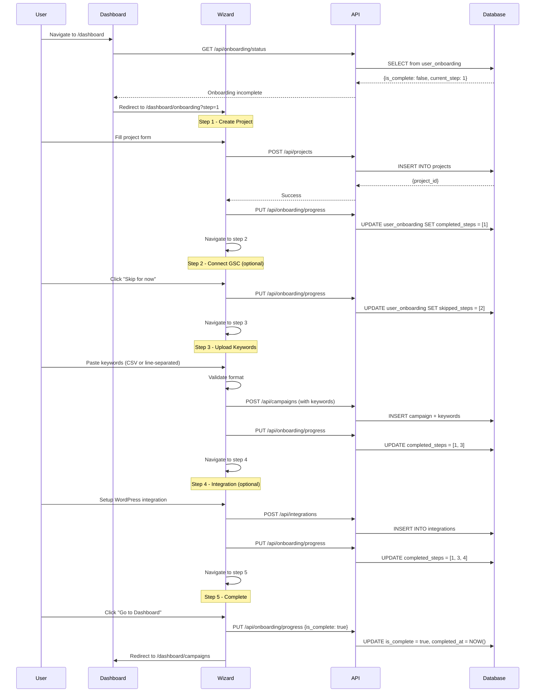

# PRD: User Onboarding Flow

**Status:** Draft
**Complexity Score:** 8 → HIGH
**Created:** 2026-02-12
**Author:** Claude (Principal Architect)

---

## Complexity Assessment

```
COMPLEXITY SCORE: 8 (HIGH mode)
+3  Touches 10+ files (new components, hooks, services, DB migration)
+2  New system/module from scratch (onboarding wizard)
+2  Complex state logic (multi-step wizard, progress persistence, skip logic)
+1  Database schema changes (user_onboarding table)
```

**Mode: FULL + mandatory checkpoints every phase**

---

## Integration Points Checklist

**How will this feature be reached?**
- [x] Entry point identified: Dashboard route `/dashboard` - redirect to `/dashboard/onboarding` if incomplete
- [x] Caller file identified: `src/pages/dashboard/[...slug].astro` (dashboard router)
- [x] Registration/wiring needed: Add onboarding middleware check, create onboarding route

**Is this user-facing?**
- [x] YES → UI components required:
  - OnboardingWizard (main container)
  - OnboardingStepperProgress (progress indicator)
  - OnboardingStepProject (step 1)
  - OnboardingStepGSC (step 2)
  - OnboardingStepKeywords (step 3)
  - OnboardingStepIntegrations (step 4)
  - OnboardingStepComplete (step 5)

**Full user flow:**
1. User logs in and navigates to `/dashboard`
2. Dashboard checks if user has completed onboarding via hook `useOnboardingStatus()`
3. If incomplete, redirects to `/dashboard/onboarding?step=<first-incomplete-step>`
4. User completes each step in wizard (can skip non-critical steps)
5. On completion, onboarding state is marked complete in DB
6. User redirected to `/dashboard/campaigns` (main app)
7. User can always access onboarding later via settings or help menu

---

## 1. Context

### Problem

New users don't know where to start after signup. They face:
- Empty dashboard with no guidance
- Confusion about what a "campaign" is
- Unclear what GSC integration does
- Don't understand keyword upload process
- Skip integration setup, leading to manual article delivery

This results in:
- High drop-off rate after signup
- Support tickets asking "what do I do next?"
- Users not reaching first article generation
- Poor time-to-value

### Files Analyzed

**Existing Infrastructure:**
- `shared/types/campaign.types.ts` - Campaign structure (project_id, keywords array)
- `shared/types/integration.types.ts` - Integration types (WordPress, webhook)
- `server/services/campaign.service.ts` - Campaign CRUD operations
- `server/services/integration.service.ts` - Integration management
- `server/services/gsc.service.ts` - GSC OAuth and API operations
- `client/components/dashboard/views/NewCampaignModal.tsx` - Existing campaign creation UI
- `client/components/dashboard/views/integrations/IntegrationFormModal.tsx` - Integration setup
- `client/components/modal/Modal.tsx` - Reusable modal component
- `client/components/pages/CampaignsPageClient.tsx` - Main campaigns page
- `src/pages/dashboard/[...slug].astro` - Dashboard router

**Database Schema:**
- `campaigns` table exists (project_id, name, keywords via junction)
- `keywords` table exists (campaign_id, keyword, status)
- `integrations` table exists (user_id, type, config)
- `campaign_integrations` junction table exists
- `gsc_connections` table exists (user_id, project_id, google_account_email)
- **Missing:** `user_onboarding` table for progress tracking

### Current Behavior

- User signs up → lands on empty dashboard
- No guided flow to create first campaign
- No prompts to connect GSC
- No explanation of why integrations matter
- User must discover features organically
- No progress persistence if user exits mid-setup

---

## 2. Solution

### Approach

Build a **multi-step onboarding wizard** that:

1. **Guides users linearly** through critical setup steps
2. **Persists progress** in database (user can exit/resume)
3. **Validates each step** before allowing progression
4. **Allows skipping** non-critical steps (GSC, integrations)
5. **Redirects incomplete users** on dashboard access
6. **Reusable components** - leverage existing modals/forms where possible
7. **Mobile-responsive** stepper UI with clear progress indicators

### Architecture Diagram

```mermaid
flowchart TB
    subgraph Client["Client (React Islands)"]
        Login[Login/Signup]
        Dashboard[Dashboard Router]
        OnboardingCheck{Onboarding<br/>Complete?}
        OnboardingWizard[Onboarding Wizard]
        MainDashboard[Main Dashboard]

        subgraph Wizard Steps
            Step1[Step 1: Create Project]
            Step2[Step 2: Connect GSC<br/><i>skippable</i>]
            Step3[Step 3: Upload Keywords]
            Step4[Step 4: Add Integration<br/><i>skippable</i>]
            Step5[Step 5: Complete!]
        end
    end

    subgraph Server["Server (API)"]
        OnboardingAPI[/api/onboarding]
        ProjectAPI[/api/projects]
        GSCAPI[/api/gsc/*]
        IntegrationAPI[/api/integrations]
    end

    subgraph Database["Supabase"]
        UserOnboarding[(user_onboarding)]
        Projects[(projects)]
        GSC[(gsc_connections)]
        Integrations[(integrations)]
    end

    Login --> Dashboard
    Dashboard --> OnboardingCheck
    OnboardingCheck -->|Incomplete| OnboardingWizard
    OnboardingCheck -->|Complete| MainDashboard

    OnboardingWizard --> Step1
    Step1 --> Step2
    Step2 --> Step3
    Step3 --> Step4
    Step4 --> Step5
    Step5 --> MainDashboard

    Step1 -.->|Create| ProjectAPI
    Step2 -.->|Connect| GSCAPI
    Step3 -.->|Upload| ProjectAPI
    Step4 -.->|Setup| IntegrationAPI
    Step5 -.->|Mark Complete| OnboardingAPI

    ProjectAPI --> Projects
    GSCAPI --> GSC
    IntegrationAPI --> Integrations
    OnboardingAPI --> UserOnboarding
```

### Key Decisions

**Technology Stack:**
- [x] **React Hook Form + Zod** for multi-step form state (existing pattern)
- [x] **Zustand store** for wizard state (current step, completed steps, can skip)
- [x] **Modal component** reused from existing `Modal.tsx`
- [x] **Supabase** for onboarding progress persistence
- [x] **No external stepper library** - custom lightweight stepper (Cloudflare CPU limits)

**Step Completion Logic:**
- Step 1 (Project): **Required** - cannot skip, must create at least one project
- Step 2 (GSC): **Optional** - can skip with warning about missing opportunity data
- Step 3 (Keywords): **Required** - cannot skip, at least 1 keyword needed
- Step 4 (Integration): **Optional** - can skip with warning about manual publishing
- Step 5 (Complete): Auto-shown when all required steps done

**State Management:**
```typescript
interface IOnboardingState {
  currentStep: number;              // 1-5
  completedSteps: Set<number>;      // Tracks which steps are done
  skippedSteps: Set<number>;        // Tracks which optional steps were skipped
  canProceed: boolean;              // Whether "Next" button is enabled
  projectId: string | null;         // Created in step 1
  keywordCount: number;             // Added in step 3
  hasGscConnection: boolean;        // Set in step 2
  hasIntegration: boolean;          // Set in step 4
}
```

**Error Handling Strategy:**
- API errors shown inline in each step (not blocking)
- Network failures allow retry without losing progress
- Form validation errors prevent progression
- Database save failures trigger automatic retry with exponential backoff

**Reused Utilities:**
- `useProjects()` hook for project CRUD
- `gscService.getAuthUrl()` for GSC OAuth
- `integrationService.create()` for integration setup
- `campaignService.create()` for campaign with keywords

### Data Changes

**New Database Table:** `user_onboarding`

```sql
CREATE TABLE public.user_onboarding (
  id UUID PRIMARY KEY DEFAULT gen_random_uuid(),
  user_id UUID NOT NULL REFERENCES auth.users(id) ON DELETE CASCADE,
  current_step INTEGER NOT NULL DEFAULT 1 CHECK (current_step BETWEEN 1 AND 5),
  completed_steps INTEGER[] DEFAULT ARRAY[]::INTEGER[],
  skipped_steps INTEGER[] DEFAULT ARRAY[]::INTEGER[],
  is_complete BOOLEAN NOT NULL DEFAULT false,
  completed_at TIMESTAMPTZ,
  created_at TIMESTAMPTZ NOT NULL DEFAULT now(),
  updated_at TIMESTAMPTZ NOT NULL DEFAULT now(),
  UNIQUE(user_id)
);

-- RLS Policies
ALTER TABLE public.user_onboarding ENABLE ROW LEVEL SECURITY;

CREATE POLICY "Users can view own onboarding"
  ON public.user_onboarding FOR SELECT
  USING (auth.uid() = user_id);

CREATE POLICY "Users can update own onboarding"
  ON public.user_onboarding FOR UPDATE
  USING (auth.uid() = user_id);

CREATE POLICY "Users can insert own onboarding"
  ON public.user_onboarding FOR INSERT
  WITH CHECK (auth.uid() = user_id);

-- Indexes
CREATE INDEX idx_user_onboarding_user_id ON public.user_onboarding(user_id);
CREATE INDEX idx_user_onboarding_is_complete ON public.user_onboarding(is_complete);

-- Updated_at trigger
CREATE TRIGGER set_updated_at
  BEFORE UPDATE ON public.user_onboarding
  FOR EACH ROW
  EXECUTE FUNCTION public.update_updated_at_column();
```

**New Types:**

```typescript
// shared/types/onboarding.types.ts

export interface IUserOnboarding {
  id: string;
  user_id: string;
  current_step: number;
  completed_steps: number[];
  skipped_steps: number[];
  is_complete: boolean;
  completed_at: string | null;
  created_at: string;
  updated_at: string;
}

export interface IOnboardingStatus {
  isComplete: boolean;
  currentStep: number;
  completedSteps: number[];
  skippedSteps: number[];
}

export interface IUpdateOnboardingProgressInput {
  currentStep: number;
  completedSteps: number[];
  skippedSteps: number[];
  isComplete?: boolean;
}

export interface IOnboardingStepData {
  stepNumber: number;
  title: string;
  description: string;
  isRequired: boolean;
  isComplete: boolean;
  isSkipped: boolean;
  icon: React.ComponentType;
}
```

---

## 3. Sequence Flow



---

## 4. Execution Phases

### Phase 1: Database Schema & Types - Backend Foundation

**Files (max 5):**
- `supabase/migrations/20260213000000_create_user_onboarding.sql` - Create table, RLS, indexes
- `shared/types/onboarding.types.ts` - TypeScript interfaces
- `shared/validation/onboarding.schema.ts` - Zod validation schemas
- `server/services/onboarding.service.ts` - Business logic for onboarding CRUD

**Implementation:**

- [x] Create migration file with `user_onboarding` table schema
- [x] Add RLS policies (users can only access their own onboarding record)
- [x] Add indexes for `user_id` and `is_complete`
- [x] Create TypeScript interfaces in `onboarding.types.ts`
- [x] Create Zod schemas for update/create operations
- [x] Implement `OnboardingService` class:
  - `getStatus(userId): Promise<IOnboardingStatus | null>`
  - `updateProgress(userId, input): Promise<void>`
  - `markComplete(userId): Promise<void>`
  - `reset(userId): Promise<void>` (for testing/admin)

**Tests Required:**

| Test File | Test Name | Assertion |
|-----------|-----------|-----------|
| `tests/unit/services/onboarding.service.unit.spec.ts` | `should create onboarding record on first access` | `expect(result.current_step).toBe(1)` |
| `tests/unit/services/onboarding.service.unit.spec.ts` | `should update progress correctly` | `expect(result.completed_steps).toContain(1)` |
| `tests/unit/services/onboarding.service.unit.spec.ts` | `should mark as complete` | `expect(result.is_complete).toBe(true)` |
| `tests/integration/onboarding.integration.spec.ts` | `should persist progress across sessions` | `expect(fetched.current_step).toBe(3)` |

**Verification Plan:**

1. **Unit Tests:**
   - File: `tests/unit/services/onboarding.service.unit.spec.ts`
   - Tests: Service methods return expected data structures

2. **Integration Test:**
   - File: `tests/integration/onboarding.integration.spec.ts`
   - Tests: Full DB round-trip (create → update → fetch)

3. **Migration Verification:**
   ```bash
   # Apply migration
   npx supabase db reset

   # Expected: Migration applies without errors
   # Check table exists
   npx supabase db query "SELECT * FROM user_onboarding LIMIT 1;"
   ```

4. **Evidence Required:**
   - [ ] `yarn test` passes for onboarding service
   - [ ] Migration applies cleanly
   - [ ] RLS policies verified (SELECT/UPDATE/INSERT work for own user_id only)

**User Verification:**
- Action: N/A (backend only, no UI yet)
- Expected: Tests pass, migration succeeds

**Automated Checkpoint:** REQUIRED
**Manual Checkpoint:** Not needed (no UI/external integration)

---

### Phase 2: API Routes - Onboarding Endpoints

**Files (max 5):**
- `src/pages/api/onboarding/status.ts` - GET onboarding status
- `src/pages/api/onboarding/progress.ts` - PUT update progress
- `src/pages/api/onboarding/complete.ts` - POST mark complete

**Implementation:**

- [x] Create `GET /api/onboarding/status`:
  - Extract `userId` from auth session
  - Call `onboardingService.getStatus(userId)`
  - Return `{ status: IOnboardingStatus }` or 200 with null if not started
- [x] Create `PUT /api/onboarding/progress`:
  - Validate body with `updateOnboardingProgressSchema`
  - Call `onboardingService.updateProgress(userId, body)`
  - Return 200 with updated status
- [x] Create `POST /api/onboarding/complete`:
  - Call `onboardingService.markComplete(userId)`
  - Return `{ success: true, completedAt: ISO string }`
- [x] Add auth middleware checks (reject if not authenticated)
- [x] Add error handling (map service errors to API error responses)

**Tests Required:**

| Test File | Test Name | Assertion |
|-----------|-----------|-----------|
| `tests/api/onboarding.api.spec.ts` | `GET /api/onboarding/status returns 401 if unauthenticated` | `expect(res.status).toBe(401)` |
| `tests/api/onboarding.api.spec.ts` | `GET /api/onboarding/status returns current status` | `expect(res.body.status.currentStep).toBe(1)` |
| `tests/api/onboarding.api.spec.ts` | `PUT /api/onboarding/progress updates correctly` | `expect(res.body.status.completedSteps).toContain(2)` |
| `tests/api/onboarding.api.spec.ts` | `POST /api/onboarding/complete marks as done` | `expect(res.body.success).toBe(true)` |
| `tests/api/onboarding.api.spec.ts` | `PUT /api/onboarding/progress validates input` | `expect(res.status).toBe(400)` on invalid data |

**Verification Plan:**

1. **API Tests:**
   - File: `tests/api/onboarding.api.spec.ts`
   - Tests: All endpoints with auth, validation, success, error cases

2. **curl Verification:**
   ```bash
   # Get status (should return 200 with default state for new user)
   curl -X GET http://localhost:4321/api/onboarding/status \
     -H "Authorization: Bearer $TOKEN" | jq .
   # Expected: {"status": {"isComplete": false, "currentStep": 1, ...}}

   # Update progress
   curl -X PUT http://localhost:4321/api/onboarding/progress \
     -H "Authorization: Bearer $TOKEN" \
     -H "Content-Type: application/json" \
     -d '{"currentStep": 2, "completedSteps": [1], "skippedSteps": []}' | jq .
   # Expected: {"status": {"currentStep": 2, "completedSteps": [1], ...}}

   # Mark complete
   curl -X POST http://localhost:4321/api/onboarding/complete \
     -H "Authorization: Bearer $TOKEN" | jq .
   # Expected: {"success": true, "completedAt": "2026-02-13T..."}
   ```

3. **Evidence Required:**
   - [ ] All API tests pass
   - [ ] curl commands return expected responses
   - [ ] `yarn verify` passes

**User Verification:**
- Action: N/A (API only, no UI)
- Expected: API tests green, curl commands work

**Automated Checkpoint:** REQUIRED
**Manual Checkpoint:** Not needed (no UI)

---

### Phase 3: Client Hooks & Store - State Management

**Files (max 5):**
- `client/hooks/useOnboardingStatus.ts` - Hook for fetching onboarding status
- `client/hooks/useOnboardingProgress.ts` - Hook for updating progress
- `client/store/onboardingStore.ts` - Zustand store for wizard state

**Implementation:**

- [x] Create `useOnboardingStatus()` hook:
  - Fetch from `GET /api/onboarding/status`
  - Return `{ status, isLoading, error, refetch }`
  - Cache with React Query (or SWR if used)
- [x] Create `useOnboardingProgress()` hook:
  - Mutation for `PUT /api/onboarding/progress`
  - Mutation for `POST /api/onboarding/complete`
  - Optimistic updates to local state
  - Return `{ updateProgress, markComplete, isUpdating }`
- [x] Create Zustand store `onboardingStore`:
  ```typescript
  interface IOnboardingStore {
    currentStep: number;
    completedSteps: Set<number>;
    skippedSteps: Set<number>;
    projectId: string | null;
    keywordCount: number;
    hasGscConnection: boolean;
    hasIntegration: boolean;
    setCurrentStep: (step: number) => void;
    markStepComplete: (step: number) => void;
    markStepSkipped: (step: number) => void;
    setProjectId: (id: string) => void;
    // ... other setters
    canProceedToNext: () => boolean;
    reset: () => void;
  }
  ```
- [x] Add computed property `canProceedToNext()` logic:
  - Step 1: requires `projectId !== null`
  - Step 2: always can proceed (optional step)
  - Step 3: requires `keywordCount > 0`
  - Step 4: always can proceed (optional)
  - Step 5: auto-shown when all required steps done

**Tests Required:**

| Test File | Test Name | Assertion |
|-----------|-----------|-----------|
| `tests/unit/hooks/useOnboardingStatus.unit.spec.ts` | `should fetch status on mount` | `expect(status.currentStep).toBe(1)` |
| `tests/unit/hooks/useOnboardingProgress.unit.spec.ts` | `should update progress optimistically` | `expect(completedSteps).toContain(2)` |
| `tests/unit/store/onboardingStore.unit.spec.ts` | `should mark step complete` | `expect(store.completedSteps.has(1)).toBe(true)` |
| `tests/unit/store/onboardingStore.unit.spec.ts` | `canProceedToNext returns false if projectId null (step 1)` | `expect(store.canProceedToNext()).toBe(false)` |
| `tests/unit/store/onboardingStore.unit.spec.ts` | `canProceedToNext returns true after project created` | `expect(store.canProceedToNext()).toBe(true)` |

**Verification Plan:**

1. **Unit Tests:**
   - File: `tests/unit/hooks/useOnboardingStatus.unit.spec.ts`
   - File: `tests/unit/hooks/useOnboardingProgress.unit.spec.ts`
   - File: `tests/unit/store/onboardingStore.unit.spec.ts`
   - Tests: State transitions, optimistic updates, validation logic

2. **Evidence Required:**
   - [ ] All hook and store tests pass
   - [ ] Store state updates correctly on actions
   - [ ] `canProceedToNext()` logic works for all steps

**User Verification:**
- Action: N/A (hooks/store only, no UI)
- Expected: Tests pass

**Automated Checkpoint:** REQUIRED
**Manual Checkpoint:** Not needed

---

### Phase 4: Onboarding UI - Wizard Components (Steps 1-2)

**Files (max 5):**
- `client/components/onboarding/OnboardingWizard.tsx` - Main wizard container
- `client/components/onboarding/OnboardingStepperProgress.tsx` - Progress indicator UI
- `client/components/onboarding/steps/OnboardingStepProject.tsx` - Step 1: Create project
- `client/components/onboarding/steps/OnboardingStepGSC.tsx` - Step 2: Connect GSC

**Implementation:**

- [x] Create `OnboardingWizard.tsx`:
  - Modal wrapper with stepper progress at top
  - Render current step component based on `onboardingStore.currentStep`
  - Navigation buttons (Back, Skip, Next)
  - Handle step transitions with validation
  - Show loading state during API calls
- [x] Create `OnboardingStepperProgress.tsx`:
  - Horizontal progress bar with 5 steps
  - Active step highlighted
  - Completed steps with checkmark icon
  - Skipped steps with skip icon
  - Mobile-responsive (stack vertically on small screens)
- [x] Create `OnboardingStepProject.tsx` (Step 1):
  - Reuse `NewProjectModal` form fields OR create simplified form
  - Fields: name (required), domain (optional), industry (optional)
  - Validation: name 1-100 chars, domain valid URL if provided
  - On submit: call `createProject()` → save `projectId` to store → mark step complete
  - "Next" button enabled only when project created
- [x] Create `OnboardingStepGSC.tsx` (Step 2):
  - Explanation: "Connect GSC to find keyword opportunities"
  - Show "Connect Google Search Console" button
  - On click: redirect to `GET /api/gsc/connect?projectId={projectId}`
  - After OAuth callback, mark step complete
  - "Skip" button: mark step skipped, proceed to step 3
  - Show existing GSC connections if any (with option to add another)

**Tests Required:**

| Test File | Test Name | Assertion |
|-----------|-----------|-----------|
| `tests/unit/components/OnboardingWizard.test.tsx` | `should render current step component` | `expect(screen.getByText('Create Your First Project')).toBeInTheDocument()` |
| `tests/unit/components/OnboardingStepperProgress.test.tsx` | `should show 5 steps` | `expect(screen.getAllByRole('listitem')).toHaveLength(5)` |
| `tests/unit/components/OnboardingStepProject.test.tsx` | `should disable Next until project created` | `expect(nextBtn).toBeDisabled()` |
| `tests/unit/components/OnboardingStepProject.test.tsx` | `should call createProject on submit` | `expect(createProject).toHaveBeenCalledWith({name, domain})` |
| `tests/unit/components/OnboardingStepGSC.test.tsx` | `should allow skipping` | `expect(skipBtn).toBeInTheDocument()` |

**Verification Plan:**

1. **Unit Tests:**
   - Component rendering
   - Button states (enabled/disabled)
   - Form validation
   - Navigation logic

2. **Manual Verification:**
   - Start dev server: `yarn dev`
   - Navigate to `http://localhost:4321/dashboard/onboarding`
   - Test Step 1:
     - Form validation works
     - Project creation succeeds
     - "Next" button enables after creation
   - Test Step 2:
     - GSC connect button redirects to OAuth
     - Skip button works
     - Stepper shows correct progress

3. **Evidence Required:**
   - [ ] Component tests pass
   - [ ] Wizard renders correctly (screenshot)
   - [ ] Step 1 creates project successfully
   - [ ] Step 2 OAuth flow works OR skip works

**User Verification:**
- Action: Navigate to `/dashboard/onboarding`, complete steps 1-2
- Expected: Project created, GSC connected (or skipped), progress persisted

**Automated Checkpoint:** REQUIRED
**Manual Checkpoint:** REQUIRED (visual UI verification needed)

---

### Phase 5: Onboarding UI - Wizard Components (Steps 3-5)

**Files (max 5):**
- `client/components/onboarding/steps/OnboardingStepKeywords.tsx` - Step 3: Upload keywords
- `client/components/onboarding/steps/OnboardingStepIntegrations.tsx` - Step 4: Add integration
- `client/components/onboarding/steps/OnboardingStepComplete.tsx` - Step 5: Success screen

**Implementation:**

- [x] Create `OnboardingStepKeywords.tsx` (Step 3):
  - Textarea for keyword input (CSV or line-separated)
  - Parse and validate keywords (1-500, each 1-200 chars)
  - Show keyword count preview as user types
  - On submit: create campaign with keywords (name: "Onboarding Campaign")
  - Use existing `createCampaign()` from `useCampaigns()` hook
  - "Next" disabled until at least 1 keyword entered
- [x] Create `OnboardingStepIntegrations.tsx` (Step 4):
  - Explanation: "Connect your CMS to auto-publish articles"
  - Show integration type cards (WordPress, Webhook)
  - On click: open `IntegrationFormModal` (reuse existing)
  - After integration created, mark step complete
  - "Skip" button: mark step skipped, proceed to step 5
  - Show existing integrations if any
- [x] Create `OnboardingStepComplete.tsx` (Step 5):
  - Success message: "You're all set! 🎉"
  - Summary of what was set up:
    - ✅ Project: {projectName}
    - ✅ Keywords: {keywordCount} uploaded
    - ✅ GSC: Connected (or ⏭️ Skipped)
    - ✅ Integration: {integrationName} (or ⏭️ Skipped)
  - CTA button: "Go to Dashboard" → mark complete → redirect to `/dashboard/campaigns`
  - Optional: "What's next?" suggestions (start campaign, generate articles)

**Tests Required:**

| Test File | Test Name | Assertion |
|-----------|-----------|-----------|
| `tests/unit/components/OnboardingStepKeywords.test.tsx` | `should parse comma-separated keywords` | `expect(keywords).toEqual(['seo', 'content'])` |
| `tests/unit/components/OnboardingStepKeywords.test.tsx` | `should parse line-separated keywords` | `expect(keywords.length).toBe(5)` |
| `tests/unit/components/OnboardingStepKeywords.test.tsx` | `should disable Next if no keywords` | `expect(nextBtn).toBeDisabled()` |
| `tests/unit/components/OnboardingStepIntegrations.test.tsx` | `should show integration type cards` | `expect(screen.getByText('WordPress')).toBeInTheDocument()` |
| `tests/unit/components/OnboardingStepComplete.test.tsx` | `should show setup summary` | `expect(screen.getByText(/Keywords: \d+ uploaded/)).toBeInTheDocument()` |

**Verification Plan:**

1. **Unit Tests:**
   - Keyword parsing logic
   - Integration selection
   - Summary display

2. **Manual Verification:**
   - Test Step 3:
     - Enter keywords (CSV format)
     - Enter keywords (line-separated)
     - Campaign created successfully
   - Test Step 4:
     - Integration modal opens
     - Integration created successfully
     - Skip button works
   - Test Step 5:
     - Summary shows correct data
     - "Go to Dashboard" marks complete and redirects

3. **Evidence Required:**
   - [ ] All tests pass
   - [ ] Keyword upload works
   - [ ] Integration setup works
   - [ ] Complete screen shows summary
   - [ ] Redirect to dashboard works

**User Verification:**
- Action: Complete steps 3-5 in wizard
- Expected: Campaign with keywords created, integration set up (or skipped), onboarding marked complete

**Automated Checkpoint:** REQUIRED
**Manual Checkpoint:** REQUIRED (visual UI verification)

---

### Phase 6: Dashboard Integration - Redirect Logic & Routes

**Files (max 5):**
- `src/pages/dashboard/[...slug].astro` - Add onboarding check
- `src/pages/dashboard/onboarding.astro` - New onboarding page route
- `client/components/dashboard/DashboardLayout.tsx` - Add onboarding redirect (if exists)
- `client/utils/onboardingRedirect.ts` - Reusable redirect logic

**Implementation:**

- [x] Create `src/pages/dashboard/onboarding.astro`:
  - Render `OnboardingWizard` component
  - Server-side check: redirect to `/dashboard` if already complete
  - Pass `initialStep` from query param `?step=N`
- [x] Update `src/pages/dashboard/[...slug].astro`:
  - Add server-side check for onboarding status
  - If incomplete, redirect to `/dashboard/onboarding?step={currentStep}`
  - Cache status in session to avoid repeated DB calls
- [x] Create `onboardingRedirect.ts` utility:
  ```typescript
  export async function checkOnboardingStatus(userId: string): Promise<{
    shouldRedirect: boolean;
    redirectUrl: string | null;
  }>;
  ```
- [x] Add escape hatch: allow `/dashboard/settings` and `/dashboard/help` even if onboarding incomplete
- [x] Add "Resume Onboarding" link in settings (if incomplete)

**Tests Required:**

| Test File | Test Name | Assertion |
|-----------|-----------|-----------|
| `tests/integration/onboarding-redirect.integration.spec.ts` | `should redirect to onboarding if incomplete` | `expect(redirectUrl).toBe('/dashboard/onboarding?step=1')` |
| `tests/integration/onboarding-redirect.integration.spec.ts` | `should NOT redirect if complete` | `expect(redirectUrl).toBeNull()` |
| `tests/integration/onboarding-redirect.integration.spec.ts` | `should allow /dashboard/settings even if incomplete` | `expect(canAccess).toBe(true)` |

**Verification Plan:**

1. **Integration Tests:**
   - Test redirect logic for incomplete onboarding
   - Test no redirect for completed onboarding
   - Test escape hatch routes

2. **Manual Verification:**
   - Create new user → login → should redirect to onboarding
   - Complete onboarding → redirect to campaigns
   - Access `/dashboard/settings` mid-onboarding → should allow
   - Check "Resume Onboarding" link in settings

3. **Evidence Required:**
   - [ ] Tests pass
   - [ ] Redirect works for new users
   - [ ] No redirect for completed users
   - [ ] Escape hatches work

**User Verification:**
- Action: Login as new user, navigate to `/dashboard`
- Expected: Redirected to `/dashboard/onboarding?step=1`

**Automated Checkpoint:** REQUIRED
**Manual Checkpoint:** REQUIRED (flow testing)

---

### Phase 7: Polish & Edge Cases - Skip Logic, Resumption, Analytics

**Files (max 5):**
- `client/components/onboarding/OnboardingWizard.tsx` - Add skip confirmation modal
- `client/hooks/useOnboardingAnalytics.ts` - Track onboarding events
- `server/services/onboarding.service.ts` - Add `getRecommendedNextStep()` helper
- `locales/en/onboarding.json` - i18n strings

**Implementation:**

- [x] Add skip confirmation modal:
  - When user clicks "Skip" on step 2 or 4, show warning modal
  - Explain consequences (e.g., "You'll miss out on keyword opportunities")
  - Buttons: "Go Back" | "Skip Anyway"
- [x] Add resumption logic:
  - When returning to onboarding, jump to first incomplete required step
  - If all required steps done, show step 5 (complete screen)
  - Store last-viewed step in URL query param for deep linking
- [x] Add analytics tracking:
  - Track `onboarding_started`
  - Track `onboarding_step_completed` (with step number)
  - Track `onboarding_step_skipped`
  - Track `onboarding_completed`
  - Track `onboarding_abandoned` (if user exits mid-flow)
- [x] Add i18n support:
  - Create `locales/en/onboarding.json` with all strings
  - Use `useTranslations('onboarding')` hook
- [x] Add helper method `getRecommendedNextStep()`:
  - Logic: if step 1 incomplete → return 1
  - If step 3 incomplete → return 3
  - If all required done → return 5
  - Otherwise → return current_step + 1

**Tests Required:**

| Test File | Test Name | Assertion |
|-----------|-----------|-----------|
| `tests/unit/components/OnboardingWizard.test.tsx` | `should show skip confirmation modal` | `expect(screen.getByText(/Are you sure/)).toBeInTheDocument()` |
| `tests/unit/services/onboarding.service.unit.spec.ts` | `getRecommendedNextStep returns 1 if project not created` | `expect(step).toBe(1)` |
| `tests/unit/services/onboarding.service.unit.spec.ts` | `getRecommendedNextStep returns 5 if all required done` | `expect(step).toBe(5)` |
| `tests/integration/onboarding-resumption.integration.spec.ts` | `should resume at correct step after exit` | `expect(currentStep).toBe(3)` |

**Verification Plan:**

1. **Unit Tests:**
   - Skip confirmation modal
   - Recommended step logic
   - Analytics tracking (spy on tracking calls)

2. **Manual Verification:**
   - Skip step 2 → confirmation modal shows
   - Exit mid-flow → resume later → jumps to correct step
   - Complete all steps → analytics events fire

3. **Evidence Required:**
   - [ ] All tests pass
   - [ ] Skip confirmation works
   - [ ] Resumption logic correct
   - [ ] Analytics events tracked (check console or analytics dashboard)

**User Verification:**
- Action: Start onboarding, skip step 2, exit, return
- Expected: Resume at step 3, skip modal shown, analytics logged

**Automated Checkpoint:** REQUIRED
**Manual Checkpoint:** REQUIRED (UX flow verification)

---

## 5. Verification Strategy

### Comprehensive End-to-End Test Plan

**Test Scenario:** New user completes full onboarding flow

**Playwright E2E Test:**
```typescript
// tests/e2e/onboarding-flow.spec.ts

test('should complete full onboarding flow', async ({ page }) => {
  // 1. Login as new user
  await page.goto('/auth/login');
  await loginAsNewUser(page);

  // 2. Should redirect to onboarding
  await expect(page).toHaveURL(/\/dashboard\/onboarding\?step=1/);

  // 3. Step 1: Create project
  await page.fill('[name="name"]', 'My Test Project');
  await page.fill('[name="domain"]', 'https://example.com');
  await page.click('button:has-text("Next")');

  // 4. Should advance to step 2
  await expect(page).toHaveURL(/step=2/);

  // 5. Step 2: Skip GSC
  await page.click('button:has-text("Skip")');
  await page.click('button:has-text("Skip Anyway")'); // Confirmation

  // 6. Step 3: Upload keywords
  await expect(page).toHaveURL(/step=3/);
  await page.fill('textarea', 'seo tips\ncontent marketing\nblog writing');
  await page.click('button:has-text("Next")');

  // 7. Step 4: Skip integration
  await page.click('button:has-text("Skip")');

  // 8. Step 5: Complete
  await expect(page).toHaveURL(/step=5/);
  await expect(page.locator('text=/You\'re all set/')).toBeVisible();
  await page.click('button:has-text("Go to Dashboard")');

  // 9. Should redirect to campaigns
  await expect(page).toHaveURL('/dashboard/campaigns');

  // 10. Verify campaign created
  await expect(page.locator('text=/Onboarding Campaign/')).toBeVisible();
});
```

**Additional E2E Tests:**
- `should resume onboarding at correct step after exit`
- `should prevent skipping required steps (1, 3)`
- `should allow skipping optional steps (2, 4)`
- `should show skip confirmation modal`
- `should not redirect to onboarding if already complete`

### API Verification (curl)

**Get Onboarding Status:**
```bash
curl -X GET http://localhost:4321/api/onboarding/status \
  -H "Authorization: Bearer $TOKEN" | jq .

# Expected: {"status": {"isComplete": false, "currentStep": 1, ...}}
```

**Update Progress:**
```bash
curl -X PUT http://localhost:4321/api/onboarding/progress \
  -H "Authorization: Bearer $TOKEN" \
  -H "Content-Type: application/json" \
  -d '{
    "currentStep": 3,
    "completedSteps": [1, 2],
    "skippedSteps": []
  }' | jq .

# Expected: {"status": {"currentStep": 3, "completedSteps": [1, 2], ...}}
```

**Mark Complete:**
```bash
curl -X POST http://localhost:4321/api/onboarding/complete \
  -H "Authorization: Bearer $TOKEN" | jq .

# Expected: {"success": true, "completedAt": "2026-02-13T..."}
```

### Verification Evidence Checklist

**Phase 1 (Backend):**
- [ ] Migration applies cleanly
- [ ] RLS policies work (tested manually in Supabase dashboard)
- [ ] Service unit tests pass
- [ ] Integration tests pass

**Phase 2 (API):**
- [ ] All API tests pass
- [ ] curl commands return expected responses
- [ ] Auth checks work (401 without token)
- [ ] Validation works (400 on invalid input)

**Phase 3 (State):**
- [ ] Hook tests pass
- [ ] Store tests pass
- [ ] `canProceedToNext()` logic correct

**Phase 4-5 (UI Steps 1-5):**
- [ ] Component tests pass
- [ ] Manual testing: all steps render correctly
- [ ] Manual testing: navigation works
- [ ] Manual testing: form validation works
- [ ] Manual testing: API calls succeed
- [ ] Screenshots of completed wizard

**Phase 6 (Redirect):**
- [ ] Integration tests pass
- [ ] Manual testing: redirect works for new users
- [ ] Manual testing: no redirect for completed users
- [ ] Manual testing: escape hatches work

**Phase 7 (Polish):**
- [ ] Skip confirmation works
- [ ] Resumption logic correct
- [ ] Analytics events tracked
- [ ] i18n strings loaded

**Final E2E:**
- [ ] Full onboarding flow E2E test passes
- [ ] Resume onboarding E2E test passes
- [ ] Skip logic E2E test passes

---

## 6. Acceptance Criteria

**Feature is considered complete when:**

- [x] All phases complete (1-7)
- [x] All unit tests pass (`yarn test`)
- [x] All integration tests pass
- [x] All API tests pass
- [x] All E2E tests pass
- [x] `yarn verify` passes (linting, type checking, tests)
- [x] All automated checkpoint reviews passed
- [x] All manual checkpoints verified (UI, flows, analytics)
- [x] Database migration applied successfully
- [x] Onboarding wizard is reachable via `/dashboard/onboarding`
- [x] Dashboard redirects incomplete users to onboarding
- [x] Users can complete all required steps (1, 3)
- [x] Users can skip optional steps (2, 4)
- [x] Progress persists across sessions
- [x] Completion redirects to main dashboard
- [x] Analytics events tracked correctly
- [x] Mobile-responsive UI (tested on 375px, 768px, 1024px viewports)

**Definition of Done:**
- Feature is fully functional in local dev environment
- All tests green
- Code reviewed (if team available)
- No TypeScript errors
- No console errors in browser
- Documentation updated (if needed)
- Ready for deployment to staging

---

## 7. Success Metrics (Post-Launch)

**Track these KPIs after deployment:**

1. **Onboarding Completion Rate:**
   - % of users who complete all steps
   - Target: >70%

2. **Step Abandonment:**
   - Where do users drop off most?
   - Which steps get skipped most?

3. **Time to First Article:**
   - Days from signup to first article generated
   - Target: <7 days → <1 day (with onboarding)

4. **Support Ticket Reduction:**
   - Decrease in "how do I start?" tickets
   - Target: 40% reduction

5. **Feature Adoption:**
   - % of users who connect GSC (step 2)
   - % of users who set up integrations (step 4)

---

## 8. Future Enhancements (Out of Scope)

**V2 Features (not in this PRD):**
- Video tutorials embedded in each step
- AI-powered keyword suggestions (based on domain/industry)
- One-click demo project with sample data
- Progress gamification (badges, progress bar animations)
- Email reminders if onboarding abandoned
- Admin dashboard to view onboarding funnel analytics
- A/B test different onboarding flows

---

## 9. Open Questions

**To clarify with user before implementation:**

None currently - all requirements clear from initial spec.

---

## 10. Risks & Mitigations

| Risk | Impact | Mitigation |
|------|--------|------------|
| User exits mid-onboarding and never returns | HIGH | Email reminder after 24h (future enhancement) |
| GSC OAuth fails → user stuck | MEDIUM | Allow skip + clear error messaging + retry button |
| Keyword parsing breaks on edge cases | MEDIUM | Extensive validation + show preview before submit |
| Database migration fails in production | HIGH | Test migration on staging DB first + rollback plan |
| Cloudflare CPU timeout on wizard | LOW | Keep wizard client-side, API calls async + streaming |
| Users skip all optional steps → miss value | MEDIUM | Show benefits clearly + "You can add this later" messaging |

---

## 11. Dependencies

**External Dependencies:**
- Supabase (database + auth)
- Google OAuth (for GSC step)
- Existing campaign, project, integration services

**Internal Dependencies:**
- `useProjects()` hook must work correctly
- `gscService` OAuth flow must be functional
- `integrationService` must support creation
- Modal component must be responsive

**Blocking Issues:**
- None currently identified

---

## 12. Timeline Estimate

**IMPORTANT:** Avoid time estimates per project guidelines. This is for internal planning only.

**Rough Complexity-Based Effort:**
- Phase 1 (Backend): ~2-4 hours
- Phase 2 (API): ~2-3 hours
- Phase 3 (State): ~1-2 hours
- Phase 4 (UI Steps 1-2): ~4-6 hours
- Phase 5 (UI Steps 3-5): ~4-6 hours
- Phase 6 (Redirect): ~2-3 hours
- Phase 7 (Polish): ~3-4 hours
- Testing & Fixes: ~2-4 hours

**Total: ~20-32 hours of focused development**

---

## Appendix A: File Structure

```
/home/joao/projects/autopilotrank.com/

supabase/migrations/
  20260213000000_create_user_onboarding.sql

shared/
  types/
    onboarding.types.ts
  validation/
    onboarding.schema.ts

server/
  services/
    onboarding.service.ts

src/pages/
  api/
    onboarding/
      status.ts
      progress.ts
      complete.ts
  dashboard/
    onboarding.astro

client/
  components/
    onboarding/
      OnboardingWizard.tsx
      OnboardingStepperProgress.tsx
      steps/
        OnboardingStepProject.tsx
        OnboardingStepGSC.tsx
        OnboardingStepKeywords.tsx
        OnboardingStepIntegrations.tsx
        OnboardingStepComplete.tsx
  hooks/
    useOnboardingStatus.ts
    useOnboardingProgress.ts
    useOnboardingAnalytics.ts
  store/
    onboardingStore.ts
  utils/
    onboardingRedirect.ts

locales/
  en/
    onboarding.json

tests/
  unit/
    services/
      onboarding.service.unit.spec.ts
    hooks/
      useOnboardingStatus.unit.spec.ts
      useOnboardingProgress.unit.spec.ts
    store/
      onboardingStore.unit.spec.ts
    components/
      OnboardingWizard.test.tsx
      OnboardingStepperProgress.test.tsx
      OnboardingStepProject.test.tsx
      OnboardingStepGSC.test.tsx
      OnboardingStepKeywords.test.tsx
      OnboardingStepIntegrations.test.tsx
      OnboardingStepComplete.test.tsx
  integration/
    onboarding.integration.spec.ts
    onboarding-redirect.integration.spec.ts
    onboarding-resumption.integration.spec.ts
  api/
    onboarding.api.spec.ts
  e2e/
    onboarding-flow.spec.ts
```

---

## Appendix B: UI Mockup (Text-Based)

```
┌─────────────────────────────────────────────────────────┐
│                   AUTOPILOTRANK LOGO                    │
│                                                         │
│                  Get Started in 4 Steps                 │
│                                                         │
│  ● ─────── ○ ─────── ○ ─────── ○ ─────── ○            │
│  Project   GSC      Keywords  Integration Complete     │
│                                                         │
│ ┌─────────────────────────────────────────────────────┐ │
│ │                                                     │ │
│ │  Step 1: Create Your First Project                 │ │
│ │                                                     │ │
│ │  Project Name *                                     │ │
│ │  ┌───────────────────────────────────────────────┐ │ │
│ │  │ My SEO Blog                                    │ │ │
│ │  └───────────────────────────────────────────────┘ │ │
│ │                                                     │ │
│ │  Domain (optional)                                  │ │
│ │  ┌───────────────────────────────────────────────┐ │ │
│ │  │ https://myblog.com                             │ │ │
│ │  └───────────────────────────────────────────────┘ │ │
│ │                                                     │ │
│ │  Industry (optional)                                │ │
│ │  ┌───────────────────────────────────────────────┐ │ │
│ │  │ Digital Marketing                              │ │ │
│ │  └───────────────────────────────────────────────┘ │ │
│ │                                                     │ │
│ └─────────────────────────────────────────────────────┘ │
│                                                         │
│                    [Next →]                             │
│                                                         │
└─────────────────────────────────────────────────────────┘
```

---

## End of PRD

**Next Steps:**
1. Review and approve this PRD
2. Begin Phase 1 implementation
3. Execute automated checkpoint after each phase
4. Complete all phases sequentially
5. Run final E2E tests
6. Deploy to staging for QA
