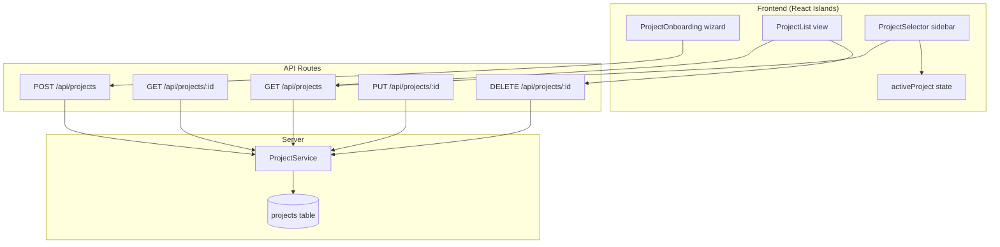
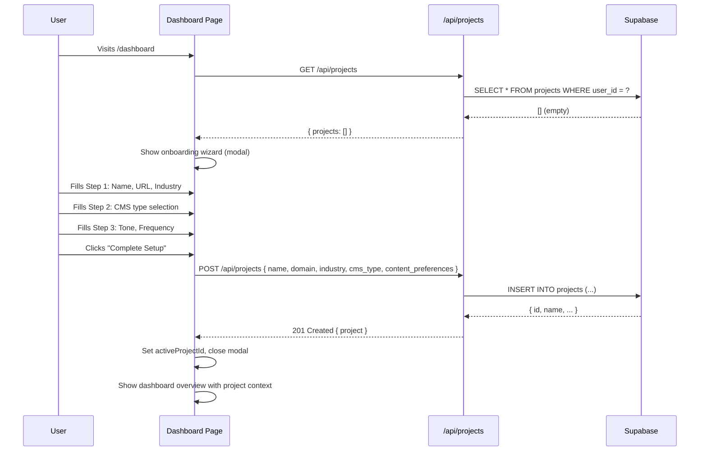
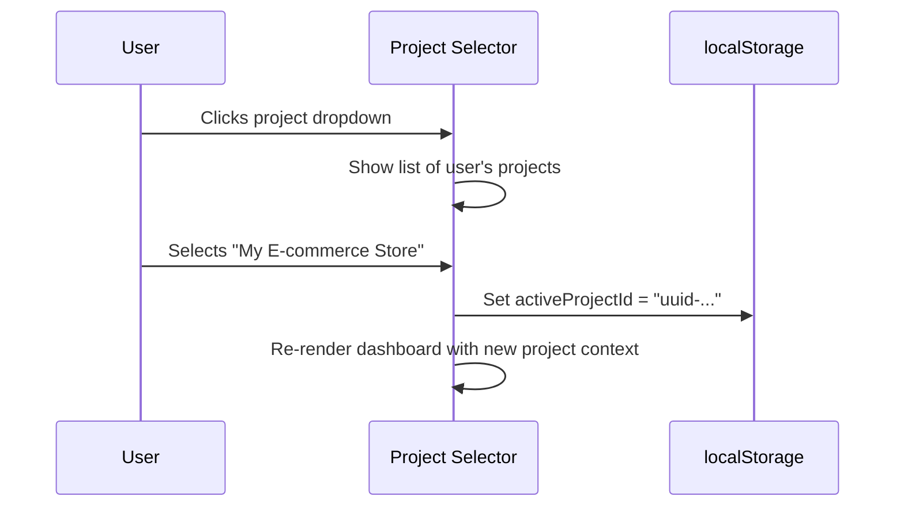

# PRD: Project Management — Register & Manage Websites

**Status:** Active
**Complexity:** 5 → MEDIUM mode
**Milestone:** M2 (first task — prerequisite for AI content generation)
**Author:** Claude (Principal Architect)
**Date:** 2026-02-05

---

## 1. Context

**Problem:** Users have no way to register their website/project in the system. The `projects` table exists in the database (from M1), but there's no UI or API to create, view, update, or delete projects. Without this, users can't tell the system what website they're generating content for — blocking the entire content generation pipeline.

**Dependency Chain:**

```
M1 Foundation (DB tables) ✅
    ↓
→ Project Management (THIS PRD) ← gap
    ↓
M2 AI Content Generation Engine (needs a project to generate for)
    ↓
M4 Campaign Management UI (campaigns belong to projects)
```

**Current State:**

- `projects` table exists with schema: `id`, `user_id`, `name`, `domain`, `cms_type`, `cms_credentials`, `status`, `created_at`, `updated_at`
- No API endpoints for projects
- No UI for project creation or management
- Dashboard pages exist as stubs (`.astro` files) but no React components for project flows
- `UI_TEMPLATE/components/dashboard/WebsiteOnboarding.tsx` exists as a UI reference

**Target State:**

- Users can create, view, edit, and delete projects
- First-time users see an onboarding wizard prompting them to create their first project
- Sidebar shows active project selector (switch between projects)
- Projects store: name, URL, industry/niche, CMS type, content preferences (tone, frequency)
- No CMS credential connection yet (comes in M6)

**Files Analyzed:**

| File                                                           | Purpose                                       |
| -------------------------------------------------------------- | --------------------------------------------- |
| `supabase/migrations/20260205100000_create_projects_table.sql` | Existing DB schema                            |
| `UI_TEMPLATE/components/dashboard/WebsiteOnboarding.tsx`       | UI reference for onboarding wizard            |
| `UI_TEMPLATE/components/Dashboard.tsx`                         | UI reference for sidebar project selector     |
| `src/pages/api/protected/example/index.ts`                     | API route pattern (auth, CRUD)                |
| `src/pages/dashboard/index.astro`                              | Dashboard page pattern (Astro + React island) |
| `server/middleware/getAuthenticatedUser.ts`                    | Auth middleware pattern                       |
| `docs/PRDs/dashboard-autopilotrank.md`                         | Dashboard stub PRD with color token mapping   |

---

## 2. Solution

**Approach:**

1. Add `industry` and `content_preferences` columns to `projects` table via migration (the existing schema is too bare for the onboarding flow)
2. Create a `ProjectService` in `server/services/` for all project DB operations
3. Create CRUD API endpoints at `/api/projects`
4. Build the project onboarding wizard (React island) — shown on first login or when user has no projects
5. Build a project list/management view in the dashboard
6. Add project selector to the dashboard sidebar
7. Store active project in client state (Zustand or localStorage)

**Architecture:**



**Key Decisions:**

- **No CMS connection yet.** The `cms_credentials` column stays empty. CMS type is collected for future use but not validated/tested. This comes in M6.
- **Industry stored as free text.** Use a select dropdown with common industries + "Other" option. Stored in a new `industry` column.
- **Content preferences stored as JSONB.** Tone, publishing frequency, and other preferences go in a new `content_preferences` JSONB column. This is more flexible than individual columns for preferences that will evolve.
- **Active project in localStorage.** No need for server-side active project tracking. The client stores `activeProjectId` in localStorage, and the selector reads from it.
- **Onboarding shown when no projects exist.** Check project count on dashboard load. If zero, show the onboarding wizard as a modal.

**DB Schema Changes:**

```sql
-- Add columns to existing projects table
ALTER TABLE public.projects
  ADD COLUMN industry TEXT,
  ADD COLUMN content_preferences JSONB DEFAULT '{}';
```

---

## 3. Sequence Flows

### First-Time User Onboarding



### Project Switching



---

## 4. Execution Phases

### Integration Points Checklist

```
How will this feature be reached?
- [x] Entry point: /dashboard (auto-detects zero projects → shows onboarding)
- [x] Entry point: Sidebar "Active Project" dropdown
- [x] Entry point: Settings page project management section (future)
- [x] Caller files: Dashboard layout checks project count on load

Is this user-facing?
- [x] YES → Onboarding wizard modal
- [x] YES → Project selector in sidebar
- [x] YES → Project list view (accessible from sidebar or settings)

Full user flow:
1. User signs up → lands on /dashboard
2. Dashboard fetches projects → finds zero → shows onboarding wizard
3. User completes 3-step wizard → project created
4. Dashboard shows overview scoped to that project
5. User can add more projects via "Add Project" button
6. User can switch projects via sidebar dropdown
7. User can edit/delete projects from a project management view
```

---

#### Phase 1: Database Migration — Add missing columns to `projects` table

**Files (1):**

- `supabase/migrations/20260205200000_add_project_details_columns.sql`

**Implementation:**

- [ ] Add `industry` column (TEXT, nullable) to `projects` table
- [ ] Add `content_preferences` column (JSONB DEFAULT '{}') to `projects` table
- [ ] No index needed on these columns (not queried by)

**SQL:**

```sql
ALTER TABLE public.projects
  ADD COLUMN IF NOT EXISTS industry TEXT,
  ADD COLUMN IF NOT EXISTS content_preferences JSONB DEFAULT '{}';

COMMENT ON COLUMN public.projects.industry IS 'Business industry/niche (e.g., tech, health, finance)';
COMMENT ON COLUMN public.projects.content_preferences IS 'Content generation preferences: { tone, frequency, targetWordCount }';
```

**Verification:**

```bash
npx supabase db push
# Migration applies without errors
```

---

#### Phase 2: ProjectService — Server-side service for project CRUD

**Files (2):**

- `server/services/project.service.ts` — Service with CRUD methods
- `server/services/__tests__/project.service.test.ts` — Unit tests

**Implementation:**

- [ ] Create `IProject` interface in `shared/types/project.types.ts`:

  ```typescript
  interface IProject {
    id: string;
    user_id: string;
    name: string;
    domain: string | null;
    industry: string | null;
    cms_type: 'wordpress' | 'webflow' | 'shopify' | 'other';
    cms_credentials: Record<string, unknown>;
    content_preferences: IContentPreferences;
    status: 'active' | 'inactive' | 'error';
    created_at: string;
    updated_at: string;
  }

  interface IContentPreferences {
    tone?: 'professional' | 'casual' | 'witty' | 'academic';
    frequency?: 'daily' | '3x_week' | 'weekly';
    targetWordCount?: number;
  }

  interface ICreateProjectInput {
    name: string;
    domain?: string;
    industry?: string;
    cms_type?: 'wordpress' | 'webflow' | 'shopify' | 'other';
    content_preferences?: IContentPreferences;
  }

  interface IUpdateProjectInput {
    name?: string;
    domain?: string;
    industry?: string;
    cms_type?: 'wordpress' | 'webflow' | 'shopify' | 'other';
    content_preferences?: IContentPreferences;
    status?: 'active' | 'inactive';
  }
  ```

- [ ] Create `ProjectService` class with methods:
  - `listByUser(userId: string): Promise<IProject[]>` — returns all projects for a user, ordered by `created_at DESC`
  - `getById(projectId: string, userId: string): Promise<IProject | null>` — returns single project (enforces ownership)
  - `create(userId: string, input: ICreateProjectInput): Promise<IProject>` — creates project with validation
  - `update(projectId: string, userId: string, input: IUpdateProjectInput): Promise<IProject>` — updates project (enforces ownership)
  - `delete(projectId: string, userId: string): Promise<void>` — soft or hard delete (hard delete for MVP)
  - `countByUser(userId: string): Promise<number>` — returns project count (used by onboarding check)

- [ ] Input validation using Zod:
  - `name`: required, 1-100 chars, trimmed
  - `domain`: optional, valid URL format if provided
  - `industry`: optional, max 50 chars
  - `cms_type`: must be one of the enum values
  - `content_preferences`: validate nested shape

- [ ] Plan-based project limits:
  - Starter: 1 project
  - Growth: 3 projects
  - Agency: unlimited
  - Free/trial: 1 project
  - Check limit on `create()`, throw `ProjectLimitError` if exceeded

- [ ] Unit tests:
  - List projects (returns user's projects only)
  - Create project (happy path)
  - Create project (validation errors: missing name, invalid URL)
  - Create project (limit exceeded)
  - Update project (happy path)
  - Update project (not found / not owned)
  - Delete project (happy path)
  - Delete project (not found / not owned)

**Verification:**

```bash
yarn test server/services/__tests__/project.service.test.ts
# All tests pass
```

---

#### Phase 3: API Routes — CRUD endpoints for projects

**Files (2):**

- `src/pages/api/projects/index.ts` — GET (list) + POST (create)
- `src/pages/api/projects/[projectId]/index.ts` — GET (single) + PUT (update) + DELETE

**Implementation:**

- [ ] `GET /api/projects` — List user's projects
  - Auth required (via middleware)
  - Returns `{ projects: IProject[] }`
  - 200 OK

- [ ] `POST /api/projects` — Create project
  - Auth required
  - Body: `ICreateProjectInput` (validated with Zod)
  - Returns `{ project: IProject }`
  - 201 Created
  - 400 Bad Request (validation error)
  - 403 Forbidden (project limit exceeded)

- [ ] `GET /api/projects/:projectId` — Get single project
  - Auth required
  - Returns `{ project: IProject }`
  - 404 Not Found

- [ ] `PUT /api/projects/:projectId` — Update project
  - Auth required
  - Body: `IUpdateProjectInput` (validated with Zod)
  - Returns `{ project: IProject }`
  - 404 Not Found

- [ ] `DELETE /api/projects/:projectId` — Delete project
  - Auth required
  - Returns `{ success: true }`
  - 404 Not Found
  - 409 Conflict (if project has active campaigns — warn user)

- [ ] Follow existing API patterns from `src/pages/api/protected/example/index.ts`
- [ ] Use `getAuthenticatedUser(request)` for auth
- [ ] Return proper JSON responses with `Content-Type: application/json`

**Verification:**

```bash
# Manual test with curl after dev server running
curl -H "Authorization: Bearer <token>" http://localhost:4321/api/projects
# Returns { projects: [] }

curl -X POST -H "Authorization: Bearer <token>" \
  -H "Content-Type: application/json" \
  -d '{"name":"My Blog","domain":"https://myblog.com","industry":"tech","cms_type":"wordpress"}' \
  http://localhost:4321/api/projects
# Returns { project: { id: "...", ... } }
```

---

#### Phase 4: Project Onboarding Wizard — React component for first project creation

**Files (2):**

- `client/components/projects/ProjectOnboarding.tsx` — 3-step wizard modal
- `client/components/projects/ProjectOnboarding.test.tsx` — Component tests

**Implementation:**

Based on `UI_TEMPLATE/components/dashboard/WebsiteOnboarding.tsx`, adapted to project conventions:

- [ ] **Step 1 — Basic Info:**
  - Project name (text input, required)
  - Domain URL (text input, optional, with URL validation hint)
  - Industry/niche dropdown: Technology & SaaS, Health & Wellness, Finance & Investing, E-commerce & Retail, Education, Lifestyle & Travel, Real Estate, Legal, Marketing & Agency, Other

- [ ] **Step 2 — Platform Selection:**
  - CMS type cards: WordPress, Webflow, Shopify, Other/None
  - Info note: "CMS connection will be configured later in Settings"
  - No credential fields (deferred to M6)

- [ ] **Step 3 — Content Preferences:**
  - Publishing frequency: Daily, 3x/Week, Weekly
  - Tone of voice: Professional & Authoritative, Casual & Friendly, Witty & Humorous, Academic & Technical
  - Confirmation note: "You can change these settings anytime"

- [ ] **Modal behavior:**
  - Full-screen overlay with backdrop blur
  - Progress bar (step X of 3)
  - Back/Next navigation
  - Submits to `POST /api/projects` on completion
  - Loading state during submission
  - Error handling (show toast on failure)
  - On success: closes modal, sets active project

- [ ] Use project's color tokens (not raw slate colors from UI_TEMPLATE):
  - Follow mapping from `docs/PRDs/dashboard-autopilotrank.md` section 4
  - Use `getTranslations()` for all user-facing strings

- [ ] Tests:
  - Renders step 1 by default
  - Navigates between steps
  - Validates required fields
  - Submits data to API
  - Shows loading state
  - Handles API errors

**Verification:**

```bash
yarn test client/components/projects/
# All tests pass
```

---

#### Phase 5: Project List & Selector — Dashboard integration

**Files (3):**

- `client/components/projects/ProjectList.tsx` — Project cards/list view
- `client/components/projects/ProjectSelector.tsx` — Sidebar dropdown for switching projects
- `client/hooks/useProjects.ts` — React Query hook for project data + active project state

**Implementation:**

- [ ] `useProjects` hook:
  - `useQuery('projects', fetchProjects)` — fetches `GET /api/projects`
  - `activeProjectId` from localStorage
  - `setActiveProject(id)` — stores in localStorage, triggers re-render
  - `activeProject` — derived from projects list + activeProjectId
  - Auto-select first project if none selected
  - `createProject` mutation
  - `updateProject` mutation
  - `deleteProject` mutation

- [ ] `ProjectSelector` component (sidebar):
  - Shows active project name + icon
  - Dropdown with all user projects
  - "Add New Project" button at bottom
  - Clicking a project switches active project
  - Based on UI_TEMPLATE Dashboard.tsx sidebar "Active Site" section

- [ ] `ProjectList` component:
  - Card grid showing all projects
  - Each card: name, domain, industry, CMS type badge, status badge
  - Edit button → inline edit or modal
  - Delete button → confirmation dialog
  - "Add New Project" card (dashed border, + icon)
  - Empty state: "No projects yet" with CTA to create one

- [ ] Dashboard integration:
  - Dashboard checks `projects.length === 0` on load → shows onboarding
  - Sidebar renders `ProjectSelector`
  - Dashboard overview scoped to active project (just visual for now — actual scoping comes with campaigns)

**Verification:**

```bash
yarn test client/components/projects/
yarn test client/hooks/
# All tests pass

yarn dev
# Visit /dashboard
# See project onboarding if no projects
# After creating: see project in sidebar selector
# Can switch between projects
```

---

#### Phase 6: Wiring & Polish — Connect everything, update dashboard page

**Files (2-3):**

- `src/pages/dashboard/index.astro` or `client/components/pages/DashboardPageClient.tsx` — Wire onboarding + selector
- `client/components/layouts/DashboardSidebar.tsx` (or equivalent) — Add ProjectSelector
- Update i18n locale files with new strings

**Implementation:**

- [ ] Dashboard page: check for projects on mount, show onboarding wizard if zero
- [ ] Add ProjectSelector to dashboard sidebar
- [ ] Add "Projects" link to sidebar navigation (or integrate into Settings)
- [ ] Add i18n strings for all project-related UI text
- [ ] Handle edge cases:
  - Project deleted while active → auto-select another or show onboarding
  - API errors → toast notifications
  - Loading states → skeleton loaders

**Verification:**

```bash
yarn verify
# Full verification pass — types, lint, tests all pass
```

---

## 5. Acceptance Criteria

- [ ] Users can create a project via 3-step onboarding wizard
- [ ] Users can view, edit, and delete their projects
- [ ] First-time users (no projects) see the onboarding wizard on dashboard
- [ ] Sidebar shows active project with dropdown to switch
- [ ] Plan limits enforced: Starter=1, Growth=3, Agency=unlimited
- [ ] API endpoints return proper error codes and messages
- [ ] Input validation on both client and server (Zod)
- [ ] All new code has unit tests
- [ ] `yarn verify` passes
- [ ] i18n strings added for all user-facing text

---

## 6. Out of Scope

- CMS credential connection and testing (M6 — WordPress Publishing)
- Site crawling or content analysis (post-MVP)
- Campaign creation from onboarding (M4 — Campaign Management UI)
- Project-level analytics or stats (post-MVP)
- Team/multi-user project sharing (Growth Phase — Team Accounts)
- Project import from external tools

---

## 7. Risk Mitigation

| Risk                                                  | Impact                          | Mitigation                                                             |
| ----------------------------------------------------- | ------------------------------- | ---------------------------------------------------------------------- |
| `projects` table missing new columns                  | Migration fails                 | Phase 1 uses `ADD COLUMN IF NOT EXISTS`                                |
| Plan limits not enforceable (no plan info in service) | Users create unlimited projects | Service reads user's subscription tier from profiles table             |
| Active project lost in localStorage                   | Confusing UX                    | Auto-select first project if stored ID not found                       |
| Onboarding wizard shown repeatedly                    | Annoying UX                     | Only show when `projects.length === 0`, not based on localStorage flag |

---

## 8. UI Reference

The `UI_TEMPLATE/` folder contains reference implementations. Key files:

| UI Template File          | Maps To                 | Notes                                                |
| ------------------------- | ----------------------- | ---------------------------------------------------- |
| `WebsiteOnboarding.tsx`   | `ProjectOnboarding.tsx` | 3-step wizard — adapt fields, remove CMS credentials |
| `Dashboard.tsx` (sidebar) | `ProjectSelector.tsx`   | "Active Site" dropdown section                       |
| `NewCampaignModal.tsx`    | N/A (future)            | Shows how modals are structured in the template      |

**Color Token Mapping** (from dashboard PRD):

| UI Template | Project Token    |
| ----------- | ---------------- |
| `slate-950` | `bg-main`        |
| `slate-900` | `bg-elevated`    |
| `slate-800` | `bg-surface`     |
| `brand-500` | `accent`         |
| `slate-400` | `text-secondary` |
| `slate-500` | `text-muted`     |

---

## Changelog

| Date       | Change              |
| ---------- | ------------------- |
| 2026-02-05 | Initial PRD created |
