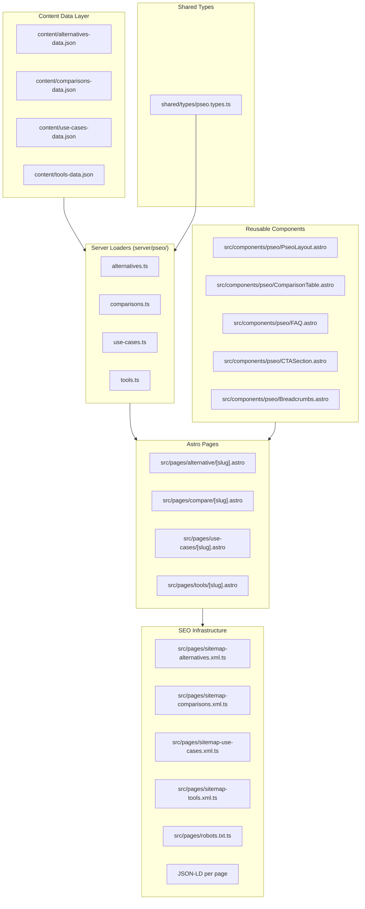

# PRD: Programmatic SEO (pSEO) System for AutopilotRank

**Complexity: 9 → HIGH mode** (+3 touches 10+ files, +2 new system from scratch, +2 multi-package changes, +1 database schema for content data, +1 external sitemap integration)

**Date:** 2026-02-13
**Status:** Draft
**Priority:** P0 — Primary organic traffic acquisition channel

---

## 1. Context

### Problem

AutopilotRank has zero programmatic SEO pages. Competitors like Outrank.so get 30%+ of traffic from comparison and alternative keywords, yet they don't even rank for their own category ("AI SEO content generator"). This is a massive greenfield opportunity — our SEO research confirms low competition, high CPC ($5-26), and stable demand for SEO-specific AI tools.

### Files Analyzed

- `src/pages/sitemap-blog.xml.ts` — Blog sitemap (pattern to replicate)
- `src/pages/sitemap-static.xml.ts` — Static sitemap (needs new pSEO entries)
- `src/pages/robots.txt.ts` — Robots.txt (needs new sitemap references)
- `src/layouts/Layout.astro` — Root layout with global JSON-LD
- `src/components/SEO.astro` — Reusable SEO metadata component
- `shared/utils/seo.ts` — SEO scoring utilities (reusable for free tools)
- `server/blog.ts` — Data-driven content loader (pattern to follow)
- `content/blog-data.json` — Content data pattern
- `shared/config/env.ts` — Environment variables (BASE_URL, APP_NAME)
- `src/pages/blog/[slug].astro` — Dynamic route with `prerender = true` + `getStaticPaths()`
- `src/pages/features.astro`, `pricing.astro`, `index.astro` — Meta tag patterns
- `docs/marketing/SEO/competitors/competition-analysis-seo.md` — Keyword strategy
- `docs/marketing/SEO/competitors/outrank.so-keywork-strategy.md` — Competitor positioning
- `docs/marketing/demand-research.md` — Market demand validation
- `astro.config.mjs` — Astro 5 SSR + Cloudflare Pages adapter

### Current Behavior

- Blog system is fully data-driven: JSON file → loader (`server/blog.ts`) → dynamic route (`blog/[slug].astro`)
- SEO.astro component exists for standardized meta tags but is underused (pages still use manual `<Fragment slot="head">`)
- Global JSON-LD covers WebSite + Organization only — no per-page schema
- Two sitemaps exist (blog + static) referenced in robots.txt
- All pages prerendered via `export const prerender = true` — Cloudflare-safe
- No pSEO routes, data files, type definitions, or metadata factories exist

### Integration Points Checklist

**How will this feature be reached?**
- [x] Entry points: Public URLs (`/alternative/[slug]`, `/compare/[slug]`, `/use-cases/[slug]`, `/tools/[slug]`)
- [x] Caller: Direct organic search traffic + internal links from homepage, blog, nav
- [x] Registration: New sitemap files referenced in robots.txt, internal links added to footer/nav

**Is this user-facing?**
- [x] YES — Public marketing pages visible to all visitors (no auth)

**Full user flow:**
1. User searches Google for "Outrank alternative" or "AI SEO content generator"
2. Google indexes our prerendered pSEO page
3. User lands on `/alternative/outrank` — sees comparison, features, CTA
4. CTA drives to `/pricing` or `/` signup flow
5. Internal links connect to related pSEO pages and blog posts

---

## 2. Solution

### Approach

1. **Follow the blog pattern exactly**: JSON data files → TypeScript loader functions → Astro dynamic routes with `prerender = true` + `getStaticPaths()`
2. **Five pSEO categories** launched in priority order: Alternatives → Comparisons → Use Cases → Free Tools → Feature Deep-dives
3. **Reusable component library**: Each category gets a dedicated Astro layout component with structured sections (hero, comparison table, features, FAQ, CTA)
4. **Per-page JSON-LD**: FAQPage, SoftwareApplication, and BreadcrumbList schemas on every pSEO page
5. **Category-specific sitemaps** following existing `sitemap-blog.xml.ts` pattern
6. **SEO.astro adoption**: All pSEO pages use the existing SEO component instead of manual meta tags

### Architecture Diagram



### Key Decisions

- **Static prerendering**: All pSEO pages use `prerender = true` — zero CPU cost at runtime on Cloudflare Workers
- **JSON data files over database**: Content lives in version-controlled JSON, not Supabase — enables build-time generation, easy editing, and no runtime DB calls
- **One loader file per category**: Mirrors `server/blog.ts` pattern — `server/pseo/alternatives.ts`, etc.
- **SEO.astro component**: Standardize all pSEO pages on the existing component instead of duplicating `<Fragment slot="head">` blocks
- **No React islands initially**: pSEO pages are pure Astro (static HTML) unless a page has interactive elements (free tools will need React islands)

### Data Changes

No database migrations needed. All content is stored in JSON files under `content/`.

---

## 3. Data Structures

### 3.1 Shared Types (`shared/types/pseo.types.ts`)

```typescript
/** Base fields shared by all pSEO page types */
export interface IPseoBase {
  slug: string;
  title: string;
  metaTitle: string;
  metaDescription: string;
  h1: string;
  primaryKeyword: string;
  secondaryKeywords: string[];
  lastUpdated: string; // ISO date
}

/** FAQ item used across all pSEO pages */
export interface IFaqItem {
  question: string;
  answer: string;
}

/** Feature comparison row */
export interface IFeatureRow {
  feature: string;
  us: string | boolean;
  them: string | boolean;
}

/** Alternative page data */
export interface IAlternativePage extends IPseoBase {
  competitorName: string;
  competitorSlug: string;
  competitorUrl: string;
  competitorPricing: string;
  competitorWeaknesses: string[];
  ourAdvantages: string[];
  featureComparison: IFeatureRow[];
  heroSubtitle: string;
  whySwitchReasons: string[];
  faqs: IFaqItem[];
  relatedAlternatives: string[]; // slugs
}

/** Comparison page data (us vs competitor) */
export interface IComparisonPage extends IPseoBase {
  competitorA: string; // Always "AutopilotRank"
  competitorB: string;
  competitorBSlug: string;
  competitorBUrl: string;
  verdict: string;
  featureComparison: IFeatureRow[];
  pricingComparison: {
    us: { plan: string; price: string; credits: string }[];
    them: { plan: string; price: string; credits: string }[];
  };
  prosConsUs: { pros: string[]; cons: string[] };
  prosConsThem: { pros: string[]; cons: string[] };
  faqs: IFaqItem[];
  relatedComparisons: string[]; // slugs
}

/** Use case page data */
export interface IUseCasePage extends IPseoBase {
  industry: string;
  painPoints: string[];
  solutionDescription: string;
  benefits: string[];
  howItWorks: { step: number; title: string; description: string }[];
  testimonial?: {
    quote: string;
    author: string;
    role: string;
    company: string;
  };
  faqs: IFaqItem[];
  relatedUseCases: string[]; // slugs
}

/** Free tool page data */
export interface IToolPage extends IPseoBase {
  toolName: string;
  toolDescription: string;
  /** React component name to hydrate (e.g., "KeywordDensityTool") */
  componentName: string;
  howToUse: string[];
  whyUseIt: string[];
  faqs: IFaqItem[];
  relatedTools: string[]; // slugs
}
```

### 3.2 Data File Structure

Each JSON file in `content/` follows this pattern:

```json
// content/alternatives-data.json
{
  "pages": [
    {
      "slug": "outrank",
      "title": "Best Outrank Alternative in 2026",
      "metaTitle": "Best Outrank Alternative — AutopilotRank (2026)",
      "metaDescription": "Looking for an Outrank alternative? AutopilotRank offers human-quality AI SEO content with full automation, CMS publishing, and pre-publication QA. Start free.",
      "h1": "The Best Outrank Alternative for AI SEO Content",
      "primaryKeyword": "Outrank alternative",
      "secondaryKeywords": ["outrank.so alternative", "outrank replacement", "AI SEO tool"],
      "lastUpdated": "2026-02-13",
      "competitorName": "Outrank",
      "competitorSlug": "outrank",
      "competitorUrl": "https://outrank.so",
      "competitorPricing": "$99/mo",
      "competitorWeaknesses": [
        "Generic AI content quality",
        "Known bugs and reliability issues",
        "Limited quality scoring"
      ],
      "ourAdvantages": [
        "Human-quality content with pre-publication QA",
        "Multi-model AI engine for best results",
        "Native CMS publishing (WordPress, Shopify, Webflow)",
        "Built-in content quality scoring"
      ],
      "featureComparison": [
        { "feature": "AI Content Generation", "us": true, "them": true },
        { "feature": "Pre-Publication QA", "us": true, "them": false },
        { "feature": "Multi-Model AI Engine", "us": true, "them": false },
        { "feature": "WordPress Publishing", "us": true, "them": true },
        { "feature": "Content Quality Scoring", "us": true, "them": false },
        { "feature": "Brand Voice Learning", "us": true, "them": false },
        { "feature": "Starting Price", "us": "$9/mo", "them": "$99/mo" }
      ],
      "heroSubtitle": "Human-quality AI SEO content without the bugs, at a fraction of the price.",
      "whySwitchReasons": [
        "Quality issues with Outrank's AI-generated content",
        "No pre-publication quality assurance",
        "Higher pricing with fewer features",
        "Limited CMS integration options"
      ],
      "faqs": [
        {
          "question": "How is AutopilotRank different from Outrank?",
          "answer": "AutopilotRank focuses on content quality with multi-model AI, pre-publication QA, and brand voice learning. Outrank prioritizes volume over quality."
        },
        {
          "question": "Can I migrate from Outrank to AutopilotRank?",
          "answer": "Yes. Simply connect your CMS to AutopilotRank and start generating higher-quality content immediately. No migration of existing content needed."
        }
      ],
      "relatedAlternatives": ["byword", "frase", "jasper"]
    }
  ]
}
```

---

## 4. Execution Phases

### Phase 1: Foundation — Types, Loaders, and First Alternative Page

**User-visible outcome:** `/alternative/outrank` is live with full SEO metadata, JSON-LD, and sitemap entry.

**Files (5):**
- `shared/types/pseo.types.ts` — All pSEO TypeScript interfaces
- `content/alternatives-data.json` — First 3 alternative pages (Outrank, Byword, Frase)
- `server/pseo/alternatives.ts` — Data loader (mirrors `server/blog.ts`)
- `src/pages/alternative/[slug].astro` — Dynamic route with `prerender = true`
- `src/components/pseo/ComparisonTable.astro` — Feature comparison table component

**Implementation:**

- [ ] Create `shared/types/pseo.types.ts` with all interfaces from Section 3.1
- [ ] Create `content/alternatives-data.json` with 3 seed pages: Outrank, Byword, Frase (data sourced from `docs/marketing/SEO/competitors/`)
- [ ] Create `server/pseo/alternatives.ts` with functions: `getAllAlternatives()`, `getAlternativeBySlug(slug)`, `getAllAlternativeSlugs()`
- [ ] Create `src/components/pseo/ComparisonTable.astro` — renders `IFeatureRow[]` as a styled table with check/cross icons
- [ ] Create `src/pages/alternative/[slug].astro`:
  - `export const prerender = true`
  - `getStaticPaths()` using `getAllAlternativeSlugs()`
  - Uses `Layout.astro` + `SEO.astro` component in head slot
  - Injects JSON-LD (SoftwareApplication + FAQPage + BreadcrumbList)
  - Sections: Hero → Why Switch → Feature Comparison Table → Our Advantages → FAQ → CTA
  - CTA links to `/pricing`
  - Internal links to related alternatives

**Verification Plan:**

1. **Unit Tests:**
   - File: `tests/unit/pseo/alternatives-loader.spec.ts`
   - `should return all alternative pages from data`
   - `should return null for unknown slug`
   - `should return correct page by slug`

2. **Build Verification:**
   ```bash
   yarn build 2>&1 | grep "alternative/"
   # Expected: Prerendered pages listed in build output
   ```

3. **Manual Verification:**
   - Visit `/alternative/outrank` — page renders with hero, comparison table, FAQ
   - View page source — JSON-LD structured data present
   - Meta tags correct in `<head>`

---

### Phase 2: Comparison Pages + Shared Components

**User-visible outcome:** `/compare/autopilotrank-vs-outrank` is live; shared pSEO components reusable across categories.

**Files (5):**
- `content/comparisons-data.json` — First 3 comparison pages
- `server/pseo/comparisons.ts` — Data loader
- `src/pages/compare/[slug].astro` — Dynamic comparison route
- `src/components/pseo/FAQ.astro` — Reusable FAQ section with FAQPage schema
- `src/components/pseo/CTASection.astro` — Reusable CTA block

**Implementation:**

- [ ] Create `content/comparisons-data.json` with 3 pages: autopilotrank-vs-outrank, autopilotrank-vs-byword, autopilotrank-vs-frase
- [ ] Create `server/pseo/comparisons.ts` with: `getAllComparisons()`, `getComparisonBySlug(slug)`, `getAllComparisonSlugs()`
- [ ] Create `src/components/pseo/FAQ.astro` — renders `IFaqItem[]` as accordion, injects FAQPage JSON-LD
- [ ] Create `src/components/pseo/CTASection.astro` — branded CTA with heading, subtext, primary + secondary buttons (links to `/pricing` and `/`)
- [ ] Create `src/pages/compare/[slug].astro`:
  - `prerender = true` + `getStaticPaths()`
  - Uses `SEO.astro` in head slot
  - Sections: Hero → Side-by-Side Comparison Table → Pros/Cons → Pricing Comparison → Verdict → FAQ → CTA
  - Internal links to alternative pages and related comparisons

**Verification Plan:**

1. **Unit Tests:**
   - File: `tests/unit/pseo/comparisons-loader.spec.ts`
   - `should return all comparison pages`
   - `should return correct page by slug`

2. **Build Verification:**
   ```bash
   yarn build 2>&1 | grep "compare/"
   ```

3. **Manual Verification:**
   - Visit `/compare/autopilotrank-vs-outrank` — side-by-side table renders
   - FAQ accordion works, JSON-LD includes FAQPage schema

---

### Phase 3: Sitemaps + Robots.txt + Internal Linking

**User-visible outcome:** All pSEO pages indexed by search engines; internal links from footer/nav.

**Files (5):**
- `src/pages/sitemap-alternatives.xml.ts` — Alternative pages sitemap
- `src/pages/sitemap-comparisons.xml.ts` — Comparison pages sitemap
- `src/pages/robots.txt.ts` — Add new sitemap references (edit existing)
- `src/pages/sitemap-static.xml.ts` — Add pSEO category index pages (edit existing)
- `src/components/pseo/Breadcrumbs.astro` — Breadcrumb component with BreadcrumbList JSON-LD

**Implementation:**

- [ ] Create `src/pages/sitemap-alternatives.xml.ts` following `sitemap-blog.xml.ts` pattern exactly
- [ ] Create `src/pages/sitemap-comparisons.xml.ts` same pattern
- [ ] Edit `src/pages/robots.txt.ts` — add `Sitemap: ${BASE_URL}/sitemap-alternatives.xml` and `Sitemap: ${BASE_URL}/sitemap-comparisons.xml`
- [ ] Edit `src/pages/sitemap-static.xml.ts` — add `/alternative` and `/compare` index paths (if we create listing pages)
- [ ] Create `src/components/pseo/Breadcrumbs.astro` — renders breadcrumb nav + BreadcrumbList JSON-LD schema
- [ ] Retrofit breadcrumbs into Phase 1 and Phase 2 pages

**Verification Plan:**

1. **Build + Fetch Verification:**
   ```bash
   yarn build
   curl http://localhost:4321/sitemap-alternatives.xml
   curl http://localhost:4321/robots.txt
   # Expected: XML with alternative page URLs; robots.txt references all sitemaps
   ```

2. **Manual Verification:**
   - Breadcrumbs render on all pSEO pages: Home > Alternatives > Outrank
   - All sitemaps accessible and valid XML

---

### Phase 4: Use Case Pages (Vertical Targeting)

**User-visible outcome:** `/use-cases/shopify-seo`, `/use-cases/saas-blog-automation`, `/use-cases/agency-white-label` are live.

**Files (4):**
- `content/use-cases-data.json` — 5-6 use case pages targeting verticals
- `server/pseo/use-cases.ts` — Data loader
- `src/pages/use-cases/[slug].astro` — Dynamic route
- `src/pages/sitemap-use-cases.xml.ts` — Use case sitemap

**Implementation:**

- [ ] Create `content/use-cases-data.json` with pages for:
  - `shopify-seo` — "AI SEO Content for Shopify Stores"
  - `saas-blog-automation` — "Automated Blog Content for SaaS"
  - `agency-white-label` — "White Label AI SEO for Agencies"
  - `ecommerce-product-descriptions` — "AI Product Descriptions for E-commerce"
  - `b2b-content-marketing` — "B2B Content Marketing Automation"
- [ ] Create `server/pseo/use-cases.ts` with loader functions
- [ ] Create `src/pages/use-cases/[slug].astro`:
  - Sections: Hero → Pain Points → How It Works (steps) → Benefits → Testimonial → FAQ → CTA
  - Uses existing shared components (FAQ, CTA, Breadcrumbs, ComparisonTable)
- [ ] Create `src/pages/sitemap-use-cases.xml.ts`
- [ ] Edit `src/pages/robots.txt.ts` — add use cases sitemap reference

**Verification Plan:**

1. **Unit Tests:**
   - File: `tests/unit/pseo/use-cases-loader.spec.ts`
   - Standard loader tests

2. **Manual Verification:**
   - Visit `/use-cases/shopify-seo` — industry-specific content renders
   - Internal links connect to alternative and comparison pages

---

### Phase 5: Free SEO Tools (Lead Magnets)

**User-visible outcome:** `/tools/keyword-density-checker` is live as an interactive React island; captures organic "free SEO tool" traffic.

**Files (5):**
- `content/tools-data.json` — Tool page metadata
- `server/pseo/tools.ts` — Data loader
- `src/pages/tools/[slug].astro` — Dynamic route with React island hydration
- `client/components/tools/KeywordDensityTool.tsx` — Interactive React tool component
- `src/pages/sitemap-tools.xml.ts` — Tools sitemap

**Implementation:**

- [ ] Create `content/tools-data.json` with first 3 tools:
  - `keyword-density-checker` — Uses existing `calculateKeywordDensity()` from `shared/utils/seo.ts`
  - `meta-description-validator` — Uses existing `checkMetaDescription()`
  - `title-tag-optimizer` — Uses existing `calculateTitleScore()`
- [ ] Create `server/pseo/tools.ts` with loader functions
- [ ] Create `client/components/tools/KeywordDensityTool.tsx`:
  - Text input area + keyword input
  - Calls `calculateKeywordDensity()` client-side (shared util works in browser)
  - Displays density %, recommendations, and score color
  - CTA: "Want AI to write SEO-optimized content automatically? Try AutopilotRank free."
- [ ] Create `src/pages/tools/[slug].astro`:
  - `prerender = true`
  - Renders static content (H1, description, how-to, FAQs) from data
  - Hydrates React island: `<KeywordDensityTool client:visible />`
  - JSON-LD: WebApplication schema
- [ ] Create `src/pages/sitemap-tools.xml.ts`
- [ ] Edit `src/pages/robots.txt.ts` — add tools sitemap

**Verification Plan:**

1. **Unit Tests:**
   - File: `tests/unit/pseo/tools-loader.spec.ts`
   - Loader tests
   - File: `tests/unit/tools/keyword-density-tool.spec.ts`
   - `should calculate density correctly for input text`
   - `should show warning for density > 3%`

2. **Manual Verification:**
   - Visit `/tools/keyword-density-checker` — input area works
   - Paste text + keyword → density calculated and displayed
   - CTA visible below tool

---

### Phase 6: Content Expansion + Internal Link Mesh

**User-visible outcome:** Full internal linking between all pSEO categories; 15+ total pages indexed.

**Files (4):**
- `content/alternatives-data.json` — Expand to 5-6 competitors (add Jasper, Surfer SEO, RankYak)
- `content/comparisons-data.json` — Expand to 5-6 comparisons
- `src/components/pseo/RelatedPages.astro` — "Related pages" grid component
- Footer/Nav — Add pSEO category links

**Implementation:**

- [ ] Expand `content/alternatives-data.json` with: Jasper, Surfer SEO, RankYak
- [ ] Expand `content/comparisons-data.json` with: autopilotrank-vs-jasper, autopilotrank-vs-surfer-seo, best-ai-seo-tools-2026
- [ ] Create `src/components/pseo/RelatedPages.astro` — card grid showing 3-4 related pages from any category
- [ ] Add pSEO links to footer navigation (Alternatives, Compare, Use Cases, Free Tools)
- [ ] Add internal links within existing pages: blog posts link to relevant pSEO pages, pSEO pages cross-link

**Verification Plan:**

1. **Build Verification:**
   ```bash
   yarn build
   # Verify 15+ pSEO pages in build output
   ```

2. **Manual Verification:**
   - Footer shows pSEO category links
   - Alternative pages link to comparisons and vice versa
   - RelatedPages component renders on all pSEO pages

---

## 5. Initial Content Inventory

### Alternatives (Phase 1 + 6)

| Slug | Primary Keyword | Priority |
|------|----------------|----------|
| `outrank` | "Outrank alternative" | P0 — #1 competitor |
| `byword` | "Byword alternative" | P0 — support/quality issues |
| `frase` | "Frase alternative" | P0 — manual workflow pain |
| `jasper` | "Jasper for SEO" | P1 — large user base |
| `surfer-seo` | "cheaper than Surfer SEO" | P1 — price-sensitive |
| `rankyak` | "RankYak vs Outrank" | P2 — emerging competitor |

### Comparisons (Phase 2 + 6)

| Slug | Primary Keyword |
|------|----------------|
| `autopilotrank-vs-outrank` | "AutopilotRank vs Outrank" |
| `autopilotrank-vs-byword` | "AutopilotRank vs Byword" |
| `autopilotrank-vs-frase` | "AutopilotRank vs Frase" |
| `autopilotrank-vs-jasper` | "AutopilotRank vs Jasper" |
| `autopilotrank-vs-surfer-seo` | "AutopilotRank vs Surfer SEO" |
| `best-ai-seo-tools-2026` | "Best AI SEO tools 2026" |

### Use Cases (Phase 4)

| Slug | Primary Keyword | Vertical |
|------|----------------|----------|
| `shopify-seo` | "AI SEO for Shopify" | E-commerce |
| `saas-blog-automation` | "AI blog writer for SaaS" | SaaS |
| `agency-white-label` | "white label AI content" | Agencies |
| `ecommerce-product-descriptions` | "AI product descriptions" | E-commerce |
| `b2b-content-marketing` | "B2B content automation" | SaaS |

### Free Tools (Phase 5)

| Slug | Tool | Existing Util |
|------|------|--------------|
| `keyword-density-checker` | Keyword Density Analyzer | `calculateKeywordDensity()` |
| `meta-description-validator` | Meta Description Checker | `checkMetaDescription()` |
| `title-tag-optimizer` | Title Tag Scorer | `calculateTitleScore()` |
| `heading-structure-analyzer` | Heading Hierarchy Checker | `analyzeHeadingStructure()` |
| `seo-score-checker` | Full SEO Score | `calculateOverallSEOScore()` |

---

## 6. JSON-LD Schema Strategy

Every pSEO page injects per-page structured data:

### Alternative + Comparison Pages

```json
[
  {
    "@context": "https://schema.org",
    "@type": "SoftwareApplication",
    "name": "AutopilotRank",
    "applicationCategory": "BusinessApplication",
    "operatingSystem": "Web",
    "offers": {
      "@type": "Offer",
      "price": "0",
      "priceCurrency": "USD"
    }
  },
  {
    "@context": "https://schema.org",
    "@type": "FAQPage",
    "mainEntity": [
      {
        "@type": "Question",
        "name": "...",
        "acceptedAnswer": { "@type": "Answer", "text": "..." }
      }
    ]
  },
  {
    "@context": "https://schema.org",
    "@type": "BreadcrumbList",
    "itemListElement": [
      { "@type": "ListItem", "position": 1, "name": "Home", "item": "https://..." },
      { "@type": "ListItem", "position": 2, "name": "Alternatives", "item": "https://..." },
      { "@type": "ListItem", "position": 3, "name": "Outrank Alternative" }
    ]
  }
]
```

### Free Tool Pages

```json
{
  "@context": "https://schema.org",
  "@type": "WebApplication",
  "name": "Keyword Density Checker",
  "applicationCategory": "UtilitiesApplication",
  "operatingSystem": "Web",
  "offers": { "@type": "Offer", "price": "0", "priceCurrency": "USD" }
}
```

---

## 7. File Summary

### New Files (by phase)

| Phase | File | Purpose |
|-------|------|---------|
| 1 | `shared/types/pseo.types.ts` | All pSEO TypeScript interfaces |
| 1 | `content/alternatives-data.json` | Alternative page data |
| 1 | `server/pseo/alternatives.ts` | Alternatives data loader |
| 1 | `src/pages/alternative/[slug].astro` | Alternative page route |
| 1 | `src/components/pseo/ComparisonTable.astro` | Feature comparison component |
| 2 | `content/comparisons-data.json` | Comparison page data |
| 2 | `server/pseo/comparisons.ts` | Comparisons data loader |
| 2 | `src/pages/compare/[slug].astro` | Comparison page route |
| 2 | `src/components/pseo/FAQ.astro` | FAQ accordion + schema |
| 2 | `src/components/pseo/CTASection.astro` | CTA block component |
| 3 | `src/pages/sitemap-alternatives.xml.ts` | Alternatives sitemap |
| 3 | `src/pages/sitemap-comparisons.xml.ts` | Comparisons sitemap |
| 3 | `src/components/pseo/Breadcrumbs.astro` | Breadcrumb nav + schema |
| 4 | `content/use-cases-data.json` | Use case page data |
| 4 | `server/pseo/use-cases.ts` | Use cases data loader |
| 4 | `src/pages/use-cases/[slug].astro` | Use case page route |
| 4 | `src/pages/sitemap-use-cases.xml.ts` | Use cases sitemap |
| 5 | `content/tools-data.json` | Tool page metadata |
| 5 | `server/pseo/tools.ts` | Tools data loader |
| 5 | `src/pages/tools/[slug].astro` | Tool page route |
| 5 | `client/components/tools/KeywordDensityTool.tsx` | Interactive tool component |
| 5 | `src/pages/sitemap-tools.xml.ts` | Tools sitemap |
| 6 | `src/components/pseo/RelatedPages.astro` | Related pages grid |

### Edited Files

| Phase | File | Change |
|-------|------|--------|
| 3 | `src/pages/robots.txt.ts` | Add 4 new sitemap references |
| 3 | `src/pages/sitemap-static.xml.ts` | Add pSEO category paths |
| 6 | Footer component | Add pSEO navigation links |

---

## 8. Acceptance Criteria

- [ ] All 6 phases complete
- [ ] All specified tests pass
- [ ] `yarn verify` passes
- [ ] All automated checkpoint reviews passed
- [ ] Every pSEO page has: valid meta tags via SEO.astro, JSON-LD (FAQPage + BreadcrumbList minimum), breadcrumbs, CTA to pricing, internal links to related pages
- [ ] All pSEO pages appear in sitemaps
- [ ] Robots.txt references all category sitemaps
- [ ] Build produces 15+ static pSEO pages
- [ ] No runtime CPU cost (all prerendered)
- [ ] Free tools work client-side using existing `shared/utils/seo.ts`
