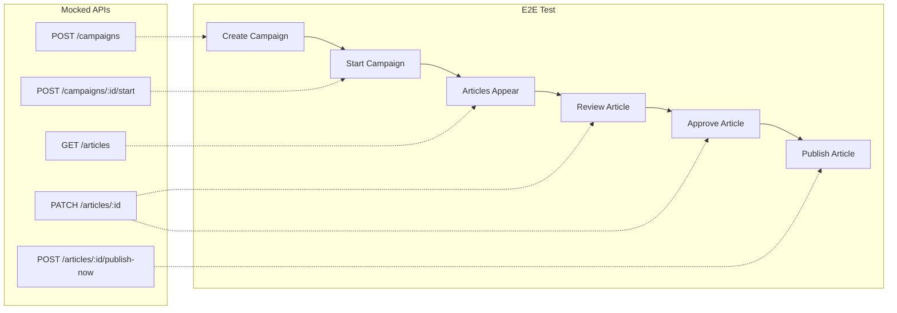
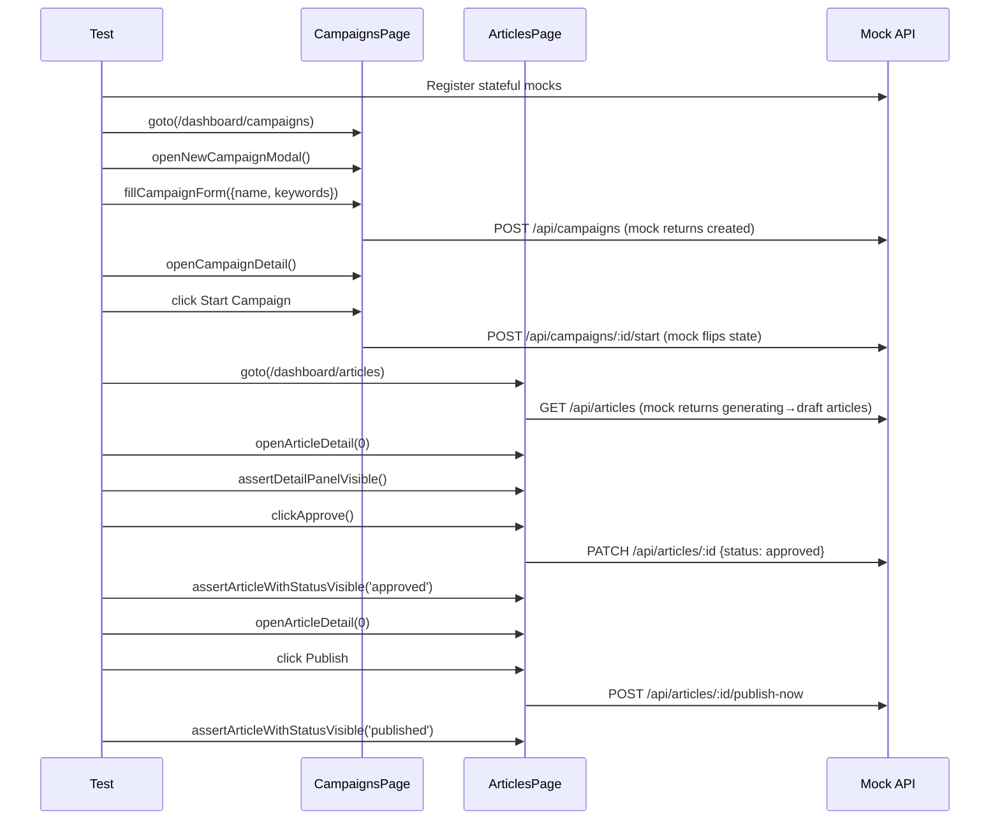

# PRD: E2E Launch Flow Testing

**Complexity: 5 → MEDIUM mode**

| Factor                                                   | Score |
| -------------------------------------------------------- | ----- |
| Touches 6-10 files                                       | +2    |
| Complex state logic (status machine, mock orchestration) | +2    |
| Database schema changes                                  | 0     |
| New system from scratch                                  | +1    |
| **Total**                                                | **5** |

---

## 1. Context

**Problem:** The full campaign launch flow (create campaign → start → generate articles → review → approve → publish) has never been formally E2E-tested as a connected chain. Individual steps are tested in isolation, but the critical user journey is unverified end-to-end.

**Files Analyzed:**

- `tests/e2e/campaigns.e2e.spec.ts` — campaign list, create modal, detail, schedule, keywords
- `tests/e2e/articles.e2e.spec.ts` — article list, filters, detail panel, regenerate, status actions
- `tests/pages/CampaignsPage.ts` — campaign page object (519 LOC)
- `tests/pages/ArticlesPage.ts` — articles page object (830 LOC)
- `tests/pages/BasePage.ts` — base page with common UI patterns
- `tests/test-fixtures.ts` — auth injection, default API mocks
- `src/pages/api/campaigns/[campaignId]/start.ts` — campaign start endpoint
- `src/pages/api/articles/[articleId]/index.ts` — article CRUD + status transitions
- `src/pages/api/articles/[articleId]/deliver.ts` — manual delivery trigger
- `src/pages/api/articles/[articleId]/publish-now.ts` — immediate publish to CMS
- `server/services/article-status-transitions.ts` — status state machine (198 LOC)
- `server/services/delivery.service.ts` — CMS publishing logic

**Current Behavior:**

- `campaigns.e2e.spec.ts` tests: list rendering, create modal multi-step, detail view, schedule actions, keyword management — **all in isolation with static mocks**
- `articles.e2e.spec.ts` tests: list rendering, filtering, detail panel, regenerate action, approve button visibility — **all in isolation with static mocks**
- No test chains campaign creation → article generation → review → publish as a user would experience it
- No test verifies article status transitions through the UI (generating → draft → approved → published)
- No test exercises the delivery/publish-now flow through the UI
- Existing API tests cover individual endpoints thoroughly but don't verify the frontend flow

**Gap Summary:**

| Flow Step                          | Unit/API Tested? |              E2E Tested?               |
| ---------------------------------- | :--------------: | :------------------------------------: |
| Create campaign                    |      API ✅      | UI partial (modal only, no submission) |
| Start campaign                     |      API ✅      |               Not tested               |
| Article appears in list            |      API ✅      |        Not tested (static mock)        |
| Article status transitions in UI   |      API ✅      |               Not tested               |
| Approve article                    |      API ✅      |          Button visible only           |
| Publish/deliver article            |      API ✅      |               Not tested               |
| Error recovery (regenerate failed) |      API ✅      |       Partial (regenerate only)        |

---

## 2. Solution

**Approach:**

- Create a single new E2E test file `tests/e2e/launch-flow.e2e.spec.ts` that tests the complete campaign → article → publish journey using **progressive mock state** (mocks that evolve as the user takes actions)
- Use existing page objects (`CampaignsPage`, `ArticlesPage`) — extend only if needed
- Mock APIs with stateful route handlers that simulate real backend transitions (e.g., campaign start → articles appear, approve → status changes)
- Test 4 core scenarios: happy path, multi-keyword batch, error recovery, and publish flow
- No backend changes needed — this is purely a test addition

**Architecture Diagram:**



**Key Decisions:**

- [x] Use progressive/stateful mocks (not static) to simulate real state transitions
- [x] Reuse existing `CampaignsPage` and `ArticlesPage` page objects
- [x] All mock data follows the `{ success: true, data: {...} }` envelope pattern
- [x] Tests are self-contained — each test.describe sets up its own mock state
- [x] No delivery to real CMS — mock the publish-now endpoint to return success

**Data Changes:** None (test-only)

---

## 3. Sequence Flow



---

## 4. Execution Phases

### Integration Points Checklist

```markdown
**How will this feature be reached?**

- [x] Entry point: `yarn test:e2e tests/e2e/launch-flow.e2e.spec.ts`
- [x] Caller: Playwright test runner
- [x] Registration: New test file auto-discovered by Playwright config

**Is this user-facing?**

- [x] NO → Test-only file, no production code changes

**Full user flow (what we're testing):**

1. User creates a campaign with keywords
2. User starts the campaign (triggers article generation)
3. User navigates to articles, sees generated articles
4. User opens article detail, approves it
5. User publishes the article to CMS
6. Article shows "published" status
```

---

### Phase 1: Stateful Mock Infrastructure + Happy Path Test

**User-visible outcome:** A single E2E test proves the complete create → start → review → approve flow works.

**Files (max 5):**

- `tests/e2e/launch-flow.e2e.spec.ts` — **new** — main test file with stateful mock helpers and happy path test

**Implementation:**

- [ ] Create `StatefulMockState` class that tracks campaign/article state across API calls
- [ ] Implement mock handlers for: `POST /api/campaigns` (create), `GET /api/campaigns` (list), `POST /api/campaigns/:id/start` (start), `GET /api/articles` (list with status tracking), `PATCH /api/articles/:id` (status transitions), `GET /api/articles/:id` (detail)
- [ ] Write `Happy Path: Create → Start → Review → Approve` test:
  1. Navigate to campaigns page
  2. Create campaign via modal (name + keywords)
  3. Open campaign detail, click "Start Campaign"
  4. Navigate to articles page
  5. Verify articles appear with "draft" status
  6. Open article detail, click "Approve"
  7. Verify article status changes to "approved"

**Tests Required:**

| Test File                           | Test Name                                                     | Assertion                                                 |
| ----------------------------------- | ------------------------------------------------------------- | --------------------------------------------------------- |
| `tests/e2e/launch-flow.e2e.spec.ts` | `should complete full create → start → review → approve flow` | Article ends in "approved" status; correct API calls made |

**Verification Plan:**

1. **Playwright E2E:** `yarn test:e2e tests/e2e/launch-flow.e2e.spec.ts`
2. **Evidence:** Test passes, all page transitions and status changes verified

---

### Phase 2: Publish Flow + Error Recovery Tests

**User-visible outcome:** Tests verify the publish-to-CMS flow and that failed articles can be retried.

**Files (max 5):**

- `tests/e2e/launch-flow.e2e.spec.ts` — add publish and error recovery test groups

**Implementation:**

- [ ] Add mock handler for `POST /api/articles/:id/publish-now` (returns success with published status)
- [ ] Write `Publish Flow: Approve → Publish` test:
  1. Start with articles in "approved" status (via mock state)
  2. Open article detail
  3. Click "Publish" / "Deliver" button
  4. Verify article transitions to "published" status
  5. Verify published badge appears in list
- [ ] Write `Error Recovery: Failed → Regenerate → Draft` test:
  1. Start with articles in "failed" status (via mock state)
  2. Open article detail, verify regenerate button visible
  3. Click regenerate, mock returns success
  4. Verify article transitions back to "generating" then "draft"
- [ ] Write `Multi-keyword Campaign` test:
  1. Create campaign with 3 keywords
  2. Start campaign
  3. Verify 3 articles appear in list
  4. Filter by campaign, verify only 3 shown

**Tests Required:**

| Test File                           | Test Name                                               | Assertion                                         |
| ----------------------------------- | ------------------------------------------------------- | ------------------------------------------------- |
| `tests/e2e/launch-flow.e2e.spec.ts` | `should publish approved article to CMS`                | Article status = "published", publish API called  |
| `tests/e2e/launch-flow.e2e.spec.ts` | `should recover failed article via regenerate`          | Article re-enters "draft" status after regenerate |
| `tests/e2e/launch-flow.e2e.spec.ts` | `should generate articles for all keywords in campaign` | 3 articles visible, all associated with campaign  |

**Verification Plan:**

1. **Playwright E2E:** `yarn test:e2e tests/e2e/launch-flow.e2e.spec.ts`
2. **Evidence:** All 4 tests pass (1 from phase 1 + 3 from phase 2)

---

### Phase 3: Edge Cases + Cross-Page Navigation

**User-visible outcome:** Tests verify edge cases (no integrations, status badge updates) and cross-page navigation between campaigns and articles.

**Files (max 5):**

- `tests/e2e/launch-flow.e2e.spec.ts` — add edge case and navigation tests

**Implementation:**

- [ ] Write `Publish without integrations` test:
  1. Start with approved article, mock publish-now returns NO_INTEGRATIONS error
  2. Click publish, verify error feedback shown to user
  3. Article remains in "approved" status
- [ ] Write `Cross-page navigation: Campaign detail → Articles filtered` test:
  1. Open campaign detail
  2. Click "View Articles" link (if exists) or navigate to articles page
  3. Verify articles are filtered by campaign
- [ ] Write `Status badge transitions in real-time` test:
  1. View article in list with "draft" status
  2. Approve article via detail panel
  3. Verify badge updates to "approved" without page reload
- [ ] Run `yarn verify` to ensure no regressions

**Tests Required:**

| Test File                           | Test Name                                                       | Assertion                                        |
| ----------------------------------- | --------------------------------------------------------------- | ------------------------------------------------ |
| `tests/e2e/launch-flow.e2e.spec.ts` | `should show error when publishing without integrations`        | Error feedback visible, article stays "approved" |
| `tests/e2e/launch-flow.e2e.spec.ts` | `should navigate between campaign detail and filtered articles` | Articles filtered by campaign ID                 |
| `tests/e2e/launch-flow.e2e.spec.ts` | `should update status badge in-place after approve`             | Badge text changes without full page reload      |

**Verification Plan:**

1. **Playwright E2E:** `yarn test:e2e tests/e2e/launch-flow.e2e.spec.ts`
2. **Evidence:** All 7 tests pass
3. **Full suite:** `yarn verify` passes

---

## 5. Checkpoint Protocol

After each phase, spawn the `prd-work-reviewer` agent:

```
Task({
  subagent_type: 'prd-work-reviewer',
  prompt: 'Review checkpoint for phase [N] of PRD at docs/PRDs/e2e-launch-flow-testing.md',
  description: 'Review phase N checkpoint'
})
```

**Phase 1:** Automated checkpoint only (test infrastructure + happy path)
**Phase 2:** Automated checkpoint only (publish + error recovery tests)
**Phase 3:** Automated checkpoint + manual verification (run full E2E suite, check no flaky tests)

---

## 6. Acceptance Criteria

- [ ] All 7 E2E tests pass consistently (`yarn test:e2e tests/e2e/launch-flow.e2e.spec.ts`)
- [ ] Tests use progressive/stateful mocks that simulate real user flows
- [ ] No production code changes needed
- [ ] Existing E2E tests unaffected (`yarn test:e2e` full suite passes)
- [ ] `yarn verify` passes
- [ ] Tests cover: create → start → generate → review → approve → publish chain
- [ ] Tests cover: error recovery (failed → regenerate → draft)
- [ ] Tests cover: edge case (publish without integrations)
