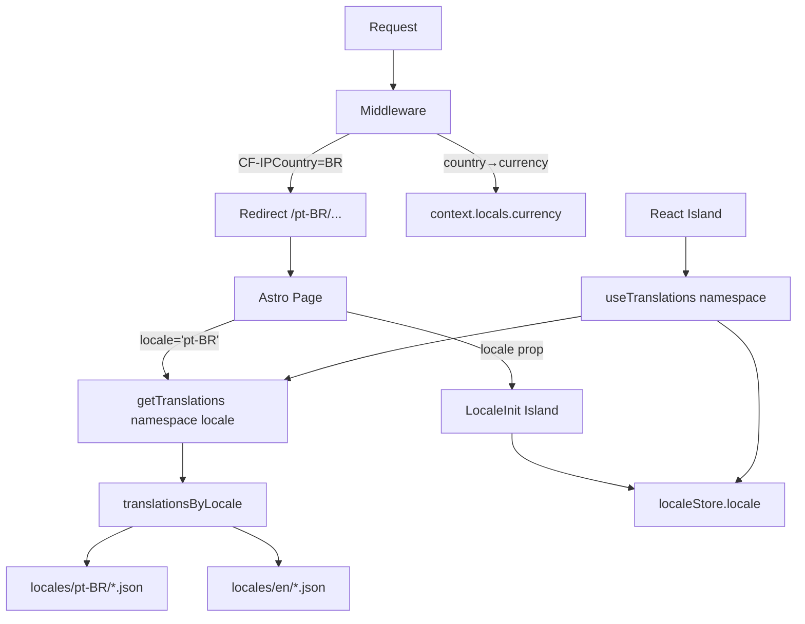
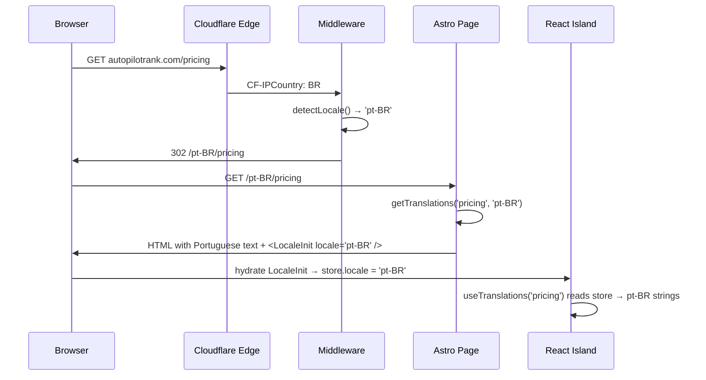

# PRD: i18n Geo Expansion

**Complexity: 9 → HIGH mode**
**Status:** Draft
**Date:** 2026-02-17

---

## 1. Context

### Problem

AutopilotRank currently serves all traffic in English only. Competitor geo-traffic analysis shows Brazil consistently drives 6–8% of traffic to competing AI SEO tools — **with zero Portuguese localization from any competitor**. Germany and France show growing demand from SE Ranking with no German/French UI. First-mover localization creates durable SEO moats competitors cannot easily replicate.

### Files Analyzed

- `i18n/config.ts` — locale config (currently `['en']` only)
- `src/i18n/config.ts` — Astro-side locale config (mirrors above)
- `astro.config.mjs` — Astro i18n routing config
- `shared/i18n/translations.ts` — static translation registry (all `en` imports)
- `client/hooks/useTranslations.ts` — React hook (locale-unaware)
- `client/components/i18n/LocaleSwitcher.tsx` — flag dropdown UI (en only)
- `src/middleware.ts` — locale detection + country → locale mapping
- `locales/en/*.json` — 19 translation namespaces

### Current Behavior

- Only `'en'` locale supported; all URLs are unprefixed
- `getTranslations(namespace)` has no locale parameter — always returns English
- `LocaleSwitcher` shows only one language (US flag)
- Middleware's `getLocaleFromCountry` maps only 8 English-speaking countries
- No multi-currency support — all prices display in USD
- Country-flag-icons already imports BR, DE, FR, ES, IT, JP flags (ready for use)

### Integration Points Checklist

**How will this feature be reached?**
- [x] Entry point: URL path prefix (`/pt-BR/pricing`), locale cookie, CF-IPCountry header
- [x] Caller file: `src/middleware.ts` (detects and redirects), Astro layouts (read locale)
- [x] Registration: `astro.config.mjs` locale list, `i18n/config.ts` SUPPORTED_LOCALES

**Is this user-facing?**
- [x] YES → LocaleSwitcher dropdown, localized page content, localized pricing

**Full user flow:**
1. Brazilian user visits `autopilotrank.com`
2. Cloudflare header `CF-IPCountry: BR` → middleware detects → redirects to `/pt-BR/`
3. Page renders with Portuguese translations from `locales/pt-BR/*.json`
4. React islands hydrate using locale from Zustand store (set by `LocaleInit` island)
5. LocaleSwitcher shows 🇧🇷 flag; user can switch to other languages

---

## 2. Solution

### Approach

1. **Locale-aware `getTranslations`**: Add optional `locale` parameter with `'en'` fallback. Build a locale registry: `translationsByLocale[locale][namespace]`.
2. **Zustand locale store**: Thin store holding active locale. `LocaleInit` island (injected by layout) initializes it from a prop. All `useTranslations` calls read locale automatically — zero prop drilling.
3. **Config cascade**: Single source of truth in `i18n/config.ts`; `astro.config.mjs` reads from it directly (already does via `SUPPORTED_LOCALES` constant).
4. **Translation files**: One directory per locale under `locales/{locale}/` mirroring the 19 `en` namespaces.
5. **Regional currency**: Separate from locale routing — detect from `CF-IPCountry`, format display only. No Stripe price changes needed.

### Architecture



### Key Decisions

- **Static imports**: All locale files bundled statically. Acceptable for Cloudflare Workers — no dynamic `import()` needed, no runtime I/O.
- **Backward compatibility**: `getTranslations(namespace)` still works without locale arg (defaults to `'en'`). Zero breaking changes to existing callers.
- **Currency ≠ Locale**: Country-based currency display is independent from locale/URL routing. India (en-IN) gets INR prices on the English site without needing an `en-IN` route.
- **Locale fallback**: Missing translation keys in non-EN locales fall back to `en` — prevents broken UI during partial translation rollouts.

### Data Changes

None — no database migrations required. Locale preference persists via 1-year cookie (already implemented).

---

## 3. Sequence Flow



---

## 4. Execution Phases

### Phase 1: i18n Infrastructure — Locale-aware translation system and routing

**Goal:** The app can serve multiple locales end-to-end. English continues to work exactly as before. pt-BR locale is registered but shows English fallback (until Phase 2 files are ready).

**Files (5):**

- `i18n/config.ts` — Add Tier 1 locales (`'pt-BR'`); add Tier 2 (`'de'`, `'fr'`) as commented stubs
- `astro.config.mjs` — Sync `SUPPORTED_LOCALES` array with config
- `shared/i18n/translations.ts` — Add `locale` param to `getTranslations`; build `translationsByLocale` registry
- `client/store/localeStore.ts` *(new)* — Zustand store with `locale` + `setLocale`
- `client/hooks/useTranslations.ts` — Read locale from store; pass to `getTranslations`

**Implementation:**

- [ ] `i18n/config.ts`:
  ```typescript
  export const SUPPORTED_LOCALES = ['en', 'pt-BR'] as const;
  export const locales = {
    en: { label: 'English', country: 'US' },
    'pt-BR': { label: 'Português', country: 'BR' },
  } as const satisfies Record<Locale, { label: string; country: string }>;
  ```

- [ ] `astro.config.mjs` — Replace hardcoded `['en']` with import from config:
  ```javascript
  import { SUPPORTED_LOCALES, DEFAULT_LOCALE } from './i18n/config';
  // i18n: { defaultLocale: DEFAULT_LOCALE, locales: [...SUPPORTED_LOCALES] }
  ```

- [ ] `shared/i18n/translations.ts` — Add locale registry:
  ```typescript
  // Import pt-BR files (stubs initially, replaced in Phase 2)
  // Build: const translationsByLocale: Record<Locale, Registry> = { en: {...}, 'pt-BR': {...} }
  // Update getTranslations(namespace, locale = 'en') to use registry with en fallback
  ```

- [ ] `client/store/localeStore.ts`:
  ```typescript
  import { create } from 'zustand';
  import { DEFAULT_LOCALE, type Locale } from '../../i18n/config';
  type LocaleStore = { locale: Locale; setLocale: (l: Locale) => void };
  export const useLocaleStore = create<LocaleStore>(set => ({
    locale: DEFAULT_LOCALE,
    setLocale: locale => set({ locale }),
  }));
  ```

- [ ] `client/hooks/useTranslations.ts`:
  ```typescript
  export function useTranslations(namespace: string): TFunction {
    const locale = useLocaleStore(s => s.locale);
    return useMemo(() => getTranslations(namespace, locale), [namespace, locale]);
  }
  ```

- [ ] Create `client/components/i18n/LocaleInit.tsx`:
  ```typescript
  'use client';
  // Receives locale prop from Astro layout, stores in Zustand
  // Also reads cookie as fallback for CSR navigation
  export function LocaleInit({ locale }: { locale: Locale }): null {
    const setLocale = useLocaleStore(s => s.setLocale);
    useEffect(() => { setLocale(locale); }, [locale]);
    return null;
  }
  ```

- [ ] Update main Astro layout (`src/layouts/Layout.astro` or similar) to inject `<LocaleInit locale={locale} client:load />` where `locale` comes from `Astro.currentLocale` or middleware

- [ ] Update `src/middleware.ts` `getLocaleFromCountry`:
  ```typescript
  const countryMap: Record<string, Locale> = {
    US: 'en', GB: 'en', CA: 'en', AU: 'en', NZ: 'en', IE: 'en', ZA: 'en', IN: 'en',
    BR: 'pt-BR',
    // Phase 4: DE: 'de', FR: 'fr', AT: 'de', CH: 'de',
  };
  ```

- [ ] Update `src/i18n/config.ts` to mirror `i18n/config.ts` (they're currently duplicated — keep in sync or re-export from one)

**Tests Required:**

| Test File | Test Name | Assertion |
|-----------|-----------|-----------|
| `tests/unit/i18n/translations.spec.ts` | `should return pt-BR string when locale is pt-BR` | Translated key returned |
| `tests/unit/i18n/translations.spec.ts` | `should fall back to en when pt-BR key missing` | English string returned |
| `tests/unit/i18n/translations.spec.ts` | `should work without locale arg (backward compat)` | English string returned |
| `tests/unit/store/localeStore.spec.ts` | `should initialize with DEFAULT_LOCALE` | `store.locale === 'en'` |
| `tests/unit/store/localeStore.spec.ts` | `should update locale on setLocale call` | `store.locale === 'pt-BR'` |
| `tests/e2e/i18n/locale-routing.spec.ts` | `should redirect BR visitor to /pt-BR/` | URL contains `/pt-BR/` |
| `tests/e2e/i18n/locale-routing.spec.ts` | `should serve en without prefix` | URL has no locale prefix |

**Verification Plan:**

1. **Unit tests** for `getTranslations` backward compat and locale fallback
2. **API proof** (middleware test):
   ```bash
   curl -H "CF-IPCountry: BR" http://localhost:3000/ -v
   # Expected: 302 Location: /pt-BR/
   curl -H "CF-IPCountry: US" http://localhost:3000/ -v
   # Expected: 200 (no redirect)
   ```
3. **Playwright**: Visit with `x-test-country: BR` header → assert URL is `/pt-BR/`
4. **yarn verify** must pass

---

### Phase 2: pt-BR Translation Files — Full Brazilian Portuguese UI

**Goal:** Every UI string visible to a Brazilian user is in Portuguese. LocaleSwitcher shows 🇧🇷 and allows switching.

**Files (5 at a time — split into 2 sub-phases internally, but one checkpoint):**

- `locales/pt-BR/common.json`, `nav.json`, `auth.json`, `errors.json`, `modal.json`
- `locales/pt-BR/homepage.json`, `pricing.json`, `checkout.json`, `subscription.json`, `stripe.json`
- `locales/pt-BR/dashboard.json`, `blog.json`, `admin.json`, `help.json`, `settings.json`
- `locales/pt-BR/privacy.json`, `terms.json`, `howItWorks.json`, `i18n.json`
- `shared/i18n/translations.ts` — Register all pt-BR imports
- `client/components/i18n/LocaleSwitcher.tsx` — Show 🇧🇷 option

**Implementation:**

- [ ] Create `locales/pt-BR/` directory with 19 JSON files. Each file mirrors the exact key structure of its `en` counterpart with Brazilian Portuguese values.
  - Use AI-assisted translation for initial draft; human review for marketing copy (homepage, pricing)
  - Key files needing highest quality: `homepage.json`, `pricing.json`, `nav.json`, `common.json`
  - Technical/admin files (`admin.json`, `settings.json`) can use mechanical translation

- [ ] `i18n.json` for pt-BR must include locale names in Portuguese:
  ```json
  { "switcher": { "ariaLabel": "Selecionar idioma" },
    "locales": { "en": "Inglês", "pt-BR": "Português (Brasil)" } }
  ```

- [ ] `shared/i18n/translations.ts`:
  ```typescript
  import ptBRCommon from '@locales/pt-BR/common.json';
  // ... all 19 pt-BR imports
  const translationsByLocale = {
    en: { common: enCommon, ... },
    'pt-BR': { common: ptBRCommon, ... },
  };
  ```

- [ ] `LocaleSwitcher.tsx` — already has `BR` flag imported. `SUPPORTED_LOCALES` now includes `'pt-BR'` so the dropdown will show it automatically (no code change needed if it maps locales from config).

**Tests Required:**

| Test File | Test Name | Assertion |
|-----------|-----------|-----------|
| `tests/unit/i18n/pt-br.spec.ts` | `should have all en namespaces in pt-BR` | All 19 namespaces present |
| `tests/unit/i18n/pt-br.spec.ts` | `should have all keys from en in pt-BR` | No missing keys |
| `tests/e2e/i18n/pt-br.spec.ts` | `should display Portuguese nav on /pt-BR/` | Nav text is Portuguese |
| `tests/e2e/i18n/pt-br.spec.ts` | `should display Portuguese pricing page` | Key strings in Portuguese |
| `tests/e2e/i18n/locale-switcher.spec.ts` | `should show BR flag in switcher` | 🇧🇷 flag visible |
| `tests/e2e/i18n/locale-switcher.spec.ts` | `should switch from en to pt-BR` | Page reloads with `/pt-BR/` |

**Key translations reference (homepage.json):**
```
SEO tool for AI → Ferramenta SEO com IA
Generate SEO content automatically → Criar conteúdo SEO automaticamente
Best AI blog tool → Melhor ferramenta de blog IA
```

**Verification:**
- Visit `/pt-BR/` — all visible text must be in Portuguese
- Visit `/pt-BR/pricing` — pricing page in Portuguese
- LocaleSwitcher dropdown: shows EN + PT flags
- Switch from PT to EN → redirects to `/`

---

### Phase 3: Regional Currency Display — Show prices in local currency

**Goal:** Users from India see INR prices, UK sees GBP, Brazil sees BRL, etc. No Stripe price changes — this is display only. Currency detected from `CF-IPCountry` header.

**Files (4):**

- `shared/utils/currency.ts` *(new)* — `formatCurrency(amountUSD, displayCurrency, exchangeRate)` + `getCurrencyForCountry(countryCode)`
- `shared/config/regional-pricing.ts` *(new)* — Country → `{ currency, symbol, approximateRate }` map with static exchange rates (updated manually quarterly)
- `src/middleware.ts` — Set `context.locals.currency` from CF-IPCountry
- Pricing Astro page (`src/pages/pricing.astro` or equivalent) — Read `locals.currency`, pass to pricing components

**Implementation:**

- [ ] `shared/config/regional-pricing.ts`:
  ```typescript
  export type RegionalCurrency = {
    code: string; // 'BRL', 'INR', 'GBP', 'EUR', 'AUD'
    symbol: string; // 'R$', '₹', '£', '€', 'A$'
    approximateRate: number; // vs USD (static, updated quarterly)
    displayNote: string; // "Approximate price in BRL. Charged in USD."
  };
  export const COUNTRY_CURRENCY_MAP: Record<string, RegionalCurrency> = {
    BR: { code: 'BRL', symbol: 'R$', approximateRate: 5.75, displayNote: '...' },
    IN: { code: 'INR', symbol: '₹', approximateRate: 84, displayNote: '...' },
    GB: { code: 'GBP', symbol: '£', approximateRate: 0.79, displayNote: '...' },
    DE: { code: 'EUR', symbol: '€', approximateRate: 0.92, displayNote: '...' },
    FR: { code: 'EUR', symbol: '€', approximateRate: 0.92, displayNote: '...' },
    AU: { code: 'AUD', symbol: 'A$', approximateRate: 1.55, displayNote: '...' },
    PH: { code: 'PHP', symbol: '₱', approximateRate: 57, displayNote: '...' },
    PK: { code: 'PKR', symbol: '₨', approximateRate: 278, displayNote: '...' },
    ID: { code: 'IDR', symbol: 'Rp', approximateRate: 16000, displayNote: '...' },
  };
  ```

- [ ] `shared/utils/currency.ts`:
  ```typescript
  export function convertAndFormat(usdCents: number, currency: RegionalCurrency): string {
    const localAmount = (usdCents / 100) * currency.approximateRate;
    return new Intl.NumberFormat('default', {
      style: 'currency', currency: currency.code, maximumFractionDigits: 0
    }).format(localAmount);
  }
  ```

- [ ] `src/middleware.ts` — Add to `context.locals`:
  ```typescript
  const country = request.headers.get('CF-IPCountry') || '';
  context.locals.currency = COUNTRY_CURRENCY_MAP[country] || null;
  ```

- [ ] Pricing page — Show dual pricing when `locals.currency` is set:
  ```
  $49/mo
  ≈ R$ 282/mês (approx. — charged in USD)
  ```

- [ ] Must update `App.locals` type declaration with `currency` field

**Tests Required:**

| Test File | Test Name | Assertion |
|-----------|-----------|-----------|
| `tests/unit/utils/currency.spec.ts` | `should convert USD to BRL correctly` | `$49 → R$ 281` |
| `tests/unit/utils/currency.spec.ts` | `should return null for unmapped country` | `null` returned |
| `tests/e2e/i18n/currency.spec.ts` | `should show INR pricing for India visitor` | `₹` symbol visible on pricing page |
| `tests/e2e/i18n/currency.spec.ts` | `should show USD only for US visitor` | No secondary currency |

**Verification:**
```bash
curl -H "CF-IPCountry: IN" http://localhost:3000/pricing
# Expected: page contains "₹" symbol with disclaimer
curl -H "CF-IPCountry: US" http://localhost:3000/pricing
# Expected: page shows USD only
```

---

### Phase 4: de (German) + fr (French) — Tier 2 Full Localization

**Goal:** German and French speakers get fully localized UI. `/de/` and `/fr/` routes work.

**Files (5 + 5 JSON batches, split across two sub-phases):**

- `i18n/config.ts` — Add `'de'` and `'fr'` to `SUPPORTED_LOCALES`
- `locales/de/*.json` — 19 German translation files
- `locales/fr/*.json` — 19 French translation files
- `shared/i18n/translations.ts` — Register de + fr imports
- `src/middleware.ts` — Add `DE: 'de'`, `AT: 'de'`, `CH: 'de'`, `FR: 'fr'`, `BE: 'fr'`

**Implementation:**

- [ ] Config update:
  ```typescript
  export const SUPPORTED_LOCALES = ['en', 'pt-BR', 'de', 'fr'] as const;
  export const locales = {
    en: { label: 'English', country: 'US' },
    'pt-BR': { label: 'Português', country: 'BR' },
    de: { label: 'Deutsch', country: 'DE' },
    fr: { label: 'Français', country: 'FR' },
  } as const;
  ```

- [ ] Create `locales/de/` and `locales/fr/` directories with 19 JSON files each
  - Priority order: `nav.json`, `common.json`, `homepage.json`, `pricing.json`, `auth.json` first
  - Key phrases:
    - DE: "KI-SEO-Tool", "Inhalte automatisch erstellen", "Bestes KI-Blog-Tool"
    - FR: "Outil SEO IA", "Créer du contenu SEO automatiquement", "Meilleur outil de blog IA"

- [ ] `i18n.json` for each locale must list all language names in that language

- [ ] Follow same pattern as pt-BR for translation registry registration

**Tests Required:**

Same pattern as Phase 2, but for de and fr locales.

| Test File | Test Name | Assertion |
|-----------|-----------|-----------|
| `tests/unit/i18n/de.spec.ts` | `should have all keys from en in de` | No missing keys |
| `tests/unit/i18n/fr.spec.ts` | `should have all keys from en in fr` | No missing keys |
| `tests/e2e/i18n/de.spec.ts` | `should display German nav on /de/` | Nav text in German |
| `tests/e2e/i18n/fr.spec.ts` | `should display French pricing on /fr/pricing` | Pricing in French |
| `tests/e2e/i18n/locale-switcher.spec.ts` | `should show DE and FR flags in switcher` | All 4 flags visible |

---

### Phase 5: SEO — Hreflang + Locale-aware Sitemap

**Goal:** Search engines discover all locale variants; correct `hreflang` alternate links prevent duplicate content penalties.

**Files (3):**

- Astro base layout — Add `<link rel="alternate" hreflang="..." href="..." />` tags for every supported locale
- `src/pages/sitemap.xml.ts` (or sitemap generation) — Include all locale URL variants
- `public/robots.txt` — Ensure sitemap URL is included

**Implementation:**

- [ ] In base layout `<head>`:
  ```astro
  {SUPPORTED_LOCALES.map(loc => {
    const prefix = loc === DEFAULT_LOCALE ? '' : `/${loc}`;
    return <link rel="alternate" hreflang={loc} href={`${site}${prefix}${pathWithoutLocale}`} />;
  })}
  <link rel="alternate" hreflang="x-default" href={`${site}${pathWithoutLocale}`} />
  ```

- [ ] Sitemap: Generate one entry per locale per page
  ```
  /            (en, x-default)
  /pt-BR/      (pt-BR)
  /de/         (de)
  /fr/         (fr)
  /pricing     (en)
  /pt-BR/pricing (pt-BR)
  ...
  ```

**Tests Required:**

| Test File | Test Name | Assertion |
|-----------|-----------|-----------|
| `tests/e2e/seo/hreflang.spec.ts` | `should have hreflang tags for all locales on homepage` | 5 alternate links present |
| `tests/e2e/seo/hreflang.spec.ts` | `should have x-default hreflang` | `hreflang="x-default"` present |
| `tests/unit/seo/sitemap.spec.ts` | `should include pt-BR URLs in sitemap` | `/pt-BR/` entries exist |

---

### Phase 6: Tier 3 — Indonesian (id-ID)

**Goal:** `/id/` route with full Indonesian UI for the 270M-person market.

**Files (same pattern as Phase 4):**

- `i18n/config.ts` — Add `'id'`
- `locales/id/*.json` — 19 Indonesian translation files
- `shared/i18n/translations.ts` — Register id imports
- `src/middleware.ts` — Add `ID: 'id'`

**Priority:** Lower than Phase 4. Implement when Phase 4 is live and performance metrics confirm value.

---

## 5. Checkpoint Protocol

After each phase, spawn `prd-work-reviewer` agent:

```
Task({
  subagent_type: 'prd-work-reviewer',
  prompt: 'Review checkpoint for phase [N] of PRD at docs/PRDs/i18n-geo-expansion.md',
  description: 'Review phase N checkpoint'
})
```

**Manual checkpoint required for Phases 2, 4, 6** (visual language verification):
- Navigate to locale URL, visually confirm page text is in the correct language
- Confirm LocaleSwitcher shows correct flags
- Confirm no English text leaks in translated pages

---

## 6. Acceptance Criteria

- [ ] Phase 1: `yarn verify` passes, middleware redirects BR → `/pt-BR/`, en unchanged
- [ ] Phase 2: `/pt-BR/` serves full Portuguese UI, no English keys visible, LocaleSwitcher works
- [ ] Phase 3: India visitors see INR prices, UK sees GBP (with USD clarification note)
- [ ] Phase 4: `/de/` and `/fr/` serve German/French UI
- [ ] Phase 5: Hreflang tags present, sitemap includes all locale variants
- [ ] Phase 6: `/id/` serves Indonesian UI
- [ ] All automated checkpoints passed
- [ ] `yarn verify` passes after each phase
- [ ] `getTranslations(namespace)` (no locale arg) still returns English — zero regression

---

## 7. Prioritized Delivery Roadmap

| Timeline | Phase | Locales | Type |
|----------|-------|---------|------|
| Day 1 | 1 | Infrastructure | Core |
| Day 1–3 | 2 | pt-BR | Full translation |
| Day 3–5 | 3 | Regional pricing (IN, GB, AU, PH, PK) | Display only |
| Month 1 | 4 | de, fr | Full translation |
| Month 1 | 5 | SEO hreflang | Technical SEO |
| Month 2–3 | 6 | id | Full translation |

---

## 8. Out of Scope (This PRD)

- Blog content translation (separate content operation)
- Country-specific landing pages (e.g., `/india/` marketing page)
- Customer case studies per market
- RTL language support (Arabic, Hebrew)
- Automated translation pipeline / i18n management platform (Lokalise, Phrase)
- Currency exchange rate live sync (static rates updated quarterly manually)
- Stripe multi-currency pricing (separate pricing strategy decision)
- en-ES (Spanish Spain) — low signal in competitor data
