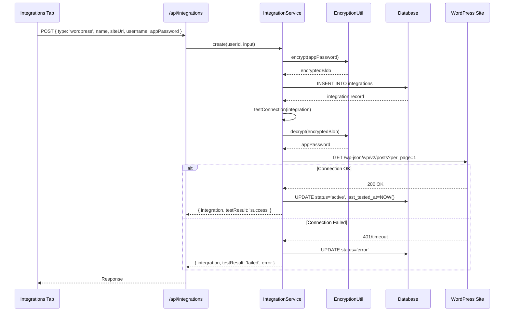
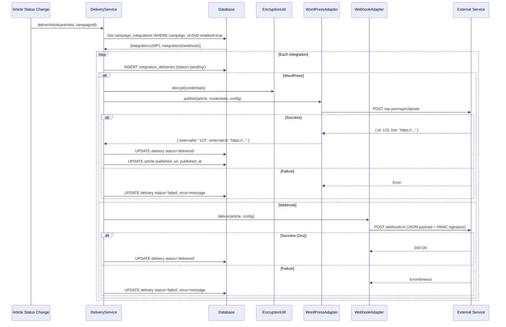

# PRD: Campaign Integrations (WordPress + Webhook)

**Complexity: 8 → HIGH mode**

- 10+ files touched (DB migration, types, services, API routes, UI components, hooks)
- New system from scratch (integration adapters, encryption, delivery tracking)
- Database schema changes (2 new tables)
- External API integration (WordPress REST API)

---

## 1. Context

**Problem:** After generating articles, users have no way to publish them to their WordPress sites or trigger external workflows. Everything stays in the dashboard — users must manually copy content.

**Files Analyzed:**
- `shared/types/campaign.types.ts` - Campaign interfaces, `settings` JSONB unused
- `shared/types/article.types.ts` - Article interfaces, `published_url`/`published_at` exist but unused
- `server/services/campaign.service.ts` - Campaign CRUD, bulk generation orchestration
- `server/services/article-generation.service.ts` - Article generation pipeline
- `src/pages/api/articles/[articleId]/index.ts` - Article PATCH (status changes including approval)
- `client/config/dashboardRoutes.ts` - Dashboard route config (single source of truth)
- `docs/technical/systems/cms-integration.md` - Planned architecture (not implemented)
- `supabase/migrations/` - 47 existing migrations
- `.env.api` / `shared/config/env.ts` - Environment variable patterns

**Current Behavior:**
- Articles are generated and stored in DB with status `draft`
- Users can approve/reject articles via PATCH `/api/articles/:id`
- `published_url` and `published_at` fields exist on articles but are never set
- `campaigns.settings` JSONB field exists but is always `{}`
- No CMS adapter code exists; CMS docs are "planned" only
- No outbound webhook system exists

---

## 2. Solution

**Approach:**
- Create a dedicated **Integrations** tab in the dashboard sidebar where users create and manage connections (WordPress sites, webhook URLs)
- Integrations are **global to the user** (created once), then **assigned to campaigns** (many-to-many)
- Each campaign has an **auto_publish** toggle: when ON, articles are sent to assigned integrations immediately after generation completes; when OFF (default), articles are sent only when manually approved
- Delivery is tracked per-article per-integration in an `integration_deliveries` table
- Failed deliveries can be retried from the UI
- Credentials (WP passwords, webhook secrets) are **AES-256 encrypted** at rest

**Architecture:**

```mermaid
flowchart LR
    subgraph Dashboard
      IT[Integrations Tab] -->|CRUD| API[/api/integrations]
      CD[Campaign Detail] -->|assign integrations| CAPI[/api/campaigns/:id]
    end
    subgraph Server
      API --> IS[IntegrationService]
      IS --> DB[(integrations table)]
      IS --> CRYPTO[EncryptionUtil]
      ART[Article Approved/Generated] -->|trigger| DS[DeliveryService]
      DS -->|WordPress| WPA[WordPressAdapter]
      DS -->|Webhook| WHA[WebhookAdapter]
      DS --> DDB[(integration_deliveries)]
    end
    WPA -->|REST API| WP[WordPress Site]
    WHA -->|POST| EXT[External URL]
```

**Key Decisions:**
- **AES-256-GCM encryption** for credentials using `CMS_ENCRYPTION_KEY` env var (already planned in docs)
- **Adapter pattern** with `ICMSAdapter` interface: `testConnection()`, `publish()` — extensible for future platforms
- **Delivery triggered in `ctx.waitUntil()`** after article status changes (same pattern as article generation)
- **No retry queue** for V1 — failed deliveries are marked `failed` and user retries manually from UI
- Reuse existing `campaigns.settings` JSONB for `auto_publish` flag (avoids migration for a column)

**Data Changes:**

### New Tables

#### `integrations`
| Column | Type | Description |
|--------|------|-------------|
| `id` | UUID PK | |
| `user_id` | UUID FK→profiles | Owner |
| `type` | TEXT | `'wordpress'` or `'webhook'` |
| `name` | TEXT | User-friendly label (e.g., "My Blog") |
| `config` | JSONB | Type-specific config (site_url, username for WP; url, secret for webhook) |
| `encrypted_credentials` | TEXT | AES-256-GCM encrypted credentials blob |
| `status` | TEXT | `'active'` / `'error'` / `'disabled'` |
| `last_tested_at` | TIMESTAMPTZ | Last successful connection test |
| `created_at` | TIMESTAMPTZ | |
| `updated_at` | TIMESTAMPTZ | |

RLS: `user_id = auth.uid()`

#### `campaign_integrations` (junction table)
| Column | Type | Description |
|--------|------|-------------|
| `id` | UUID PK | |
| `campaign_id` | UUID FK→campaigns ON DELETE CASCADE | |
| `integration_id` | UUID FK→integrations ON DELETE CASCADE | |
| `enabled` | BOOLEAN DEFAULT true | Can disable without removing |
| `created_at` | TIMESTAMPTZ | |

UNIQUE constraint on `(campaign_id, integration_id)`

#### `integration_deliveries`
| Column | Type | Description |
|--------|------|-------------|
| `id` | UUID PK | |
| `article_id` | UUID FK→articles ON DELETE CASCADE | |
| `integration_id` | UUID FK→integrations ON DELETE CASCADE | |
| `campaign_id` | UUID FK→campaigns ON DELETE SET NULL | |
| `status` | TEXT | `'pending'` / `'delivering'` / `'delivered'` / `'failed'` |
| `external_id` | TEXT | WordPress post ID or webhook response ID |
| `external_url` | TEXT | Published URL on WordPress |
| `error` | TEXT | Error message if failed |
| `attempt_count` | INTEGER DEFAULT 0 | Number of delivery attempts |
| `delivered_at` | TIMESTAMPTZ | |
| `created_at` | TIMESTAMPTZ | |

RLS: via article ownership (`articles.user_id = auth.uid()`)

---

## 3. Sequence Flow

### Integration Creation (WordPress)



### Article Delivery Flow (on approval or auto-publish)



---

## 4. Integration Points Checklist

```
How will this feature be reached?
- [x] Entry point: New "Integrations" tab in sidebar → /dashboard/integrations
- [x] Caller files: DashboardRouter (routing), DashboardSidebar (nav link)
- [x] Registration: Add route to DASHBOARD_ROUTES in dashboardRoutes.ts

Is this user-facing?
- [x] YES → IntegrationsView (list/create/edit/delete), CampaignDetailView (assign integrations), ArticleDetailView (delivery status)

Full user flow:
1. User navigates to Integrations tab → sees empty state or list of integrations
2. User clicks "Add Integration" → modal with type selection (WordPress/Webhook)
3. User fills credentials → system tests connection → saves
4. User goes to Campaign Detail → assigns integrations from dropdown
5. User toggles auto_publish ON/OFF per campaign
6. Articles get delivered when approved (or auto after generation if auto_publish=ON)
7. User sees delivery status on article detail (delivered/failed/retry button)
```

---

## 5. Execution Phases

### Phase 1: Database Schema + Encryption Utility

**User-visible outcome:** Database tables ready, encryption utility tested.

**Files (4):**
- `supabase/migrations/20260210100000_create_integrations_tables.sql` - New tables + RLS
- `shared/types/integration.types.ts` - TypeScript interfaces
- `server/utils/encryption.ts` - AES-256-GCM encrypt/decrypt utility
- `shared/config/env.ts` - Add `CMS_ENCRYPTION_KEY` to server env schema

**Implementation:**
- [ ] Create migration with `integrations`, `campaign_integrations`, `integration_deliveries` tables
- [ ] Add RLS policies: integrations owned by user, deliveries accessible via article ownership
- [ ] Create `IIntegration`, `ICampaignIntegration`, `IIntegrationDelivery` interfaces
- [ ] Create integration type discriminated unions for config: `IWordPressConfig`, `IWebhookConfig`
- [ ] Implement `encrypt(plaintext, key)` and `decrypt(ciphertext, key)` using Web Crypto API (Cloudflare Workers compatible — no Node.js `crypto`)
- [ ] Add `CMS_ENCRYPTION_KEY` to `serverEnvSchema` in env config

**Tests:**
| Test File | Test Name | Assertion |
|-----------|-----------|-----------|
| `tests/unit/utils/encryption.unit.spec.ts` | `should encrypt and decrypt roundtrip` | `expect(decrypt(encrypt(text))).toBe(text)` |
| `tests/unit/utils/encryption.unit.spec.ts` | `should produce different ciphertext for same plaintext (random IV)` | `expect(encrypt(text)).not.toBe(encrypt(text))` |
| `tests/unit/utils/encryption.unit.spec.ts` | `should fail with wrong key` | `expect(() => decrypt(blob, wrongKey)).toThrow()` |

**Verification Plan:**
1. **Unit Tests:** encryption roundtrip, random IV, wrong key rejection
2. **Migration:** `npx supabase migration list` shows new migration applied
3. **Evidence:** `yarn test tests/unit/utils/encryption` passes, `yarn verify` passes

---

### Phase 2: Integration Service + Adapters

**User-visible outcome:** Backend can create integrations, test connections, and publish articles to WordPress/webhooks.

**Files (5):**
- `server/services/integration.service.ts` - CRUD + delivery orchestration
- `server/integrations/adapter.interface.ts` - `ICMSAdapter` interface
- `server/integrations/wordpress.adapter.ts` - WordPress REST API adapter
- `server/integrations/webhook.adapter.ts` - Generic webhook adapter (HMAC signed)
- `server/integrations/delivery.service.ts` - Delivery orchestration (find integrations, dispatch, track)

**Implementation:**
- [ ] `ICMSAdapter` interface: `testConnection(): Promise<ITestResult>`, `publish(article, config): Promise<IPublishResult>`
- [ ] `IntegrationService`: create, update, delete, list, getById, testConnection (all with encryption)
- [ ] `WordPressAdapter`: POST to `/wp-json/wp/v2/posts` with Basic Auth (Application Password), convert markdown→HTML, handle media upload for featured image
- [ ] `WebhookAdapter`: POST full article JSON payload, HMAC-SHA256 signature in `X-Signature-256` header using webhook secret
- [ ] `DeliveryService`: `deliverArticle(articleId, campaignId)` — find enabled integrations, create delivery records, dispatch to adapters, update status

**Tests:**
| Test File | Test Name | Assertion |
|-----------|-----------|-----------|
| `tests/unit/integrations/wordpress.adapter.unit.spec.ts` | `should format article as WordPress post payload` | Correct title, content (HTML), status, slug |
| `tests/unit/integrations/wordpress.adapter.unit.spec.ts` | `should use Basic Auth header` | `Authorization: Basic base64(user:pass)` |
| `tests/unit/integrations/webhook.adapter.unit.spec.ts` | `should include HMAC signature header` | Valid `X-Signature-256` header |
| `tests/unit/integrations/webhook.adapter.unit.spec.ts` | `should send full article JSON` | Payload contains title, content, slug, meta |
| `tests/unit/integrations/delivery.service.unit.spec.ts` | `should create delivery records for each enabled integration` | `integration_deliveries` count matches |
| `tests/unit/integrations/delivery.service.unit.spec.ts` | `should mark delivery failed on adapter error` | `status='failed'`, `error` populated |

**Verification Plan:**
1. **Unit Tests:** Adapter payload formatting, auth headers, HMAC signing, delivery tracking
2. **Evidence:** `yarn test tests/unit/integrations` passes, `yarn verify` passes

---

### Phase 3: API Routes

**User-visible outcome:** Full REST API for managing integrations and triggering deliveries.

**Files (5):**
- `src/pages/api/integrations/index.ts` - GET (list) + POST (create)
- `src/pages/api/integrations/[integrationId]/index.ts` - GET + PUT + DELETE
- `src/pages/api/integrations/[integrationId]/test.ts` - POST (test connection)
- `src/pages/api/campaigns/[campaignId]/integrations.ts` - GET + PUT (assign/unassign integrations)
- `src/pages/api/articles/[articleId]/deliver.ts` - POST (manual deliver/retry)

**Implementation:**
- [ ] `GET /api/integrations` — list user's integrations (never return decrypted credentials)
- [ ] `POST /api/integrations` — validate input with Zod, encrypt credentials, create, auto-test connection
- [ ] `GET /api/integrations/:id` — single integration detail (without credentials)
- [ ] `PUT /api/integrations/:id` — update name/config, re-encrypt if credentials changed
- [ ] `DELETE /api/integrations/:id` — soft check for active campaigns, then delete
- [ ] `POST /api/integrations/:id/test` — decrypt credentials, test connection, update status
- [ ] `GET /api/campaigns/:id/integrations` — list assigned integrations for a campaign
- [ ] `PUT /api/campaigns/:id/integrations` — set assigned integration IDs + auto_publish setting
- [ ] `POST /api/articles/:id/deliver` — manually trigger delivery (or retry failed)

**Tests:**
| Test File | Test Name | Assertion |
|-----------|-----------|-----------|
| `tests/unit/api/integrations.unit.spec.ts` | `should reject creation without required fields` | 400 with validation errors |
| `tests/unit/api/integrations.unit.spec.ts` | `should never return encrypted_credentials in GET` | Field absent from response |
| `tests/unit/api/integrations.unit.spec.ts` | `should require auth for all endpoints` | 401 without token |

**Verification Plan:**
1. **Unit Tests:** Input validation, auth checks, credential sanitization
2. **curl Proof:**
```bash
# Create WordPress integration
curl -X POST /api/integrations \
  -H "Authorization: Bearer $TOKEN" \
  -H "Content-Type: application/json" \
  -d '{"type":"wordpress","name":"My Blog","siteUrl":"https://blog.example.com","username":"admin","appPassword":"xxxx-xxxx-xxxx"}' | jq .
# Expected: {"success":true,"data":{"integration":{...},"testResult":"success"}}

# Assign integrations to campaign
curl -X PUT /api/campaigns/$CAMPAIGN_ID/integrations \
  -H "Authorization: Bearer $TOKEN" \
  -H "Content-Type: application/json" \
  -d '{"integrationIds":["uuid1"],"autoPublish":false}' | jq .
```
3. **Evidence:** `yarn test`, `yarn verify` passes

---

### Phase 4: Article Delivery Trigger (Hook into existing flow)

**User-visible outcome:** Articles are automatically delivered to integrations when approved (or generated, if auto_publish is ON).

**Files (3):**
- `src/pages/api/articles/[articleId]/index.ts` - Hook delivery trigger into PATCH (on status→'approved')
- `server/services/article-generation.service.ts` - Hook delivery trigger after generation completes (when auto_publish=ON)
- `server/integrations/delivery.service.ts` - Add `shouldAutoDeliver(campaignId)` helper

**Implementation:**
- [ ] In article PATCH handler: when `status` changes to `'approved'`, call `DeliveryService.deliverArticle()` via `ctx.waitUntil()`
- [ ] In `article-generation.service.ts`: after article status set to `'draft'`, check `campaign.settings.auto_publish`; if true, call `DeliveryService.deliverArticle()` via `ctx.waitUntil()`
- [ ] `shouldAutoDeliver()`: query campaign settings for `auto_publish` flag, return boolean
- [ ] Update article's `published_url` and `published_at` on first successful WordPress delivery

**Tests:**
| Test File | Test Name | Assertion |
|-----------|-----------|-----------|
| `tests/unit/integrations/delivery-trigger.unit.spec.ts` | `should trigger delivery on article approval` | DeliveryService called with correct articleId |
| `tests/unit/integrations/delivery-trigger.unit.spec.ts` | `should auto-deliver when campaign has auto_publish=true` | DeliveryService called after generation |
| `tests/unit/integrations/delivery-trigger.unit.spec.ts` | `should NOT deliver when campaign has no integrations` | DeliveryService not called |

**Verification Plan:**
1. **Unit Tests:** Trigger conditions verified
2. **Integration Test:** Create campaign with integration → start generation → verify delivery record created
3. **Evidence:** `yarn test`, `yarn verify` passes

---

### Phase 5: Integrations Dashboard Tab (UI)

**User-visible outcome:** Users can create, view, edit, test, and delete integrations from a dedicated dashboard tab.

**Files (5):**
- `client/config/dashboardRoutes.ts` - Add Integrations route
- `client/components/pages/IntegrationsPageClient.tsx` - Page wrapper
- `client/components/dashboard/views/IntegrationsView.tsx` - Main list view
- `client/components/dashboard/views/integrations/IntegrationFormModal.tsx` - Create/edit modal
- `client/hooks/useIntegrations.ts` - React Query hooks for integration CRUD

**Implementation:**
- [ ] Add `Plug` icon from lucide-react, new route at `/dashboard/integrations`, `enabled: true`, `group: 'primary'` (after Campaigns)
- [ ] `IntegrationsView`: empty state, list of integration cards (name, type icon, status badge, last tested, connected campaigns count)
- [ ] Each card: "Test" button (test connection), "Edit" button (open modal), "Delete" button (confirm dialog)
- [ ] `IntegrationFormModal`: step 1 = select type (WordPress/Webhook), step 2 = fill credentials, auto-test on save
- [ ] WordPress form: Site URL, Username, Application Password (with link to WP docs on how to create one)
- [ ] Webhook form: URL, Secret (optional), description
- [ ] `useIntegrations` hook: `useQuery` for list, `useMutation` for create/update/delete/test
- [ ] Add `sidebar.integrations` to i18n translation files

**Tests:**
| Test File | Test Name | Assertion |
|-----------|-----------|-----------|
| `tests/unit/components/IntegrationsView.unit.spec.tsx` | `should render empty state when no integrations` | Shows "Add your first integration" CTA |
| `tests/unit/components/IntegrationsView.unit.spec.tsx` | `should render integration cards` | Cards display name, type, status |
| `tests/unit/hooks/useIntegrations.unit.spec.ts` | `should fetch integrations list` | React Query returns data |

**Verification Plan:**
1. **Unit Tests:** Component renders, empty state, card display
2. **Playwright:** Navigate to /dashboard/integrations → see empty state → click Add → fill form → see new integration in list
3. **Evidence:** `yarn test`, `yarn verify` passes

---

### Phase 6: Campaign Integration Assignment UI

**User-visible outcome:** Users can assign integrations to campaigns and toggle auto-publish from the campaign detail view.

**Files (4):**
- `client/components/dashboard/views/CampaignDetailView.tsx` - Add integrations section
- `client/components/dashboard/views/campaign-detail/CampaignIntegrationsSection.tsx` - Integrations assignment UI
- `client/hooks/useCampaignDetail.ts` - Add integration assignment mutation
- `client/hooks/useCampaigns.ts` - Update campaign mutation to include auto_publish

**Implementation:**
- [ ] New section in CampaignDetailView: "Integrations" card below existing settings
- [ ] Show assigned integrations as chips/tags with remove button
- [ ] "Add Integration" dropdown showing user's available integrations (from useIntegrations)
- [ ] Auto-publish toggle switch with explanation text: "When enabled, articles are automatically sent to integrations after generation. When disabled, articles are sent only when you manually approve them."
- [ ] Save assigns via `PUT /api/campaigns/:id/integrations`
- [ ] Show delivery status per article in the campaign's article list (icon: delivered/failed/pending)

**Tests:**
| Test File | Test Name | Assertion |
|-----------|-----------|-----------|
| `tests/unit/components/CampaignIntegrationsSection.unit.spec.tsx` | `should show assigned integrations` | Integration chips rendered |
| `tests/unit/components/CampaignIntegrationsSection.unit.spec.tsx` | `should toggle auto_publish` | Toggle calls mutation |

**Verification Plan:**
1. **Unit Tests:** Component renders assigned integrations, toggle works
2. **Playwright:** Go to campaign detail → assign integration → toggle auto-publish → verify saved
3. **Evidence:** `yarn test`, `yarn verify` passes

---

### Phase 7: Article Delivery Status UI + Retry

**User-visible outcome:** Users can see delivery status on articles and retry failed deliveries.

**Files (4):**
- `client/components/dashboard/views/ArticleDetailView.tsx` or equivalent - Add delivery status section
- `client/components/dashboard/views/articles/DeliveryStatusCard.tsx` - Delivery status per integration
- `client/hooks/useArticleDeliveries.ts` - React Query hook for delivery status + retry mutation
- `src/pages/api/articles/[articleId]/deliveries.ts` - GET delivery status for an article

**Implementation:**
- [ ] `GET /api/articles/:id/deliveries` — return delivery records with integration name/type
- [ ] `DeliveryStatusCard`: show each integration delivery as a row (integration name, status badge, external URL link, error message, retry button)
- [ ] Retry button calls `POST /api/articles/:id/deliver` (already built in Phase 3)
- [ ] When delivered to WordPress, show "View on WordPress" link using `external_url`
- [ ] Add delivery status indicator (small icon) to article rows in campaign detail and articles list views

**Tests:**
| Test File | Test Name | Assertion |
|-----------|-----------|-----------|
| `tests/unit/components/DeliveryStatusCard.unit.spec.tsx` | `should show delivered status with external link` | Link rendered with correct URL |
| `tests/unit/components/DeliveryStatusCard.unit.spec.tsx` | `should show retry button for failed deliveries` | Button visible and clickable |

**Verification Plan:**
1. **Unit Tests:** Card renders delivery statuses, retry button visible for failures
2. **Playwright:** Approve article → see delivery status → if failed, retry → verify status update
3. **Evidence:** `yarn test`, `yarn verify` passes

---

## 6. Acceptance Criteria

- [ ] All 7 phases complete with automated checkpoint reviews passed
- [ ] All unit tests pass (`yarn test`)
- [ ] `yarn verify` passes
- [ ] Users can create WordPress and Webhook integrations from the Integrations tab
- [ ] Users can test integration connections (success/failure feedback)
- [ ] Users can assign integrations to campaigns
- [ ] Users can toggle auto_publish per campaign
- [ ] Articles are delivered to WordPress when approved (creates WP post, returns URL)
- [ ] Articles are delivered to webhook URL when approved (full JSON payload, HMAC signed)
- [ ] Auto-publish delivers immediately after generation when enabled
- [ ] Failed deliveries show error and retry button
- [ ] Credentials are AES-256-GCM encrypted at rest
- [ ] No credentials are ever returned in API GET responses
- [ ] Feature is reachable via sidebar navigation
- [ ] i18n translation keys added for English

---

## Appendix: WordPress Payload Format

```json
{
  "title": "Article Title",
  "content": "<p>HTML content converted from markdown...</p>",
  "status": "draft",
  "slug": "article-slug",
  "excerpt": "Meta description as excerpt"
}
```

WordPress articles are published as **draft** by default so users can review formatting on their site before making them public.

## Appendix: Webhook Payload Format

```json
{
  "event": "article.published",
  "timestamp": "2026-02-10T12:00:00Z",
  "article": {
    "id": "uuid",
    "title": "Article Title",
    "content": "Full markdown content",
    "content_html": "<p>HTML version...</p>",
    "slug": "article-slug",
    "meta_description": "SEO meta description",
    "primary_keyword": "target keyword",
    "word_count": 1500,
    "seo_score": 85,
    "images": [
      { "position": 1, "url": "https://..." }
    ]
  },
  "campaign": {
    "id": "uuid",
    "name": "Campaign Name"
  },
  "project": {
    "id": "uuid",
    "name": "Project Name",
    "domain": "example.com"
  }
}
```

**HMAC Signature:** `X-Signature-256: sha256=<hex(HMAC-SHA256(payload, secret))>`

## Appendix: Encryption Details

- **Algorithm:** AES-256-GCM (Web Crypto API — Cloudflare Workers compatible)
- **Key:** Derived from `CMS_ENCRYPTION_KEY` env var via HKDF
- **IV:** Random 12 bytes per encryption (prepended to ciphertext)
- **Auth Tag:** 16 bytes (appended by GCM)
- **Storage Format:** Base64 encoded `iv + ciphertext + authTag`
