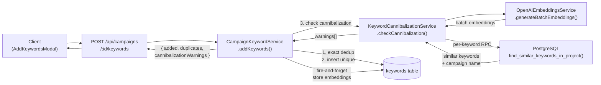
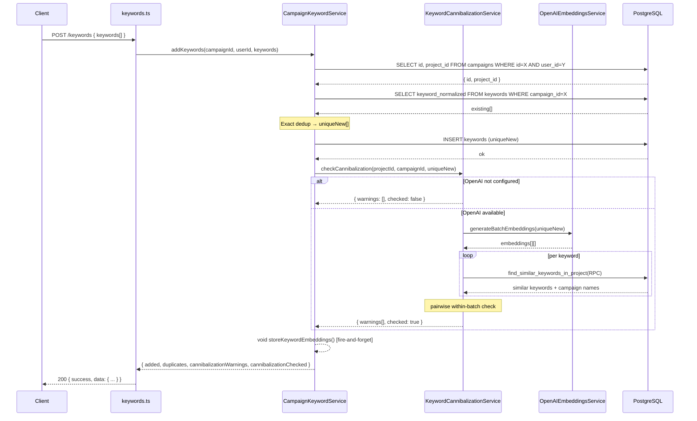

# PRD: Keyword Cannibalization Prevention

**Status:** Draft
**Complexity Score:** 6 → MEDIUM
**Created:** 2026-02-25
**Author:** Claude (Principal Architect)

---

## Complexity Assessment

| Factor                   | Score | Rationale                                                            |
| ------------------------ | ----- | -------------------------------------------------------------------- |
| Touches 6-10 files       | +2    | 7 files modified/created across DB, services, types, client          |
| New service from scratch | +2    | `KeywordCannibalizationService` — new module with its own logic      |
| Database schema changes  | +1    | New column + IVFFlat index + SQL RPC function                        |
| External API integration | +1    | OpenAI batch embeddings call (new usage pattern of existing service) |
| **Total**                | **6** | **MEDIUM** — standard template, all sections required                |

**Risk Areas:**

- OpenAI API latency on large keyword batches (up to 500 keywords) — mitigated by batch API call and per-batch chunking
- Cloudflare Workers 10ms CPU limit — all vector math pushed to PostgreSQL via pgvector RPC
- Backward compatibility — `IAddKeywordsResponse` extended with optional fields only

---

## Integration Points Checklist

```
How will this feature be reached?
- [x] Entry point: POST /api/campaigns/:campaignId/keywords
- [x] Caller file: src/pages/api/campaigns/[campaignId]/keywords.ts
- [x] Wiring: No new routes needed — extends existing keyword addition response

Is this user-facing?
- [x] YES — warnings returned to client; UI integration deferred to follow-up task
       (backend returns data; client hook types updated; toast/modal UI is out of scope)

Full user flow:
1. User pastes keywords into the Add Keywords modal
2. Client calls POST /api/campaigns/:campaignId/keywords
3. CampaignKeywordService.addKeywords() runs exact dedup (existing), then calls KeywordCannibalizationService.checkCannibalization()
4. Service returns { added, duplicates, cannibalizationWarnings, cannibalizationChecked }
5. Client receives warnings in response (currently logged; future UI task will surface them)
6. Fire-and-forget: embeddings stored on keyword rows for future checks
```

---

## 1. Context

### Problem

The content generation system prevents exact keyword duplicates within a campaign (case-insensitive via `keyword_normalized`) and has article-level semantic dedup at generation time (E10). However, there is no check for **keyword-level semantic overlap across campaigns within the same project**. This means "best coffee makers" in Campaign A and "top coffee machines" in Campaign B both generate articles competing for the same search intent — classic keyword cannibalization.

### Files Analyzed

| File                                                                              | Purpose                                         |
| --------------------------------------------------------------------------------- | ----------------------------------------------- |
| `server/services/campaign-keyword.service.ts`                                     | Primary file to modify — `addKeywords()` method |
| `server/services/openai-embeddings.service.ts`                                    | Existing embeddings service — add batch method  |
| `server/services/campaign.service.ts`                                             | Facade — update return type                     |
| `shared/types/campaign.types.ts`                                                  | `IAddKeywordsResponse`, `IKeyword`              |
| `src/pages/api/campaigns/[campaignId]/keywords.ts`                                | API route — no structural change needed         |
| `client/hooks/useCampaignDetail.ts`                                               | Client hook — update return types               |
| `supabase/migrations/20260210240100_add_topic_fingerprint_for_semantic_dedup.sql` | Reference pattern for vector column + index     |

### Current Behavior

- `addKeywords()` detects exact duplicates (case-insensitive normalization) within the same campaign
- Response: `{ added: number, duplicates: number }` — no similarity information
- `articles.topic_fingerprint vector(1536)` exists and uses IVFFlat index for article-level dedup
- `keywords` table has no embedding column
- Semantic dedup (E10) runs only at generation time, too late to warn the user

### Target Behavior

- When keywords are added, the system:
  1. Runs existing exact dedup (unchanged)
  2. Generates embeddings for new unique keywords via batch OpenAI API call
  3. Compares against all keywords with stored embeddings in the same **project** (all campaigns)
  4. Also checks within the submission batch (pairwise, catches intra-batch cannibalization)
  5. Returns warnings alongside `added`/`duplicates` — non-blocking, user can still proceed
  6. Stores embeddings on inserted keyword rows (fire-and-forget) for future checks
- If OpenAI is not configured or fails → keywords insert normally, `cannibalizationChecked: false`

---

## 2. Solution

### Approach

- **Push vector math to PostgreSQL** via a new SQL RPC function `find_similar_keywords_in_project` using pgvector's `<=>` cosine distance operator — avoids CPU limit issues in Cloudflare Workers
- **Store keyword embeddings** on the `keywords` table (`keyword_embedding vector(1536)`) — same model and approach as `articles.topic_fingerprint`
- **Batch embedding generation** — single OpenAI API call for up to 100 keywords per batch (array `input` field natively supported)
- **Non-blocking throughout** — every failure point is caught, logged, and skipped; keyword insertion never fails due to this feature
- **Backward-compatible response** — new fields (`cannibalizationWarnings?`, `cannibalizationChecked?`) are optional

### Architecture Diagram



### Key Decisions

- **Scope: per-project** — check across all campaigns within a project (not cross-project, not user-wide)
- **Threshold: 0.85** — same as article-level semantic dedup (E10), consistent behavior
- **Timing: at keyword addition** — catch issues before generation, before credits are spent
- **Action: warn but allow** — user decides; no blocking
- **Within-batch check** — pairwise cosine similarity on the just-generated embeddings, catches same-submission cannibalization before any rows are stored

### Data Changes

New migration `supabase/migrations/20260225100000_add_keyword_cannibalization.sql`:

- `keywords.keyword_embedding vector(1536)` — nullable; populated fire-and-forget after insertion
- IVFFlat index on `keyword_embedding` with `vector_cosine_ops`
- SQL function `find_similar_keywords_in_project(p_project_id, p_exclude_campaign_id, p_embedding, p_threshold, p_limit)`

---

## 3. Sequence Flow



---

## 4. Execution Phases

### Phase 1: Database Foundation

**User-visible outcome:** Migration applied; `keywords` table has `keyword_embedding` column and `find_similar_keywords_in_project` RPC function.

**Files (2):**

- `supabase/migrations/20260225100000_add_keyword_cannibalization.sql` — CREATE

**Implementation:**

- [ ] Add `CREATE EXTENSION IF NOT EXISTS vector;` (idempotent — already enabled for articles, safe to repeat)
- [ ] `ALTER TABLE public.keywords ADD COLUMN IF NOT EXISTS keyword_embedding vector(1536);`
- [ ] Create IVFFlat index: `USING ivfflat (keyword_embedding vector_cosine_ops) WITH (lists = 100)`
- [ ] Create RPC function (SECURITY DEFINER, STABLE):
  ```sql
  CREATE OR REPLACE FUNCTION find_similar_keywords_in_project(
    p_project_id UUID,
    p_exclude_campaign_id UUID,
    p_embedding vector(1536),
    p_threshold FLOAT DEFAULT 0.85,
    p_limit INT DEFAULT 3
  )
  RETURNS TABLE (
    keyword_id UUID,
    keyword TEXT,
    campaign_id UUID,
    campaign_name TEXT,
    similarity FLOAT
  )
  LANGUAGE sql STABLE SECURITY DEFINER SET search_path = public
  AS $$
    SELECT
      k.id,
      k.keyword,
      c.id,
      c.name,
      1 - (k.keyword_embedding <=> p_embedding) AS similarity
    FROM keywords k
    INNER JOIN campaigns c ON c.id = k.campaign_id
    WHERE c.project_id = p_project_id
      AND k.campaign_id != p_exclude_campaign_id
      AND k.keyword_embedding IS NOT NULL
      AND 1 - (k.keyword_embedding <=> p_embedding) >= p_threshold
    ORDER BY k.keyword_embedding <=> p_embedding ASC
    LIMIT p_limit;
  $$;
  ```
- [ ] Add `COMMENT ON COLUMN` and `COMMENT ON FUNCTION`

**Tests Required:**

| Test                                   | Assertion                                            |
| -------------------------------------- | ---------------------------------------------------- |
| Migration runs without error           | `npx supabase db push` exits 0                       |
| `keyword_embedding` column exists      | `\d keywords` shows column                           |
| RPC function exists                    | `\df find_similar_keywords_in_project` returns 1 row |
| RPC with null embeddings returns empty | Call with all-null embeddings → 0 rows               |

**User Verification:**

- Action: Run `npx supabase db push` or `npx supabase migration up`
- Expected: Migration applies cleanly; no errors

---

### Phase 2: Batch Embeddings Method

**User-visible outcome:** `OpenAIEmbeddingsService` can generate embeddings for multiple texts in one API call.

**Files (1):**

- `server/services/openai-embeddings.service.ts` — add `generateBatchEmbeddings()` method

**Implementation:**

- [ ] Add method signature: `async generateBatchEmbeddings(texts: string[]): Promise<number[][]>`
- [ ] Guard: `if (!this.isConfigured()) throw new Error('OpenAI API key not configured')`
- [ ] Guard: `if (texts.length === 0) return []`
- [ ] Trim and filter empty strings before sending
- [ ] Build request body: `{ model: this.model, input: trimmedTexts, encoding_format: 'float' }`
- [ ] Same `fetch()` pattern as `generateEmbedding()` with same error handling
- [ ] Sort `data` array by `item.index` before mapping — guarantee order matches input
- [ ] Return `sorted.map(item => item.embedding)` — `number[][]`
- [ ] No new types needed: `IOpenAIEmbeddingResponse` already has `data: Array<{ embedding, index }>`

**Tests Required:**

| Test File                                                           | Test Name                                   | Assertion                                                       |
| ------------------------------------------------------------------- | ------------------------------------------- | --------------------------------------------------------------- |
| `tests/unit/server/services/openai-embeddings.service.unit.spec.ts` | `should return embeddings in input order`   | Result array length matches input length; index order preserved |
|                                                                     | `should return empty array for empty input` | `generateBatchEmbeddings([])` returns `[]`                      |
|                                                                     | `should throw when not configured`          | Rejects with "not configured" when `OPENAI_API_KEY` empty       |
|                                                                     | `should make single API call for batch`     | `fetch` spy called once for 10 inputs                           |

**User Verification:**

- Action: `yarn verify` passes (TypeScript + lint)
- Expected: No compile errors

---

### Phase 3: Cannibalization Service + Types

**User-visible outcome:** `KeywordCannibalizationService` detects overlapping keywords; shared types updated.

**Files (2):**

- `server/services/keyword-cannibalization.service.ts` — CREATE
- `shared/types/campaign.types.ts` — extend `IAddKeywordsResponse`, add `ICannibalizationWarning`

#### `shared/types/campaign.types.ts` changes

Add after line 243 (after current `IAddKeywordsResponse`):

```typescript
/**
 * A single keyword cannibalization warning
 */
export interface ICannibalizationWarning {
  /** The newly-added keyword that has potential overlap */
  newKeyword: string;
  /** The existing keyword it overlaps with */
  existingKeyword: string;
  /** Name of the campaign containing the existing keyword */
  existingCampaignName: string;
  /** ID of the campaign containing the existing keyword */
  existingCampaignId: string;
  /** Cosine similarity score (0–1) */
  similarity: number;
  /** Human-readable similarity percentage (0–100) */
  similarityPercent: number;
}
```

Extend `IAddKeywordsResponse`:

```typescript
export interface IAddKeywordsResponse {
  added: number;
  duplicates: number;
  /** Cannibalization warnings (present when embeddings service ran) */
  cannibalizationWarnings?: ICannibalizationWarning[];
  /** Whether the cannibalization check ran (false if service unavailable) */
  cannibalizationChecked?: boolean;
}
```

#### `server/services/keyword-cannibalization.service.ts`

Constants:

```typescript
const DEFAULT_THRESHOLD = 0.85;
const MAX_SIMILAR_PER_KEYWORD = 3;
const EMBEDDING_BATCH_SIZE = 100; // OpenAI safe batch limit
```

`ICannibalizationCheckResult` interface (internal):

```typescript
interface ICannibalizationCheckResult {
  warnings: ICannibalizationWarning[];
  checked: boolean;
  skipReason?: string;
}
```

`checkCannibalization(projectId, campaignId, newKeywords[], threshold?)`:

1. Guard: not configured → `{ warnings: [], checked: false, skipReason: '...' }`
2. Guard: empty array → `{ warnings: [], checked: true }`
3. Generate embeddings for all `newKeywords` via `openaiEmbeddingsService.generateBatchEmbeddings()` — chunk by `EMBEDDING_BATCH_SIZE`
4. **Within-batch check**: pairwise `calculateCosineSimilarity()` on the just-generated embeddings; push warning if ≥ threshold (avoid self-comparison `i === j`; deduplicate symmetric pairs)
5. **Cross-campaign check**: for each keyword, call `supabaseAdmin.rpc('find_similar_keywords_in_project', {...})` with vector formatted as `[${embedding.join(',')}]`; if RPC errors → `console.warn` + `continue`
6. Return `{ warnings, checked: true }`

`storeKeywordEmbeddings(keywordTexts[], campaignId)`:

1. Guard: not configured or empty → return early
2. Generate batch embeddings (chunked)
3. For each keyword: `supabaseAdmin.from('keywords').update({ keyword_embedding: vectorStr }).eq('campaign_id', campaignId).eq('keyword_normalized', normalizeKeyword(text))`

Export singleton: `export const keywordCannibalizationService = new KeywordCannibalizationService()`

**Implementation checklist:**

- [ ] Import `supabaseAdmin` from `@server/supabase/supabaseAdmin`
- [ ] Import `openaiEmbeddingsService` from `./openai-embeddings.service`
- [ ] Import `ICannibalizationWarning` from `@shared/types/campaign.types`
- [ ] Normalize helper: same `kw.trim().toLowerCase().replace(/\s+/g, ' ')` as `campaign-keyword.service.ts`
- [ ] `generateBatchEmbeddings` chunked loop: `for (let i = 0; i < keywords.length; i += EMBEDDING_BATCH_SIZE)`
- [ ] Within-batch: only push warning once per pair (use `i < j` check)
- [ ] RPC call: `p_embedding` must be formatted as PostgreSQL vector string `'[x,y,z,...]'`
- [ ] All `await supabaseAdmin.rpc(...)` calls wrapped in individual try/catch
- [ ] `storeKeywordEmbeddings` uses `.catch(err => ...)` on each update (non-blocking)

**Tests Required:**

| Test File                                                                 | Test Name                                                 | Assertion                                                                 |
| ------------------------------------------------------------------------- | --------------------------------------------------------- | ------------------------------------------------------------------------- |
| `tests/unit/server/services/keyword-cannibalization.service.unit.spec.ts` | `should return checked:false when not configured`         | `openaiEmbeddingsService.isConfigured()` returns false → `checked: false` |
|                                                                           | `should return empty warnings when no similar found`      | RPC returns empty → `warnings: []`                                        |
|                                                                           | `should return warning when cross-campaign match found`   | RPC returns 1 match → `warnings` has 1 entry with correct fields          |
|                                                                           | `should return warning for within-batch similarity`       | Two similar keywords in same call → warning without RPC                   |
|                                                                           | `should continue on RPC error`                            | RPC rejects → `warnings` partial, no throw                                |
|                                                                           | `should chunk embeddings at EMBEDDING_BATCH_SIZE`         | 150 keywords → `generateBatchEmbeddings` called twice                     |
|                                                                           | `should not compare keyword against itself in batch`      | Single keyword → no self-warning                                          |
|                                                                           | `storeKeywordEmbeddings: should update keyword rows`      | `supabaseAdmin.from.update` called per keyword                            |
|                                                                           | `storeKeywordEmbeddings: should skip when not configured` | Returns early without API call                                            |

**User Verification:**

- Action: `yarn verify`
- Expected: TypeScript compiles, no lint errors

---

### Phase 4: Service Integration + Client Types

**User-visible outcome:** Adding keywords returns cannibalization warnings in the API response.

**Files (4):**

- `server/services/campaign-keyword.service.ts` — integrate check + store
- `server/services/campaign.service.ts` — update facade return type
- `client/hooks/useCampaignDetail.ts` — update client return types

#### `server/services/campaign-keyword.service.ts`

1. **Line 8** — add import: `import { keywordCannibalizationService } from './keyword-cannibalization.service';`
2. **Line 9** — update import: add `ICannibalizationWarning` to import from `@shared/types/campaign.types`
3. **Line 26-29** — update method return type:
   ```typescript
   ): Promise<{
     added: number;
     duplicates: number;
     cannibalizationWarnings: ICannibalizationWarning[];
     cannibalizationChecked: boolean;
   }>
   ```
4. **Line 66-69** (test mode return) — extend to match:
   ```typescript
   return {
     added: uniqueNew.length,
     duplicates: duplicates.length,
     cannibalizationWarnings: [],
     cannibalizationChecked: false,
   };
   ```
5. **Line 75** — expand campaign query: `.select('id, project_id')`
6. **After line 107** (after `uniqueNew`/`duplicates` built, before insertion) — add cannibalization check:
   ```typescript
   let cannibalizationResult = { warnings: [] as ICannibalizationWarning[], checked: false };
   if (campaign.project_id && uniqueNew.length > 0) {
     try {
       cannibalizationResult = await keywordCannibalizationService.checkCannibalization(
         campaign.project_id,
         campaignId,
         uniqueNew
       );
     } catch (error) {
       console.warn('[CampaignKeywordService] Cannibalization check failed:', error);
     }
   }
   ```
7. **After line 118** (after successful insert) — fire-and-forget store:
   ```typescript
   if (uniqueNew.length > 0) {
     void keywordCannibalizationService
       .storeKeywordEmbeddings(uniqueNew, campaignId)
       .catch(err => console.warn('[CampaignKeywordService] Failed to store embeddings:', err));
   }
   ```
8. **Lines 120-123** — update return:
   ```typescript
   return {
     added: uniqueNew.length,
     duplicates: duplicates.length,
     cannibalizationWarnings: cannibalizationResult.warnings,
     cannibalizationChecked: cannibalizationResult.checked,
   };
   ```

#### `server/services/campaign.service.ts`

Update `addKeywords()` return type (lines 122-124) to match:

```typescript
): Promise<{
  added: number;
  duplicates: number;
  cannibalizationWarnings: ICannibalizationWarning[];
  cannibalizationChecked: boolean;
}>
```

Add import for `ICannibalizationWarning` from `@shared/types/campaign.types`.

#### `client/hooks/useCampaignDetail.ts`

1. Import `ICannibalizationWarning` from `@shared/types/campaign.types`
2. Update `addKeywords` function return type (line 68-71):
   ```typescript
   ): Promise<{
     added: number;
     duplicates: number;
     cannibalizationWarnings?: ICannibalizationWarning[];
     cannibalizationChecked?: boolean;
   }>
   ```
3. Update hook interface `addKeywords` action type (line 171) to match
4. Update `apiFetch` data type assertion (line 72-73) to include new optional fields

**Tests Required:**

| Test File                                                          | Test Name                                                       | Assertion                                                             |
| ------------------------------------------------------------------ | --------------------------------------------------------------- | --------------------------------------------------------------------- |
| `tests/unit/server/services/campaign-keyword.service.unit.spec.ts` | `should include cannibalizationWarnings in response`            | Mock CAS returns warning → response has it                            |
|                                                                    | `should return cannibalizationChecked:false when service fails` | CAS throws → `cannibalizationChecked: false`, keywords still inserted |
|                                                                    | `should fire-and-forget storeKeywordEmbeddings`                 | Method called with uniqueNew after insert (not awaited)               |
|                                                                    | `should pass project_id to checkCannibalization`                | Campaign query now returns `project_id`; passed to CAS                |
|                                                                    | `test mode: should return checked:false without hitting CAS`    | Mock user path returns early with defaults                            |

**User Verification:**

```bash
# Confirm response shape includes new fields
curl -X POST http://localhost:3000/api/campaigns/{campaignId}/keywords \
  -H "Cookie: <session>" \
  -H "Content-Type: application/json" \
  -d '{"keywords":["best coffee makers","top coffee machines"]}' | jq .

# Expected:
# {
#   "success": true,
#   "data": {
#     "added": 2,
#     "duplicates": 0,
#     "cannibalizationWarnings": [...] or [],
#     "cannibalizationChecked": true or false
#   }
# }
```

- Action: Add two semantically similar keywords to a campaign; check response
- Expected: `cannibalizationWarnings` present in response body

---

## 5. Checkpoint Protocol

After each phase, spawn the prd-work-reviewer agent:

```
Task({
  subagent_type: 'prd-work-reviewer',
  prompt: 'Review checkpoint for phase [N] of PRD at docs/PRDs/keyword-cannibalization-prevention.md',
  description: 'Review phase N checkpoint'
})
```

Continue only when agent reports PASS.

---

## 6. Acceptance Criteria

- [ ] Phase 1: Migration applies cleanly; `keyword_embedding` column + IVFFlat index + RPC exist
- [ ] Phase 2: `generateBatchEmbeddings()` works; sends single API call per batch; preserves order
- [ ] Phase 3: `KeywordCannibalizationService` detects cross-campaign and within-batch overlap; unit tests pass
- [ ] Phase 4: `addKeywords()` response includes `cannibalizationWarnings[]` and `cannibalizationChecked`; backward-compatible; client types updated
- [ ] All unit tests pass (`yarn test`)
- [ ] `yarn verify` passes (TypeScript + lint)
- [ ] Keyword insertion never fails when OpenAI is unavailable
- [ ] Test mode returns `cannibalizationChecked: false` without hitting OpenAI

---

## 7. Out of Scope (Follow-up Tasks)

- **UI**: Toast/modal displaying `cannibalizationWarnings` in the AddKeywordsModal (data is available; UI integration is a separate task)
- **Configurable threshold**: Per-campaign or per-user similarity threshold setting
- **Retroactive backfill**: Generating embeddings for existing keywords already in the DB
- **Article-level cross-project check**: Today's E10 (article dedup) already handles same-campaign; cross-campaign article check is not planned
