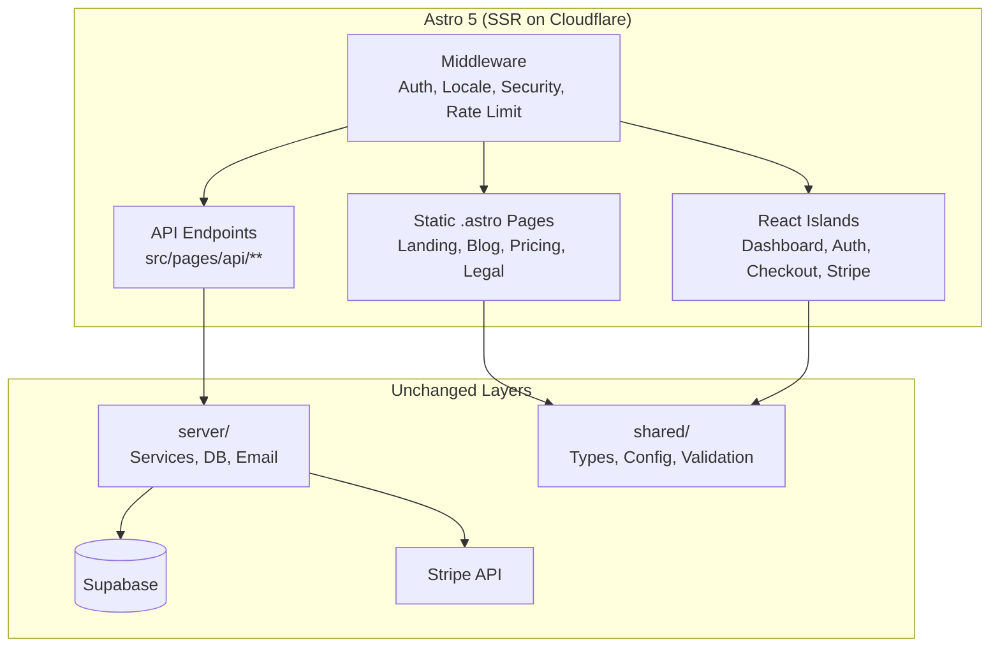
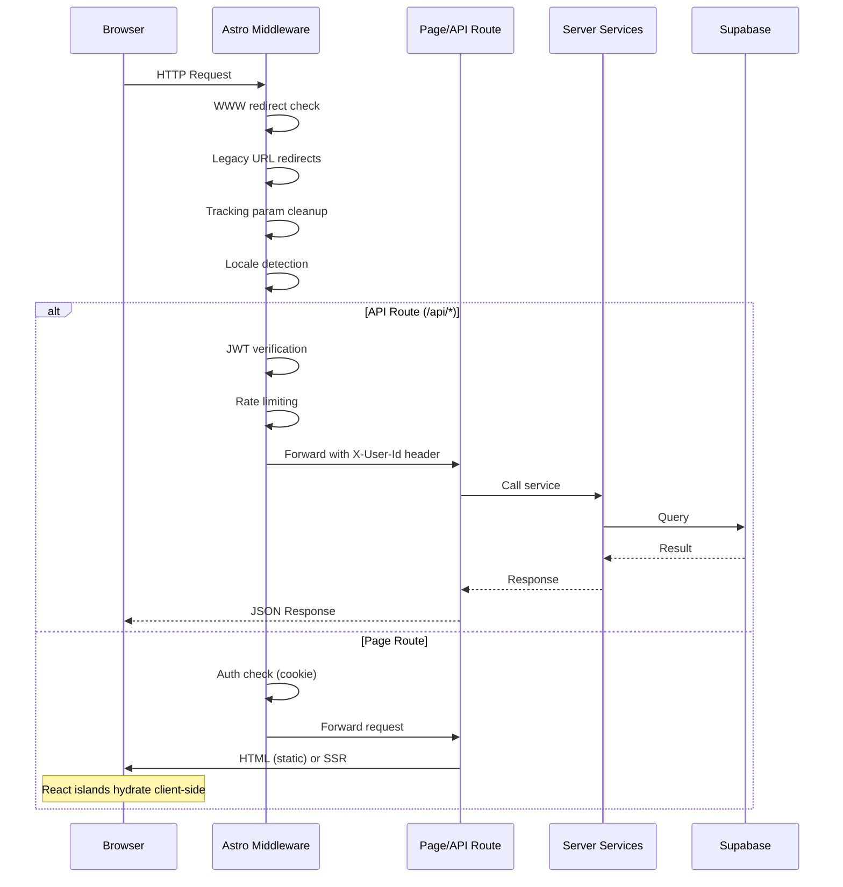

# PRD: Migrate Next.js 15 SaaS Boilerplate to Astro

**Complexity: 10 → HIGH mode**

---

## 1. Context

**Problem:** The current SaaS boilerplate is built on Next.js 15 with App Router. We want to migrate to Astro for its superior static-site generation, smaller bundle sizes, opt-in hydration (islands architecture), and simpler mental model for content-heavy pages while retaining React for interactive islands (dashboard, auth, checkout).

**Files Analyzed:**

- `middleware.ts` - 658 lines of request processing (auth, locale, security, rate limiting)
- `shared/config/env.ts` - Environment variable system (clientEnv/serverEnv via Zod)
- `app/` - 70 route files (pages + API routes)
- `client/components/` - 70 React component files
- `server/` - Business logic, services, database access
- `shared/` - Types, validation, config (framework-agnostic)
- `package.json` - Dependencies (Next.js 16.0.10, next-intl, opennextjs/cloudflare)
- `wrangler.toml` - Cloudflare Pages deployment config
- `open-next.config.ts` - OpenNext Cloudflare adapter
- `i18n/config.ts` - next-intl locale configuration
- `locales/en/*.json` - 20+ translation files

**Current Behavior:**

- Next.js App Router with `[locale]` dynamic segment for i18n
- Server Components (default) with `"use client"` directives for interactive parts
- Middleware handles: WWW redirect, legacy redirects, tracking param cleanup, locale detection, API auth (JWT), page auth, rate limiting, security headers, CORS
- Deployed to Cloudflare Pages via OpenNext adapter (`@opennextjs/cloudflare`)
- Environment variables loaded via centralized `shared/config/env.ts` (Zod-validated, `NEXT_PUBLIC_*` prefix convention)

---

## 2. Solution

**Approach:**

- Migrate to Astro 5 with the Cloudflare adapter (`@astrojs/cloudflare`)
- Use Astro's islands architecture: static `.astro` pages by default, React islands (`client:load`, `client:visible`) for interactive components (dashboard, auth forms, Stripe checkout)
- Keep the entire `server/`, `shared/`, and `emails/` directories largely untouched since they are framework-agnostic
- Replace `next-intl` with Astro's built-in i18n routing (`i18n` config in `astro.config.mjs`)
- Replace Next.js middleware with Astro middleware (`src/middleware.ts`)
- Replace Next.js API routes (`app/api/`) with Astro API endpoints (`src/pages/api/`)
- Replace `NEXT_PUBLIC_*` env convention with Astro's `PUBLIC_*` convention (or `import.meta.env`)
- Retain Supabase, Stripe, Zustand, Tailwind, Vitest, Playwright as-is

**Architecture Diagram:**



**Key Decisions:**

- **Astro + React integration** via `@astrojs/react` - keeps all existing React components functional inside `client:*` islands
- **SSR mode** (`output: 'server'`) required for API routes, auth middleware, and dynamic dashboard pages
- **Cloudflare adapter** (`@astrojs/cloudflare`) replaces `@opennextjs/cloudflare` - native Astro support, no OpenNext shim
- **Environment variables** - Replace `NEXT_PUBLIC_*` with `PUBLIC_*` prefix; update `shared/config/env.ts` to use `import.meta.env` instead of `process.env`
- **Routing** - Astro file-based routing in `src/pages/` replaces Next.js `app/` directory; `[locale]` becomes Astro i18n config with `prefixDefaultLocale: false`
- **Error handling** - Astro `src/pages/404.astro` and `src/pages/500.astro` replace Next.js `error.tsx`/`not-found.tsx`
- **Blog/MDX** - Astro Content Collections replace `next-mdx-remote` - better DX and type safety

**Data Changes:** None. Supabase schema, migrations, and RLS policies are unchanged.

---

## 3. Sequence Flow



---

## 4. Execution Phases

### Integration Points Checklist

```markdown
**How will this feature be reached?**

- [x] Entry point: All HTTP requests hit Astro middleware → pages/API
- [x] Caller: Browser requests, Stripe webhooks, cron jobs
- [x] Registration: Astro config (astro.config.mjs) wires adapters, integrations, i18n

**Is this user-facing?**

- [x] YES → All existing UI is migrated (landing, dashboard, blog, auth, checkout)

**Full user flow:**

1. User navigates to any URL
2. Astro middleware processes request (auth, locale, security)
3. Static pages served directly; SSR pages rendered on Cloudflare
4. React islands hydrate for interactive parts (dashboard, forms, Stripe)
5. API calls from islands hit Astro API endpoints → server services → Supabase
```

---

#### Phase 1: Project Scaffolding and Build Pipeline

**User-visible outcome:** `yarn dev` starts an Astro dev server; `yarn build` produces a Cloudflare-deployable build; all existing shared/server code compiles.

**Files (max 5):**

- `astro.config.mjs` - NEW: Astro configuration (adapter, integrations, i18n, Tailwind)
- `src/env.d.ts` - NEW: Astro environment type declarations
- `package.json` - UPDATE: Replace Next.js deps with Astro deps; update scripts
- `tsconfig.json` - UPDATE: Astro-compatible TS config with path aliases
- `shared/config/env.ts` - UPDATE: Replace `process.env` + `NEXT_PUBLIC_*` with `import.meta.env` + `PUBLIC_*`

**Implementation:**

- [ ] Install Astro 5, `@astrojs/react`, `@astrojs/cloudflare`, `@astrojs/tailwind`, `@astrojs/mdx`
- [ ] Remove `next`, `next-intl`, `next-mdx-remote`, `@opennextjs/cloudflare`
- [ ] Create `astro.config.mjs` with `output: 'server'`, Cloudflare adapter, React integration, Tailwind, i18n config (locales: ['en'], defaultLocale: 'en', routing: { prefixDefaultLocale: false })
- [ ] Update `tsconfig.json` to extend `astro/tsconfigs/strict`; preserve path aliases (`@shared/*`, `@server/*`, `@client/*`, `@lib/*`)
- [ ] Create `src/env.d.ts` with `/// <reference types="astro/client" />` and `ImportMetaEnv` interface
- [ ] Update `shared/config/env.ts`: replace `process.env.NEXT_PUBLIC_*` with `import.meta.env.PUBLIC_*`; replace `process.env.*` server vars with `import.meta.env.*` (Astro exposes server vars to server code)
- [ ] Update `.env.client` variable names: `NEXT_PUBLIC_*` → `PUBLIC_*`
- [ ] Update package.json scripts: `dev` → `astro dev`, `build` → `astro build`, `preview` → `astro preview`
- [ ] Remove `next.config.js`, `open-next.config.ts`
- [ ] Update `wrangler.toml` `pages_build_output_dir` to `dist/` (Astro default output)

**Tests Required:**
| Test File | Test Name | Assertion |
|-----------|-----------|-----------|
| Manual | `yarn dev` starts | Dev server starts without errors |
| Manual | `yarn build` completes | Build produces `dist/` output |
| `__tests__/config/env.test.ts` | `should load client env vars` | `clientEnv.APP_NAME` resolves correctly |
| `__tests__/config/env.test.ts` | `should load server env vars` | `serverEnv.STRIPE_SECRET_KEY` resolves correctly |

**User Verification:**

- Action: Run `yarn dev`
- Expected: Astro dev server starts on localhost:4321 (or configured port)

---

#### Phase 2: Middleware Migration

**User-visible outcome:** All request processing (auth, locale, security headers, rate limiting, redirects) works identically to the Next.js middleware.

**Files (max 5):**

- `src/middleware.ts` - NEW: Astro middleware replicating all logic from root `middleware.ts`
- `lib/middleware/index.ts` - UPDATE: Replace `NextRequest`/`NextResponse` types with Astro's `APIContext`
- `lib/middleware/rateLimit.ts` - UPDATE: Adapt to Astro request/response types
- `lib/middleware/errorHandler.ts` - UPDATE: Adapt to Astro request/response types
- `shared/config/security.ts` - UPDATE: Verify public routes still match (paths unchanged)

**Implementation:**

- [ ] Create `src/middleware.ts` using Astro's `defineMiddleware` from `astro:middleware`
- [ ] Port WWW redirect logic using `context.url` and `context.redirect()`
- [ ] Port legacy redirect logic
- [ ] Port tracking parameter cleanup
- [ ] Port locale detection (cookie, CF-IPCountry, Accept-Language)
- [ ] Port API auth flow: JWT verification via `Authorization` header, set `X-User-Id` on `context.locals`
- [ ] Port page auth flow: session refresh via cookies, dashboard redirect for unauthenticated users
- [ ] Port security headers: apply via `context.response.headers` or middleware response
- [ ] Port rate limiting with adapted request/response interfaces
- [ ] Port CORS handling
- [ ] Update `lib/middleware/` helpers to accept Astro-compatible `Request`/`Response` types (or create adapter layer)

**Tests Required:**
| Test File | Test Name | Assertion |
|-----------|-----------|-----------|
| `__tests__/middleware/www-redirect.test.ts` | `should redirect www to non-www` | 301 redirect |
| `__tests__/middleware/locale-detection.test.ts` | `should detect locale from cookie` | Returns correct locale |
| `__tests__/middleware/api-auth.test.ts` | `should reject unauthenticated API requests` | 401 response |
| `__tests__/middleware/security-headers.test.ts` | `should apply all security headers` | Headers present |

**User Verification:**

- Action: Visit `/api/health` in browser
- Expected: 200 response with security headers applied

---

#### Phase 3: API Endpoints Migration

**User-visible outcome:** All API endpoints (`/api/health`, `/api/webhooks/stripe`, `/api/checkout`, `/api/admin/*`, etc.) respond identically.

**Files (max 5):**

- `src/pages/api/health/index.ts` - NEW: Health check endpoint
- `src/pages/api/webhooks/stripe/index.ts` - NEW: Stripe webhook handler
- `src/pages/api/checkout/index.ts` - NEW: Checkout session endpoint
- `src/pages/api/portal/index.ts` - NEW: Stripe portal endpoint
- `src/pages/api/[...rest].ts` - Template for remaining API endpoints

**Implementation:**

- [ ] Create Astro API endpoint pattern:
  ```typescript
  // src/pages/api/health/index.ts
  import type { APIRoute } from 'astro';
  export const GET: APIRoute = async ({ request, locals }) => {
    return new Response(JSON.stringify({ status: 'ok' }), { status: 200 });
  };
  ```
- [ ] Migrate all 25+ API routes from `app/api/` to `src/pages/api/` using Astro's `APIRoute` type
- [ ] Replace `NextRequest`/`NextResponse` with standard `Request`/`Response` (Astro uses web standard APIs)
- [ ] Access authenticated user via `locals.userId` (set by middleware) instead of `request.headers.get('X-User-Id')`
- [ ] Stripe webhook: keep signature verification logic, adapt to `Request` body parsing
- [ ] Cron endpoints: keep `x-cron-secret` header authentication
- [ ] Admin endpoints: keep `requireAdmin` middleware check

**Note:** This phase covers the core API routes. Remaining routes (subscription/_, credits/_, email/_, admin/_) follow the same pattern and can be migrated incrementally.

**Tests Required:**
| Test File | Test Name | Assertion |
|-----------|-----------|-----------|
| `tests/api/health.api.spec.ts` | `should return 200 for health check` | Status 200, JSON body |
| `tests/api/webhooks.api.spec.ts` | `should reject invalid Stripe signature` | Status 400 |
| `tests/api/checkout.api.spec.ts` | `should require authentication` | Status 401 without token |
| `tests/api/admin.api.spec.ts` | `should require admin role` | Status 403 for non-admin |

**User Verification:**

- Action: `curl http://localhost:4321/api/health`
- Expected: `{"status":"ok"}` with 200

---

#### Phase 4: Static Pages (Landing, Blog, Legal, Pricing)

**User-visible outcome:** Landing page, blog listing, blog posts, pricing, privacy, terms, help pages render as static Astro pages with React islands where interactive.

**Files (max 5):**

- `src/pages/index.astro` - NEW: Landing page (Astro component, imports React HomePageClient island)
- `src/pages/blog/index.astro` - NEW: Blog listing page
- `src/pages/blog/[slug].astro` - NEW: Individual blog post (Content Collections)
- `src/pages/pricing.astro` - NEW: Pricing page with React PricingPageClient island
- `src/content/config.ts` - NEW: Astro Content Collections config for blog

**Implementation:**

- [ ] Create `src/content/config.ts` defining a `blog` collection with Zod schema (title, description, publishedAt, author, tags, featured, image)
- [ ] Move `content/blog/*.md` files to `src/content/blog/`
- [ ] Create landing page as `.astro` component; embed `HomePageClient` React component with `client:load`
- [ ] Create blog listing: use `getCollection('blog')` to list posts
- [ ] Create blog post page: use `getEntry('blog', slug)` with `<Content />` component
- [ ] Create pricing page: static layout with `<PricingPageClient client:load />` for plan selection
- [ ] Create legal pages (privacy, terms) as pure `.astro` static pages
- [ ] Create help page with `<HelpClient client:load />` island
- [ ] Migrate SEO metadata: use Astro's `<head>` directly instead of Next.js `generateMetadata`
- [ ] Migrate sitemaps: `src/pages/sitemap-blog.xml.ts` and `src/pages/sitemap-static.xml.ts` as API routes returning XML

**Tests Required:**
| Test File | Test Name | Assertion |
|-----------|-----------|-----------|
| `tests/e2e/landing.e2e.spec.ts` | `should render landing page` | Page loads, CTA visible |
| `tests/e2e/blog.e2e.spec.ts` | `should list blog posts` | Blog listing renders posts |
| `tests/e2e/blog.e2e.spec.ts` | `should render blog post` | Post content visible, reading time shown |
| `tests/e2e/pricing.e2e.spec.ts` | `should render pricing plans` | All plan cards visible |

**User Verification:**

- Action: Navigate to `http://localhost:4321/`
- Expected: Landing page renders with hero section, features, CTAs

---

#### Phase 5: Authentication Pages and Dashboard Shell

**User-visible outcome:** Login, register, password reset flows work; dashboard layout renders for authenticated users with sidebar, navigation, and session management.

**Files (max 5):**

- `src/pages/auth/callback.astro` - NEW: OAuth callback page
- `src/pages/auth/confirm.astro` - NEW: Email confirmation page
- `src/pages/auth/reset-password.astro` - NEW: Password reset page
- `src/pages/dashboard/index.astro` - NEW: Dashboard home (SSR, authenticated)
- `src/layouts/DashboardLayout.astro` - NEW: Dashboard layout wrapping React DashboardLayout island

**Implementation:**

- [ ] Create auth callback page: handles Supabase OAuth redirect, sets cookies
- [ ] Create auth confirm page: handles email confirmation tokens
- [ ] Create password reset page: renders `ChangePasswordForm` React island
- [ ] Create dashboard layout as `.astro` wrapper that checks `locals.user` and renders React `DashboardLayout` with `client:load`
- [ ] Dashboard pages use the layout and pass server-fetched data as props to React islands
- [ ] Port `ClientProviders.tsx` (Zustand, Supabase context) - wrap dashboard islands
- [ ] Update `shared/utils/supabase/server.ts` to work with Astro cookies API (`Astro.cookies` or `context.cookies`)
- [ ] Update `shared/utils/supabase/client.ts` - no changes needed (browser-only)

**Tests Required:**
| Test File | Test Name | Assertion |
|-----------|-----------|-----------|
| `tests/e2e/auth.e2e.spec.ts` | `should show login form` | Login form renders |
| `tests/e2e/auth.e2e.spec.ts` | `should redirect unauthenticated to landing` | 302 to `/` |
| `tests/e2e/dashboard.e2e.spec.ts` | `should render dashboard for authenticated user` | Dashboard sidebar visible |
| `tests/api/auth.api.spec.ts` | `should handle auth callback` | Sets session cookie |

**User Verification:**

- Action: Navigate to `/dashboard` without auth
- Expected: Redirected to `/` with `?login=1` query param

---

#### Phase 6: Dashboard Feature Pages

**User-visible outcome:** Billing, history, settings, support, and admin pages function within the dashboard.

**Files (max 5):**

- `src/pages/dashboard/billing.astro` - NEW: Billing/subscription management
- `src/pages/dashboard/history.astro` - NEW: Credit/transaction history
- `src/pages/dashboard/settings.astro` - NEW: User settings
- `src/pages/dashboard/support.astro` - NEW: Support/contact form
- `src/pages/dashboard/admin/index.astro` - NEW: Admin dashboard

**Implementation:**

- [ ] Each dashboard page: `.astro` shell fetches server data, passes to React island
- [ ] Billing page: renders `StripeBillingManager` React island with `client:load`
- [ ] History page: renders `CreditHistory` React island with `client:load`
- [ ] Settings page: renders `UserSettings` React island with `client:load`
- [ ] Support page: renders `SupportForm` React island with `client:load`
- [ ] Admin section: separate `src/pages/dashboard/admin/` directory with admin-only pages
- [ ] Admin users list: `src/pages/dashboard/admin/users/index.astro`
- [ ] Admin user detail: `src/pages/dashboard/admin/users/[userId].astro`
- [ ] Admin stats: `src/pages/dashboard/admin/stats.astro` (or inline in admin index)
- [ ] All admin pages check `locals.isAdmin` in middleware or page-level guard

**Tests Required:**
| Test File | Test Name | Assertion |
|-----------|-----------|-----------|
| `tests/e2e/billing.e2e.spec.ts` | `should render billing page` | Subscription status visible |
| `tests/e2e/admin.e2e.spec.ts` | `should require admin role` | Non-admin gets 403 |
| `tests/e2e/settings.e2e.spec.ts` | `should render settings form` | Profile form visible |
| `tests/e2e/support.e2e.spec.ts` | `should submit support form` | Success message |

**User Verification:**

- Action: Navigate to `/dashboard/billing` as authenticated user
- Expected: Billing page shows current subscription and usage

---

#### Phase 7: Checkout and Payment Flow

**User-visible outcome:** Subscription checkout, credit pack purchase, success/canceled pages, and Stripe portal access all work end-to-end.

**Files (max 5):**

- `src/pages/checkout.astro` - NEW: Checkout page with Stripe Elements React island
- `src/pages/success.astro` - NEW: Payment success page
- `src/pages/canceled.astro` - NEW: Payment canceled page
- `src/pages/subscription/confirmed.astro` - NEW: Subscription confirmation
- `client/components/stripe/` - UPDATE: Minimal changes (React components stay the same)

**Implementation:**

- [ ] Checkout page: `.astro` shell loads Stripe publishable key from `clientEnv`, renders `CheckoutForm` React island with `client:load`
- [ ] Success page: static `.astro` page with success messaging, optional React island for dynamic content
- [ ] Canceled page: static `.astro` page
- [ ] Subscription confirmed: `.astro` page rendering `SubscriptionConfirmedClient` React island
- [ ] Verify Stripe Elements React components work unchanged (they should - pure client-side React)
- [ ] Ensure `@stripe/react-stripe-js` and `@stripe/stripe-js` load correctly in Astro React islands

**Tests Required:**
| Test File | Test Name | Assertion |
|-----------|-----------|-----------|
| `tests/e2e/checkout.e2e.spec.ts` | `should render checkout form` | Stripe Elements loads |
| `tests/e2e/checkout.e2e.spec.ts` | `should redirect to success after payment` | Success page renders |
| `tests/api/checkout.api.spec.ts` | `should create Stripe checkout session` | Returns sessionId |
| `tests/api/portal.api.spec.ts` | `should return portal URL` | Valid Stripe portal URL |

**User Verification:**

- Action: Click "Subscribe" on pricing page
- Expected: Redirected to Stripe Checkout; after test payment, redirected to success page

---

#### Phase 8: i18n, SEO, and Sitemaps

**User-visible outcome:** Locale detection works (English default, URL prefix for non-default locales), sitemaps are generated, robots.txt serves correctly, meta tags are correct.

**Files (max 5):**

- `astro.config.mjs` - UPDATE: Finalize i18n config
- `src/i18n/utils.ts` - NEW: Translation utility (replaces next-intl's `useTranslations`)
- `src/pages/robots.txt.ts` - NEW: Dynamic robots.txt API route
- `src/pages/sitemap-static.xml.ts` - NEW: Static sitemap
- `src/pages/sitemap-blog.xml.ts` - NEW: Blog sitemap

**Implementation:**

- [ ] Configure Astro i18n: `i18n: { defaultLocale: 'en', locales: ['en'], routing: { prefixDefaultLocale: false } }`
- [ ] Create translation utility: load JSON files from `locales/en/*.json`, provide `t(key)` function
- [ ] For React islands: pass translations as props from `.astro` parent, or create a `useTranslations` hook that imports JSON directly
- [ ] Migrate `robots.txt` generation to Astro API endpoint
- [ ] Migrate sitemap generation to Astro API endpoints returning XML
- [ ] Update all `<head>` meta tags in `.astro` pages (title, description, Open Graph, canonical URLs)
- [ ] Add `<link rel="alternate" hreflang="en" />` tags
- [ ] Migrate `app/manifest.ts` to `src/pages/manifest.json.ts`
- [ ] Ensure pSEO paths (`/tools/*`, `/formats/*`, etc.) still work with Astro routing

**Tests Required:**
| Test File | Test Name | Assertion |
|-----------|-----------|-----------|
| `tests/api/sitemap.api.spec.ts` | `should return valid XML sitemap` | Valid XML with expected URLs |
| `tests/api/robots.api.spec.ts` | `should serve robots.txt` | Contains sitemap URL |
| `tests/e2e/seo.e2e.spec.ts` | `should have correct meta tags` | OG image, title, description |
| `tests/e2e/i18n.e2e.spec.ts` | `should detect locale from cookie` | Page renders in correct locale |

**User Verification:**

- Action: Visit `/sitemap-static.xml`
- Expected: Valid XML sitemap with all static page URLs

---

#### Phase 9: Monitoring, Analytics, Error Pages, and Cleanup

**User-visible outcome:** Error pages (404, 500) render, analytics events fire, monitoring works, all dead Next.js code is removed.

**Files (max 5):**

- `src/pages/404.astro` - NEW: Custom 404 page
- `src/pages/500.astro` - NEW: Custom 500 page
- `client/analytics/` - UPDATE: Verify analytics initialization works in Astro (should be unchanged)
- `package.json` - UPDATE: Remove all remaining Next.js-specific deps
- Root cleanup - DELETE: `next.config.js`, `open-next.config.ts`, `i18n.config.ts`, `app/` directory

**Implementation:**

- [ ] Create styled 404 and 500 error pages
- [ ] Verify Baselime RUM (`@baselime/react-rum`) works in Astro React islands
- [ ] Verify Amplitude analytics initialization in client-side React providers
- [ ] Verify Google Analytics script loads (add to base layout `<head>`)
- [ ] Remove all Next.js-specific files: `next.config.js`, `open-next.config.ts`, `i18n.config.ts`, entire `app/` directory
- [ ] Remove Next.js-specific dependencies from `package.json`
- [ ] Update ESLint config: remove Next.js-specific rules/plugins
- [ ] Update `.gitignore`: replace `.next/` with `.astro/`, `dist/`
- [ ] Update `README.md` with new development and deployment instructions
- [ ] Update `CLAUDE.md` boilerplate instructions for Astro
- [ ] Update Playwright config: change base URL port if needed (Astro default: 4321)
- [ ] Update Vitest config if needed for new file locations

**Tests Required:**
| Test File | Test Name | Assertion |
|-----------|-----------|-----------|
| `tests/e2e/errors.e2e.spec.ts` | `should render 404 for unknown routes` | 404 page content visible |
| `tests/e2e/errors.e2e.spec.ts` | `should render 500 page on error` | Error page renders gracefully |
| Manual | `yarn verify` | TypeScript, lint, and i18n checks pass |
| Manual | `yarn build` | Production build succeeds |

**User Verification:**

- Action: Visit `/nonexistent-page`
- Expected: Custom 404 page with navigation back to home

---

#### Phase 10: Deployment and Production Validation

**User-visible outcome:** The Astro app deploys to Cloudflare Pages and works in production.

**Files (max 5):**

- `wrangler.toml` - UPDATE: Point to Astro's `dist/` output
- `scripts/deploy/deploy.sh` - UPDATE: Use Astro build commands
- `astro.config.mjs` - UPDATE: Finalize production settings
- `scripts/build-blog.ts` - UPDATE or DELETE: May not be needed with Content Collections
- `.github/workflows/` - UPDATE: CI pipeline for Astro build

**Implementation:**

- [ ] Update `wrangler.toml`: `pages_build_output_dir = "dist"` (or `dist/_worker.js` depending on adapter output)
- [ ] Update deploy script to run `astro build` instead of `next build`
- [ ] Test Cloudflare Pages deployment with `wrangler pages deploy`
- [ ] Verify environment variables work in Cloudflare Pages environment
- [ ] Verify Stripe webhook endpoint is accessible
- [ ] Verify cron job endpoints work
- [ ] Performance testing: measure TTFB, LCP, CLS against Next.js baseline
- [ ] If `build-blog.ts` is no longer needed (Content Collections handles it), remove it and the `prebuild` script

**Tests Required:**
| Test File | Test Name | Assertion |
|-----------|-----------|-----------|
| `tests/preview/health.preview.spec.ts` | `should respond to health check on Cloudflare` | 200 from preview |
| `tests/preview/stripe-webhook.preview.spec.ts` | `should accept Stripe webhook` | 200 with valid signature |
| Manual | Deploy to staging | All pages load, auth works, payments work |
| Manual | Lighthouse audit | Performance score >= 90 |

**User Verification:**

- Action: Deploy to Cloudflare Pages staging environment
- Expected: All routes work, auth flows complete, Stripe payments process

---

## 5. Risk Assessment

| Risk                                           | Impact | Mitigation                                                                                                     |
| ---------------------------------------------- | ------ | -------------------------------------------------------------------------------------------------------------- |
| React islands hydration mismatch               | HIGH   | Test all interactive components thoroughly; use `client:only="react"` for Stripe Elements if SSR causes issues |
| Supabase SSR cookie handling differs in Astro  | MEDIUM | `@supabase/ssr` supports generic cookie adapters; implement Astro cookie adapter early                         |
| Cloudflare Workers 10ms CPU limit              | HIGH   | Astro SSR is lighter than Next.js; monitor CPU time in staging                                                 |
| `import.meta.env` vs `process.env` differences | MEDIUM | Phase 1 handles this; run full env test suite after migration                                                  |
| pSEO dynamic routes complexity                 | MEDIUM | Map all pSEO patterns to Astro `[...slug]` catch-all or explicit routes                                        |
| Breaking changes in existing test suites       | MEDIUM | Update tests phase-by-phase; each phase includes test migration                                                |
| Email templates use `@react-email/components`  | LOW    | These render server-side only; no framework dependency                                                         |

---

## 6. What Stays Unchanged

These directories/files require **zero or minimal changes**:

| Path                                   | Reason                                                 |
| -------------------------------------- | ------------------------------------------------------ |
| `server/`                              | Framework-agnostic business logic, services, DB access |
| `shared/types/`                        | Pure TypeScript interfaces                             |
| `shared/validation/`                   | Zod schemas                                            |
| `shared/repositories/`                 | Database access layer                                  |
| `shared/config/stripe.ts`              | Stripe configuration                                   |
| `shared/config/credits.config.ts`      | Credit costs                                           |
| `shared/config/subscription.config.ts` | Subscription plans                                     |
| `emails/`                              | React Email templates (server-side rendering only)     |
| `supabase/`                            | Database migrations                                    |
| `locales/`                             | Translation JSON files                                 |
| `client/store/`                        | Zustand stores (framework-agnostic)                    |
| `client/components/stripe/`            | React components (used as islands)                     |
| `client/components/modal/`             | React components (used as islands)                     |
| `client/components/form/`              | React components (used as islands)                     |

---

## 7. Acceptance Criteria

- [ ] All phases complete with checkpoint reviews passed
- [ ] All existing Playwright E2E tests pass (adapted for Astro)
- [ ] All existing Vitest unit tests pass
- [ ] `yarn verify` passes (TypeScript, ESLint, i18n)
- [ ] Landing page, blog, pricing, legal pages render as static HTML (no JS by default)
- [ ] Dashboard, auth, checkout work as React islands
- [ ] All API endpoints respond correctly
- [ ] Stripe webhooks process payments
- [ ] Auth flow works (login, register, OAuth, password reset)
- [ ] Deployed to Cloudflare Pages successfully
- [ ] Performance: Lighthouse score >= 90 on static pages
- [ ] Bundle size smaller than Next.js baseline for static pages
- [ ] No `next`, `next-intl`, or `@opennextjs/cloudflare` in final `package.json`
