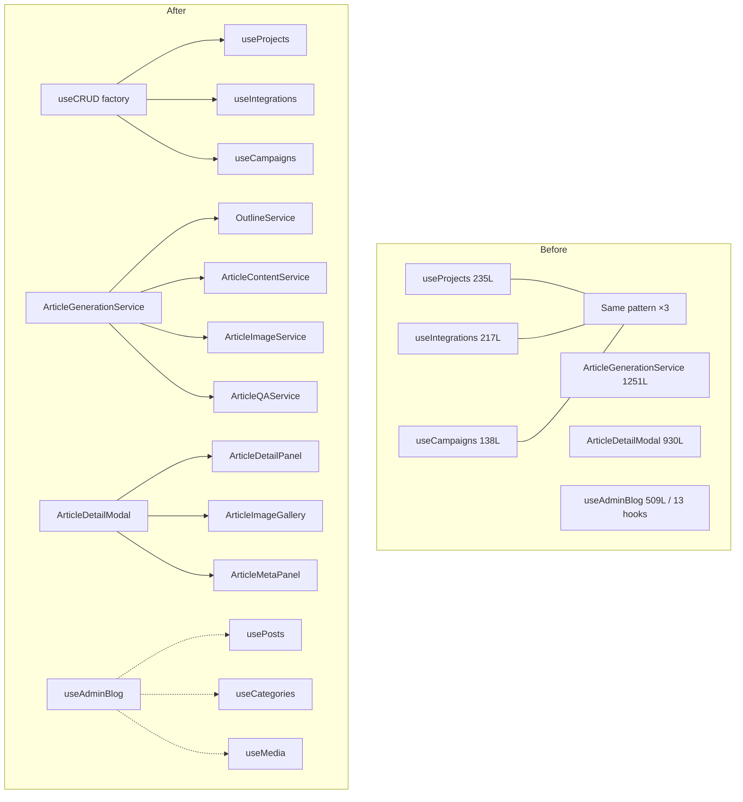

# PRD: Code Quality — SOLID, DRY, SRP, KISS Violations

**Complexity: 9 → HIGH mode**
**Status:** Ready
**Created:** 2026-02-28
**Priority:** Medium (technical debt reduction)

---

## 1. Context

**Problem:** The codebase has accumulated significant technical debt: God services (1200+ line files), duplicated CRUD hook patterns, God components (930 lines), and SRP violations that make the code hard to test, understand, and extend.

**Audit basis:** Full codebase scan performed 2026-02-28. Top 30 violations identified.

**Files Analyzed:**

- `client/hooks/` — useAdminBlog.ts, useArticleActions.ts, useCampaignDetail.ts, useProjects.ts, useIntegrations.ts, useCampaigns.ts, useArticlePoller.ts, useBatchQueue.ts
- `client/components/articles/` — ArticleDetailModal.tsx, ArticleList.tsx, ArticleTableRow.tsx
- `client/components/onboarding/steps/` — OnboardingStepIntegrations.tsx
- `server/services/` — article-generation.service.ts, blog.service.ts, integration.service.ts, campaign-lifecycle.service.ts, qa.service.ts, delivery.service.ts, opportunity-analysis.service.ts
- `server/webhooks/stripe/handlers/` — subscription.handler.ts
- `server/integrations/` — adapters (WordPress, Ghost, Shopify, etc.)
- `shared/types/` — integration.types.ts, article.types.ts, campaign.types.ts

**Current Behavior:**

- `article-generation.service.ts` is 1251 lines orchestrating credits + outline + content + images + QA + email
- `useAdminBlog.ts` exports 13 different hooks from one 509-line file
- `ArticleDetailModal.tsx` is 930 lines handling display, edit, gallery, SEO, QA, and delivery
- 3 identical CRUD hook patterns in `useProjects`, `useIntegrations`, `useCampaigns`
- Integration adapters duplicate error handling, timeout logic, and markdown-to-HTML conversion

---

## 2. Solution

**Approach:**

1. Extract CRUD hook factory to eliminate DRY violations in client hooks
2. Split God services into focused single-responsibility services
3. Extract BaseAdapter with common integration patterns
4. Break down God components into composable pieces
5. Standardize async action patterns in client hooks

**Architecture Diagram:**



**Key Decisions:**

- [ ] No behavior changes — pure refactoring only
- [ ] Each phase independently deployable and verifiable
- [ ] New abstraction only created when 3+ consumers exist (YAGNI)
- [ ] Backward-compatible re-exports where callers would break

**Data Changes:** None

---

## 3. Ranked Violation Registry

| #   | Severity | Type      | File                                                                     | Lines        | Impact                                                    |
| --- | -------- | --------- | ------------------------------------------------------------------------ | ------------ | --------------------------------------------------------- |
| 1   | High     | SRP       | `server/services/article-generation.service.ts`                          | 1251         | God service — credits+outline+content+images+QA+email     |
| 2   | High     | SRP       | `client/components/articles/ArticleDetailModal.tsx`                      | 930          | God component — display+edit+gallery+SEO+QA+delivery      |
| 3   | High     | SRP       | `client/components/onboarding/steps/OnboardingStepIntegrations.tsx`      | 867          | Hardcoded integration config for 8+ types                 |
| 4   | High     | SRP       | `client/components/articles/ArticleList.tsx`                             | 738          | Filter+search+pagination+bulk+table all in one            |
| 5   | High     | SRP       | `client/hooks/useAdminBlog.ts`                                           | 509          | 13 hooks in one file                                      |
| 6   | High     | SRP       | `server/services/opportunity-analysis.service.ts`                        | 959          | Clustering+scoring+gap analysis+URL recommendations       |
| 7   | High     | SRP       | `server/services/qa.service.ts`                                          | 663          | Structure+content+readability+AI detection+retries        |
| 8   | High     | DRY       | `client/hooks/useProjects.ts` + `useIntegrations.ts` + `useCampaigns.ts` | ~590 total   | Identical CRUD pattern ×3                                 |
| 9   | High     | DRY       | Integration adapters (WordPress, Ghost, Shopify, etc.)                   | 200-500 each | Duplicate error handling + timeout + markdown conversion  |
| 10  | High     | SOLID/OCP | `server/services/article-generation.service.ts`                          | 1251         | Not open for extension without modifying service          |
| 11  | Medium   | DRY       | `client/hooks/useArticleActions.ts`                                      | 106          | 4 action methods with identical try/catch/loading pattern |
| 12  | Medium   | SRP       | `server/services/blog.service.ts`                                        | 828          | CRUD+markdown regex+MDX+slug generation                   |
| 13  | Medium   | SRP       | `server/services/integration.service.ts`                                 | 795          | CRUD+encryption+redaction+adapter instantiation           |
| 14  | Medium   | SRP       | `server/webhooks/stripe/handlers/subscription.handler.ts`                | 839          | Many subscription event branches                          |
| 15  | Medium   | KISS      | `server/services/blog.service.ts:58-100`                                 | ~42          | 11+ regex substitutions for markdown → use library        |
| 16  | Medium   | KISS      | `server/controllers/SubscriptionController.ts:63-81`                     | ~20          | Manual path.endsWith() routing                            |
| 17  | Medium   | SRP       | `client/hooks/useCampaignDetail.ts`                                      | 421          | Campaign+articles+keywords in one hook                    |
| 18  | Medium   | SRP       | `server/services/campaign-lifecycle.service.ts`                          | 749          | Test mode Map mixed with production service               |
| 19  | Medium   | KISS      | Multiple components                                                      | —            | 8+ useState calls where useReducer fits better            |
| 20  | Low      | SRP       | `shared/types/integration.types.ts`                                      | 547          | All integration types in one file                         |

---

## 4. Execution Phases

### Phase 1: Extract `useCRUD` Hook Factory — Eliminates ×3 duplicated CRUD pattern

**Files (max 5):**

- `client/hooks/useCRUD.ts` — NEW: generic CRUD hook factory
- `client/hooks/useProjects.ts` — refactor to use factory
- `client/hooks/useIntegrations.ts` — refactor to use factory
- `client/hooks/useCampaigns.ts` — refactor to use factory

**Implementation:**

- [ ] Analyze the common pattern across all 3 hooks:
  - `fetchFn`, `createFn`, `updateFn`, `deleteFn` API calls
  - TanStack Query setup with `queryKey`, `staleTime`
  - `useMutationWithToast` wiring for each mutation
- [ ] Create `client/hooks/useCRUD.ts` that accepts:
  ```typescript
  interface CRUDConfig<T, TCreate, TUpdate> {
    queryKey: string[];
    fetchFn: () => Promise<T[]>;
    createFn?: (data: TCreate) => Promise<T>;
    updateFn?: (id: string, data: TUpdate) => Promise<T>;
    deleteFn?: (id: string) => Promise<void>;
    toastMessages?: { create?: string; update?: string; delete?: string };
  }
  ```
- [ ] Refactor `useProjects.ts` to call `useCRUD(config)` — keep exported API identical
- [ ] Refactor `useIntegrations.ts` to call `useCRUD(config)` — keep exported API identical
- [ ] Refactor `useCampaigns.ts` to call `useCRUD(config)` — keep exported API identical

**Tests Required:**

| Test File                               | Test Name                                              | Assertion                             |
| --------------------------------------- | ------------------------------------------------------ | ------------------------------------- |
| `tests/unit/hooks/useCRUD.unit.spec.ts` | `should return items when fetchFn resolves`            | `expect(result.data).toHaveLength(n)` |
| `tests/unit/hooks/useCRUD.unit.spec.ts` | `should call createFn and invalidate query on success` | mutation called + queryInvalidated    |
| `tests/unit/hooks/useCRUD.unit.spec.ts` | `should call deleteFn and remove item on success`      | deletion reflected in result          |

**Verification Plan:**

1. Unit tests in `tests/unit/hooks/useCRUD.unit.spec.ts`
2. Run `yarn verify` — TypeScript must compile with zero errors
3. Manual: Projects page, Integrations page, Campaigns list — all CRUD operations work

**User Verification:**

- Navigate to Projects → create, edit, delete a project
- Navigate to Integrations → connect/disconnect an integration
- Navigate to Campaigns → create, rename, delete a campaign

---

### Phase 2: Extract `useAsyncAction` Hook — Eliminates loading/error boilerplate in action hooks

**Files (max 5):**

- `client/hooks/useAsyncAction.ts` — NEW: generic async action hook
- `client/hooks/useArticleActions.ts` — refactor to use it

**Implementation:**

- [ ] The repeated pattern in `useArticleActions.ts`:
  ```typescript
  const [isLoading, setIsLoading] = useState(false);
  const [error, setError] = useState<string | null>(null);
  const doAction = async (...args) => {
    setIsLoading(true);
    setError(null);
    try {
      await api.call(...args);
      onSuccess?.();
    } catch (e) {
      setError(e.message);
    } finally {
      setIsLoading(false);
    }
  };
  ```
- [ ] Create `useAsyncAction<TArgs>(fn, opts?)` that encapsulates this pattern, returns `{ run, isLoading, error }`
- [ ] Refactor `useArticleActions.ts`: replace 4 action methods with 4 calls to `useAsyncAction`
- [ ] Keep exported API of `useArticleActions` identical (same field names)

**Tests Required:**

| Test File                                      | Test Name                                      | Assertion                 |
| ---------------------------------------------- | ---------------------------------------------- | ------------------------- |
| `tests/unit/hooks/useAsyncAction.unit.spec.ts` | `should set isLoading true while running`      | loading state transitions |
| `tests/unit/hooks/useAsyncAction.unit.spec.ts` | `should set error on rejection`                | error captured correctly  |
| `tests/unit/hooks/useAsyncAction.unit.spec.ts` | `should call onSuccess callback on resolution` | callback invoked          |

**Verification Plan:**

1. Unit tests passing
2. `yarn verify`
3. Manual: Article actions (reschedule, publish, fix QA, sync) all work as before

---

### Phase 3: Split `article-generation.service.ts` — God Service Decomposition

**Files (max 5):**

- `server/services/article-generation/outline.service.ts` — NEW: outline generation only
- `server/services/article-generation/image.service.ts` — NEW: image generation + replacement
- `server/services/article-generation/qa.service.ts` — MOVE: QA logic from qa.service.ts (article-specific)
- `server/services/article-generation/metadata.service.ts` — NEW: metadata extraction
- `server/services/article-generation.service.ts` — KEEP as orchestrator, remove extracted logic

> **Phase 3b (follow-up):** Move remaining extracted content (credits, email) in next checkpoint.

**Implementation:**

- [ ] Identify exact line ranges for each concern in `article-generation.service.ts`:
  - Outline generation: extract to `outline.service.ts`
  - Image generation/replacement: extract to `image.service.ts`
  - Metadata extraction: extract to `metadata.service.ts`
- [ ] Each new file exports a single `class ArticleOutlineService`, etc.
- [ ] Register new services in DI container (`server/di/container.ts` or similar)
- [ ] `article-generation.service.ts` injects and orchestrates — no direct logic
- [ ] All existing tests must pass without modification

**Tests Required:**

| Test File                                          | Test Name                                    | Assertion                      |
| -------------------------------------------------- | -------------------------------------------- | ------------------------------ |
| `tests/api/article-generation.api.spec.ts`         | ALL existing tests                           | Must all pass (no regressions) |
| `tests/unit/services/outline.service.unit.spec.ts` | `should generate outline from keyword`       | returns structured outline     |
| `tests/unit/services/image.service.unit.spec.ts`   | `should replace markdown image placeholders` | images replaced correctly      |

**Verification Plan:**

1. `yarn test` — all article-generation API tests pass (no regressions)
2. `yarn verify`
3. Unit tests for each extracted service

**Checkpoint (Manual):**

- Trigger article generation for a real keyword — full pipeline completes
- Verify outline, images, QA all work as before

---

### Phase 4: Extract `BaseAdapter` for Integration Adapters — DRY across all CMS integrations

**Files (max 5):**

- `server/integrations/adapters/base.adapter.ts` — NEW: shared base class
- `server/integrations/adapters/wordpress.adapter.ts` — extend base
- `server/integrations/adapters/ghost.adapter.ts` — extend base
- `server/integrations/adapters/shopify.adapter.ts` — extend base
- `server/integrations/adapters/webhook.adapter.ts` — extend base

**Implementation:**

- [ ] Identify common patterns across adapters:
  - `TIMEOUT_MS = 30000` constant → move to base
  - `testConnection()` boilerplate → base default implementation
  - Error wrapping: `try/catch → IntegrationError` → base `wrapError()` method
  - Markdown-to-HTML: extract `markdownToHtml(text)` utility to `server/utils/markdown.ts` (use `marked` or simple lib)
- [ ] `BaseAdapter` implements `ICMSAdapter` with default implementations
- [ ] Each concrete adapter only overrides what's unique to it
- [ ] No behavior changes — pure structural refactor

**Tests Required:**

| Test File                                           | Test Name                                | Assertion                  |
| --------------------------------------------------- | ---------------------------------------- | -------------------------- |
| `tests/api/integrations.api.spec.ts` (existing)     | ALL existing                             | Must pass (no regressions) |
| `tests/unit/integrations/base.adapter.unit.spec.ts` | `should timeout after TIMEOUT_MS`        | timeout error thrown       |
| `tests/unit/integrations/base.adapter.unit.spec.ts` | `should wrap errors in IntegrationError` | error type correct         |

**Verification Plan:**

1. `yarn test`
2. `yarn verify`
3. Manual: Test connection for each integration type still works

---

### Phase 5: Decompose `ArticleDetailModal` — God Component Breakdown

**Files (max 5):**

- `client/components/articles/detail/ArticleContentPanel.tsx` — NEW: content display + edit
- `client/components/articles/detail/ArticleImageGallery.tsx` — NEW: image gallery + broken state
- `client/components/articles/detail/ArticleStatusPanel.tsx` — NEW: SEO, QA, delivery status
- `client/components/articles/ArticleDetailModal.tsx` — thin shell that composes above

**Implementation:**

- [ ] Identify state variables and which sub-component owns them
- [ ] `ArticleContentPanel`: markdown content, edit mode, save/cancel actions
- [ ] `ArticleImageGallery`: images array, broken image tracking, MarkdownImage, GalleryImage
- [ ] `ArticleStatusPanel`: SEO score, QA issues, delivery status display
- [ ] Modal shell: just layout + open/close state, renders panels
- [ ] Props interfaces must match existing usage — no breaking changes for callers

**Tests Required:**

| Test File                                                | Test Name                              | Assertion        |
| -------------------------------------------------------- | -------------------------------------- | ---------------- |
| `tests/unit/components/ArticleContentPanel.unit.spec.ts` | `should render markdown content`       | content visible  |
| `tests/unit/components/ArticleContentPanel.unit.spec.ts` | `should enter edit mode on edit click` | textarea visible |
| `tests/e2e/articles.e2e.spec.ts` (existing)              | ALL existing article tests             | No regressions   |

**Verification Plan:**

1. Unit tests for each new component
2. E2E: open an article detail modal, edit content, view gallery, check status — all work
3. `yarn verify`

**Checkpoint (Manual — visual change):**

- Open ArticleDetailModal — renders identically to before
- Edit article content, save — works
- View images — gallery works with broken image fallback

---

### Phase 6: Split `useAdminBlog.ts` — 13 Hooks → 3 Domain Files

**Files (max 5):**

- `client/hooks/blog/useBlogPosts.ts` — NEW: usePosts, usePost, useCreatePost, useUpdatePost, useDeletePost
- `client/hooks/blog/useBlogCategories.ts` — NEW: useCategories
- `client/hooks/blog/useBlogMedia.ts` — NEW: useMedia, useUploadMedia, useUpdateMedia, useDeleteMedia
- `client/hooks/useAdminBlog.ts` — convert to re-export barrel (backward compat)

**Implementation:**

- [ ] Split file into 3 domain files under `client/hooks/blog/`
- [ ] `useAdminBlog.ts` becomes a barrel: `export * from './blog/useBlogPosts'` etc.
- [ ] No callers need to change (backward compatible via re-export)
- [ ] Each file ≤200 lines

**Tests Required:**

| Test File     | Test Name              | Assertion               |
| ------------- | ---------------------- | ----------------------- |
| `yarn verify` | TypeScript compilation | Zero errors after split |

**Verification Plan:**

1. `yarn verify` — TypeScript resolves all imports
2. Blog admin pages work: create, edit, delete posts and media

---

### Phase 7: Fix `blog.service.ts` Markdown — Replace Regex with Library

**Files (max 5):**

- `server/utils/markdown.ts` — NEW: `markdownToHtml(text: string): string` utility
- `server/services/blog.service.ts` — replace inline regex with utility call

**Implementation:**

- [ ] Check if `marked` or similar is already a dependency (`package.json`)
- [ ] If not, add `marked` (lightweight, well-maintained)
- [ ] Create `server/utils/markdown.ts` with `markdownToHtml()` using the library
- [ ] Replace 11 regex substitutions in `blog.service.ts:58-100` with single `markdownToHtml()` call
- [ ] Same utility can be used by `BaseAdapter` (Phase 4) for integration adapters

**Tests Required:**

| Test File                                | Test Name                          | Assertion            |
| ---------------------------------------- | ---------------------------------- | -------------------- |
| `tests/unit/utils/markdown.unit.spec.ts` | `should convert h1-h3 headings`    | correct HTML output  |
| `tests/unit/utils/markdown.unit.spec.ts` | `should convert bold/italic/links` | correct HTML output  |
| `tests/unit/utils/markdown.unit.spec.ts` | `should handle empty string`       | returns empty string |

**Verification Plan:**

1. Unit tests for markdown utility
2. Blog posts render correctly (check rendered output matches before)
3. `yarn verify`

---

## 5. Acceptance Criteria

- [ ] All 7 phases complete
- [ ] `yarn verify` passes (TypeScript + ESLint + i18n + SEO)
- [ ] `yarn test` — zero new test failures
- [ ] All automated checkpoint reviews passed
- [ ] No behavior changes (pure refactoring)
- [ ] Each new file ≤300 lines
- [ ] No new files with multiple responsibilities

---

## 6. Out of Scope (Future PRD)

The following were identified but are deferred:

- `useCampaignDetail.ts` split (421L) — needs campaign feature work alongside
- `OnboardingStepIntegrations.tsx` data-driven refactor — high risk during onboarding flow
- `SubscriptionController` routing pattern — low impact
- `shared/types/` file splits — no functional impact, low priority
- `opportunity-analysis.service.ts` split — belongs with opportunity feature work
- Test mode Map in `campaign-lifecycle.service.ts` — needs separate test infrastructure PRD

---

## 7. Verification Evidence (fill in during implementation)

### Phase 1: useCRUD Factory

- Unit tests: \_\_\_ passing
- `yarn verify`: PASS/FAIL
- Manual CRUD verified: YES/NO

### Phase 2: useAsyncAction

- Unit tests: \_\_\_ passing
- `yarn verify`: PASS/FAIL

### Phase 3: article-generation.service.ts split

- Regression tests: \_\_\_ passing
- Article generation end-to-end: YES/NO

### Phase 4: BaseAdapter

- Regression tests: \_\_\_ passing
- Integration connections tested: YES/NO

### Phase 5: ArticleDetailModal

- Unit tests: \_\_\_ passing
- E2E modal flow: YES/NO

### Phase 6: useAdminBlog split

- `yarn verify`: PASS/FAIL
- Blog admin UI verified: YES/NO

### Phase 7: Markdown utility

- Unit tests: \_\_\_ passing
- Blog rendering verified: YES/NO
