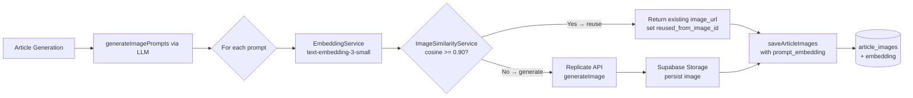
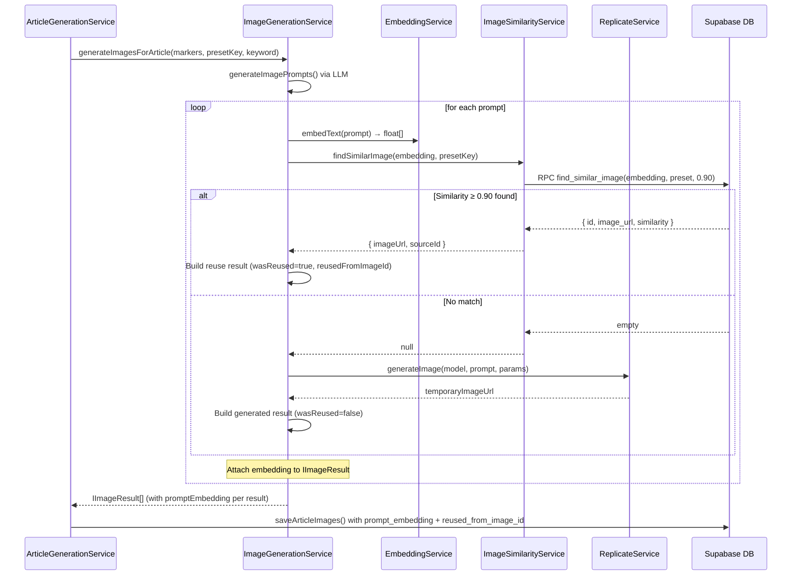

# PRD: Image Semantic Reuse via Prompt Embeddings

**Status:** Ready for Implementation
**Complexity:** 8 → HIGH (mandatory checkpoints every phase)

---

## Complexity Assessment

```
+3  Touches 10+ files (3 migrations, 2 new services, 2 modified services, types, backfill script)
+2  New system/module from scratch (embedding service, similarity service)
+1  Database schema changes (pgvector columns + SQL function)
+1  External API integration (OpenAI Embeddings API)
+1  Multiple phases with DB + service + integration concerns
─────
= 8 → HIGH mode
```

---

## 1. Context

**Problem:** Every article image is freshly generated via Replicate (at cost), even when a nearly identical prompt was used before — wasting money on semantically duplicate image generation.

**Files Analyzed:**

- `server/services/image-generation.service.ts` — orchestrates prompt generation + Replicate calls
- `server/services/article-generation.service.ts` — saves article images to DB via `saveArticleImages()`
- `server/services/image-storage.service.ts` — persists images to Supabase Storage
- `server/services/replicate.service.ts` — Replicate API client
- `supabase/migrations/20260207000000_create_article_images_table.sql` — `article_images` schema
- `shared/config/env.ts` — `OPENAI_API_KEY` already present (line 229)
- `shared/types/article.types.ts` — `IArticleImage`, `IImageResult`
- `shared/config/image-models.config.ts` — preset config

**Current Behavior:**

- LLM generates a text prompt per image marker based on section context + keyword
- Replicate is called unconditionally for every prompt, regardless of prior similar generations
- `article_images` table stores prompt text but no vector representation
- No deduplication or reuse path exists anywhere in the pipeline
- `OPENAI_API_KEY` is already wired in `serverEnv` but unused for images

---

## 2. Solution

**Approach:**

1. Add `prompt_embedding vector(1536)` and `reused_from_image_id` to `article_images`
2. Create `EmbeddingService` using OpenAI `text-embedding-3-small` (already-available API key)
3. Create `ImageSimilarityService` that queries pgvector for cosine similarity ≥ 0.90
4. In `ImageGenerationService.generateImagesForArticle()`: before each Replicate call, embed the prompt and search for similar existing images; reuse if found
5. Backfill existing `article_images` records with embeddings asynchronously

**Integration Points Checklist:**

```
Entry point: image-generation.service.ts → generateImagesForArticle()
Caller file: server/services/article-generation.service.ts (calls generateImagesForArticle)
Wiring needed: inject ImageSimilarityService into ImageGenerationService

User-facing: NO — fully internal optimization
Trigger: every article generation that includes images
Result: fewer Replicate API calls; same article output quality
```

**Architecture Diagram:**



**Key Decisions:**

- **pgvector in Supabase** — no new infra, same DB, HNSW index for fast ANN search
- **text-embedding-3-small** — 1536 dimensions, $0.02/1M tokens, already-available API key
- **Cosine similarity threshold: 0.90** — strict, high-relevance reuse only
- **Global library** — search across ALL `article_images` (cross-user), maximizes savings
- **Same credit cost** — transparent to users; only we save on Replicate API spend
- **Preset-scoped** — similarity search filtered by `preset_key` to avoid mixing quality tiers

**Data Changes:**

```sql
-- New columns on article_images
prompt_embedding vector(1536)         -- nullable; set after generation/reuse
reused_from_image_id uuid             -- FK → article_images.id (null = freshly generated)

-- New SQL function
find_similar_image(embedding, preset_key, threshold) → table(id, image_url, prompt, similarity)
```

---

## 3. Sequence Flow



---

## 4. Execution Phases

---

### Phase 1: Database Foundation — pgvector columns + similarity search function

**Files (4):**

- `supabase/migrations/20260225000000_enable_pgvector.sql` — enable extension + add columns
- `supabase/migrations/20260225000100_add_image_similarity_function.sql` — SQL function

**Implementation:**

- [ ] Create migration `20260225000000_enable_pgvector.sql`:

  ```sql
  -- Enable pgvector (idempotent)
  CREATE EXTENSION IF NOT EXISTS vector;

  -- Add embedding column
  ALTER TABLE article_images
    ADD COLUMN IF NOT EXISTS prompt_embedding vector(1536),
    ADD COLUMN IF NOT EXISTS reused_from_image_id uuid REFERENCES article_images(id) ON DELETE SET NULL;

  -- HNSW index for approximate nearest-neighbor cosine search
  -- m=16, ef_construction=64 are pgvector defaults — good starting point
  CREATE INDEX IF NOT EXISTS article_images_embedding_hnsw_idx
    ON article_images
    USING hnsw (prompt_embedding vector_cosine_ops)
    WITH (m = 16, ef_construction = 64);

  -- Index for reuse tracking queries
  CREATE INDEX IF NOT EXISTS article_images_reused_from_idx
    ON article_images (reused_from_image_id)
    WHERE reused_from_image_id IS NOT NULL;
  ```

- [ ] Create migration `20260225000100_add_image_similarity_function.sql`:
  ```sql
  CREATE OR REPLACE FUNCTION find_similar_image(
    query_embedding vector(1536),
    p_preset_key    text,
    similarity_threshold float DEFAULT 0.90,
    max_results     int DEFAULT 1
  )
  RETURNS TABLE (
    id              uuid,
    image_url       text,
    prompt          text,
    similarity      float
  )
  LANGUAGE sql
  STABLE
  AS $$
    SELECT
      ai.id,
      ai.image_url,
      ai.prompt,
      1 - (ai.prompt_embedding <=> query_embedding) AS similarity
    FROM article_images ai
    WHERE
      ai.status         = 'completed'
      AND ai.image_url  IS NOT NULL
      AND ai.preset_key = p_preset_key
      AND ai.prompt_embedding IS NOT NULL
      AND ai.reused_from_image_id IS NULL  -- only search originals, not re-uses
      AND 1 - (ai.prompt_embedding <=> query_embedding) >= similarity_threshold
    ORDER BY ai.prompt_embedding <=> query_embedding
    LIMIT max_results;
  $$;
  ```

**Tests Required:**

| Test File                                | Test Name                                            | Assertion                                       |
| ---------------------------------------- | ---------------------------------------------------- | ----------------------------------------------- |
| `tests/api/image-similarity.api.spec.ts` | `find_similar_image returns match above threshold`   | Supabase RPC returns row when similarity ≥ 0.90 |
| `tests/api/image-similarity.api.spec.ts` | `find_similar_image returns nothing below threshold` | Empty result when vectors are orthogonal        |
| `tests/api/image-similarity.api.spec.ts` | `find_similar_image filters by preset_key`           | Returns only rows with matching preset          |

**Verification Plan:**

1. Run migration locally: `npx supabase db push`
2. Verify columns exist:
   ```sql
   SELECT column_name, data_type FROM information_schema.columns
   WHERE table_name = 'article_images'
     AND column_name IN ('prompt_embedding', 'reused_from_image_id');
   ```
3. Verify function exists:
   ```sql
   SELECT proname FROM pg_proc WHERE proname = 'find_similar_image';
   ```
4. Verify HNSW index:
   ```sql
   SELECT indexname FROM pg_indexes
   WHERE tablename = 'article_images'
     AND indexname = 'article_images_embedding_hnsw_idx';
   ```

---

### Phase 2: Embedding Service — OpenAI text-embedding-3-small client

**Files (1):**

- `server/services/embedding.service.ts` — new service

**Implementation:**

- [ ] Create `server/services/embedding.service.ts`:

```typescript
/**
 * Embedding Service
 *
 * Generates text embeddings via OpenAI text-embedding-3-small.
 * Used for semantic image prompt similarity search.
 */
import { serverEnv } from '@shared/config/env';

const OPENAI_EMBEDDING_URL = 'https://api.openai.com/v1/embeddings';
const EMBEDDING_MODEL = 'text-embedding-3-small';
const EMBEDDING_DIMENSIONS = 1536;

export interface IEmbeddingResult {
  embedding: number[];
  model: string;
  tokenCount: number;
}

export class EmbeddingService {
  /**
   * Generate a single text embedding.
   * Returns null (no throw) if API key is missing or request fails — caller
   * must treat null as "skip similarity check, go straight to generation".
   */
  async embedText(text: string): Promise<number[] | null> {
    const apiKey = serverEnv.OPENAI_API_KEY;
    if (!apiKey) {
      console.warn('[EmbeddingService] OPENAI_API_KEY not configured — skipping embedding');
      return null;
    }

    try {
      const response = await fetch(OPENAI_EMBEDDING_URL, {
        method: 'POST',
        headers: {
          Authorization: `Bearer ${apiKey}`,
          'Content-Type': 'application/json',
        },
        body: JSON.stringify({
          model: EMBEDDING_MODEL,
          input: text,
          dimensions: EMBEDDING_DIMENSIONS,
        }),
      });

      if (!response.ok) {
        const error = await response.text();
        throw new Error(`OpenAI embedding API error ${response.status}: ${error}`);
      }

      const data = (await response.json()) as {
        data: Array<{ embedding: number[] }>;
        usage: { total_tokens: number };
        model: string;
      };

      return data.data[0].embedding;
    } catch (error) {
      console.error('[EmbeddingService] Failed to generate embedding:', error);
      return null; // Graceful degradation — caller falls back to generation
    }
  }

  /**
   * Embed multiple texts in a single API call (batch mode).
   * More efficient than N individual calls.
   */
  async embedBatch(texts: string[]): Promise<(number[] | null)[]> {
    if (texts.length === 0) return [];

    const apiKey = serverEnv.OPENAI_API_KEY;
    if (!apiKey) {
      console.warn('[EmbeddingService] OPENAI_API_KEY not configured — skipping batch embedding');
      return texts.map(() => null);
    }

    try {
      const response = await fetch(OPENAI_EMBEDDING_URL, {
        method: 'POST',
        headers: {
          Authorization: `Bearer ${apiKey}`,
          'Content-Type': 'application/json',
        },
        body: JSON.stringify({
          model: EMBEDDING_MODEL,
          input: texts,
          dimensions: EMBEDDING_DIMENSIONS,
        }),
      });

      if (!response.ok) {
        const error = await response.text();
        throw new Error(`OpenAI embedding API error ${response.status}: ${error}`);
      }

      const data = (await response.json()) as {
        data: Array<{ index: number; embedding: number[] }>;
        usage: { total_tokens: number };
      };

      // Sort by index to ensure order matches input
      const sorted = data.data.sort((a, b) => a.index - b.index);
      return sorted.map(item => item.embedding);
    } catch (error) {
      console.error('[EmbeddingService] Failed to batch embed:', error);
      return texts.map(() => null); // Graceful degradation
    }
  }
}

export const embeddingService = new EmbeddingService();
```

**Tests Required:**

| Test File                              | Test Name                                            | Assertion                          |
| -------------------------------------- | ---------------------------------------------------- | ---------------------------------- |
| `tests/unit/embedding.service.spec.ts` | `embedText returns null when OPENAI_API_KEY missing` | Returns `null` without throwing    |
| `tests/unit/embedding.service.spec.ts` | `embedText returns 1536-dim vector on success`       | `embedding.length === 1536`        |
| `tests/unit/embedding.service.spec.ts` | `embedBatch returns array with same length as input` | Output length matches input length |
| `tests/unit/embedding.service.spec.ts` | `embedText returns null on API error`                | Returns `null`, logs error         |

**Verification Plan:**

```bash
# If OPENAI_API_KEY is set, smoke-test embedding endpoint directly:
curl -s https://api.openai.com/v1/embeddings \
  -H "Authorization: Bearer $OPENAI_API_KEY" \
  -H "Content-Type: application/json" \
  -d '{"model":"text-embedding-3-small","input":"test prompt","dimensions":1536}' \
  | jq '.data[0].embedding | length'
# Expected: 1536
```

---

### Phase 3: Image Similarity Service — pgvector search wrapper

**Files (1):**

- `server/services/image-similarity.service.ts` — new service

**Implementation:**

- [ ] Create `server/services/image-similarity.service.ts`:

```typescript
/**
 * Image Similarity Service
 *
 * Finds visually similar images in the global library using pgvector cosine
 * similarity search on prompt embeddings.
 */
import { supabaseAdmin } from '@server/supabase/admin';
import { embeddingService } from './embedding.service';
import type { ImagePresetKey } from '@shared/config/image-models.config';

export const SIMILARITY_THRESHOLD = 0.9;

export interface ISimilarImageMatch {
  id: string;
  imageUrl: string;
  prompt: string;
  similarity: number;
}

export class ImageSimilarityService {
  /**
   * Given a prompt and its pre-computed embedding, find the best matching
   * image in the global library (cosine similarity ≥ SIMILARITY_THRESHOLD).
   *
   * Returns null if:
   * - No match above threshold
   * - embedding is null (API key missing or embed failed)
   */
  async findSimilarImage(
    embedding: number[] | null,
    presetKey: ImagePresetKey
  ): Promise<ISimilarImageMatch | null> {
    if (!embedding) return null;

    try {
      const { data, error } = await supabaseAdmin.rpc('find_similar_image', {
        query_embedding: embedding,
        p_preset_key: presetKey,
        similarity_threshold: SIMILARITY_THRESHOLD,
        max_results: 1,
      });

      if (error) {
        console.error('[ImageSimilarity] RPC error:', error.message);
        return null;
      }

      if (!data || data.length === 0) return null;

      const match = data[0] as {
        id: string;
        image_url: string;
        prompt: string;
        similarity: number;
      };

      console.log(
        `[ImageSimilarity] Found reusable image (similarity=${match.similarity.toFixed(4)}) ` +
          `for preset=${presetKey}`
      );

      return {
        id: match.id,
        imageUrl: match.image_url,
        prompt: match.prompt,
        similarity: match.similarity,
      };
    } catch (error) {
      console.error('[ImageSimilarity] Unexpected error during similarity search:', error);
      return null; // Graceful degradation
    }
  }
}

export const imageSimilarityService = new ImageSimilarityService();
```

**Tests Required:**

| Test File                                     | Test Name                                              | Assertion                                        |
| --------------------------------------------- | ------------------------------------------------------ | ------------------------------------------------ |
| `tests/unit/image-similarity.service.spec.ts` | `findSimilarImage returns null when embedding is null` | Returns `null` without RPC call                  |
| `tests/unit/image-similarity.service.spec.ts` | `findSimilarImage returns null when RPC returns empty` | Returns `null`                                   |
| `tests/unit/image-similarity.service.spec.ts` | `findSimilarImage returns match when RPC returns data` | Returns `ISimilarImageMatch` with correct fields |
| `tests/unit/image-similarity.service.spec.ts` | `findSimilarImage returns null on RPC error`           | Logs error, returns `null` (no throw)            |

**Verification Plan:**

Integration test via curl (after Phase 1 migration and seeding a test row with a known embedding):

```bash
# Seed a row with a known embedding, then call RPC directly
npx supabase db shell --local <<'SQL'
  SELECT * FROM find_similar_image(
    (SELECT prompt_embedding FROM article_images LIMIT 1),
    'balanced',
    0.90,
    1
  );
SQL
```

---

### Phase 4: Integration — Wire similarity check into image generation flow

**Files (4):**

- `server/services/image-generation.service.ts` — add similarity check before Replicate
- `server/services/article-generation.service.ts` — persist `prompt_embedding` + `reused_from_image_id`
- `shared/types/article.types.ts` — extend `IImageResult` with reuse metadata

**Implementation:**

#### 4a. Extend `IImageResult` in `image-generation.service.ts`

```typescript
export interface IImageResult {
  position: number;
  imageUrl: string | null;
  prompt: string;
  model: string;
  presetKey: ImagePresetKey;
  status: 'completed' | 'failed';
  error?: string;
  generationTimeMs?: number;
  replicatePredictionId?: string;
  // NEW — semantic reuse metadata
  promptEmbedding: number[] | null; // Always set if embedding API responded
  wasReused: boolean; // true = from library, false = freshly generated
  reusedFromImageId: string | null; // set when wasReused=true
}
```

#### 4b. Inject similarity service + embed prompts in batch before the generation loop

In `generateImagesForArticle()`, replace the generation loop:

```typescript
// Step 2: Embed all prompts in a single batch API call
const embeddings = await this.embeddingService.embedBatch(prompts);

// Step 3: Generate images (reuse if similar found, else Replicate)
const results: IImageResult[] = [];
const delays = [0, 3000, 5000, 10000];

for (let i = 0; i < markers.length; i++) {
  const marker = markers[i];
  const prompt = prompts[i] || getFallbackImagePrompt(keyword, marker.sectionContext);
  const embedding = embeddings[i] ?? null;

  // Check similarity library before calling Replicate
  const match = await this.imageSimilarityService.findSimilarImage(embedding, presetKey);

  if (match) {
    // Reuse existing image — no Replicate call
    results.push({
      position: marker.position,
      imageUrl: match.imageUrl,
      prompt,
      model: getImagePreset(presetKey).replicateModel,
      presetKey,
      status: 'completed',
      promptEmbedding: embedding,
      wasReused: true,
      reusedFromImageId: match.id,
    });
    console.log(
      `[ImageGeneration] Image ${marker.position} reused from library (similarity=${match.similarity.toFixed(4)})`
    );
    continue;
  }

  // No match — generate fresh via Replicate
  const delay = delays[Math.min(i - /* count non-reused preceding */ 0, delays.length - 1)];
  if (delay > 0) {
    console.log(`[ImageGeneration] Waiting ${delay}ms before image ${i + 1}`);
    await this.sleep(delay);
  }

  try {
    const result = await this.generateSingleImage(marker, prompt, presetKey);
    results.push({
      ...result,
      promptEmbedding: embedding,
      wasReused: false,
      reusedFromImageId: null,
    });
  } catch (error) {
    results.push({
      position: marker.position,
      imageUrl: null,
      prompt,
      model: getImagePreset(presetKey).replicateModel,
      presetKey,
      status: 'failed',
      error: error instanceof Error ? error.message : 'Unknown error',
      promptEmbedding: embedding,
      wasReused: false,
      reusedFromImageId: null,
    });
  }
}
```

> **Rate-limit note:** Reused images skip the Replicate call entirely. The delay counter should only increment for actual Replicate calls, not reused ones. Adjust the `delays` indexing accordingly (track `replicateCallCount` separately).

#### 4c. Persist `prompt_embedding` + `reused_from_image_id` in `saveArticleImages()`

In `article-generation.service.ts`, update the `saveArticleImages()` insert:

```typescript
private async saveArticleImages(
  articleId: string,
  results: IImageResult[]
): Promise<void> {
  const rows = results.map(r => ({
    article_id: articleId,
    position: r.position,
    image_url: r.imageUrl,
    prompt: r.prompt,
    replicate_model: r.model,
    preset_key: r.presetKey,
    status: r.status,
    error: r.error ?? null,
    replicate_prediction_id: r.replicatePredictionId ?? null,
    generation_time_ms: r.generationTimeMs ?? null,
    // NEW fields
    prompt_embedding: r.promptEmbedding ?? null,
    reused_from_image_id: r.reusedFromImageId ?? null,
  }));

  const { error } = await supabaseAdmin
    .from('article_images')
    .insert(rows);

  if (error) {
    throw new Error(`Failed to save article images: ${error.message}`);
  }
}
```

**Tests Required:**

| Test File                                     | Test Name                                                           | Assertion                                                               |
| --------------------------------------------- | ------------------------------------------------------------------- | ----------------------------------------------------------------------- |
| `tests/unit/image-generation.service.spec.ts` | `generateImagesForArticle reuses image when similarity match found` | No Replicate call; result has `wasReused=true`, `reusedFromImageId` set |
| `tests/unit/image-generation.service.spec.ts` | `generateImagesForArticle generates fresh when no match`            | Replicate called; `wasReused=false`                                     |
| `tests/unit/image-generation.service.spec.ts` | `generateImagesForArticle handles embed failure gracefully`         | Falls through to Replicate when `embedBatch` returns null               |
| `tests/unit/image-generation.service.spec.ts` | `generateImagesForArticle skips rate-limit delay for reused images` | Delay only applied before actual Replicate calls                        |
| `tests/api/article-generation.api.spec.ts`    | `article with images saves prompt_embedding on article_images`      | DB row has non-null `prompt_embedding`                                  |

**Verification Plan:**

```bash
# After generating an article with images:
curl -s http://localhost:4321/api/articles/{articleId} \
  -H "Authorization: Bearer $TEST_TOKEN" | jq '.data.article_images[0] | {prompt, reused_from_image_id}'

# Generate a second article with a similar keyword to trigger reuse:
# Check logs for: "[ImageGeneration] Image N reused from library"
# Check DB: SELECT reused_from_image_id FROM article_images WHERE article_id = '{id}';
```

---

### Phase 5: Backfill — Embed existing article_images records

**Files (1):**

- `scripts/backfill-image-embeddings.ts` — one-time batch backfill script

**Implementation:**

```typescript
/**
 * Backfill prompt embeddings for existing article_images records.
 *
 * Run once with: npx tsx scripts/backfill-image-embeddings.ts
 * Re-runnable: skips records that already have prompt_embedding set.
 */
import { supabaseAdmin } from '../server/supabase/admin';
import { embeddingService } from '../server/services/embedding.service';

const BATCH_SIZE = 100;
const DELAY_BETWEEN_BATCHES_MS = 500;

async function sleep(ms: number) {
  return new Promise(resolve => setTimeout(resolve, ms));
}

async function backfill() {
  console.log('[Backfill] Starting image embedding backfill...');

  let processed = 0;
  let page = 0;

  while (true) {
    // Fetch batch of images without embeddings
    const { data: rows, error } = await supabaseAdmin
      .from('article_images')
      .select('id, prompt')
      .eq('status', 'completed')
      .is('prompt_embedding', null)
      .not('image_url', 'is', null)
      .range(page * BATCH_SIZE, (page + 1) * BATCH_SIZE - 1)
      .order('created_at', { ascending: true });

    if (error) {
      console.error('[Backfill] Fetch error:', error.message);
      break;
    }

    if (!rows || rows.length === 0) {
      console.log('[Backfill] No more rows to process.');
      break;
    }

    // Embed all prompts in this batch
    const prompts = rows.map(r => r.prompt);
    const embeddings = await embeddingService.embedBatch(prompts);

    // Update each record
    for (let i = 0; i < rows.length; i++) {
      const embedding = embeddings[i];
      if (!embedding) {
        console.warn(`[Backfill] Failed to embed row ${rows[i].id}, skipping`);
        continue;
      }

      const { error: updateError } = await supabaseAdmin
        .from('article_images')
        .update({ prompt_embedding: embedding })
        .eq('id', rows[i].id);

      if (updateError) {
        console.warn(`[Backfill] Update failed for ${rows[i].id}: ${updateError.message}`);
      }
    }

    processed += rows.length;
    console.log(`[Backfill] Processed ${processed} rows (batch ${page + 1})`);

    if (rows.length < BATCH_SIZE) break; // Last page

    page++;
    await sleep(DELAY_BETWEEN_BATCHES_MS); // Respect OpenAI rate limits
  }

  console.log(`[Backfill] Complete. Total processed: ${processed}`);
}

backfill().catch(err => {
  console.error('[Backfill] Fatal error:', err);
  process.exit(1);
});
```

**Tests Required:**

| Test File | Test Name                                  | Assertion                                                              |
| --------- | ------------------------------------------ | ---------------------------------------------------------------------- |
| Manual    | Script runs without error on small dataset | Exits with 0                                                           |
| Manual    | Re-run is idempotent                       | No duplicate updates, `WHERE prompt_embedding IS NULL` skips done rows |

**Verification Plan:**

```bash
# Run backfill
npx tsx scripts/backfill-image-embeddings.ts

# Verify coverage
npx supabase db shell --local <<'SQL'
  SELECT
    COUNT(*) FILTER (WHERE prompt_embedding IS NOT NULL) AS with_embedding,
    COUNT(*) FILTER (WHERE prompt_embedding IS NULL AND status = 'completed') AS missing,
    COUNT(*) AS total
  FROM article_images;
SQL
```

---

## 5. Checkpoint Protocol

After each phase, spawn `prd-work-reviewer`:

```
Task({
  subagent_type: 'prd-work-reviewer',
  prompt: 'Review phase [N] of PRD at docs/PRDs/image-semantic-reuse.md',
})
```

Continue only on PASS.

---

## 6. Acceptance Criteria

- [ ] Phase 1: `prompt_embedding` and `reused_from_image_id` columns exist; `find_similar_image` RPC works
- [ ] Phase 2: `EmbeddingService.embedText()` returns 1536-dim vector; gracefully returns null on missing key
- [ ] Phase 3: `ImageSimilarityService.findSimilarImage()` returns match or null with no throws
- [ ] Phase 4: Generating an article with images that match an existing prompt skips Replicate; logs reuse; DB row has `reused_from_image_id` set
- [ ] Phase 4: Generating an article with a novel prompt still calls Replicate and stores embedding
- [ ] Phase 5: Backfill script completes; all existing completed images have `prompt_embedding` set
- [ ] All unit tests pass (`yarn test`)
- [ ] `yarn verify` passes
- [ ] No user-visible behavior changes (same images in articles, same credit cost)

---

## 7. Cost Impact Estimate

| Scenario                                    | Before                | After                                      |
| ------------------------------------------- | --------------------- | ------------------------------------------ |
| 3 images/article, 1000 articles/month       | ~3000 Replicate calls | 3000 - (reuse rate × 3000) Replicate calls |
| Embedding cost (text-embedding-3-small)     | $0                    | ~$0.003/1000 articles (negligible)         |
| Replicate flux-dev cost (est. ~$0.03/image) | $90/month             | $90 × (1 - reuse rate)                     |
| Break-even reuse rate                       | —                     | Any reuse > 0% is net positive             |

---

## 8. Future Considerations (Out of Scope)

- Analytics dashboard showing reuse rate per preset / keyword cluster
- Configurable similarity threshold per campaign
- Visual embedding (CLIP) as a hybrid signal
- Automated expiry of embeddings when images are deleted
