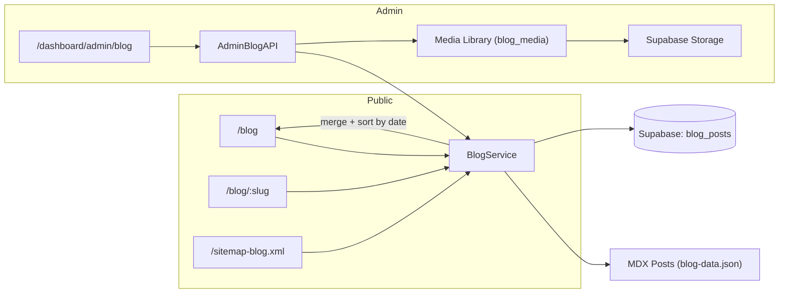
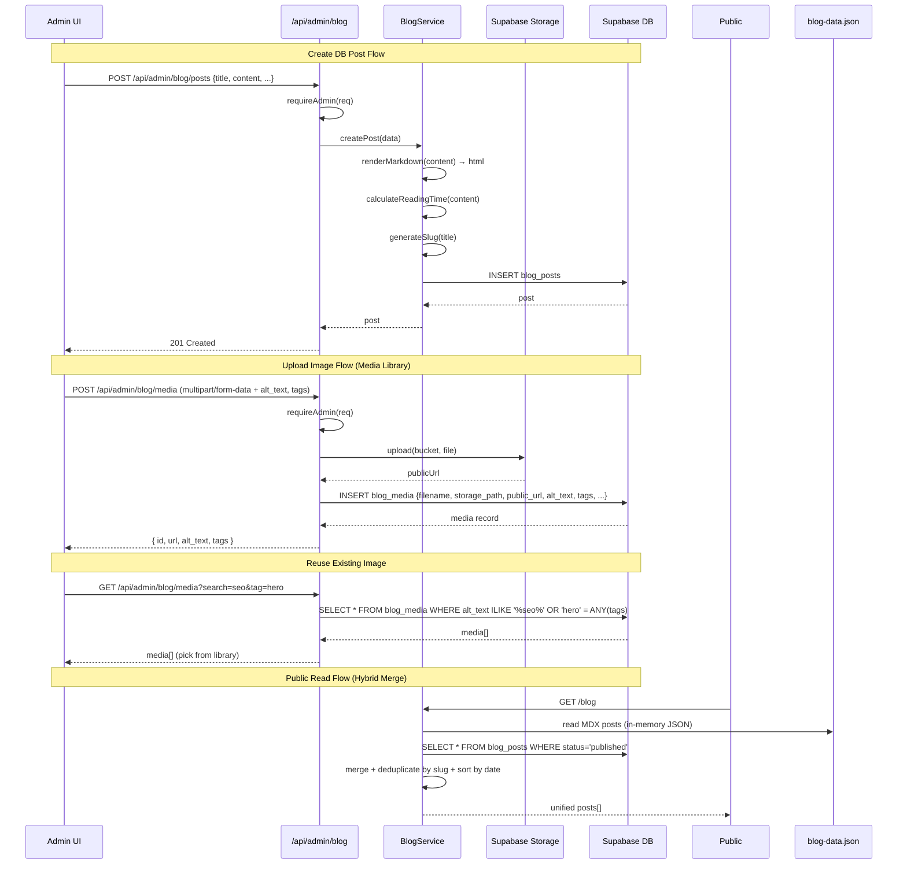

# PRD: Internal Blog CMS (Hybrid: MDX + Database)

**Complexity: 7 → HIGH mode** (10+ files, new system from scratch, DB schema changes, file upload integration)

---

## 1. Context

**Problem:** The current blog system is file-based (MDX → JSON at build time) with zero posts and no way to create/manage content from the app. The primary goal is driving SEO traffic, which requires a fast content publishing workflow accessible from the admin panel.

**Files Analyzed:**
- `server/blog.ts` - Current file-based blog service (reads from `content/blog-data.json`)
- `src/pages/blog/index.astro` - Blog listing page (SSR)
- `src/pages/blog/[slug].astro` - Blog post page (SSG with `prerender = true`)
- `src/pages/sitemap-blog.xml.ts` - Blog sitemap generator
- `client/config/dashboardRoutes.ts` - Dashboard route registry
- `client/components/admin/AdminDashboardLayout.tsx` - Admin layout wrapper
- `server/controllers/AdminController.ts` - Admin API controller pattern
- `server/middleware/requireAdmin.ts` - Admin auth guard
- `server/services/image-storage.service.ts` - Existing Supabase Storage upload pattern
- `src/pages/api/admin/users/index.ts` - Example admin API route
- `scripts/build-blog.ts` - Existing MDX build pipeline
- `content/blog-data.json` - Compiled MDX output (currently empty)

**Current Behavior:**
- Blog reads from `content/blog-data.json` (currently empty `{ posts: [] }`)
- Posts are pre-compiled MDX → HTML at build time via `scripts/build-blog.ts`
- `[slug].astro` uses `prerender = true` (SSG) - incompatible with DB-backed dynamic content
- No admin UI for content management
- Existing Supabase Storage bucket `autopilotrank-images` with upload patterns in `image-storage.service.ts`

### Design Principle: Additive & Non-Destructive

This PRD **preserves the existing MDX pipeline** and **adds** a Supabase-backed CMS alongside it. Both content sources are merged at read time, giving maximum flexibility:

- **MDX posts** (`content/blog/*.mdx`): Git-versioned, support React components, require redeploy. Best for polished technical content.
- **DB posts** (Supabase `blog_posts` table): Created via admin UI, instant publish, no redeploy. Best for quick SEO content.

No existing files are deleted. No existing behavior changes. Only new capabilities added.

### Integration Points Checklist

**How will this feature be reached?**
- [x] Entry point: `/blog` (public listing), `/blog/:slug` (public post), `/dashboard/admin/blog` (admin CRUD)
- [x] Caller file: `dashboardRoutes.ts` (admin UI registration), Astro pages (public routes)
- [x] Registration/wiring: New admin route in `dashboardRoutes.ts`, new API routes under `/api/admin/blog/`

**Is this user-facing?**
- [x] YES → Public blog pages (listing, post, category, tag) + Admin CMS panel

### UI Navigation Hooks (CRITICAL)

**Public Header Navigation:**
- [ ] Add "Blog" link to public site header (next to Pricing, etc.)
- File: `client/components/layout/Header.tsx` or equivalent navigation component
- Link target: `/blog`
- Mobile menu: Include in mobile nav drawer

**Empty State CTAs (Admin Discovery):**
- [ ] When `/blog` has no posts, show contextual empty state:
  - **For non-logged-in users**: "Check back soon for new content" + optional email signup
  - **For logged-in admins**: "No posts yet. [Create your first post →]" button linking to `/dashboard/admin/blog`
  - Detection: Use `useAuth()` hook to check `user?.role === 'admin'`
- File: `src/pages/blog/index.astro` (pass admin status to client component)

**Admin Sidebar Navigation:**
- [ ] Add "Blog" item to admin dashboard sidebar under "Content" section (or create section)
- Icon: `FileText` or `Newspaper` from lucide-react
- File: `client/components/admin/AdminDashboardLayout.tsx` or sidebar component
- Position: After "Users", before "Settings" (or logical grouping)

**Admin Dashboard Quick Access:**
- [ ] Optional: Add blog stats card to admin dashboard home (post count, drafts, recent activity)
- Helps admins discover blog management from main admin landing

**Full user flow:**
1. Admin navigates to `/dashboard/admin/blog` → sees list of all DB posts (draft + published)
2. Admin clicks "New Post" → markdown editor with title, slug, meta, category, tags, cover image upload
3. Admin writes content, uploads images, saves as draft
4. Admin clicks "Publish" → post goes live on `/blog/:slug` immediately (no redeploy)
5. Public visitors browse `/blog`, `/blog/:slug`, filter by category/tag — sees **both** MDX and DB posts merged
6. Search engines crawl `/sitemap-blog.xml` → index all posts from both sources
7. Developer can also add `.mdx` files to `content/blog/` for React-component-rich posts (published on next deploy)

---

## 2. Solution

**Approach:**
- **Keep** existing MDX pipeline (`scripts/build-blog.ts` → `content/blog-data.json`) untouched
- **Add** Supabase-backed `blog_posts` table for admin-managed posts
- **Add** `blog_categories` and `blog_post_tags` tables for taxonomy (normalized, SEO-friendly)
- **Extend** `server/blog.ts` to merge MDX posts + DB posts into a unified feed, sorted by date
- Convert `[slug].astro` from SSG (`prerender = true`) to SSR (dynamic) to support DB-backed content
- Admin CMS at `/dashboard/admin/blog` using existing `@uiw/react-md-editor` dependency
- Image upload to Supabase Storage (reuse existing bucket + patterns from `image-storage.service.ts`)
- **Media library** with `blog_media` table — track all uploaded images with metadata (alt text, tags, dimensions) so they can be reused across posts without regenerating via AI
- Essential SEO: meta title/description, canonical URLs, OG tags, Article structured data, auto-sitemap

**Architecture:**



**Key Decisions:**
- **Hybrid content sources**: MDX file posts + Supabase DB posts merged at read time. MDX posts identified by `source: 'mdx'`, DB posts by `source: 'db'`.
- **Markdown rendering**: Use `markdown-it` (already a dependency) to render DB post markdown to HTML on save. MDX posts are pre-rendered at build time.
- **Reuse `@uiw/react-md-editor`**: Already installed, used in article generation features.
- **Reuse image upload patterns**: Follow `image-storage.service.ts` approach with same bucket.
- **Media library for image reuse**: Every uploaded image is tracked in `blog_media` with metadata (alt text, tags, dimensions, file size). When inserting images into posts, admin can browse the library to pick existing images instead of uploading/generating new ones. Saves AI generation costs and keeps images consistent.
- **SSR for blog pages**: Remove `prerender = true` so DB posts can be served dynamically. MDX posts continue to work (already in memory via JSON import).
- **Reading time**: Calculate on save (server-side) for DB posts. MDX posts already have it from build.
- **Slug auto-generation**: From title, editable by admin. Slug uniqueness validated across both sources.
- **Non-destructive**: No existing files deleted. MDX pipeline preserved. Existing `server/blog.ts` exports remain backward-compatible.

**Data Changes:**

### `blog_posts` table
| Column | Type | Notes |
|--------|------|-------|
| id | uuid | PK, `gen_random_uuid()` |
| title | text | NOT NULL |
| slug | text | UNIQUE, NOT NULL, indexed |
| description | text | Meta description for SEO |
| content | text | Markdown source |
| content_html | text | Pre-rendered HTML (computed on save) |
| author | text | Author name |
| category_id | uuid | FK to `blog_categories`, nullable |
| cover_image_id | uuid | FK to `blog_media`, nullable (links to media library) |
| status | text | `'draft'` or `'published'`, default `'draft'` |
| reading_time | text | e.g., "5 min read" |
| meta_title | text | Custom SEO title (falls back to title) |
| meta_description | text | Custom SEO description (falls back to description) |
| published_at | timestamptz | Set when first published |
| created_at | timestamptz | Default `now()` |
| updated_at | timestamptz | Default `now()` |
| created_by | uuid | FK to `auth.users` (admin who created) |

### `blog_categories` table
| Column | Type | Notes |
|--------|------|-------|
| id | uuid | PK, `gen_random_uuid()` |
| name | text | UNIQUE, NOT NULL |
| slug | text | UNIQUE, NOT NULL |
| description | text | Optional category description |
| created_at | timestamptz | Default `now()` |

### `blog_media` table (Image Library)
| Column | Type | Notes |
|--------|------|-------|
| id | uuid | PK, `gen_random_uuid()` |
| filename | text | NOT NULL, original filename |
| storage_path | text | NOT NULL, path in Supabase Storage bucket |
| public_url | text | NOT NULL, full public URL |
| alt_text | text | SEO alt text, searchable |
| tags | text[] | Array of tags for filtering/search (e.g., `{'seo', 'hero', 'illustration'}`) |
| mime_type | text | e.g., `image/webp`, `image/png` |
| file_size | integer | Bytes |
| width | integer | Pixel width (nullable, extracted on upload if possible) |
| height | integer | Pixel height (nullable) |
| uploaded_by | uuid | FK to `auth.users` |
| created_at | timestamptz | Default `now()` |

This table enables:
- **Browsing** existing images when writing a post (avoid re-uploading or re-generating)
- **Searching** by alt text or tags (e.g., "find all SEO-related images")
- **Tracking usage** — knowing which images exist without scanning storage
- **Cost savings** — reuse AI-generated images across multiple posts instead of regenerating

### `blog_post_tags` junction table
| Column | Type | Notes |
|--------|------|-------|
| post_id | uuid | FK to `blog_posts`, part of composite PK |
| tag | text | Tag string, part of composite PK |

RLS: `blog_posts` with `status = 'published'` readable by everyone. `blog_media` readable by admins only. All writes require admin role.

---

## 3. Sequence Flow



---

## 4. Execution Phases

### Phase 1: Database Schema & Blog Service — "DB posts can be stored and merged with MDX posts"

**Files (5):**
- `supabase/migrations/20260213100000_create_blog_tables.sql` - Create tables, indexes, RLS
- `shared/types/blog.types.ts` - NEW: Blog TypeScript types (shared between MDX + DB)
- `server/services/blog.service.ts` - NEW: Blog service (DB CRUD + markdown rendering + merge logic)
- `server/blog.ts` - Extend to merge MDX + DB sources (preserve all existing exports)
- `tests/unit/server/services/blog.service.unit.spec.ts` - Unit tests

**Implementation:**
- [ ] Create migration with `blog_posts`, `blog_categories`, `blog_post_tags`, `blog_media` tables
- [ ] Add indexes on `blog_posts.slug`, `blog_posts.status`, `blog_posts.published_at`, `blog_media.tags` (GIN), `blog_media.alt_text` (for ILIKE search)
- [ ] RLS: public SELECT on published posts, admin-only for `blog_media` and all writes
- [ ] Define shared types: `IBlogPost` (extend existing with `source: 'mdx' | 'db'`), `IBlogCategory`, `IBlogMedia`, `IBlogPostCreate`, `IBlogPostUpdate`
- [ ] Create `BlogService` class with DB methods: `getPublishedDbPosts()`, `getDbPostBySlug()`, `getAllDbPostsAdmin()`, `createPost()`, `updatePost()`, `deletePost()`, `getCategories()`, `createCategory()`
- [ ] Use `markdown-it` for rendering DB post content → content_html
- [ ] Calculate reading time on create/update (reuse `reading-time` package already installed)
- [ ] **Extend** `server/blog.ts` with merge logic:
  - `getAllPosts()` → merge MDX posts (from JSON) + published DB posts, sorted by date desc
  - `getPostBySlug(slug)` → check DB first, fall back to MDX
  - All other existing exports (`getPostsByCategory`, `getPostsByTag`, etc.) updated to work on merged set
  - **Existing function signatures preserved** — no breaking changes

**Merge Strategy:**
```typescript
// server/blog.ts - merge logic
function mergePostSources(mdxPosts: IBlogPost[], dbPosts: IBlogPost[]): IBlogPost[] {
  const mdxWithSource = mdxPosts.map(p => ({ ...p, source: 'mdx' as const }));
  const dbWithSource = dbPosts.map(p => ({ ...p, source: 'db' as const }));
  const all = [...mdxWithSource, ...dbWithSource];
  // DB post wins on slug collision (newer content)
  const bySlug = new Map<string, IBlogPost>();
  for (const post of all) {
    if (!bySlug.has(post.slug) || post.source === 'db') {
      bySlug.set(post.slug, post);
    }
  }
  return Array.from(bySlug.values()).sort((a, b) =>
    new Date(b.date).getTime() - new Date(a.date).getTime()
  );
}
```

**Tests Required:**
| Test File | Test Name | Assertion |
|-----------|-----------|-----------|
| `tests/unit/server/services/blog.service.unit.spec.ts` | `should render markdown to html` | `expect(result.content_html).toContain('<h1>')` |
| `tests/unit/server/services/blog.service.unit.spec.ts` | `should calculate reading time` | `expect(result.reading_time).toMatch(/\d+ min read/)` |
| `tests/unit/server/services/blog.service.unit.spec.ts` | `should generate slug from title` | `expect(slug).toBe('my-blog-post-title')` |
| `tests/unit/server/services/blog.service.unit.spec.ts` | `should only return published posts for public` | `expect(posts.every(p => p.status === 'published')).toBe(true)` |
| `tests/unit/server/services/blog.service.unit.spec.ts` | `should merge MDX and DB posts sorted by date` | `expect(merged[0].date >= merged[1].date)` |
| `tests/unit/server/services/blog.service.unit.spec.ts` | `should prefer DB post on slug collision` | `expect(merged.find(p => p.slug === 'dup').source).toBe('db')` |
| `tests/unit/server/services/blog.service.unit.spec.ts` | `should return MDX posts when DB is empty` | `expect(posts).toEqual(mdxPosts)` |

**Verification Plan:**
1. Unit tests pass (`yarn test`)
2. Migration applies without error (`npx supabase migration list`)
3. `yarn verify` passes
4. Existing MDX-based blog behavior unchanged (empty JSON → empty blog, as before)

---

### Phase 2: Admin Blog API — "Admin can CRUD blog posts via API"

**Files (5):**
- `server/controllers/BlogController.ts` - NEW: Blog admin API controller (posts, categories, media)
- `src/pages/api/admin/blog/posts/index.ts` - GET list + POST create
- `src/pages/api/admin/blog/posts/[postId]/index.ts` - GET/PATCH/DELETE single post
- `src/pages/api/admin/blog/categories/index.ts` - GET list + POST create
- `src/pages/api/admin/blog/media/index.ts` - GET list (with search) + POST upload

**Implementation:**
- [ ] Create `BlogController` extending `BaseController` (follow `AdminController` pattern)
- [ ] `GET /api/admin/blog/posts` - List all DB posts (draft + published), paginated
- [ ] `POST /api/admin/blog/posts` - Create post (validate with Zod). Validate slug uniqueness across both MDX and DB sources. Accept `cover_image_id` (FK to `blog_media`).
- [ ] `GET /api/admin/blog/posts/:id` - Get single DB post (for editing), join `blog_media` for cover image URL
- [ ] `PATCH /api/admin/blog/posts/:id` - Update post (including publish/unpublish). Re-render markdown → html on content change.
- [ ] `DELETE /api/admin/blog/posts/:id` - Delete DB post (MDX posts are not deletable via API — they live in git)
- [ ] `GET /api/admin/blog/categories` - List categories
- [ ] `POST /api/admin/blog/categories` - Create category
- [ ] `POST /api/admin/blog/media` - Upload image to Supabase Storage (`blog/` prefix in bucket) + create `blog_media` record with metadata (alt_text, tags, mime_type, file_size, dimensions)
- [ ] `GET /api/admin/blog/media` - List media library, searchable by `?search=` (alt_text ILIKE) and `?tag=` (array contains). Paginated.
- [ ] `PATCH /api/admin/blog/media/:id` - Update media metadata (alt_text, tags)
- [ ] `DELETE /api/admin/blog/media/:id` - Delete media record + file from Storage
- [ ] All endpoints use `requireAdmin` middleware

**Tests Required:**
| Test File | Test Name | Assertion |
|-----------|-----------|-----------|
| `tests/unit/server/controllers/blog.controller.unit.spec.ts` | `should return 401 for unauthenticated requests` | `expect(response.status).toBe(401)` |
| `tests/unit/server/controllers/blog.controller.unit.spec.ts` | `should return 403 for non-admin users` | `expect(response.status).toBe(403)` |
| `tests/unit/server/controllers/blog.controller.unit.spec.ts` | `should create post with valid data` | `expect(response.status).toBe(201)` |
| `tests/unit/server/controllers/blog.controller.unit.spec.ts` | `should validate required fields` | `expect(response.status).toBe(400)` |
| `tests/unit/server/controllers/blog.controller.unit.spec.ts` | `should reject slug that collides with MDX post` | `expect(response.status).toBe(409)` |

**Verification Plan:**
1. Unit tests pass
2. curl commands verify API behavior:
```bash
# Create post (admin token required)
curl -X POST http://localhost:4321/api/admin/blog/posts \
  -H "Authorization: Bearer $ADMIN_TOKEN" \
  -H "Content-Type: application/json" \
  -d '{"title":"Test Post","content":"# Hello\nWorld","category":"SEO"}' | jq .
# Expected: 201 with post object

# List posts
curl http://localhost:4321/api/admin/blog/posts \
  -H "Authorization: Bearer $ADMIN_TOKEN" | jq .
# Expected: { posts: [...], total: N }
```
3. `yarn verify` passes

---

### Phase 3: Admin Blog UI — "Admin can create and manage blog posts from the dashboard"

**Files (8):**
- `client/components/pages/AdminBlogPageClient.tsx` - NEW: Blog post list + media library tabs
- `client/components/admin/BlogPostEditor.tsx` - NEW: Post editor with markdown editor + media picker
- `client/components/admin/BlogPostList.tsx` - NEW: Posts table with status, actions
- `client/components/admin/MediaLibrary.tsx` - NEW: Image library grid with search, upload, metadata editing
- `client/hooks/useAdminBlog.ts` - NEW: API hooks for blog CRUD + media library

**Navigation Hook Files (3):**
- `client/components/layout/Header.tsx` - ADD: "Blog" link in public header navigation
- `client/components/admin/AdminDashboardLayout.tsx` - ADD: "Blog" item in admin sidebar
- `client/config/dashboardRoutes.ts` - Register admin blog route

**Implementation:**
- [ ] Create `useAdminBlog` hook with: `usePosts()`, `usePost(id)`, `useCreatePost()`, `useUpdatePost()`, `useDeletePost()`, `useCategories()`, `useMedia({ search, tag })`, `useUploadMedia()`, `useUpdateMedia()`, `useDeleteMedia()`
- [ ] Create `BlogPostList` - table with columns: title, source badge (MDX/DB), status badge, category, date, actions (edit/delete — edit/delete only for DB posts)
- [ ] Create `BlogPostEditor` - form with: title, slug (auto-gen + editable), markdown editor (`@uiw/react-md-editor`), category select/create, tags input, **cover image picker** (opens media library modal OR upload new), meta title/description, status toggle
- [ ] Create `MediaLibrary` component:
  - Grid view of all uploaded images with thumbnails
  - Search bar (searches alt_text and tags)
  - Tag filter chips
  - Upload zone (drag-and-drop or click) — on upload, prompts for alt_text and tags
  - Click image to select (for cover image) or view/edit metadata
  - Edit modal: update alt_text, tags
  - Delete button (with confirmation)
  - Shows usage info: file size, dimensions, upload date
- [ ] Create `AdminBlogPageClient` - tabs: "Posts" (list + editor) and "Media" (media library)
- [ ] Register `/dashboard/admin/blog` in `dashboardRoutes.ts` as admin child route
- [ ] When inserting inline images in markdown editor, add toolbar button "Insert from Library" that opens media picker and inserts `` at cursor
- [ ] MDX posts shown in list as read-only (source badge, no edit/delete actions) for visibility

**Tests Required:**
| Test File | Test Name | Assertion |
|-----------|-----------|-----------|
| `tests/unit/client/hooks/useAdminBlog.unit.spec.ts` | `should fetch posts list` | Hook returns posts array |
| `tests/unit/client/hooks/useAdminBlog.unit.spec.ts` | `should handle create post` | Mutation calls API correctly |

**Verification Plan:**
1. Unit tests pass
2. Manual verification (HIGH complexity):
   - Navigate to `/dashboard/admin/blog` → see post list (empty DB + any MDX posts shown read-only)
   - Switch to "Media" tab → see empty media library with upload zone
   - Upload an image → fills in alt text and tags → image appears in library grid
   - Click "New Post" → editor opens
   - Click cover image picker → media library modal opens → select the uploaded image
   - Write title + content + select category → save as draft
   - Post appears in list with "Draft" badge and "DB" source badge
   - Click "Publish" → status changes to "Published"
   - Create second post → reuse the same image from media library (no re-upload needed)
3. `yarn verify` passes

---

### Phase 4: Public Blog Pages (SSR) — "Published posts from both sources are visible on /blog with full SEO"

**Files (5):**
- `src/pages/blog/index.astro` - Refactor to use merged feed (SSR)
- `src/pages/blog/[slug].astro` - Refactor to use merged feed (SSR, remove `prerender`)
- `src/pages/blog/category/[category].astro` - NEW: Category listing page
- `src/pages/blog/tag/[tag].astro` - NEW: Tag listing page
- `src/pages/sitemap-blog.xml.ts` - Refactor to use merged feed

**Implementation:**
- [ ] Refactor `blog/index.astro`: call `getAllPosts()` which now returns merged MDX+DB posts. Minimal template changes — the existing UI already works with `IBlogPostMeta`.
- [ ] Refactor `blog/[slug].astro`: remove `prerender = true` and `getStaticPaths()`, use `Astro.params.slug` dynamically, call `getPostBySlug()` (checks DB first, falls back to MDX). Add Article structured data (JSON-LD), proper OG tags, canonical URL.
- [ ] Create `blog/category/[category].astro`: list posts by category slug (from merged feed)
- [ ] Create `blog/tag/[tag].astro`: list posts by tag (from merged feed)
- [ ] Refactor `sitemap-blog.xml.ts`: `getAllPosts()` now includes both sources automatically
- [ ] Add JSON-LD Article schema to `[slug].astro` with: headline, description, author, datePublished, dateModified, image

**Tests Required:**
| Test File | Test Name | Assertion |
|-----------|-----------|-----------|
| Manual | Visit `/blog` | Shows published posts from both sources |
| Manual | Visit `/blog/:slug` (DB post) | Renders full post with SEO meta |
| Manual | Visit `/blog/:slug` (MDX post) | Still renders correctly (non-destructive) |
| Manual | View page source | JSON-LD Article schema present |
| Manual | Visit `/sitemap-blog.xml` | Contains post URLs from both sources |

**Verification Plan:**
1. Create a test post via admin, publish it
2. Visit `/blog` → post appears alongside any MDX posts
3. Visit `/blog/test-slug` → full post renders with content
4. View source → verify `<script type="application/ld+json">` with Article schema
5. Visit `/sitemap-blog.xml` → post URL listed
6. If any MDX posts exist in `content/blog/`, verify they still render correctly
7. `yarn verify` passes

---

### Phase 5: Integration Testing & Polish — "Both content sources work seamlessly together"

**Files (4):**
- `server/blog.ts` - Final polish on merge logic, add async DB fetch with graceful fallback
- `tests/integration/blog-hybrid.int.spec.ts` - NEW: Integration tests for hybrid merge
- `locales/en/blog.json` - Add any missing translation keys for admin UI
- `shared/config/security.ts` - Verify blog API routes are properly secured (not in PUBLIC_API_ROUTES)

**Implementation:**
- [ ] Add graceful fallback in `server/blog.ts`: if DB query fails (network error, cold start), return MDX-only posts with console warning (never break the public blog)
- [ ] Integration test: create DB post, verify it appears merged with MDX posts
- [ ] Integration test: verify slug collision behavior (DB wins)
- [ ] Integration test: verify draft posts don't appear in public feed
- [ ] Add translation keys for admin blog UI (post list headers, editor labels, status badges)
- [ ] Verify `/api/admin/blog/*` routes are NOT in `PUBLIC_API_ROUTES` (they shouldn't be — admin middleware handles auth)

**Tests Required:**
| Test File | Test Name | Assertion |
|-----------|-----------|-----------|
| `tests/integration/blog-hybrid.int.spec.ts` | `should merge MDX and DB posts in public feed` | Both sources present in getAllPosts() |
| `tests/integration/blog-hybrid.int.spec.ts` | `should gracefully degrade to MDX-only on DB failure` | Returns MDX posts, no throw |
| `tests/integration/blog-hybrid.int.spec.ts` | `should not expose draft DB posts publicly` | Draft posts filtered out |

**Verification Plan:**
1. All tests pass (`yarn test`)
2. `yarn build` succeeds
3. `yarn verify` passes
4. Blog works with DB posts only (no MDX)
5. Blog works with MDX posts only (no DB)
6. Blog works with both sources merged

---

## 5. Acceptance Criteria

- [ ] All 5 phases complete
- [ ] All specified tests pass
- [ ] `yarn verify` passes
- [ ] Admin can create, edit, publish, unpublish, and delete DB blog posts from `/dashboard/admin/blog`
- [ ] Admin can upload images to Supabase Storage with metadata (alt text, tags) tracked in `blog_media`
- [ ] Admin can browse/search media library and reuse images across multiple posts (no re-upload/re-generation needed)
- [ ] Admin can manage categories and tags
- [ ] Public visitors see only published posts on `/blog` (from both MDX and DB sources, merged)
- [ ] Each post page has proper SEO (meta tags, OG, canonical, JSON-LD Article schema)
- [ ] `/sitemap-blog.xml` includes all published posts from both sources
- [ ] **Existing MDX pipeline fully preserved** — `scripts/build-blog.ts`, `content/blog-data.json` untouched
- [ ] **Non-destructive** — removing all DB posts returns blog to its original MDX-only behavior
- [ ] **Graceful degradation** — if DB is unreachable, MDX posts still render
- [ ] No orphaned code (all features reachable from UI)
