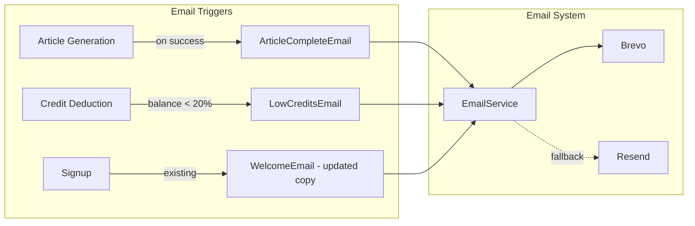
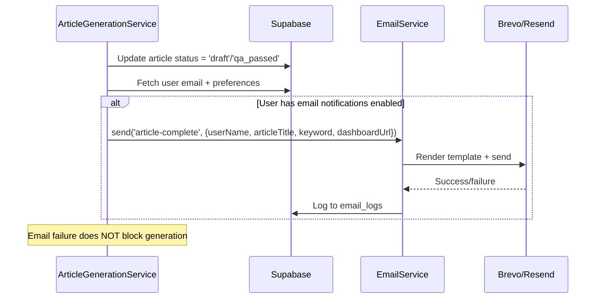
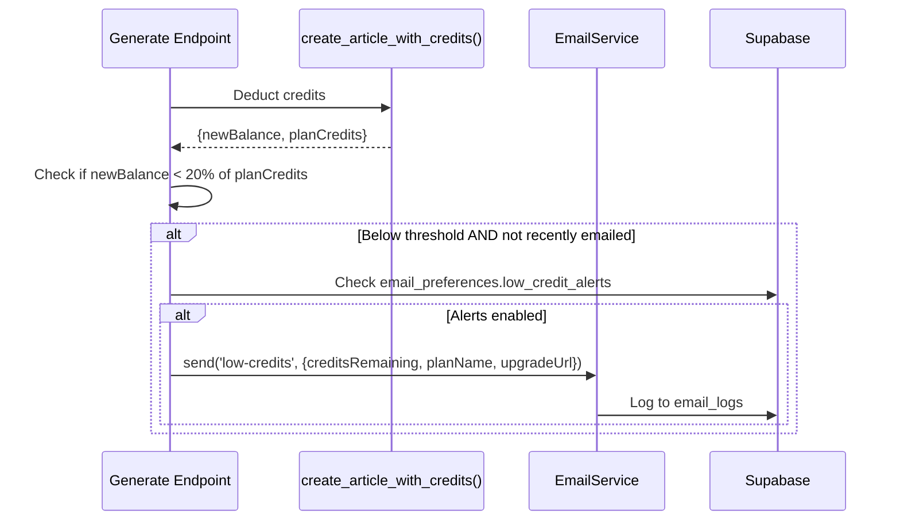
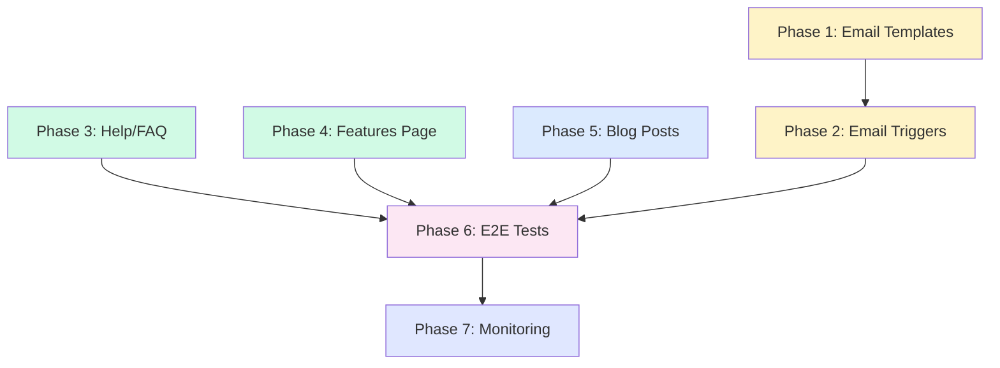

# PRD: Milestone 7 — Launch Readiness (Emails, Content, Testing, Monitoring)

> **Complexity: 9 → HIGH mode**
> **Last Updated:** 2026-02-16
> **Depends on:** Milestones 1-6 (all complete)
> **Excludes:** Stripe price ID configuration (handled separately)

---

## 1. Context

**Problem:** Milestones 1-6 built all core functionality (generation, campaigns, articles, integrations, scheduling). Milestone 7 is the launch gate — email notifications, content updates, E2E testing, and monitoring alerts must all work before early March 2026 launch.

**Files Analyzed:**

- `emails/templates/*.tsx` — 6 templates exist (welcome, payment-success, subscription-update, low-credits, password-reset, support-request)
- `server/services/email.service.ts` — EmailService with Brevo/Resend fallback
- `server/services/email-providers/base-email-provider-adapter.ts` — Template loading + subject mapping
- `server/services/article-generation.service.ts` — No email trigger after generation completes
- `client/hooks/useLowCreditWarning.ts` — Client-side toast only, threshold=2, no email trigger
- `shared/validation/email.schema.ts` — Template enum validation
- `src/pages/features.astro` + `FeaturesPageClient.tsx` — Features page exists but needs product screenshots
- `src/pages/help.astro` — Help page exists with placeholder content
- `client/components/landing/*.tsx` — Full landing page with 10 sections
- `tests/e2e/*.spec.ts` — 14 E2E test files, comprehensive page objects
- `server/monitoring/logger.ts` — Baselime integration exists
- `shared/utils/errors.ts` — Standardized error codes (32 defined)
- `docs/management/PRE-RELEASE-CHECKLIST.md` — Full pre-release checklist

**Current Behavior:**

- Welcome email exists but has stale `MyImageUpscaler` copy — needs AutopilotRank quick-start content
- Low credits email template exists but: (a) has stale copy referencing "upscaling images", (b) is never triggered automatically — only via admin manual send
- No "article generation complete" email template or trigger exists
- No server-side low-credit threshold check that triggers email
- E2E tests cover UI flows but not the full generation→review→publish pipeline
- Features page exists but shows generic feature cards, not actual product screenshots
- Help/FAQ has placeholder content from boilerplate era

---

## 2. Solution

**Approach:**

1. **Update existing email templates** (Welcome, Low Credits) with AutopilotRank-specific copy
2. **Create new ArticleCompleteEmail template** + wire into article generation pipeline
3. **Add server-side low-credit email trigger** after credit deduction (80% threshold per roadmap)
4. **Write critical-path E2E tests** for generation→review→publish flow
5. **Update features page and help/FAQ** with actual product content
6. **Add Baselime alert configuration** for generation failure monitoring

**Architecture Diagram:**



**Key Decisions:**

- [x] Reuse existing email provider infrastructure (Brevo + Resend fallback) — no new dependencies
- [x] Add `article-complete` template to existing template enum + dynamic import map
- [x] Low-credit email threshold: 20% of plan credits (roadmap says 80% threshold = 20% remaining)
- [x] Use `email_preferences.low_credit_alerts` column to respect user opt-out
- [x] E2E tests mock the generation API (can't call real AI in tests) but verify full UI flow
- [x] Blog posts written as MDX files (existing blog system supports this)

**Data Changes:**

- No new database tables or migrations needed
- Existing `email_preferences.low_credit_alerts` boolean already supports opt-out
- Existing `email_logs` table will capture new template sends

---

## 3. Sequence Flows

### Article Complete Email Trigger



### Low Credit Email Trigger



---

## 4. Execution Phases

### Phase 1: Email Template Updates — "Users receive relevant, branded emails"

**Files (5):**

- `emails/templates/WelcomeEmail.tsx` — Update copy for AutopilotRank (quick-start guide content)
- `emails/templates/LowCreditsEmail.tsx` — Update copy for AutopilotRank (article credits, not image upscaling)
- `emails/templates/ArticleCompleteEmail.tsx` — **NEW** template for generation complete notification
- `server/services/email-providers/base-email-provider-adapter.ts` — Register new template in import map + subject map
- `shared/validation/email.schema.ts` — Add `'article-complete'` to template enum

**Implementation:**

- [ ] Update `WelcomeEmail.tsx`:
  - Change default appName from `'MyImageUpscaler'` to `'AutopilotRank'`
  - Replace "start upscaling your images with our powerful AI tools" with quick-start content:
    - "You're 3 steps away from your first SEO article:"
    - "1. Create a project and connect your site"
    - "2. Add your target keywords"
    - "3. Hit Generate and watch the magic happen"
  - Replace "free credits to get started" with "3 free articles to try it out — no credit card needed"
  - CTA: "Create Your First Article" → links to `/dashboard`

- [ ] Update `LowCreditsEmail.tsx`:
  - Change default appName from `'MyImageUpscaler'` to `'AutopilotRank'`
  - Replace "upscaling images at the highest quality" with "generating SEO-optimized articles"
  - Add plan context: "You have {creditsRemaining} of your {planCredits} monthly credits remaining"
  - Add upsell: "Upgrade to get more articles per month, or buy a credit pack for instant access"
  - Two CTAs: "Upgrade Plan" → `/pricing`, "Buy Credits" → `/dashboard?view=billing`

- [ ] Create `ArticleCompleteEmail.tsx`:
  - Props: `userName`, `articleTitle`, `keyword`, `campaignName`, `dashboardUrl`, `baseUrl`, `supportEmail`, `appName`
  - Subject: `"Your article is ready: {articleTitle}"`
  - Body: "Your article for '{keyword}' has been generated and is ready for review."
  - Include campaign name if provided
  - CTA: "Review Article" → `{dashboardUrl}` (deep link to article)
  - Follow existing template structure (header, content, footer, same styles)

- [ ] Register `article-complete` in `base-email-provider-adapter.ts`:
  - Add to `templateExportNames`: `'article-complete': 'ArticleCompleteEmail'`
  - Add to `templates` dynamic import map: `'article-complete': () => import('@/emails/templates/ArticleCompleteEmail')`
  - Add to `subjects`: `'article-complete': (d) => \`Your article is ready: \${d.articleTitle || 'New Article'}\``

- [ ] Add `'article-complete'` to template enum in `shared/validation/email.schema.ts`

**Tests Required:**

| Test File                                                  | Test Name                                                       | Assertion                                                          |
| ---------------------------------------------------------- | --------------------------------------------------------------- | ------------------------------------------------------------------ |
| `tests/unit/emails/article-complete-email.unit.spec.ts`    | `should render ArticleCompleteEmail with all props`             | Template renders without errors, contains articleTitle and keyword |
| `tests/unit/emails/article-complete-email.unit.spec.ts`    | `should render ArticleCompleteEmail with minimal props`         | Template renders with only required props (baseUrl, supportEmail)  |
| `tests/unit/emails/welcome-email-updated.unit.spec.ts`     | `should render updated WelcomeEmail with AutopilotRank content` | Contains "3 steps", "SEO article", not "upscaling"                 |
| `tests/unit/emails/low-credits-email-updated.unit.spec.ts` | `should render updated LowCreditsEmail with article context`    | Contains "articles", not "upscaling images"                        |

**Verification Plan:**

1. **Unit Tests:** Render each template with `@react-email/render` and verify HTML output
2. **Evidence:** `yarn test` passes for all email template tests
3. **Manual:** Preview templates via email preview route if available

---

### Phase 2: Email Triggers — "Emails are sent automatically at the right moments"

**Files (4):**

- `server/services/article-generation.service.ts` — Add email trigger after successful generation
- `src/pages/api/articles/generate.ts` — Add low-credit email check after credit deduction
- `server/services/email.service.ts` — Add helper methods for new notification types
- `shared/constants/credit-costs.constants.ts` — Add low-credit email threshold constant

**Implementation:**

- [ ] Add `LOW_CREDIT_EMAIL_THRESHOLD_PERCENT = 0.20` to `shared/constants/credit-costs.constants.ts`
  - This means: send email when remaining credits < 20% of plan allocation

- [ ] Add `sendArticleCompleteNotification()` method to `EmailService`:

  ```typescript
  async sendArticleCompleteNotification(params: {
    userId: string;
    email: string;
    userName: string;
    articleTitle: string;
    keyword: string;
    campaignName?: string;
    articleId: string;
  }): Promise<void>
  ```

  - Sends `article-complete` template
  - Type: `transactional` (not marketing — user initiated the generation)
  - Wraps in try/catch — email failure must NEVER block generation

- [ ] Add `sendLowCreditAlert()` method to `EmailService`:

  ```typescript
  async sendLowCreditAlert(params: {
    userId: string;
    email: string;
    userName: string;
    creditsRemaining: number;
    planCredits: number;
    planName: string;
  }): Promise<void>
  ```

  - Sends `low-credits` template
  - Type: `marketing` (respects `email_preferences.low_credit_alerts`)
  - Check `email_logs` to avoid sending more than once per 24h for same user

- [ ] Wire article complete email in `article-generation.service.ts`:
  - After successful article update (line ~291, after auto-delivery block)
  - Fetch user profile (email, display_name) from Supabase
  - Call `emailService.sendArticleCompleteNotification()`
  - Wrap in try/catch — log error but don't throw

- [ ] Wire low-credit check in `src/pages/api/articles/generate.ts`:
  - After `create_article_with_credits()` returns new balance
  - Calculate threshold: `planCredits * LOW_CREDIT_EMAIL_THRESHOLD_PERCENT`
  - If `newBalance > 0 && newBalance <= threshold`, trigger low-credit email
  - Use `ctx.waitUntil()` to not block the response
  - Check `email_logs` for recent low-credit email to this user (< 24h) to avoid spam

**Tests Required:**

| Test File                                                | Test Name                                                        | Assertion                                                 |
| -------------------------------------------------------- | ---------------------------------------------------------------- | --------------------------------------------------------- |
| `tests/unit/server/services/email-triggers.unit.spec.ts` | `should send article-complete email after successful generation` | `emailService.send` called with correct template and data |
| `tests/unit/server/services/email-triggers.unit.spec.ts` | `should not throw if article-complete email fails`               | Generation completes even if email throws                 |
| `tests/unit/server/services/email-triggers.unit.spec.ts` | `should send low-credit email when balance below 20%`            | Email sent when 5/30 credits remain (starter plan)        |
| `tests/unit/server/services/email-triggers.unit.spec.ts` | `should not send low-credit email when balance above 20%`        | No email when 10/30 credits remain                        |
| `tests/unit/server/services/email-triggers.unit.spec.ts` | `should not send duplicate low-credit email within 24h`          | Check email_logs query                                    |
| `tests/unit/server/services/email-triggers.unit.spec.ts` | `should respect email_preferences.low_credit_alerts=false`       | No email when opted out                                   |

**Verification Plan:**

1. **Unit Tests:** Mock EmailService, verify triggers fire at correct moments
2. **Integration:** Verify email_logs entries created with correct template names
3. **Evidence:** `yarn test` passes, `yarn verify` passes

---

### Phase 3: Help/FAQ Content Update — "Help page reflects actual product"

**Files (3):**

- `src/pages/help.astro` — Update quick links and FAQ content
- `client/components/landing/FAQSection.tsx` — Verify/update FAQ answers for accuracy
- `locales/en/help.json` — Update i18n strings (if help page uses translations)

**Implementation:**

- [ ] Update `help.astro` Getting Started section with actual quick-start steps:
  - "Create a Project" — Connect your website (WordPress, webhook, or manual)
  - "Add Keywords" — Enter keywords manually or upload CSV
  - "Generate Articles" — Choose AI model and content settings, hit Generate
  - "Review & Publish" — Edit in Markdown editor, approve, auto-publish to CMS

- [ ] Update Credits & Billing section:
  - "How credits work" — 1-5 credits per article depending on model preset
  - "Subscription plans" — Starter (30/mo), Growth (100/mo), Agency (500/mo)
  - "Credit packs" — Buy extra credits anytime (10/$9.99, 25/$19.99, 50/$34.99)
  - "Rollover" — Unused credits roll over (up to 3x monthly limit)

- [ ] Update Technical Support section:
  - "Supported CMS" — WordPress (native), Webhook (Shopify, Webflow, Ghost, custom)
  - "AI Models" — GPT-4o, Claude Sonnet, Gemini Flash (via OpenRouter)
  - "Google Search Console" — Connect for keyword opportunities
  - "Scheduling" — 8 frequency options from 3x daily to every 2 weeks

- [ ] Verify `FAQSection.tsx` answers are accurate:
  - FAQ 1 about Google penalties — keep (accurate)
  - FAQ 2 about Outrank differences — verify claims match current features
  - FAQ 3 about technical skills — keep (accurate)
  - FAQ 4 about CMS platforms — verify list matches implemented integrations
  - FAQ 5 about content review — verify approval workflow matches implementation
  - FAQ 6 about refund policy — keep (business decision)

**Tests Required:**

| Test File                       | Test Name                                     | Assertion                                  |
| ------------------------------- | --------------------------------------------- | ------------------------------------------ |
| `tests/e2e/landing.e2e.spec.ts` | `should display updated FAQ content`          | FAQ section visible with correct Q&A count |
| Existing help page test         | `should load help page with updated sections` | Quick links and content sections render    |

**Verification Plan:**

1. **E2E:** Existing landing page tests verify FAQ renders
2. **Manual:** Visual review of help page content accuracy
3. **Evidence:** `yarn verify` passes

---

### Phase 4: Features Page Polish — "Features page shows real product capabilities"

**Files (2):**

- `client/components/pages/FeaturesPageClient.tsx` — Update feature descriptions to match actual product
- `src/pages/features.astro` — Update meta description if needed

**Implementation:**

- [ ] Review and update `FeaturesPageClient.tsx` feature cards to reflect actual shipped features:
  - **Multi-Model AI Engine** — "Choose from GPT-4o, Claude Sonnet, or Gemini Flash. Each model brings unique strengths to your content."
  - **Built-in Humanizer** — "24+ AI pattern avoidance techniques built into every article. No post-processing needed."
  - **Campaign Management** — "Organize keywords into campaigns. Bulk generate, track progress, auto-complete."
  - **WordPress Publishing** — "Native WordPress integration with Application Passwords. Publish directly from your dashboard."
  - **Webhook Integrations** — "Connect Shopify, Webflow, Ghost, or any platform via webhook with HMAC signing."
  - **GSC Integration** — "Connect Google Search Console to discover keyword opportunities from your real traffic data."
  - **Smart Scheduling** — "Drip-feed content with 8 frequency options. Timezone-aware, auto-pause on low credits."
  - **SEO Scoring** — "Keyword density, heading structure, word count analysis on every article."

- [ ] Add "How It Works" section if not present:
  - Step 1: Connect your site → Step 2: Add keywords → Step 3: Generate → Step 4: Review & Publish

- [ ] Note: Product screenshots/GIFs require actual running product — document placeholder approach:
  - Use placeholder hero images referencing dashboard screenshots
  - Mark screenshot slots with `TODO: Replace with production screenshots` comments
  - Screenshots can be captured from staging after deployment

**Tests Required:**

| Test File                      | Test Name                                                | Assertion                                      |
| ------------------------------ | -------------------------------------------------------- | ---------------------------------------------- |
| Existing features E2E (if any) | `should display feature cards with updated descriptions` | Features page loads, key feature names visible |

**Verification Plan:**

1. **Visual:** Features page loads with updated cards
2. **Evidence:** `yarn verify` passes

---

### Phase 5: Blog Posts — "Launch blog content exists for organic discovery"

**Files (3-4):**

- `src/content/blog/why-ai-seo-content.mdx` — **NEW** "Why AI SEO Content Works in 2026"
- `src/content/blog/autopilotrank-vs-outrank.mdx` — **NEW** "AutopilotRank vs Outrank: Feature Comparison"
- `src/content/blog/introducing-autopilotrank.mdx` — **NEW** Product announcement post

**Implementation:**

- [ ] Create `why-ai-seo-content.mdx`:
  - Frontmatter: title, description, date, author, category="Guides", tags=["SEO", "AI Content", "Content Marketing"]
  - Content: Why AI-generated content ranks (Google's stance), quality signals, humanizer importance
  - Word count: 1,200-1,500 words
  - Include internal links to `/features` and `/pricing`

- [ ] Create `autopilotrank-vs-outrank.mdx`:
  - Frontmatter: category="Comparisons", tags=["Outrank", "Comparison", "AI SEO Tools"]
  - Content: Feature-by-feature comparison table, pricing comparison, key differentiators
  - Differentiators: multi-model AI, built-in humanizer, GSC integration, 3x content at same price
  - Word count: 1,000-1,200 words
  - Include CTAs to `/pricing`

- [ ] Create `introducing-autopilotrank.mdx`:
  - Frontmatter: category="Product", tags=["Launch", "Product Announcement"]
  - Content: What AutopilotRank does, who it's for, key features, pricing summary, getting started
  - Word count: 800-1,000 words
  - Include CTA to sign up

- [ ] Verify blog index page (`src/pages/blog/index.astro`) correctly renders new posts
- [ ] Verify blog post detail page (`src/pages/blog/[slug].astro`) renders MDX correctly

**Tests Required:**

| Test File                                             | Test Name                                 | Assertion                                         |
| ----------------------------------------------------- | ----------------------------------------- | ------------------------------------------------- |
| `tests/e2e/blog.e2e.spec.ts` (new or extend existing) | `should display blog posts on index page` | Blog index shows at least 3 posts                 |
| `tests/e2e/blog.e2e.spec.ts`                          | `should render blog post detail page`     | Individual blog post loads with title and content |

**Verification Plan:**

1. **Build:** `yarn build` succeeds with new MDX files
2. **E2E:** Blog index and detail pages load
3. **Manual:** Content review for accuracy
4. **Evidence:** `yarn verify` passes

---

### Phase 6: E2E Critical Path Tests — "Full user journey tested end-to-end"

**Files (3):**

- `tests/e2e/critical-path.e2e.spec.ts` — **NEW** Full journey: campaign → generate → review → publish
- `tests/e2e/billing-flow.e2e.spec.ts` — **NEW** Credit deduction and purchase verification
- `tests/e2e/mobile-responsive.e2e.spec.ts` — **NEW** Mobile checks on new/updated pages

**Implementation:**

- [ ] Create `critical-path.e2e.spec.ts`:
  - **Test: "Full article lifecycle"**
    - Navigate to campaigns view
    - Create new campaign via modal (name, keywords, model settings)
    - Start generation (mock API to return success quickly)
    - Verify article appears in campaign detail with correct status
    - Open article detail modal
    - Verify content is displayed
    - Change article status to "approved"
    - Verify status badge updates
  - **Test: "Article generation with credit deduction"**
    - Mock credits endpoint to show initial balance (e.g., 30)
    - Trigger generation
    - Verify credits display updates after generation
  - **Test: "Campaign completion flow"**
    - Create campaign with 2 keywords
    - Mock generation for both keywords
    - Verify campaign status changes to "completed"
    - Verify progress bar shows 100%

- [ ] Create `billing-flow.e2e.spec.ts`:
  - **Test: "Credit balance display"**
    - Navigate to billing page
    - Verify subscription credits and purchased credits display
    - Verify total balance calculation
  - **Test: "Credit pack selection"**
    - Navigate to billing page
    - Click credit pack (mock Stripe checkout redirect)
    - Verify pack options show correct prices
  - **Test: "Low credit warning toast"**
    - Mock credits endpoint to return 2 credits
    - Navigate to dashboard
    - Verify warning toast appears

- [ ] Create `mobile-responsive.e2e.spec.ts` (use mobile project from playwright.config):
  - **Test: "Dashboard is usable on mobile"**
    - Login and navigate to dashboard
    - Verify sidebar is collapsed/hamburger on mobile
    - Verify campaign list is scrollable
    - Verify modals are fullscreen on mobile
  - **Test: "Landing page responsive"**
    - Navigate to landing page
    - Verify hero section readable
    - Verify pricing cards stack vertically
    - Verify FAQ accordion works on mobile

- [ ] All tests use existing Page Objects (CampaignsPage, ArticlesPage, BillingPage, BasePage)
- [ ] All tests mock API responses (no real AI/Stripe calls)

**Tests Required:**

Self-referential — this phase IS the tests.

| Test File                       | Test Count | Coverage                                            |
| ------------------------------- | ---------- | --------------------------------------------------- |
| `critical-path.e2e.spec.ts`     | 3 tests    | Campaign → Generate → Review lifecycle              |
| `billing-flow.e2e.spec.ts`      | 3 tests    | Credits display, pack selection, low-credit warning |
| `mobile-responsive.e2e.spec.ts` | 2 tests    | Dashboard + landing mobile usability                |

**Verification Plan:**

1. **Playwright:** `yarn test:e2e` — all new tests pass on chromium + mobile projects
2. **Evidence:** Test results show green, no flaky failures on 3 consecutive runs

---

### Phase 7: Monitoring Alerts — "Generation failures trigger alerts"

**Files (2):**

- `docs/technical/systems/monitoring.md` — Document alert configuration
- `server/services/article-generation.service.ts` — Ensure structured error logging for Baselime alerts

**Implementation:**

- [ ] Review `handleGenerationFailure()` in article-generation.service.ts:
  - Verify structured logs include: `stage`, `provider`, `httpStatus`, `isRetryable`, `articleId`, `userId`
  - These fields enable Baselime alert queries like: `stage=article_generation AND httpStatus>=500`
  - If any fields are missing from current `console.error` calls, add them as structured metadata

- [ ] Document Baselime alert rules in `docs/technical/systems/monitoring.md`:
  - **Alert 1: Generation Failure Spike** — "More than 5 generation failures in 10 minutes"
    - Query: `level=error AND message CONTAINS 'Article generation failed'`
    - Channel: Email to admin
  - **Alert 2: Provider Unavailable** — "Any AI provider returns 503 more than 3 times in 5 minutes"
    - Query: `provider IN (openrouter, replicate) AND httpStatus=503`
    - Channel: Email to admin
  - **Alert 3: Credit System Error** — "Any credit deduction or refund failure"
    - Query: `message CONTAINS 'credit' AND level=error`
    - Channel: Email to admin
  - **Alert 4: Email Delivery Failure** — "Email send failures exceed 3 in 1 hour"
    - Query: `message CONTAINS 'email' AND level=error AND message CONTAINS 'failed'`
    - Channel: Email to admin

- [ ] Note: Actual Baselime alert creation is a manual dashboard task, not code
  - Document the exact queries and thresholds so they can be configured in the Baselime UI
  - Include screenshots/instructions for alert setup

**Tests Required:**

| Test File                                                       | Test Name                                                    | Assertion                                                    |
| --------------------------------------------------------------- | ------------------------------------------------------------ | ------------------------------------------------------------ |
| `tests/unit/server/services/article-generation.service.test.ts` | `should log structured error metadata on generation failure` | Console.error called with stage, provider, httpStatus fields |

**Verification Plan:**

1. **Unit:** Existing generation failure tests verify structured logging
2. **Documentation:** Monitoring docs updated with alert configuration
3. **Evidence:** `yarn verify` passes

---

## 5. Acceptance Criteria

- [ ] All 7 phases complete
- [ ] All specified tests pass
- [ ] `yarn verify` passes
- [ ] All automated checkpoint reviews passed
- [ ] Welcome email sends with AutopilotRank quick-start content (not MyImageUpscaler)
- [ ] Article complete email sends after generation finishes
- [ ] Low credit email sends when balance drops below 20% of plan credits
- [ ] Low credit email respects `email_preferences.low_credit_alerts` opt-out
- [ ] Low credit email does not spam (max once per 24h per user)
- [ ] Help page reflects actual product features and workflows
- [ ] Features page shows current feature set accurately
- [ ] 3 blog posts exist and render on blog index + detail pages
- [ ] Critical-path E2E tests pass (campaign→generate→review lifecycle)
- [ ] Billing flow E2E tests pass (credits, packs, low-credit warning)
- [ ] Mobile responsive tests pass (dashboard + landing page)
- [ ] Monitoring alert configuration documented with queries and thresholds
- [ ] `yarn build` succeeds (no broken MDX, no missing imports)

---

## 6. Integration Points Checklist

```markdown
**How will this feature be reached?**

- [x] Entry point: Article generation completion (email trigger)
- [x] Entry point: Credit deduction in generate endpoint (low-credit trigger)
- [x] Caller files: article-generation.service.ts, api/articles/generate.ts
- [x] Registration: New template added to email provider adapter + validation schema

**Is this user-facing?**

- [x] YES → Email templates (3), help page, features page, blog posts, E2E coverage

**Full user flow:**

1. User generates article → generation completes → user receives "article ready" email
2. User generates article → credits drop below 20% → user receives "low credits" email
3. User visits /help → sees accurate product documentation
4. User visits /features → sees real feature descriptions
5. User visits /blog → sees launch blog posts
```

---

## 7. Phase Dependencies



**Parallelization:** Phases 3, 4, 5 can run in parallel with Phases 1→2. Phase 6 depends on all prior. Phase 7 depends on Phase 6.
