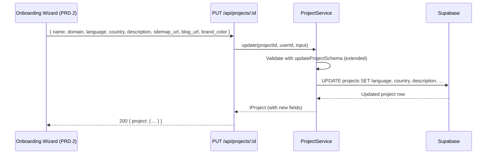
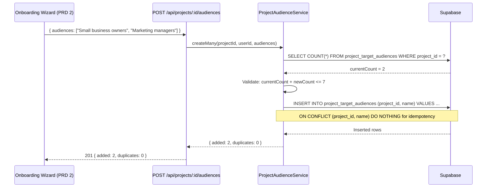
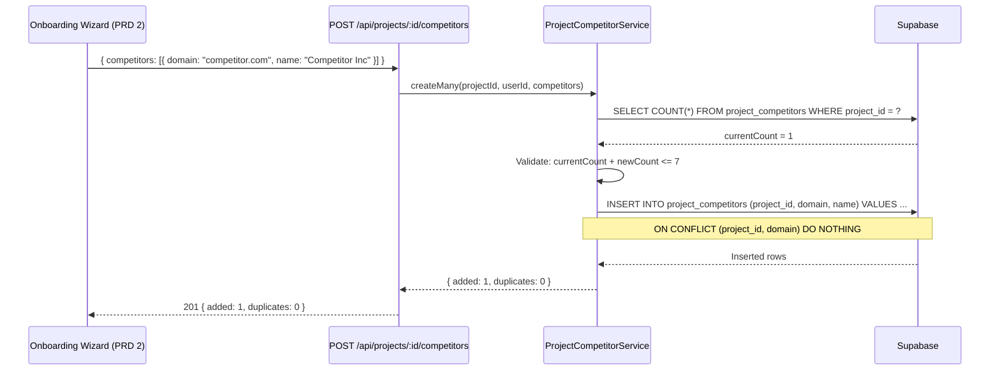
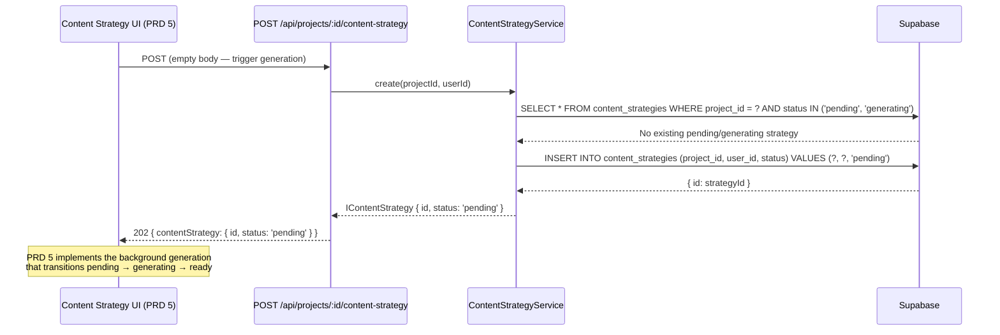

# PRD: Outrank Feature Parity — Schema & Data Model Foundation

**Status:** Draft
**Complexity Score:** 7 → HIGH
**Created:** 2026-02-24
**Author:** Claude (Principal Architect)
**Series:** Outrank Feature Parity (1 of 6)
**Depends On:** None (Foundation)
**Blocks:** PRDs 2, 3, 4, 5, 6

---

## Complexity Assessment

| Dimension               | Score (1-3) | Notes                                                           |
| ------------------------ | ----------- | --------------------------------------------------------------- |
| New tables               | 3           | 5 new tables with RLS, triggers, indexes                        |
| Schema changes           | 2           | New columns on 2 existing tables (projects, campaigns)          |
| TypeScript types         | 2           | 5 new interfaces + updates to 2 existing ones + Zod schemas    |
| API endpoints            | 2           | 10 CRUD endpoints following established patterns                |
| Service layer            | 2           | New services mirroring ProjectService pattern                   |
| Test surface             | 1           | Unit tests for services + API integration tests                 |
| UI impact                | 0           | No UI in this PRD — pure backend foundation                     |
| **Total**                | **12/21**   | Divided by weight factor: **7 → HIGH**                          |

Justification: The high score comes from the breadth of changes (5 new tables, 10 API endpoints) rather than depth. Each individual change follows well-established patterns in the codebase. The risk is in getting the schema right since all downstream PRDs depend on it.

---

## Integration Points Checklist

```
How will this feature be reached?
- [x] Entry point: PUT /api/projects/:projectId (existing — extended with new fields)
- [x] Entry point: GET /api/projects/:projectId/audiences (new)
- [x] Entry point: POST /api/projects/:projectId/audiences (new)
- [x] Entry point: DELETE /api/projects/:projectId/audiences/:id (new)
- [x] Entry point: GET /api/projects/:projectId/competitors (new)
- [x] Entry point: POST /api/projects/:projectId/competitors (new)
- [x] Entry point: DELETE /api/projects/:projectId/competitors/:id (new)
- [x] Entry point: GET /api/projects/:projectId/example-articles (new)
- [x] Entry point: POST /api/projects/:projectId/example-articles (new)
- [x] Entry point: DELETE /api/projects/:projectId/example-articles/:id (new)
- [x] Entry point: GET /api/projects/:projectId/sitemap-pages (new)
- [x] Entry point: GET /api/projects/:projectId/content-strategy (new)
- [x] Entry point: POST /api/projects/:projectId/content-strategy (new — trigger only, logic in PRD 5)
- [x] Caller: PRD 2 (Onboarding Wizard) populates project fields, audiences, competitors
- [x] Caller: PRD 3 (Sitemap Import) writes to sitemap_pages table
- [x] Caller: PRD 4 (Style Analysis) writes to project_example_articles.analyzed_style
- [x] Caller: PRD 5 (Content Strategy) writes to content_strategies table
- [x] Caller: PRD 6 (Campaign Enhancements) reads new campaign fields

Is this user-facing?
- [ ] NO — This PRD is pure backend. No UI components.
- [x] The data model enables UI built in PRDs 2-6.

Full data flow:
1. PRD 2 (Onboarding) calls existing PUT /api/projects/:id with new fields
2. PRD 2 calls POST /api/projects/:id/audiences to add target audiences
3. PRD 2 calls POST /api/projects/:id/competitors to add competitors
4. PRD 3 calls internal service to populate sitemap_pages
5. PRD 4 calls POST /api/projects/:id/example-articles with URLs, then populates analyzed_style
6. PRD 5 calls POST /api/projects/:id/content-strategy to trigger generation
7. PRD 6 reads new campaign fields (article_style, internal_links_count, etc.)
```

---

## 1. Context

### Problem

AutopilotRank currently has a minimal project model: name, domain, industry, CMS type, and basic content preferences. To achieve feature parity with Outrank.so, projects need rich metadata (language, country, description, sitemap, blog URL, brand color), associated entities (target audiences, competitors, example articles), and campaigns need additional generation parameters (article style, internal links, global instructions, auto-publish, YouTube/CTA/infographic/emoji toggles, image style).

All 5 downstream PRDs depend on these schema changes existing first. Without this foundation:
- PRD 2 (Onboarding Wizard) cannot save the enriched project setup data
- PRD 3 (Sitemap Import) has nowhere to store parsed pages
- PRD 4 (Style Analysis) has no table for example articles and their analysis results
- PRD 5 (Content Strategy) has no table for AI-generated strategies
- PRD 6 (Campaign Enhancements) cannot store the new generation parameters

### Files Analyzed

| File | Purpose |
| ---- | ------- |
| `supabase/migrations/20260205100000_create_projects_table.sql` | Current projects schema (id, user_id, name, domain, industry, cms_type, cms_credentials, content_preferences, status) |
| `supabase/migrations/20260205200000_add_project_details_columns.sql` | Added industry and content_preferences columns |
| `supabase/migrations/20260210240200_add_qa_pipeline.sql` | Added qa_config JSONB to projects |
| `supabase/migrations/20260205100100_create_campaigns_table.sql` | Current campaigns schema |
| `supabase/migrations/20260212100000_add_campaign_scheduling.sql` | Added scheduling columns to campaigns |
| `supabase/migrations/20260205100300_create_keywords_table.sql` | Keywords schema with RLS through campaigns |
| `supabase/migrations/20260213000000_create_user_onboarding.sql` | Onboarding table pattern (RLS, triggers, indexes) |
| `shared/types/project.types.ts` | IProject, ICreateProjectInput, IUpdateProjectInput |
| `shared/types/campaign.types.ts` | ICampaign, ICreateCampaignInput, IUpdateCampaignInput |
| `shared/types/onboarding.types.ts` | Onboarding types pattern |
| `shared/validation/project.schema.ts` | Project Zod schemas |
| `shared/validation/campaign.schema.ts` | Campaign Zod schemas |
| `server/services/project.service.ts` | ProjectService class (CRUD + ownership enforcement) |
| `src/pages/api/projects/index.ts` | Projects list/create API endpoints |
| `src/pages/api/projects/[projectId]/index.ts` | Project get/update/delete API endpoints |
| `shared/config/security.ts` | PUBLIC_API_ROUTES definition |
| `shared/config/env.ts` | Environment variable patterns |

### Current Behavior

**Projects table** has these columns:
- `id`, `user_id`, `name`, `domain`, `industry`, `cms_type`, `cms_credentials`, `content_preferences` (JSONB), `status`, `qa_config` (JSONB), `created_at`, `updated_at`

**Campaigns table** has these columns:
- `id`, `user_id`, `project_id`, `name`, `status`, `ai_model`, `tone`, `target_word_count`, `settings` (JSONB), `image_preset`, `generation_run_id`, `schedule_frequency`, `schedule_batch_size`, `next_run_at`, `last_run_at`, `schedule_timezone`, `schedule_hour`, `created_at`, `updated_at`

**No tables exist** for target audiences, competitors, example articles, sitemap pages, or content strategies.

**No API endpoints exist** for managing project sub-resources (audiences, competitors, etc.).

---

## 2. Solution

### Approach

1. Create a single migration that adds new columns to `projects` and `campaigns` tables
2. Create 5 separate migrations for the 5 new tables (each with RLS, indexes, triggers)
3. Update TypeScript interfaces in `shared/types/` to reflect schema changes
4. Create Zod validation schemas in `shared/validation/` for new inputs
5. Create service classes following the `ProjectService` singleton pattern
6. Create Astro API route files following the `withAuth` + `jsonResponse` pattern
7. Write unit tests for all new services and API endpoints

### Architecture Diagram

```mermaid
flowchart TB
    subgraph "Existing Tables (Modified)"
        projects[projects<br/>+ language, country, description<br/>+ sitemap_url, blog_url, brand_color]
        campaigns[campaigns<br/>+ article_style, internal_links_count<br/>+ global_instructions, auto_publish<br/>+ include_youtube, include_cta<br/>+ include_infographics, include_emojis<br/>+ image_style]
    end

    subgraph "New Tables"
        audiences[project_target_audiences<br/>id, project_id, name<br/>UNIQUE(project_id, name)<br/>Max 7 per project]
        competitors[project_competitors<br/>id, project_id, domain, name, favicon_url<br/>UNIQUE(project_id, domain)<br/>Max 7 per project]
        examples[project_example_articles<br/>id, project_id, url<br/>extracted_content, analyzed_style<br/>UNIQUE(project_id, url)<br/>Max 5 per project]
        sitemap[sitemap_pages<br/>id, project_id, url, title<br/>last_modified<br/>UNIQUE(project_id, url)]
        strategy[content_strategies<br/>id, project_id, user_id<br/>status, strategy_data<br/>generation_time_ms, error_message]
    end

    subgraph "API Layer"
        projAPI[PUT /api/projects/:id<br/>extended with new fields]
        audAPI[CRUD /api/projects/:id/audiences]
        compAPI[CRUD /api/projects/:id/competitors]
        exAPI[CRUD /api/projects/:id/example-articles]
        smAPI[GET /api/projects/:id/sitemap-pages]
        csAPI[GET+POST /api/projects/:id/content-strategy]
    end

    subgraph "Service Layer"
        audSvc[ProjectAudienceService]
        compSvc[ProjectCompetitorService]
        exSvc[ProjectExampleArticleService]
        smSvc[SitemapPageService]
        csSvc[ContentStrategyService]
    end

    projects --> audiences
    projects --> competitors
    projects --> examples
    projects --> sitemap
    projects --> strategy

    projAPI --> projects
    audAPI --> audSvc --> audiences
    compAPI --> compSvc --> competitors
    exAPI --> exSvc --> examples
    smAPI --> smSvc --> sitemap
    csAPI --> csSvc --> strategy
```

### Key Decisions

1. **Flat columns over JSONB for new project/campaign fields.** The new fields (language, country, description, etc.) are discrete, queryable values -- not nested objects. Flat columns are type-safe, indexable, and simpler for downstream queries. JSONB is reserved for truly schemaless data like `analyzed_style` and `strategy_data`.

2. **Max limits enforced at the service layer, not DB constraints.** The "max 7 audiences per project" limit is enforced in the `ProjectAudienceService.create()` method via a count query before insert. A CHECK constraint would require a trigger or function, adding complexity. Service-layer enforcement matches the existing `ProjectService` pattern for project limits.

3. **RLS via project ownership join.** New tables that FK to `projects` use the same RLS pattern as `keywords` (which FKs to `campaigns`): a subquery checking `EXISTS (SELECT 1 FROM projects WHERE id = project_id AND user_id = auth.uid())`. This avoids duplicating `user_id` on every table.

4. **Content strategy is a stub endpoint.** `POST /api/projects/:id/content-strategy` creates a record with status `pending`. The actual AI generation logic lives in PRD 5. This PRD only provides the table and the trigger endpoint.

5. **Separate tables for audiences/competitors/examples rather than JSONB arrays.** Enables individual CRUD operations, uniqueness constraints, and future extensions (e.g., competitor analysis results per competitor). JSONB arrays would require read-modify-write patterns that are error-prone under concurrency.

6. **`sitemap_pages` has no limit.** Unlike audiences (max 7) and competitors (max 7), sitemap pages can number in the thousands. The table is optimized for bulk inserts from sitemap parsing (PRD 3).

### Data Changes

#### Modified Tables

**projects** — 6 new columns:

| Column | Type | Default | Purpose |
| ------ | ---- | ------- | ------- |
| `language` | TEXT | `'en'` | ISO 639-1 language code for content generation |
| `country` | TEXT | `'US'` | ISO 3166-1 alpha-2 country code for localization |
| `description` | TEXT | NULL | Business description (auto-populated or manual) |
| `sitemap_url` | TEXT | NULL | Sitemap XML URL for page discovery |
| `blog_url` | TEXT | NULL | Main blog address for internal linking |
| `brand_color` | TEXT | NULL | Hex color code (e.g., '#FF5733') for branded images |

**campaigns** — 9 new columns:

| Column | Type | Default | Purpose |
| ------ | ---- | ------- | ------- |
| `article_style` | TEXT | NULL | Article format: informative, how-to, listicle, opinion, tutorial |
| `internal_links_count` | INTEGER | 0 | Number of internal links to insert per article |
| `global_instructions` | TEXT | NULL | Free-text instructions applied to all articles |
| `auto_publish` | BOOLEAN | false | Auto-deliver articles to CMS when approved |
| `include_youtube` | BOOLEAN | false | Embed relevant YouTube videos in articles |
| `include_cta` | BOOLEAN | false | Include call-to-action blocks in articles |
| `include_infographics` | BOOLEAN | false | Generate infographic placeholders |
| `include_emojis` | BOOLEAN | false | Use emojis in article content |
| `image_style` | TEXT | NULL | Image generation style override |

#### New Tables

**project_target_audiences** — Target audience segments for a project (max 7).

| Column | Type | Constraints | Purpose |
| ------ | ---- | ----------- | ------- |
| `id` | UUID | PK, DEFAULT gen_random_uuid() | Row identifier |
| `project_id` | UUID | FK -> projects(id) ON DELETE CASCADE, NOT NULL | Parent project |
| `name` | TEXT | NOT NULL | Audience segment name (e.g., "Small business owners") |
| `created_at` | TIMESTAMPTZ | NOT NULL, DEFAULT NOW() | Creation timestamp |
| — | — | UNIQUE(project_id, name) | Prevent duplicate audience names per project |

**project_competitors** — Competitor domains tracked for a project (max 7).

| Column | Type | Constraints | Purpose |
| ------ | ---- | ----------- | ------- |
| `id` | UUID | PK, DEFAULT gen_random_uuid() | Row identifier |
| `project_id` | UUID | FK -> projects(id) ON DELETE CASCADE, NOT NULL | Parent project |
| `domain` | TEXT | NOT NULL | Competitor domain (e.g., "competitor.com") |
| `name` | TEXT | NULL | Display name for the competitor |
| `favicon_url` | TEXT | NULL | Cached favicon URL for UI display |
| `created_at` | TIMESTAMPTZ | NOT NULL, DEFAULT NOW() | Creation timestamp |
| — | — | UNIQUE(project_id, domain) | Prevent duplicate competitor domains per project |

**project_example_articles** — Example articles for style analysis (max 5).

| Column | Type | Constraints | Purpose |
| ------ | ---- | ----------- | ------- |
| `id` | UUID | PK, DEFAULT gen_random_uuid() | Row identifier |
| `project_id` | UUID | FK -> projects(id) ON DELETE CASCADE, NOT NULL | Parent project |
| `url` | TEXT | NOT NULL | Source article URL |
| `extracted_content` | TEXT | NULL | Fetched article body text (populated by PRD 4) |
| `analyzed_style` | JSONB | NULL | LLM analysis result: tone, structure, vocabulary, etc. (populated by PRD 4) |
| `created_at` | TIMESTAMPTZ | NOT NULL, DEFAULT NOW() | Creation timestamp |
| — | — | UNIQUE(project_id, url) | Prevent duplicate URLs per project |

**sitemap_pages** — Parsed pages from project sitemap (no limit).

| Column | Type | Constraints | Purpose |
| ------ | ---- | ----------- | ------- |
| `id` | UUID | PK, DEFAULT gen_random_uuid() | Row identifier |
| `project_id` | UUID | FK -> projects(id) ON DELETE CASCADE, NOT NULL | Parent project |
| `url` | TEXT | NOT NULL | Page URL from sitemap |
| `title` | TEXT | NULL | Page title (if extractable from sitemap or fetched) |
| `last_modified` | TIMESTAMPTZ | NULL | Last modification date from sitemap XML |
| `created_at` | TIMESTAMPTZ | NOT NULL, DEFAULT NOW() | Creation timestamp |
| — | — | UNIQUE(project_id, url) | Prevent duplicate page URLs per project |

**content_strategies** — AI-generated content strategies for a project.

| Column | Type | Constraints | Purpose |
| ------ | ---- | ----------- | ------- |
| `id` | UUID | PK, DEFAULT gen_random_uuid() | Row identifier |
| `project_id` | UUID | FK -> projects(id) ON DELETE CASCADE, NOT NULL | Parent project |
| `user_id` | UUID | FK -> profiles(id) ON DELETE CASCADE, NOT NULL | Owning user (for RLS) |
| `status` | TEXT | NOT NULL, DEFAULT 'pending', CHECK | Generation status: pending, generating, ready, failed |
| `strategy_data` | JSONB | NULL | AI-generated keyword clusters, schedule, topic map |
| `generation_time_ms` | INTEGER | NULL | Time taken for AI generation in ms |
| `error_message` | TEXT | NULL | Error details if generation failed |
| `created_at` | TIMESTAMPTZ | NOT NULL, DEFAULT NOW() | Creation timestamp |
| `updated_at` | TIMESTAMPTZ | NOT NULL, DEFAULT NOW() | Last update timestamp |

---

## 3. Sequence Flow

### Project Setup with New Fields (PRD 2 calls this)



### Add Target Audiences



### Add Competitors



### Content Strategy Trigger (stub for PRD 5)



---

## 4. Execution Phases

### Phase 1: Database Migrations — New columns on existing tables

**Files (2):**

- `supabase/migrations/20260224100000_add_outrank_project_columns.sql`
- `supabase/migrations/20260224100100_add_outrank_campaign_columns.sql`

**Implementation:**

1. Add 6 new columns to `projects` table:
   - `language` TEXT DEFAULT 'en' — ISO 639-1 code
   - `country` TEXT DEFAULT 'US' — ISO 3166-1 alpha-2
   - `description` TEXT (nullable)
   - `sitemap_url` TEXT (nullable)
   - `blog_url` TEXT (nullable)
   - `brand_color` TEXT (nullable) with CHECK constraint for hex format

2. Add 9 new columns to `campaigns` table:
   - `article_style` TEXT (nullable) with CHECK constraint for allowed values
   - `internal_links_count` INTEGER DEFAULT 0 with CHECK >= 0 AND <= 20
   - `global_instructions` TEXT (nullable) with CHECK length <= 2000
   - `auto_publish` BOOLEAN DEFAULT false
   - `include_youtube` BOOLEAN DEFAULT false
   - `include_cta` BOOLEAN DEFAULT false
   - `include_infographics` BOOLEAN DEFAULT false
   - `include_emojis` BOOLEAN DEFAULT false
   - `image_style` TEXT (nullable) with CHECK constraint for allowed values

**SQL for `20260224100000_add_outrank_project_columns.sql`:**

```sql
-- Add Outrank-style project metadata columns
-- Series: Outrank Feature Parity (PRD 1 of 6)

-- Language and country for localized content generation
ALTER TABLE public.projects
  ADD COLUMN IF NOT EXISTS language TEXT DEFAULT 'en',
  ADD COLUMN IF NOT EXISTS country TEXT DEFAULT 'US';

-- Business description (auto-populated from domain scraping or manual entry)
ALTER TABLE public.projects
  ADD COLUMN IF NOT EXISTS description TEXT;

-- Sitemap and blog URLs for page discovery and internal linking
ALTER TABLE public.projects
  ADD COLUMN IF NOT EXISTS sitemap_url TEXT,
  ADD COLUMN IF NOT EXISTS blog_url TEXT;

-- Brand color for branded image generation
ALTER TABLE public.projects
  ADD COLUMN IF NOT EXISTS brand_color TEXT;

-- Add CHECK constraint for brand_color hex format (optional field)
ALTER TABLE public.projects
  ADD CONSTRAINT projects_brand_color_hex_check
  CHECK (brand_color IS NULL OR brand_color ~ '^#[0-9A-Fa-f]{6}$');

-- Add comments for documentation
COMMENT ON COLUMN public.projects.language IS 'ISO 639-1 language code for content generation (e.g., en, es, fr, de)';
COMMENT ON COLUMN public.projects.country IS 'ISO 3166-1 alpha-2 country code for localization (e.g., US, GB, DE, BR)';
COMMENT ON COLUMN public.projects.description IS 'Business description for context in content generation (auto-populated or manual)';
COMMENT ON COLUMN public.projects.sitemap_url IS 'Sitemap XML URL for page discovery and internal linking';
COMMENT ON COLUMN public.projects.blog_url IS 'Main blog URL for internal linking references';
COMMENT ON COLUMN public.projects.brand_color IS 'Hex color code for branded image generation (e.g., #FF5733)';
```

**SQL for `20260224100100_add_outrank_campaign_columns.sql`:**

```sql
-- Add Outrank-style campaign generation parameter columns
-- Series: Outrank Feature Parity (PRD 1 of 6)

-- Article style preset
ALTER TABLE public.campaigns
  ADD COLUMN IF NOT EXISTS article_style TEXT
    CHECK (article_style IS NULL OR article_style IN (
      'informative', 'how-to', 'listicle', 'opinion', 'tutorial'
    ));

-- Internal linking configuration
ALTER TABLE public.campaigns
  ADD COLUMN IF NOT EXISTS internal_links_count INTEGER DEFAULT 0
    CHECK (internal_links_count >= 0 AND internal_links_count <= 20);

-- Global instructions for all articles in this campaign
ALTER TABLE public.campaigns
  ADD COLUMN IF NOT EXISTS global_instructions TEXT
    CHECK (global_instructions IS NULL OR length(global_instructions) <= 2000);

-- Auto-publish toggle
ALTER TABLE public.campaigns
  ADD COLUMN IF NOT EXISTS auto_publish BOOLEAN DEFAULT false;

-- Content feature toggles
ALTER TABLE public.campaigns
  ADD COLUMN IF NOT EXISTS include_youtube BOOLEAN DEFAULT false,
  ADD COLUMN IF NOT EXISTS include_cta BOOLEAN DEFAULT false,
  ADD COLUMN IF NOT EXISTS include_infographics BOOLEAN DEFAULT false,
  ADD COLUMN IF NOT EXISTS include_emojis BOOLEAN DEFAULT false;

-- Image style override (NULL uses campaign's image_preset default)
ALTER TABLE public.campaigns
  ADD COLUMN IF NOT EXISTS image_style TEXT
    CHECK (image_style IS NULL OR image_style IN (
      'brand_text', 'watercolor', 'cinematic', 'illustration', 'sketch'
    ));

-- Add comments for documentation
COMMENT ON COLUMN public.campaigns.article_style IS 'Article format preset: informative, how-to, listicle, opinion, tutorial';
COMMENT ON COLUMN public.campaigns.internal_links_count IS 'Number of internal links to insert per generated article (0-20)';
COMMENT ON COLUMN public.campaigns.global_instructions IS 'Free-text instructions applied to all articles in this campaign (max 2000 chars)';
COMMENT ON COLUMN public.campaigns.auto_publish IS 'Auto-deliver articles to connected CMS when approved';
COMMENT ON COLUMN public.campaigns.include_youtube IS 'Embed relevant YouTube videos in generated articles';
COMMENT ON COLUMN public.campaigns.include_cta IS 'Include call-to-action blocks in generated articles';
COMMENT ON COLUMN public.campaigns.include_infographics IS 'Generate infographic placeholders in articles';
COMMENT ON COLUMN public.campaigns.include_emojis IS 'Use emojis in article content';
COMMENT ON COLUMN public.campaigns.image_style IS 'Image generation style: brand_text, watercolor, cinematic, illustration, sketch';
```

**Tests Required:**

| Test | Assertion |
| ---- | --------- |
| Migration applies without errors | `supabase db push` succeeds |
| New project columns have correct defaults | `SELECT language, country FROM projects` returns 'en', 'US' for new rows |
| New campaign columns have correct defaults | `SELECT auto_publish, internal_links_count FROM campaigns` returns false, 0 |
| brand_color CHECK constraint works | INSERT with '#FF5733' succeeds, 'invalid' fails |
| article_style CHECK constraint works | INSERT with 'how-to' succeeds, 'invalid' fails |
| image_style CHECK constraint works | INSERT with 'watercolor' succeeds, 'invalid' fails |

**User Verification:**

```bash
# Apply migrations
npx supabase db push
# Verify columns exist
npx supabase db lint
```

---

### Phase 2: Database Migrations — New tables

**Files (5):**

- `supabase/migrations/20260224100200_create_project_target_audiences.sql`
- `supabase/migrations/20260224100300_create_project_competitors.sql`
- `supabase/migrations/20260224100400_create_project_example_articles.sql`
- `supabase/migrations/20260224100500_create_sitemap_pages.sql`
- `supabase/migrations/20260224100600_create_content_strategies.sql`

**Implementation:**

Each migration follows the established pattern from `20260213000000_create_user_onboarding.sql`:
1. CREATE TABLE with all columns, constraints, and defaults
2. COMMENT ON TABLE and each column
3. ALTER TABLE ENABLE ROW LEVEL SECURITY
4. CREATE POLICY for SELECT, INSERT, UPDATE, DELETE (through project ownership) + service_role full access
5. CREATE INDEX for foreign keys and common query patterns
6. CREATE TRIGGER for `updated_at` (only on tables with `updated_at` column)

**SQL for `20260224100200_create_project_target_audiences.sql`:**

```sql
-- =============================================================================
-- Project Target Audiences Table
-- Stores target audience segments for a project (max 7 per project)
-- Series: Outrank Feature Parity (PRD 1 of 6)
-- =============================================================================

CREATE TABLE public.project_target_audiences (
  id UUID PRIMARY KEY DEFAULT gen_random_uuid(),
  project_id UUID NOT NULL REFERENCES public.projects(id) ON DELETE CASCADE,
  name TEXT NOT NULL,
  created_at TIMESTAMPTZ NOT NULL DEFAULT NOW(),
  UNIQUE(project_id, name)
);

-- Comments
COMMENT ON TABLE public.project_target_audiences IS 'Target audience segments for a project (max 7 per project, enforced at service layer)';
COMMENT ON COLUMN public.project_target_audiences.project_id IS 'Reference to the parent project';
COMMENT ON COLUMN public.project_target_audiences.name IS 'Audience segment name (e.g., Small business owners, Marketing managers)';

-- RLS
ALTER TABLE public.project_target_audiences ENABLE ROW LEVEL SECURITY;

CREATE POLICY "Users can view own project audiences"
  ON public.project_target_audiences FOR SELECT
  USING (
    EXISTS (
      SELECT 1 FROM public.projects p
      WHERE p.id = project_id AND p.user_id = auth.uid()
    )
  );

CREATE POLICY "Users can create own project audiences"
  ON public.project_target_audiences FOR INSERT
  WITH CHECK (
    EXISTS (
      SELECT 1 FROM public.projects p
      WHERE p.id = project_id AND p.user_id = auth.uid()
    )
  );

CREATE POLICY "Users can delete own project audiences"
  ON public.project_target_audiences FOR DELETE
  USING (
    EXISTS (
      SELECT 1 FROM public.projects p
      WHERE p.id = project_id AND p.user_id = auth.uid()
    )
  );

CREATE POLICY "Service role has full access to project_target_audiences"
  ON public.project_target_audiences FOR ALL
  USING (auth.role() = 'service_role');

-- Indexes
CREATE INDEX idx_project_target_audiences_project_id
  ON public.project_target_audiences(project_id);
```

**SQL for `20260224100300_create_project_competitors.sql`:**

```sql
-- =============================================================================
-- Project Competitors Table
-- Stores competitor domains tracked for a project (max 7 per project)
-- Series: Outrank Feature Parity (PRD 1 of 6)
-- =============================================================================

CREATE TABLE public.project_competitors (
  id UUID PRIMARY KEY DEFAULT gen_random_uuid(),
  project_id UUID NOT NULL REFERENCES public.projects(id) ON DELETE CASCADE,
  domain TEXT NOT NULL,
  name TEXT,
  favicon_url TEXT,
  created_at TIMESTAMPTZ NOT NULL DEFAULT NOW(),
  UNIQUE(project_id, domain)
);

-- Comments
COMMENT ON TABLE public.project_competitors IS 'Competitor domains tracked for a project (max 7 per project, enforced at service layer)';
COMMENT ON COLUMN public.project_competitors.project_id IS 'Reference to the parent project';
COMMENT ON COLUMN public.project_competitors.domain IS 'Competitor domain (e.g., competitor.com)';
COMMENT ON COLUMN public.project_competitors.name IS 'Display name for the competitor';
COMMENT ON COLUMN public.project_competitors.favicon_url IS 'Cached favicon URL for UI display';

-- RLS
ALTER TABLE public.project_competitors ENABLE ROW LEVEL SECURITY;

CREATE POLICY "Users can view own project competitors"
  ON public.project_competitors FOR SELECT
  USING (
    EXISTS (
      SELECT 1 FROM public.projects p
      WHERE p.id = project_id AND p.user_id = auth.uid()
    )
  );

CREATE POLICY "Users can create own project competitors"
  ON public.project_competitors FOR INSERT
  WITH CHECK (
    EXISTS (
      SELECT 1 FROM public.projects p
      WHERE p.id = project_id AND p.user_id = auth.uid()
    )
  );

CREATE POLICY "Users can delete own project competitors"
  ON public.project_competitors FOR DELETE
  USING (
    EXISTS (
      SELECT 1 FROM public.projects p
      WHERE p.id = project_id AND p.user_id = auth.uid()
    )
  );

CREATE POLICY "Service role has full access to project_competitors"
  ON public.project_competitors FOR ALL
  USING (auth.role() = 'service_role');

-- Indexes
CREATE INDEX idx_project_competitors_project_id
  ON public.project_competitors(project_id);
```

**SQL for `20260224100400_create_project_example_articles.sql`:**

```sql
-- =============================================================================
-- Project Example Articles Table
-- Stores example articles for writing style analysis (max 5 per project)
-- Series: Outrank Feature Parity (PRD 1 of 6)
-- =============================================================================

CREATE TABLE public.project_example_articles (
  id UUID PRIMARY KEY DEFAULT gen_random_uuid(),
  project_id UUID NOT NULL REFERENCES public.projects(id) ON DELETE CASCADE,
  url TEXT NOT NULL,
  extracted_content TEXT,
  analyzed_style JSONB,
  created_at TIMESTAMPTZ NOT NULL DEFAULT NOW(),
  UNIQUE(project_id, url)
);

-- Comments
COMMENT ON TABLE public.project_example_articles IS 'Example articles for writing style analysis (max 5 per project, enforced at service layer)';
COMMENT ON COLUMN public.project_example_articles.project_id IS 'Reference to the parent project';
COMMENT ON COLUMN public.project_example_articles.url IS 'Source article URL for style analysis';
COMMENT ON COLUMN public.project_example_articles.extracted_content IS 'Fetched article body text (populated during style analysis)';
COMMENT ON COLUMN public.project_example_articles.analyzed_style IS 'LLM analysis result: tone, structure, vocabulary level, sentence patterns, etc.';

-- RLS
ALTER TABLE public.project_example_articles ENABLE ROW LEVEL SECURITY;

CREATE POLICY "Users can view own project example articles"
  ON public.project_example_articles FOR SELECT
  USING (
    EXISTS (
      SELECT 1 FROM public.projects p
      WHERE p.id = project_id AND p.user_id = auth.uid()
    )
  );

CREATE POLICY "Users can create own project example articles"
  ON public.project_example_articles FOR INSERT
  WITH CHECK (
    EXISTS (
      SELECT 1 FROM public.projects p
      WHERE p.id = project_id AND p.user_id = auth.uid()
    )
  );

CREATE POLICY "Users can delete own project example articles"
  ON public.project_example_articles FOR DELETE
  USING (
    EXISTS (
      SELECT 1 FROM public.projects p
      WHERE p.id = project_id AND p.user_id = auth.uid()
    )
  );

CREATE POLICY "Service role has full access to project_example_articles"
  ON public.project_example_articles FOR ALL
  USING (auth.role() = 'service_role');

-- Indexes
CREATE INDEX idx_project_example_articles_project_id
  ON public.project_example_articles(project_id);
```

**SQL for `20260224100500_create_sitemap_pages.sql`:**

```sql
-- =============================================================================
-- Sitemap Pages Table
-- Stores parsed pages from a project's sitemap XML (no row limit)
-- Series: Outrank Feature Parity (PRD 1 of 6)
-- =============================================================================

CREATE TABLE public.sitemap_pages (
  id UUID PRIMARY KEY DEFAULT gen_random_uuid(),
  project_id UUID NOT NULL REFERENCES public.projects(id) ON DELETE CASCADE,
  url TEXT NOT NULL,
  title TEXT,
  last_modified TIMESTAMPTZ,
  created_at TIMESTAMPTZ NOT NULL DEFAULT NOW(),
  UNIQUE(project_id, url)
);

-- Comments
COMMENT ON TABLE public.sitemap_pages IS 'Parsed pages from a project sitemap XML for internal linking and content gap analysis';
COMMENT ON COLUMN public.sitemap_pages.project_id IS 'Reference to the parent project';
COMMENT ON COLUMN public.sitemap_pages.url IS 'Page URL from the sitemap';
COMMENT ON COLUMN public.sitemap_pages.title IS 'Page title (extracted from sitemap or fetched from page)';
COMMENT ON COLUMN public.sitemap_pages.last_modified IS 'Last modification date from sitemap XML lastmod element';

-- RLS
ALTER TABLE public.sitemap_pages ENABLE ROW LEVEL SECURITY;

CREATE POLICY "Users can view own sitemap pages"
  ON public.sitemap_pages FOR SELECT
  USING (
    EXISTS (
      SELECT 1 FROM public.projects p
      WHERE p.id = project_id AND p.user_id = auth.uid()
    )
  );

CREATE POLICY "Users can create own sitemap pages"
  ON public.sitemap_pages FOR INSERT
  WITH CHECK (
    EXISTS (
      SELECT 1 FROM public.projects p
      WHERE p.id = project_id AND p.user_id = auth.uid()
    )
  );

CREATE POLICY "Users can delete own sitemap pages"
  ON public.sitemap_pages FOR DELETE
  USING (
    EXISTS (
      SELECT 1 FROM public.projects p
      WHERE p.id = project_id AND p.user_id = auth.uid()
    )
  );

CREATE POLICY "Service role has full access to sitemap_pages"
  ON public.sitemap_pages FOR ALL
  USING (auth.role() = 'service_role');

-- Indexes
CREATE INDEX idx_sitemap_pages_project_id
  ON public.sitemap_pages(project_id);

-- Composite index for querying pages by project with optional last_modified ordering
CREATE INDEX idx_sitemap_pages_project_modified
  ON public.sitemap_pages(project_id, last_modified DESC NULLS LAST);
```

**SQL for `20260224100600_create_content_strategies.sql`:**

```sql
-- =============================================================================
-- Content Strategies Table
-- Stores AI-generated content strategies for a project
-- Series: Outrank Feature Parity (PRD 1 of 6)
-- =============================================================================

CREATE TABLE public.content_strategies (
  id UUID PRIMARY KEY DEFAULT gen_random_uuid(),
  project_id UUID NOT NULL REFERENCES public.projects(id) ON DELETE CASCADE,
  user_id UUID NOT NULL REFERENCES public.profiles(id) ON DELETE CASCADE,
  status TEXT NOT NULL DEFAULT 'pending'
    CHECK (status IN ('pending', 'generating', 'ready', 'failed')),
  strategy_data JSONB,
  generation_time_ms INTEGER,
  error_message TEXT,
  created_at TIMESTAMPTZ NOT NULL DEFAULT NOW(),
  updated_at TIMESTAMPTZ NOT NULL DEFAULT NOW()
);

-- Comments
COMMENT ON TABLE public.content_strategies IS 'AI-generated content strategies with keyword clusters, topic maps, and publishing schedules';
COMMENT ON COLUMN public.content_strategies.project_id IS 'Reference to the parent project';
COMMENT ON COLUMN public.content_strategies.user_id IS 'Reference to the owning user (for RLS)';
COMMENT ON COLUMN public.content_strategies.status IS 'Generation status: pending (queued), generating (in progress), ready (complete), failed (error)';
COMMENT ON COLUMN public.content_strategies.strategy_data IS 'AI-generated strategy: keyword clusters, topic map, publishing schedule, content gaps';
COMMENT ON COLUMN public.content_strategies.generation_time_ms IS 'Time taken for AI strategy generation in milliseconds';
COMMENT ON COLUMN public.content_strategies.error_message IS 'Error details if generation failed';

-- RLS
ALTER TABLE public.content_strategies ENABLE ROW LEVEL SECURITY;

CREATE POLICY "Users can view own content strategies"
  ON public.content_strategies FOR SELECT
  USING (auth.uid() = user_id);

CREATE POLICY "Users can create own content strategies"
  ON public.content_strategies FOR INSERT
  WITH CHECK (auth.uid() = user_id);

CREATE POLICY "Users can update own content strategies"
  ON public.content_strategies FOR UPDATE
  USING (auth.uid() = user_id);

CREATE POLICY "Users can delete own content strategies"
  ON public.content_strategies FOR DELETE
  USING (auth.uid() = user_id);

CREATE POLICY "Service role has full access to content_strategies"
  ON public.content_strategies FOR ALL
  USING (auth.role() = 'service_role');

-- Indexes
CREATE INDEX idx_content_strategies_project_id
  ON public.content_strategies(project_id);

CREATE INDEX idx_content_strategies_user_id
  ON public.content_strategies(user_id);

CREATE INDEX idx_content_strategies_status
  ON public.content_strategies(status);

-- updated_at trigger (reuse existing handle_updated_at function)
CREATE TRIGGER handle_content_strategies_updated_at
  BEFORE UPDATE ON public.content_strategies
  FOR EACH ROW
  EXECUTE FUNCTION public.handle_updated_at();
```

**Tests Required:**

| Test | Assertion |
| ---- | --------- |
| All 5 migrations apply without errors | `supabase db push` succeeds |
| UNIQUE constraints work | Duplicate (project_id, name) in audiences returns error |
| UNIQUE constraints work | Duplicate (project_id, domain) in competitors returns error |
| UNIQUE constraints work | Duplicate (project_id, url) in example_articles returns error |
| UNIQUE constraints work | Duplicate (project_id, url) in sitemap_pages returns error |
| CASCADE delete works | Deleting a project removes all related audiences, competitors, examples, sitemap_pages, strategies |
| RLS blocks cross-user access | User A cannot SELECT audiences belonging to User B's project |
| Service role bypasses RLS | Service role can SELECT/INSERT/UPDATE/DELETE on all tables |
| content_strategies status CHECK | Only 'pending', 'generating', 'ready', 'failed' accepted |
| content_strategies updated_at trigger | UPDATE triggers updated_at change |

**User Verification:**

```bash
npx supabase db push
# All 5 migrations apply cleanly
```

---

### Phase 3: TypeScript Types & Validation Schemas

**Files (5):**

- `shared/types/project.types.ts` (modify — add new fields to IProject, ICreateProjectInput, IUpdateProjectInput)
- `shared/types/campaign.types.ts` (modify — add new fields to ICampaign, ICreateCampaignInput, IUpdateCampaignInput)
- `shared/types/outrank.types.ts` (new — types for new entities)
- `shared/validation/project.schema.ts` (modify — add new field validations)
- `shared/validation/campaign.schema.ts` (modify — add new field validations)

**Implementation:**

1. **Update `shared/types/project.types.ts`:**

   Add new fields to `IProject`:
   ```typescript
   export interface IProject {
     // ... existing fields ...
     language: string;
     country: string;
     description: string | null;
     sitemap_url: string | null;
     blog_url: string | null;
     brand_color: string | null;
   }
   ```

   Add new fields to `ICreateProjectInput`:
   ```typescript
   export interface ICreateProjectInput {
     // ... existing fields ...
     language?: string;
     country?: string;
     description?: string;
     sitemap_url?: string;
     blog_url?: string;
     brand_color?: string;
   }
   ```

   Add same fields to `IUpdateProjectInput`:
   ```typescript
   export interface IUpdateProjectInput {
     // ... existing fields ...
     language?: string;
     country?: string;
     description?: string;
     sitemap_url?: string;
     blog_url?: string;
     brand_color?: string;
   }
   ```

2. **Update `shared/types/campaign.types.ts`:**

   Add new type constants:
   ```typescript
   export type ArticleStyle = 'informative' | 'how-to' | 'listicle' | 'opinion' | 'tutorial';
   export type ImageStyle = 'brand_text' | 'watercolor' | 'cinematic' | 'illustration' | 'sketch';
   ```

   Add new fields to `ICampaign`:
   ```typescript
   export interface ICampaign {
     // ... existing fields ...
     article_style: ArticleStyle | null;
     internal_links_count: number;
     global_instructions: string | null;
     auto_publish: boolean;
     include_youtube: boolean;
     include_cta: boolean;
     include_infographics: boolean;
     include_emojis: boolean;
     image_style: ImageStyle | null;
   }
   ```

   Add same fields (optional) to `ICreateCampaignInput` and `IUpdateCampaignInput`.

3. **Create `shared/types/outrank.types.ts`:**

   ```typescript
   /**
    * Outrank Feature Parity Types
    * Types for project sub-resources: audiences, competitors, example articles,
    * sitemap pages, and content strategies.
    */

   /**
    * Target audience segment for a project
    */
   export interface IProjectTargetAudience {
     id: string;
     project_id: string;
     name: string;
     created_at: string;
   }

   /**
    * Competitor domain tracked for a project
    */
   export interface IProjectCompetitor {
     id: string;
     project_id: string;
     domain: string;
     name: string | null;
     favicon_url: string | null;
     created_at: string;
   }

   /**
    * Example article for writing style analysis
    */
   export interface IProjectExampleArticle {
     id: string;
     project_id: string;
     url: string;
     extracted_content: string | null;
     analyzed_style: IAnalyzedStyle | null;
     created_at: string;
   }

   /**
    * LLM-analyzed writing style from an example article
    * Populated by PRD 4 (Style Analysis)
    */
   export interface IAnalyzedStyle {
     tone: string;
     formality: 'casual' | 'neutral' | 'formal';
     vocabularyLevel: 'simple' | 'intermediate' | 'advanced';
     sentenceLength: 'short' | 'medium' | 'long' | 'varied';
     paragraphLength: 'short' | 'medium' | 'long';
     useOfHeadings: boolean;
     useOfLists: boolean;
     useOfExamples: boolean;
     narrativeStyle: string;
     summary: string;
   }

   /**
    * Page from a project's sitemap
    */
   export interface ISitemapPage {
     id: string;
     project_id: string;
     url: string;
     title: string | null;
     last_modified: string | null;
     created_at: string;
   }

   /**
    * Content strategy status
    */
   export type ContentStrategyStatus = 'pending' | 'generating' | 'ready' | 'failed';

   /**
    * AI-generated content strategy
    */
   export interface IContentStrategy {
     id: string;
     project_id: string;
     user_id: string;
     status: ContentStrategyStatus;
     strategy_data: IStrategyData | null;
     generation_time_ms: number | null;
     error_message: string | null;
     created_at: string;
     updated_at: string;
   }

   /**
    * Strategy data structure (AI-generated)
    * Populated by PRD 5 (Content Strategy Generation)
    */
   export interface IStrategyData {
     clusters: Array<{
       name: string;
       keywords: string[];
       priority: 'high' | 'medium' | 'low';
       estimatedArticles: number;
     }>;
     contentGaps: string[];
     publishingSchedule: {
       frequency: string;
       totalArticles: number;
       estimatedWeeks: number;
     };
     topicMap: Record<string, string[]>;
   }

   // =========================================================================
   // API Input Types
   // =========================================================================

   /**
    * Input for adding target audiences to a project
    */
   export interface IAddAudiencesInput {
     audiences: string[];
   }

   /**
    * Input for adding a single competitor to a project
    */
   export interface IAddCompetitorInput {
     domain: string;
     name?: string;
   }

   /**
    * Input for adding competitors to a project (batch)
    */
   export interface IAddCompetitorsInput {
     competitors: IAddCompetitorInput[];
   }

   /**
    * Input for adding example article URLs to a project
    */
   export interface IAddExampleArticlesInput {
     urls: string[];
   }

   // =========================================================================
   // API Response Types
   // =========================================================================

   /**
    * Response for batch add operations (audiences, competitors, example articles)
    */
   export interface IBatchAddResponse {
     added: number;
     duplicates: number;
   }

   /**
    * Response for audience list
    */
   export interface IAudiencesResponse {
     audiences: IProjectTargetAudience[];
   }

   /**
    * Response for competitor list
    */
   export interface ICompetitorsResponse {
     competitors: IProjectCompetitor[];
   }

   /**
    * Response for example articles list
    */
   export interface IExampleArticlesResponse {
     exampleArticles: IProjectExampleArticle[];
   }

   /**
    * Response for sitemap pages list
    */
   export interface ISitemapPagesResponse {
     pages: ISitemapPage[];
     total: number;
   }

   /**
    * Response for content strategy
    */
   export interface IContentStrategyResponse {
     contentStrategy: IContentStrategy;
   }
   ```

4. **Update `shared/validation/project.schema.ts`:**

   Add new field validations to the existing schemas:
   ```typescript
   // ISO 639-1 language codes (common subset)
   export const LANGUAGES = ['en', 'es', 'fr', 'de', 'it', 'pt', 'nl', 'ja', 'ko', 'zh', 'ar', 'ru', 'hi', 'sv', 'da', 'no', 'fi', 'pl', 'cs', 'tr'] as const;
   export type Language = (typeof LANGUAGES)[number];

   // ISO 3166-1 alpha-2 country codes (common subset)
   export const COUNTRIES = ['US', 'GB', 'CA', 'AU', 'DE', 'FR', 'ES', 'IT', 'PT', 'BR', 'NL', 'JP', 'KR', 'CN', 'IN', 'SE', 'DK', 'NO', 'FI', 'PL', 'CZ', 'TR', 'MX', 'AR', 'CL', 'CO'] as const;
   export type Country = (typeof COUNTRIES)[number];
   ```

   Add to `createProjectSchema` and `updateProjectSchema`:
   ```typescript
   language: z.string().min(2).max(5).optional(),
   country: z.string().min(2).max(2).toUpperCase().optional(),
   description: z.string().max(2000).optional().or(z.literal('')),
   sitemap_url: z.string().url().max(500).optional().or(z.literal('')),
   blog_url: z.string().url().max(500).optional().or(z.literal('')),
   brand_color: z.string().regex(/^#[0-9A-Fa-f]{6}$/, 'Must be a valid hex color (e.g., #FF5733)').optional().or(z.literal('')),
   ```

5. **Update `shared/validation/campaign.schema.ts`:**

   Add new constants:
   ```typescript
   export const ARTICLE_STYLES = ['informative', 'how-to', 'listicle', 'opinion', 'tutorial'] as const;
   export type ArticleStyle = (typeof ARTICLE_STYLES)[number];

   export const IMAGE_STYLES = ['brand_text', 'watercolor', 'cinematic', 'illustration', 'sketch'] as const;
   export type ImageStyle = (typeof IMAGE_STYLES)[number];
   ```

   Add to `createCampaignSchema` and `updateCampaignSchema`:
   ```typescript
   articleStyle: z.enum(ARTICLE_STYLES).nullable().optional(),
   internalLinksCount: z.number().int().min(0).max(20).optional(),
   globalInstructions: z.string().max(2000).optional().or(z.literal('')),
   autoPublish: z.coerce.boolean().optional(),
   includeYoutube: z.coerce.boolean().optional(),
   includeCta: z.coerce.boolean().optional(),
   includeInfographics: z.coerce.boolean().optional(),
   includeEmojis: z.coerce.boolean().optional(),
   imageStyle: z.enum(IMAGE_STYLES).nullable().optional(),
   ```

**Tests Required:**

| Test File | Test Name | Assertion |
| --------- | --------- | --------- |
| `shared/types/__tests__/outrank.types.test.ts` | Type compilation check | All interfaces compile without errors |
| `shared/validation/__tests__/project.schema.test.ts` | `should accept valid language code` | 'en', 'es', 'fr' pass validation |
| | `should accept valid country code` | 'US', 'GB', 'DE' pass validation |
| | `should accept valid brand_color` | '#FF5733' passes, 'invalid' fails |
| | `should accept valid sitemap_url` | 'https://example.com/sitemap.xml' passes |
| | `should reject invalid sitemap_url` | 'not-a-url' fails |
| `shared/validation/__tests__/campaign.schema.test.ts` | `should accept valid article_style` | 'how-to', 'listicle' pass validation |
| | `should reject invalid article_style` | 'essay' fails |
| | `should accept valid image_style` | 'watercolor', 'cinematic' pass |
| | `should reject invalid image_style` | 'photo' fails |
| | `should accept internal_links_count in range` | 0 passes, 20 passes, 21 fails |
| | `should accept global_instructions within length limit` | 2000 chars passes, 2001 fails |

**User Verification:**

```bash
yarn tsc --noEmit
# TypeScript compilation succeeds with new types
yarn test shared/validation/
# All validation schema tests pass
```

---

### Phase 4: Service Layer — CRUD services for new entities

**Files (5):**

- `server/services/project-audience.service.ts`
- `server/services/project-competitor.service.ts`
- `server/services/project-example-article.service.ts`
- `server/services/sitemap-page.service.ts`
- `server/services/content-strategy.service.ts`

**Implementation:**

All services follow the same pattern as `ProjectService`:
- Class with async methods
- Uses `supabaseAdmin` for database operations
- Ownership enforcement via `projectId` + `userId` check (calls `projectService.getById()` first)
- Exported as singleton instance

1. **`server/services/project-audience.service.ts`:**

   ```typescript
   import { supabaseAdmin } from '@server/supabase/supabaseAdmin';
   import { projectService } from './project.service';
   import type { IProjectTargetAudience, IBatchAddResponse } from '@shared/types/outrank.types';
   import { z } from 'zod';

   const MAX_AUDIENCES_PER_PROJECT = 7;

   const addAudiencesSchema = z.object({
     audiences: z
       .array(z.string().min(1, 'Audience name is required').max(200, 'Audience name too long').trim())
       .min(1, 'At least one audience is required')
       .max(MAX_AUDIENCES_PER_PROJECT, `Maximum ${MAX_AUDIENCES_PER_PROJECT} audiences allowed`),
   });

   export class ProjectAudienceService {
     /**
      * List all audiences for a project (with ownership check)
      */
     async listByProject(projectId: string, userId: string): Promise<IProjectTargetAudience[]> {
       // Verify ownership
       const project = await projectService.getById(projectId, userId);
       if (!project) throw new Error('Project not found');

       const { data, error } = await supabaseAdmin
         .from('project_target_audiences')
         .select('*')
         .eq('project_id', projectId)
         .order('created_at', { ascending: true });

       if (error) throw new Error(`Failed to list audiences: ${error.message}`);
       return (data as IProjectTargetAudience[]) ?? [];
     }

     /**
      * Add audiences to a project (idempotent — skips duplicates)
      */
     async createMany(projectId: string, userId: string, input: { audiences: string[] }): Promise<IBatchAddResponse> {
       const project = await projectService.getById(projectId, userId);
       if (!project) throw new Error('Project not found');

       const validated = addAudiencesSchema.parse(input);

       // Check current count
       const { count } = await supabaseAdmin
         .from('project_target_audiences')
         .select('*', { count: 'exact', head: true })
         .eq('project_id', projectId);

       const currentCount = count ?? 0;
       if (currentCount + validated.audiences.length > MAX_AUDIENCES_PER_PROJECT) {
         throw new Error(
           `Cannot add ${validated.audiences.length} audiences. Project has ${currentCount}/${MAX_AUDIENCES_PER_PROJECT}. ` +
           `You can add up to ${MAX_AUDIENCES_PER_PROJECT - currentCount} more.`
         );
       }

       const rows = validated.audiences.map(name => ({ project_id: projectId, name }));

       const { data, error } = await supabaseAdmin
         .from('project_target_audiences')
         .upsert(rows, { onConflict: 'project_id,name', ignoreDuplicates: true })
         .select();

       if (error) throw new Error(`Failed to add audiences: ${error.message}`);

       const added = data?.length ?? 0;
       const duplicates = validated.audiences.length - added;

       return { added, duplicates };
     }

     /**
      * Delete a single audience by ID (with ownership check)
      */
     async delete(projectId: string, audienceId: string, userId: string): Promise<void> {
       const project = await projectService.getById(projectId, userId);
       if (!project) throw new Error('Project not found');

       const { error } = await supabaseAdmin
         .from('project_target_audiences')
         .delete()
         .eq('id', audienceId)
         .eq('project_id', projectId);

       if (error) throw new Error(`Failed to delete audience: ${error.message}`);
     }
   }

   export const projectAudienceService = new ProjectAudienceService();
   ```

2. **`server/services/project-competitor.service.ts`:**

   Same pattern as audiences but:
   - Max 7 competitors per project
   - Validates domain format
   - Stores optional `name` and `favicon_url`
   - Upsert on `(project_id, domain)` conflict

   Key differences:
   ```typescript
   const MAX_COMPETITORS_PER_PROJECT = 7;

   const addCompetitorsSchema = z.object({
     competitors: z.array(z.object({
       domain: z.string().min(1).max(255).trim(),
       name: z.string().max(200).optional(),
     })).min(1).max(MAX_COMPETITORS_PER_PROJECT),
   });
   ```

3. **`server/services/project-example-article.service.ts`:**

   Same pattern but:
   - Max 5 example articles per project
   - Validates URL format
   - `extracted_content` and `analyzed_style` are populated later by PRD 4
   - Upsert on `(project_id, url)` conflict

   Key differences:
   ```typescript
   const MAX_EXAMPLES_PER_PROJECT = 5;

   const addExampleArticlesSchema = z.object({
     urls: z.array(z.string().url().max(500))
       .min(1).max(MAX_EXAMPLES_PER_PROJECT),
   });
   ```

4. **`server/services/sitemap-page.service.ts`:**

   Simpler service with only list and bulk insert (no individual CRUD needed for MVP):
   ```typescript
   export class SitemapPageService {
     async listByProject(projectId: string, userId: string, options?: {
       limit?: number;
       offset?: number;
     }): Promise<{ pages: ISitemapPage[]; total: number }>;

     async bulkInsert(projectId: string, pages: Array<{
       url: string;
       title?: string;
       last_modified?: string;
     }>): Promise<number>;

     async deleteAllForProject(projectId: string): Promise<void>;
   }
   ```

5. **`server/services/content-strategy.service.ts`:**

   Stub service that only creates/reads strategies (generation logic in PRD 5):
   ```typescript
   export class ContentStrategyService {
     async getByProject(projectId: string, userId: string): Promise<IContentStrategy | null>;
     async getLatestByProject(projectId: string, userId: string): Promise<IContentStrategy | null>;
     async create(projectId: string, userId: string): Promise<IContentStrategy>;
     async updateStatus(strategyId: string, status: ContentStrategyStatus, data?: Partial<IContentStrategy>): Promise<void>;
   }
   ```

   The `create()` method:
   - Checks for existing pending/generating strategies (only one allowed at a time)
   - Inserts a new row with `status: 'pending'`
   - Returns the created strategy
   - Does NOT trigger generation (PRD 5 adds that)

**Tests Required:**

| Test File | Test Name | Assertion |
| --------- | --------- | --------- |
| `server/services/__tests__/project-audience.service.test.ts` | `should list audiences for a project` | Returns array of audiences |
| | `should add audiences with dedup` | Adds new, skips duplicates, returns counts |
| | `should enforce max 7 audiences` | Throws when limit exceeded |
| | `should delete an audience` | Row removed from DB |
| | `should reject non-owner` | Throws "Project not found" for wrong user |
| `server/services/__tests__/project-competitor.service.test.ts` | `should list competitors for a project` | Returns array of competitors |
| | `should add competitors with dedup` | Adds new, skips duplicate domains |
| | `should enforce max 7 competitors` | Throws when limit exceeded |
| | `should delete a competitor` | Row removed from DB |
| `server/services/__tests__/project-example-article.service.test.ts` | `should list example articles for a project` | Returns array |
| | `should add example article URLs with dedup` | Adds new, skips duplicate URLs |
| | `should enforce max 5 example articles` | Throws when limit exceeded |
| | `should delete an example article` | Row removed from DB |
| `server/services/__tests__/sitemap-page.service.test.ts` | `should list pages with pagination` | Returns pages + total |
| | `should bulk insert pages` | Inserts rows, skips duplicates |
| | `should delete all pages for project` | All project pages removed |
| `server/services/__tests__/content-strategy.service.test.ts` | `should create strategy with pending status` | New row with status='pending' |
| | `should prevent duplicate pending strategies` | Throws if one already exists |
| | `should get latest strategy` | Returns most recent by created_at |
| | `should update strategy status` | Status field updated |

**User Verification:**

```bash
yarn test server/services/__tests__/project-audience.service.test.ts
yarn test server/services/__tests__/project-competitor.service.test.ts
yarn test server/services/__tests__/project-example-article.service.test.ts
yarn test server/services/__tests__/sitemap-page.service.test.ts
yarn test server/services/__tests__/content-strategy.service.test.ts
# All tests pass
```

---

### Phase 5: API Routes — CRUD endpoints for new entities + update existing project/campaign endpoints

**Files (5):**

- `src/pages/api/projects/[projectId]/audiences/index.ts`
- `src/pages/api/projects/[projectId]/audiences/[audienceId].ts`
- `src/pages/api/projects/[projectId]/competitors/index.ts`
- `src/pages/api/projects/[projectId]/competitors/[competitorId].ts`
- `src/pages/api/projects/[projectId]/example-articles/index.ts`

**Implementation:**

All endpoints follow the pattern in `src/pages/api/projects/[projectId]/index.ts`:
- `withAuth()` wrapper for authentication
- Request body parsing with `request.text()` + `JSON.parse()`
- Service method calls with `userId` and `projectId`
- `jsonResponse()` for success, `errorResponse()` for failures
- Error handling: "Project not found" -> 404, validation -> 400

1. **`src/pages/api/projects/[projectId]/audiences/index.ts`:**

   ```typescript
   /**
    * Project Target Audiences API Routes
    * GET /api/projects/:projectId/audiences - List audiences
    * POST /api/projects/:projectId/audiences - Add audience(s)
    */

   export const GET = withAuth(async (userId, { params }) => {
     const projectId = params.projectId;
     if (!projectId) return errorResponse('VALIDATION_ERROR', 'Project ID is required', 400);

     const audiences = await projectAudienceService.listByProject(projectId, userId);
     return jsonResponse({ audiences });
   });

   export const POST = withAuth(async (userId, { request, params }) => {
     const projectId = params.projectId;
     if (!projectId) return errorResponse('VALIDATION_ERROR', 'Project ID is required', 400);

     const text = await request.text();
     const body = text ? JSON.parse(text) : {};

     try {
       const result = await projectAudienceService.createMany(projectId, userId, body);
       return jsonResponse(result, 201);
     } catch (err) {
       if (err instanceof Error && err.message === 'Project not found') {
         return errorResponse('NOT_FOUND', 'Project not found', 404);
       }
       if (err instanceof z.ZodError) {
         return errorResponse('VALIDATION_ERROR', err.errors[0]?.message || 'Validation failed', 400);
       }
       throw err;
     }
   });
   ```

2. **`src/pages/api/projects/[projectId]/audiences/[audienceId].ts`:**

   ```typescript
   /**
    * Individual Audience API Route
    * DELETE /api/projects/:projectId/audiences/:audienceId - Remove audience
    */

   export const DELETE = withAuth(async (userId, { params }) => {
     const { projectId, audienceId } = params;
     if (!projectId || !audienceId) {
       return errorResponse('VALIDATION_ERROR', 'Project ID and Audience ID are required', 400);
     }

     try {
       await projectAudienceService.delete(projectId, audienceId, userId);
       return jsonResponse({ success: true });
     } catch (err) {
       if (err instanceof Error && err.message === 'Project not found') {
         return errorResponse('NOT_FOUND', 'Project not found', 404);
       }
       throw err;
     }
   });
   ```

3. **Competitors endpoints** — same pattern as audiences but using `projectCompetitorService`.

4. **Example articles endpoints** — same pattern but using `projectExampleArticleService`.

5. **Update `server/services/project.service.ts`:**

   Extend `createProjectSchema` and `updateProjectSchema` with new field validations.
   Extend `create()` and `update()` methods to handle `language`, `country`, `description`, `sitemap_url`, `blog_url`, `brand_color`.

**Tests Required:**

| Test File | Test Name | Assertion |
| --------- | --------- | --------- |
| `tests/api/project-audiences.api.spec.ts` | `GET /api/projects/:id/audiences returns empty list` | 200 with empty array |
| | `POST /api/projects/:id/audiences adds audiences` | 201 with added count |
| | `POST /api/projects/:id/audiences handles duplicates` | Returns duplicates count |
| | `POST /api/projects/:id/audiences rejects over limit` | 400 with limit message |
| | `DELETE /api/projects/:id/audiences/:id removes audience` | 200 success |
| | `POST returns 404 for non-existent project` | 404 |
| `tests/api/project-competitors.api.spec.ts` | `GET /api/projects/:id/competitors returns list` | 200 with competitors |
| | `POST /api/projects/:id/competitors adds competitors` | 201 with added count |
| | `DELETE /api/projects/:id/competitors/:id removes competitor` | 200 success |
| `tests/api/project-example-articles.api.spec.ts` | `GET /api/projects/:id/example-articles returns list` | 200 with articles |
| | `POST /api/projects/:id/example-articles adds URLs` | 201 with added count |
| | `DELETE /api/projects/:id/example-articles/:id removes article` | 200 success |
| | `POST rejects over 5 example articles` | 400 with limit message |

**User Verification:**

```bash
# Start dev server
yarn dev

# Test audiences API
curl -X POST http://localhost:4321/api/projects/<projectId>/audiences \
  -H "Authorization: Bearer $TOKEN" \
  -H "Content-Type: application/json" \
  -d '{"audiences": ["Small business owners", "Marketing managers"]}' | jq .
# Expected: { "success": true, "data": { "added": 2, "duplicates": 0 } }

curl http://localhost:4321/api/projects/<projectId>/audiences \
  -H "Authorization: Bearer $TOKEN" | jq .
# Expected: { "success": true, "data": { "audiences": [...] } }
```

---

### Phase 6: Remaining API Routes + ProjectService Extension + InMemorySupabase

**Files (5):**

- `src/pages/api/projects/[projectId]/example-articles/[exampleArticleId].ts`
- `src/pages/api/projects/[projectId]/sitemap-pages/index.ts`
- `src/pages/api/projects/[projectId]/content-strategy/index.ts`
- `server/services/project.service.ts` (modify — extend with new fields)
- `tests/mocks/inMemorySupabaseAdmin.ts` (modify — add new tables to defaults)

**Implementation:**

1. **`src/pages/api/projects/[projectId]/example-articles/[exampleArticleId].ts`:**

   DELETE endpoint for individual example article removal.

2. **`src/pages/api/projects/[projectId]/sitemap-pages/index.ts`:**

   ```typescript
   /**
    * Sitemap Pages API Routes
    * GET /api/projects/:projectId/sitemap-pages - List parsed pages
    */

   export const GET = withAuth(async (userId, { params, url }) => {
     const projectId = params.projectId;
     if (!projectId) return errorResponse('VALIDATION_ERROR', 'Project ID is required', 400);

     const limit = parseInt(url.searchParams.get('limit') || '100', 10);
     const offset = parseInt(url.searchParams.get('offset') || '0', 10);

     try {
       const result = await sitemapPageService.listByProject(projectId, userId, { limit, offset });
       return jsonResponse(result);
     } catch (err) {
       if (err instanceof Error && err.message === 'Project not found') {
         return errorResponse('NOT_FOUND', 'Project not found', 404);
       }
       throw err;
     }
   });
   ```

3. **`src/pages/api/projects/[projectId]/content-strategy/index.ts`:**

   ```typescript
   /**
    * Content Strategy API Routes
    * GET /api/projects/:projectId/content-strategy - Get latest strategy
    * POST /api/projects/:projectId/content-strategy - Trigger generation (stub)
    */

   export const GET = withAuth(async (userId, { params }) => {
     const projectId = params.projectId;
     if (!projectId) return errorResponse('VALIDATION_ERROR', 'Project ID is required', 400);

     try {
       const strategy = await contentStrategyService.getLatestByProject(projectId, userId);
       if (!strategy) {
         return jsonResponse({ contentStrategy: null });
       }
       return jsonResponse({ contentStrategy: strategy });
     } catch (err) {
       if (err instanceof Error && err.message === 'Project not found') {
         return errorResponse('NOT_FOUND', 'Project not found', 404);
       }
       throw err;
     }
   });

   export const POST = withAuth(async (userId, { params }) => {
     const projectId = params.projectId;
     if (!projectId) return errorResponse('VALIDATION_ERROR', 'Project ID is required', 400);

     try {
       const strategy = await contentStrategyService.create(projectId, userId);
       return jsonResponse({ contentStrategy: strategy }, 202);
     } catch (err) {
       if (err instanceof Error && err.message === 'Project not found') {
         return errorResponse('NOT_FOUND', 'Project not found', 404);
       }
       if (err instanceof Error && err.message.includes('already in progress')) {
         return errorResponse('CONFLICT', err.message, 409);
       }
       throw err;
     }
   });
   ```

4. **Extend `server/services/project.service.ts`:**

   Update `createProjectSchema` and `updateProjectSchema` to include new fields.
   Update `create()` to pass `language`, `country`, `description`, `sitemap_url`, `blog_url`, `brand_color` to the INSERT.
   Update `update()` to handle new fields in the update object builder.

5. **Update `tests/mocks/inMemorySupabaseAdmin.ts`:**

   Add the 5 new tables to the `defaults` object so API tests using the in-memory mock DB can work with them:
   ```typescript
   defaults: {
     // ... existing tables ...
     project_target_audiences: [],
     project_competitors: [],
     project_example_articles: [],
     sitemap_pages: [],
     content_strategies: [],
   }
   ```

**Tests Required:**

| Test File | Test Name | Assertion |
| --------- | --------- | --------- |
| `tests/api/project-sitemap.api.spec.ts` | `GET /api/projects/:id/sitemap-pages returns paginated list` | 200 with pages + total |
| | `GET supports limit and offset params` | Pagination works |
| `tests/api/project-strategy.api.spec.ts` | `GET /api/projects/:id/content-strategy returns null when none exists` | 200 with null |
| | `POST /api/projects/:id/content-strategy creates pending strategy` | 202 with strategy |
| | `POST /api/projects/:id/content-strategy rejects duplicate pending` | 409 conflict |
| `server/services/__tests__/project.service.test.ts` | `should create project with language and country` | Fields stored correctly |
| | `should update project description` | Description updated |
| | `should validate brand_color format` | '#FF5733' passes, 'red' fails |

**User Verification:**

```bash
yarn test tests/api/
yarn test server/services/__tests__/project.service.test.ts
# All tests pass

yarn verify
# Full verification passes
```

---

## 5. Acceptance Criteria

- [ ] 7 new migrations apply cleanly via `supabase db push` (2 ALTER TABLE + 5 CREATE TABLE)
- [ ] Projects table has 6 new columns: `language`, `country`, `description`, `sitemap_url`, `blog_url`, `brand_color`
- [ ] Campaigns table has 9 new columns: `article_style`, `internal_links_count`, `global_instructions`, `auto_publish`, `include_youtube`, `include_cta`, `include_infographics`, `include_emojis`, `image_style`
- [ ] 5 new tables created: `project_target_audiences`, `project_competitors`, `project_example_articles`, `sitemap_pages`, `content_strategies`
- [ ] All new tables have RLS enabled with ownership-based policies + service role access
- [ ] `IProject` interface updated with new fields
- [ ] `ICampaign` interface updated with new fields
- [ ] 5 new TypeScript interfaces created: `IProjectTargetAudience`, `IProjectCompetitor`, `IProjectExampleArticle`, `ISitemapPage`, `IContentStrategy`
- [ ] Zod validation schemas updated for project and campaign inputs
- [ ] New Zod schemas created for audience, competitor, and example article inputs
- [ ] 5 new service classes created with CRUD operations and ownership enforcement
- [ ] Max limits enforced: 7 audiences, 7 competitors, 5 example articles per project
- [ ] 10 API endpoints created: audiences (GET, POST, DELETE), competitors (GET, POST, DELETE), example articles (GET, POST, DELETE), sitemap pages (GET), content strategy (GET, POST)
- [ ] Existing `PUT /api/projects/:id` accepts new project fields
- [ ] CASCADE deletion verified: deleting a project removes all sub-resources
- [ ] InMemorySupabaseAdmin updated with new table defaults for test compatibility
- [ ] All unit tests pass for new services
- [ ] All API tests pass for new endpoints
- [ ] `yarn verify` passes

---

## Out of Scope

- **UI components** — All UI lives in PRDs 2-6. This PRD is backend-only.
- **Sitemap parsing logic** — The `sitemap_pages` table is created here, but the parsing/fetching logic lives in PRD 3.
- **Style analysis logic** — The `project_example_articles` table stores analysis results, but the LLM analysis pipeline lives in PRD 4.
- **Content strategy generation logic** — The `content_strategies` table and stub endpoint are created here, but the AI generation lives in PRD 5.
- **Campaign generation changes** — The new campaign columns are stored here, but the article generation pipeline changes to use `article_style`, `internal_links_count`, etc. live in PRD 6.
- **Onboarding wizard** — The enriched project setup flow lives in PRD 2.

---

## Risk Mitigation

| Risk | Impact | Mitigation |
| ---- | ------ | ---------- |
| Migration conflicts with existing data | HIGH — could break existing projects/campaigns | All new columns use `ADD COLUMN IF NOT EXISTS` with safe defaults (NULL or explicit defaults like `'en'`, `0`, `false`). No data migration needed. |
| RLS policy performance on join queries | MEDIUM — slow queries on large datasets | The ownership subquery `EXISTS (SELECT 1 FROM projects WHERE ...)` is indexed via `idx_projects_user_id`. This is the same pattern used by the `keywords` table which works at scale. |
| Max limit enforcement race conditions | LOW — two concurrent requests could exceed limit | The count-then-insert pattern has a small race window. Acceptable for MVP since the UNIQUE constraint prevents true duplicates and the limit is soft (7 vs 8 audiences is not critical). Can be tightened with a serializable transaction if needed. |
| TypeScript type drift from DB schema | MEDIUM — runtime errors | All types are hand-written to match migration SQL. A future improvement could auto-generate types from Supabase. For now, the Zod schemas catch mismatches at the API boundary. |
| InMemorySupabase mock missing new tables | HIGH — test failures | Phase 6 explicitly adds new tables to the mock defaults. This must be done before any API tests are written. |

---

## Changelog

| Date | Change |
| ---- | ------ |
| 2026-02-24 | Initial PRD created |
