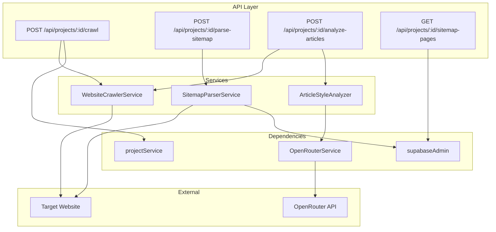
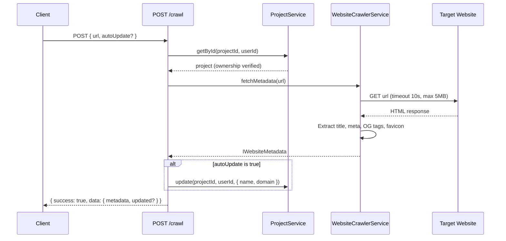
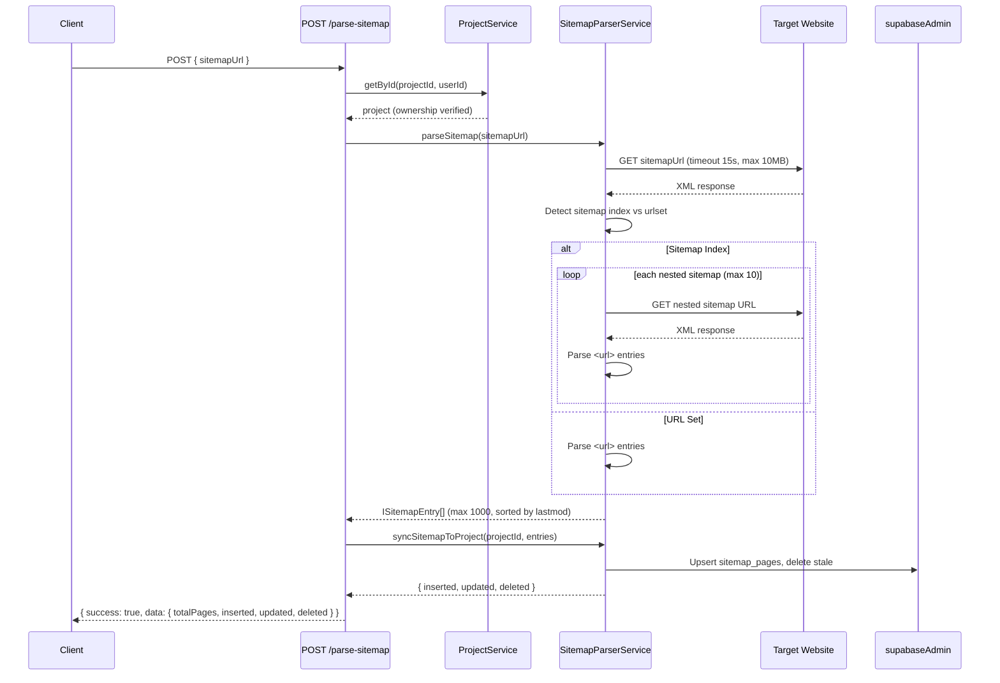
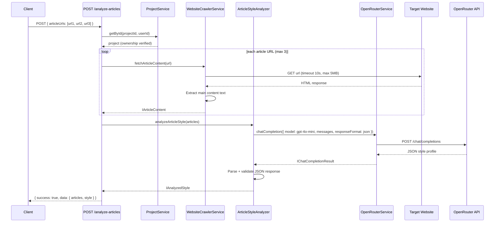

# PRD: Website Intelligence Services

**Status:** Draft
**Complexity Score:** 7 → HIGH
**Created:** 2026-02-24
**Author:** Claude (Principal Architect)
**Series:** Outrank Feature Parity (2 of 6)
**Depends On:** PRD 1 (Schema & Data Model)
**Blocks:** PRD 4 (Onboarding Wizard), PRD 5 (Content Strategy Generator), PRD 6 (Article Generation v2)

---

## Complexity Assessment

| Factor | Score | Rationale |
| --- | --- | --- |
| New services from scratch | 3 | Three new server services: WebsiteCrawler, SitemapParser, ArticleStyleAnalyzer |
| External HTTP fetching | 2 | Fetching arbitrary URLs with timeouts, error handling, content-type validation |
| LLM integration | 1 | Reuses existing OpenRouterService.chatCompletion (no new AI infra) |
| Database operations | 1 | CRUD on `sitemap_pages` table (schema from PRD 1), simple upsert/delete |
| **Total** | **7** | **HIGH** — multiple new services + external I/O + edge-case handling |

**Risk Areas:**
- Fetching arbitrary user-supplied URLs: malicious content, infinite redirects, huge payloads, non-HTML responses
- Sitemap parsing: nested sitemap indexes, malformed XML, gzipped sitemaps
- Content extraction: no DOM API in Cloudflare Workers (must use regex/string-based heuristics)
- Cloudflare Workers 10ms CPU limit: all network I/O is fine (non-blocking), but HTML parsing must be lightweight

---

## Integration Points Checklist

| System | Integration | Notes |
| --- | --- | --- |
| OpenRouterService | `chatCompletion()` | For article style analysis; use `budget` preset model (`openai/gpt-4o-mini`) |
| supabaseAdmin | `sitemap_pages` table | Insert/upsert/delete sitemap entries |
| supabaseAdmin | `projects` table | Read project ownership, optionally update project fields from crawl |
| API utils | `withAuth`, `withAuthAndBody` | Standard route wrappers |
| Error system | `AppError`, `ErrorCodes` | Standard error handling |
| serverEnv | `OPENROUTER_API_KEY` | Already exists; no new env vars needed |

---

## 1. Context

### Problem

After PRD 1 establishes the database schema for the Outrank feature set, we need backend services that can:

1. **Fetch a website's homepage** and extract metadata (title, description, OG tags, favicon) to auto-populate project fields during onboarding
2. **Parse sitemap.xml** from a URL and store all discovered pages in the `sitemap_pages` table for content gap analysis
3. **Fetch article URLs** and extract the main content text for style analysis
4. **Analyze article writing style** using an LLM to produce a structured style profile that guides future content generation

These services are **pure backend** — no UI. They are consumed by the onboarding wizard (PRD 4) and content strategy generator (PRD 5).

### Current State

- `projects` table exists with `domain`, `name`, `industry` fields
- `sitemap_pages` table will exist after PRD 1 migration
- `OpenRouterService` at `server/services/openrouter.service.ts` supports `chatCompletion()` and `chatCompletionWithRetry()` with model selection, retry logic, and JSON response format
- Writer presets config at `shared/config/ai-models.config.ts` — the `budget` preset maps to `openai/gpt-4o-mini` (cheapest, sufficient for analysis)
- API route pattern uses `withAuth()` / `withAuthAndBody()` from `src/pages/api/_utils.ts`
- No website crawling, sitemap parsing, or style analysis capabilities exist

### Files Analyzed

| File | Purpose |
| --- | --- |
| `server/services/openrouter.service.ts` | Existing LLM service — reuse `chatCompletion()` |
| `server/services/project.service.ts` | Project service pattern — class with singleton export |
| `shared/config/ai-models.config.ts` | Writer presets — `budget` preset model ID for cheap analysis |
| `shared/types/project.types.ts` | `IProject`, `IUpdateProjectInput` |
| `shared/utils/errors.ts` | `AppError`, `ErrorCodes` |
| `src/pages/api/_utils.ts` | `withAuth`, `withAuthAndBody`, `jsonResponse`, `errorResponse` |
| `src/pages/api/projects/[projectId]/index.ts` | Existing project API route pattern |

### Target State

- `WebsiteCrawlerService` can fetch any URL and extract structured metadata or article content
- `SitemapParserService` can parse sitemap.xml (including sitemap indexes) and sync entries to the database
- `ArticleStyleAnalyzer` can send article text to an LLM and return a structured style profile
- Four new API endpoints expose these services to authenticated users
- All services handle edge cases: invalid URLs, timeouts, malformed HTML/XML, oversized responses

---

## 2. Solution

### Approach

1. **WebsiteCrawlerService** — A standalone service that fetches URLs with `fetch()` (native in Cloudflare Workers), applies timeout/size limits, and extracts content using lightweight regex-based parsing (no DOM API available in Workers)
2. **SitemapParserService** — Parses XML sitemaps using regex (no DOMParser in Workers), handles sitemap index files recursively (max 2 levels), and syncs entries to `sitemap_pages` via supabaseAdmin
3. **ArticleStyleAnalyzer** — A thin wrapper around `OpenRouterService.chatCompletion()` that sends article text with a structured prompt and returns a typed style profile
4. **API endpoints** — Four routes under `/api/projects/:projectId/` that verify project ownership, call the services, and return results in the standard `{ success, data }` envelope

### Architecture



---

## 3. Sequence Flow

### 3a. Website Crawl Flow



### 3b. Sitemap Parse Flow



### 3c. Article Style Analysis Flow



---

## 4. Execution Phases

### Phase 1: Types & WebsiteCrawlerService

**Goal:** Define all shared types and build the website crawler service that fetches URLs and extracts metadata/content.

**Files:**
1. `shared/types/website-intelligence.types.ts` — All types for this PRD
2. `server/services/website-crawler.service.ts` — WebsiteCrawlerService
3. `server/services/__tests__/website-crawler.service.test.ts` — Unit tests

#### Implementation Steps

**Step 1: Create shared types** (`shared/types/website-intelligence.types.ts`)

```typescript
/**
 * Website Intelligence Types
 *
 * Types for website crawling, sitemap parsing, and article style analysis.
 * Used by WebsiteCrawlerService, SitemapParserService, and ArticleStyleAnalyzer.
 */

/**
 * Metadata extracted from a website's homepage
 */
export interface IWebsiteMetadata {
  /** Page <title> tag content */
  title: string | null;
  /** <meta name="description"> content */
  description: string | null;
  /** Open Graph og:title */
  ogTitle: string | null;
  /** Open Graph og:description */
  ogDescription: string | null;
  /** Open Graph og:image URL */
  ogImage: string | null;
  /** Favicon URL (resolved to absolute) */
  faviconUrl: string | null;
  /** <html lang="..."> attribute */
  language: string | null;
}

/**
 * A single entry from a parsed sitemap.xml
 */
export interface ISitemapEntry {
  /** Full URL of the page */
  url: string;
  /** Last modified date (ISO string or null) */
  lastModified: string | null;
}

/**
 * Extracted content from an article page
 */
export interface IArticleContent {
  /** Source URL */
  url: string;
  /** Article title (from <h1> or <title>) */
  title: string | null;
  /** Plain text content (stripped of HTML) */
  content: string;
  /** Word count of extracted content */
  wordCount: number;
}

/**
 * Structured writing style profile from LLM analysis
 */
export interface IAnalyzedStyle {
  /** Primary tone: e.g., 'informative', 'conversational', 'technical', 'persuasive' */
  tone: string;
  /** Formality level */
  formalityLevel: 'very_formal' | 'formal' | 'neutral' | 'casual' | 'very_casual';
  /** Vocabulary complexity */
  vocabularyComplexity: 'simple' | 'moderate' | 'advanced' | 'technical';
  /** Sentence structure style */
  sentenceStructure: 'short_punchy' | 'varied' | 'long_complex';
  /** How heavily examples/case studies are used */
  useOfExamples: 'none' | 'minimal' | 'moderate' | 'heavy';
  /** Typical number of H2/H3 sections per article */
  typicalSectionCount: number;
  /** Average paragraph length */
  avgParagraphLength: 'short' | 'medium' | 'long';
  /** Narrative perspective */
  perspective: 'first_person' | 'second_person' | 'third_person' | 'mixed';
  /** Amount of humor or wit */
  humorLevel: 'none' | 'subtle' | 'moderate' | 'heavy';
  /** Technical depth level */
  technicalDepth: 'beginner' | 'intermediate' | 'advanced' | 'expert';
  /** 1-2 sentence summary of the overall writing style */
  summary: string;
}

/**
 * Result of syncing sitemap entries to the database
 */
export interface ISitemapSyncResult {
  /** Total pages in the sitemap */
  totalPages: number;
  /** New pages inserted */
  inserted: number;
  /** Existing pages updated */
  updated: number;
  /** Stale pages removed */
  deleted: number;
}

/**
 * Request body for POST /api/projects/:projectId/crawl
 */
export interface ICrawlRequest {
  /** URL to crawl (defaults to project domain if not provided) */
  url?: string;
  /** If true, auto-update project name/domain from crawled metadata */
  autoUpdate?: boolean;
}

/**
 * Request body for POST /api/projects/:projectId/parse-sitemap
 */
export interface IParseSitemapRequest {
  /** Sitemap URL (defaults to {project.domain}/sitemap.xml if not provided) */
  sitemapUrl?: string;
}

/**
 * Request body for POST /api/projects/:projectId/analyze-articles
 */
export interface IAnalyzeArticlesRequest {
  /** Article URLs to fetch and analyze (1-3 URLs) */
  articleUrls: string[];
}

/**
 * Response for POST /api/projects/:projectId/crawl
 */
export interface ICrawlResponse {
  metadata: IWebsiteMetadata;
  /** Whether project fields were updated */
  projectUpdated: boolean;
}

/**
 * Response for POST /api/projects/:projectId/analyze-articles
 */
export interface IAnalyzeArticlesResponse {
  /** Extracted content from each article */
  articles: IArticleContent[];
  /** Aggregated style analysis */
  style: IAnalyzedStyle;
}

/**
 * A sitemap page record from the database (matching sitemap_pages table)
 */
export interface ISitemapPage {
  id: string;
  project_id: string;
  url: string;
  last_modified: string | null;
  content_type: string | null;
  status: 'discovered' | 'analyzed' | 'selected' | 'ignored';
  created_at: string;
  updated_at: string;
}
```

**Step 2: Create WebsiteCrawlerService** (`server/services/website-crawler.service.ts`)

```typescript
import type { IWebsiteMetadata, IArticleContent } from '@shared/types/website-intelligence.types';
import { AppError, ErrorCodes } from '@shared/utils/errors';

/** Maximum response body size (5MB) */
const MAX_RESPONSE_SIZE = 5 * 1024 * 1024;

/** Default fetch timeout (10 seconds) */
const DEFAULT_TIMEOUT_MS = 10_000;

/** User-Agent header for crawl requests */
const USER_AGENT = 'OutrankBot/1.0 (+https://outrank.so)';

export class WebsiteCrawlerService {
  /**
   * Fetch a URL and return the HTML body as a string.
   * Enforces timeout, size limit, and content-type validation.
   */
  async fetchHtml(url: string, timeoutMs = DEFAULT_TIMEOUT_MS): Promise<string> {
    const parsedUrl = this.validateUrl(url);

    const controller = new AbortController();
    const timeout = setTimeout(() => controller.abort(), timeoutMs);

    try {
      const response = await fetch(parsedUrl.toString(), {
        method: 'GET',
        headers: {
          'User-Agent': USER_AGENT,
          Accept: 'text/html,application/xhtml+xml,application/xml;q=0.9,*/*;q=0.8',
        },
        signal: controller.signal,
        redirect: 'follow',
      });

      if (!response.ok) {
        throw new AppError(
          ErrorCodes.INVALID_REQUEST,
          `Failed to fetch URL: HTTP ${response.status} ${response.statusText}`,
          400
        );
      }

      const contentType = response.headers.get('content-type') || '';
      if (!contentType.includes('text/html') && !contentType.includes('application/xhtml+xml')) {
        throw new AppError(
          ErrorCodes.INVALID_REQUEST,
          `URL returned non-HTML content type: ${contentType}`,
          400
        );
      }

      // Check content-length header if available
      const contentLength = response.headers.get('content-length');
      if (contentLength && parseInt(contentLength, 10) > MAX_RESPONSE_SIZE) {
        throw new AppError(
          ErrorCodes.INVALID_REQUEST,
          `Response too large: ${contentLength} bytes (max ${MAX_RESPONSE_SIZE})`,
          400
        );
      }

      const text = await response.text();
      if (text.length > MAX_RESPONSE_SIZE) {
        throw new AppError(
          ErrorCodes.INVALID_REQUEST,
          `Response body too large: ${text.length} bytes (max ${MAX_RESPONSE_SIZE})`,
          400
        );
      }

      return text;
    } catch (error) {
      if (error instanceof AppError) throw error;
      if (error instanceof DOMException && error.name === 'AbortError') {
        throw new AppError(
          ErrorCodes.PROCESSING_FAILED,
          `Request timed out after ${timeoutMs}ms: ${url}`,
          408
        );
      }
      throw new AppError(
        ErrorCodes.PROCESSING_FAILED,
        `Failed to fetch URL: ${error instanceof Error ? error.message : 'Unknown error'}`,
        500
      );
    } finally {
      clearTimeout(timeout);
    }
  }

  /**
   * Fetch a website's homepage and extract metadata.
   */
  async fetchMetadata(url: string): Promise<IWebsiteMetadata> {
    const html = await this.fetchHtml(url);
    const baseUrl = this.validateUrl(url);

    return {
      title: this.extractTag(html, /<title[^>]*>([\s\S]*?)<\/title>/i),
      description: this.extractMetaContent(html, 'description'),
      ogTitle: this.extractMetaProperty(html, 'og:title'),
      ogDescription: this.extractMetaProperty(html, 'og:description'),
      ogImage: this.resolveUrl(this.extractMetaProperty(html, 'og:image'), baseUrl),
      faviconUrl: this.extractFaviconUrl(html, baseUrl),
      language: this.extractLanguage(html),
    };
  }

  /**
   * Fetch an article page and extract the main content text.
   */
  async fetchArticleContent(url: string): Promise<IArticleContent> {
    const html = await this.fetchHtml(url);

    const title = this.extractArticleTitle(html);
    const content = this.extractMainContent(html);
    const wordCount = content.split(/\s+/).filter(w => w.length > 0).length;

    return { url, title, content, wordCount };
  }

  // ---------------------------------------------------------------------------
  // Private: URL validation
  // ---------------------------------------------------------------------------

  private validateUrl(url: string): URL {
    try {
      const parsed = new URL(url);
      if (!['http:', 'https:'].includes(parsed.protocol)) {
        throw new Error('Invalid protocol');
      }
      // Block private/loopback IPs
      const hostname = parsed.hostname.toLowerCase();
      if (
        hostname === 'localhost' ||
        hostname === '127.0.0.1' ||
        hostname === '0.0.0.0' ||
        hostname === '::1' ||
        hostname.startsWith('192.168.') ||
        hostname.startsWith('10.') ||
        hostname.startsWith('172.') ||
        hostname.endsWith('.local')
      ) {
        throw new Error('Private/local URLs are not allowed');
      }
      return parsed;
    } catch {
      throw new AppError(
        ErrorCodes.INVALID_REQUEST,
        `Invalid URL: ${url}. Must be a valid HTTP(S) URL.`,
        400
      );
    }
  }

  // ---------------------------------------------------------------------------
  // Private: HTML extraction helpers (regex-based, no DOM API)
  // ---------------------------------------------------------------------------

  private extractTag(html: string, regex: RegExp): string | null {
    const match = html.match(regex);
    return match ? this.decodeHtmlEntities(match[1].trim()) : null;
  }

  private extractMetaContent(html: string, name: string): string | null {
    // Match <meta name="description" content="...">
    const regex = new RegExp(
      `<meta[^>]+name=["']${this.escapeRegex(name)}["'][^>]+content=["']([^"']*)["']`,
      'i'
    );
    const match = html.match(regex);
    if (match) return this.decodeHtmlEntities(match[1].trim());

    // Also match content before name (some sites reverse attribute order)
    const regexReversed = new RegExp(
      `<meta[^>]+content=["']([^"']*)["'][^>]+name=["']${this.escapeRegex(name)}["']`,
      'i'
    );
    const matchReversed = html.match(regexReversed);
    return matchReversed ? this.decodeHtmlEntities(matchReversed[1].trim()) : null;
  }

  private extractMetaProperty(html: string, property: string): string | null {
    // Match <meta property="og:title" content="...">
    const regex = new RegExp(
      `<meta[^>]+property=["']${this.escapeRegex(property)}["'][^>]+content=["']([^"']*)["']`,
      'i'
    );
    const match = html.match(regex);
    if (match) return this.decodeHtmlEntities(match[1].trim());

    // Reversed attribute order
    const regexReversed = new RegExp(
      `<meta[^>]+content=["']([^"']*)["'][^>]+property=["']${this.escapeRegex(property)}["']`,
      'i'
    );
    const matchReversed = html.match(regexReversed);
    return matchReversed ? this.decodeHtmlEntities(matchReversed[1].trim()) : null;
  }

  private extractFaviconUrl(html: string, baseUrl: URL): string | null {
    // Try <link rel="icon" href="..."> or <link rel="shortcut icon" href="...">
    const regex = /<link[^>]+rel=["'](?:shortcut\s+)?icon["'][^>]+href=["']([^"']*)["']/i;
    const match = html.match(regex);
    if (match) return this.resolveUrl(match[1], baseUrl);

    // Reversed: href before rel
    const regexReversed =
      /<link[^>]+href=["']([^"']*)["'][^>]+rel=["'](?:shortcut\s+)?icon["']/i;
    const matchReversed = html.match(regexReversed);
    if (matchReversed) return this.resolveUrl(matchReversed[1], baseUrl);

    // Default favicon path
    return `${baseUrl.origin}/favicon.ico`;
  }

  private extractLanguage(html: string): string | null {
    const match = html.match(/<html[^>]+lang=["']([^"']*)["']/i);
    return match ? match[1].trim() : null;
  }

  private extractArticleTitle(html: string): string | null {
    // Prefer first <h1>, fall back to <title>
    const h1Match = html.match(/<h1[^>]*>([\s\S]*?)<\/h1>/i);
    if (h1Match) {
      const cleaned = h1Match[1].replace(/<[^>]+>/g, '').trim();
      if (cleaned.length > 0) return this.decodeHtmlEntities(cleaned);
    }
    return this.extractTag(html, /<title[^>]*>([\s\S]*?)<\/title>/i);
  }

  /**
   * Extract main article content from HTML.
   * Strategy (in priority order):
   * 1. <article> tag content
   * 2. <main> tag content
   * 3. Largest <div> by text length (heuristic fallback)
   * Then strip all HTML tags and normalize whitespace.
   */
  private extractMainContent(html: string): string {
    // Remove script, style, nav, footer, header, aside tags and their content
    let cleaned = html
      .replace(/<script[\s\S]*?<\/script>/gi, '')
      .replace(/<style[\s\S]*?<\/style>/gi, '')
      .replace(/<nav[\s\S]*?<\/nav>/gi, '')
      .replace(/<footer[\s\S]*?<\/footer>/gi, '')
      .replace(/<header[\s\S]*?<\/header>/gi, '')
      .replace(/<aside[\s\S]*?<\/aside>/gi, '')
      .replace(/<!--[\s\S]*?-->/g, '');

    // Try <article> first
    const articleMatch = cleaned.match(/<article[^>]*>([\s\S]*?)<\/article>/i);
    if (articleMatch) {
      return this.htmlToPlainText(articleMatch[1]);
    }

    // Try <main>
    const mainMatch = cleaned.match(/<main[^>]*>([\s\S]*?)<\/main>/i);
    if (mainMatch) {
      return this.htmlToPlainText(mainMatch[1]);
    }

    // Fallback: use the <body> content (or full HTML if no <body>)
    const bodyMatch = cleaned.match(/<body[^>]*>([\s\S]*?)<\/body>/i);
    const bodyContent = bodyMatch ? bodyMatch[1] : cleaned;

    return this.htmlToPlainText(bodyContent);
  }

  private htmlToPlainText(html: string): string {
    return html
      .replace(/<br\s*\/?>/gi, '\n')         // <br> → newline
      .replace(/<\/p>/gi, '\n\n')             // </p> → double newline
      .replace(/<\/div>/gi, '\n')             // </div> → newline
      .replace(/<\/h[1-6]>/gi, '\n\n')        // </h1-6> → double newline
      .replace(/<\/li>/gi, '\n')              // </li> → newline
      .replace(/<[^>]+>/g, '')                // strip remaining tags
      .replace(/&nbsp;/g, ' ')               // decode common entities
      .replace(/\n{3,}/g, '\n\n')            // collapse multiple newlines
      .replace(/[ \t]+/g, ' ')               // collapse spaces
      .split('\n')                            // trim each line
      .map(line => line.trim())
      .filter(line => line.length > 0)
      .join('\n')
      .trim();
  }

  private decodeHtmlEntities(text: string): string {
    return text
      .replace(/&amp;/g, '&')
      .replace(/&lt;/g, '<')
      .replace(/&gt;/g, '>')
      .replace(/&quot;/g, '"')
      .replace(/&#39;/g, "'")
      .replace(/&apos;/g, "'")
      .replace(/&#(\d+);/g, (_, code) => String.fromCharCode(parseInt(code, 10)))
      .replace(/&#x([0-9a-fA-F]+);/g, (_, code) => String.fromCharCode(parseInt(code, 16)));
  }

  private resolveUrl(href: string | null, baseUrl: URL): string | null {
    if (!href) return null;
    try {
      return new URL(href, baseUrl.origin).toString();
    } catch {
      return null;
    }
  }

  private escapeRegex(str: string): string {
    return str.replace(/[.*+?^${}()|[\]\\]/g, '\\$&');
  }
}

export const websiteCrawlerService = new WebsiteCrawlerService();
```

#### Tests Required

| Test | Type | What It Verifies |
| --- | --- | --- |
| fetchMetadata extracts title, description, OG tags | Unit | Correct regex extraction from sample HTML |
| fetchMetadata extracts favicon (link tag and default fallback) | Unit | Favicon URL resolution |
| fetchMetadata handles missing tags gracefully | Unit | Returns null for missing fields |
| fetchArticleContent extracts from `<article>` tag | Unit | Priority 1 extraction strategy |
| fetchArticleContent extracts from `<main>` tag when no `<article>` | Unit | Priority 2 fallback |
| fetchArticleContent strips nav/footer/script/style | Unit | Content cleaning |
| fetchArticleContent returns correct word count | Unit | Word count accuracy |
| validateUrl rejects private/local IPs | Unit | SSRF protection |
| validateUrl rejects non-HTTP protocols | Unit | Protocol validation |
| fetchHtml throws on timeout | Unit (mocked fetch) | Timeout enforcement |
| fetchHtml throws on non-HTML content type | Unit (mocked fetch) | Content-type validation |
| fetchHtml throws on oversized response | Unit (mocked fetch) | Size limit enforcement |

**User Verification:**

```bash
# After implementation, verify with unit tests:
yarn test server/services/__tests__/website-crawler.service.test.ts
```

---

### Phase 2: SitemapParserService

**Goal:** Build the sitemap parser that fetches and parses XML sitemaps, handles sitemap indexes, and syncs entries to the database.

**Files:**
1. `server/services/sitemap-parser.service.ts` — SitemapParserService
2. `server/services/__tests__/sitemap-parser.service.test.ts` — Unit tests

#### Implementation Steps

**Step 1: Create SitemapParserService** (`server/services/sitemap-parser.service.ts`)

```typescript
import type { ISitemapEntry, ISitemapSyncResult } from '@shared/types/website-intelligence.types';
import { supabaseAdmin } from '@server/supabase/supabaseAdmin';
import { AppError, ErrorCodes } from '@shared/utils/errors';

/** Maximum URLs to store per project */
const MAX_URLS_PER_PROJECT = 1000;

/** Maximum nested sitemaps to follow from a sitemap index */
const MAX_NESTED_SITEMAPS = 10;

/** Maximum recursion depth for sitemap indexes */
const MAX_DEPTH = 2;

/** Fetch timeout for sitemap requests */
const SITEMAP_TIMEOUT_MS = 15_000;

/** Maximum sitemap file size (10MB) */
const MAX_SITEMAP_SIZE = 10 * 1024 * 1024;

/** User-Agent for sitemap requests */
const USER_AGENT = 'OutrankBot/1.0 (+https://outrank.so)';

export class SitemapParserService {
  /**
   * Fetch and parse a sitemap URL. Handles both sitemap index files
   * and regular URL set sitemaps. Returns up to MAX_URLS_PER_PROJECT entries,
   * sorted by lastModified (most recent first).
   */
  async parseSitemap(url: string): Promise<ISitemapEntry[]> {
    const entries = await this.fetchAndParse(url, 0);

    // Sort by lastModified (most recent first), nulls last
    entries.sort((a, b) => {
      if (!a.lastModified && !b.lastModified) return 0;
      if (!a.lastModified) return 1;
      if (!b.lastModified) return -1;
      return b.lastModified.localeCompare(a.lastModified);
    });

    // Limit to max URLs
    return entries.slice(0, MAX_URLS_PER_PROJECT);
  }

  /**
   * Sync parsed sitemap entries to the sitemap_pages table for a project.
   * Upserts new/updated entries and removes stale ones.
   */
  async syncSitemapToProject(
    projectId: string,
    entries: ISitemapEntry[]
  ): Promise<ISitemapSyncResult> {
    const newUrls = new Set(entries.map(e => e.url));

    // Fetch existing entries for this project
    const { data: existing, error: fetchError } = await supabaseAdmin
      .from('sitemap_pages')
      .select('id, url')
      .eq('project_id', projectId);

    if (fetchError) {
      throw new AppError(
        ErrorCodes.INTERNAL_ERROR,
        `Failed to fetch existing sitemap pages: ${fetchError.message}`,
        500
      );
    }

    const existingUrls = new Set((existing || []).map(e => e.url));
    const existingMap = new Map((existing || []).map(e => [e.url, e.id]));

    // Determine inserts, updates, and deletes
    const toInsert = entries.filter(e => !existingUrls.has(e.url));
    const toUpdate = entries.filter(e => existingUrls.has(e.url));
    const toDelete = (existing || []).filter(e => !newUrls.has(e.url));

    // Insert new entries
    if (toInsert.length > 0) {
      const insertRows = toInsert.map(e => ({
        project_id: projectId,
        url: e.url,
        last_modified: e.lastModified,
        status: 'discovered' as const,
      }));

      const { error: insertError } = await supabaseAdmin
        .from('sitemap_pages')
        .insert(insertRows);

      if (insertError) {
        throw new AppError(
          ErrorCodes.INTERNAL_ERROR,
          `Failed to insert sitemap pages: ${insertError.message}`,
          500
        );
      }
    }

    // Update existing entries (lastModified may have changed)
    for (const entry of toUpdate) {
      const id = existingMap.get(entry.url);
      if (!id) continue;

      const { error: updateError } = await supabaseAdmin
        .from('sitemap_pages')
        .update({ last_modified: entry.lastModified, updated_at: new Date().toISOString() })
        .eq('id', id);

      if (updateError) {
        console.error(`[SitemapParser] Failed to update page ${id}:`, updateError.message);
      }
    }

    // Delete stale entries
    if (toDelete.length > 0) {
      const deleteIds = toDelete.map(e => e.id);
      const { error: deleteError } = await supabaseAdmin
        .from('sitemap_pages')
        .delete()
        .in('id', deleteIds);

      if (deleteError) {
        console.error('[SitemapParser] Failed to delete stale pages:', deleteError.message);
      }
    }

    return {
      totalPages: entries.length,
      inserted: toInsert.length,
      updated: toUpdate.length,
      deleted: toDelete.length,
    };
  }

  // ---------------------------------------------------------------------------
  // Private: Fetch + Parse
  // ---------------------------------------------------------------------------

  private async fetchAndParse(url: string, depth: number): Promise<ISitemapEntry[]> {
    if (depth > MAX_DEPTH) {
      console.warn(`[SitemapParser] Max depth ${MAX_DEPTH} reached, skipping: ${url}`);
      return [];
    }

    const xml = await this.fetchSitemapXml(url);

    // Detect sitemap index vs URL set
    if (xml.includes('<sitemapindex')) {
      return this.parseSitemapIndex(xml, depth);
    }

    return this.parseUrlSet(xml);
  }

  private async fetchSitemapXml(url: string): Promise<string> {
    const controller = new AbortController();
    const timeout = setTimeout(() => controller.abort(), SITEMAP_TIMEOUT_MS);

    try {
      const response = await fetch(url, {
        method: 'GET',
        headers: {
          'User-Agent': USER_AGENT,
          Accept: 'application/xml,text/xml,*/*;q=0.1',
        },
        signal: controller.signal,
        redirect: 'follow',
      });

      if (!response.ok) {
        throw new AppError(
          ErrorCodes.INVALID_REQUEST,
          `Failed to fetch sitemap: HTTP ${response.status} from ${url}`,
          400
        );
      }

      const contentLength = response.headers.get('content-length');
      if (contentLength && parseInt(contentLength, 10) > MAX_SITEMAP_SIZE) {
        throw new AppError(
          ErrorCodes.INVALID_REQUEST,
          `Sitemap too large: ${contentLength} bytes (max ${MAX_SITEMAP_SIZE})`,
          400
        );
      }

      const text = await response.text();
      if (text.length > MAX_SITEMAP_SIZE) {
        throw new AppError(
          ErrorCodes.INVALID_REQUEST,
          `Sitemap body too large: ${text.length} bytes (max ${MAX_SITEMAP_SIZE})`,
          400
        );
      }

      return text;
    } catch (error) {
      if (error instanceof AppError) throw error;
      if (error instanceof DOMException && error.name === 'AbortError') {
        throw new AppError(
          ErrorCodes.PROCESSING_FAILED,
          `Sitemap request timed out after ${SITEMAP_TIMEOUT_MS}ms: ${url}`,
          408
        );
      }
      throw new AppError(
        ErrorCodes.PROCESSING_FAILED,
        `Failed to fetch sitemap: ${error instanceof Error ? error.message : 'Unknown error'}`,
        500
      );
    } finally {
      clearTimeout(timeout);
    }
  }

  /**
   * Parse a sitemap index and recursively fetch nested sitemaps.
   * Limits to MAX_NESTED_SITEMAPS to avoid runaway fetching.
   */
  private async parseSitemapIndex(xml: string, depth: number): Promise<ISitemapEntry[]> {
    const sitemapUrls: string[] = [];
    const sitemapRegex = /<sitemap>[\s\S]*?<loc>([\s\S]*?)<\/loc>[\s\S]*?<\/sitemap>/gi;
    let match;

    while ((match = sitemapRegex.exec(xml)) !== null) {
      const loc = match[1].trim();
      if (loc) sitemapUrls.push(loc);
      if (sitemapUrls.length >= MAX_NESTED_SITEMAPS) break;
    }

    console.log(
      `[SitemapParser] Found ${sitemapUrls.length} nested sitemaps (depth ${depth})`
    );

    const allEntries: ISitemapEntry[] = [];
    for (const sitemapUrl of sitemapUrls) {
      try {
        const entries = await this.fetchAndParse(sitemapUrl, depth + 1);
        allEntries.push(...entries);
        // Early termination if we already have enough URLs
        if (allEntries.length >= MAX_URLS_PER_PROJECT) break;
      } catch (error) {
        // Log but don't fail the entire parse for one bad nested sitemap
        console.warn(
          `[SitemapParser] Failed to parse nested sitemap ${sitemapUrl}:`,
          error instanceof Error ? error.message : error
        );
      }
    }

    return allEntries;
  }

  /**
   * Parse a standard <urlset> sitemap XML.
   * Extracts <loc> and <lastmod> from each <url> entry.
   */
  private parseUrlSet(xml: string): ISitemapEntry[] {
    const entries: ISitemapEntry[] = [];
    const urlRegex = /<url>([\s\S]*?)<\/url>/gi;
    let match;

    while ((match = urlRegex.exec(xml)) !== null) {
      const block = match[1];
      const locMatch = block.match(/<loc>([\s\S]*?)<\/loc>/i);
      if (!locMatch) continue;

      const url = locMatch[1].trim();
      if (!url) continue;

      const lastmodMatch = block.match(/<lastmod>([\s\S]*?)<\/lastmod>/i);
      const lastModified = lastmodMatch ? lastmodMatch[1].trim() : null;

      entries.push({ url, lastModified });
    }

    return entries;
  }
}

export const sitemapParserService = new SitemapParserService();
```

#### Tests Required

| Test | Type | What It Verifies |
| --- | --- | --- |
| parseUrlSet extracts loc and lastmod from standard sitemap | Unit | Basic XML parsing |
| parseUrlSet handles missing lastmod | Unit | Optional field handling |
| parseSitemapIndex detects index and follows nested sitemaps | Unit (mocked fetch) | Sitemap index support |
| parseSitemapIndex respects MAX_NESTED_SITEMAPS limit | Unit (mocked fetch) | Runaway protection |
| parseSitemapIndex respects MAX_DEPTH limit | Unit (mocked fetch) | Depth limit enforcement |
| parseSitemap sorts by lastModified (most recent first) | Unit | Sort order |
| parseSitemap limits to MAX_URLS_PER_PROJECT entries | Unit | Size limit |
| syncSitemapToProject inserts new entries | Unit (mocked supabase) | Insert path |
| syncSitemapToProject updates existing entries | Unit (mocked supabase) | Update path |
| syncSitemapToProject deletes stale entries | Unit (mocked supabase) | Delete path |
| fetchSitemapXml throws on timeout | Unit (mocked fetch) | Timeout handling |
| fetchSitemapXml throws on oversized response | Unit (mocked fetch) | Size limit |
| parseSitemapIndex gracefully handles one failed nested sitemap | Unit (mocked fetch) | Partial failure resilience |

**User Verification:**

```bash
yarn test server/services/__tests__/sitemap-parser.service.test.ts
```

---

### Phase 3: ArticleStyleAnalyzer

**Goal:** Build the LLM-powered article style analyzer that sends extracted content to OpenRouter and returns a structured style profile.

**Files:**
1. `server/services/article-style-analyzer.service.ts` — ArticleStyleAnalyzer
2. `server/services/__tests__/article-style-analyzer.service.test.ts` — Unit tests

#### Implementation Steps

**Step 1: Create ArticleStyleAnalyzer** (`server/services/article-style-analyzer.service.ts`)

```typescript
import type { IAnalyzedStyle } from '@shared/types/website-intelligence.types';
import { openRouterService } from '@server/services/openrouter.service';
import { WRITER_PRESETS } from '@shared/config/ai-models.config';
import { AppError, ErrorCodes } from '@shared/utils/errors';
import { z } from 'zod';

/**
 * Maximum content length to send to the LLM (in characters).
 * ~4000 words * 5 chars/word = 20,000 chars per article.
 * With 3 articles that's ~60k chars, well within context limits.
 */
const MAX_CONTENT_PER_ARTICLE = 20_000;

/**
 * Zod schema for validating the LLM's JSON response
 */
const analyzedStyleSchema = z.object({
  tone: z.string(),
  formalityLevel: z.enum(['very_formal', 'formal', 'neutral', 'casual', 'very_casual']),
  vocabularyComplexity: z.enum(['simple', 'moderate', 'advanced', 'technical']),
  sentenceStructure: z.enum(['short_punchy', 'varied', 'long_complex']),
  useOfExamples: z.enum(['none', 'minimal', 'moderate', 'heavy']),
  typicalSectionCount: z.number().int().min(0).max(50),
  avgParagraphLength: z.enum(['short', 'medium', 'long']),
  perspective: z.enum(['first_person', 'second_person', 'third_person', 'mixed']),
  humorLevel: z.enum(['none', 'subtle', 'moderate', 'heavy']),
  technicalDepth: z.enum(['beginner', 'intermediate', 'advanced', 'expert']),
  summary: z.string(),
});

export class ArticleStyleAnalyzerService {
  /**
   * Analyze the writing style of 1-3 articles using an LLM.
   * Returns a structured style profile.
   *
   * @param articles - Array of { url, content } (1-3 articles)
   * @returns Structured style profile
   */
  async analyzeArticleStyle(
    articles: Array<{ url: string; content: string }>
  ): Promise<IAnalyzedStyle> {
    if (!openRouterService.isConfigured()) {
      throw new AppError(
        ErrorCodes.AI_UNAVAILABLE,
        'OpenRouter API key not configured — cannot analyze article style',
        503
      );
    }

    if (articles.length === 0) {
      throw new AppError(
        ErrorCodes.INVALID_REQUEST,
        'At least one article is required for style analysis',
        400
      );
    }

    // Truncate each article's content to the max length
    const truncatedArticles = articles.map((a, i) => ({
      label: `Article ${i + 1} (${a.url})`,
      content: a.content.slice(0, MAX_CONTENT_PER_ARTICLE),
    }));

    const articleBlocks = truncatedArticles
      .map(a => `### ${a.label}\n\n${a.content}`)
      .join('\n\n---\n\n');

    const systemPrompt = `You are a writing style analyst. You analyze articles and produce a structured JSON profile of their writing style. Be precise and objective. Always respond with valid JSON matching the exact schema specified.`;

    const userPrompt = `Analyze the writing style of the following ${articles.length} article(s). Read all content carefully, then produce a single JSON object summarizing the overall style across all articles.

${articleBlocks}

---

Respond with a JSON object containing exactly these fields:

{
  "tone": "<string: primary tone, e.g., 'informative', 'conversational', 'technical', 'persuasive', 'authoritative', 'friendly'>",
  "formalityLevel": "<'very_formal' | 'formal' | 'neutral' | 'casual' | 'very_casual'>",
  "vocabularyComplexity": "<'simple' | 'moderate' | 'advanced' | 'technical'>",
  "sentenceStructure": "<'short_punchy' | 'varied' | 'long_complex'>",
  "useOfExamples": "<'none' | 'minimal' | 'moderate' | 'heavy'>",
  "typicalSectionCount": <number: typical number of H2/H3 sections per article>,
  "avgParagraphLength": "<'short' | 'medium' | 'long'>",
  "perspective": "<'first_person' | 'second_person' | 'third_person' | 'mixed'>",
  "humorLevel": "<'none' | 'subtle' | 'moderate' | 'heavy'>",
  "technicalDepth": "<'beginner' | 'intermediate' | 'advanced' | 'expert'>",
  "summary": "<string: 1-2 sentence summary of the overall writing style>"
}

Important:
- Use ONLY the exact enum values shown above (no variations).
- The "tone" field is a free-form string (1-2 words).
- The "typicalSectionCount" field must be an integer.
- Respond with ONLY the JSON object, no markdown fences or extra text.`;

    // Use the budget model (gpt-4o-mini) — this is analysis, not generation
    const model = WRITER_PRESETS.budget.defaultModel;

    const result = await openRouterService.chatCompletionWithRetry({
      model,
      messages: [
        { role: 'system', content: systemPrompt },
        { role: 'user', content: userPrompt },
      ],
      temperature: 0.3,
      maxTokens: 1024,
      responseFormat: { type: 'json_object' },
    });

    // Parse and validate the response
    return this.parseStyleResponse(result.content);
  }

  /**
   * Parse and validate the LLM's JSON response into IAnalyzedStyle.
   */
  private parseStyleResponse(content: string): IAnalyzedStyle {
    try {
      // Strip markdown code fences if the model wrapped the response
      const cleaned = content
        .replace(/^```json\s*/i, '')
        .replace(/^```\s*/i, '')
        .replace(/\s*```$/i, '')
        .trim();

      const parsed = JSON.parse(cleaned);
      return analyzedStyleSchema.parse(parsed);
    } catch (error) {
      console.error('[ArticleStyleAnalyzer] Failed to parse LLM response:', content);
      if (error instanceof z.ZodError) {
        throw new AppError(
          ErrorCodes.PROCESSING_FAILED,
          `LLM returned invalid style data: ${error.errors.map(e => e.message).join(', ')}`,
          500
        );
      }
      throw new AppError(
        ErrorCodes.PROCESSING_FAILED,
        `Failed to parse LLM style analysis response: ${error instanceof Error ? error.message : 'Invalid JSON'}`,
        500
      );
    }
  }
}

export const articleStyleAnalyzerService = new ArticleStyleAnalyzerService();
```

#### Tests Required

| Test | Type | What It Verifies |
| --- | --- | --- |
| analyzeArticleStyle sends correct prompt with article content | Unit (mocked OpenRouter) | Prompt construction |
| analyzeArticleStyle uses budget model (gpt-4o-mini) | Unit (mocked OpenRouter) | Model selection |
| analyzeArticleStyle uses json_object response format | Unit (mocked OpenRouter) | Response format config |
| parseStyleResponse parses valid JSON correctly | Unit | Happy path parsing |
| parseStyleResponse handles markdown-fenced JSON | Unit | Code fence stripping |
| parseStyleResponse throws on invalid enum values | Unit | Zod validation |
| parseStyleResponse throws on malformed JSON | Unit | JSON parse error handling |
| analyzeArticleStyle throws when OpenRouter not configured | Unit | Configuration guard |
| analyzeArticleStyle throws when no articles provided | Unit | Input validation |
| analyzeArticleStyle truncates long content to MAX_CONTENT_PER_ARTICLE | Unit (mocked OpenRouter) | Content truncation |

**User Verification:**

```bash
yarn test server/services/__tests__/article-style-analyzer.service.test.ts
```

---

### Phase 4: API Endpoints

**Goal:** Create the four API endpoints that expose the services to authenticated users.

**Files:**
1. `src/pages/api/projects/[projectId]/crawl.ts` — POST /crawl
2. `src/pages/api/projects/[projectId]/parse-sitemap.ts` — POST /parse-sitemap
3. `src/pages/api/projects/[projectId]/analyze-articles.ts` — POST /analyze-articles
4. `src/pages/api/projects/[projectId]/sitemap-pages.ts` — GET /sitemap-pages

#### Implementation Steps

**Step 1: POST /api/projects/:projectId/crawl** (`src/pages/api/projects/[projectId]/crawl.ts`)

```typescript
/**
 * POST /api/projects/:projectId/crawl
 * Crawl a website URL and extract metadata (title, description, OG tags, favicon).
 * Optionally auto-update the project fields from the crawled data.
 */

import { z } from 'zod';
import { projectService } from '@server/services/project.service';
import { websiteCrawlerService } from '@server/services/website-crawler.service';
import { withAuthAndBody, jsonResponse, errorResponse } from '../../_utils';
import type { ICrawlResponse } from '@shared/types/website-intelligence.types';

const crawlBodySchema = z.object({
  url: z.string().url('Must be a valid URL').optional(),
  autoUpdate: z.boolean().optional().default(false),
});

export const POST = withAuthAndBody(crawlBodySchema, async (userId, body, { params }) => {
  const projectId = params.projectId;
  if (!projectId) {
    return errorResponse('VALIDATION_ERROR', 'Project ID is required', 400);
  }

  // Verify project ownership
  const project = await projectService.getById(projectId, userId);
  if (!project) {
    return errorResponse('NOT_FOUND', 'Project not found', 404);
  }

  // Determine URL to crawl: explicit URL > project domain
  const url = body.url || project.domain;
  if (!url) {
    return errorResponse(
      'VALIDATION_ERROR',
      'No URL provided and project has no domain set. Provide a URL in the request body.',
      400
    );
  }

  const metadata = await websiteCrawlerService.fetchMetadata(url);

  let projectUpdated = false;
  if (body.autoUpdate) {
    const updateFields: Record<string, unknown> = {};

    // Auto-populate project name from og:title or <title>
    const name = metadata.ogTitle || metadata.title;
    if (name && name.length > 0) {
      updateFields.name = name.slice(0, 100); // Respect 100-char limit
    }

    // Auto-populate domain if not set
    if (!project.domain) {
      try {
        const parsed = new URL(url);
        updateFields.domain = parsed.origin;
      } catch {
        // Ignore invalid URL
      }
    }

    if (Object.keys(updateFields).length > 0) {
      await projectService.update(projectId, userId, updateFields);
      projectUpdated = true;
    }
  }

  const response: ICrawlResponse = { metadata, projectUpdated };
  return jsonResponse(response);
});
```

**Step 2: POST /api/projects/:projectId/parse-sitemap** (`src/pages/api/projects/[projectId]/parse-sitemap.ts`)

```typescript
/**
 * POST /api/projects/:projectId/parse-sitemap
 * Parse a sitemap URL and sync discovered pages to the sitemap_pages table.
 */

import { z } from 'zod';
import { projectService } from '@server/services/project.service';
import { sitemapParserService } from '@server/services/sitemap-parser.service';
import { withAuthAndBody, jsonResponse, errorResponse } from '../../_utils';

const parseSitemapBodySchema = z.object({
  sitemapUrl: z.string().url('Must be a valid URL').optional(),
});

export const POST = withAuthAndBody(parseSitemapBodySchema, async (userId, body, { params }) => {
  const projectId = params.projectId;
  if (!projectId) {
    return errorResponse('VALIDATION_ERROR', 'Project ID is required', 400);
  }

  // Verify project ownership
  const project = await projectService.getById(projectId, userId);
  if (!project) {
    return errorResponse('NOT_FOUND', 'Project not found', 404);
  }

  // Determine sitemap URL: explicit > {domain}/sitemap.xml
  let sitemapUrl = body.sitemapUrl;
  if (!sitemapUrl) {
    if (!project.domain) {
      return errorResponse(
        'VALIDATION_ERROR',
        'No sitemap URL provided and project has no domain set.',
        400
      );
    }
    // Ensure domain ends without trailing slash before appending
    const domain = project.domain.replace(/\/+$/, '');
    sitemapUrl = `${domain}/sitemap.xml`;
  }

  // Parse the sitemap
  const entries = await sitemapParserService.parseSitemap(sitemapUrl);

  if (entries.length === 0) {
    return jsonResponse({
      totalPages: 0,
      inserted: 0,
      updated: 0,
      deleted: 0,
      message: 'No pages found in the sitemap.',
    });
  }

  // Sync to database
  const result = await sitemapParserService.syncSitemapToProject(projectId, entries);

  return jsonResponse(result);
});
```

**Step 3: POST /api/projects/:projectId/analyze-articles** (`src/pages/api/projects/[projectId]/analyze-articles.ts`)

```typescript
/**
 * POST /api/projects/:projectId/analyze-articles
 * Fetch article URLs, extract content, and analyze writing style via LLM.
 */

import { z } from 'zod';
import { projectService } from '@server/services/project.service';
import { websiteCrawlerService } from '@server/services/website-crawler.service';
import { articleStyleAnalyzerService } from '@server/services/article-style-analyzer.service';
import { withAuthAndBody, jsonResponse, errorResponse } from '../../_utils';
import type {
  IArticleContent,
  IAnalyzeArticlesResponse,
} from '@shared/types/website-intelligence.types';

const analyzeArticlesBodySchema = z.object({
  articleUrls: z
    .array(z.string().url('Each entry must be a valid URL'))
    .min(1, 'At least one article URL is required')
    .max(3, 'Maximum 3 article URLs allowed'),
});

export const POST = withAuthAndBody(
  analyzeArticlesBodySchema,
  async (userId, body, { params }) => {
    const projectId = params.projectId;
    if (!projectId) {
      return errorResponse('VALIDATION_ERROR', 'Project ID is required', 400);
    }

    // Verify project ownership
    const project = await projectService.getById(projectId, userId);
    if (!project) {
      return errorResponse('NOT_FOUND', 'Project not found', 404);
    }

    // Fetch and extract content from each article URL
    const articles: IArticleContent[] = [];
    const errors: Array<{ url: string; error: string }> = [];

    for (const url of body.articleUrls) {
      try {
        const content = await websiteCrawlerService.fetchArticleContent(url);
        if (content.wordCount < 50) {
          errors.push({ url, error: 'Article content too short (less than 50 words)' });
          continue;
        }
        articles.push(content);
      } catch (err) {
        errors.push({
          url,
          error: err instanceof Error ? err.message : 'Failed to fetch article',
        });
      }
    }

    if (articles.length === 0) {
      return errorResponse(
        'PROCESSING_FAILED',
        `Could not extract content from any of the provided URLs. Errors: ${errors.map(e => `${e.url}: ${e.error}`).join('; ')}`,
        422
      );
    }

    // Analyze style using LLM
    const style = await articleStyleAnalyzerService.analyzeArticleStyle(
      articles.map(a => ({ url: a.url, content: a.content }))
    );

    const response: IAnalyzeArticlesResponse = { articles, style };
    return jsonResponse(response);
  }
);
```

**Step 4: GET /api/projects/:projectId/sitemap-pages** (`src/pages/api/projects/[projectId]/sitemap-pages.ts`)

```typescript
/**
 * GET /api/projects/:projectId/sitemap-pages
 * List stored sitemap pages for a project (paginated).
 */

import { supabaseAdmin } from '@server/supabase/supabaseAdmin';
import { projectService } from '@server/services/project.service';
import { withAuth, jsonResponse, errorResponse } from '../../_utils';

export const GET = withAuth(async (userId, { params, url }) => {
  const projectId = params.projectId;
  if (!projectId) {
    return errorResponse('VALIDATION_ERROR', 'Project ID is required', 400);
  }

  // Verify project ownership
  const project = await projectService.getById(projectId, userId);
  if (!project) {
    return errorResponse('NOT_FOUND', 'Project not found', 404);
  }

  // Pagination params
  const limit = Math.min(parseInt(url.searchParams.get('limit') || '50', 10), 200);
  const offset = parseInt(url.searchParams.get('offset') || '0', 10);
  const status = url.searchParams.get('status'); // optional filter

  // Build query
  let query = supabaseAdmin
    .from('sitemap_pages')
    .select('*', { count: 'exact' })
    .eq('project_id', projectId)
    .order('last_modified', { ascending: false, nullsFirst: false })
    .range(offset, offset + limit - 1);

  if (status) {
    query = query.eq('status', status);
  }

  const { data, count, error } = await query;

  if (error) {
    return errorResponse('INTERNAL_ERROR', `Failed to fetch sitemap pages: ${error.message}`, 500);
  }

  return jsonResponse({
    pages: data || [],
    total: count || 0,
    limit,
    offset,
  });
});
```

#### Tests Required

| Test | Type | What It Verifies |
| --- | --- | --- |
| POST /crawl returns 401 without auth | API | Auth guard |
| POST /crawl returns 404 for non-owned project | API | Ownership check |
| POST /crawl returns 400 when no URL and no domain | API | Validation |
| POST /crawl returns metadata for valid URL | API (mocked fetch) | Happy path |
| POST /crawl with autoUpdate=true updates project | API (mocked fetch + DB) | Auto-update flow |
| POST /parse-sitemap returns 404 for non-owned project | API | Ownership check |
| POST /parse-sitemap defaults to {domain}/sitemap.xml | API (mocked fetch + DB) | URL default |
| POST /parse-sitemap returns sync result | API (mocked fetch + DB) | Happy path |
| POST /analyze-articles returns 400 with no URLs | API | Validation (min 1) |
| POST /analyze-articles returns 400 with > 3 URLs | API | Validation (max 3) |
| POST /analyze-articles returns style profile | API (mocked fetch + OpenRouter) | Happy path |
| POST /analyze-articles handles partial failures | API (mocked fetch) | One URL fails, others succeed |
| POST /analyze-articles returns 422 when all URLs fail | API (mocked fetch) | Total failure |
| GET /sitemap-pages returns paginated results | API (mocked DB) | Pagination |
| GET /sitemap-pages supports status filter | API (mocked DB) | Filter parameter |
| GET /sitemap-pages returns 404 for non-owned project | API | Ownership check |

**User Verification:**

```bash
# Start dev server, then:

# 1. Crawl a website
curl -X POST http://localhost:4321/api/projects/{PROJECT_ID}/crawl \
  -H "Authorization: Bearer {TOKEN}" \
  -H "Content-Type: application/json" \
  -d '{"url": "https://example.com", "autoUpdate": false}'

# Expected: { success: true, data: { metadata: { title, description, ... }, projectUpdated: false } }

# 2. Parse sitemap
curl -X POST http://localhost:4321/api/projects/{PROJECT_ID}/parse-sitemap \
  -H "Authorization: Bearer {TOKEN}" \
  -H "Content-Type: application/json" \
  -d '{"sitemapUrl": "https://example.com/sitemap.xml"}'

# Expected: { success: true, data: { totalPages: N, inserted: N, updated: 0, deleted: 0 } }

# 3. Analyze articles
curl -X POST http://localhost:4321/api/projects/{PROJECT_ID}/analyze-articles \
  -H "Authorization: Bearer {TOKEN}" \
  -H "Content-Type: application/json" \
  -d '{"articleUrls": ["https://example.com/blog/post-1", "https://example.com/blog/post-2"]}'

# Expected: { success: true, data: { articles: [...], style: { tone: "...", ... } } }

# 4. List sitemap pages
curl http://localhost:4321/api/projects/{PROJECT_ID}/sitemap-pages?limit=10&offset=0 \
  -H "Authorization: Bearer {TOKEN}"

# Expected: { success: true, data: { pages: [...], total: N, limit: 10, offset: 0 } }
```

---

### Phase 5: Integration Testing & Edge Cases

**Goal:** Add integration-level tests that verify the full flow and edge case handling. Run `yarn verify`.

**Files:**
1. `server/services/__tests__/website-intelligence.integration.test.ts` — Integration tests
2. Updates to any service files for edge cases found during testing

#### Implementation Steps

**Step 1: Integration test file** — Tests the full flow from API request through services to (mocked) external calls and database operations.

**Step 2: Edge case hardening** — Based on test results, harden:
- URL validation: ensure SSRF protection covers all private IP ranges (10.x, 172.16-31.x, 192.168.x, fc00::/7)
- HTML parsing: handle broken HTML (unclosed tags, mixed encodings)
- Sitemap parsing: handle empty sitemaps, sitemaps with only `<sitemapindex>` and no entries, XML with namespaces
- LLM response: handle cases where the model returns extra text around the JSON
- Content extraction: handle pages with very little text content (return error rather than garbage analysis)

#### Tests Required

| Test | Type | What It Verifies |
| --- | --- | --- |
| Full crawl → auto-update project flow | Integration | End-to-end crawl with project update |
| Full sitemap parse → sync → list flow | Integration | End-to-end sitemap sync |
| Full analyze flow: fetch articles → LLM → style profile | Integration | End-to-end analysis |
| Crawl with redirect (301/302) | Integration (mocked) | Redirect following |
| Sitemap with CDATA-wrapped URLs | Unit | XML edge case |
| Sitemap with XML namespace prefixes | Unit | Namespace handling |
| Article content extraction from page with no `<article>` or `<main>` | Unit | Fallback heuristic |
| LLM returns extra text around JSON | Unit | Response cleaning |
| URL with trailing slash normalization | Unit | URL handling |
| Empty sitemap returns 0 pages (not error) | Unit | Empty result handling |
| fetchArticleContent on a page with only images (no text) | Unit | Minimum content threshold |

**User Verification:**

```bash
# Run all tests for this feature:
yarn test server/services/__tests__/website-crawler.service.test.ts
yarn test server/services/__tests__/sitemap-parser.service.test.ts
yarn test server/services/__tests__/article-style-analyzer.service.test.ts
yarn test server/services/__tests__/website-intelligence.integration.test.ts

# Run full verify:
yarn verify
```

---

## 5. Acceptance Criteria

### Functional Requirements

| # | Criterion | How to Verify |
| --- | --- | --- |
| F1 | `WebsiteCrawlerService.fetchMetadata()` extracts title, description, OG tags, favicon, and language from any valid HTML page | Unit test: provide sample HTML, assert all fields extracted |
| F2 | `WebsiteCrawlerService.fetchArticleContent()` extracts main content text from pages with `<article>`, `<main>`, or fallback heuristic | Unit test: provide sample HTML with each structure |
| F3 | HTML extraction strips `<script>`, `<style>`, `<nav>`, `<footer>`, `<header>`, `<aside>` tags before content extraction | Unit test: provide HTML with all these tags, verify they are excluded |
| F4 | `SitemapParserService.parseSitemap()` parses standard `<urlset>` sitemaps and extracts `<loc>` and `<lastmod>` | Unit test: provide sample XML |
| F5 | `SitemapParserService.parseSitemap()` detects sitemap index files and recursively fetches nested sitemaps (max 2 levels deep, max 10 nested sitemaps) | Unit test with mocked fetch |
| F6 | `SitemapParserService.parseSitemap()` limits results to 1,000 URLs sorted by lastModified (most recent first) | Unit test: provide >1000 entries, verify truncation |
| F7 | `SitemapParserService.syncSitemapToProject()` correctly inserts new pages, updates existing ones, and deletes stale ones from `sitemap_pages` | Unit test with mocked supabase |
| F8 | `ArticleStyleAnalyzerService.analyzeArticleStyle()` sends article content to OpenRouter with the budget model and returns a valid `IAnalyzedStyle` | Unit test with mocked OpenRouter |
| F9 | `ArticleStyleAnalyzerService` validates the LLM response using Zod schema and throws descriptive errors on invalid responses | Unit test: provide invalid JSON, assert error |
| F10 | POST `/api/projects/:projectId/crawl` verifies project ownership, crawls the URL, and optionally auto-updates the project | API test with curl |
| F11 | POST `/api/projects/:projectId/parse-sitemap` verifies project ownership, parses the sitemap, and syncs pages to the database | API test with curl |
| F12 | POST `/api/projects/:projectId/analyze-articles` verifies project ownership, fetches 1-3 articles, and returns style analysis | API test with curl |
| F13 | GET `/api/projects/:projectId/sitemap-pages` returns paginated sitemap pages with optional status filter | API test with curl |

### Non-Functional Requirements

| # | Criterion | How to Verify |
| --- | --- | --- |
| NF1 | All external fetches enforce a timeout (10s for HTML, 15s for sitemaps) | Unit test: mock slow fetch, verify timeout error |
| NF2 | All external fetches enforce a maximum response size (5MB for HTML, 10MB for sitemaps) | Unit test: mock large response, verify size error |
| NF3 | URL validation blocks private/local IPs and non-HTTP protocols (SSRF protection) | Unit test: try localhost, 127.0.0.1, 10.x, 192.168.x, file://, ftp:// |
| NF4 | Content-type validation rejects non-HTML responses for HTML fetches | Unit test: mock JSON response, verify error |
| NF5 | All services follow singleton export pattern (`export const serviceName = new ServiceName()`) | Code review |
| NF6 | All API endpoints use `withAuth` or `withAuthAndBody` wrappers | Code review |
| NF7 | All API responses use the `{ success, data }` envelope pattern | API test |
| NF8 | No `process.env` usage — all config through `serverEnv` or `clientEnv` | Code review / grep |
| NF9 | HTML parsing is regex-based (no DOM API dependency) — compatible with Cloudflare Workers | Code review |
| NF10 | Partial failures in article fetching are handled gracefully (report errors but continue with successful articles) | API test: provide one valid and one invalid URL |
| NF11 | `yarn verify` passes after all phases | CI/manual verification |

### Security Requirements

| # | Criterion | How to Verify |
| --- | --- | --- |
| S1 | URLs are validated to prevent SSRF (Server-Side Request Forgery) attacks | Unit test: attempt to fetch localhost, private IPs |
| S2 | All endpoints require authentication via `withAuth` / `withAuthAndBody` | Curl test: request without Authorization header → 401 |
| S3 | Project ownership is verified before any operation | Curl test: request with valid auth but wrong project → 404 |
| S4 | Response body size limits prevent memory exhaustion attacks | Unit test: oversized response → error |
| S5 | Fetch timeouts prevent denial-of-service via slow responses | Unit test: slow response → timeout error |
