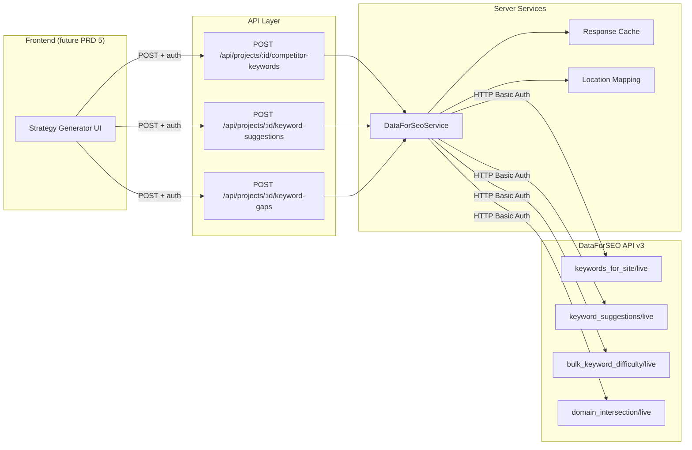
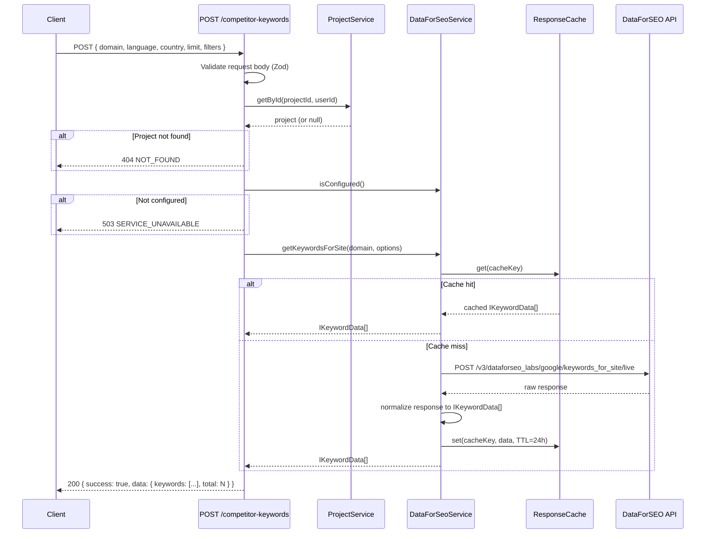
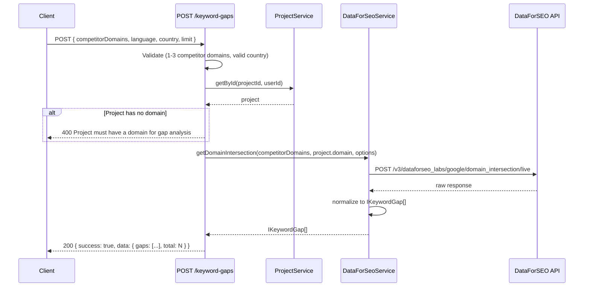
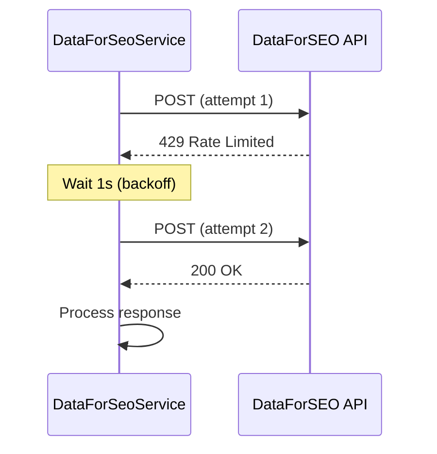

# PRD: DataForSEO API Integration

**Status:** Draft
**Complexity Score:** 6 → MEDIUM
**Created:** 2026-02-24
**Author:** Claude (Principal Architect)
**Series:** Outrank Feature Parity (3 of 6)
**Depends On:** PRD 1 (Schema & Data Model)
**Blocks:** PRD 5 (Content Strategy Generator)

---

## Complexity Assessment

| Factor | Score | Rationale |
|---|---|---|
| New files | 3 | Service, types, config, 3 API routes |
| External API integration | 2 | DataForSEO REST API with HTTP Basic Auth |
| Database changes | 0 | No schema changes (uses existing project table; caching is in-memory/KV) |
| Existing system coupling | 1 | Reads project data; no mutations to existing tables |
| **Total** | **6 → MEDIUM** | 4 phases, each under 5 files |

---

## Integration Points Checklist

- [ ] **Environment variables** — `DATAFORSEO_LOGIN`, `DATAFORSEO_PASSWORD` added to `shared/config/env.ts` serverEnvSchema and `loadServerEnv()`
- [ ] **Service singleton** — `server/services/dataforseo.service.ts` follows OpenRouter/GSC pattern (class + singleton export)
- [ ] **Shared types** — `shared/types/dataforseo.types.ts` with `I`-prefixed interfaces
- [ ] **Location mapping config** — `shared/config/dataforseo.config.ts` with top-20 country codes
- [ ] **API routes** — 3 POST endpoints under `src/pages/api/projects/[projectId]/`
- [ ] **Error handling** — Uses `AppError`, `ErrorCodes`, `handleApiError` from existing patterns
- [ ] **Cloudflare Workers** — All requests are simple fetch calls; no CPU-heavy computation; well under 10ms CPU limit

---

## 1. Context

### Problem

The content strategy generator (PRD 5) requires real SEO data to produce actionable keyword recommendations. Without search volume, keyword difficulty, and competitor keyword data, content strategies are guesswork. We need a programmatic data source for:

1. **Competitor keyword mining** — What keywords do competitor domains rank for?
2. **Keyword suggestions** — Given seed keywords, what related keywords exist with volume data?
3. **Keyword difficulty** — How hard is it to rank for specific keywords?
4. **Keyword gap analysis** — What keywords do competitors rank for that the user's domain does not?

### Why DataForSEO

- Pay-as-you-go pricing with $50 minimum top-up (no monthly commitment)
- Very low per-request costs (~$0.01-0.05 per request)
- 2000 requests/minute rate limit (generous)
- Comprehensive Labs API with pre-computed keyword data (no crawling delay)
- Simple HTTP Basic Auth (no OAuth complexity)
- Well-documented REST API with consistent response structure

### Current State

- Projects exist in `projects` table with `domain` field but no language/country settings
- No SEO data integration exists beyond Google Search Console (GSC)
- GSC provides first-party performance data but NOT competitor intelligence
- The OpenRouter and GSC services establish the service singleton pattern we will follow

### Files Analyzed

- `shared/config/env.ts` — Zod schema for server env vars, lazy-loaded proxy pattern
- `server/services/openrouter.service.ts` — Service class pattern with `isConfigured()`, singleton export
- `server/services/gsc.service.ts` — External API service with fetch calls, error handling
- `src/pages/api/_utils.ts` — `withAuth`, `withAuthAndBody`, `jsonResponse`, `errorResponse`, `handleApiError`
- `src/pages/api/projects/[projectId]/index.ts` — Project API route pattern
- `shared/types/project.types.ts` — Project interface (no language/country fields yet)
- `shared/utils/errors.ts` — `AppError`, `ErrorCodes`, `createErrorResponse`

---

## 2. Solution

### Architecture



### Key Decisions

1. **No database caching table** — Use an in-memory Map with TTL for response caching. On Cloudflare Workers, each request is isolated so the cache is per-isolate. This is acceptable because: (a) DataForSEO requests are cheap, (b) the same user rarely repeats the exact same query within minutes, and (c) adding a DB cache table adds schema complexity for minimal gain at this stage. If needed later, we can add Cloudflare KV or a `dataforseo_cache` table.

2. **Language/country passed per-request** — Rather than adding `language` and `country` columns to the `projects` table now (which PRD 1 Schema may handle), API endpoints accept `language` and `country` in the request body. This keeps this PRD self-contained and avoids schema migration coupling.

3. **Project ownership validation** — Every endpoint validates that the authenticated user owns the project before making DataForSEO calls. This ensures users cannot use another user's project ID to proxy requests.

4. **Graceful degradation** — If DataForSEO credentials are not configured, endpoints return 503 with a clear message. The rest of the app continues to function.

5. **Retry with exponential backoff** — Transient failures (429, 500, 502, 503, 504) are retried up to 3 times with exponential backoff (1s, 2s, 4s). Non-retryable errors (400, 401, 403) fail immediately.

6. **Location code mapping** — DataForSEO uses numeric location codes, not ISO country codes. We maintain a mapping config with the top 20 countries by search volume.

---

## 3. Sequence Flows

### 3.1 Competitor Keyword Mining



### 3.2 Keyword Gap Analysis



### 3.3 Retry Flow (Transient Failure)



---

## 4. Execution Phases

### Phase 1: Environment Config & Location Mapping

**Goal:** Add DataForSEO credentials to the env system and create the country-to-location-code mapping.

**Files:**

| # | File | Action |
|---|---|---|
| 1 | `shared/config/env.ts` | Add `DATAFORSEO_LOGIN` and `DATAFORSEO_PASSWORD` to `serverEnvSchema` and `loadServerEnv()` |
| 2 | `shared/config/dataforseo.config.ts` | **New** — Location code mapping, language code mapping, default config constants |
| 3 | `.env.api` | Add placeholder `DATAFORSEO_LOGIN=` and `DATAFORSEO_PASSWORD=` entries |

**Changes to `shared/config/env.ts`:**

In `serverEnvSchema`, add under the SEO section:

```typescript
// ==========================================
// DATAFORSEO (Keyword Research)
// ==========================================
// DataForSEO API credentials (HTTP Basic Auth)
// Sign up at https://dataforseo.com — $50 minimum top-up, pay-as-you-go
DATAFORSEO_LOGIN: z.string().default(''),
DATAFORSEO_PASSWORD: z.string().default(''),
```

In `loadServerEnv()`, add the env loading:

```typescript
// DataForSEO
DATAFORSEO_LOGIN: metaEnv.DATAFORSEO_LOGIN || processEnv.DATAFORSEO_LOGIN || '',
DATAFORSEO_PASSWORD: metaEnv.DATAFORSEO_PASSWORD || processEnv.DATAFORSEO_PASSWORD || '',
```

**`shared/config/dataforseo.config.ts`:**

```typescript
/**
 * DataForSEO Configuration
 *
 * Location codes and language mappings for DataForSEO Labs API.
 * DataForSEO uses numeric location codes (derived from Google Ads geo targets),
 * not ISO 3166-1 alpha-2 country codes.
 *
 * @see https://dataforseo.com/apis/dataforseo-labs-api
 * @see https://docs.dataforseo.com/v3/dataforseo_labs/locations_and_languages
 */

// =============================================================================
// Country → DataForSEO Location Code Mapping
// Top 20 countries by search market volume
// =============================================================================

export const COUNTRY_TO_LOCATION_CODE: Record<string, number> = {
  US: 2840,  // United States
  GB: 2826,  // United Kingdom
  CA: 2124,  // Canada
  AU: 2036,  // Australia
  DE: 2276,  // Germany
  FR: 2250,  // France
  ES: 2724,  // Spain
  IT: 2380,  // Italy
  NL: 2528,  // Netherlands
  BR: 2076,  // Brazil
  MX: 2484,  // Mexico
  IN: 2356,  // India
  JP: 2392,  // Japan
  KR: 2410,  // South Korea
  SE: 2752,  // Sweden
  NO: 2578,  // Norway
  DK: 2208,  // Denmark
  PL: 2616,  // Poland
  PT: 2620,  // Portugal
  IE: 2372,  // Ireland
} as const;

// =============================================================================
// Language Code Mapping
// DataForSEO uses standard language codes but requires explicit setting
// =============================================================================

export const LANGUAGE_CODES: Record<string, string> = {
  en: 'en',
  de: 'de',
  fr: 'fr',
  es: 'es',
  it: 'it',
  nl: 'nl',
  pt: 'pt',
  ja: 'ja',
  ko: 'ko',
  sv: 'sv',
  no: 'no',
  da: 'da',
  pl: 'pl',
  hi: 'hi',
} as const;

// =============================================================================
// Default Configuration
// =============================================================================

/** Default results limit per request */
export const DATAFORSEO_DEFAULT_LIMIT = 100;

/** Maximum results limit per request */
export const DATAFORSEO_MAX_LIMIT = 1000;

/** Maximum competitor domains for gap analysis */
export const DATAFORSEO_MAX_COMPETITORS = 3;

/** Maximum keywords for bulk difficulty check */
export const DATAFORSEO_MAX_BULK_KEYWORDS = 1000;

/** Cache TTL for keyword data (24 hours in milliseconds) */
export const DATAFORSEO_CACHE_TTL_MS = 24 * 60 * 60 * 1000;

/** Maximum retry attempts for transient failures */
export const DATAFORSEO_MAX_RETRIES = 3;

/** Base retry delay in milliseconds (doubles each attempt) */
export const DATAFORSEO_RETRY_BASE_DELAY_MS = 1000;

/** HTTP status codes that are retryable */
export const DATAFORSEO_RETRYABLE_STATUS_CODES = [429, 500, 502, 503, 504];

// =============================================================================
// Helpers
// =============================================================================

/**
 * Resolve a country ISO code to a DataForSEO location code.
 * Returns undefined if the country is not in our mapping.
 */
export function getLocationCode(countryIso: string): number | undefined {
  return COUNTRY_TO_LOCATION_CODE[countryIso.toUpperCase()];
}

/**
 * Resolve a language code to a DataForSEO language code.
 * Returns undefined if the language is not in our mapping.
 */
export function getLanguageCode(language: string): string | undefined {
  return LANGUAGE_CODES[language.toLowerCase()];
}

/**
 * Get all supported country codes as an array (for Zod enum validation).
 */
export function getSupportedCountryCodes(): string[] {
  return Object.keys(COUNTRY_TO_LOCATION_CODE);
}

/**
 * Get all supported language codes as an array (for Zod enum validation).
 */
export function getSupportedLanguageCodes(): string[] {
  return Object.keys(LANGUAGE_CODES);
}
```

**Tests Required:**

| Test | Validates |
|---|---|
| `dataforseo.config.test.ts` — `getLocationCode('US')` returns 2840 | Country mapping works |
| `dataforseo.config.test.ts` — `getLocationCode('xx')` returns undefined | Unknown country handled |
| `dataforseo.config.test.ts` — `getLanguageCode('en')` returns 'en' | Language mapping works |
| `dataforseo.config.test.ts` — `getSupportedCountryCodes()` has 20 entries | All 20 countries mapped |

---

### Phase 2: Types & Service

**Goal:** Create the DataForSEO type definitions and the service class with HTTP client, response normalization, caching, and retry logic.

**Files:**

| # | File | Action |
|---|---|---|
| 1 | `shared/types/dataforseo.types.ts` | **New** — Interfaces for keyword data, difficulty, gaps, and raw API responses |
| 2 | `server/services/dataforseo.service.ts` | **New** — Service class with 4 public methods, caching, retry logic, singleton export |

**`shared/types/dataforseo.types.ts`:**

```typescript
/**
 * DataForSEO Type Definitions
 *
 * Normalized types for DataForSEO Labs API responses.
 * These types abstract the raw API response format into clean domain models.
 *
 * @see https://docs.dataforseo.com/v3/dataforseo_labs
 */

// =============================================================================
// Domain Models (normalized from API responses)
// =============================================================================

/**
 * Normalized keyword data with search metrics.
 * Used by getKeywordsForSite() and getKeywordSuggestions().
 */
export interface IKeywordData {
  /** The keyword phrase */
  keyword: string;
  /** Average monthly search volume */
  searchVolume: number;
  /** Cost per click in USD */
  cpc: number;
  /** Competition level (0-1, where 1 is highest competition) */
  competition: number;
  /** Keyword difficulty score (0-100, where 100 is hardest) */
  difficulty: number;
  /** Monthly search volume trend (last 12 months, oldest first) */
  trend: number[];
}

/**
 * Keyword difficulty score.
 * Used by getBulkKeywordDifficulty().
 */
export interface IKeywordDifficulty {
  /** The keyword phrase */
  keyword: string;
  /** Difficulty score (0-100, where 100 is hardest to rank for) */
  difficulty: number;
}

/**
 * Keyword gap entry showing where competitors rank but you don't.
 * Used by getDomainIntersection().
 */
export interface IKeywordGap {
  /** The keyword phrase */
  keyword: string;
  /** Average monthly search volume */
  searchVolume: number;
  /** Keyword difficulty score (0-100) */
  difficulty: number;
  /** Your domain's ranking position (null if you don't rank) */
  yourPosition: number | null;
  /** Competitor domain positions: { "competitor.com": 3, "other.com": 7 } */
  competitorPositions: Record<string, number>;
}

// =============================================================================
// Request Options
// =============================================================================

/**
 * Common options for DataForSEO requests.
 */
export interface IDataForSeoRequestOptions {
  /** Language code (e.g., 'en', 'de', 'fr') */
  language: string;
  /** ISO 3166-1 alpha-2 country code (e.g., 'US', 'GB', 'DE') */
  country: string;
  /** Maximum number of results to return */
  limit?: number;
}

/**
 * Options for getKeywordsForSite().
 */
export interface IKeywordsForSiteOptions extends IDataForSeoRequestOptions {
  /** Filter results by minimum search volume */
  filters?: {
    minSearchVolume?: number;
    maxDifficulty?: number;
  };
}

/**
 * Options for getDomainIntersection().
 */
export interface IDomainIntersectionOptions extends IDataForSeoRequestOptions {
  /** Maximum number of gap results */
  limit?: number;
}

// =============================================================================
// API Response Types (raw DataForSEO format, used internally)
// =============================================================================

/**
 * Top-level DataForSEO API response envelope.
 * All endpoints return this structure.
 */
export interface IDataForSeoApiResponse<T = unknown> {
  version: string;
  status_code: number;
  status_message: string;
  time: string;
  cost: number;
  tasks_count: number;
  tasks_error: number;
  tasks: IDataForSeoTask<T>[];
}

/**
 * A single task within the DataForSEO response.
 */
export interface IDataForSeoTask<T = unknown> {
  id: string;
  status_code: number;
  status_message: string;
  time: string;
  cost: number;
  result_count: number;
  path: string[];
  data: Record<string, unknown>;
  result: T[] | null;
}

/**
 * Raw keywords_for_site result item.
 */
export interface IDataForSeoKeywordsForSiteResult {
  se_type: string;
  target: string;
  location_code: number;
  language_code: string;
  total_count: number;
  items_count: number;
  items: IDataForSeoKeywordItem[] | null;
}

/**
 * Raw keyword_suggestions result item.
 */
export interface IDataForSeoKeywordSuggestionsResult {
  se_type: string;
  seed_keywords: string[];
  location_code: number;
  language_code: string;
  total_count: number;
  items_count: number;
  items: IDataForSeoKeywordItem[] | null;
}

/**
 * Individual keyword item from DataForSEO Labs responses.
 */
export interface IDataForSeoKeywordItem {
  keyword: string;
  keyword_info: {
    se_type: string;
    last_updated_time: string;
    competition: number;
    competition_level: string;
    cpc: number;
    search_volume: number;
    monthly_searches: Array<{
      year: number;
      month: number;
      search_volume: number;
    }> | null;
  };
  keyword_properties?: {
    se_type: string;
    core_keyword: string | null;
    synonym_clustering_algorithm: string;
    keyword_difficulty: number;
  };
  impressions_info?: {
    se_type: string;
    last_updated_time: string;
    bid: number;
    match_type: string;
    ad_position_min: number | null;
    ad_position_max: number | null;
    ad_position_average: number | null;
    cpc_min: number | null;
    cpc_max: number | null;
    daily_impressions_min: number | null;
    daily_impressions_max: number | null;
    daily_clicks_min: number | null;
    daily_clicks_max: number | null;
    daily_cost_min: number | null;
    daily_cost_max: number | null;
  };
}

/**
 * Raw bulk_keyword_difficulty result item.
 */
export interface IDataForSeoBulkDifficultyResult {
  se_type: string;
  location_code: number;
  language_code: string;
  total_count: number;
  items_count: number;
  items: Array<{
    keyword: string;
    keyword_difficulty: number;
  }> | null;
}

/**
 * Raw domain_intersection result item.
 */
export interface IDataForSeoDomainIntersectionResult {
  se_type: string;
  location_code: number;
  language_code: string;
  total_count: number;
  items_count: number;
  items: IDataForSeoDomainIntersectionItem[] | null;
}

/**
 * Individual keyword gap item from domain_intersection.
 */
export interface IDataForSeoDomainIntersectionItem {
  keyword: string;
  keyword_info: {
    search_volume: number;
    competition: number;
    cpc: number;
    monthly_searches: Array<{
      year: number;
      month: number;
      search_volume: number;
    }> | null;
  };
  keyword_properties?: {
    keyword_difficulty: number;
  };
  /** Indexed by "1", "2", "3" — one per domain in the request */
  [key: string]: unknown;
}
```

**`server/services/dataforseo.service.ts`:**

```typescript
/**
 * DataForSEO Labs API Service
 *
 * Provides competitor keyword mining, keyword suggestions,
 * bulk keyword difficulty, and keyword gap analysis via DataForSEO Labs API.
 *
 * Auth: HTTP Basic Auth (login:password base64-encoded)
 * Base URL: https://api.dataforseo.com/v3
 * Rate limit: 2000 req/min
 *
 * @see https://docs.dataforseo.com/v3/dataforseo_labs
 */

import { serverEnv } from '@shared/config/env';
import {
  getLocationCode,
  getLanguageCode,
  DATAFORSEO_DEFAULT_LIMIT,
  DATAFORSEO_MAX_LIMIT,
  DATAFORSEO_MAX_BULK_KEYWORDS,
  DATAFORSEO_CACHE_TTL_MS,
  DATAFORSEO_MAX_RETRIES,
  DATAFORSEO_RETRY_BASE_DELAY_MS,
  DATAFORSEO_RETRYABLE_STATUS_CODES,
} from '@shared/config/dataforseo.config';
import type {
  IKeywordData,
  IKeywordDifficulty,
  IKeywordGap,
  IKeywordsForSiteOptions,
  IDataForSeoRequestOptions,
  IDomainIntersectionOptions,
  IDataForSeoApiResponse,
  IDataForSeoKeywordsForSiteResult,
  IDataForSeoKeywordSuggestionsResult,
  IDataForSeoBulkDifficultyResult,
  IDataForSeoDomainIntersectionResult,
  IDataForSeoKeywordItem,
} from '@shared/types/dataforseo.types';

// =============================================================================
// Constants
// =============================================================================

const BASE_URL = 'https://api.dataforseo.com/v3';

// =============================================================================
// Cache
// =============================================================================

interface ICacheEntry<T> {
  data: T;
  expiresAt: number;
}

/**
 * Simple in-memory TTL cache.
 * On Cloudflare Workers each isolate has its own memory, so this provides
 * within-request deduplication and short-lived caching for repeated calls.
 * In long-running dev servers, it provides genuine 24h caching.
 */
class ResponseCache {
  private store = new Map<string, ICacheEntry<unknown>>();

  get<T>(key: string): T | null {
    const entry = this.store.get(key);
    if (!entry) return null;
    if (Date.now() > entry.expiresAt) {
      this.store.delete(key);
      return null;
    }
    return entry.data as T;
  }

  set<T>(key: string, data: T, ttlMs: number): void {
    // Prevent unbounded memory growth: evict expired entries periodically
    if (this.store.size > 500) {
      this.evictExpired();
    }
    this.store.set(key, { data, expiresAt: Date.now() + ttlMs });
  }

  private evictExpired(): void {
    const now = Date.now();
    for (const [key, entry] of this.store.entries()) {
      if (now > entry.expiresAt) {
        this.store.delete(key);
      }
    }
  }
}

// =============================================================================
// Service
// =============================================================================

/**
 * DataForSEO Labs API client.
 * Provides keyword research data for competitor analysis and content strategy.
 */
export class DataForSeoService {
  private cache = new ResponseCache();

  // ===========================================================================
  // Configuration
  // ===========================================================================

  /**
   * Check if DataForSEO credentials are configured.
   */
  isConfigured(): boolean {
    return !!(serverEnv.DATAFORSEO_LOGIN && serverEnv.DATAFORSEO_PASSWORD);
  }

  /**
   * Get the HTTP Basic Auth header value.
   */
  private getAuthHeader(): string {
    const credentials = `${serverEnv.DATAFORSEO_LOGIN}:${serverEnv.DATAFORSEO_PASSWORD}`;
    // btoa is available in Cloudflare Workers and modern Node.js
    return `Basic ${btoa(credentials)}`;
  }

  // ===========================================================================
  // Public API Methods
  // ===========================================================================

  /**
   * Get keywords that a competitor domain ranks for.
   *
   * Uses DataForSEO Labs "keywords_for_site" endpoint to retrieve
   * all keywords a given domain has organic rankings for.
   *
   * @param domain - Competitor domain to analyze (e.g., "competitor.com")
   * @param options - Language, country, limit, and optional filters
   * @returns Normalized keyword data sorted by search volume descending
   */
  async getKeywordsForSite(
    domain: string,
    options: IKeywordsForSiteOptions
  ): Promise<IKeywordData[]> {
    const locationCode = this.resolveLocationCode(options.country);
    const languageCode = this.resolveLanguageCode(options.language);
    const limit = Math.min(options.limit ?? DATAFORSEO_DEFAULT_LIMIT, DATAFORSEO_MAX_LIMIT);

    // Check cache
    const cacheKey = `kfs:${domain}:${locationCode}:${languageCode}:${limit}:${JSON.stringify(options.filters ?? {})}`;
    const cached = this.cache.get<IKeywordData[]>(cacheKey);
    if (cached) {
      console.log('[DataForSEO] Cache hit for keywords_for_site:', domain);
      return cached;
    }

    // Build request body with filters
    const filters = this.buildKeywordFilters(options.filters);

    const body = [
      {
        target: domain,
        location_code: locationCode,
        language_code: languageCode,
        limit,
        ...(filters.length > 0 && { filters }),
      },
    ];

    console.log('[DataForSEO] Fetching keywords_for_site for:', domain);

    const response = await this.makeRequest<IDataForSeoKeywordsForSiteResult>(
      '/dataforseo_labs/google/keywords_for_site/live',
      body
    );

    const items = response.tasks?.[0]?.result?.[0]?.items ?? [];
    const keywords = items.map(item => this.normalizeKeywordItem(item));

    // Cache the result
    this.cache.set(cacheKey, keywords, DATAFORSEO_CACHE_TTL_MS);

    console.log('[DataForSEO] keywords_for_site returned', keywords.length, 'keywords for:', domain);
    return keywords;
  }

  /**
   * Get keyword suggestions from seed keywords.
   *
   * Uses DataForSEO Labs "keyword_suggestions" endpoint to expand
   * seed keywords into related keyword ideas with search metrics.
   *
   * @param seedKeywords - Array of seed keywords to expand (max 20)
   * @param options - Language, country, and limit
   * @returns Normalized keyword suggestions sorted by search volume descending
   */
  async getKeywordSuggestions(
    seedKeywords: string[],
    options: IDataForSeoRequestOptions
  ): Promise<IKeywordData[]> {
    if (seedKeywords.length === 0) {
      return [];
    }

    const locationCode = this.resolveLocationCode(options.country);
    const languageCode = this.resolveLanguageCode(options.language);
    const limit = Math.min(options.limit ?? DATAFORSEO_DEFAULT_LIMIT, DATAFORSEO_MAX_LIMIT);

    // Check cache
    const sortedSeeds = [...seedKeywords].sort().join(',');
    const cacheKey = `ks:${sortedSeeds}:${locationCode}:${languageCode}:${limit}`;
    const cached = this.cache.get<IKeywordData[]>(cacheKey);
    if (cached) {
      console.log('[DataForSEO] Cache hit for keyword_suggestions:', sortedSeeds);
      return cached;
    }

    const body = [
      {
        keywords: seedKeywords.slice(0, 20), // API limit
        location_code: locationCode,
        language_code: languageCode,
        limit,
        include_seed_keyword: false,
      },
    ];

    console.log('[DataForSEO] Fetching keyword_suggestions for:', seedKeywords.join(', '));

    const response = await this.makeRequest<IDataForSeoKeywordSuggestionsResult>(
      '/dataforseo_labs/google/keyword_suggestions/live',
      body
    );

    const items = response.tasks?.[0]?.result?.[0]?.items ?? [];
    const keywords = items.map(item => this.normalizeKeywordItem(item));

    this.cache.set(cacheKey, keywords, DATAFORSEO_CACHE_TTL_MS);

    console.log('[DataForSEO] keyword_suggestions returned', keywords.length, 'keywords');
    return keywords;
  }

  /**
   * Get difficulty scores for a batch of keywords.
   *
   * Uses DataForSEO Labs "bulk_keyword_difficulty" endpoint.
   * Efficient way to check difficulty for many keywords at once.
   *
   * @param keywords - Array of keywords (max 1000)
   * @param options - Language and country
   * @returns Difficulty scores for each keyword
   */
  async getBulkKeywordDifficulty(
    keywords: string[],
    options: IDataForSeoRequestOptions
  ): Promise<IKeywordDifficulty[]> {
    if (keywords.length === 0) {
      return [];
    }

    const locationCode = this.resolveLocationCode(options.country);
    const languageCode = this.resolveLanguageCode(options.language);

    // Check cache
    const sortedKws = [...keywords].sort().join(',');
    const cacheKey = `bkd:${sortedKws}:${locationCode}:${languageCode}`;
    const cached = this.cache.get<IKeywordDifficulty[]>(cacheKey);
    if (cached) {
      console.log('[DataForSEO] Cache hit for bulk_keyword_difficulty');
      return cached;
    }

    const body = [
      {
        keywords: keywords.slice(0, DATAFORSEO_MAX_BULK_KEYWORDS),
        location_code: locationCode,
        language_code: languageCode,
      },
    ];

    console.log('[DataForSEO] Fetching bulk_keyword_difficulty for', keywords.length, 'keywords');

    const response = await this.makeRequest<IDataForSeoBulkDifficultyResult>(
      '/dataforseo_labs/google/bulk_keyword_difficulty/live',
      body
    );

    const items = response.tasks?.[0]?.result?.[0]?.items ?? [];
    const difficulties: IKeywordDifficulty[] = items.map(item => ({
      keyword: item.keyword,
      difficulty: item.keyword_difficulty ?? 0,
    }));

    this.cache.set(cacheKey, difficulties, DATAFORSEO_CACHE_TTL_MS);

    console.log('[DataForSEO] bulk_keyword_difficulty returned', difficulties.length, 'results');
    return difficulties;
  }

  /**
   * Find keyword gaps: keywords competitors rank for that you don't.
   *
   * Uses DataForSEO Labs "domain_intersection" endpoint to compare
   * up to 3 competitor domains against your domain.
   *
   * @param competitorDomains - Array of competitor domains (1-3)
   * @param yourDomain - Your domain (null to get all competitor keywords)
   * @param options - Language, country, and limit
   * @returns Keyword gap data with positions for each domain
   */
  async getDomainIntersection(
    competitorDomains: string[],
    yourDomain: string | null,
    options: IDomainIntersectionOptions
  ): Promise<IKeywordGap[]> {
    if (competitorDomains.length === 0) {
      return [];
    }

    const locationCode = this.resolveLocationCode(options.country);
    const languageCode = this.resolveLanguageCode(options.language);
    const limit = Math.min(options.limit ?? DATAFORSEO_DEFAULT_LIMIT, DATAFORSEO_MAX_LIMIT);

    // Check cache
    const domainsKey = [...competitorDomains].sort().join(',');
    const cacheKey = `di:${domainsKey}:${yourDomain ?? 'none'}:${locationCode}:${languageCode}:${limit}`;
    const cached = this.cache.get<IKeywordGap[]>(cacheKey);
    if (cached) {
      console.log('[DataForSEO] Cache hit for domain_intersection');
      return cached;
    }

    // Build targets map: domain_intersection expects a targets object
    // with numeric keys "1", "2", "3" for each domain
    const targets: Record<string, string> = {};
    competitorDomains.slice(0, 3).forEach((domain, index) => {
      targets[String(index + 1)] = domain;
    });

    // If yourDomain is provided, include it as the last target
    // for position comparison
    const allDomains = yourDomain
      ? [...competitorDomains.slice(0, 3), yourDomain]
      : competitorDomains.slice(0, 3);

    const body = [
      {
        targets: Object.fromEntries(
          allDomains.map((domain, index) => [String(index + 1), domain])
        ),
        location_code: locationCode,
        language_code: languageCode,
        limit,
        // Only return keywords where at least one competitor ranks
        // but exclude keywords where all domains rank equally
        ...(yourDomain && {
          exclude_intersections: true,
        }),
      },
    ];

    console.log(
      '[DataForSEO] Fetching domain_intersection for:',
      competitorDomains.join(', '),
      yourDomain ? `vs ${yourDomain}` : '(no own domain)'
    );

    const response = await this.makeRequest<IDataForSeoDomainIntersectionResult>(
      '/dataforseo_labs/google/domain_intersection/live',
      body
    );

    const items = response.tasks?.[0]?.result?.[0]?.items ?? [];
    const gaps: IKeywordGap[] = items.map(item => {
      const competitorPositions: Record<string, number> = {};

      // Extract positions from intersection_result for each domain
      competitorDomains.forEach((domain, index) => {
        const posKey = String(index + 1);
        const domainResult = item[posKey] as
          | { avg_position?: number; se_results_count?: number }
          | undefined;
        if (domainResult?.avg_position) {
          competitorPositions[domain] = Math.round(domainResult.avg_position);
        }
      });

      // Your position (last domain in the targets if provided)
      let yourPosition: number | null = null;
      if (yourDomain) {
        const yourKey = String(allDomains.indexOf(yourDomain) + 1);
        const yourResult = item[yourKey] as
          | { avg_position?: number }
          | undefined;
        yourPosition = yourResult?.avg_position
          ? Math.round(yourResult.avg_position)
          : null;
      }

      return {
        keyword: item.keyword,
        searchVolume: item.keyword_info?.search_volume ?? 0,
        difficulty: item.keyword_properties?.keyword_difficulty ?? 0,
        yourPosition,
        competitorPositions,
      };
    });

    this.cache.set(cacheKey, gaps, DATAFORSEO_CACHE_TTL_MS);

    console.log('[DataForSEO] domain_intersection returned', gaps.length, 'keyword gaps');
    return gaps;
  }

  // ===========================================================================
  // Private Helpers
  // ===========================================================================

  /**
   * Make an authenticated request to the DataForSEO API with retry logic.
   */
  private async makeRequest<T>(
    path: string,
    body: unknown
  ): Promise<IDataForSeoApiResponse<T>> {
    let lastError: Error | null = null;

    for (let attempt = 0; attempt <= DATAFORSEO_MAX_RETRIES; attempt++) {
      try {
        const response = await fetch(`${BASE_URL}${path}`, {
          method: 'POST',
          headers: {
            Authorization: this.getAuthHeader(),
            'Content-Type': 'application/json',
          },
          body: JSON.stringify(body),
        });

        // Non-retryable client errors — fail immediately
        if (response.status === 400) {
          const errorBody = await response.text();
          console.error('[DataForSEO] Bad request (400):', errorBody);
          throw new DataForSeoError(
            'Invalid request to DataForSEO API',
            400,
            errorBody
          );
        }

        if (response.status === 401 || response.status === 403) {
          console.error('[DataForSEO] Authentication failed:', response.status);
          throw new DataForSeoError(
            'DataForSEO authentication failed. Check DATAFORSEO_LOGIN and DATAFORSEO_PASSWORD.',
            response.status
          );
        }

        // Retryable errors
        if (DATAFORSEO_RETRYABLE_STATUS_CODES.includes(response.status)) {
          const retryAfter = attempt < DATAFORSEO_MAX_RETRIES
            ? DATAFORSEO_RETRY_BASE_DELAY_MS * Math.pow(2, attempt)
            : 0;

          console.warn(
            `[DataForSEO] Retryable error ${response.status} on attempt ${attempt + 1}/${DATAFORSEO_MAX_RETRIES + 1}`,
            retryAfter > 0 ? `Retrying in ${retryAfter}ms...` : 'No more retries.'
          );

          if (attempt < DATAFORSEO_MAX_RETRIES) {
            await this.sleep(retryAfter);
            continue;
          }

          throw new DataForSeoError(
            `DataForSEO API returned ${response.status} after ${DATAFORSEO_MAX_RETRIES + 1} attempts`,
            response.status
          );
        }

        // Unexpected non-200 status
        if (!response.ok) {
          const errorBody = await response.text();
          console.error('[DataForSEO] Unexpected error:', response.status, errorBody);
          throw new DataForSeoError(
            `DataForSEO API error: ${response.status}`,
            response.status,
            errorBody
          );
        }

        // Success — parse response
        const data = (await response.json()) as IDataForSeoApiResponse<T>;

        // Check task-level errors
        if (data.tasks_error > 0) {
          const firstError = data.tasks?.[0];
          if (firstError && firstError.status_code !== 20000) {
            console.error(
              '[DataForSEO] Task error:',
              firstError.status_code,
              firstError.status_message
            );
            throw new DataForSeoError(
              `DataForSEO task error: ${firstError.status_message}`,
              firstError.status_code
            );
          }
        }

        return data;
      } catch (error) {
        if (error instanceof DataForSeoError) {
          throw error; // Don't retry known errors
        }
        // Network errors are retryable
        lastError = error instanceof Error ? error : new Error(String(error));
        if (attempt < DATAFORSEO_MAX_RETRIES) {
          const retryDelay = DATAFORSEO_RETRY_BASE_DELAY_MS * Math.pow(2, attempt);
          console.warn(
            `[DataForSEO] Network error on attempt ${attempt + 1}, retrying in ${retryDelay}ms:`,
            lastError.message
          );
          await this.sleep(retryDelay);
        }
      }
    }

    throw new DataForSeoError(
      `DataForSEO API request failed after ${DATAFORSEO_MAX_RETRIES + 1} attempts: ${lastError?.message ?? 'unknown error'}`,
      500
    );
  }

  /**
   * Normalize a raw DataForSEO keyword item to our IKeywordData format.
   */
  private normalizeKeywordItem(item: IDataForSeoKeywordItem): IKeywordData {
    const monthlySearches = item.keyword_info?.monthly_searches ?? [];
    // Sort by date ascending (oldest first) and take last 12 months
    const trend = monthlySearches
      .sort((a, b) => a.year - b.year || a.month - b.month)
      .slice(-12)
      .map(m => m.search_volume);

    return {
      keyword: item.keyword,
      searchVolume: item.keyword_info?.search_volume ?? 0,
      cpc: item.keyword_info?.cpc ?? 0,
      competition: item.keyword_info?.competition ?? 0,
      difficulty: item.keyword_properties?.keyword_difficulty ?? 0,
      trend,
    };
  }

  /**
   * Build DataForSEO filter array from our filter options.
   * DataForSEO uses a specific filter format: [field, operator, value]
   * Multiple filters are joined with "and".
   */
  private buildKeywordFilters(
    filters?: IKeywordsForSiteOptions['filters']
  ): (string | number | (string | number)[])[] {
    if (!filters) return [];

    const filterParts: (string | number | (string | number)[])[] = [];

    if (filters.minSearchVolume !== undefined) {
      if (filterParts.length > 0) filterParts.push('and');
      filterParts.push(['keyword_info.search_volume', '>=', filters.minSearchVolume]);
    }

    if (filters.maxDifficulty !== undefined) {
      if (filterParts.length > 0) filterParts.push('and');
      filterParts.push([
        'keyword_properties.keyword_difficulty',
        '<=',
        filters.maxDifficulty,
      ]);
    }

    return filterParts;
  }

  /**
   * Resolve ISO country code to DataForSEO location code.
   * Throws if the country is not supported.
   */
  private resolveLocationCode(country: string): number {
    const code = getLocationCode(country);
    if (!code) {
      throw new DataForSeoError(
        `Unsupported country code: "${country}". Supported: US, GB, CA, AU, DE, FR, ES, IT, NL, BR, MX, IN, JP, KR, SE, NO, DK, PL, PT, IE`,
        400
      );
    }
    return code;
  }

  /**
   * Resolve language identifier to DataForSEO language code.
   * Throws if the language is not supported.
   */
  private resolveLanguageCode(language: string): string {
    const code = getLanguageCode(language);
    if (!code) {
      throw new DataForSeoError(
        `Unsupported language code: "${language}". Supported: en, de, fr, es, it, nl, pt, ja, ko, sv, no, da, pl, hi`,
        400
      );
    }
    return code;
  }

  /**
   * Sleep for the specified duration. Works in both Node.js and CF Workers.
   */
  private sleep(ms: number): Promise<void> {
    return new Promise(resolve => setTimeout(resolve, ms));
  }
}

// =============================================================================
// Error Class
// =============================================================================

/**
 * DataForSEO-specific error with status code for proper HTTP response mapping.
 */
export class DataForSeoError extends Error {
  public readonly statusCode: number;
  public readonly responseBody?: string;

  constructor(message: string, statusCode: number, responseBody?: string) {
    super(message);
    this.name = 'DataForSeoError';
    this.statusCode = statusCode;
    this.responseBody = responseBody;
  }
}

// =============================================================================
// Singleton Export
// =============================================================================

export const dataForSeoService = new DataForSeoService();
```

**Tests Required:**

| Test | Validates |
|---|---|
| `dataforseo.service.test.ts` — `isConfigured()` returns false when env vars empty | Graceful degradation |
| `dataforseo.service.test.ts` — `isConfigured()` returns true when both env vars set | Configuration detection |
| `dataforseo.service.test.ts` — `resolveLocationCode('US')` returns 2840 | Location resolution |
| `dataforseo.service.test.ts` — `resolveLocationCode('XX')` throws DataForSeoError | Invalid country handling |
| `dataforseo.service.test.ts` — `normalizeKeywordItem()` maps raw API fields correctly | Response normalization |
| `dataforseo.service.test.ts` — `buildKeywordFilters()` builds correct filter arrays | Filter construction |
| `dataforseo.service.test.ts` — `getKeywordsForSite()` returns cached results on second call | Cache hit path |
| `dataforseo.service.test.ts` — `makeRequest()` retries on 429 with backoff | Retry logic |
| `dataforseo.service.test.ts` — `makeRequest()` does NOT retry on 400/401 | Non-retryable errors |
| `dataforseo.service.test.ts` — `getKeywordsForSite()` returns empty array for domain with no data | Empty results handling |

---

### Phase 3: API Endpoints

**Goal:** Create the 3 API routes that expose DataForSEO data to the frontend, with proper auth, validation, and error handling.

**Files:**

| # | File | Action |
|---|---|---|
| 1 | `src/pages/api/projects/[projectId]/competitor-keywords.ts` | **New** — POST endpoint for competitor keyword mining |
| 2 | `src/pages/api/projects/[projectId]/keyword-suggestions.ts` | **New** — POST endpoint for keyword suggestions |
| 3 | `src/pages/api/projects/[projectId]/keyword-gaps.ts` | **New** — POST endpoint for keyword gap analysis |

**`src/pages/api/projects/[projectId]/competitor-keywords.ts`:**

```typescript
/**
 * Competitor Keywords API
 * POST /api/projects/:projectId/competitor-keywords
 *
 * Get keywords that a competitor domain ranks for using DataForSEO Labs API.
 * Requires authenticated user who owns the project.
 */

import { z } from 'zod';
import { projectService } from '@server/services/project.service';
import { dataForSeoService, DataForSeoError } from '@server/services/dataforseo.service';
import { getSupportedCountryCodes, getSupportedLanguageCodes } from '@shared/config/dataforseo.config';
import { withAuthAndBody, jsonResponse, errorResponse } from '../../_utils';

const competitorKeywordsSchema = z.object({
  /** Competitor domain to analyze (e.g., "competitor.com") */
  domain: z
    .string()
    .min(1, 'Domain is required')
    .max(253, 'Domain too long')
    .regex(
      /^[a-zA-Z0-9]([a-zA-Z0-9-]*[a-zA-Z0-9])?(\.[a-zA-Z0-9]([a-zA-Z0-9-]*[a-zA-Z0-9])?)*\.[a-zA-Z]{2,}$/,
      'Invalid domain format. Example: competitor.com'
    ),
  /** Language code (e.g., "en") */
  language: z.string().min(2).max(5),
  /** ISO country code (e.g., "US") */
  country: z.string().length(2).toUpperCase(),
  /** Max results to return (default 100, max 1000) */
  limit: z.number().int().min(1).max(1000).optional(),
  /** Optional filters */
  filters: z
    .object({
      minSearchVolume: z.number().int().min(0).optional(),
      maxDifficulty: z.number().int().min(0).max(100).optional(),
    })
    .optional(),
});

export const POST = withAuthAndBody(competitorKeywordsSchema, async (userId, body, context) => {
  const projectId = context.params.projectId;
  if (!projectId) {
    return errorResponse('VALIDATION_ERROR', 'Project ID is required', 400);
  }

  // Verify project ownership
  const project = await projectService.getById(projectId, userId);
  if (!project) {
    return errorResponse('NOT_FOUND', 'Project not found', 404);
  }

  // Check DataForSEO is configured
  if (!dataForSeoService.isConfigured()) {
    return errorResponse(
      'SERVICE_UNAVAILABLE',
      'Keyword research service is not configured. Contact support.',
      503
    );
  }

  try {
    const keywords = await dataForSeoService.getKeywordsForSite(body.domain, {
      language: body.language,
      country: body.country,
      limit: body.limit,
      filters: body.filters,
    });

    return jsonResponse({
      keywords,
      total: keywords.length,
      domain: body.domain,
      country: body.country,
      language: body.language,
    });
  } catch (error) {
    if (error instanceof DataForSeoError) {
      // Map DataForSEO errors to appropriate HTTP status codes
      const status = error.statusCode >= 400 && error.statusCode < 600
        ? error.statusCode
        : 502;
      return errorResponse('EXTERNAL_API_ERROR', error.message, status);
    }
    throw error; // Let withAuth's error handler catch unexpected errors
  }
});
```

**`src/pages/api/projects/[projectId]/keyword-suggestions.ts`:**

```typescript
/**
 * Keyword Suggestions API
 * POST /api/projects/:projectId/keyword-suggestions
 *
 * Get keyword suggestions from seed keywords using DataForSEO Labs API.
 * Requires authenticated user who owns the project.
 */

import { z } from 'zod';
import { projectService } from '@server/services/project.service';
import { dataForSeoService, DataForSeoError } from '@server/services/dataforseo.service';
import { withAuthAndBody, jsonResponse, errorResponse } from '../../_utils';

const keywordSuggestionsSchema = z.object({
  /** Seed keywords to expand (1-20 keywords) */
  seedKeywords: z
    .array(z.string().min(1).max(200))
    .min(1, 'At least one seed keyword is required')
    .max(20, 'Maximum 20 seed keywords allowed'),
  /** Language code (e.g., "en") */
  language: z.string().min(2).max(5),
  /** ISO country code (e.g., "US") */
  country: z.string().length(2).toUpperCase(),
  /** Max results to return (default 100, max 1000) */
  limit: z.number().int().min(1).max(1000).optional(),
});

export const POST = withAuthAndBody(keywordSuggestionsSchema, async (userId, body, context) => {
  const projectId = context.params.projectId;
  if (!projectId) {
    return errorResponse('VALIDATION_ERROR', 'Project ID is required', 400);
  }

  // Verify project ownership
  const project = await projectService.getById(projectId, userId);
  if (!project) {
    return errorResponse('NOT_FOUND', 'Project not found', 404);
  }

  // Check DataForSEO is configured
  if (!dataForSeoService.isConfigured()) {
    return errorResponse(
      'SERVICE_UNAVAILABLE',
      'Keyword research service is not configured. Contact support.',
      503
    );
  }

  try {
    const keywords = await dataForSeoService.getKeywordSuggestions(body.seedKeywords, {
      language: body.language,
      country: body.country,
      limit: body.limit,
    });

    return jsonResponse({
      keywords,
      total: keywords.length,
      seedKeywords: body.seedKeywords,
      country: body.country,
      language: body.language,
    });
  } catch (error) {
    if (error instanceof DataForSeoError) {
      const status = error.statusCode >= 400 && error.statusCode < 600
        ? error.statusCode
        : 502;
      return errorResponse('EXTERNAL_API_ERROR', error.message, status);
    }
    throw error;
  }
});
```

**`src/pages/api/projects/[projectId]/keyword-gaps.ts`:**

```typescript
/**
 * Keyword Gaps API
 * POST /api/projects/:projectId/keyword-gaps
 *
 * Find keywords that competitor domains rank for but the project's domain doesn't.
 * Uses DataForSEO Labs domain_intersection endpoint.
 * Requires authenticated user who owns the project.
 */

import { z } from 'zod';
import { projectService } from '@server/services/project.service';
import { dataForSeoService, DataForSeoError } from '@server/services/dataforseo.service';
import { DATAFORSEO_MAX_COMPETITORS } from '@shared/config/dataforseo.config';
import { withAuthAndBody, jsonResponse, errorResponse } from '../../_utils';

const keywordGapsSchema = z.object({
  /** Competitor domains to analyze (1-3 domains) */
  competitorDomains: z
    .array(
      z
        .string()
        .min(1)
        .max(253)
        .regex(
          /^[a-zA-Z0-9]([a-zA-Z0-9-]*[a-zA-Z0-9])?(\.[a-zA-Z0-9]([a-zA-Z0-9-]*[a-zA-Z0-9])?)*\.[a-zA-Z]{2,}$/,
          'Invalid domain format'
        )
    )
    .min(1, 'At least one competitor domain is required')
    .max(DATAFORSEO_MAX_COMPETITORS, `Maximum ${DATAFORSEO_MAX_COMPETITORS} competitor domains allowed`),
  /** Language code (e.g., "en") */
  language: z.string().min(2).max(5),
  /** ISO country code (e.g., "US") */
  country: z.string().length(2).toUpperCase(),
  /** Max results to return (default 100, max 1000) */
  limit: z.number().int().min(1).max(1000).optional(),
});

export const POST = withAuthAndBody(keywordGapsSchema, async (userId, body, context) => {
  const projectId = context.params.projectId;
  if (!projectId) {
    return errorResponse('VALIDATION_ERROR', 'Project ID is required', 400);
  }

  // Verify project ownership
  const project = await projectService.getById(projectId, userId);
  if (!project) {
    return errorResponse('NOT_FOUND', 'Project not found', 404);
  }

  // Project must have a domain for gap analysis
  if (!project.domain) {
    return errorResponse(
      'VALIDATION_ERROR',
      'Project must have a domain configured to perform keyword gap analysis. Update your project settings first.',
      400
    );
  }

  // Check DataForSEO is configured
  if (!dataForSeoService.isConfigured()) {
    return errorResponse(
      'SERVICE_UNAVAILABLE',
      'Keyword research service is not configured. Contact support.',
      503
    );
  }

  // Prevent comparing a domain against itself
  const normalizedProjectDomain = project.domain.replace(/^https?:\/\//, '').replace(/\/$/, '');
  const normalizedCompetitors = body.competitorDomains.map(d =>
    d.replace(/^https?:\/\//, '').replace(/\/$/, '')
  );
  const selfCompare = normalizedCompetitors.find(d => d === normalizedProjectDomain);
  if (selfCompare) {
    return errorResponse(
      'VALIDATION_ERROR',
      `Cannot compare a domain against itself: "${selfCompare}". Remove your own domain from the competitor list.`,
      400
    );
  }

  try {
    const gaps = await dataForSeoService.getDomainIntersection(
      normalizedCompetitors,
      normalizedProjectDomain,
      {
        language: body.language,
        country: body.country,
        limit: body.limit,
      }
    );

    return jsonResponse({
      gaps,
      total: gaps.length,
      yourDomain: normalizedProjectDomain,
      competitorDomains: normalizedCompetitors,
      country: body.country,
      language: body.language,
    });
  } catch (error) {
    if (error instanceof DataForSeoError) {
      const status = error.statusCode >= 400 && error.statusCode < 600
        ? error.statusCode
        : 502;
      return errorResponse('EXTERNAL_API_ERROR', error.message, status);
    }
    throw error;
  }
});
```

**Tests Required:**

| Test | Validates |
|---|---|
| `competitor-keywords.api.test.ts` — returns 401 without auth | Auth required |
| `competitor-keywords.api.test.ts` — returns 404 for unknown project | Project ownership |
| `competitor-keywords.api.test.ts` — returns 503 when DataForSEO not configured | Graceful degradation |
| `competitor-keywords.api.test.ts` — returns 400 for invalid domain format | Input validation |
| `competitor-keywords.api.test.ts` — returns 200 with keyword data | Happy path |
| `keyword-suggestions.api.test.ts` — returns 400 for empty seedKeywords array | Input validation |
| `keyword-suggestions.api.test.ts` — returns 200 with suggestions | Happy path |
| `keyword-gaps.api.test.ts` — returns 400 when project has no domain | Domain required check |
| `keyword-gaps.api.test.ts` — returns 400 when comparing domain against itself | Self-compare prevention |
| `keyword-gaps.api.test.ts` — returns 200 with gap data | Happy path |

**Verification (curl commands):**

```bash
# Competitor Keywords
curl -X POST http://localhost:4321/api/projects/{PROJECT_ID}/competitor-keywords \
  -H "Authorization: Bearer {TOKEN}" \
  -H "Content-Type: application/json" \
  -d '{
    "domain": "ahrefs.com",
    "language": "en",
    "country": "US",
    "limit": 50,
    "filters": { "minSearchVolume": 100, "maxDifficulty": 70 }
  }'

# Keyword Suggestions
curl -X POST http://localhost:4321/api/projects/{PROJECT_ID}/keyword-suggestions \
  -H "Authorization: Bearer {TOKEN}" \
  -H "Content-Type: application/json" \
  -d '{
    "seedKeywords": ["seo tools", "keyword research"],
    "language": "en",
    "country": "US",
    "limit": 100
  }'

# Keyword Gaps
curl -X POST http://localhost:4321/api/projects/{PROJECT_ID}/keyword-gaps \
  -H "Authorization: Bearer {TOKEN}" \
  -H "Content-Type: application/json" \
  -d '{
    "competitorDomains": ["ahrefs.com", "semrush.com"],
    "language": "en",
    "country": "US",
    "limit": 100
  }'
```

---

### Phase 4: Error Handling Integration & Tests

**Goal:** Wire DataForSeoError into the global error handler and write comprehensive tests.

**Files:**

| # | File | Action |
|---|---|---|
| 1 | `src/pages/api/_utils.ts` | Add `DataForSeoError` case to `handleApiError` switch |
| 2 | `tests/unit/dataforseo.config.test.ts` | **New** — Tests for location/language mapping |
| 3 | `tests/unit/dataforseo.service.test.ts` | **New** — Tests for service methods with mocked fetch |
| 4 | `tests/api/dataforseo-endpoints.api.test.ts` | **New** — API integration tests |

**Changes to `src/pages/api/_utils.ts`:**

Add to the `handleApiError` switch block:

```typescript
case 'DataForSeoError': {
  const dfError = error as Error & { statusCode?: number };
  const status = dfError.statusCode && dfError.statusCode >= 400 && dfError.statusCode < 600
    ? dfError.statusCode
    : 502;
  return errorResponse('EXTERNAL_API_ERROR', error.message, status);
}
```

**`tests/unit/dataforseo.config.test.ts`:**

```typescript
import { describe, it, expect } from 'vitest';
import {
  getLocationCode,
  getLanguageCode,
  getSupportedCountryCodes,
  getSupportedLanguageCodes,
  COUNTRY_TO_LOCATION_CODE,
  LANGUAGE_CODES,
  DATAFORSEO_DEFAULT_LIMIT,
  DATAFORSEO_MAX_LIMIT,
  DATAFORSEO_CACHE_TTL_MS,
} from '@shared/config/dataforseo.config';

describe('DataForSEO Config', () => {
  describe('getLocationCode', () => {
    it('returns correct code for US', () => {
      expect(getLocationCode('US')).toBe(2840);
    });

    it('returns correct code for GB', () => {
      expect(getLocationCode('GB')).toBe(2826);
    });

    it('is case-insensitive', () => {
      expect(getLocationCode('us')).toBe(2840);
      expect(getLocationCode('Us')).toBe(2840);
    });

    it('returns undefined for unknown country', () => {
      expect(getLocationCode('XX')).toBeUndefined();
      expect(getLocationCode('')).toBeUndefined();
    });
  });

  describe('getLanguageCode', () => {
    it('returns correct code for English', () => {
      expect(getLanguageCode('en')).toBe('en');
    });

    it('returns correct code for German', () => {
      expect(getLanguageCode('de')).toBe('de');
    });

    it('is case-insensitive', () => {
      expect(getLanguageCode('EN')).toBe('en');
    });

    it('returns undefined for unsupported language', () => {
      expect(getLanguageCode('zz')).toBeUndefined();
    });
  });

  describe('getSupportedCountryCodes', () => {
    it('returns 20 country codes', () => {
      const codes = getSupportedCountryCodes();
      expect(codes).toHaveLength(20);
    });

    it('includes major markets', () => {
      const codes = getSupportedCountryCodes();
      expect(codes).toContain('US');
      expect(codes).toContain('GB');
      expect(codes).toContain('DE');
      expect(codes).toContain('FR');
    });
  });

  describe('getSupportedLanguageCodes', () => {
    it('returns all mapped language codes', () => {
      const codes = getSupportedLanguageCodes();
      expect(codes.length).toBeGreaterThan(0);
      expect(codes).toContain('en');
      expect(codes).toContain('de');
    });
  });

  describe('constants', () => {
    it('has sensible default limit', () => {
      expect(DATAFORSEO_DEFAULT_LIMIT).toBe(100);
    });

    it('has max limit of 1000', () => {
      expect(DATAFORSEO_MAX_LIMIT).toBe(1000);
    });

    it('has 24h cache TTL', () => {
      expect(DATAFORSEO_CACHE_TTL_MS).toBe(86_400_000);
    });
  });

  describe('location code values', () => {
    it('all values are positive integers', () => {
      for (const [country, code] of Object.entries(COUNTRY_TO_LOCATION_CODE)) {
        expect(code).toBeGreaterThan(0);
        expect(Number.isInteger(code)).toBe(true);
      }
    });

    it('all country keys are 2-letter uppercase', () => {
      for (const key of Object.keys(COUNTRY_TO_LOCATION_CODE)) {
        expect(key).toMatch(/^[A-Z]{2}$/);
      }
    });
  });
});
```

**Tests Required:**

| Test | Validates |
|---|---|
| `dataforseo.config.test.ts` — location code mapping for all 20 countries | Mapping completeness |
| `dataforseo.config.test.ts` — case insensitivity for country and language | Input normalization |
| `dataforseo.config.test.ts` — unknown codes return undefined | Graceful failure |
| `dataforseo.service.test.ts` — mocked fetch happy paths for all 4 methods | Service logic |
| `dataforseo.service.test.ts` — retry on 429 and 500 | Retry logic |
| `dataforseo.service.test.ts` — no retry on 400/401/403 | Non-retryable errors |
| `dataforseo.service.test.ts` — cache returns same data on second call | Caching |
| `dataforseo.service.test.ts` — empty result arrays handled | Edge cases |
| `dataforseo-endpoints.api.test.ts` — all 3 endpoints with auth, validation, happy path | Integration |
| `dataforseo-endpoints.api.test.ts` — 503 when service not configured | Graceful degradation |

---

## 5. Acceptance Criteria

### Functional

- [ ] **AC-1:** `POST /api/projects/:id/competitor-keywords` returns keyword data with search volume, CPC, competition, difficulty, and 12-month trend for a given competitor domain.
- [ ] **AC-2:** `POST /api/projects/:id/keyword-suggestions` returns keyword suggestions from 1-20 seed keywords, each with full search metrics.
- [ ] **AC-3:** `POST /api/projects/:id/keyword-gaps` returns keywords where competitors rank but the project's domain does not (or ranks lower), with position data for each domain.
- [ ] **AC-4:** All endpoints return 503 with a clear message when `DATAFORSEO_LOGIN` or `DATAFORSEO_PASSWORD` is not configured.
- [ ] **AC-5:** All endpoints validate project ownership (user must own the project).
- [ ] **AC-6:** All endpoints validate request bodies with Zod schemas, returning 400 with field-level errors on invalid input.
- [ ] **AC-7:** The keyword-gaps endpoint returns 400 if the project has no domain configured.
- [ ] **AC-8:** The keyword-gaps endpoint returns 400 if a competitor domain is the same as the project's domain.
- [ ] **AC-9:** DataForSEO API responses are cached in memory for 24 hours (per cache key).
- [ ] **AC-10:** Transient failures (429, 500, 502, 503, 504) are retried up to 3 times with exponential backoff (1s, 2s, 4s).
- [ ] **AC-11:** Non-retryable errors (400, 401, 403) fail immediately without retry.
- [ ] **AC-12:** The service supports the top 20 countries by search volume with DataForSEO location codes.

### Non-Functional

- [ ] **AC-13:** No heavy computation in Workers — all data processing is simple array mapping/filtering.
- [ ] **AC-14:** Environment variables are accessed via `serverEnv` (never `process.env` directly).
- [ ] **AC-15:** All types follow `I`-prefix convention for interfaces.
- [ ] **AC-16:** Service follows singleton pattern matching `openrouter.service.ts` and `gsc.service.ts`.
- [ ] **AC-17:** Unit tests pass for config mapping, service methods (with mocked fetch), and API endpoints.
- [ ] **AC-18:** `yarn verify` passes with no regressions.

### Cost Guardrails

- [ ] **AC-19:** Default limit is 100 results per request (not 1000) to minimize API cost.
- [ ] **AC-20:** Maximum limit is capped at 1000 per request (Zod validation enforced).
- [ ] **AC-21:** Bulk keyword difficulty accepts maximum 1000 keywords per call.
- [ ] **AC-22:** Keyword suggestions accept maximum 20 seed keywords per call.
- [ ] **AC-23:** Domain intersection accepts maximum 3 competitor domains per call.
