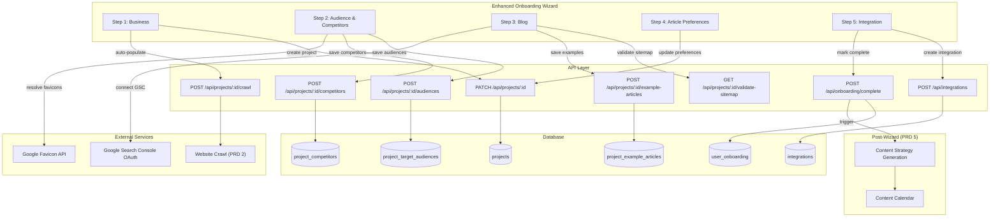
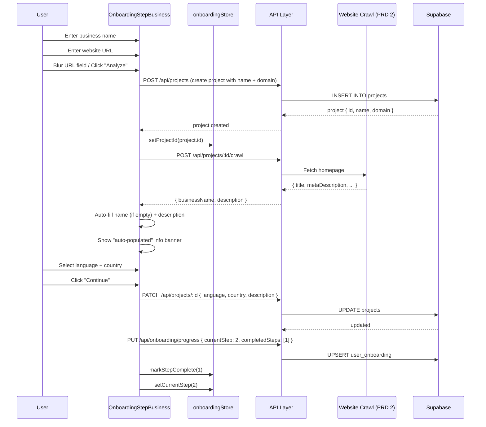
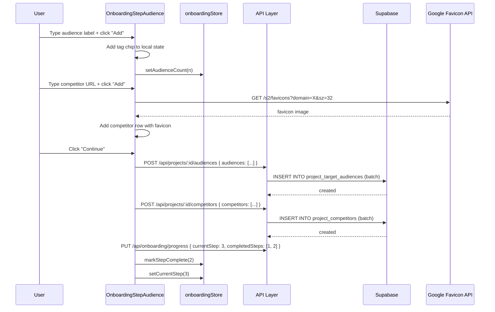
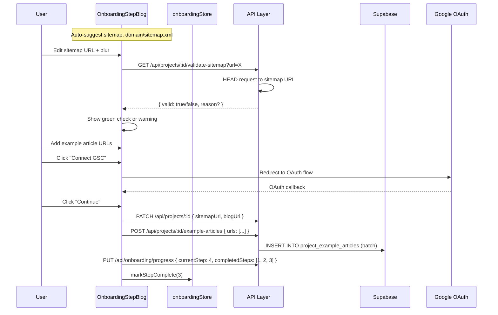
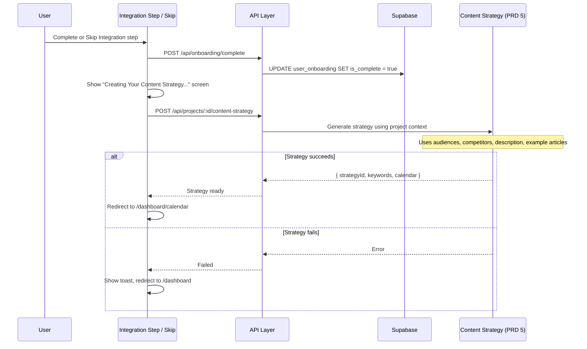

# PRD: Enhanced Onboarding Wizard (Outrank-Style Intelligence-Driven Setup)

**Status:** Draft
**Complexity Score:** 9 → HIGH
**Created:** 2026-02-24
**Author:** Claude (Principal Architect)
**Series:** Outrank Feature Parity (4 of 6)
**Depends On:** PRD 1 (Schema Extensions), PRD 2 (Website Intelligence / Crawl API), PRD 3 (DataForSEO -- optional, enhances competitor analysis in Step 2)
**Blocks:** PRD 5 (Content Strategy Generation)

---

## Complexity Assessment

| Factor | Score | Rationale |
|--------|-------|-----------|
| UI Components | 4/5 | 5 new step components, tag input, color picker, image style selector, favicon resolver, auto-populate UX |
| Backend Changes | 3/5 | New API endpoints (crawl proxy, sitemap validation), new DB tables (audiences, competitors, example articles, article preferences), updated onboarding service |
| State Management | 3/5 | Zustand store redesign, new fields, removed fields, backward compatibility with existing completed users |
| Data Migration | 2/5 | Enum semantics change (same numeric values, different meanings), existing users auto-skipped |
| Integration Points | 3/5 | Website crawl API (PRD 2), GSC OAuth (existing), favicon resolution, sitemap validation |
| Testing | 3/5 | 5 step components + store + service + API endpoints + backward compat |
| **Total** | **9/15** | **HIGH** -- 15+ files modified/created, 3 new DB tables, full wizard redesign |

---

## Integration Points Checklist

| System | Integration Type | Status | Notes |
|--------|-----------------|--------|-------|
| Website Intelligence (PRD 2) | API call from Step 1 | Depends on PRD 2 | `POST /api/projects/:id/crawl` auto-populates business name + description |
| GSC OAuth | Reuse existing flow | Existing | Moved from Step 2 to Step 3 (Blog step) |
| Favicon Resolution | External URL | New | `https://www.google.com/s2/favicons?domain=X&sz=32` for competitor display |
| Sitemap Validation | Server-side fetch | New | `GET /api/projects/:id/validate-sitemap` HEAD request to check sitemap URL |
| DataForSEO (PRD 3) | Optional enrichment | Depends on PRD 3 | Could auto-suggest competitors, enhance audience data -- not required |
| Content Strategy (PRD 5) | Post-wizard trigger | Blocks PRD 5 | Wizard completion triggers content strategy generation instead of going to dashboard |
| Supabase | 3 new tables, 1 altered | New migration | `project_target_audiences`, `project_competitors`, `project_example_articles` |
| Onboarding Store | Redesigned shape | Modified | Remove `campaignId`/`keywordCount`, add audience/competitor/blog tracking |
| Onboarding Types | Enum value reinterpretation | Modified | Same numbers 1-5, new semantic meaning |

---

## 1. Context

### 1.1 Problem Statement

The current onboarding wizard collects minimal information (project name, optional domain, keywords) and immediately pushes users into campaign creation. This results in:

1. **Low-quality campaigns** -- users pick random keywords without guidance, leading to unfocused content.
2. **Missing business context** -- the system knows nothing about the user's audience, competitors, or content style preferences, so every article is generated from a blank slate.
3. **No intelligence gathering** -- the domain URL is collected but never used to auto-populate fields or derive insights.
4. **Premature keyword selection** -- users must manually enter keywords before they understand the system, when keywords should come from an intelligent content strategy (PRD 5).

Outrank.so's onboarding solves all of these by collecting rich business context first, then using that context to auto-generate a content strategy with keywords, topics, and a publishing calendar.

### 1.2 Current Implementation

**Files involved:**

| File | Purpose |
|------|---------|
| `client/components/onboarding/OnboardingWizard.tsx` | Modal wizard container, step routing, navigation |
| `client/components/onboarding/OnboardingStepperProgress.tsx` | 5-step progress indicator with skip styling |
| `client/components/onboarding/steps/OnboardingStepProject.tsx` | Step 1: name, domain (optional), industry dropdown |
| `client/components/onboarding/steps/OnboardingStepGSC.tsx` | Step 2: GSC OAuth connection (optional) |
| `client/components/onboarding/steps/OnboardingStepKeywords.tsx` | Step 3: keyword textarea, campaign creation |
| `client/components/onboarding/steps/OnboardingStepIntegrations.tsx` | Step 4: CMS integration (optional) |
| `client/components/onboarding/steps/OnboardingStepComplete.tsx` | Step 5: summary, "Go to Dashboard" |
| `client/components/onboarding/OnboardingSetupBanner.tsx` | Banner shown when onboarding incomplete |
| `client/store/onboardingStore.ts` | Zustand store with step tracking + contextual data |
| `client/hooks/useOnboardingStatus.ts` | React Query hook for fetching status |
| `client/hooks/useOnboardingProgress.ts` | React Query mutation hook for updating progress |
| `shared/types/onboarding.types.ts` | `OnboardingStep` enum, interfaces, error classes |
| `shared/validation/onboarding.schema.ts` | Zod schemas for step validation |
| `server/services/onboarding.service.ts` | Server-side CRUD for `user_onboarding` table |
| `src/pages/api/onboarding/status.ts` | `GET /api/onboarding/status` |
| `src/pages/api/onboarding/progress.ts` | `PUT /api/onboarding/progress` |
| `src/pages/api/onboarding/complete.ts` | `POST /api/onboarding/complete` |
| `supabase/migrations/20260213000000_create_user_onboarding.sql` | `user_onboarding` table schema |

**Current step enum:**

```typescript
enum OnboardingStep {
  PROJECT_CREATION = 1,  // name, domain, industry
  GSC_CONNECTION = 2,     // OAuth (optional)
  KEYWORDS_UPLOAD = 3,    // textarea, creates campaign
  INTEGRATIONS = 4,       // CMS connection (optional)
  COMPLETION = 5,         // summary screen
}
```

**Current store shape:**

```typescript
interface IOnboardingState {
  currentStep: number;          // 1-5
  completedSteps: Set<number>;
  skippedSteps: Set<number>;
  projectId: string | null;
  campaignId: string | null;    // REMOVED in new design
  keywordCount: number;          // REMOVED in new design
  hasGscConnection: boolean;
  hasIntegration: boolean;
  isDismissed: boolean;
}
```

**Current `projects` table schema:**

```sql
CREATE TABLE public.projects (
  id UUID PRIMARY KEY DEFAULT gen_random_uuid(),
  user_id UUID NOT NULL REFERENCES public.profiles(id) ON DELETE CASCADE,
  name TEXT NOT NULL,
  domain TEXT,
  industry TEXT,
  cms_type TEXT NOT NULL DEFAULT 'wordpress',
  cms_credentials JSONB DEFAULT '{}',
  content_preferences JSONB DEFAULT '{}',
  status TEXT NOT NULL DEFAULT 'active',
  created_at TIMESTAMPTZ NOT NULL DEFAULT NOW(),
  updated_at TIMESTAMPTZ NOT NULL DEFAULT NOW()
);
```

### 1.3 Key Design Decisions

1. **Step numbers stay 1-5** -- The `user_onboarding` table stores `current_step INTEGER CHECK (current_step BETWEEN 1 AND 5)`. By keeping the same numeric range, we avoid a database migration on the onboarding table itself. Only the _semantic meaning_ of each step number changes.

2. **Keywords removed from onboarding** -- Keywords now come from the Content Strategy (PRD 5), generated post-wizard. The keyword step is replaced by the Article Preferences step.

3. **Campaign creation moved to post-wizard** -- Currently Step 3 creates a campaign with keywords. In the new flow, campaigns are created as part of the content strategy generation after the wizard completes. This means `campaignId` and `keywordCount` are removed from the onboarding store.

4. **Backward compatibility** -- Existing users who have `is_complete = true` in `user_onboarding` are never shown the wizard again. Existing users who are mid-onboarding (rare edge case) will have their onboarding auto-completed on next login since their data no longer maps to the new steps.

5. **New columns on `projects` table** -- `language`, `country`, and `description` are added to `projects`. These support the enriched Step 1 (Business) data.

6. **Three new tables** -- `project_target_audiences`, `project_competitors`, and `project_example_articles` store the intelligence data collected in Steps 2-3.

7. **Article preferences stored on project** -- Step 4 settings (auto-publish, article style, internal links, brand color, image style, toggles) are stored in the project's `content_preferences` JSONB field, which already exists and is currently underused.

---

## 2. Solution

### 2.1 New Step Definitions

```typescript
enum OnboardingStep {
  BUSINESS = 1,              // Was: PROJECT_CREATION
  AUDIENCE_COMPETITORS = 2,  // Was: GSC_CONNECTION
  BLOG = 3,                  // Was: KEYWORDS_UPLOAD
  ARTICLE_PREFERENCES = 4,   // Was: INTEGRATIONS
  INTEGRATION = 5,           // Was: COMPLETION
}
```

**Step requirement matrix:**

| Step | Name | Required? | Can Skip? | Creates Data In |
|------|------|-----------|-----------|-----------------|
| 1 | Business | Yes | No | `projects` (create + update) |
| 2 | Audience & Competitors | Audience required (min 1), Competitors optional | No (audience required) | `project_target_audiences`, `project_competitors` |
| 3 | Blog | No | Yes | `project_example_articles`, GSC connection |
| 4 | Article Preferences | Yes (has defaults) | No (auto-completes with defaults) | `projects.content_preferences` |
| 5 | Integration | No | Yes | `integrations` table (existing) |

### 2.2 Architecture Diagram



### 2.3 Updated Zustand Store Shape

```typescript
interface IOnboardingState {
  // Step tracking (unchanged)
  currentStep: number;
  completedSteps: Set<number>;
  skippedSteps: Set<number>;

  // Contextual data (modified)
  projectId: string | null;
  // REMOVED: campaignId (campaigns created post-wizard in PRD 5)
  // REMOVED: keywordCount (keywords come from content strategy in PRD 5)

  // NEW: Step 2 tracking
  audienceCount: number;
  competitorCount: number;

  // NEW: Step 3 tracking
  hasSitemap: boolean;
  hasExampleArticles: boolean;

  // Carried over
  hasGscConnection: boolean;
  hasIntegration: boolean;
  isDismissed: boolean;

  // NEW: Post-wizard content strategy tracking
  contentStrategyId: string | null;
  contentStrategyStatus: 'idle' | 'generating' | 'ready' | 'failed';

  // Actions (same signatures, updated internals)
  setCurrentStep: (step: number) => void;
  markStepComplete: (step: number) => void;
  markStepSkipped: (step: number) => void;
  unmarkStepSkipped: (step: number) => void;
  setProjectId: (id: string | null) => void;
  setAudienceCount: (count: number) => void;
  setCompetitorCount: (count: number) => void;
  setHasSitemap: (value: boolean) => void;
  setHasExampleArticles: (value: boolean) => void;
  setHasGscConnection: (value: boolean) => void;
  setHasIntegration: (value: boolean) => void;
  setContentStrategyId: (id: string | null) => void;
  setContentStrategyStatus: (status: 'idle' | 'generating' | 'ready' | 'failed') => void;
  syncDismissed: (userId: string) => void;
  dismiss: () => void;
  initializeFromServer: (data: { ... }) => void;
  reset: () => void;

  // Updated computed getters
  canProceedToNext: () => boolean;
  canSkipStep: (step: number) => boolean;
  isStepOptional: (step: number) => boolean;
  getProgressPercentage: () => number;
}
```

**Updated `canProceedToNext` logic:**

```typescript
canProceedToNext: () => {
  const state = get();
  switch (state.currentStep) {
    case 1: // BUSINESS
      return state.projectId !== null;
    case 2: // AUDIENCE_COMPETITORS
      return state.audienceCount >= 1;
    case 3: // BLOG (optional)
      return true;
    case 4: // ARTICLE_PREFERENCES (has defaults)
      return true;
    case 5: // INTEGRATION (optional, last step)
      return true;
    default:
      return false;
  }
}
```

**Updated optional/required steps:**

```typescript
const OPTIONAL_STEPS = new Set([3]); // Only Blog step is skippable
const REQUIRED_STEPS = new Set([1, 2, 4]); // Business, Audience, Preferences
// Step 5 (Integration) is optional but is the final step, so skip = complete
```

### 2.4 Database Changes

#### 2.4.1 Alter `projects` Table

```sql
ALTER TABLE public.projects
  ADD COLUMN language TEXT NOT NULL DEFAULT 'en',
  ADD COLUMN country TEXT NOT NULL DEFAULT 'US',
  ADD COLUMN description TEXT;
```

#### 2.4.2 New Table: `project_target_audiences`

```sql
CREATE TABLE public.project_target_audiences (
  id UUID PRIMARY KEY DEFAULT gen_random_uuid(),
  project_id UUID NOT NULL REFERENCES public.projects(id) ON DELETE CASCADE,
  label TEXT NOT NULL,
  sort_order INTEGER NOT NULL DEFAULT 0,
  created_at TIMESTAMPTZ NOT NULL DEFAULT NOW()
);

CREATE INDEX idx_project_audiences_project ON public.project_target_audiences(project_id);
```

#### 2.4.3 New Table: `project_competitors`

```sql
CREATE TABLE public.project_competitors (
  id UUID PRIMARY KEY DEFAULT gen_random_uuid(),
  project_id UUID NOT NULL REFERENCES public.projects(id) ON DELETE CASCADE,
  domain TEXT NOT NULL,
  name TEXT,
  favicon_url TEXT,
  sort_order INTEGER NOT NULL DEFAULT 0,
  created_at TIMESTAMPTZ NOT NULL DEFAULT NOW()
);

CREATE INDEX idx_project_competitors_project ON public.project_competitors(project_id);
```

#### 2.4.4 New Table: `project_example_articles`

```sql
CREATE TABLE public.project_example_articles (
  id UUID PRIMARY KEY DEFAULT gen_random_uuid(),
  project_id UUID NOT NULL REFERENCES public.projects(id) ON DELETE CASCADE,
  url TEXT NOT NULL,
  title TEXT,
  sort_order INTEGER NOT NULL DEFAULT 0,
  created_at TIMESTAMPTZ NOT NULL DEFAULT NOW()
);

CREATE INDEX idx_project_examples_project ON public.project_example_articles(project_id);
```

#### 2.4.5 Extended `content_preferences` JSONB Shape

The `projects.content_preferences` JSONB field is extended to store article preferences from Step 4:

```typescript
interface IContentPreferences {
  // Existing
  frequency?: 'daily' | '3x_week' | 'weekly';

  // NEW: Step 4 Article Preferences
  autoPublish?: boolean;
  articleStyle?: 'informative' | 'how-to' | 'listicle' | 'opinion' | 'tutorial' | 'review' | 'comparison';
  articleStyleAutoDetected?: boolean;
  internalLinksCount?: 0 | 1 | 2 | 3 | 5;
  globalInstructions?: string;
  brandColor?: string;              // hex, e.g. "#4F46E5"
  imageStyle?: 'brand-text' | 'watercolor' | 'cinematic' | 'illustration' | 'sketch';
  enableYouTube?: boolean;
  enableCTA?: boolean;
  enableInfographics?: boolean;
  enableEmojis?: boolean;
}
```

### 2.5 New API Endpoints

| Method | Path | Purpose | Phase |
|--------|------|---------|-------|
| `POST` | `/api/projects/:id/crawl` | Crawl website, return title + meta description | Phase 1 (depends on PRD 2) |
| `POST` | `/api/projects/:id/audiences` | CRUD for target audiences | Phase 2 |
| `DELETE` | `/api/projects/:id/audiences/:audienceId` | Delete single audience | Phase 2 |
| `POST` | `/api/projects/:id/competitors` | CRUD for competitors | Phase 2 |
| `DELETE` | `/api/projects/:id/competitors/:competitorId` | Delete single competitor | Phase 2 |
| `GET` | `/api/projects/:id/validate-sitemap` | HEAD request to validate sitemap URL | Phase 3 |
| `POST` | `/api/projects/:id/example-articles` | CRUD for example article URLs | Phase 3 |
| `DELETE` | `/api/projects/:id/example-articles/:articleId` | Delete single example article | Phase 3 |

**Note:** `PATCH /api/projects/:id` (existing) is used for updating project fields including `language`, `country`, `description`, and `content_preferences`.

### 2.6 Step-by-Step UI Design

#### Step 1: Business (REQUIRED)

**Title:** "Tell Us About Your Business"
**Subtitle:** "We'll use this to personalize your content strategy."

**Fields:**
| Field | Type | Required | Maps To | Notes |
|-------|------|----------|---------|-------|
| Business Name | text input | Yes | `projects.name` | Max 100 chars, auto-populated from crawl |
| Website URL | text input | Yes | `projects.domain` | Triggers auto-populate on blur/button |
| Language | dropdown | Yes (default: en) | `projects.language` | ISO 639-1 codes |
| Country | dropdown | Yes (default: US) | `projects.country` | ISO 3166-1 alpha-2 |
| Description | textarea | No (auto-populated) | `projects.description` | Max 500 chars |

**Auto-populate behavior:**
1. User enters a website URL
2. On URL field blur (or "Analyze" button click), POST to `/api/projects/:id/crawl`
3. If successful, populate Business Name from `<title>` and Description from `<meta name="description">`
4. Show info banner: "Based on your website, we've pre-filled the following fields"
5. User can edit any auto-populated field
6. If crawl fails (CORS, timeout, etc.), show subtle error and let user fill manually

**Accessibility:**
- All fields have associated `<label>` elements
- Error messages use `aria-describedby`
- Auto-populate loading state announced via `aria-live="polite"` region
- Focus management: auto-focus on Business Name input on step mount

#### Step 2: Audience & Competitors (AUDIENCE REQUIRED)

**Title:** "Who Are You Writing For?"
**Subtitle:** "Define your target audiences and track competitors."

**Audience Section:**
- Tag-style input: text field + "Add" button
- Each audience shown as a dismissible chip/tag
- Count badge: "3/7" format
- Min 1, max 7 audiences
- Validation: non-empty, max 100 chars per label

**Competitor Section:**
- URL input + "Add" button
- Each competitor displayed as a row with: favicon (32x32) + domain text + remove button
- Favicon resolved via `https://www.google.com/s2/favicons?domain={domain}&sz=32`
- Count badge: "2/7" format
- Max 7 competitors, optional (0 is fine)
- Input normalizes URLs: strips protocol, extracts domain

**Accessibility:**
- Tag input uses `role="group"` with `aria-label="Target audiences"`
- Each tag has `role="listitem"` inside a `role="list"` container
- Remove buttons have `aria-label="Remove {audience name}"`
- Competitor favicon images have `alt="{domain} favicon"`
- Count badges use `aria-label="{n} of 7 audiences added"`

#### Step 3: Blog (OPTIONAL)

**Title:** "Connect Your Blog"
**Subtitle:** "Help us understand your content style and existing blog structure."

**Fields:**
| Field | Type | Notes |
|-------|------|-------|
| Sitemap URL | text input | Auto-suggested: `{domain}/sitemap.xml`. Validated on blur (server-side HEAD request). Green check or error icon. |
| Main Blog Address | text input | Auto-suggested: `{domain}/blog` |
| Example Article URLs | dynamic URL inputs (up to 5) | "Add another" button. Each is a text input + remove button. |
| GSC Connection | status + connect/disconnect buttons | Reuses existing GSC OAuth flow from `OnboardingStepGSC.tsx` |

**Skip behavior:**
- Entire step can be skipped with "Skip for now" button
- No confirmation dialog needed (low-stakes data)

**Sitemap validation:**
1. On blur, call `GET /api/projects/:id/validate-sitemap?url={encodedUrl}`
2. Server does a HEAD request to the URL
3. Returns `{ valid: true }` or `{ valid: false, reason: 'not_found' | 'timeout' | 'invalid_xml' }`
4. Show green checkmark for valid, orange warning with reason for invalid

**Accessibility:**
- Dynamic "Add another" button: newly added input auto-focuses
- Sitemap validation result announced via `aria-live="polite"`
- GSC connection status uses `role="status"`

#### Step 4: Article Preferences (REQUIRED, has defaults)

**Title:** "How Should Your Articles Look?"
**Subtitle:** "Set defaults for all generated content. You can customize per-campaign later."

**Fields:**
| Field | Type | Default | Notes |
|-------|------|---------|-------|
| Auto-publish | toggle | Off | "Automatically publish articles when generated" |
| Article Style | dropdown | Informative | Options: Informative, How-To, Listicle, Opinion, Tutorial, Review, Comparison. If example articles were provided in Step 3 and analyzed, show green badge: "Style auto-derived from your example articles" |
| Internal Links | dropdown | 2 | Options: 0, 1, 2, 3, 5 |
| Global Instructions | textarea | Empty | "Additional instructions for the AI writer (e.g., 'Always mention our product name', 'Use British English')" Max 1000 chars |

**Engagement Section (sub-header):**
| Field | Type | Default | Notes |
|-------|------|---------|-------|
| Brand Color | color picker | #4F46E5 (accent) | Hex input + visual picker. Used in article images. |
| Image Style | visual radio selector | Cinematic | 5 options shown as labeled thumbnails: Brand & Text, Watercolor, Cinematic, Illustration, Sketch |
| YouTube Video | toggle | Off | "Include relevant YouTube embeds" |
| Call-to-Action | toggle | Off | "Add a CTA section at the end of articles" |
| Infographics | toggle | Off | "Generate visual infographics where relevant" |
| Emojis | toggle | Off | "Use emojis in headings and content" |

**Key behavior:**
- All fields have sensible defaults, so user can click "Continue" immediately
- The step is "required" in that it cannot be skipped, but since defaults are pre-filled, clicking Continue without changes is valid
- Article style auto-detection: if the user provided example article URLs in Step 3, the crawl analysis (from PRD 2) determines the predominant style and pre-selects it

**Accessibility:**
- Toggle switches use `role="switch"` with `aria-checked`
- Image style selector uses `role="radiogroup"` with `role="radio"` children
- Color picker has both visual input and manual hex text input for screen reader users
- Global instructions textarea has character counter with `aria-live="polite"`

#### Step 5: Integration (OPTIONAL)

**Title:** "Connect Your CMS"
**Subtitle:** "Auto-publish articles directly to your website."

**Implementation:** Reuse the existing `OnboardingStepIntegrations.tsx` component with minimal modifications:
- Remove the campaign assignment logic (no `campaignId` in store anymore; integrations are project-level)
- Keep all CMS options: WordPress, Wix, Ghost, Webhook
- Skip button goes to completion flow (not to a Completion step -- wizard finishes here)

### 2.7 Post-Wizard Flow

When the user completes Step 5 (or skips it), instead of showing a static "Completion" screen:

1. Call `POST /api/onboarding/complete` to mark onboarding as done
2. Show a full-screen loading state: "Creating Your Content Strategy..." with an animated progress indicator
3. Trigger content strategy generation (PRD 5's `POST /api/projects/:id/content-strategy`)
4. When strategy is ready, redirect to `/dashboard/calendar` (or `/dashboard/overview` if calendar not yet built)
5. If strategy generation fails, redirect to dashboard with a toast: "We'll generate your content strategy shortly"

**Note:** The actual content strategy generation logic is defined in PRD 5. This PRD only defines the trigger point and the loading/transition UX.

### 2.8 Backward Compatibility

**Existing users with `is_complete = true`:**
- No change. They are never shown the wizard. The `is_complete` flag is checked before rendering.

**Existing users mid-onboarding (`is_complete = false`, `current_step > 1`):**
- Edge case: very few users should be mid-onboarding at any given time.
- Strategy: On first load after deploy, if `is_complete = false` AND the user already has a project (`projects` table has rows for this user), auto-complete their onboarding via `OnboardingService.markComplete()`. This already exists in `getStatus()` (lines 103-117 of `onboarding.service.ts`).
- If they have NO project, they start fresh at Step 1 (BUSINESS) with the new wizard.

**Onboarding store backward compatibility:**
- The store's `campaignId` and `keywordCount` fields are removed. Since the store is in-memory (Zustand, not persisted to DB), this requires no migration. The `initializeFromServer` method only reads `currentStep`, `completedSteps`, `skippedSteps` from the API, which are the same shape.

---

## 3. Sequence Flows

### 3.1 Step 1: Business -- Auto-Populate Flow



### 3.2 Step 2: Audience & Competitors



### 3.3 Step 3: Blog (Optional)



### 3.4 Post-Wizard: Content Strategy Trigger



---

## 4. Execution Phases

### Phase 1: Foundation -- Database + Types + Store Refactor

**Goal:** Lay the groundwork. Update types, create new tables, refactor store. No UI changes yet.

**Max files: 5**

| # | File | Action | Description |
|---|------|--------|-------------|
| 1 | `shared/types/onboarding.types.ts` | Modify | Rename enum values (keep numbers 1-5). Update `IOnboardingStepData` titles/descriptions. Add new interfaces for step data. |
| 2 | `shared/validation/onboarding.schema.ts` | Modify | Update `VALID_ONBOARDING_STEPS` array reference to new enum names. No numeric changes needed. |
| 3 | `client/store/onboardingStore.ts` | Modify | Remove `campaignId`, `keywordCount`, `setCampaignId`, `setKeywordCount`. Add `audienceCount`, `competitorCount`, `hasSitemap`, `hasExampleArticles`, `contentStrategyId`, `contentStrategyStatus` + setters. Update `OPTIONAL_STEPS`, `REQUIRED_STEPS`, `canProceedToNext`. |
| 4 | `shared/types/project.types.ts` | Modify | Add `language`, `country`, `description` to `IProject` and `ICreateProjectInput`. Extend `IContentPreferences` with article preference fields. |
| 5 | `supabase/migrations/YYYYMMDDHHMMSS_enhanced_onboarding_schema.sql` | Create | ALTER projects (add columns). CREATE 3 new tables with RLS. |

**Tests:**
- Unit tests for updated store (`canProceedToNext` logic with new step semantics)
- Unit tests for updated validation schemas
- Migration test (local `supabase db push`)

**Verify:** `yarn test -- --grep onboarding` + `yarn verify`

---

### Phase 2: Step 1 -- Business Step Component

**Goal:** Replace `OnboardingStepProject.tsx` with the new Business step. Includes auto-populate from website crawl.

**Max files: 5**

| # | File | Action | Description |
|---|------|--------|-------------|
| 1 | `client/components/onboarding/steps/OnboardingStepBusiness.tsx` | Create | New Step 1 component: business name, website URL, language dropdown, country dropdown, description textarea. Auto-populate on URL blur via crawl API. React Hook Form + Zod validation. |
| 2 | `client/components/onboarding/OnboardingWizard.tsx` | Modify | Update `renderStep()` switch to use new step component names. Update step icons, titles, subtitles. Import new components. |
| 3 | `client/components/onboarding/OnboardingStepperProgress.tsx` | Modify | Update `ONBOARDING_STEPS` array labels: 'Business', 'Audience', 'Blog', 'Preferences', 'Integration'. Update optional step set. |
| 4 | `shared/validation/onboarding.schema.ts` | Modify | Add `businessStepSchema` Zod schema for Step 1 form validation (name required, domain required, language, country, description). |
| 5 | `server/services/onboarding.service.ts` | Modify | Update `REQUIRED_STEPS` to `[1, 2, 4]`, update `getRecommendedNextStep`. Ensure `markComplete` uses correct completed steps array for new flow. |

**Tests:**
- Component test for `OnboardingStepBusiness`: renders fields, validates required fields, shows auto-populate banner on crawl success, handles crawl failure gracefully
- Integration test: Step 1 -> Step 2 transition

**Verify:** `yarn verify`

**Note:** If PRD 2 (Website Intelligence) is not yet implemented, the crawl button shows a disabled state or a "Coming soon" tooltip. The step still works fully without auto-populate.

---

### Phase 3: Step 2 -- Audience & Competitors Component + API

**Goal:** Build the tag input for audiences, competitor input with favicon resolution, and supporting API endpoints.

**Max files: 5**

| # | File | Action | Description |
|---|------|--------|-------------|
| 1 | `client/components/onboarding/steps/OnboardingStepAudience.tsx` | Create | Tag input for audiences (chip add/remove, count badge, min 1 / max 7). URL input for competitors (favicon fetch, domain extraction, add/remove). |
| 2 | `src/pages/api/projects/[projectId]/audiences.ts` | Create | `POST` -- batch upsert audiences for project. `GET` -- list audiences. Validates ownership. |
| 3 | `src/pages/api/projects/[projectId]/competitors.ts` | Create | `POST` -- batch upsert competitors. `GET` -- list competitors. Resolves favicon URLs server-side. |
| 4 | `shared/validation/project-context.schema.ts` | Create | Zod schemas for audience labels (non-empty, max 100 chars, max 7 items) and competitor entries (valid domain, max 7 items). |
| 5 | `server/services/project-context.service.ts` | Create | Service class for CRUD operations on `project_target_audiences` and `project_competitors`. Batch insert/replace pattern (delete existing + insert new for simplicity). |

**Tests:**
- Component test for tag input: add, remove, max 7, count badge, keyboard accessibility
- Component test for competitor input: URL normalization, favicon loading, domain extraction
- API tests for audiences and competitors endpoints

**Verify:** `yarn verify`

---

### Phase 4: Step 3 -- Blog Step Component + Sitemap Validation

**Goal:** Build the Blog step with sitemap validation, example article URLs, and GSC connection (reused from existing component).

**Max files: 5**

| # | File | Action | Description |
|---|------|--------|-------------|
| 1 | `client/components/onboarding/steps/OnboardingStepBlog.tsx` | Create | Sitemap URL with auto-suggestion and validation indicator. Blog address field. Dynamic example article URL inputs (up to 5). GSC connection section (extracted from `OnboardingStepGSC.tsx`). |
| 2 | `src/pages/api/projects/[projectId]/validate-sitemap.ts` | Create | `GET ?url=X` -- server-side HEAD request to validate sitemap URL exists. Returns `{ valid, reason? }`. |
| 3 | `src/pages/api/projects/[projectId]/example-articles.ts` | Create | `POST` -- batch upsert example article URLs. `GET` -- list example articles. |
| 4 | `client/components/onboarding/steps/GscConnectionSection.tsx` | Create | Extract GSC connection UI from `OnboardingStepGSC.tsx` into a reusable section component. Shows connection status, connect button, disconnect button. Not a full step -- used inside `OnboardingStepBlog`. |
| 5 | `server/services/project-context.service.ts` | Modify | Add `upsertExampleArticles()` and `validateSitemap()` methods. |

**Tests:**
- Component test for Blog step: auto-suggest sitemap, add/remove example URLs, GSC connection display
- API test for sitemap validation (mock HEAD request)
- API test for example articles CRUD

**Verify:** `yarn verify`

---

### Phase 5: Step 4 -- Article Preferences Component + UI Controls

**Goal:** Build the Article Preferences step with the visual image style picker, color picker, toggles, and dropdowns.

**Max files: 5**

| # | File | Action | Description |
|---|------|--------|-------------|
| 1 | `client/components/onboarding/steps/OnboardingStepPreferences.tsx` | Create | Auto-publish toggle, article style dropdown (with auto-derived badge), internal links dropdown, global instructions textarea. Engagement section: brand color picker, image style visual selector, YouTube/CTA/infographics/emojis toggles. All defaults pre-filled. |
| 2 | `client/components/ui/ColorPicker.tsx` | Create | Reusable color picker component: visual color swatch + hex text input. Uses native `<input type="color">` with styled wrapper. Accessible label. |
| 3 | `client/components/ui/ImageStyleSelector.tsx` | Create | Visual radio group with 5 image style options. Each option: labeled thumbnail/icon + name. Uses `role="radiogroup"` for accessibility. |
| 4 | `shared/validation/project-context.schema.ts` | Modify | Add `articlePreferencesSchema` Zod schema for Step 4 fields. |
| 5 | `client/components/onboarding/steps/OnboardingStepProject.tsx` | Delete/Archive | No longer used. Remove import from wizard and index. (Or repurpose file as `OnboardingStepBusiness.tsx` alias if preferred.) |

**Tests:**
- Component test for Preferences step: all fields render with defaults, toggles work, color picker updates, image style selection
- Component test for ColorPicker: hex input, visual picker, invalid input handling
- Component test for ImageStyleSelector: keyboard navigation, selection callback

**Verify:** `yarn verify`

---

### Phase 6: Step 5 -- Integration Refactor + Post-Wizard Flow

**Goal:** Refactor the Integration step (remove campaign assignment) and build the post-wizard content strategy trigger screen.

**Max files: 5**

| # | File | Action | Description |
|---|------|--------|-------------|
| 1 | `client/components/onboarding/steps/OnboardingStepIntegrations.tsx` | Modify | Remove `campaignId` logic and `autoPublish` campaign assignment. Integration is now project-level only. Skip button triggers post-wizard flow instead of going to Completion step. |
| 2 | `client/components/onboarding/steps/OnboardingStepComplete.tsx` | Modify | Replace static summary screen with "Creating Your Content Strategy..." loading state. Animated progress indicator. Call `POST /api/projects/:id/content-strategy` (PRD 5). Redirect to dashboard/calendar on success. Toast + redirect on failure. |
| 3 | `client/components/onboarding/OnboardingWizard.tsx` | Modify | Handle post-wizard transition: when Step 5 completes or is skipped, show completion/strategy screen. Remove old Completion step from switch. Update back button logic. |
| 4 | `client/hooks/useOnboardingProgress.ts` | Modify | Remove references to removed store fields (`campaignId`, `keywordCount`). Update `normalizeProgressInput` for new optional steps (step 3 = Blog). |
| 5 | `client/components/onboarding/steps/OnboardingStepKeywords.tsx` | Delete | No longer used. Keywords come from content strategy (PRD 5). |

**Tests:**
- Component test for updated Integration step: no campaign assignment, skip triggers completion
- Component test for post-wizard loading screen: shows progress, handles strategy success/failure
- Integration test: full wizard flow Step 1 -> 5 -> post-wizard

**Verify:** `yarn verify`

---

### Phase 7: Cleanup + API Route Updates + Final Integration

**Goal:** Clean up old files, update API routes, update the onboarding banner, and run full test suite.

**Max files: 5**

| # | File | Action | Description |
|---|------|--------|-------------|
| 1 | `client/components/onboarding/index.ts` | Modify | Update exports: remove `OnboardingStepProject`, `OnboardingStepGSC`. Add new step components. |
| 2 | `client/components/onboarding/OnboardingSetupBanner.tsx` | Modify | Update banner text to reflect new onboarding steps (e.g., "Tell us about your business to get started"). |
| 3 | `client/components/onboarding/steps/OnboardingStepGSC.tsx` | Delete | GSC connection is now part of Step 3 (Blog) via `GscConnectionSection.tsx`. |
| 4 | `src/pages/api/onboarding/complete.ts` | Modify | After marking complete, optionally trigger content strategy generation in the background (if PRD 5 is implemented). Add strategy trigger hook point. |
| 5 | `client/hooks/useOnboardingStatus.ts` | Modify | No functional changes needed, but update logging messages to reference new step names for debugging clarity. |

**Tests:**
- End-to-end test: full onboarding wizard flow (new user -> Step 1 -> Step 5 -> dashboard)
- Backward compatibility test: existing user with `is_complete = true` never sees wizard
- Backward compatibility test: existing user mid-onboarding with project auto-completes

**Verify:** `yarn verify`

---

## 5. Acceptance Criteria

### 5.1 Step 1: Business

- [ ] **AC-1.1:** User can enter business name (required), website URL (required), language, country, and description
- [ ] **AC-1.2:** On website URL blur or "Analyze" click, the system auto-populates business name and description from website crawl
- [ ] **AC-1.3:** Auto-populate shows a loading spinner during crawl and an info banner when fields are populated
- [ ] **AC-1.4:** If crawl fails, user can still proceed by filling fields manually (graceful degradation)
- [ ] **AC-1.5:** Language defaults to 'en' and country defaults to 'US'
- [ ] **AC-1.6:** Project is created in the database on form submission with all fields
- [ ] **AC-1.7:** Cannot proceed without business name and website URL

### 5.2 Step 2: Audience & Competitors

- [ ] **AC-2.1:** User can add target audiences as tag chips (max 7)
- [ ] **AC-2.2:** Each audience tag shows a remove button (X) and the count badge updates in real-time
- [ ] **AC-2.3:** Minimum 1 audience is required to proceed
- [ ] **AC-2.4:** User can add competitor URLs (max 7) with favicon resolution
- [ ] **AC-2.5:** Competitors are optional -- step can proceed with 0 competitors
- [ ] **AC-2.6:** Competitor input normalizes URLs and extracts domains
- [ ] **AC-2.7:** If favicon fails to load, a generic placeholder icon is shown
- [ ] **AC-2.8:** Audiences and competitors are saved to the database on "Continue"

### 5.3 Step 3: Blog

- [ ] **AC-3.1:** Sitemap URL is auto-suggested based on the project domain
- [ ] **AC-3.2:** Sitemap URL is validated server-side on blur with visual status indicator (green check / warning)
- [ ] **AC-3.3:** User can add up to 5 example article URLs with dynamic "Add another" button
- [ ] **AC-3.4:** GSC connection section shows current connection status and allows connect/disconnect
- [ ] **AC-3.5:** Entire step can be skipped with "Skip for now" button
- [ ] **AC-3.6:** Example articles are saved to the database on "Continue"

### 5.4 Step 4: Article Preferences

- [ ] **AC-4.1:** All fields have sensible defaults and the user can proceed without changing anything
- [ ] **AC-4.2:** Article style dropdown includes: Informative, How-To, Listicle, Opinion, Tutorial, Review, Comparison
- [ ] **AC-4.3:** If example articles were provided and analyzed, article style shows "auto-derived" green badge
- [ ] **AC-4.4:** Brand color picker shows both visual color input and hex text input
- [ ] **AC-4.5:** Image style selector shows 5 visual options with labels
- [ ] **AC-4.6:** All toggles (auto-publish, YouTube, CTA, infographics, emojis) default to off
- [ ] **AC-4.7:** Internal links dropdown offers 0, 1, 2, 3, 5 options with default of 2
- [ ] **AC-4.8:** Preferences are saved to `projects.content_preferences` JSONB on "Continue"

### 5.5 Step 5: Integration

- [ ] **AC-5.1:** Existing CMS options (WordPress, Wix, Ghost, Webhook) are available
- [ ] **AC-5.2:** Integration creation does NOT attempt to assign to a campaign (no `campaignId`)
- [ ] **AC-5.3:** Step can be skipped with "Skip for now" button
- [ ] **AC-5.4:** On complete or skip, onboarding is marked as done

### 5.6 Post-Wizard

- [ ] **AC-6.1:** After Step 5 completes/skips, a "Creating Your Content Strategy..." loading screen appears
- [ ] **AC-6.2:** Content strategy generation is triggered (PRD 5 hook point)
- [ ] **AC-6.3:** On strategy success, user is redirected to content calendar or dashboard
- [ ] **AC-6.4:** On strategy failure, user is redirected to dashboard with an informative toast message
- [ ] **AC-6.5:** If PRD 5 is not yet implemented, user goes directly to dashboard with a "Content strategy coming soon" message

### 5.7 Backward Compatibility

- [ ] **AC-7.1:** Existing users with `is_complete = true` never see the new wizard
- [ ] **AC-7.2:** Existing users mid-onboarding with an existing project are auto-completed
- [ ] **AC-7.3:** Existing users mid-onboarding without a project start fresh at Step 1
- [ ] **AC-7.4:** The `user_onboarding` table requires NO schema changes (step range stays 1-5)
- [ ] **AC-7.5:** No existing tests break due to onboarding changes (or they are updated in-phase)

### 5.8 Accessibility

- [ ] **AC-8.1:** All form inputs have associated `<label>` elements
- [ ] **AC-8.2:** Error messages use `aria-describedby` to associate with their fields
- [ ] **AC-8.3:** Dynamic content changes (auto-populate, validation, count badges) announced via `aria-live` regions
- [ ] **AC-8.4:** Tag input and competitor list are keyboard navigable (Tab, Enter to add, Delete/Backspace to remove)
- [ ] **AC-8.5:** Image style selector is keyboard navigable (arrow keys)
- [ ] **AC-8.6:** Color picker has a text input alternative for screen reader users
- [ ] **AC-8.7:** Focus is managed correctly when adding/removing dynamic inputs

### 5.9 Performance

- [ ] **AC-9.1:** Auto-populate crawl request has a 10-second timeout with graceful fallback
- [ ] **AC-9.2:** Favicon resolution uses a client-side cache to avoid re-fetching on navigation
- [ ] **AC-9.3:** Sitemap validation uses a HEAD request (not full GET) to minimize bandwidth
- [ ] **AC-9.4:** All API endpoints respect Cloudflare Workers 10ms CPU limit (I/O-bound operations only)
- [ ] **AC-9.5:** Wizard step transitions are instant (no unnecessary API calls between steps)
