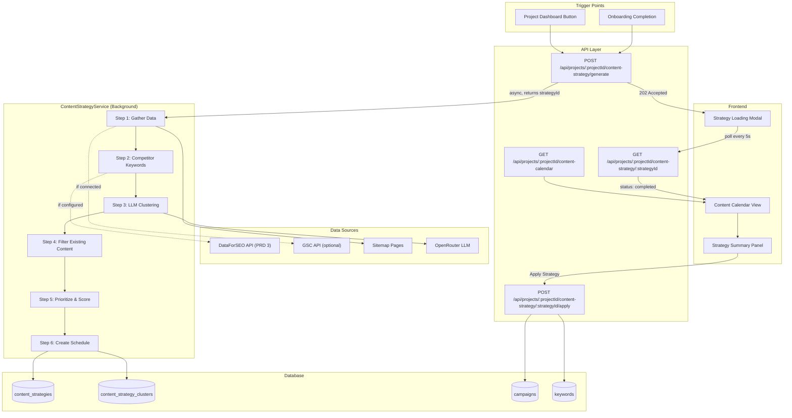
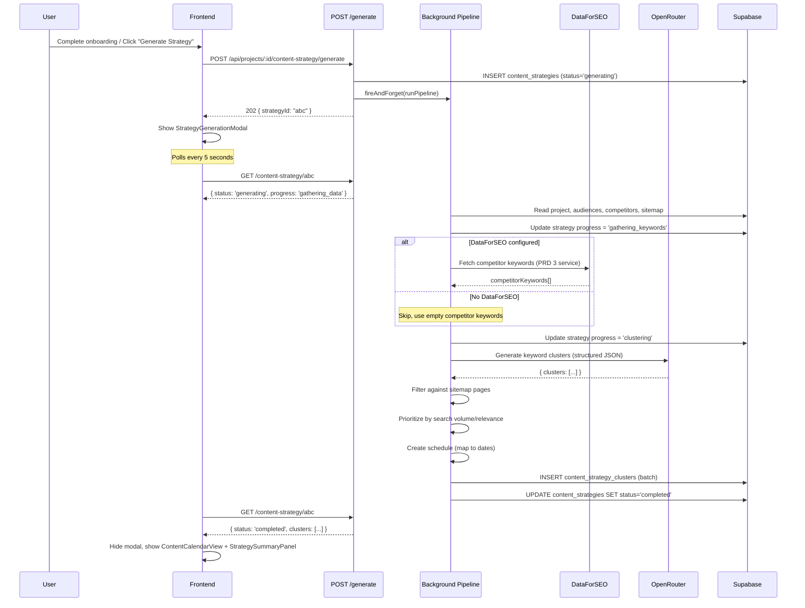
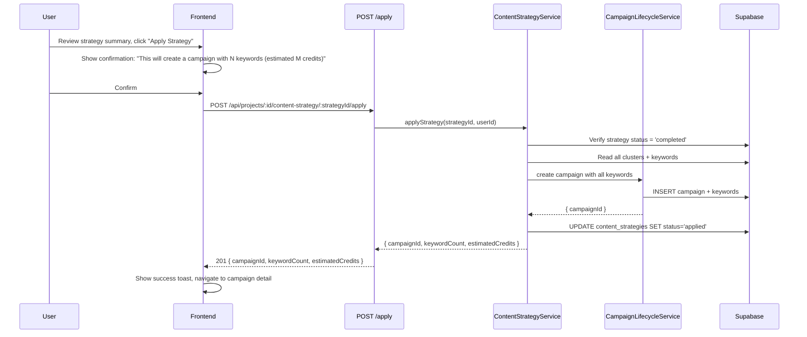
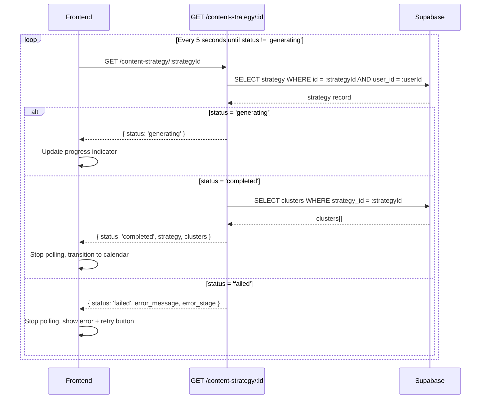

# PRD: Content Strategy Generator

**Status:** Draft
**Complexity Score:** 9 → HIGH
**Created:** 2026-02-24
**Author:** Claude (Principal Architect)
**Series:** Outrank Feature Parity (5 of 6)
**Depends On:** PRD 1 (Schema Extensions), PRD 2 (Website Intelligence), PRD 3 (DataForSEO Integration), PRD 4 (Enhanced Onboarding Wizard)
**Blocks:** PRD 6 (Enhanced Article Generation)

---

## Complexity Assessment

| Factor | Rating | Notes |
|--------|--------|-------|
| New service files | HIGH | ContentStrategyService with multi-step LLM orchestration |
| LLM integration | HIGH | Structured output parsing, prompt engineering, retry logic |
| Data pipeline | HIGH | Competitor keywords → gap analysis → clustering → scheduling |
| Async background jobs | MEDIUM | Reuses existing `fireAndForget()` / `waitUntil()` pattern |
| New DB tables | MEDIUM | `content_strategies` table + `content_strategy_clusters` table |
| New API endpoints | MEDIUM | 4 new endpoints (generate, poll, apply, calendar) |
| New UI components | HIGH | Strategy loading modal, content calendar grid, summary panel |
| Two-mode fallback | MEDIUM | DataForSEO mode vs LLM-only mode |
| Credit estimation | LOW | Reuses existing `calculateArticleCreditCost` |

**Overall: 9/10 — HIGH mode.** Multi-step LLM orchestration with background processing, two data-source modes, and a new calendar UI. Phased into 6 vertical slices, each touching max 5 files.

---

## Integration Points Checklist

```
How will this feature be reached?
- [x] Entry point 1: Post-onboarding wizard completion (PRD 4) → auto-trigger strategy generation
- [x] Entry point 2: Project dashboard → "Generate Content Strategy" button (manual trigger)
- [x] Caller files:
  - Onboarding completion handler → POST /api/projects/:projectId/content-strategy/generate
  - ProjectDashboard → "Generate Strategy" button → same endpoint
- [x] Registration: New API routes in src/pages/api/projects/[projectId]/content-strategy/

Is this user-facing?
- [x] YES → Strategy generation loading modal, content calendar view, strategy summary

Full user flow:
1. User completes onboarding wizard (PRD 4) OR clicks "Generate Strategy" on project dashboard
2. POST /api/projects/:projectId/content-strategy/generate fires
3. "Creating a Content Strategy for You" modal appears with progress animation
4. Frontend polls GET /api/projects/:projectId/content-strategy/:strategyId every 5 seconds
5. Backend runs multi-step pipeline: gather keywords → cluster → filter → schedule
6. Poll response transitions from "generating" → "completed" with strategy data
7. UI transitions to Content Calendar showing scheduled articles
8. User reviews strategy summary (total keywords, estimated credits, cluster breakdown)
9. User clicks "Apply Strategy" → POST .../apply creates campaign + keywords
10. Campaign appears in existing campaign management flow

Does it affect existing systems?
- [x] Projects table: adds strategy_id reference (nullable FK)
- [x] Campaign creation: strategy can auto-create campaigns via applyStrategy()
- [x] Onboarding flow: completion step triggers strategy generation
- [x] Content Calendar (calendar-system-PRD): strategy feeds into calendar view
```

---

## 1. Context

### Problem

After a user completes the enhanced onboarding wizard (PRD 4), we have rich business context: company description, target audiences, competitor domains, sitemap data, example article style, GSC data, and article preferences. Today, this data sits unused — the user must manually create campaigns and add keywords one by one.

Outrank.so solves this by automatically generating a full content strategy the moment onboarding completes. The user sees a loading screen ("Creating a Content Strategy for You — this may take 4-5 minutes"), and when it finishes, they land on a content calendar with dozens of articles already scheduled across the coming weeks.

This is the "magic moment" — the feature that transforms raw business context into an actionable content plan.

### Available Data (Post-Onboarding)

From the project record and onboarding data collected in PRD 4:

| Data Point | Source | Used For |
|------------|--------|----------|
| Business name, domain, description | Project record | LLM context, competitor gap analysis |
| Language, country | Project record | DataForSEO locale, LLM language instruction |
| Target audiences (1-7 groups) | `project_audiences` table | Keyword relevance scoring, topic diversity |
| Competitor domains (0-7) | `project_competitors` table | DataForSEO competitor keyword extraction |
| Sitemap pages | `project_sitemap_pages` table | Content deduplication filter |
| Example article style | `project_writing_style` table | Tone/style context for suggested titles |
| GSC data (optional) | `gsc_connections` + GSC API | Current ranking positions, opportunity gaps |
| Article preferences | Project `content_preferences` | Schedule frequency, tone, CTA style |

### Two Operating Modes

1. **With DataForSEO** (configured via PRD 3): Real keyword data including search volumes, keyword difficulty scores, and competitor keyword gap analysis. Produces high-confidence strategies with quantitative prioritization.

2. **Without DataForSEO** (fallback): LLM-only keyword generation based on business description, audiences, and competitor names. No real search volume data, but still produces a structured, valuable content plan. Priority is based on LLM-estimated relevance rather than search metrics.

Both modes produce the same output format (`IContentStrategy`), so the downstream calendar UI and campaign creation work identically.

---

## 2. Solution

### Architecture Diagram



### Data Model

#### New Table: `content_strategies`

Stores the generated strategy and its lifecycle status.

```sql
CREATE TABLE public.content_strategies (
  id UUID PRIMARY KEY DEFAULT gen_random_uuid(),
  project_id UUID NOT NULL REFERENCES public.projects(id) ON DELETE CASCADE,
  user_id UUID NOT NULL REFERENCES public.profiles(id) ON DELETE CASCADE,
  status TEXT NOT NULL DEFAULT 'generating'
    CHECK (status IN ('generating', 'completed', 'failed', 'applied')),

  -- Input snapshot (for reproducibility and debugging)
  input_snapshot JSONB NOT NULL DEFAULT '{}',

  -- Generation metadata
  mode TEXT NOT NULL DEFAULT 'llm_only'
    CHECK (mode IN ('dataforseo', 'llm_only')),
  total_keywords INTEGER NOT NULL DEFAULT 0,
  total_clusters INTEGER NOT NULL DEFAULT 0,
  estimated_credits INTEGER NOT NULL DEFAULT 0,
  schedule_start_date DATE,
  schedule_end_date DATE,

  -- Error tracking
  error_message TEXT,
  error_stage TEXT,

  -- Timing
  started_at TIMESTAMPTZ NOT NULL DEFAULT NOW(),
  completed_at TIMESTAMPTZ,
  created_at TIMESTAMPTZ NOT NULL DEFAULT NOW(),
  updated_at TIMESTAMPTZ NOT NULL DEFAULT NOW()
);

CREATE INDEX idx_content_strategies_project_id ON public.content_strategies(project_id);
CREATE INDEX idx_content_strategies_user_id ON public.content_strategies(user_id);
CREATE INDEX idx_content_strategies_status ON public.content_strategies(status);
```

#### New Table: `content_strategy_clusters`

Stores individual keyword clusters within a strategy.

```sql
CREATE TABLE public.content_strategy_clusters (
  id UUID PRIMARY KEY DEFAULT gen_random_uuid(),
  strategy_id UUID NOT NULL REFERENCES public.content_strategies(id) ON DELETE CASCADE,
  name TEXT NOT NULL,
  priority TEXT NOT NULL DEFAULT 'medium'
    CHECK (priority IN ('high', 'medium', 'low')),
  search_volume_total INTEGER DEFAULT 0,
  avg_difficulty NUMERIC(5,2) DEFAULT 0,
  keyword_count INTEGER NOT NULL DEFAULT 0,

  -- Keywords stored as JSONB array (denormalized for simplicity)
  -- Each entry: { keyword, searchVolume, difficulty, intent, suggestedTitle }
  keywords JSONB NOT NULL DEFAULT '[]',

  -- Schedule entries for this cluster
  -- Each entry: { keyword, suggestedTitle, scheduledDate, priority }
  schedule_entries JSONB NOT NULL DEFAULT '[]',

  created_at TIMESTAMPTZ NOT NULL DEFAULT NOW()
);

CREATE INDEX idx_strategy_clusters_strategy_id ON public.content_strategy_clusters(strategy_id);
CREATE INDEX idx_strategy_clusters_priority ON public.content_strategy_clusters(priority);
```

### TypeScript Interfaces

```typescript
// shared/types/content-strategy.types.ts

export type ContentStrategyStatus = 'generating' | 'completed' | 'failed' | 'applied';
export type ContentStrategyMode = 'dataforseo' | 'llm_only';
export type ClusterPriority = 'high' | 'medium' | 'low';
export type SearchIntent = 'informational' | 'commercial' | 'transactional' | 'navigational';

/** Input snapshot stored with each strategy for reproducibility */
export interface IStrategyInputSnapshot {
  businessName: string;
  businessDescription: string;
  domain: string | null;
  audiences: string[];
  competitors: string[];
  language: string;
  country: string;
  existingPageCount: number;
  existingPageUrls: string[];
  gscConnected: boolean;
}

/** Full strategy record from database */
export interface IContentStrategy {
  id: string;
  project_id: string;
  user_id: string;
  status: ContentStrategyStatus;
  input_snapshot: IStrategyInputSnapshot;
  mode: ContentStrategyMode;
  total_keywords: number;
  total_clusters: number;
  estimated_credits: number;
  schedule_start_date: string | null;
  schedule_end_date: string | null;
  error_message: string | null;
  error_stage: string | null;
  started_at: string;
  completed_at: string | null;
  created_at: string;
  updated_at: string;
}

/** Keyword within a cluster */
export interface IStrategyKeyword {
  keyword: string;
  searchVolume: number | null;
  difficulty: number | null;
  intent: SearchIntent;
  suggestedTitle: string;
}

/** Scheduled article entry */
export interface IScheduledArticleEntry {
  keyword: string;
  suggestedTitle: string;
  scheduledDate: string; // ISO date (YYYY-MM-DD)
  priority: number;      // 1 = highest
}

/** Cluster record from database */
export interface IContentStrategyCluster {
  id: string;
  strategy_id: string;
  name: string;
  priority: ClusterPriority;
  search_volume_total: number;
  avg_difficulty: number;
  keyword_count: number;
  keywords: IStrategyKeyword[];
  schedule_entries: IScheduledArticleEntry[];
  created_at: string;
}

/** Strategy with clusters (API response) */
export interface IContentStrategyWithClusters extends IContentStrategy {
  clusters: IContentStrategyCluster[];
}

/** Calendar view data (articles grouped by date) */
export interface ICalendarDay {
  date: string; // ISO date (YYYY-MM-DD)
  articles: ICalendarArticleEntry[];
}

export interface ICalendarArticleEntry {
  keyword: string;
  suggestedTitle: string;
  clusterId: string;
  clusterName: string;
  clusterPriority: ClusterPriority;
  priority: number;
  status: 'planned' | 'campaign_created' | 'generating' | 'draft' | 'published';
}

/** Apply strategy result */
export interface IApplyStrategyResult {
  campaignId: string;
  campaignName: string;
  keywordCount: number;
  estimatedCredits: number;
  scheduleFrequency: string;
}

/** Error types */
export class StrategyNotFoundError extends Error {
  public readonly strategyId: string;
  constructor(strategyId: string) {
    super(`Content strategy not found: ${strategyId}`);
    this.name = 'StrategyNotFoundError';
    this.strategyId = strategyId;
  }
}

export class StrategyGenerationError extends Error {
  public readonly stage: string;
  constructor(stage: string, message: string) {
    super(`Strategy generation failed at stage '${stage}': ${message}`);
    this.name = 'StrategyGenerationError';
    this.stage = stage;
  }
}

export class StrategyAlreadyAppliedError extends Error {
  constructor(strategyId: string) {
    super(`Strategy ${strategyId} has already been applied`);
    this.name = 'StrategyAlreadyAppliedError';
  }
}
```

### Content Strategy Service Design

```typescript
// server/services/content-strategy.service.ts

class ContentStrategyService {
  /**
   * Generate a content strategy for a project.
   * Creates a strategy record in 'generating' status and kicks off
   * the background pipeline via fireAndForget.
   *
   * @returns The strategy ID for polling
   */
  async generateStrategy(
    projectId: string,
    userId: string,
    locals: unknown  // for fireAndForget
  ): Promise<{ strategyId: string }>;

  /**
   * Get strategy by ID with ownership check.
   * Used for polling status during generation.
   */
  async getStrategy(
    strategyId: string,
    userId: string
  ): Promise<IContentStrategyWithClusters | null>;

  /**
   * Apply a completed strategy: create a campaign + keywords from the
   * strategy's scheduled articles. Requires user confirmation of credit cost.
   */
  async applyStrategy(
    strategyId: string,
    userId: string
  ): Promise<IApplyStrategyResult>;

  /**
   * Get calendar view data for a project's strategy.
   * Returns articles grouped by date within a date range.
   */
  async getCalendarData(
    projectId: string,
    userId: string,
    dateFrom: string,
    dateTo: string
  ): Promise<ICalendarDay[]>;

  // ---- Internal Pipeline Steps (private) ----

  /**
   * Full background pipeline orchestrator.
   * Called via fireAndForget after strategy record is created.
   */
  private async runPipeline(strategyId: string, projectId: string, userId: string): Promise<void>;

  /**
   * Step 1: Gather all input data from project tables.
   * Reads project, audiences, competitors, sitemap, GSC connection.
   */
  private async gatherInputData(projectId: string): Promise<IStrategyInputSnapshot>;

  /**
   * Step 2: Fetch competitor keywords via DataForSEO (if configured).
   * Falls back to empty array if DataForSEO is not configured.
   */
  private async gatherCompetitorKeywords(
    competitors: string[],
    language: string,
    country: string
  ): Promise<ICompetitorKeywordData[]>;

  /**
   * Step 3: Generate keyword clusters via LLM.
   * Sends business context + competitor keywords to OpenRouter.
   * Returns structured clusters with keywords, intents, and titles.
   */
  private async generateKeywordClusters(
    input: IStrategyInputSnapshot,
    competitorKeywords: ICompetitorKeywordData[],
    gscKeywords: string[]
  ): Promise<IRawKeywordCluster[]>;

  /**
   * Step 4: Filter out keywords that overlap with existing sitemap content.
   * Compares generated keywords against sitemap page URLs and titles.
   */
  private async filterExistingContent(
    clusters: IRawKeywordCluster[],
    existingPages: string[]
  ): Promise<IRawKeywordCluster[]>;

  /**
   * Step 5: Prioritize clusters and keywords.
   * With DataForSEO: sort by search volume / difficulty ratio.
   * Without DataForSEO: sort by LLM-assigned relevance scores.
   */
  private prioritizeClusters(clusters: IRawKeywordCluster[]): IRawKeywordCluster[];

  /**
   * Step 6: Create schedule by mapping keywords to dates.
   * Uses project schedule frequency preference.
   * High-priority clusters first, alternating for variety.
   */
  private createSchedule(
    clusters: IRawKeywordCluster[],
    frequency: string,
    startDate: Date
  ): IScheduledArticleEntry[];
}
```

### LLM Prompt Strategy

The LLM call in Step 3 is the core intelligence of this feature. The prompt must:

1. Accept structured input (JSON) with business context
2. Return structured output (JSON) with keyword clusters
3. Handle both modes (with/without competitor keyword data)
4. Respect language and country for keyword localization
5. Be deterministic enough for reproducible results

**System Prompt:**
```
You are an expert SEO content strategist. Your task is to generate a comprehensive
keyword cluster strategy for a business. You must return ONLY valid JSON.

Rules:
- Generate 5-15 keyword clusters based on the business context
- Each cluster should have 3-8 individual keywords
- Classify each keyword's search intent (informational, commercial, transactional, navigational)
- Suggest an SEO-optimized article title for each keyword
- Prioritize keywords that are relevant to the target audiences
- Avoid keywords that overlap with existing content (provided in the input)
- All keywords and titles must be in the specified language
- Consider the target country for local relevance
```

**User Prompt (structured):**
```json
{
  "business": {
    "name": "...",
    "description": "...",
    "domain": "...",
    "language": "en",
    "country": "US"
  },
  "audiences": ["..."],
  "competitorKeywords": [
    { "keyword": "...", "searchVolume": 1200, "difficulty": 45 }
  ],
  "existingPages": ["..."],
  "gscKeywords": ["..."],
  "targetClusterCount": 10,
  "targetKeywordsPerCluster": 5
}
```

**Expected Response Format:**
```json
{
  "clusters": [
    {
      "name": "Image Upscaling Techniques",
      "priority": "high",
      "keywords": [
        {
          "keyword": "how to upscale images without losing quality",
          "intent": "informational",
          "suggestedTitle": "How to Upscale Images Without Losing Quality: A Complete Guide",
          "relevanceScore": 9
        }
      ]
    }
  ]
}
```

### Scheduling Algorithm

The scheduling algorithm maps prioritized keywords to dates:

```
Input: prioritized clusters[], frequency (e.g., "daily"), startDate
Output: scheduledArticles[]

1. Flatten all keywords across clusters, preserving cluster association
2. Sort by: cluster priority (high→medium→low), then keyword relevance score
3. Interleave clusters: instead of exhausting one cluster before the next,
   round-robin through clusters to ensure topic variety across the calendar
4. Assign dates:
   - Start from startDate (tomorrow by default)
   - Increment by frequency interval (daily = +1 day, 3x_weekly = Mon/Wed/Fri, etc.)
   - Skip weekends if project preference is set (default: include weekends)
5. Return: { keyword, suggestedTitle, scheduledDate, clusterId, priority }
```

### API Endpoints

| Method | Path | Purpose | Auth | Response |
|--------|------|---------|------|----------|
| POST | `/api/projects/:projectId/content-strategy/generate` | Trigger strategy generation | Required | 202 `{ strategyId }` |
| GET | `/api/projects/:projectId/content-strategy/:strategyId` | Poll status + get results | Required | 200 `{ strategy, clusters }` |
| POST | `/api/projects/:projectId/content-strategy/:strategyId/apply` | Create campaign from strategy | Required | 201 `{ campaignId, keywordCount, estimatedCredits }` |
| GET | `/api/projects/:projectId/content-calendar` | Calendar view data | Required | 200 `{ days: ICalendarDay[] }` |

### UI Components

1. **StrategyGenerationModal** — Full-screen overlay shown during generation
   - Animated progress indicator (spinner or step-based)
   - "Creating a Content Strategy for You" heading
   - "This may take 4-5 minutes" subtitle
   - Step indicators: "Analyzing competitors..." → "Generating keywords..." → "Building schedule..."
   - Polls every 5 seconds via `GET /content-strategy/:id`
   - Auto-transitions to calendar view on completion
   - Shows error state with retry button on failure

2. **ContentCalendarView** — Month-grid calendar showing the planned articles
   - Calendar grid with days as cells
   - Each day cell shows 0-N article cards
   - Article cards show: suggested title (truncated), cluster color dot, priority badge
   - Color-coded by cluster (deterministic hash → palette, same as calendar-system-PRD)
   - Month navigation (prev/next)
   - Click article card to see full details in a popover

3. **StrategySummaryPanel** — Sidebar or top panel with strategy overview
   - Total keywords generated
   - Number of clusters
   - Estimated credits needed (with current balance comparison)
   - Schedule date range (start → end)
   - Cluster breakdown: name, keyword count, priority badge
   - "Apply Strategy" button (primary CTA)
   - "Regenerate" button (secondary, triggers new generation)

4. **CalendarDayCell** — Individual day in the calendar
   - Shows date number
   - Lists article cards (max 3 visible, "+N more" overflow)
   - Subtle highlight for today
   - Dimmed for past dates
   - "Generating keyword..." placeholder while strategy is in progress

---

## 3. Sequence Flow

### 3.1 Strategy Generation (Happy Path)



### 3.2 Apply Strategy (Create Campaign)



### 3.3 Polling Flow (During Generation)



---

## 4. Execution Phases

### Phase 1: Database Schema + Types

**User-visible outcome:** Database tables and TypeScript types ready for content strategy feature.

**Files (4):**

- `supabase/migrations/YYYYMMDDHHMMSS_create_content_strategies.sql` — new tables, indexes, RLS
- `shared/types/content-strategy.types.ts` — all TypeScript interfaces and error classes
- `shared/validation/content-strategy.schema.ts` — Zod schemas for API input/output validation
- `src/pages/api/_utils.ts` — add StrategyNotFoundError, StrategyAlreadyAppliedError to handleApiError

**Implementation:**

- [ ] Create migration with `content_strategies` and `content_strategy_clusters` tables
  - Enable RLS on both tables
  - Policies: users can view/create their own strategies; service role has full access
  - `updated_at` trigger on `content_strategies`
  - Index on `project_id`, `user_id`, `status` for `content_strategies`
  - Index on `strategy_id`, `priority` for `content_strategy_clusters`
- [ ] Create TypeScript interfaces as specified in Section 2
  - `IContentStrategy`, `IContentStrategyCluster`, `IStrategyKeyword`
  - `IScheduledArticleEntry`, `ICalendarDay`, `ICalendarArticleEntry`
  - `IApplyStrategyResult`, `IStrategyInputSnapshot`
  - Error classes: `StrategyNotFoundError`, `StrategyGenerationError`, `StrategyAlreadyAppliedError`
- [ ] Create Zod schemas for:
  - Generate request (minimal — projectId is in URL path)
  - Apply request (minimal — strategyId is in URL path)
  - Calendar query params (`dateFrom`, `dateTo` as ISO dates)
- [ ] Add new error types to `handleApiError` switch statement:
  - `StrategyNotFoundError` → 404 NOT_FOUND
  - `StrategyGenerationError` → 500 INTERNAL_ERROR
  - `StrategyAlreadyAppliedError` → 409 CONFLICT

**Verification Plan:**

1. **Migration test:** `npx supabase migration up` — both tables created with correct columns
2. **Type check:** `npx tsc --noEmit` — no type errors
3. **Unit tests:**
   | Test File | Test Name | Assertion |
   |-----------|-----------|-----------|
   | `tests/unit/content-strategy-types.spec.ts` | `should validate strategy input snapshot` | Zod schema parses valid input |
   | `tests/unit/content-strategy-types.spec.ts` | `should reject invalid calendar date range` | Zod schema rejects bad dates |

---

### Phase 2: Content Strategy Service — Data Gathering + LLM Clustering

**User-visible outcome:** Backend service can gather project data and generate keyword clusters via LLM.

**Files (4):**

- `server/services/content-strategy.service.ts` — main service class (Steps 1-3)
- `server/services/prompts/strategy-prompts.ts` — LLM prompt templates for keyword clustering
- `shared/config/content-strategy.config.ts` — configuration constants (timeouts, limits, defaults)
- `server/services/__tests__/content-strategy.service.test.ts` — unit tests

**Implementation:**

- [ ] Create `ContentStrategyService` class with singleton export
- [ ] Implement `gatherInputData(projectId)`:
  - Read project record (name, domain, description, language, country)
  - Read `project_audiences` for target audience descriptions
  - Read `project_competitors` for competitor domains
  - Read `project_sitemap_pages` for existing page URLs/titles
  - Check `gsc_connections` for GSC data availability
  - Return `IStrategyInputSnapshot`
- [ ] Implement `gatherCompetitorKeywords(competitors, language, country)`:
  - If DataForSEO is configured (check `serverEnv.DATAFORSEO_API_KEY`), call DataForSEO service (PRD 3) to fetch competitor organic keywords
  - If not configured, return empty array (graceful fallback)
  - Deduplicate keywords across competitors
  - Return array of `{ keyword, searchVolume, difficulty, source }`
- [ ] Implement `generateKeywordClusters(input, competitorKeywords, gscKeywords)`:
  - Build system + user prompt from `strategy-prompts.ts`
  - Call `OpenRouterService.chatCompletion()` with JSON response format
  - Parse structured JSON response into `IRawKeywordCluster[]`
  - Validate response structure, retry once on parse failure with a corrective prompt
  - If DataForSEO data is available, enrich LLM clusters with real search volumes and difficulty scores
- [ ] Create prompt templates in `strategy-prompts.ts`:
  - `getStrategySystemPrompt()` — expert SEO strategist role
  - `getStrategyUserPrompt(input)` — structured business context
  - `getStrategyRetryPrompt(error)` — corrective prompt for parse failures
- [ ] Create config in `content-strategy.config.ts`:
  - `STRATEGY_GENERATION_TIMEOUT_MS = 300_000` (5 minutes)
  - `MAX_CLUSTERS = 15`
  - `MIN_CLUSTERS = 5`
  - `MAX_KEYWORDS_PER_CLUSTER = 8`
  - `MIN_KEYWORDS_PER_CLUSTER = 3`
  - `TARGET_TOTAL_KEYWORDS = 50`
  - `LLM_MODEL_FOR_STRATEGY = 'google/gemini-2.0-flash-001'` (fast, good at structured output)
  - `LLM_TEMPERATURE = 0.7`
  - `LLM_MAX_TOKENS = 4096`
  - `POLL_INTERVAL_MS = 5000`

**Verification Plan:**

1. **Unit tests:**
   | Test File | Test Name | Assertion |
   |-----------|-----------|-----------|
   | `content-strategy.service.test.ts` | `gatherInputData should return complete snapshot` | All fields populated from mock DB |
   | `content-strategy.service.test.ts` | `gatherCompetitorKeywords should return empty array without DataForSEO` | Returns `[]` when API key missing |
   | `content-strategy.service.test.ts` | `generateKeywordClusters should parse LLM response` | Returns valid cluster structure |
   | `content-strategy.service.test.ts` | `generateKeywordClusters should retry on parse failure` | Retries once, succeeds on second attempt |
   | `content-strategy.service.test.ts` | `prompts should include all input fields` | Prompt string contains business name, audiences, etc. |

---

### Phase 3: Content Strategy Service — Filtering, Prioritization, Scheduling + Persistence

**User-visible outcome:** Complete background pipeline that generates and persists a full content strategy.

**Files (4):**

- `server/services/content-strategy.service.ts` — add Steps 4-6, `runPipeline()`, `generateStrategy()`
- `server/services/content-strategy-scheduler.ts` — scheduling algorithm (extracted for testability)
- `server/services/__tests__/content-strategy-scheduler.test.ts` — scheduler unit tests
- `server/services/__tests__/content-strategy-pipeline.test.ts` — integration test for full pipeline

**Implementation:**

- [ ] Implement `filterExistingContent(clusters, existingPages)`:
  - For each keyword in each cluster, check if any sitemap page URL or title contains the keyword (fuzzy match via normalized string comparison)
  - Remove keywords that have >70% overlap with existing content
  - Remove clusters that become empty after filtering
  - Log filtered-out keywords for debugging
- [ ] Implement `prioritizeClusters(clusters)`:
  - With DataForSEO data: score = `searchVolume / (difficulty + 1)` (higher is better)
  - Without DataForSEO: use LLM-provided `relevanceScore` (1-10)
  - Sort clusters by aggregate score (sum of keyword scores)
  - Assign priority: top 30% = 'high', middle 40% = 'medium', bottom 30% = 'low'
- [ ] Create `content-strategy-scheduler.ts`:
  - `createSchedule(clusters, frequency, startDate, skipWeekends)` function
  - Round-robin interleaving across clusters for topic variety
  - Date calculation using existing `SCHEDULE_FREQUENCIES` from `scheduling.config.ts`
  - Returns `IScheduledArticleEntry[]` sorted by date
- [ ] Implement `runPipeline(strategyId, projectId, userId)`:
  - Wrap entire pipeline in try/catch
  - On each step completion, update `content_strategies.input_snapshot` with progress marker (for the polling UI to show which step is active)
  - On success: batch insert clusters into `content_strategy_clusters`, update strategy status to 'completed', set `completed_at`
  - On failure: update strategy status to 'failed', set `error_message` and `error_stage`
  - Calculate `estimated_credits` = total keywords * `calculateArticleCreditCost(defaultModel, defaultImagePreset)`
- [ ] Implement `generateStrategy(projectId, userId, locals)`:
  - Verify project ownership
  - Check no strategy is currently generating for this project (prevent duplicates)
  - Insert `content_strategies` record with status='generating'
  - Call `fireAndForget(locals, this.runPipeline(strategyId, projectId, userId))`
  - Return `{ strategyId }`

**Verification Plan:**

1. **Unit tests:**
   | Test File | Test Name | Assertion |
   |-----------|-----------|-----------|
   | `content-strategy-scheduler.test.ts` | `should distribute articles across dates using daily frequency` | One article per day, sequential dates |
   | `content-strategy-scheduler.test.ts` | `should interleave clusters for variety` | No 3+ consecutive articles from same cluster |
   | `content-strategy-scheduler.test.ts` | `should skip weekends when configured` | No Saturday/Sunday dates in output |
   | `content-strategy-scheduler.test.ts` | `should handle 3x_weekly frequency` | Articles on Mon/Wed/Fri only |
   | `content-strategy-scheduler.test.ts` | `should start from tomorrow` | First date > today |
   | `content-strategy-pipeline.test.ts` | `runPipeline should create completed strategy with clusters` | Strategy status = 'completed', clusters > 0 |
   | `content-strategy-pipeline.test.ts` | `runPipeline should set failed status on LLM error` | Strategy status = 'failed', error_stage = 'clustering' |
   | `content-strategy-pipeline.test.ts` | `filterExistingContent should remove overlapping keywords` | Keyword count reduced |
   | `content-strategy-pipeline.test.ts` | `prioritizeClusters should rank high-volume clusters first` | First cluster has highest score |

---

### Phase 4: API Endpoints (Generate, Poll, Apply, Calendar)

**User-visible outcome:** Frontend can trigger strategy generation, poll for results, apply strategies, and fetch calendar data.

**Files (5):**

- `src/pages/api/projects/[projectId]/content-strategy/generate.ts` — POST trigger endpoint
- `src/pages/api/projects/[projectId]/content-strategy/[strategyId]/index.ts` — GET poll endpoint
- `src/pages/api/projects/[projectId]/content-strategy/[strategyId]/apply.ts` — POST apply endpoint
- `src/pages/api/projects/[projectId]/content-calendar.ts` — GET calendar data endpoint
- `shared/config/security.ts` — register any new public routes if needed (unlikely — all authenticated)

**Implementation:**

- [ ] `POST /api/projects/:projectId/content-strategy/generate`:
  - Use `withAuth` wrapper
  - Validate projectId is a valid UUID
  - Verify project ownership
  - Call `contentStrategyService.generateStrategy(projectId, userId, locals)`
  - Return 202 `{ strategyId }`
- [ ] `GET /api/projects/:projectId/content-strategy/:strategyId`:
  - Use `withAuth` wrapper
  - Call `contentStrategyService.getStrategy(strategyId, userId)`
  - Return 200 with strategy + clusters (if completed) or status only (if generating)
  - Return 404 if not found
- [ ] `POST /api/projects/:projectId/content-strategy/:strategyId/apply`:
  - Use `withAuth` wrapper
  - Verify strategy belongs to this project
  - Call `contentStrategyService.applyStrategy(strategyId, userId)`
  - Return 201 `{ campaignId, keywordCount, estimatedCredits }`
  - Return 409 if strategy already applied
- [ ] `GET /api/projects/:projectId/content-calendar`:
  - Use `withAuth` wrapper
  - Parse `dateFrom` and `dateTo` query params (validate via Zod)
  - Call `contentStrategyService.getCalendarData(projectId, userId, dateFrom, dateTo)`
  - Return 200 `{ days: ICalendarDay[] }`
- [ ] Implement `applyStrategy` in ContentStrategyService:
  - Verify strategy status is 'completed' (not 'applied' or 'failed')
  - Collect all keywords from all clusters
  - Determine campaign settings from project preferences (model, tone, word count, frequency)
  - Call `campaignLifecycleService.create()` with all keywords
  - If the strategy has schedule entries, set `schedule_frequency` on the campaign
  - Update strategy status to 'applied'
  - Return campaign details
- [ ] Implement `getCalendarData` in ContentStrategyService:
  - Query clusters for the project's latest strategy
  - Flatten schedule entries, filter by date range
  - Group by date → return `ICalendarDay[]`
  - If strategy has been applied, join with actual article/keyword status from the campaign

**Verification Plan:**

1. **API tests (curl):**
   ```bash
   # Trigger generation
   curl -X POST "http://localhost:4321/api/projects/PROJECT_ID/content-strategy/generate" \
     -H "Authorization: Bearer $TOKEN" | jq .
   # Expected: 202 { success: true, data: { strategyId: "..." } }

   # Poll status
   curl -X GET "http://localhost:4321/api/projects/PROJECT_ID/content-strategy/STRATEGY_ID" \
     -H "Authorization: Bearer $TOKEN" | jq .
   # Expected: 200 { success: true, data: { status: "generating"|"completed", ... } }

   # Apply strategy
   curl -X POST "http://localhost:4321/api/projects/PROJECT_ID/content-strategy/STRATEGY_ID/apply" \
     -H "Authorization: Bearer $TOKEN" | jq .
   # Expected: 201 { success: true, data: { campaignId: "...", keywordCount: N } }

   # Get calendar
   curl -X GET "http://localhost:4321/api/projects/PROJECT_ID/content-calendar?dateFrom=2026-03-01&dateTo=2026-03-31" \
     -H "Authorization: Bearer $TOKEN" | jq .
   # Expected: 200 { success: true, data: { days: [...] } }
   ```
2. **Unit tests:**
   | Test File | Test Name | Assertion |
   |-----------|-----------|-----------|
   | `tests/api/content-strategy.api.spec.ts` | `POST /generate should return 202 with strategyId` | Status 202, body has strategyId |
   | `tests/api/content-strategy.api.spec.ts` | `GET /strategy should return generating status` | Status 200, status = 'generating' |
   | `tests/api/content-strategy.api.spec.ts` | `POST /apply should create campaign` | Status 201, body has campaignId |
   | `tests/api/content-strategy.api.spec.ts` | `POST /apply should return 409 for already-applied` | Status 409 |
   | `tests/api/content-strategy.api.spec.ts` | `GET /content-calendar should return days array` | Status 200, days is array |
   | `tests/api/content-strategy.api.spec.ts` | `should return 401 without auth` | Status 401 |
   | `tests/api/content-strategy.api.spec.ts` | `should return 404 for non-existent strategy` | Status 404 |

---

### Phase 5: Strategy Generation Modal + Polling Hook

**User-visible outcome:** Users see an animated loading screen during strategy generation with real-time status updates.

**Files (5):**

- `client/components/strategy/StrategyGenerationModal.tsx` — full-screen loading modal
- `client/hooks/useStrategyGeneration.ts` — hook for triggering generation + polling
- `client/hooks/useStrategyPolling.ts` — hook for polling strategy status
- `client/utils/strategyHelpers.ts` — progress step mapping, status formatting
- `client/components/strategy/StrategyProgressSteps.tsx` — step indicator sub-component

**Implementation:**

- [ ] Create `useStrategyGeneration()` hook:
  - `trigger(projectId)` — calls POST `/generate`, stores strategyId, starts polling
  - Returns `{ isGenerating, strategyId, trigger }`
- [ ] Create `useStrategyPolling(strategyId)` hook:
  - Polls GET `/content-strategy/:id` every 5 seconds while status = 'generating'
  - Stops polling on 'completed' or 'failed'
  - Returns `{ status, strategy, clusters, error, isPolling }`
  - Uses `setInterval` with cleanup on unmount
- [ ] Create `StrategyGenerationModal`:
  - Full-screen overlay with backdrop blur (Tailwind: `fixed inset-0 bg-black/50 backdrop-blur-sm`)
  - Centered card with:
    - Animated gradient spinner or Lottie animation
    - "Creating a Content Strategy for You" heading
    - "This may take 4-5 minutes" subtitle
    - `StrategyProgressSteps` showing current pipeline stage
  - On completion: auto-close and trigger parent callback
  - On failure: show error message + "Try Again" button
  - No close button during generation (prevent accidental dismissal)
  - Escape key disabled during generation
- [ ] Create `StrategyProgressSteps`:
  - Steps: "Gathering data" → "Analyzing competitors" → "Generating keywords" → "Building schedule"
  - Active step has animated pulse, completed steps have checkmark
  - Maps strategy status/progress to visual step
- [ ] Create `strategyHelpers.ts`:
  - `getProgressStep(status)` — maps strategy DB status to UI step index
  - `formatEstimatedCredits(credits, currentBalance)` — "45 credits needed (you have 120)"
  - `formatDateRange(start, end)` — "Mar 1 - Apr 15, 2026"

**Verification Plan:**

1. **Playwright E2E:**
   | Test File | Test Name | Assertion |
   |-----------|-----------|-----------|
   | `tests/e2e/content-strategy.e2e.spec.ts` | `should show loading modal on strategy generation` | Modal visible with heading text |
   | `tests/e2e/content-strategy.e2e.spec.ts` | `should show progress steps` | Step indicators visible |
   | `tests/e2e/content-strategy.e2e.spec.ts` | `should transition to calendar on completion` | Modal closes, calendar appears |
   | `tests/e2e/content-strategy.e2e.spec.ts` | `should show error state with retry` | Error message and retry button visible |
2. **Manual verification:** Trigger strategy generation, observe modal animation and progress updates

---

### Phase 6: Content Calendar View + Strategy Summary

**User-visible outcome:** Users see their content strategy visualized as a calendar with articles scheduled across days, plus a summary panel with "Apply Strategy" action.

**Files (5):**

- `client/components/strategy/ContentCalendarView.tsx` — month-grid calendar component
- `client/components/strategy/StrategySummaryPanel.tsx` — strategy overview + apply button
- `client/components/strategy/CalendarDayCell.tsx` — individual day cell with article cards
- `client/components/strategy/CalendarArticleCard.tsx` — article card within a day cell
- `client/hooks/useContentCalendar.ts` — hook for fetching and managing calendar data

**Implementation:**

- [ ] Create `useContentCalendar(projectId, strategyId)` hook:
  - Fetches calendar data for visible month range
  - Refetches when month navigation changes
  - Returns `{ days, isLoading, currentMonth, navigateMonth, error }`
  - Also fetches strategy summary data
- [ ] Create `ContentCalendarView`:
  - Month header with navigation arrows and month/year label
  - 7-column grid (Sun-Sat) with day headers
  - Rows of `CalendarDayCell` components
  - Responsive: stacks on mobile, full grid on desktop
  - Cluster color legend bar below header (derived from clusters)
  - Loading skeleton state while data loads
- [ ] Create `CalendarDayCell`:
  - Date number in corner
  - List of `CalendarArticleCard` components (max 3 visible)
  - "+N more" indicator if >3 articles on a day
  - Subtle background highlight for today
  - Dimmed style for days outside current month
- [ ] Create `CalendarArticleCard`:
  - Compact card showing: cluster color dot, suggested title (1 line truncated)
  - Hover: show full title + keyword + cluster name in tooltip
  - Click: expand to show full details in a popover
  - Priority indicator: small colored badge (high=red, medium=yellow, low=gray)
- [ ] Create `StrategySummaryPanel`:
  - Position: sticky sidebar on desktop, collapsible panel on mobile
  - Content:
    - Strategy status badge (completed/applied)
    - Total keywords count
    - Total clusters count with mini bar chart showing high/medium/low distribution
    - Estimated credits needed vs. current balance
    - Date range: "Mar 1 - May 15, 2026"
    - Cluster list: name + keyword count + priority badge for each
  - Actions:
    - "Apply Strategy" primary button (creates campaign) — shows confirmation modal with credit estimate
    - "Regenerate" secondary button — triggers new generation (with confirmation: "This will replace the current strategy")
  - Disabled state with explanation when strategy is already applied

**Verification Plan:**

1. **Playwright E2E:**
   | Test File | Test Name | Assertion |
   |-----------|-----------|-----------|
   | `tests/e2e/content-strategy.e2e.spec.ts` | `should display calendar grid with day headers` | 7 day headers visible (Sun-Sat) |
   | `tests/e2e/content-strategy.e2e.spec.ts` | `should show article cards on calendar days` | At least one article card visible |
   | `tests/e2e/content-strategy.e2e.spec.ts` | `should navigate between months` | Click next → month label changes |
   | `tests/e2e/content-strategy.e2e.spec.ts` | `should show strategy summary panel` | Total keywords, clusters, credits visible |
   | `tests/e2e/content-strategy.e2e.spec.ts` | `should show Apply Strategy button` | Button visible and enabled |
   | `tests/e2e/content-strategy.e2e.spec.ts` | `should show cluster color legend` | Color dots with cluster names visible |
   | `tests/e2e/content-strategy.e2e.spec.ts` | `should apply strategy and navigate to campaign` | Click Apply → confirmation → success toast |
2. **Unit tests:**
   | Test File | Test Name | Assertion |
   |-----------|-----------|-----------|
   | `tests/unit/calendarDayCell.spec.ts` | `should show "+N more" for overflow` | 5 articles → shows 3 cards + "+2 more" |
   | `tests/unit/calendarDayCell.spec.ts` | `should highlight today` | Today's cell has highlight class |
   | `tests/unit/strategySummary.spec.ts` | `should disable Apply when already applied` | Button disabled, explanation text shown |
   | `tests/unit/strategySummary.spec.ts` | `should show credit comparison` | "45 credits needed (you have 120)" |
3. **Manual verification:**
   - View calendar with articles distributed across days
   - Navigate between months
   - Click article card to see details
   - Apply strategy and verify campaign creation

---

## 5. Acceptance Criteria

- [ ] All 6 phases complete
- [ ] All unit, API, and E2E tests pass
- [ ] `yarn verify` passes
- [ ] Strategy generation works in both DataForSEO and LLM-only modes
- [ ] Strategy generation completes within 5 minutes for typical projects (1-3 competitors, 5-10 audiences)
- [ ] Polling correctly reflects pipeline progress (gathering → clustering → scheduling → completed)
- [ ] Failed strategies show clear error message and retry option
- [ ] Content calendar displays articles on correct dates with cluster color coding
- [ ] Month navigation loads new data for the visible range
- [ ] Strategy summary shows accurate credit estimate
- [ ] "Apply Strategy" creates a valid campaign with all keywords
- [ ] Applied strategy is marked as such and cannot be re-applied
- [ ] "Regenerate" creates a new strategy without affecting existing campaigns
- [ ] LLM-only fallback produces usable strategies (at least 5 clusters, 25+ keywords)
- [ ] Generated keywords respect the project's language and country settings
- [ ] Existing sitemap pages are excluded from generated keywords (no content duplication)
- [ ] Scheduling respects project frequency preference and alternates between clusters
- [ ] All new API endpoints require authentication and enforce project ownership
- [ ] No Cloudflare CPU limit violations (LLM calls are I/O-bound, scheduling is lightweight)
- [ ] Background pipeline does not block the API response (fires via `fireAndForget`)

---

## Future Enhancements (Out of Scope)

- **Strategy comparison:** Side-by-side view of two strategies for A/B testing approaches
- **Partial apply:** Apply only selected clusters instead of the entire strategy
- **GSC-enhanced prioritization:** Use GSC ranking data to identify "striking distance" keywords (rank 11-20) and prioritize them
- **Competitor monitoring:** Re-run competitor analysis periodically to discover new keyword opportunities
- **Strategy sharing:** Export strategy as PDF or share link for team review
- **AI strategy refinement:** "Adjust strategy" prompt where user can request changes ("more commercial content", "focus on audience X")
- **Multi-campaign apply:** Split strategy into multiple campaigns (one per cluster or per priority tier)
- **Calendar drag-and-drop:** Reorder scheduled articles by dragging on the strategy calendar (before apply)
- **Smart scheduling:** Use GSC traffic patterns to schedule high-priority articles on optimal days
