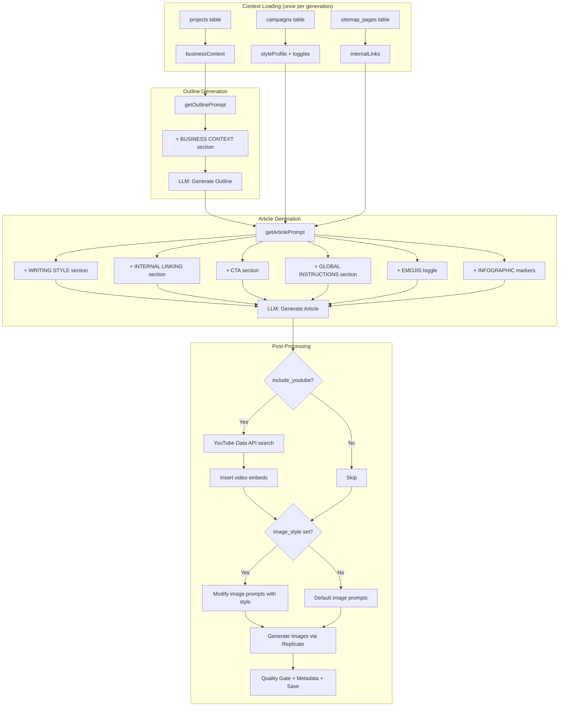
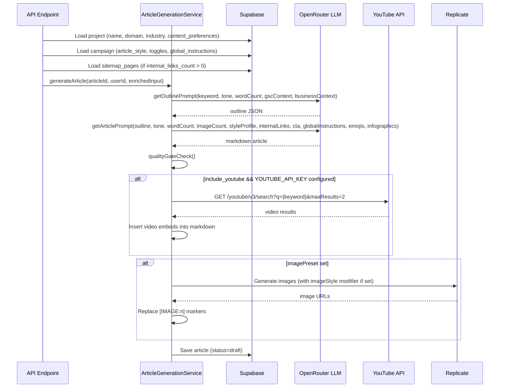

# PRD: Enhanced Article Generation Pipeline

**Status:** Draft
**Complexity Score:** 7 --> HIGH
**Created:** 2026-02-24
**Author:** Claude (Principal Architect)
**Series:** Outrank Feature Parity (6 of 6)
**Depends On:** PRD 1 (Schema -- `campaigns` columns, `sitemap_pages` table), PRD 2 (Website Intelligence -- style analysis + sitemap crawl data), PRD 4 (Enhanced Onboarding -- business context + campaign settings)
**Blocks:** None (final PRD in the series)

---

## Complexity Assessment

| Factor | Score | Notes |
|---|---|---|
| Files touched | 4 | Prompt templates, generation service, types, env config |
| New services | 1 | YouTube search helper (optional, ~50 LOC) |
| Schema changes | 0 | All columns already exist from PRD 1 |
| External APIs | 1 | YouTube Data API v3 (optional) |
| Risk | Low | All changes are additive -- existing generation still works with no new context |
| Test surface | Medium | 9 prompt section builders, 1 YouTube integration, backward compatibility |

**Total: 7 --> HIGH** (many prompt sections, but each one is simple string concatenation with a null guard)

---

## Integration Points Checklist

| # | Integration Point | Direction | Status |
|---|---|---|---|
| 1 | `projects` table -- `name`, `domain`, `industry` columns | Read | Exists |
| 2 | `projects.content_preferences` JSONB -- `description`, `audiences` fields | Read | Created by PRD 4 onboarding |
| 3 | `campaigns.article_style` JSONB column | Read | Created by PRD 1 schema |
| 4 | `campaigns.internal_links_count` integer column | Read | Created by PRD 1 schema |
| 5 | `campaigns.global_instructions` text column | Read | Created by PRD 1 schema |
| 6 | `campaigns.include_cta` boolean column | Read | Created by PRD 1 schema |
| 7 | `campaigns.include_youtube` boolean column | Read | Created by PRD 1 schema |
| 8 | `campaigns.include_emojis` boolean column | Read | Created by PRD 1 schema |
| 9 | `campaigns.include_infographics` boolean column | Read | Created by PRD 1 schema |
| 10 | `campaigns.image_style` text column | Read | Created by PRD 1 schema |
| 11 | `campaigns.brand_color` text column | Read | Created by PRD 1 schema |
| 12 | `sitemap_pages` table -- `url`, `title`, `meta_description` | Read | Created by PRD 1 schema, populated by PRD 2 crawler |
| 13 | YouTube Data API v3 | External API call | New (optional) |
| 14 | `shared/config/env.ts` -- `YOUTUBE_API_KEY` | Read | New env var |
| 15 | `server/services/prompts/article-prompts.ts` | Modify | Existing |
| 16 | `server/services/article-generation.service.ts` | Modify | Existing |
| 17 | `shared/types/article.types.ts` | Modify | Existing |
| 18 | `server/services/prompts/image-prompts.ts` | Modify | Existing |

---

## 1. Context

### Problem

The current article generation pipeline produces generic content. It knows the keyword, tone, word count, and optionally some GSC context -- but nothing about the business itself, the desired writing style, the site's internal pages, or campaign-level preferences like CTAs, YouTube embeds, or emoji usage.

PRDs 1 through 5 have built the infrastructure to collect all of this context:

- **PRD 1 (Schema):** Added columns to `campaigns` for `article_style`, `internal_links_count`, `global_instructions`, `include_cta`, `include_youtube`, `include_emojis`, `include_infographics`, `image_style`, `brand_color`. Created `sitemap_pages` table.
- **PRD 2 (Website Intelligence):** Crawls the user's sitemap and stores pages in `sitemap_pages`. Analyzes example articles to derive an `article_style` profile.
- **PRD 3 (GSC Competitor Analysis):** Enriches keyword context (already integrated via `gscContext`).
- **PRD 4 (Enhanced Onboarding):** Collects business description, target audiences, and industry during project setup. Stores in `projects.content_preferences` and `projects.industry`.
- **PRD 5 (Campaign Builder):** UI for setting all campaign-level toggles (CTA, YouTube, emojis, etc.).

The data is there. This PRD connects the pipeline to use it.

### Current Pipeline

```
keyword + tone + wordCount + gscContext?
         |
         v
   getOutlinePrompt()     --> LLM --> outline JSON
         |
         v
   getArticlePrompt()     --> LLM --> markdown article
         |
         v
   qualityGateCheck()     --> pass/fail (retry once if fail)
         |
         v
   generateImages()       --> Replicate --> replace [IMAGE:n] markers
         |
         v
   extractMetadata()      --> word count, SEO score, embeddings, QA
         |
         v
   saveArticle()          --> status = 'draft' | 'qa_passed' | 'qa_failed'
```

### What This PRD Adds

```
keyword + tone + wordCount + gscContext?
  + businessContext (name, description, audiences, industry)
  + styleProfile (tone, formality, vocabulary, etc.)
  + internalLinks (title + URL pairs from sitemap_pages)
  + globalInstructions (free-text campaign instructions)
  + includeCta (boolean + domain)
  + includeEmojis (boolean)
  + includeInfographics (boolean)
  + imageStyle (string override for image prompts)
         |
         v
   getOutlinePrompt()     --> + BUSINESS CONTEXT section
         |
         v
   getArticlePrompt()     --> + WRITING STYLE + INTERNAL LINKING + CTA
                               + GLOBAL INSTRUCTIONS + EMOJIS toggle
                               + INFOGRAPHIC markers
         |
         v
   qualityGateCheck()     --> (unchanged)
         |
         v
   generateImages()       --> + imageStyle modifier on prompts
         |
         v
   youtubeEmbed()         --> (NEW, post-generation, optional)
         |
         v
   extractMetadata()      --> (unchanged)
         |
         v
   saveArticle()          --> (unchanged)
```

### Files Analyzed

| File | Purpose | Changes Needed |
|---|---|---|
| `server/services/prompts/article-prompts.ts` | Outline + article prompt construction | Add 8 new optional prompt sections |
| `server/services/article-generation.service.ts` | Orchestrates the generation pipeline | Load context before generation, post-process YouTube |
| `shared/types/article.types.ts` | `IGenerateArticleInput` type definition | Extend with new context fields |
| `shared/config/env.ts` | Environment variable schema | Add `YOUTUBE_API_KEY` |
| `server/services/prompts/image-prompts.ts` | Image prompt generation | Accept `imageStyle` override |
| `src/pages/api/articles/generate.ts` | API endpoint for single article gen | Load context from project + campaign |
| `src/pages/api/campaigns/[campaignId]/start.ts` | Bulk generation endpoint | Load context once, pass to all articles |

---

## 2. Solution

### Architecture Diagram



### Sequence Flow



### Key Design Decisions

1. **All new prompt sections are optional.** If a field is null/undefined, the corresponding section is simply not injected. Existing articles generate identically to today.

2. **Context loading happens at the API layer, not inside the generation service.** The API endpoint (or campaign start handler) queries the project, campaign, and sitemap data, then passes it as part of `IGenerateArticleInput`. This keeps the generation service stateless and testable.

3. **Internal link selection uses simple keyword matching, not embeddings.** We compare the article keyword against sitemap page titles using `ILIKE` or basic string containment. This keeps the query under 10ms CPU and avoids an extra OpenAI API call. Relevance is "good enough" because sitemap pages already belong to the same domain.

4. **YouTube integration is optional and non-blocking.** If `YOUTUBE_API_KEY` is not configured, the step is skipped entirely. If the API call fails, the article is saved without video embeds. No credits are affected.

5. **Image style is a prompt modifier, not a new image model.** The existing Replicate pipeline is unchanged. We just prepend a style phrase (e.g., "watercolor painting style") to each image prompt before sending it to Replicate.

6. **Infographic markers are placeholders only.** Actual infographic generation is a future feature. For now, the LLM places `[INFOGRAPHIC:n]` markers with data descriptions, similar to how `[IMAGE:n]` markers work. These markers are left in the markdown for future processing.

---

## 3. Detailed Design

### 3.1 Extend `IGenerateArticleInput`

**File:** `shared/types/article.types.ts`

Add new optional fields to the existing interface:

```typescript
/**
 * Style profile analyzed from example articles (PRD 2)
 */
export interface IAnalyzedStyle {
  tone: string;
  formalityLevel: string;
  vocabularyComplexity: string;
  sentenceStructure: string;
  useOfExamples: string;
  perspective: string;
  technicalDepth: string;
  summary: string;
}

/**
 * Internal link candidate from sitemap_pages table
 */
export interface IInternalLink {
  title: string;
  url: string;
}

/**
 * Business context from project settings (PRD 4 onboarding)
 */
export interface IBusinessContext {
  name: string;
  description: string;
  audiences: string[];
  industry: string | null;
}

/**
 * Input for article generation API
 */
export interface IGenerateArticleInput {
  // ... existing fields (keyword, projectId, campaignId, model, tone, etc.)

  /** Business context from project (name, description, audiences, industry) */
  businessContext?: IBusinessContext;
  /** Writing style profile derived from example articles */
  styleProfile?: IAnalyzedStyle | null;
  /** Internal link candidates from sitemap_pages */
  internalLinks?: IInternalLink[];
  /** Free-text global instructions for all articles in this campaign */
  globalInstructions?: string | null;
  /** Whether to include a CTA section at the end */
  includeCta?: boolean;
  /** Domain for CTA (e.g., "example.com") */
  ctaDomain?: string | null;
  /** Whether to search and embed YouTube videos */
  includeYoutube?: boolean;
  /** Whether to include emojis in headings and key points */
  includeEmojis?: boolean;
  /** Whether to include infographic placeholder markers */
  includeInfographics?: boolean;
  /** Image style override (e.g., 'watercolor', 'cinematic') */
  imageStyle?: string | null;
  /** Brand color for 'brand_text' image style */
  brandColor?: string | null;
}
```

### 3.2 Prompt Section Builders

**File:** `server/services/prompts/article-prompts.ts`

Each new prompt section is a pure function that returns a string or empty string. This keeps the prompt construction clean and testable.

#### 3.2.1 Business Context (outline prompt)

```typescript
/**
 * Build BUSINESS CONTEXT section for the outline prompt.
 * Injected when project has business details configured.
 */
export function buildBusinessContextSection(
  context?: IBusinessContext
): string {
  if (!context?.name && !context?.description) {
    return '';
  }

  const lines: string[] = ['BUSINESS CONTEXT:'];

  if (context.name) {
    lines.push(`Company: ${context.name}`);
  }
  if (context.description) {
    lines.push(`Description: ${context.description}`);
  }
  if (context.audiences && context.audiences.length > 0) {
    lines.push(`Target Audience: ${context.audiences.join(', ')}`);
  }
  if (context.industry) {
    lines.push(`Industry: ${context.industry}`);
  }

  lines.push('');
  lines.push(
    'Write content that speaks directly to this audience and aligns with the business value proposition.'
  );

  return '\n\n' + lines.join('\n');
}
```

**Before (current outline prompt):**

```
You are an expert SEO content strategist. Generate a structured article outline for the given keyword.
The outline must be optimized for search engine ranking.

Requirements:
- Title: Compelling, keyword-rich, 50-60 characters
...
```

**After (with business context):**

```
You are an expert SEO content strategist. Generate a structured article outline for the given keyword.
The outline must be optimized for search engine ranking.

BUSINESS CONTEXT:
Company: Acme Cloud Solutions
Description: Enterprise cloud migration and DevOps consulting for mid-market companies
Target Audience: CTOs, VP Engineering, DevOps leads
Industry: Technology

Write content that speaks directly to this audience and aligns with the business value proposition.

Requirements:
- Title: Compelling, keyword-rich, 50-60 characters
...
```

#### 3.2.2 Writing Style (article prompt)

```typescript
/**
 * Build WRITING STYLE section for the article prompt.
 * Injected when campaign has an analyzed article style profile.
 */
export function buildStyleSection(
  styleProfile?: IAnalyzedStyle | null
): string {
  if (!styleProfile) {
    return '';
  }

  return `

WRITING STYLE:
Match this style profile:
- Tone: ${styleProfile.tone}
- Formality: ${styleProfile.formalityLevel}
- Vocabulary: ${styleProfile.vocabularyComplexity}
- Sentence structure: ${styleProfile.sentenceStructure}
- Use of examples: ${styleProfile.useOfExamples}
- Perspective: ${styleProfile.perspective}
- Technical depth: ${styleProfile.technicalDepth}

${styleProfile.summary}`;
}
```

**Before (current article prompt -- no style guidance beyond tone):**

```
Requirements:
- Write in professional tone
- Target approximately 1500 words
...
```

**After (with style profile):**

```
WRITING STYLE:
Match this style profile:
- Tone: conversational but authoritative
- Formality: semi-formal
- Vocabulary: accessible, avoids jargon unless defined
- Sentence structure: varied length, prefers short punchy sentences
- Use of examples: frequent real-world examples and analogies
- Perspective: second person (you/your)
- Technical depth: intermediate, assumes basic knowledge

Writes like a senior engineer explaining concepts to a junior colleague. Uses humor sparingly. Prefers concrete examples over abstract theory.

Requirements:
- Write in professional tone
- Target approximately 1500 words
...
```

#### 3.2.3 Internal Linking (article prompt)

```typescript
/**
 * Build INTERNAL LINKING section for the article prompt.
 * Injected when campaign has internal_links_count > 0 and relevant pages are found.
 */
export function buildInternalLinksSection(
  links?: IInternalLink[]
): string {
  if (!links || links.length === 0) {
    return '';
  }

  const linkList = links
    .map(link => `- ${link.title} --> ${link.url}`)
    .join('\n');

  return `

INTERNAL LINKING:
Naturally incorporate ${links.length} internal links to these related pages:
${linkList}

Rules:
- Use descriptive anchor text (not "click here" or "read more")
- Links should fit naturally in context -- do not force them
- Spread links across different sections
- Each link should appear only once in the article`;
}
```

**Before:** (no internal linking instructions)

**After (with 3 internal links):**

```
INTERNAL LINKING:
Naturally incorporate 3 internal links to these related pages:
- Cloud Migration Checklist --> https://acme.com/blog/cloud-migration-checklist
- Kubernetes vs Docker Swarm --> https://acme.com/blog/kubernetes-vs-docker-swarm
- DevOps Cost Calculator --> https://acme.com/tools/devops-cost-calculator

Rules:
- Use descriptive anchor text (not "click here" or "read more")
- Links should fit naturally in context -- do not force them
- Spread links across different sections
- Each link should appear only once in the article
```

#### 3.2.4 Global Instructions (article prompt)

```typescript
/**
 * Build ADDITIONAL INSTRUCTIONS section for the article prompt.
 * Injected when campaign has global_instructions set.
 */
export function buildGlobalInstructionsSection(
  instructions?: string | null
): string {
  if (!instructions || instructions.trim().length === 0) {
    return '';
  }

  return `

ADDITIONAL INSTRUCTIONS:
${instructions.trim()}

Follow these instructions for ALL content. They take priority over default guidelines.`;
}
```

**Before:** (no custom instructions)

**After (with global instructions):**

```
ADDITIONAL INSTRUCTIONS:
Always mention that Acme offers a free 30-day trial. Never compare directly to AWS or Azure by name -- use "major cloud providers" instead. Include at least one code snippet per article.

Follow these instructions for ALL content. They take priority over default guidelines.
```

#### 3.2.5 CTA Section (article prompt)

```typescript
/**
 * Build CALL TO ACTION section for the article prompt.
 * Injected when campaign has include_cta enabled.
 */
export function buildCtaSection(
  includeCta?: boolean,
  businessName?: string,
  ctaDomain?: string | null
): string {
  if (!includeCta) {
    return '';
  }

  const businessRef = businessName
    ? `Reference the business: ${businessName}${ctaDomain ? ` at ${ctaDomain}` : ''}`
    : ctaDomain
      ? `Reference the website: ${ctaDomain}`
      : 'Reference the business naturally';

  return `

CALL TO ACTION:
Include a compelling call-to-action section at the end of the article, before the conclusion.
- ${businessRef}
- Make the CTA relevant to the article topic
- Keep it 2-3 sentences maximum
- Format as a distinct section with a clear heading (e.g., "Ready to get started?" or "Take the next step")
- Do not be overly salesy -- keep it helpful and natural`;
}
```

**Before:** (no CTA)

**After (with CTA enabled):**

```
CALL TO ACTION:
Include a compelling call-to-action section at the end of the article, before the conclusion.
- Reference the business: Acme Cloud Solutions at acme.com
- Make the CTA relevant to the article topic
- Keep it 2-3 sentences maximum
- Format as a distinct section with a clear heading (e.g., "Ready to get started?" or "Take the next step")
- Do not be overly salesy -- keep it helpful and natural
```

#### 3.2.6 Emojis Toggle (article prompt -- modifies writing guidelines)

```typescript
/**
 * Build emoji instruction for the article prompt.
 * Overrides the default "no emojis" rule in writing guidelines.
 */
export function buildEmojiInstruction(
  includeEmojis?: boolean
): string {
  if (includeEmojis) {
    return '\n- Include relevant emojis in headings and key points to enhance visual appeal. Use 1-2 emojis per heading, not more.';
  }
  // Default: no emojis (already in FORBIDDEN_AI_PATTERNS, but reinforce here)
  return '';
}
```

This is injected into the Requirements block of the article prompt. When `includeEmojis` is true, it overrides the "No emojis in the content" rule from `FORBIDDEN_AI_PATTERNS`.

**Before (default -- emojis forbidden by writing guidelines):**

```
Requirements:
- Write in professional tone
- Target approximately 1500 words
- Use the EXACT headings from the outline...
```

**After (with emojis enabled):**

```
Requirements:
- Write in professional tone
- Target approximately 1500 words
- Include relevant emojis in headings and key points to enhance visual appeal. Use 1-2 emojis per heading, not more.
- Use the EXACT headings from the outline...
```

#### 3.2.7 Infographic Placeholders (article prompt)

```typescript
/**
 * Build DATA VISUALIZATION section for the article prompt.
 * Injected when campaign has include_infographics enabled.
 */
export function buildInfographicsSection(
  includeInfographics?: boolean
): string {
  if (!includeInfographics) {
    return '';
  }

  return `

DATA VISUALIZATION:
When the article contains statistics, comparisons, or numerical data:
- Add an [INFOGRAPHIC:n] marker where a data visualization would be helpful
- After each marker, add a markdown comment describing the data to visualize
- Format: [INFOGRAPHIC:1] <!-- Bar chart comparing X vs Y -->
- Include 1-2 infographic markers maximum
- Place markers on their own line with blank lines before and after
- Only add markers where data genuinely warrants visualization`;
}
```

**Before:** (no infographic markers)

**After (with infographics enabled -- example output in generated article):**

```markdown
## Cloud Migration Costs by Provider

The costs vary significantly across providers...

[INFOGRAPHIC:1] <!-- Bar chart comparing monthly costs: AWS ($2,400), GCP ($2,100), Azure ($2,300) for a typical mid-market workload -->

As the data shows, GCP tends to be slightly more cost-effective...
```

#### 3.2.8 Image Style Modifier (image prompts)

**File:** `server/services/prompts/image-prompts.ts`

```typescript
/**
 * Build image style modifier string to prepend to image prompts.
 * Returns empty string if no style override is set.
 */
export function buildImageStyleModifier(
  imageStyle?: string | null,
  brandColor?: string | null
): string {
  if (!imageStyle) {
    return '';
  }

  switch (imageStyle) {
    case 'brand_text':
      return brandColor
        ? `Brand-styled image with ${brandColor} color accent. `
        : 'Brand-styled image with clean corporate aesthetic. ';
    case 'watercolor':
      return 'Watercolor painting style with soft edges and flowing colors. ';
    case 'cinematic':
      return 'Cinematic photography style with dramatic lighting and shallow depth of field. ';
    case 'illustration':
      return 'Digital illustration style with clean lines and vibrant colors. ';
    case 'sketch':
      return 'Pencil sketch style with hand-drawn lines and crosshatching. ';
    default:
      return '';
  }
}
```

**Before (current image prompt generation):**

```
The images should match this style: professional imagery with sharp focus, clean composition, and good detail.
```

**After (with `image_style = 'watercolor'`):**

```
The images should match this style: Watercolor painting style with soft edges and flowing colors. professional imagery with sharp focus, clean composition, and good detail.
```

### 3.3 Modified Prompt Functions

#### `getOutlinePrompt()` -- add `businessContext` parameter

```typescript
export function getOutlinePrompt(
  keyword: string,
  tone: string = 'professional',
  targetWordCount: number = 1500,
  gscContext?: IGscArticleContext,
  businessContext?: IBusinessContext  // NEW
): string {
  const gscContextSection = gscContext
    ? `\n\n${buildStrategyPrompt(gscContext.articleStrategy, gscContext.metrics, gscContext.relatedQueries)}`
    : '';

  const businessSection = buildBusinessContextSection(businessContext);  // NEW

  return `You are an expert SEO content strategist. Generate a structured article outline for the given keyword.
The outline must be optimized for search engine ranking.${gscContextSection}${businessSection}

Requirements:
...`;
}
```

#### `getArticlePrompt()` -- add all new context parameters

```typescript
export function getArticlePrompt(
  outline: IArticleOutline,
  tone: string = 'professional',
  targetWordCount: number = 1500,
  imageCount: number = 0,
  // NEW optional parameters:
  options?: {
    styleProfile?: IAnalyzedStyle | null;
    internalLinks?: IInternalLink[];
    globalInstructions?: string | null;
    includeCta?: boolean;
    businessName?: string;
    ctaDomain?: string | null;
    includeEmojis?: boolean;
    includeInfographics?: boolean;
  }
): string {
  const writingGuidelines = buildWritingGuidelinesPrompt();
  const styleSection = buildStyleSection(options?.styleProfile);
  const linksSection = buildInternalLinksSection(options?.internalLinks);
  const instructionsSection = buildGlobalInstructionsSection(options?.globalInstructions);
  const ctaSection = buildCtaSection(options?.includeCta, options?.businessName, options?.ctaDomain);
  const emojiInstruction = buildEmojiInstruction(options?.includeEmojis);
  const infographicsSection = buildInfographicsSection(options?.includeInfographics);

  return `You are an expert SEO content writer. Write a comprehensive, well-researched article following the provided outline.

${writingGuidelines}${styleSection}${linksSection}${ctaSection}${instructionsSection}${infographicsSection}

Requirements:
- Write in ${tone} tone
- Target approximately ${targetWordCount} words${emojiInstruction}
- Use the EXACT headings from the outline...
...`;
}
```

**Backward compatibility:** When `options` is undefined (all existing callers), every section builder returns an empty string. The prompt is identical to today.

### 3.4 Context Loading in the API Layer

**File:** `src/pages/api/articles/generate.ts` (and `src/pages/api/campaigns/[campaignId]/start.ts`)

Before calling `articleGenerationService.generateArticle()`, the API endpoint loads context:

```typescript
// Load project details for business context
const { data: project } = await supabaseAdmin
  .from('projects')
  .select('name, domain, industry, content_preferences')
  .eq('id', input.projectId)
  .eq('user_id', userId)
  .single();

// Load campaign settings
const { data: campaign } = await supabaseAdmin
  .from('campaigns')
  .select(`
    id, project_id, name, ai_model,
    article_style, internal_links_count, global_instructions,
    include_cta, include_youtube, include_emojis,
    include_infographics, image_style, brand_color
  `)
  .eq('id', input.campaignId)
  .eq('user_id', userId)
  .single();

// Load internal links from sitemap_pages if needed
let internalLinks: IInternalLink[] = [];
if (campaign.internal_links_count > 0) {
  internalLinks = await loadRelevantSitemapPages(
    campaign.project_id,
    input.keyword,
    campaign.internal_links_count
  );
}

// Build enriched input
const enrichedInput: IGenerateArticleInput = {
  ...input,
  model: resolvedModel,
  businessContext: {
    name: project.name,
    description: project.content_preferences?.description || '',
    audiences: project.content_preferences?.audiences || [],
    industry: project.industry || null,
  },
  styleProfile: campaign.article_style || null,
  internalLinks,
  globalInstructions: campaign.global_instructions || null,
  includeCta: campaign.include_cta || false,
  ctaDomain: project.domain || null,
  includeYoutube: campaign.include_youtube || false,
  includeEmojis: campaign.include_emojis || false,
  includeInfographics: campaign.include_infographics || false,
  imageStyle: campaign.image_style || null,
  brandColor: campaign.brand_color || null,
};

fireAndForget(
  locals,
  articleGenerationService.generateArticle(articleId, userId, enrichedInput)
);
```

### 3.5 Internal Link Selection

**New helper function** in the generation service or a small utility:

```typescript
/**
 * Load relevant sitemap pages for internal linking.
 * Uses simple keyword matching against page titles.
 * Efficient: single DB query with ILIKE, limited to N results.
 *
 * @param projectId - Project to scope the search
 * @param keyword - Article keyword to match against
 * @param count - Number of links to return
 */
async function loadRelevantSitemapPages(
  projectId: string,
  keyword: string,
  count: number
): Promise<IInternalLink[]> {
  // Split keyword into individual words for broader matching
  const words = keyword
    .toLowerCase()
    .split(/\s+/)
    .filter(w => w.length > 3); // Skip short words like "the", "and", "for"

  if (words.length === 0) {
    return [];
  }

  // Query sitemap_pages with keyword word matching on title
  // Use OR conditions: any word from the keyword appearing in the title
  const { data: pages } = await supabaseAdmin
    .from('sitemap_pages')
    .select('url, title')
    .eq('project_id', projectId)
    .not('title', 'is', null)
    .or(words.map(w => `title.ilike.%${w}%`).join(','))
    .limit(count * 2); // Fetch extra to allow deduplication

  if (!pages || pages.length === 0) {
    // Fallback: return random pages from the sitemap
    const { data: fallbackPages } = await supabaseAdmin
      .from('sitemap_pages')
      .select('url, title')
      .eq('project_id', projectId)
      .not('title', 'is', null)
      .limit(count);

    return (fallbackPages || []).map(p => ({
      title: p.title || p.url,
      url: p.url,
    }));
  }

  // Return top N results
  return pages.slice(0, count).map(p => ({
    title: p.title || p.url,
    url: p.url,
  }));
}
```

**Performance:** This is a single indexed DB query. The `sitemap_pages` table has an index on `project_id` (from PRD 1). The `ILIKE` filter runs server-side in Postgres. For a typical sitemap of 100-500 pages, this completes in well under 10ms.

### 3.6 YouTube Video Embedding

**New file:** `server/services/youtube.service.ts`

```typescript
/**
 * YouTube Video Search Service
 *
 * Searches YouTube Data API v3 for relevant videos to embed in articles.
 * Optional: only runs if YOUTUBE_API_KEY is configured.
 *
 * API quota: 10,000 units/day (free tier), search costs 100 units = 100 searches/day.
 */

import { serverEnv } from '@shared/config/env';

interface IYouTubeVideo {
  videoId: string;
  title: string;
  thumbnailUrl: string;
}

/**
 * Check if YouTube integration is configured.
 */
export function isYouTubeConfigured(): boolean {
  return !!serverEnv.YOUTUBE_API_KEY;
}

/**
 * Search YouTube for videos related to a keyword.
 *
 * @param keyword - Search query (article's primary keyword)
 * @param maxResults - Number of videos to return (1-2 recommended)
 * @returns Array of video results, or empty array on error
 */
export async function searchYouTubeVideos(
  keyword: string,
  maxResults: number = 2
): Promise<IYouTubeVideo[]> {
  if (!isYouTubeConfigured()) {
    return [];
  }

  try {
    const params = new URLSearchParams({
      part: 'snippet',
      q: keyword,
      type: 'video',
      maxResults: String(maxResults),
      key: serverEnv.YOUTUBE_API_KEY,
      videoEmbeddable: 'true',
      relevanceLanguage: 'en',
    });

    const response = await fetch(
      `https://www.googleapis.com/youtube/v3/search?${params}`
    );

    if (!response.ok) {
      console.warn(`[YouTube] API returned ${response.status}: ${response.statusText}`);
      return [];
    }

    const data = await response.json();

    return (data.items || []).map((item: any) => ({
      videoId: item.id.videoId,
      title: item.snippet.title,
      thumbnailUrl: item.snippet.thumbnails.medium.url,
    }));
  } catch (error) {
    console.error('[YouTube] Search failed:', error);
    return [];
  }
}

/**
 * Generate markdown embed for a YouTube video.
 * Uses linked thumbnail format (works in all markdown renderers).
 *
 * Format: [](youtube-url)
 */
export function formatYouTubeEmbed(video: IYouTubeVideo): string {
  const watchUrl = `https://www.youtube.com/watch?v=${video.videoId}`;
  const thumbnailUrl = `https://img.youtube.com/vi/${video.videoId}/0.jpg`;
  const safeTitle = video.title.replace(/[[\]]/g, ''); // Strip markdown-breaking chars

  return `[](${watchUrl})`;
}

/**
 * Insert YouTube video embeds into article markdown.
 * Places videos after the first and second H2 sections.
 *
 * @param markdown - Article markdown content
 * @param videos - YouTube videos to embed
 * @returns Modified markdown with video embeds
 */
export function insertYouTubeEmbeds(
  markdown: string,
  videos: IYouTubeVideo[]
): string {
  if (videos.length === 0) {
    return markdown;
  }

  const lines = markdown.split('\n');
  const h2Indices: number[] = [];

  // Find all H2 heading positions
  for (let i = 0; i < lines.length; i++) {
    if (lines[i].startsWith('## ')) {
      h2Indices.push(i);
    }
  }

  // Place first video after the content following the 2nd H2 (or end of first section)
  // Place second video after the content following the 4th H2 (or midpoint)
  const insertPositions: number[] = [];

  if (h2Indices.length >= 3 && videos.length >= 1) {
    insertPositions.push(h2Indices[2]); // Before 3rd H2
  } else if (h2Indices.length >= 2 && videos.length >= 1) {
    insertPositions.push(h2Indices[1]); // Before 2nd H2
  }

  if (h2Indices.length >= 5 && videos.length >= 2) {
    insertPositions.push(h2Indices[4]); // Before 5th H2
  } else if (h2Indices.length >= 4 && videos.length >= 2) {
    insertPositions.push(h2Indices[3]); // Before 4th H2
  }

  // Insert embeds in reverse order to preserve line indices
  let result = [...lines];
  for (let i = Math.min(insertPositions.length, videos.length) - 1; i >= 0; i--) {
    const embed = formatYouTubeEmbed(videos[i]);
    result.splice(insertPositions[i], 0, '', embed, '');
  }

  return result.join('\n');
}
```

### 3.7 Modified `generateArticle()` Pipeline

**File:** `server/services/article-generation.service.ts`

The changes to the main `generateArticle()` method are minimal. Two insertion points:

1. **Outline generation** -- pass `businessContext` to `getOutlinePrompt()`.
2. **Article generation** -- pass all new context fields via `options` to `getArticlePrompt()`.
3. **Post-generation** -- if `includeYoutube`, search and insert embeds.
4. **Image generation** -- if `imageStyle`, prepend style modifier to image prompts.

```typescript
// In generateOutline():
const systemPrompt = getOutlinePrompt(
  input.keyword,
  tone,
  targetWordCount,
  gscContext,
  input.businessContext  // NEW
);

// In generateFullArticle():
const systemPrompt = isRetry
  ? getArticleRetryPrompt(outline, tone, targetWordCount, imageCount, {
      styleProfile: input.styleProfile,
      internalLinks: input.internalLinks,
      globalInstructions: input.globalInstructions,
      includeCta: input.includeCta,
      businessName: input.businessContext?.name,
      ctaDomain: input.ctaDomain,
      includeEmojis: input.includeEmojis,
      includeInfographics: input.includeInfographics,
    })
  : getArticlePrompt(outline, tone, targetWordCount, imageCount, {
      styleProfile: input.styleProfile,
      internalLinks: input.internalLinks,
      globalInstructions: input.globalInstructions,
      includeCta: input.includeCta,
      businessName: input.businessContext?.name,
      ctaDomain: input.ctaDomain,
      includeEmojis: input.includeEmojis,
      includeInfographics: input.includeInfographics,
    });

// After article generation, before image generation:
if (input.includeYoutube) {
  try {
    const videos = await searchYouTubeVideos(input.keyword, 2);
    if (videos.length > 0) {
      finalContent = insertYouTubeEmbeds(finalContent, videos);
      console.log(
        `[ArticleGeneration] Inserted ${videos.length} YouTube embeds for article ${articleId}`
      );
    }
  } catch (error) {
    console.warn('[ArticleGeneration] YouTube embed insertion failed:', error);
    // Non-blocking: continue without videos
  }
}

// In generateImagesForArticle() -- pass imageStyle to prompt generation:
const styleModifier = buildImageStyleModifier(input.imageStyle, input.brandColor);
// Prepend to presetDescription when generating image prompts
const enhancedDescription = styleModifier + presetDescription;
```

### 3.8 Environment Variable

**File:** `shared/config/env.ts`

Add `YOUTUBE_API_KEY` to the server env schema:

```typescript
// In serverEnvSchema:
YOUTUBE_API_KEY: z.string().default(''),

// In loadServerEnv():
YOUTUBE_API_KEY: metaEnv.YOUTUBE_API_KEY || processEnv.YOUTUBE_API_KEY || '',
```

---

## 4. Execution Phases

### Phase 1: Type Extensions and Prompt Section Builders

**Goal:** Define the new types and build all prompt section functions. No behavioral changes yet.

**Files (4):**

| # | File | Change |
|---|---|---|
| 1 | `shared/types/article.types.ts` | Add `IAnalyzedStyle`, `IInternalLink`, `IBusinessContext` interfaces. Extend `IGenerateArticleInput` with new optional fields. |
| 2 | `server/services/prompts/article-prompts.ts` | Add 7 new section builder functions: `buildBusinessContextSection`, `buildStyleSection`, `buildInternalLinksSection`, `buildGlobalInstructionsSection`, `buildCtaSection`, `buildEmojiInstruction`, `buildInfographicsSection`. |
| 3 | `server/services/prompts/image-prompts.ts` | Add `buildImageStyleModifier()` function. |
| 4 | `shared/config/env.ts` | Add `YOUTUBE_API_KEY` to server env schema and loader. |

**Tests:**
- Unit test each section builder with valid input, null input, and empty input.
- Verify all builders return empty string when given null/undefined (backward compat).
- Verify `getOutlinePrompt()` and `getArticlePrompt()` still produce identical output when no new params are passed.

**Verification:** `yarn test` on prompt unit tests.

### Phase 2: Modify Prompt Functions (Backward Compatible)

**Goal:** Wire the section builders into `getOutlinePrompt()`, `getArticlePrompt()`, and `getArticleRetryPrompt()`. Still backward compatible -- no caller passes new params yet.

**Files (2):**

| # | File | Change |
|---|---|---|
| 1 | `server/services/prompts/article-prompts.ts` | Modify `getOutlinePrompt()` signature to accept optional `businessContext`. Modify `getArticlePrompt()` and `getArticleRetryPrompt()` signatures to accept optional `options` object. Inject section builders into prompt strings. |
| 2 | `server/services/article-generation.service.ts` | Update calls to `getOutlinePrompt()` and `getArticlePrompt()` to pass new fields from `IGenerateArticleInput`. Add `imageStyle`/`brandColor` pass-through to image generation. |

**Tests:**
- Snapshot test: generate prompts with no new context, verify identical to current output.
- Snapshot test: generate prompts with all new context fields populated, verify all sections appear.
- Snapshot test: generate prompts with partial context (e.g., only business context, no style).

**Verification:** `yarn test` + manual prompt inspection.

### Phase 3: Context Loading and API Integration

**Goal:** Load project/campaign context in the API layer and pass it to the generation service.

**Files (3):**

| # | File | Change |
|---|---|---|
| 1 | `src/pages/api/articles/generate.ts` | Expand campaign SELECT to include new columns. Build `enrichedInput` with business context, style, links, toggles. |
| 2 | `src/pages/api/campaigns/[campaignId]/start.ts` | Same context loading (once per campaign start, reused for all keywords). |
| 3 | `server/services/article-generation.service.ts` | Add `loadRelevantSitemapPages()` helper (or put it in a shared utility). |

**Tests:**
- API test: generate article with a project that has business context -- verify prompt includes it.
- API test: generate article with default campaign (no toggles) -- verify identical to current behavior.
- Unit test: `loadRelevantSitemapPages()` with mock data.

**Verification:** `yarn test` + `yarn verify`.

### Phase 4: YouTube Integration and Image Style

**Goal:** Add YouTube video embedding (post-generation) and image style modifier (pre-image-generation).

**Files (3):**

| # | File | Change |
|---|---|---|
| 1 | `server/services/youtube.service.ts` | New file: `isYouTubeConfigured()`, `searchYouTubeVideos()`, `formatYouTubeEmbed()`, `insertYouTubeEmbeds()`. |
| 2 | `server/services/article-generation.service.ts` | Add YouTube embed step after article generation (before image generation). Pass `imageStyle`/`brandColor` through to image prompt generation. |
| 3 | `server/services/image-generation.service.ts` | Accept optional `imageStyleModifier` in `generateImagesForArticle()`. Prepend to preset description in prompt generation call. |

**Tests:**
- Unit test: `searchYouTubeVideos()` with mocked fetch (success, error, empty).
- Unit test: `insertYouTubeEmbeds()` with sample markdown and 0, 1, 2 videos.
- Unit test: `formatYouTubeEmbed()` output format.
- Unit test: `buildImageStyleModifier()` for each style + null.
- Integration test: verify YouTube step is skipped when `YOUTUBE_API_KEY` is empty.
- Integration test: verify image prompts include style modifier when `imageStyle` is set.

**Verification:** `yarn test` + `yarn verify`.

---

## 5. Acceptance Criteria

### Backward Compatibility (CRITICAL)

- [ ] AC-1: Generating an article with the current `IGenerateArticleInput` (no new fields) produces identical prompts to the current codebase.
- [ ] AC-2: All existing tests pass without modification.
- [ ] AC-3: `getOutlinePrompt(keyword, tone, wordCount)` with no 4th/5th argument returns the same string as before.
- [ ] AC-4: `getArticlePrompt(outline, tone, wordCount, imageCount)` with no 5th argument returns the same string as before.

### Business Context Injection

- [ ] AC-5: When `businessContext` is provided with name + description + audiences, the outline prompt includes a `BUSINESS CONTEXT:` section.
- [ ] AC-6: When `businessContext` is null/undefined, no business context section appears.
- [ ] AC-7: Partial business context (e.g., name only, no description) still produces a valid section with available fields.

### Style Matching

- [ ] AC-8: When `styleProfile` is provided, the article prompt includes a `WRITING STYLE:` section with all style dimensions.
- [ ] AC-9: When `styleProfile` is null, no writing style section appears.

### Internal Linking

- [ ] AC-10: When `internalLinks` array has entries, the article prompt includes an `INTERNAL LINKING:` section with the correct count and link list.
- [ ] AC-11: When `internalLinks` is empty or undefined, no internal linking section appears.
- [ ] AC-12: `loadRelevantSitemapPages()` returns pages matching keyword words in title, limited to the requested count.
- [ ] AC-13: If no keyword-matching pages exist, falls back to random pages from the sitemap.

### Global Instructions

- [ ] AC-14: When `globalInstructions` is a non-empty string, the article prompt includes an `ADDITIONAL INSTRUCTIONS:` section.
- [ ] AC-15: When `globalInstructions` is null/empty/whitespace, no instructions section appears.

### CTA

- [ ] AC-16: When `includeCta` is true, the article prompt includes a `CALL TO ACTION:` section.
- [ ] AC-17: CTA section references business name and domain when available.
- [ ] AC-18: When `includeCta` is false/undefined, no CTA section appears.

### Emojis

- [ ] AC-19: When `includeEmojis` is true, the article prompt Requirements block includes an emoji instruction.
- [ ] AC-20: When `includeEmojis` is false/undefined, no emoji instruction is added (default "no emojis" rule from writing guidelines still applies).

### Infographics

- [ ] AC-21: When `includeInfographics` is true, the article prompt includes a `DATA VISUALIZATION:` section instructing the LLM to place `[INFOGRAPHIC:n]` markers.
- [ ] AC-22: When `includeInfographics` is false/undefined, no infographic section appears.
- [ ] AC-23: `[INFOGRAPHIC:n]` markers are preserved in the final article content (not stripped like `[IMAGE:n]` markers).

### YouTube Integration

- [ ] AC-24: When `includeYoutube` is true and `YOUTUBE_API_KEY` is configured, 1-2 YouTube video embeds are inserted into the article markdown.
- [ ] AC-25: YouTube embeds use the linked-thumbnail format: `[](url)`.
- [ ] AC-26: Videos are placed between sections (not inside lists or code blocks).
- [ ] AC-27: When `YOUTUBE_API_KEY` is not configured, YouTube step is silently skipped.
- [ ] AC-28: YouTube API failure does not fail the article generation -- the article is saved without videos.

### Image Style

- [ ] AC-29: When `imageStyle` is set (e.g., 'watercolor'), each image prompt is prefixed with the corresponding style modifier.
- [ ] AC-30: When `imageStyle` is null/undefined, image prompts are generated identically to current behavior.
- [ ] AC-31: `buildImageStyleModifier()` returns correct modifier for all 5 supported styles: 'brand_text', 'watercolor', 'cinematic', 'illustration', 'sketch'.

### API Layer

- [ ] AC-32: The `/api/articles/generate` endpoint loads project and campaign context before calling the generation service.
- [ ] AC-33: The `/api/campaigns/:id/start` endpoint loads context once per campaign start (not once per keyword).
- [ ] AC-34: Context loading adds at most 2 additional DB queries (project details + sitemap pages). Campaign details are already loaded for ownership check.

### Performance

- [ ] AC-35: Internal link selection query completes in under 10ms for sitemaps with up to 500 pages.
- [ ] AC-36: YouTube API call is non-blocking and does not increase article generation time by more than 2 seconds.
- [ ] AC-37: Prompt size increase is bounded: each section adds at most ~200 tokens. Total prompt increase is under 1,500 tokens even with all sections enabled.

---

## 6. Risks and Mitigations

| Risk | Impact | Mitigation |
|---|---|---|
| Larger prompts increase LLM cost per article | Low | Each section adds ~50-200 tokens. At $0.01/1K tokens, this is < $0.01 per article. Monitor token usage in `articles.token_count`. |
| YouTube API quota exhaustion (100 searches/day on free tier) | Medium | Track daily usage. If approaching quota, skip YouTube step gracefully. Consider caching results by keyword. |
| Internal link relevance is poor with simple keyword matching | Low | Fallback to random sitemap pages. Even loosely related internal links improve SEO. Embedding-based matching is a future upgrade. |
| Style profile instructions conflict with humanizer writing guidelines | Low | Style section is additive ("match this style") not contradictory. The writing guidelines (FORBIDDEN_AI_PATTERNS) still apply. If conflict arises, global instructions can override. |
| Emoji toggle contradicts FORBIDDEN_AI_PATTERNS "No emojis" rule | Low | When `includeEmojis` is true, the emoji instruction explicitly overrides the ban. The LLM sees the more specific instruction last and follows it. |

---

## 7. Future Enhancements (Out of Scope)

- **Embedding-based internal link selection:** Use OpenAI embeddings to find semantically similar pages instead of keyword matching. Better relevance but adds an API call.
- **Actual infographic generation:** Replace `[INFOGRAPHIC:n]` markers with generated chart images (e.g., via Chart.js server-side rendering or an infographic API).
- **YouTube API caching:** Cache search results by keyword to reduce quota usage.
- **Custom CTA templates:** Let users define their own CTA template with variables instead of relying on LLM generation.
- **Per-article style override:** Allow overriding the campaign-level style on a per-keyword basis.
